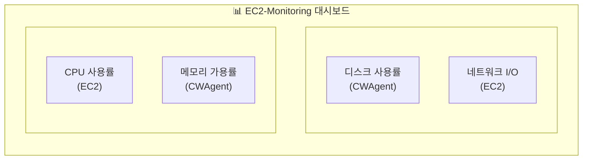

## 흩어진 메트릭을 한 화면에

[Part 1](/aws-ec2-monitoring-cloudwatch-guide-1/)에서 기본 모니터링과 CPU 알람을, [Part 2](/aws-ec2-cloudwatch-agent-memory-disk-monitoring-2/)에서 CloudWatch Agent로 메모리/디스크 모니터링을 설정했습니다. 이제 CPU, 메모리, 디스크, 네트워크 메트릭을 수집하고 있지만 확인하려면 여기저기 클릭해야 합니다.

이번 글에서는 **CloudWatch 대시보드**로 모든 메트릭을 한 화면에 정리하고, **CloudWatch Logs**로 서버 로그까지 수집해서 EC2 모니터링 시스템을 완성합니다.

## CloudWatch 대시보드 만들기

대시보드는 여러 메트릭을 위젯 형태로 배치해서 한눈에 볼 수 있는 화면입니다. EC2 인스턴스 상태를 파악하기 위해 꼭 필요한 메트릭들을 모아보겠습니다.

### 대시보드 생성

1.  AWS 콘솔에서 **CloudWatch** 서비스로 이동
2.  좌측 메뉴에서 **대시보드** 클릭
3.  **대시보드 생성** 버튼 클릭
4.  대시보드 이름 입력: `EC2-Monitoring` (알아보기 쉬운 이름)
5.  **대시보드 생성** 클릭


### 위젯 종류

대시보드에 추가할 수 있는 위젯 종류입니다.

| 위젯 | 용도 | 추천 상황 |
| --- | --- | --- |
| **라인** | 시간에 따른 변화 추적 | CPU, 메모리 사용률 추이 |
| **숫자** | 현재 값 표시 | 현재 디스크 사용률 |
| **게이지** | 임계값 대비 현재 상태 | 메모리 사용률 경고 수준 |
| **막대** | 비교 분석 | 여러 인스턴스 비교 |
| **텍스트** | 설명, 링크 추가 | 대시보드 안내문 |
| **로그 테이블** | 로그 쿼리 결과 | 최근 에러 로그 |

이 글에서는 **라인** 위젯을 주로 사용합니다. 시간에 따른 추이를 보기 좋고, 가장 범용적입니다.

### CPU 사용률 위젯 추가

1.  **위젯 추가** 또는 **+** 버튼 클릭
2.  **라인** 선택 > **다음**
3.  **지표** 탭 선택
4.  **EC2** > **인스턴스별 지표** 클릭
5.  대상 인스턴스의 `CPUUtilization` 체크
6.  **위젯 생성** 클릭


### 메모리 가용률 위젯 추가

1.  **위젯 추가** > **라인** > **다음**
2.  **CWAgent** > **InstanceId** 클릭
3.  `mem_available_percent` 체크
4.  **위젯 생성** 클릭

> **💡 mem\_used\_percent vs mem\_available\_percent**
> 
> [Part 2](/aws-ec2-cloudwatch-agent-memory-disk-monitoring-2/)에서 설명했듯이, `mem_available_percent`가 실제 사용 가능한 메모리를 더 정확하게 반영합니다. 대시보드에서도 이 메트릭을 사용하는 것을 권장합니다.

### 디스크 사용률 위젯 추가

1.  **위젯 추가** > **라인** > **다음**
2.  **CWAgent** > **InstanceId, device, fstype, path** 클릭
3.  `disk_used_percent` 체크
4.  **위젯 생성** 클릭

### 네트워크 I/O 위젯 추가

1.  **위젯 추가** > **라인** > **다음**
2.  **EC2** > **인스턴스별 지표** 클릭
3.  `NetworkIn`, `NetworkOut` 체크 (같은 위젯에 두 메트릭)
4.  **위젯 생성** 클릭

### 대시보드 레이아웃 정리

위젯들을 드래그해서 원하는 위치로 배치할 수 있습니다. 레이아웃 예시:



레이아웃 정리가 끝나면 우측 상단의 **저장** 버튼을 꼭 클릭하세요.


### 시간 범위 설정

대시보드 상단에서 시간 범위를 설정할 수 있습니다.

-   **1h, 3h, 12h**: 최근 이슈 확인
-   **1d, 3d, 1w**: 트렌드 분석
-   **사용자 지정**: 특정 기간 지정

기본값은 3시간(3h)입니다. 용도에 따라 조절하세요.

### 자동 새로고침

우측 상단의 새로고침 아이콘 옆 드롭다운에서 자동 새로고침 주기를 설정할 수 있습니다.

-   **끔**: 수동 새로고침만
-   **10초, 1분, 2분, 5분, 15분**: 자동 새로고침

실시간 모니터링이 필요하면 10초, 일반적인 용도면 5분을 권장합니다.

## CloudWatch Logs 기초

대시보드로 메트릭은 한눈에 볼 수 있게 되었습니다. 이제 서버에서 발생하는 **로그**도 수집해보겠습니다.

### 왜 로그 수집이 필요한가?

메트릭만으로는 알 수 없는 정보들이 있습니다.

| 상황 | 메트릭 | 로그 |
| --- | --- | --- |
| “CPU가 갑자기 올랐는데 원인이 뭐지?” | CPU 100% 확인 가능 | 어떤 프로세스/요청이 원인인지 확인 가능 |
| “서버에 누가 접속했지?” | 확인 불가 | SSH 로그인 기록 확인 가능 |
| “애플리케이션 에러가 났는데…” | 확인 불가 | 에러 메시지, 스택 트레이스 확인 가능 |

### 로그 그룹과 로그 스트림

CloudWatch Logs의 구조를 이해하면 설정이 쉬워집니다.

```text
CloudWatch Logs
└── 로그 그룹 (Log Group): /ec2/syslog
    ├── 로그 스트림 (Log Stream): i-0abc123... (인스턴스 1)
    ├── 로그 스트림 (Log Stream): i-0def456... (인스턴스 2)
    └── 로그 스트림 (Log Stream): i-0ghi789... (인스턴스 3)
```

-   **로그 그룹**: 같은 종류의 로그를 묶는 컨테이너 (예: syslog, nginx-access)
-   **로그 스트림**: 로그 그룹 내에서 소스별로 구분 (예: 인스턴스별)

### 보존 기간 설정

로그는 저장 용량에 따라 비용이 발생합니다. CloudWatch 콘솔에서 로그 그룹별로 보존 기간을 설정할 수 있습니다.

**설정 위치**: CloudWatch > 로그 > 로그 그룹 > 로그 그룹 선택 > 작업 > 보존 설정 편집

| 보존 기간 | 용도 |
| --- | --- |
| 1일 ~ 1주 | 디버깅, 임시 로그 |
| 1개월 | 일반 운영 로그 |
| 3개월 ~ 1년 | 감사, 컴플라이언스 |
| 무기한 | 장기 보관 필요 시 (비용 주의) |

기본값은 **무기한** (Never expire) 이므로, 비용 관리를 위해 적절한 보존 기간을 설정하는 것이 좋습니다.

## Agent로 로그 수집 설정

[Part 2](/aws-ec2-cloudwatch-agent-memory-disk-monitoring-2/)에서 설치한 CloudWatch Agent로 로그도 수집할 수 있습니다. 기존 설정 파일에 `logs` 섹션을 추가하면 됩니다.

### config.json 수정

기존 config.json을 열어서 `logs` 섹션을 추가합니다.

```bash
sudo vi /opt/aws/amazon-cloudwatch-agent/bin/config.json
```

전체 설정 파일:

```json
{
  "agent": {
    "metrics_collection_interval": 60
  },
  "metrics": {
    "namespace": "CWAgent",
    "append_dimensions": {
      "InstanceId": "${aws:InstanceId}"
    },
    "metrics_collected": {
      "mem": {
        "measurement": [
          "mem_used_percent",
          "mem_available_percent"
        ],
        "metrics_collection_interval": 60
      },
      "disk": {
        "measurement": [
          "disk_used_percent",
          "disk_free"
        ],
        "metrics_collection_interval": 60,
        "resources": [
          "/"
        ]
      },
      "cpu": {
        "measurement": [
          "cpu_usage_active",
          "cpu_usage_idle"
        ],
        "metrics_collection_interval": 60,
        "totalcpu": true
      },
      "swap": {
        "measurement": [
          "swap_used_percent"
        ],
        "metrics_collection_interval": 60
      }
    }
  },
  "logs": {
    "logs_collected": {
      "files": {
        "collect_list": [
          {
            "file_path": "/var/log/syslog",
            "log_group_name": "/ec2/syslog",
            "log_stream_name": "{instance_id}",
            "timestamp_format": "%b %d %H:%M:%S"
          }
        ]
      }
    }
  }
}
```

> **💡 run\_as\_user를 생략하면?**
> 
> `run_as_user`를 지정하지 않으면 CloudWatch Agent는 기본값인 **root 권한**으로 실행됩니다. root로 실행하면 `/var/log/syslog`, `/var/log/auth.log`, Docker 로그 등 대부분의 로그 파일을 별도 권한 설정 없이 읽을 수 있습니다. ([AWS 문서 참고](https://docs.aws.amazon.com/AmazonCloudWatch/latest/monitoring/CloudWatch-Agent-Configuration-File-Details.html))
> 
> Wizard로 설정하면 기본적으로 `"run_as_user": "cwagent"`가 설정되어 권한 문제가 생길 수 있습니다. 이 경우 [트러블슈팅](#wizard%EB%A1%9C-%EC%84%A4%EC%A0%95-%EC%8B%9C-%EB%A1%9C%EA%B7%B8-%EA%B6%8C%ED%95%9C-%EB%AC%B8%EC%A0%9C) 섹션을 참고하세요.

### 로그 설정 항목 설명

| 항목 | 설명 | 예시 |
| --- | --- | --- |
| `file_path` | 수집할 로그 파일 경로 | `/var/log/syslog` |
| `log_group_name` | CloudWatch 로그 그룹 이름 | `/ec2/syslog` |
| `log_stream_name` | 로그 스트림 이름 (`{instance_id}`로 자동 설정) | `i-0abc123def456` |
| `timestamp_format` | 로그의 타임스탬프 형식 | `%b %d %H:%M:%S` |

> **💡 timestamp\_format**
> 
> syslog의 타임스탬프는 `Jan 5 14:30:00` 형식입니다. 이를 파싱하기 위해 `%b %d %H:%M:%S`를 사용합니다.
> 
> -   `%b`: 월 이름 약자 (Jan, Feb, …)
> -   `%d`: 일 (01-31)
> -   `%H:%M:%S`: 시:분:초

> **💡 metrics와 logs의 placeholder 문법 차이**
> 
> config.json에서 동적 값을 사용할 때 **섹션마다 문법이 다릅니다**:
> 
> | 섹션 | 문법 | 예시 |
> | --- | --- | --- |
> | **metrics** | `${aws:변수명}` | `"InstanceId": "${aws:InstanceId}"` |
> | **logs** | `{변수명}` | `"log_stream_name": "{instance_id}"` |
> 
> 이는 레거시 CloudWatch Logs agent와의 호환성 때문입니다. 자세한 내용은 [CloudWatch Agent 설정 상세 문서](https://docs.aws.amazon.com/AmazonCloudWatch/latest/monitoring/CloudWatch-Agent-Configuration-File-Details.html)와 [CloudWatch Logs agent 레퍼런스](https://docs.aws.amazon.com/AmazonCloudWatch/latest/logs/AgentReference.html)를 참고하세요.

### 여러 로그 파일 수집하기

`collect_list` 배열에 여러 로그를 추가할 수 있습니다.

```json
"collect_list": [
  {
    "file_path": "/var/log/syslog",
    "log_group_name": "/ec2/syslog",
    "log_stream_name": "{instance_id}",
    "timestamp_format": "%b %d %H:%M:%S"
  },
  {
    "file_path": "/var/log/auth.log",
    "log_group_name": "/ec2/auth",
    "log_stream_name": "{instance_id}",
    "timestamp_format": "%b %d %H:%M:%S"
  }
]
```

### Docker WordPress/MySQL 로그 수집하기

Docker Compose로 WordPress와 MySQL을 운영 중이라면 컨테이너 로그도 수집할 수 있습니다. Docker 기본 방식(json-file 드라이버)을 유지하면서 Agent로 수집하면 `docker logs` 명령어도 계속 사용할 수 있어서 추천합니다.

**Docker 로그 용량 관리 설정**

Docker는 기본적으로 로그 크기 제한이 없어서 디스크가 가득 찰 수 있습니다. `docker-compose.yml`에서 로그 용량을 제한하세요.

```yaml
# docker-compose.yml 예시
services:
  wordpress:
    image: wordpress
    container_name: wordpress
    logging:
      driver: "json-file"
      options:
        max-size: "10m"    # 파일 하나당 최대 10MB
        max-file: "3"      # 최대 3개 파일 유지
    # ... 나머지 설정

  db:
    image: mysql:8.0
    container_name: wordpress-db
    logging:
      driver: "json-file"
      options:
        max-size: "10m"
        max-file: "3"
    # ... 나머지 설정
```

> **💡 max-size와 max-file 동작 방식**
> 
> -   `max-size: "10m"`: 로그 파일이 10MB에 도달하면 자동으로 rotate
> -   `max-file: "3"`: 최대 3개 파일 유지 (`xxx-json.log`, `xxx-json.log.1`, `xxx-json.log.2`)
> -   **Docker가 알아서 rotate 해주므로** 별도의 logrotate 설정이 필요 없습니다
> -   컨테이너당 최대 디스크 사용량 = 10MB × 3 = **30MB**

설정 후 컨테이너 재생성:

```bash
docker compose down
docker compose up -d
```

> **💡 docker-compose vs docker compose**
> 
> `docker-compose` (하이픈 포함)는 V1으로 [2023년 6월에 지원이 종료](https://www.docker.com/blog/new-docker-compose-v2-and-v1-deprecation/)되었습니다. 현재는 `docker compose` (공백)를 사용하는 V2가 표준입니다.

**CloudWatch Agent 설정에 Docker 로그 추가**

`config.json`의 `collect_list`에 Docker 로그를 추가합니다.

```json
{
  "file_path": "/var/lib/docker/containers/*/*-json.log",
  "log_group_name": "/ec2/docker",
  "log_stream_name": "{instance_id}",
  "timestamp_format": "%Y-%m-%dT%H:%M:%S"
}
```

> **💡 와일드카드 사용해도 괜찮을까?**
> 
> **컨테이너가 2-3개면 괜찮습니다.** Agent는 [파일 수정 시간 기준으로 최신 파일만 푸시](https://docs.aws.amazon.com/AmazonCloudWatch/latest/monitoring/CloudWatch-Agent-Configuration-File-Details.html)하고, 변경이 없는 파일은 스캔만 하고 실제로 읽지 않습니다. WordPress + MySQL = 2개 컨테이너이므로 CPU 오버헤드가 크지 않습니다.
> 
> 또한 `docker compose down`을 실행하면 컨테이너와 함께 `/var/lib/docker/containers/<컨테이너ID>/` 디렉토리가 삭제되어 **로그 파일도 함께 삭제**됩니다. 즉, 로그 파일 수는 항상 현재 실행 중인 컨테이너 수와 동일하게 유지됩니다.
> 
> 다만 `**` (재귀 와일드카드)는 하위 디렉토리 전체를 스캔해서 [CPU 사용량이 높아질 수 있으니](https://repost.aws/knowledge-center/cloudwatch-agent-high-cpu) 피하세요. 위 경로처럼 각 레벨에 `*`만 사용하는 것이 좋습니다.

> **⚠️ docker compose down 시 로그 손실 주의**
> 
> | 명령어 | 컨테이너 | 로그 파일 |
> | --- | --- | --- |
> | `docker compose stop` | 중지 (유지) | **유지** |
> | `docker compose down` | **삭제** | **삭제** |
> | `docker compose restart` | 재시작 | **유지** |
> 
> `down` 실행 시 컨테이너가 삭제되면서 [로그 파일도 함께 삭제](https://signoz.io/guides/docker-logs-location/)됩니다. 중요한 로그는 CloudWatch Logs에 미리 수집되어 있어야 합니다. Agent가 실시간으로 수집하고 있으니 대부분 문제없지만, 삭제 직전 로그가 아직 전송되지 않았을 수 있습니다.

### Ubuntu 시스템 로그 기본 설정 (참고)

syslog와 auth.log는 Ubuntu의 logrotate가 자동으로 관리합니다. 기본 설정을 확인하려면:

```bash
cat /etc/logrotate.d/rsyslog
```

**Ubuntu 기본 설정** (22.04/24.04 기준):

| 옵션 | 값 | 의미 |
| --- | --- | --- |
| `rotate` | 4 | 최대 4개 파일 유지 |
| `weekly` | – | 매주 rotate |
| `compress` | – | 이전 파일은 gzip 압축 |

**결과**:

-   **보관 기간**: 약 4주 (weekly × 4)
-   **파일 형태**: `syslog`, `syslog.1`, `syslog.2.gz`, `syslog.3.gz`, `syslog.4.gz`
-   **용량**: 압축되므로 크게 걱정하지 않아도 됩니다

CloudWatch Agent는 현재 활성 파일(`syslog`, `auth.log`)만 수집하므로, rotate된 파일(`.1`, `.gz`)은 수집되지 않습니다. 이전 로그가 필요하면 CloudWatch Logs에서 확인하세요.

### Agent 재시작

설정 파일을 수정했으면 Agent를 재시작해야 적용됩니다.

```bash
sudo /opt/aws/amazon-cloudwatch-agent/bin/amazon-cloudwatch-agent-ctl \
  -a fetch-config \
  -m ec2 \
  -c file:/opt/aws/amazon-cloudwatch-agent/bin/config.json \
  -s
```

상태 확인:

```bash
sudo /opt/aws/amazon-cloudwatch-agent/bin/amazon-cloudwatch-agent-ctl -m ec2 -a status
```


## CloudWatch Logs에서 확인

Agent가 정상 실행되면 1-2분 후 CloudWatch Logs에서 로그를 확인할 수 있습니다.

### 로그 그룹 확인

1.  AWS 콘솔에서 **CloudWatch** 서비스로 이동
2.  좌측 메뉴에서 **로그** > **Log Management** 클릭
3.  `/ec2/syslog` 로그 그룹 클릭


### 로그 스트림에서 로그 보기

1.  로그 그룹 내에서 인스턴스 ID로 된 **로그 스트림** 클릭
2.  로그 이벤트 목록 확인


### 보존 기간 설정

1.  로그 그룹 선택
2.  **작업** > **보존 설정 편집** 클릭
3.  원하는 보존 기간 선택 (예: 1개월)
4.  **저장** 클릭

## CloudWatch Logs Insights로 로그 분석

로그가 쌓이면 원하는 정보를 찾기 어려워집니다. **Logs Insights**를 사용하면 SQL과 유사한 쿼리로 로그를 검색하고 분석할 수 있습니다.

### Logs Insights 시작하기

1.  CloudWatch 좌측 메뉴에서 **로그** > **Logs Insights** 클릭
2.  로그 그룹 선택: `/ec2/syslog`
3.  시간 범위 설정 (예: 1시간)

### 기본 쿼리

Logs Insights에 처음 들어가면 기본 쿼리가 표시됩니다.

```text
fields @timestamp, @message
| sort @timestamp desc
| limit 20
```

이 쿼리는 “최근 20개 로그를 시간 역순으로 보여달라”는 의미입니다.

**쿼리 실행** 버튼을 클릭하면 결과가 표시됩니다.


### 쿼리 문법

| 명령어 | 설명 | SQL 비교 |
| --- | --- | --- |
| `fields` | 표시할 필드 선택 | SELECT |
| `filter` | 조건으로 필터링 | WHERE |
| `sort` | 정렬 | ORDER BY |
| `limit` | 결과 개수 제한 | LIMIT |
| `stats` | 집계 함수 | GROUP BY + 집계 |

### 실용적인 쿼리 예제

**1\. 에러 로그 찾기**

```text
fields @timestamp, @message
| filter @message like /(?i)error/
| sort @timestamp desc
| limit 50
```

`(?i)error`는 대소문자 구분 없이 “error”를 포함하는 로그를 찾습니다.

**2\. SSH 로그인 시도 확인** (auth.log 수집 시)

```text
fields @timestamp, @message
| filter @message like /sshd/
| filter @message like /Accepted|Failed/
| sort @timestamp desc
| limit 50
```

**3\. 특정 시간대 로그 집계**

```text
fields @timestamp, @message
| stats count(*) as count by bin(1h)
| sort @timestamp desc
```

시간당 로그 발생 건수를 집계합니다. 이상 징후 탐지에 유용합니다.

**4\. 특정 키워드 제외하고 검색**

```text
fields @timestamp, @message
| filter @message not like /CRON/
| sort @timestamp desc
| limit 50
```

정기 실행되는 CRON 로그를 제외하고 검색합니다.

### 쿼리 저장하기

자주 사용하는 쿼리는 저장해두면 편리합니다.

1.  쿼리 작성 후 **저장** 버튼 클릭
2.  쿼리 이름 입력 (예: “에러 로그 검색”)
3.  **저장** 클릭

저장된 쿼리는 우측 **저장된 쿼리** 패널에서 불러올 수 있습니다.

## 대시보드에 로그 위젯 추가

Logs Insights 쿼리 결과를 대시보드에 추가할 수 있습니다.

### 로그 위젯 추가

1.  Logs Insights에서 원하는 쿼리 실행
2.  **작업** > **대시보드에 추가** 클릭
3.  대시보드 선택: `EC2-Monitoring`
4.  위젯 이름 입력 (예: “최근 에러 로그”)
5.  **대시보드에 추가** 클릭


이제 대시보드에서 메트릭과 함께 로그도 한눈에 확인할 수 있습니다.

## 비용 주의사항

CloudWatch Logs는 수집, 저장, 분석 각 단계에서 비용이 발생합니다.

### Free Tier 한도

CloudWatch의 무료 제공량은 **Always Free**로, 12개월 이후에도 계속 적용됩니다. ([AWS CloudWatch 요금 페이지](https://aws.amazon.com/ko/cloudwatch/pricing/) 참고)

| 항목 | 무료 제공량 | 유형 |
| --- | --- | --- |
| 로그 수집 | **5GB/월** | Always Free |
| 로그 저장 | **5GB/월** | Always Free |
| Logs Insights 쿼리 | **5GB 스캔/월** | Always Free |

> **💡 Always Free란?**
> 
> [AWS Free Tier에는 세 가지 유형](https://docs.aws.amazon.com/whitepapers/latest/how-aws-pricing-works/get-started-with-the-aws-free-tier.html)이 있습니다: 12개월 무료, 단기 평가판, **Always Free**. CloudWatch 로그는 Always Free로 분류되어 AWS 계정을 만든 지 12개월이 지나도 매월 5GB까지 무료로 사용할 수 있습니다.

### 비용 발생 구간 (서울 리전 기준)

| 항목 | 요금 |
| --- | --- |
| 로그 수집 | $0.76/GB |
| 로그 저장 | $0.0314/GB/월 |
| Logs Insights 쿼리 | $0.0076/GB 스캔 |

### 비용 절약 팁

1.  **보존 기간 설정**: 무기한 대신 1개월 등 적절한 기간 설정
2.  **필요한 로그만 수집**: 모든 로그가 아닌 필요한 것만 선택
3.  **와일드카드 주의**: `file_path`에 `*` 사용 시 예상보다 많은 로그 수집될 수 있음
4.  **Logs Insights 시간 범위**: 쿼리 시 필요한 시간 범위만 지정

> **💡 로그 용량 예측**
> 
> syslog 기준 t3.micro에서 하루 약 10-50MB 정도 발생합니다. 한 달이면 300MB-1.5GB 정도로, Free Tier 범위 내에서 운영 가능합니다. 단, 애플리케이션 로그까지 수집하면 용량이 크게 늘어날 수 있으니 주의하세요.

## 트러블슈팅

### 로그 그룹이 생성되지 않을 때

**1\. Agent 로그 확인**

```bash
sudo cat /opt/aws/amazon-cloudwatch-agent/logs/amazon-cloudwatch-agent.log | tail -50
```

`Permission denied` 에러가 보이면 로그 파일 읽기 권한 문제입니다.

**2\. IAM 역할 확인**

[Part 2](/aws-ec2-cloudwatch-agent-memory-disk-monitoring-2/)에서 연결한 `CloudWatchAgentServerPolicy`에는 로그 쓰기 권한이 포함되어 있습니다. 역할이 제대로 연결되어 있는지 확인하세요.

**3\. 로그 파일 경로 확인**

```bash
# 파일 존재 여부 확인
ls -la /var/log/syslog

# 최근 로그 확인
tail -10 /var/log/syslog
```

### Logs Insights 쿼리가 결과를 반환하지 않을 때

1.  **시간 범위 확인**: 로그가 수집된 시간과 쿼리 시간 범위가 맞는지 확인
2.  **로그 그룹 확인**: 올바른 로그 그룹을 선택했는지 확인
3.  **필터 조건 확인**: `filter` 조건이 너무 제한적이지 않은지 확인

### Wizard로 설정 시 로그 권한 문제

`amazon-cloudwatch-agent-config-wizard`로 config.json을 생성하면 기본적으로 `"run_as_user": "cwagent"`가 설정됩니다. cwagent 사용자는 시스템 로그나 Docker 로그를 읽을 권한이 없어서 로그 수집이 안 될 수 있습니다.

**증상 확인**

Agent 로그에서 `piping log from` 메시지가 해당 로그 파일에 대해 출력되지 않으면 권한 문제입니다.

```bash
sudo cat /opt/aws/amazon-cloudwatch-agent/logs/amazon-cloudwatch-agent.log | grep "piping"

# 정상: 각 로그 파일에 대해 piping 메시지가 출력됨
# I! [logagent] piping log from /ec2/syslog/...
# I! [logagent] piping log from /ec2/auth/...
```

**해결 방법 1: run\_as\_user 제거 (권장)**

이 글처럼 `run_as_user` 설정을 제거하면 Agent가 root로 실행되어 모든 로그를 읽을 수 있습니다.

```json
{
  "agent": {
    "metrics_collection_interval": 60
  },
  ...
}
```

**해결 방법 2: cwagent 사용자에 그룹 추가**

보안상 cwagent 사용자를 유지하고 싶다면 필요한 그룹 권한을 추가합니다.

```bash
# syslog, auth.log 읽기 권한 (adm 그룹)
sudo usermod -aG adm cwagent

# 그룹 변경 적용을 위해 Agent 재시작
sudo systemctl restart amazon-cloudwatch-agent
```

> **⚠️ Docker 로그는 그룹 추가로 해결되지 않습니다**
> 
> `/var/lib/docker/containers/` 디렉토리는 `root:root` 소유이고 그룹 권한이 `--x` (실행만)입니다. docker 그룹에 cwagent를 추가해도 읽기 권한이 없어서 로그 수집이 안 됩니다.
> 
> Docker 로그를 수집하려면 **방법 1** (run\_as\_user 제거) 을 사용하거나, ACL로 직접 권한을 부여해야 합니다:
> 
> ```javascript
> sudo setfacl -R -m u:cwagent:rx /var/lib/docker/containers/
> sudo setfacl -R -d -m u:cwagent:rx /var/lib/docker/containers/
> ```

> **💡 어떤 방법을 선택해야 할까?**
> 
> | 방법 | 장점 | 단점 |
> | --- | --- | --- |
> | **run\_as\_user 제거** | 간단함, 모든 로그 접근 가능 | Agent가 root로 실행됨 |
> | **권한 추가** | 최소 권한 원칙 | 시스템 로그만 가능, Docker 로그는 ACL 필요 |
> 
> **Docker 로그까지 수집한다면 방법 1을 권장합니다.** CloudWatch Agent는 AWS 공식 소프트웨어이고 로그 읽기/전송만 하므로, root로 실행해도 보안상 큰 문제는 없습니다.

## 정리

이번 글에서 다룬 내용을 정리합니다.

**CloudWatch 대시보드**는 여러 메트릭을 위젯으로 배치해서 한눈에 볼 수 있는 화면입니다. CPU, 메모리, 디스크, 네트워크 메트릭을 하나의 대시보드에 모아서 EC2 상태를 빠르게 파악할 수 있습니다.

**CloudWatch Logs**는 서버 로그를 수집하고 저장하는 서비스입니다. CloudWatch Agent config.json에 `logs` 섹션을 추가하면 원하는 로그 파일을 수집할 수 있습니다.

**Logs Insights**는 수집된 로그를 쿼리로 검색하고 분석하는 기능입니다. SQL과 유사한 문법으로 에러 로그 찾기, 패턴 분석 등을 할 수 있습니다.

**비용**은 로그 수집 5GB/월까지 무료이며, syslog 기준으로 t3.micro에서는 Free Tier 범위 내에서 운영 가능합니다.

### EC2 모니터링 시리즈 완성! 🎉

3편에 걸쳐 EC2 모니터링 시스템을 완성했습니다.

| Part | 내용 | 결과물 |
| --- | --- | --- |
| **[Part 1](/aws-ec2-monitoring-cloudwatch-guide-1/)** | 기본 모니터링 + CloudWatch 알람 | CPU 알람 |
| **[Part 2](/aws-ec2-cloudwatch-agent-memory-disk-monitoring-2/)** | CloudWatch Agent로 메모리/디스크 | 메모리 알람 |
| **Part 3** | 대시보드 + 로그 수집 | 통합 대시보드, 로그 수집 |

이제 EC2 인스턴스의 CPU, 메모리, 디스크, 네트워크 상태를 한눈에 파악하고, 문제 발생 시 알람을 받고, 로그를 분석해서 원인을 찾을 수 있는 모니터링 체계가 갖춰졌습니다.

## 참고 자료

-   [CloudWatch 대시보드 생성 – AWS 공식 문서](https://docs.aws.amazon.com/ko_kr/AmazonCloudWatch/latest/monitoring/create_dashboard.html)
-   [CloudWatch Agent 설정 파일 상세 – AWS 공식 문서](https://docs.aws.amazon.com/ko_kr/AmazonCloudWatch/latest/monitoring/CloudWatch-Agent-Configuration-File-Details.html)
-   [CloudWatch Logs Insights 쿼리 구문 – AWS 공식 문서](https://docs.aws.amazon.com/ko_kr/AmazonCloudWatch/latest/logs/CWL_QuerySyntax.html)
-   [CloudWatch Logs Insights 샘플 쿼리 – AWS 공식 문서](https://docs.aws.amazon.com/ko_kr/AmazonCloudWatch/latest/logs/CWL_QuerySyntax-examples.html)
-   [Amazon CloudWatch 요금](https://aws.amazon.com/ko/cloudwatch/pricing/)
