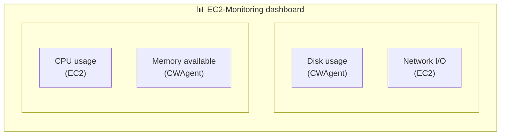

## Bringing Scattered Metrics onto One Screen

In [Part 1](/en/aws-ec2-monitoring-cloudwatch-guide-1/) we set up basic monitoring and a CPU alarm, and in [Part 2](/en/aws-ec2-cloudwatch-agent-memory-disk-monitoring-2/) we added memory and disk monitoring with the CloudWatch Agent. By now we're collecting CPU, memory, disk, and network metrics — but checking them means clicking around all over the place.

In this post we'll organize every metric onto a single screen with a **CloudWatch dashboard**, collect server logs with **CloudWatch Logs**, and complete the EC2 monitoring system.

## Creating a CloudWatch Dashboard

A dashboard is a screen where multiple metrics are laid out as widgets so you can see everything at a glance. Let's gather the metrics you really need to understand the state of an EC2 instance.

### Create the dashboard

1.  Go to the **CloudWatch** service in the AWS console
2.  Click **Dashboards** in the left menu
3.  Click the **Create dashboard** button
4.  Enter a dashboard name: `EC2-Monitoring` (something easy to recognize)
5.  Click **Create dashboard**


*Console shown in Korean — the layout and menu positions are identical in the English console.*

### Widget types

These are the widget types you can add to a dashboard.

| Widget | Purpose | When to use |
| --- | --- | --- |
| **Line** | Track changes over time | CPU and memory usage trends |
| **Number** | Show the current value | Current disk usage |
| **Gauge** | Current state against a threshold | Memory usage warning level |
| **Bar** | Comparisons | Comparing multiple instances |
| **Text** | Notes and links | Dashboard documentation |
| **Logs table** | Log query results | Recent error logs |

In this post I mainly use the **Line** widget. It's great for seeing trends over time and it's the most versatile.

### Add a CPU utilization widget

1.  Click **Add widget** or the **+** button
2.  Select **Line** > **Next**
3.  Select the **Metrics** tab
4.  Click **EC2** > **Per-Instance Metrics**
5.  Check `CPUUtilization` for the target instance
6.  Click **Create widget**


### Add a memory availability widget

1.  **Add widget** > **Line** > **Next**
2.  Click **CWAgent** > **InstanceId**
3.  Check `mem_available_percent`
4.  Click **Create widget**

> **💡 mem\_used\_percent vs mem\_available\_percent**
> 
> As explained in [Part 2](/en/aws-ec2-cloudwatch-agent-memory-disk-monitoring-2/), `mem_available_percent` more accurately reflects the memory that's actually available. I recommend using this metric on the dashboard as well.

### Add a disk usage widget

1.  **Add widget** > **Line** > **Next**
2.  Click **CWAgent** > **InstanceId, device, fstype, path**
3.  Check `disk_used_percent`
4.  Click **Create widget**

### Add a network I/O widget

1.  **Add widget** > **Line** > **Next**
2.  Click **EC2** > **Per-Instance Metrics**
3.  Check `NetworkIn` and `NetworkOut` (both metrics on the same widget)
4.  Click **Create widget**

### Arrange the dashboard layout

You can drag the widgets into whatever positions you like. Here's an example layout:



Once you're done arranging, make sure to click the **Save** button at the top right.


*Console shown in Korean — the layout and menu positions are identical in the English console.*

### Set the time range

You can set the time range at the top of the dashboard.

-   **1h, 3h, 12h**: checking recent issues
-   **1d, 3d, 1w**: trend analysis
-   **Custom**: a specific period

The default is 3 hours (3h). Adjust it to fit your use case.

### Auto refresh

In the dropdown next to the refresh icon at the top right, you can set the auto-refresh interval.

-   **Off**: manual refresh only
-   **10s, 1m, 2m, 5m, 15m**: auto refresh

I recommend 10 seconds if you need real-time monitoring, and 5 minutes for general use.

## CloudWatch Logs Basics

With the dashboard, metrics are now visible at a glance. Next, let's collect the **logs** the server produces.

### Why collect logs?

There's information that metrics alone can't tell you.

| Situation | Metrics | Logs |
| --- | --- | --- |
| "CPU suddenly spiked — what caused it?" | Can see CPU at 100% | Can see which process/request caused it |
| "Who logged into the server?" | Not available | SSH login history |
| "The application threw an error…" | Not available | Error messages and stack traces |

### Log groups and log streams

Understanding the structure of CloudWatch Logs makes the setup easier.

```text
CloudWatch Logs
└── Log Group: /ec2/syslog
    ├── Log Stream: i-0abc123... (instance 1)
    ├── Log Stream: i-0def456... (instance 2)
    └── Log Stream: i-0ghi789... (instance 3)
```

-   **Log group**: a container that groups logs of the same kind (e.g. syslog, nginx-access)
-   **Log stream**: a per-source subdivision within a log group (e.g. per instance)

### Set a retention period

Logs cost money based on how much you store. You can set a retention period per log group in the CloudWatch console.

**Where**: CloudWatch > Logs > Log groups > select a log group > Actions > Edit retention setting

| Retention | Use case |
| --- | --- |
| 1 day – 1 week | Debugging, temporary logs |
| 1 month | General operational logs |
| 3 months – 1 year | Audit, compliance |
| Never expire | Long-term archiving (watch the cost) |

The default is **Never expire**, so it's a good idea to set an appropriate retention period to keep costs under control.

## Configuring Log Collection with the Agent

The CloudWatch Agent we installed in [Part 2](/en/aws-ec2-cloudwatch-agent-memory-disk-monitoring-2/) can collect logs too. All you need is to add a `logs` section to the existing config file.

### Edit config.json

Open the existing config.json and add a `logs` section.

```bash
sudo vi /opt/aws/amazon-cloudwatch-agent/bin/config.json
```

The full config file:

```json
{
  "agent": {
    "metrics_collection_interval": 60
  },
  "metrics": {
    "namespace": "CWAgent",
    "append_dimensions": {
      "InstanceId": "${aws:InstanceId}"
    },
    "metrics_collected": {
      "mem": {
        "measurement": [
          "mem_used_percent",
          "mem_available_percent"
        ],
        "metrics_collection_interval": 60
      },
      "disk": {
        "measurement": [
          "disk_used_percent",
          "disk_free"
        ],
        "metrics_collection_interval": 60,
        "resources": [
          "/"
        ]
      },
      "cpu": {
        "measurement": [
          "cpu_usage_active",
          "cpu_usage_idle"
        ],
        "metrics_collection_interval": 60,
        "totalcpu": true
      },
      "swap": {
        "measurement": [
          "swap_used_percent"
        ],
        "metrics_collection_interval": 60
      }
    }
  },
  "logs": {
    "logs_collected": {
      "files": {
        "collect_list": [
          {
            "file_path": "/var/log/syslog",
            "log_group_name": "/ec2/syslog",
            "log_stream_name": "{instance_id}",
            "timestamp_format": "%b %d %H:%M:%S"
          }
        ]
      }
    }
  }
}
```

> **💡 What happens if you omit run\_as\_user?**
> 
> If you don't specify `run_as_user`, the CloudWatch Agent runs with its default: **root privileges**. Running as root lets it read most log files — `/var/log/syslog`, `/var/log/auth.log`, Docker logs, and so on — without any extra permission setup. (See the [AWS docs](https://docs.aws.amazon.com/AmazonCloudWatch/latest/monitoring/CloudWatch-Agent-Configuration-File-Details.html).)
> 
> If you configure the agent with the wizard, it sets `"run_as_user": "cwagent"` by default, which can cause permission problems. In that case, see the [troubleshooting](#log-permission-issues-when-configuring-via-the-wizard) section.

### Log configuration fields explained

| Field | Description | Example |
| --- | --- | --- |
| `file_path` | Path of the log file to collect | `/var/log/syslog` |
| `log_group_name` | CloudWatch log group name | `/ec2/syslog` |
| `log_stream_name` | Log stream name (set automatically via `{instance_id}`) | `i-0abc123def456` |
| `timestamp_format` | Timestamp format of the log | `%b %d %H:%M:%S` |

> **💡 timestamp\_format**
> 
> syslog timestamps look like `Jan 5 14:30:00`. To parse them we use `%b %d %H:%M:%S`.
> 
> -   `%b`: abbreviated month name (Jan, Feb, …)
> -   `%d`: day of the month (01-31)
> -   `%H:%M:%S`: hours:minutes:seconds

> **💡 Placeholder syntax differs between metrics and logs**
> 
> When you use dynamic values in config.json, **the syntax differs by section**:
> 
> | Section | Syntax | Example |
> | --- | --- | --- |
> | **metrics** | `${aws:VariableName}` | `"InstanceId": "${aws:InstanceId}"` |
> | **logs** | `{variable_name}` | `"log_stream_name": "{instance_id}"` |
> 
> This is for compatibility with the legacy CloudWatch Logs agent. For details, see the [CloudWatch Agent configuration file reference](https://docs.aws.amazon.com/AmazonCloudWatch/latest/monitoring/CloudWatch-Agent-Configuration-File-Details.html) and the [CloudWatch Logs agent reference](https://docs.aws.amazon.com/AmazonCloudWatch/latest/logs/AgentReference.html).

### Collecting multiple log files

You can add multiple logs to the `collect_list` array.

```json
"collect_list": [
  {
    "file_path": "/var/log/syslog",
    "log_group_name": "/ec2/syslog",
    "log_stream_name": "{instance_id}",
    "timestamp_format": "%b %d %H:%M:%S"
  },
  {
    "file_path": "/var/log/auth.log",
    "log_group_name": "/ec2/auth",
    "log_stream_name": "{instance_id}",
    "timestamp_format": "%b %d %H:%M:%S"
  }
]
```

### Collecting Docker WordPress/MySQL logs

If you run WordPress and MySQL with Docker Compose, you can collect the container logs too. I recommend keeping Docker's default approach (the json-file driver) and collecting with the Agent — that way the `docker logs` command keeps working as well.

**Limit Docker log size**

Docker has no log size limit by default, so your disk can fill up. Cap the log size in `docker-compose.yml`.

```yaml
# docker-compose.yml example
services:
  wordpress:
    image: wordpress
    container_name: wordpress
    logging:
      driver: "json-file"
      options:
        max-size: "10m"    # max 10MB per file
        max-file: "3"      # keep at most 3 files
    # ... rest of the config

  db:
    image: mysql:8.0
    container_name: wordpress-db
    logging:
      driver: "json-file"
      options:
        max-size: "10m"
        max-file: "3"
    # ... rest of the config
```

> **💡 How max-size and max-file work**
> 
> -   `max-size: "10m"`: the log file rotates automatically once it reaches 10MB
> -   `max-file: "3"`: keep at most 3 files (`xxx-json.log`, `xxx-json.log.1`, `xxx-json.log.2`)
> -   **Docker handles the rotation itself**, so no separate logrotate setup is needed
> -   Max disk usage per container = 10MB × 3 = **30MB**

Recreate the containers after changing the config:

```bash
docker compose down
docker compose up -d
```

> **💡 docker-compose vs docker compose**
> 
> `docker-compose` (with a hyphen) is V1, which [reached end of support in June 2023](https://www.docker.com/blog/new-docker-compose-v2-and-v1-deprecation/). The current standard is V2, invoked as `docker compose` (with a space).

**Add Docker logs to the CloudWatch Agent config**

Add the Docker logs to `collect_list` in `config.json`.

```json
{
  "file_path": "/var/lib/docker/containers/*/*-json.log",
  "log_group_name": "/ec2/docker",
  "log_stream_name": "{instance_id}",
  "timestamp_format": "%Y-%m-%dT%H:%M:%S"
}
```

> **💡 Is a wildcard okay here?**
> 
> **With 2-3 containers, yes.** The Agent [pushes only the most recently modified file](https://docs.aws.amazon.com/AmazonCloudWatch/latest/monitoring/CloudWatch-Agent-Configuration-File-Details.html) based on modification time, and files with no changes are merely scanned, not actually read. WordPress + MySQL = 2 containers, so the CPU overhead is small.
> 
> Also, when you run `docker compose down`, the `/var/lib/docker/containers/<container-id>/` directory is deleted along with the container — **including the log files**. In other words, the number of log files always matches the number of currently running containers.
> 
> That said, avoid `**` (the recursive wildcard) — it scans entire subdirectory trees and [can drive up CPU usage](https://repost.aws/knowledge-center/cloudwatch-agent-high-cpu). Stick to a single `*` at each path level, as in the path above.

> **⚠️ Beware of log loss on docker compose down**
> 
> | Command | Containers | Log files |
> | --- | --- | --- |
> | `docker compose stop` | Stopped (kept) | **Kept** |
> | `docker compose down` | **Deleted** | **Deleted** |
> | `docker compose restart` | Restarted | **Kept** |
> 
> When you run `down`, the containers are deleted and [the log files go with them](https://signoz.io/guides/docker-logs-location/). Important logs need to already be in CloudWatch Logs. Since the Agent collects in real time this is mostly fine, but logs written right before deletion may not have been shipped yet.

### Ubuntu system log defaults (for reference)

syslog and auth.log are managed automatically by Ubuntu's logrotate. To check the default settings:

```bash
cat /etc/logrotate.d/rsyslog
```

**Ubuntu defaults** (as of 22.04/24.04):

| Option | Value | Meaning |
| --- | --- | --- |
| `rotate` | 4 | Keep at most 4 files |
| `weekly` | – | Rotate weekly |
| `compress` | – | gzip older files |

**Result**:

-   **Retention**: about 4 weeks (weekly × 4)
-   **File layout**: `syslog`, `syslog.1`, `syslog.2.gz`, `syslog.3.gz`, `syslog.4.gz`
-   **Size**: compressed, so nothing to worry about

The CloudWatch Agent only collects the currently active files (`syslog`, `auth.log`), so rotated files (`.1`, `.gz`) are not collected. If you need older logs, look them up in CloudWatch Logs.

### Restart the Agent

After editing the config file, the Agent must be restarted for the changes to take effect.

```bash
sudo /opt/aws/amazon-cloudwatch-agent/bin/amazon-cloudwatch-agent-ctl \
  -a fetch-config \
  -m ec2 \
  -c file:/opt/aws/amazon-cloudwatch-agent/bin/config.json \
  -s
```

Check the status:

```bash
sudo /opt/aws/amazon-cloudwatch-agent/bin/amazon-cloudwatch-agent-ctl -m ec2 -a status
```


## Verifying in CloudWatch Logs

Once the Agent is running properly, the logs show up in CloudWatch Logs after 1-2 minutes.

### Check the log group

1.  Go to the **CloudWatch** service in the AWS console
2.  Click **Logs** > **Log Management** in the left menu
3.  Click the `/ec2/syslog` log group


*Console shown in Korean — the layout and menu positions are identical in the English console.*

### View logs in the log stream

1.  Inside the log group, click the **log stream** named after the instance ID
2.  Check the list of log events


*Console shown in Korean — the layout and menu positions are identical in the English console.*

### Set the retention period

1.  Select the log group
2.  Click **Actions** > **Edit retention setting**
3.  Choose the retention period you want (e.g. 1 month)
4.  Click **Save**

## Analyzing Logs with CloudWatch Logs Insights

As logs pile up, finding what you want gets harder. **Logs Insights** lets you search and analyze logs with SQL-like queries.

### Getting started with Logs Insights

1.  Click **Logs** > **Logs Insights** in the CloudWatch left menu
2.  Select a log group: `/ec2/syslog`
3.  Set a time range (e.g. 1 hour)

### The default query

When you first open Logs Insights, a default query is shown.

```text
fields @timestamp, @message
| sort @timestamp desc
| limit 20
```

This query means "show me the 20 most recent logs in reverse chronological order."

Click the **Run query** button and the results appear.


*Console shown in Korean — the layout and menu positions are identical in the English console.*

### Query syntax

| Command | Description | SQL equivalent |
| --- | --- | --- |
| `fields` | Select fields to display | SELECT |
| `filter` | Filter by condition | WHERE |
| `sort` | Sort | ORDER BY |
| `limit` | Limit the result count | LIMIT |
| `stats` | Aggregate functions | GROUP BY + aggregates |

### Practical query examples

**1\. Find error logs**

```text
fields @timestamp, @message
| filter @message like /(?i)error/
| sort @timestamp desc
| limit 50
```

The `(?i)` flag makes the match case-insensitive, so this finds logs containing "error" in any casing.

**2\. Check SSH login attempts** (if you collect auth.log)

```text
fields @timestamp, @message
| filter @message like /sshd/
| filter @message like /Accepted|Failed/
| sort @timestamp desc
| limit 50
```

**3\. Aggregate logs by time bucket**

```text
fields @timestamp, @message
| stats count(*) as count by bin(1h)
| sort @timestamp desc
```

This counts log events per hour. Useful for spotting anomalies.

**4\. Search while excluding a keyword**

```text
fields @timestamp, @message
| filter @message not like /CRON/
| sort @timestamp desc
| limit 50
```

This searches while excluding the CRON logs that run on a schedule.

### Saving queries

Saving your frequently used queries is convenient.

1.  Write the query, then click the **Save** button
2.  Enter a query name (e.g. "Error log search")
3.  Click **Save**

Saved queries can be loaded from the **Saved queries** panel on the right.

## Adding a Log Widget to the Dashboard

You can add Logs Insights query results to your dashboard.

### Add the log widget

1.  Run the query you want in Logs Insights
2.  Click **Actions** > **Add to dashboard**
3.  Select the dashboard: `EC2-Monitoring`
4.  Enter a widget name (e.g. "Recent error logs")
5.  Click **Add to dashboard**


*Console shown in Korean — the layout and menu positions are identical in the English console.*

Now the dashboard shows your logs right next to your metrics, all in one view.

## Cost Considerations

CloudWatch Logs charges at each stage: ingestion, storage, and analysis.

### Free Tier limits

CloudWatch's free allowance is **Always Free** — it continues to apply even after the first 12 months. (See the [AWS CloudWatch pricing page](https://aws.amazon.com/cloudwatch/pricing/).)

| Item | Free allowance | Type |
| --- | --- | --- |
| Log ingestion | **5GB/month** | Always Free |
| Log storage | **5GB/month** | Always Free |
| Logs Insights queries | **5GB scanned/month** | Always Free |

> **💡 What does Always Free mean?**
> 
> [The AWS Free Tier comes in three types](https://docs.aws.amazon.com/whitepapers/latest/how-aws-pricing-works/get-started-with-the-aws-free-tier.html): 12 months free, short-term trials, and **Always Free**. CloudWatch logs fall under Always Free, so you get 5GB per month at no charge even after your AWS account is more than 12 months old.

### What you pay beyond that (Seoul region)

| Item | Price |
| --- | --- |
| Log ingestion | $0.76/GB |
| Log storage | $0.0314/GB/month |
| Logs Insights queries | $0.0076/GB scanned |

### Cost-saving tips

1.  **Set a retention period**: pick something sensible like 1 month instead of Never expire
2.  **Collect only the logs you need**: select what matters instead of everything
3.  **Watch out for wildcards**: `*` in `file_path` can collect more logs than you expect
4.  **Limit Logs Insights time ranges**: query only the time window you actually need

> **💡 Estimating log volume**
> 
> For syslog on a t3.micro, expect roughly 10-50MB per day. That's about 300MB-1.5GB per month — comfortably within the Free Tier. But be careful: if you also collect application logs, the volume can grow significantly.

## Troubleshooting

### The log group isn't being created

**1\. Check the Agent log**

```bash
sudo cat /opt/aws/amazon-cloudwatch-agent/logs/amazon-cloudwatch-agent.log | tail -50
```

If you see a `Permission denied` error, the problem is read permission on the log file.

**2\. Check the IAM role**

The `CloudWatchAgentServerPolicy` we attached in [Part 2](/en/aws-ec2-cloudwatch-agent-memory-disk-monitoring-2/) includes log write permissions. Make sure the role is properly attached.

**3\. Check the log file path**

```bash
# Check that the file exists
ls -la /var/log/syslog

# Check recent logs
tail -10 /var/log/syslog
```

### Logs Insights queries return no results

1.  **Check the time range**: make sure the query's time range covers when the logs were collected
2.  **Check the log group**: make sure you selected the right log group
3.  **Check the filter conditions**: make sure your `filter` isn't too restrictive

### Log permission issues when configuring via the wizard

If you generate config.json with `amazon-cloudwatch-agent-config-wizard`, it sets `"run_as_user": "cwagent"` by default. The cwagent user has no permission to read system logs or Docker logs, so log collection can silently fail.

**Confirming the symptom**

If the Agent log doesn't print a `piping log from` message for a given log file, it's a permission problem.

```bash
sudo cat /opt/aws/amazon-cloudwatch-agent/logs/amazon-cloudwatch-agent.log | grep "piping"

# Healthy: a piping message is printed for each log file
# I! [logagent] piping log from /ec2/syslog/...
# I! [logagent] piping log from /ec2/auth/...
```

**Fix 1: Remove run\_as\_user (recommended)**

If you remove the `run_as_user` setting, as in this post, the Agent runs as root and can read all logs.

```json
{
  "agent": {
    "metrics_collection_interval": 60
  },
  ...
}
```

**Fix 2: Add the cwagent user to groups**

If you want to keep the cwagent user for security reasons, grant the necessary group permissions.

```bash
# Read access to syslog and auth.log (adm group)
sudo usermod -aG adm cwagent

# Restart the Agent so the group change takes effect
sudo systemctl restart amazon-cloudwatch-agent
```

> **⚠️ Group membership does not fix Docker logs**
> 
> The `/var/lib/docker/containers/` directory is owned by `root:root` and its group permission is `--x` (execute only). Even if you add cwagent to the docker group, it has no read permission and log collection won't work.
> 
> To collect Docker logs, use **Fix 1** (remove run\_as\_user), or grant permissions directly with ACLs:
> 
> ```bash
> sudo setfacl -R -m u:cwagent:rx /var/lib/docker/containers/
> sudo setfacl -R -d -m u:cwagent:rx /var/lib/docker/containers/
> ```

> **💡 Which approach should you choose?**
> 
> | Approach | Pros | Cons |
> | --- | --- | --- |
> | **Remove run\_as\_user** | Simple, access to all logs | Agent runs as root |
> | **Add permissions** | Principle of least privilege | System logs only; Docker logs need ACLs |
> 
> **If you're collecting Docker logs too, I recommend Fix 1.** The CloudWatch Agent is official AWS software and only reads and ships logs, so running it as root isn't a major security concern.

## Wrap-up

Here's a recap of what we covered in this post.

A **CloudWatch dashboard** is a screen where multiple metrics are laid out as widgets for at-a-glance visibility. By gathering CPU, memory, disk, and network metrics on one dashboard, you can quickly assess the state of your EC2 instance.

**CloudWatch Logs** is the service that collects and stores server logs. Add a `logs` section to the CloudWatch Agent's config.json and you can collect any log file you want.

**Logs Insights** lets you search and analyze the collected logs with queries. Its SQL-like syntax handles things like finding error logs and analyzing patterns.

**Cost**: log ingestion is free up to 5GB/month, and syslog on a t3.micro stays comfortably within the Free Tier.

### The EC2 Monitoring Series Is Complete! 🎉

Over three posts, we've built out a complete EC2 monitoring system.

| Part | Topic | Deliverable |
| --- | --- | --- |
| **[Part 1](/en/aws-ec2-monitoring-cloudwatch-guide-1/)** | Basic monitoring + CloudWatch alarms | CPU alarm |
| **[Part 2](/en/aws-ec2-cloudwatch-agent-memory-disk-monitoring-2/)** | Memory/disk via CloudWatch Agent | Memory alarm |
| **Part 3** | Dashboard + log collection | Unified dashboard, log collection |

You now have a monitoring setup that shows the CPU, memory, disk, and network state of your EC2 instance at a glance, alerts you when something goes wrong, and lets you dig into the logs to find the cause.

## References

-   [Create a CloudWatch dashboard – AWS official docs](https://docs.aws.amazon.com/AmazonCloudWatch/latest/monitoring/create_dashboard.html)
-   [CloudWatch Agent configuration file details – AWS official docs](https://docs.aws.amazon.com/AmazonCloudWatch/latest/monitoring/CloudWatch-Agent-Configuration-File-Details.html)
-   [CloudWatch Logs Insights query syntax – AWS official docs](https://docs.aws.amazon.com/AmazonCloudWatch/latest/logs/CWL_QuerySyntax.html)
-   [CloudWatch Logs Insights sample queries – AWS official docs](https://docs.aws.amazon.com/AmazonCloudWatch/latest/logs/CWL_QuerySyntax-examples.html)
-   [Amazon CloudWatch pricing](https://aws.amazon.com/cloudwatch/pricing/)
