> **Understanding the JVM Concurrency Model series**
> 
> 1.  **[Concurrency and Parallelism Fundamentals](/en/jvm-concurrency-model-1-fundamentals/) ← you are here**
> 2.  [Java's Traditional Concurrency Model](/en/jvm-concurrency-model-2-java-traditional-concurrency/)
> 3.  [Reactive Streams and Project Reactor](/en/jvm-concurrency-model-3-reactive-streams-reactor/)
> 4.  [Spring WebFlux](/en/jvm-concurrency-model-4-spring-webflux/)
> 5.  [Kotlin Coroutines](/en/jvm-concurrency-model-5-kotlin-coroutines/)
> 6.  [Spring + Coroutines — WebFlux, MVC, and the Limits of AOP](/en/jvm-concurrency-model-6-spring-coroutines/)
> 7.  [Virtual Threads — The Synchronous World's Answer](/en/jvm-concurrency-model-7-virtual-thread/)
> 8.  [Wrap-up — When to Choose What](/en/jvm-concurrency-model-8-conclusion-decision-framework/)

## The Fundamentals Every Spring Developer Should Have Down

You can be developing happily with Spring MVC, but the moment performance becomes a concern, you inevitably run into keywords like WebFlux, coroutines, and virtual threads. The docs are full of phrases like "asynchronous non-blocking", "reactive", and "lightweight threads" — yet when someone actually asks **what the difference between concurrency and parallelism is**, or **whether asynchronous means the same thing as non-blocking**, it's surprisingly hard to answer clearly.

This post is **the first in the Understanding the JVM Concurrency Model series**, and it establishes the **shared vocabulary** needed to understand everything that comes later: Java's concurrency model, Reactor, WebFlux, coroutines, and virtual threads. If these foundational concepts are shaky, the differences between those technologies become hard to grasp — so let's nail them down once and for all.

## Process and Thread — the Basic Units of Execution

### The Textbook Definitions

A **process** is a unit of execution that gets its own independent memory space from the operating system. Each process has its own virtual address space, file descriptors, signal handlers, and so on, and cannot directly access another process's memory.

A **thread** is a smaller unit of execution that runs inside a process. Threads within the same process **share memory**: they use the heap, global variables, and file descriptors together, while each thread keeps its own **stack** and **program counter**.

If it's been a while since you've dealt with the OS terms that just showed up, here's a quick refresher before we move on.

| Term | Description |
| --- | --- |
| **Virtual Address Space** | The "private memory area" the OS grants to each process. It's distinct from actual physical memory addresses — the OS handles the virtual-to-physical address translation. Thanks to this, a process can neither see nor touch another process's memory. |
| **Heap** | The memory region that is **dynamically allocated** during program execution. In Java, objects created with `new Object()` live here. Threads in the same process share the heap, so an object created by one thread can be referenced by another. |
| **Stack** | A memory region that **each thread owns independently**. Local variables, parameters, and return addresses are stored here on every method call, and cleaned up automatically when the method returns. Since every thread has its own, one thread's local variables aren't directly visible to another. |
| **Program Counter (PC)** | A register that points to **the address of the instruction the CPU is currently executing**. Each thread has its own. On a context switch this value must be saved and restored so the thread can resume from exactly where it left off. |
| **File Descriptor** | An **integer the OS assigns to identify I/O resources** such as files, sockets, and pipes. For example, open a file and the OS hands you the number `3`; from then on you read and write using that number. Threads in the same process share the file descriptor table. |
| **Signal Handler** | A function that handles **events** (signals) sent by the OS or other processes. Press `Ctrl+C` and a `SIGINT` signal is delivered to the process — the function that runs at that moment is the signal handler. You rarely deal with these directly in Java, but the JVM uses them internally. |
| **IPC (Inter-Process Communication)** | The umbrella term for **the mechanisms different processes use to exchange data**: pipes, sockets, message queues, shared memory, and so on. Because process memory is isolated, exchanging data requires an OS-provided IPC mechanism. Threads share memory, so they can communicate directly without IPC. |

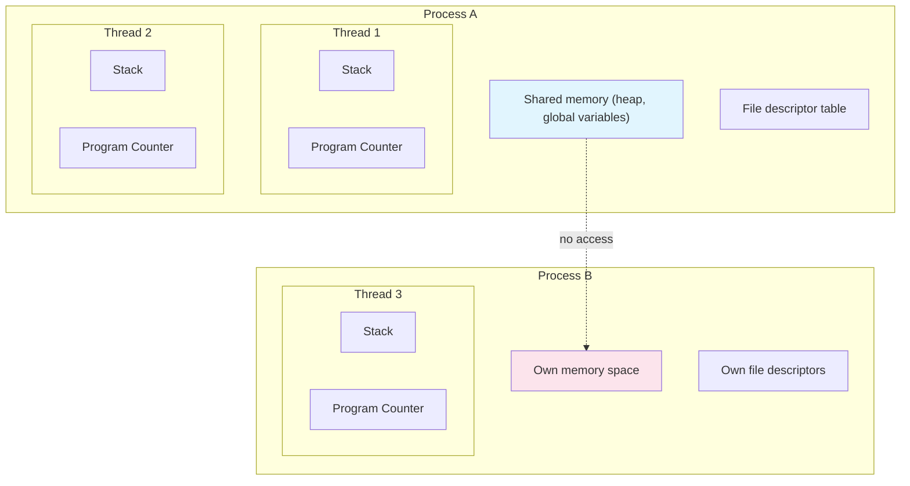

### Key Differences Between Process and Thread

| Aspect | Process | Thread |
| --- | --- | --- |
| **Memory** | Independent address space | Shared within the process |
| **Creation cost** | High (page tables, memory allocation, ...) | Low (roughly a stack allocation) |
| **Context switching** | Expensive (TLB flush, cache invalidation) | Cheap (swap registers and stack pointer) |
| **Communication** | Requires IPC (pipes, sockets, message queues) | Direct via shared memory |
| **Fault isolation** | Strong (one process crashes → others unaffected) | Weak (one thread crashes → whole process dies) |

The **difference in context-switching cost** matters most. Switching between processes means swapping page tables and flushing the TLB (Translation Lookaside Buffer), which takes roughly 10,000–100,000 CPU cycles. Switching between threads keeps the same address space and costs on the order of 100–1,000 cycles. This gap is the core reason multithreaded programming is preferred.

> **So when do you use multi-process vs multi-thread?**
> 
> When **fault isolation matters**, multi-process is the right fit. This is why web browsers (Chrome) put each tab in its own process — one tab crashing doesn't take the others down. When **performance and resource efficiency matter**, multithreading wins. For something like a web server that needs a new execution flow per request, spawning a process every time carries far too much overhead.

### Why Are Processes and Threads Almost the Same Thing on Linux?

Contrary to the textbook distinction, **the Linux kernel does not internally distinguish processes from threads.** Both are represented by the same data structure, `task_struct`, and the scheduler treats them identically. Linux calls both of them **"tasks"**.

This is possible thanks to the design of the `clone()` system call. Creating a process with `fork()` and creating a thread with `pthread_create()` both **call `clone()`** under the hood — the difference is a set of flags that finely control which resources get shared.

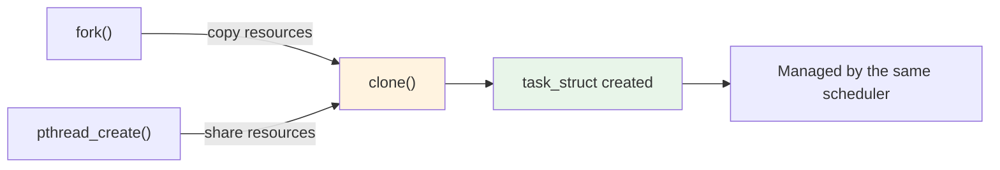

Looking at the key flags makes this structure even clearer.

| Flag | When set (thread-like) | When unset (process-like) |
| --- | --- | --- |
| **CLONE\_VM** | Shares the parent's virtual memory space | Copies memory via copy-on-write |
| **CLONE\_FILES** | Shares the file descriptor table | Copies the file descriptors |
| **CLONE\_SIGHAND** | Shares signal handlers | Copies signal handlers |
| **CLONE\_THREAD** | Joins the same thread group (appears as one process from outside) | Split off as a separate process |

In other words, **creating a process is `clone()` with the sharing flags off**, and **creating a thread is `clone()` with them on**. From the kernel's point of view, it's all just "a task that shares certain resources" — there is no essential difference.

> **Does that mean process and thread creation cost about the same on Linux?**
> 
> Almost, but not exactly. Both call `clone()` and create a `task_struct`, but **when creating a process the sharing flags are off, so extra copying of the memory space, file descriptor table, and so on gets added.**
> 
> That said, Linux applies a **copy-on-write (COW)** optimization to the memory copy. With COW, when `fork()` creates a child process, **the parent's memory isn't actually copied — the child is simply pointed at the same physical memory pages.** Only at the moment either side **attempts to write** to memory does that particular page get copied. If both only read, no memory copying happens at all.
> 
> The pattern where this really shines is the `fork()` + `exec()` combination. `exec()` is a system call that **replaces the current process's memory space entirely with that of a new program**. If a child created by `fork()` immediately calls `exec()`, the memory pages it was COW-sharing with its parent are **swapped out wholesale** for the new program's memory. There's simply never an occasion to write to the shared parent memory. The net result: **a new process starts without the parent's memory ever being copied.**
> 
> Running `ls` in a terminal is exactly this pattern.
> 
> ```mermaid
> sequenceDiagram
>     participant Bash as bash (PID 100)
>     participant Child as child (PID 101)
> 
>     Note over Bash: $ ls typed
>     Bash->>Child: 1) fork()
>     Note over Child: Shares bash's memory via COW
>     Child->>Child: 2) exec("/bin/ls")
>     Note over Child: Memory replaced with the ls program<br/>(bash's memory discarded without ever being copied)
>     Child->>Child: 3) Run ls → print output
>     Child-->>Bash: exit
>     Note over Bash: 4) wait() completes
>     Note over Bash: 5) Prompt returns ($)
> ```
> 
> bash clones itself with `fork()`, and the child process calls `exec("/bin/ls")` to be replaced by the ls program. At `fork()` time bash's memory is COW-shared, but since `exec()` replaces the memory immediately, no actual copying ever takes place.
> 
> To sum up: threads are still slightly faster, but the "process = heavyweight" equation is nowhere near as dramatic on Linux as on other operating systems.

> **Do other operating systems work this way too?**
> 
> No. Windows manages processes and threads as clearly distinct objects (`EPROCESS`, `ETHREAD`). The "everything is a task" approach is a design philosophy unique to Linux. It's also why creating a process (task) on Linux is comparatively cheap next to other OSes.

### How Java Threads Map to OS Threads

When you call `new Thread().start()` in Java, the JVM creates a native OS thread internally. On Linux that means `pthread_create()`, which in turn leads to `clone()`. In short, **Java threads map 1:1 to OS threads**.

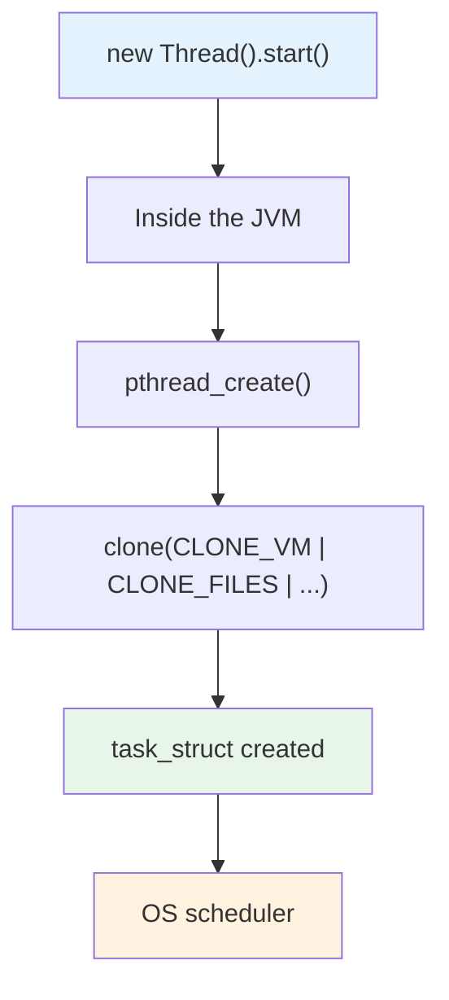

This 1:1 mapping has two implications.

First, Java gets to **ride directly on OS scheduling**, so multicore hardware is used naturally. Second, **the cost of an OS thread is the cost of a Java thread**. Each OS thread needs a few hundred KB to 1MB of stack memory by default, so creating tens of thousands of threads is not realistic.

This limitation is exactly the backdrop against which Reactor, coroutines, and virtual threads — the subjects of this series — emerged. How each of them solves this problem is a story for the upcoming posts.

## Concurrency vs Parallelism

These two words get used interchangeably all the time, but they are entirely different concepts.

**Concurrency** is a structure for **logically dealing with multiple tasks at the same time**. Even if they never actually run in the same instant, as long as the tasks make progress within overlapping time windows, you have concurrency. Even a single-core CPU can achieve concurrency through time slicing.

**Parallelism** is multiple tasks **physically executing at the same instant**. This requires a multicore CPU.

```mermaid
gantt
    title Concurrency (single core — time slicing)
    dateFormat X
    axisFormat %s

    section CPU Core
    Task A :a1, 0, 2
    Task B :b1, 2, 4
    Task A :a2, 4, 6
    Task B :b2, 6, 8
    Task A :a3, 8, 10
```

```mermaid
gantt
    title Parallelism (multi-core — simultaneous execution)
    dateFormat X
    axisFormat %s

    section Core 1
    Task A :a1, 0, 10

    section Core 2
    Task B :b1, 0, 10
```

One barista alternating between an americano and a latte order is **concurrency** — steaming the milk while the espresso pulls, then coming back to collect the shot, switching between tasks. Two baristas each making a drink at the same time is **parallelism**.

So how does parallelism actually get implemented? You don't need to tell the OS "run this thread on core 2". The **OS scheduler** automatically distributes runnable threads across the cores. Create several `Thread`s in Java, or set up a thread pool with `ExecutorService`, and the OS spreads those threads over the available cores on its own. In other words, **developers focus on concurrency (creating multiple threads), and the OS handles parallelism (distributing across cores)**. We'll look at this more closely in Part 2 when we cover `ExecutorService`, `ForkJoinPool`, and friends.

> **Are concurrency and parallelism mutually exclusive?**
> 
> No — in fact most real systems use **both at once**. Picture 100 threads running on a 4-core CPU: the 4 cores each executing a thread is **parallelism**, while the 100 threads taking turns on those 4 cores via time slicing is **concurrency**. A Spring MVC application handling requests with a 200-thread pool is another example of concurrency + parallelism combined.

## Sync/Async and Blocking/Non-blocking — Two Independent Axes

This is where things get genuinely confusing. Plenty of articles explain it as "asynchronous = non-blocking", but the two describe **different perspectives**.

### Synchronous vs Asynchronous — Who Takes Care of the Result?

**Synchronous** means the party that requested the work **waits for or checks the result itself**. Call a function, and the caller stays interested until the result is returned.

**Asynchronous** means that after requesting the work, **the result is delivered later via a callback or an event**. The caller doesn't check the result itself; a notification arrives when it's done.

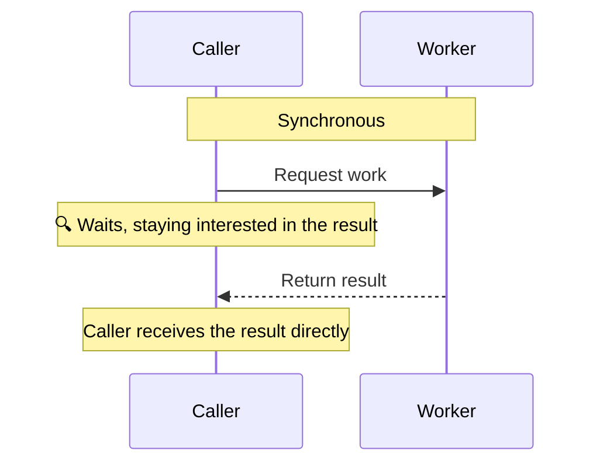

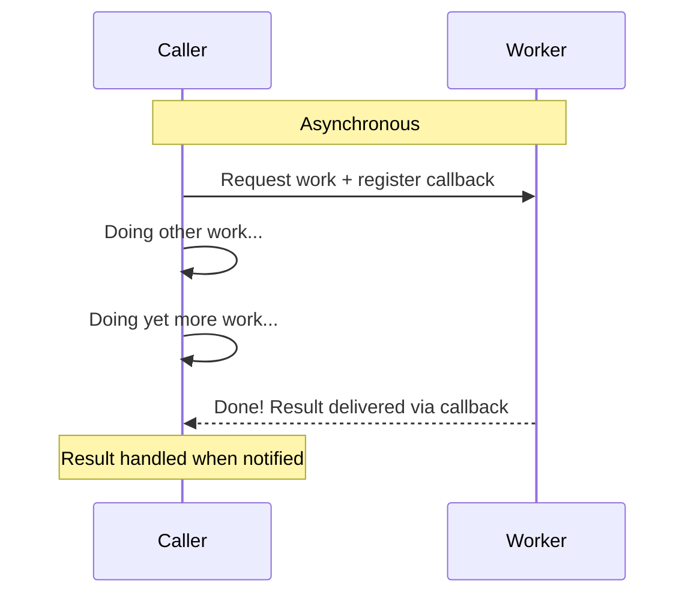

To restate the key difference: in **synchronous**, the caller "stays interested until the result arrives"; in **asynchronous**, the caller "loses interest, does other things, and gets notified later." One caution here: in the synchronous case, "staying interested" does not necessarily mean "the caller's thread stops (blocks)". Polling — the caller's thread repeatedly checking for the result itself — is also synchronous. Whether the caller's thread stops is the blocking/non-blocking question, which we cover right below.

Here's the comparison in Java code.

```java
// Synchronous — the caller receives the result directly
ResultSet rs = statement.executeQuery("SELECT * FROM users");
// If we've reached this line, the result already exists

// Asynchronous — the result is delivered via a callback
CompletableFuture.supplyAsync(() -> fetchUserData())
    .thenAccept(result -> processResult(result));
// Reaching this line doesn't mean the result exists yet
```

### Blocking vs Non-blocking — When Does Control Come Back?

**Blocking** means the called function **doesn't hand control back to the caller** until the work is finished. The caller's thread stops right there.

**Non-blocking** means the called function **returns control immediately**. Even if the work isn't done, the caller can move on to the next line of code right away.

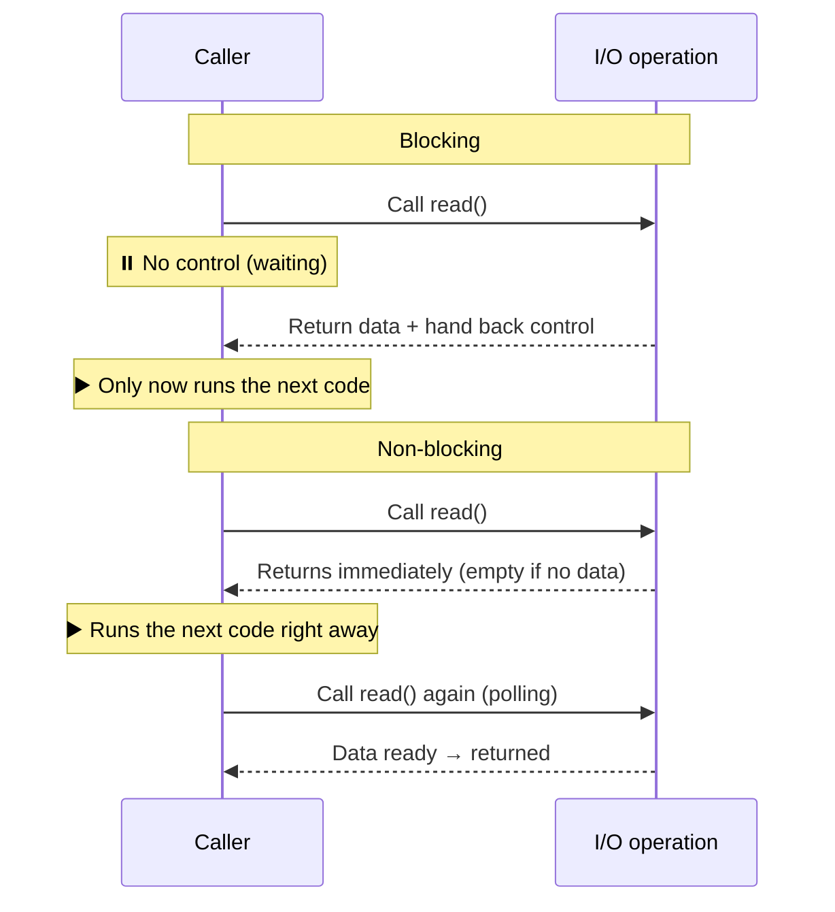

The key difference is **control**. With blocking, the callee holds on to control; with non-blocking, control is handed back immediately.

## The Four Combinations — the Core Matrix

Since sync/async and blocking/non-blocking are independent axes, there are **four possible combinations** in total. Get this matrix down solidly and the positioning of every technology covered later in the series becomes clear.

The examples for the four combinations feature several Java concurrency classes. If they're not familiar yet, it helps to skim the table below first. The details of each class come in Part 2, so for now "ah, so that's a thing" is all you need.

| Class | Role | Analogy |
| --- | --- | --- |
| **`Thread`** | The most basic unit of execution. `start()` creates an OS thread and runs `run()` | A person doing the work |
| **`ExecutorService`** | Manages a thread pool. Submit a task and a pooled thread runs it for you | A staffing agency (takes in jobs and assigns workers) |
| **`Future`** | A **receipt for collecting the result of a submitted task later**. To get the result you must call `get()` — **and that call blocks the thread** | A dry-cleaning ticket (show up before it's ready and you have to wait) |
| **`CompletableFuture`** | An extension of Future. You can still fetch the result with `get()`, or register **callbacks** (`thenApply`, `thenAccept`) so that **the next step runs automatically once the result is ready** | A dry cleaner that also delivers (pick it up yourself, or have it delivered when done) |

Looking at how these four relate through the sync/async and blocking/non-blocking lens reveals the core idea.

`Thread` and `ExecutorService` are **tools for executing work**, so they aren't themselves sync/async or blocking/non-blocking. What really matters is **how you receive the result** — and that is decided by `Future` and `CompletableFuture`.

**With `Future`, getting the result means calling `get()`, which blocks the thread.** By contrast, **`CompletableFuture` lets you register callbacks like `thenApply()`, so the result can be handled without ever calling `get()`.** Both represent "the result of an asynchronous task" — the difference is whether receiving that result is blocking or non-blocking.

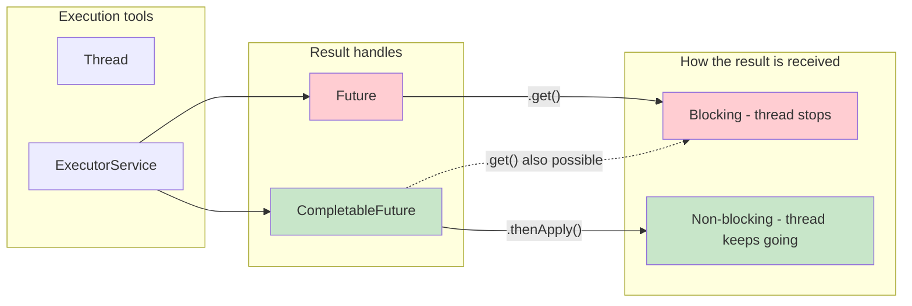

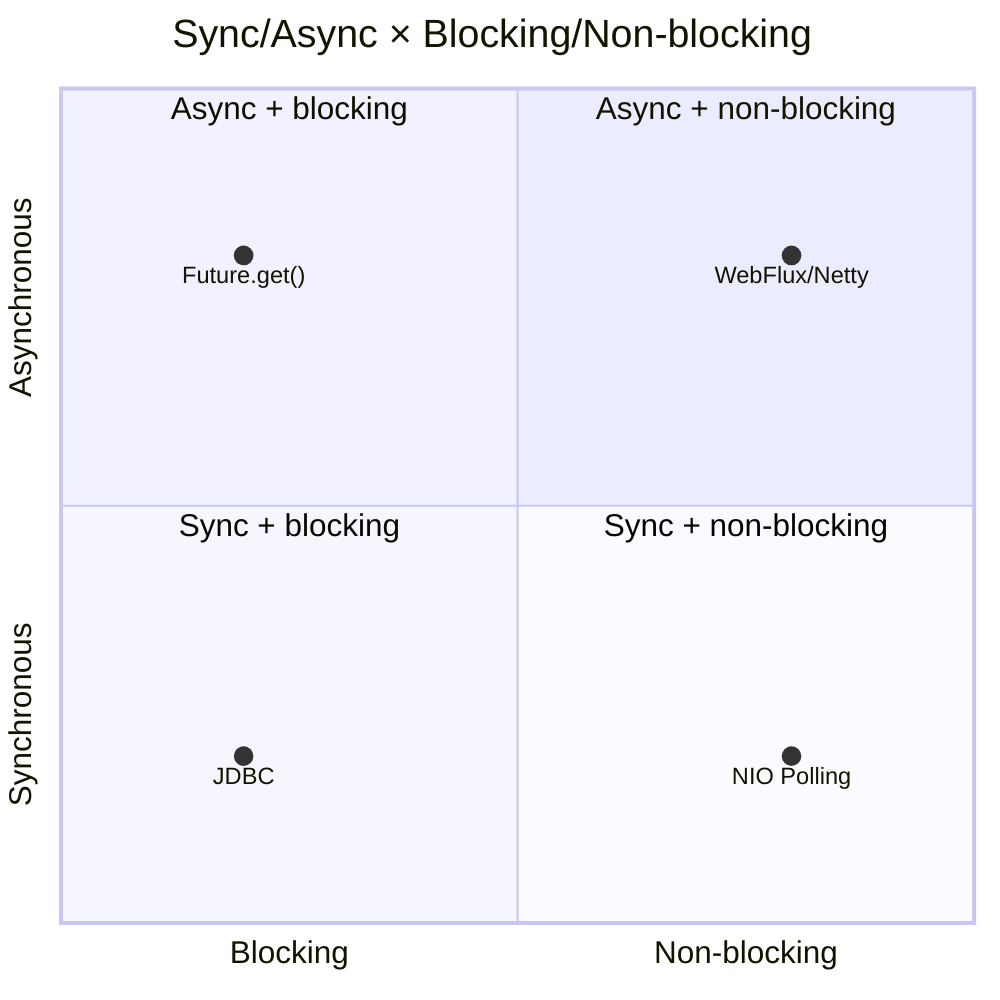

### Sync + Blocking — the Most Familiar Combination

The caller waits for the result itself, and the thread stands still in the meantime. **Spring MVC + JDBC** is the canonical example.

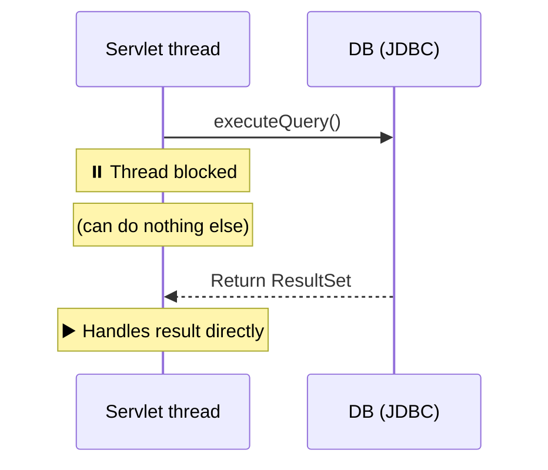

```java
// Synchronous: the caller receives the result directly
// Blocking: the thread stops until executeQuery() completes
ResultSet rs = statement.executeQuery("SELECT * FROM users");
process(rs); // the result already exists
```

The code is intuitive and easy to debug. But since the thread can do nothing while waiting on I/O, handling many concurrent requests requires just as many threads.

### Sync + Non-blocking — the Polling Approach

The call itself returns immediately, but the caller **checks for the result repeatedly on its own** (polling). Explaining this combination requires **Java NIO**, so let's take a quick look at Java's I/O models first.

> **Java IO vs Java NIO**
> 
> **Java IO** (`java.io`) is the I/O API that has been around since the earliest days of Java. It consists of classes like `InputStream`, `OutputStream`, `Reader`, and `Writer`, and every I/O operation is **blocking**. Call `inputStream.read()` and the thread stops until data arrives.
> 
> **Java NIO** (`java.nio`, New I/O) is the I/O API added in Java 1.4. The key differences are that it is built on **Channels** and **Buffers**, and that it **supports a non-blocking mode**. Configure a channel with `channel.configureBlocking(false)`, and a `read()` call returns immediately without stopping the thread even when there's no data.
> 
> A **Channel** is a **bidirectional conduit** to an I/O source such as a file or socket. It doesn't store data itself the way a queue does; it's closer to a pipe connecting the I/O source and your program. A **Buffer** is a **block of memory that temporarily holds the data** you read from or write to a channel. With Java IO's streams, calling `read()` trickles bytes in one at a time; with NIO you move data **a buffer at a time** — "read data from the channel into the buffer" (`channel.read(buffer)`) or "write the buffer's data to the channel" (`channel.write(buffer)`).
> 
> ```mermaid
> flowchart LR
>     subgraph Java-IO
>         SOCK1[Socket] -->|one-way| IS[InputStream] -->|byte by byte| PROG1[Program]
>     end
> ```
> 
> ```mermaid
> flowchart LR
>     subgraph Java-NIO
>         SOCK2[Socket] <-->|two-way| SC[SocketChannel] <-->|buffer at a time| BUF[ByteBuffer] <--> PROG2[Program]
>     end
> ```
> 
> And then there's the **Selector** — a tool for watching multiple channels from a single thread. Register each channel with a Selector, and a single call tells you "is there a channel I can read from right now?". Thanks to this, there's no need to dedicate a thread per channel; one thread can manage thousands of connections.
> 
> | Aspect | Java IO | Java NIO |
> | --- | --- | --- |
> | **Core abstraction** | Stream (a flow of bytes) | Channel + Buffer |
> | **Blocking** | Always blocking | Blocking or non-blocking, your choice |
> | **Direction** | One-way (input or output) | Two-way (both read and write) |
> | **Multiplexing** | Not possible (one connection per thread) | Possible via Selector (one thread, many connections) |
> 
> Note that **bidirectionality** and **non-blocking** are separate improvements. Bidirectional is a resource-efficiency matter ("one channel handles both reads and writes"); non-blocking is a waiting-behavior matter ("the thread doesn't stop on an I/O call"). The two simply arrived together in NIO — being bidirectional is not what made non-blocking possible.
> 
> **So what fundamentally made non-blocking possible in NIO?**
> 
> The Linux kernel had actually supported non-blocking mode on sockets all along. Set the `O_NONBLOCK` flag via the `fcntl()` system call, and you're asking the OS to make `read()` return immediately instead of blocking when there's no data. The problem was that **Java IO's stream API was designed in a way that couldn't take advantage of this**. `InputStream.read()` can only return "the number of bytes read", "-1 (EOF)", or throw an exception. The API simply had no way to express **"no data yet — check back later."**
> 
> NIO's Channel solved this by **designing a new API**. `SocketChannel.read(buffer)` can **return 0**, and that means "no data yet". Set non-blocking mode with `configureBlocking(false)`, and the OS-level non-blocking flag is switched on internally, activating this behavior.
> 
> In short, **the OS supported non-blocking all along, and NIO redesigned the API so Java could use it.** Buffers didn't enable non-blocking — they're an improvement for moving data efficiently. Non-blocking itself would work without buffers, but batching data through a buffer is far better for performance.

In Java NIO, setting a channel to non-blocking mode and checking it yourself is the pattern that corresponds to sync + non-blocking.

The benefit of non-blocking becomes clear not when handling a single channel, but **when one thread manages several channels**. With blocking you'd need a thread per channel; with non-blocking, a single loop can iterate over all of them.

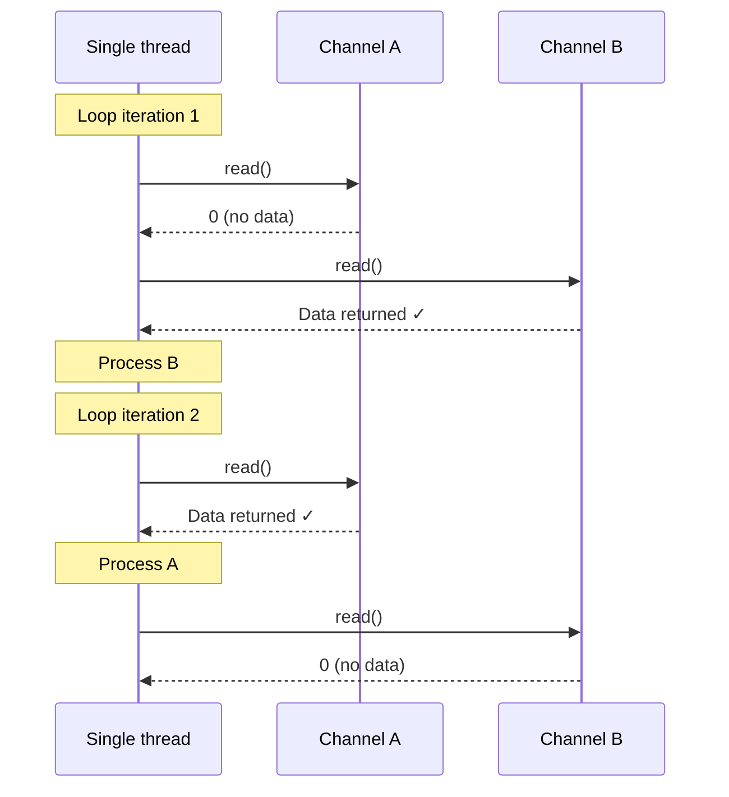

```java
// Connect to two servers at once (non-blocking)
SocketChannel channelA = SocketChannel.open();
channelA.configureBlocking(false);
channelA.connect(new InetSocketAddress("server-a.com", 80));

SocketChannel channelB = SocketChannel.open();
channelB.configureBlocking(false);
channelB.connect(new InetSocketAddress("server-b.com", 80));

ByteBuffer bufferA = ByteBuffer.allocate(1024);
ByteBuffer bufferB = ByteBuffer.allocate(1024);

boolean doneA = false, doneB = false;

// One thread checks both channels in turn (polling)
while (!doneA || !doneB) {
    if (!doneA) {
        int bytesRead = channelA.read(bufferA);  // returns immediately
        if (bytesRead > 0) {
            bufferA.flip();
            processA(bufferA);
            doneA = true;
        }
        // Even with no data we don't stop here → move straight on to check channelB
    }
    if (!doneB) {
        int bytesRead = channelB.read(bufferB);  // returns immediately
        if (bytesRead > 0) {
            bufferB.flip();
            processB(bufferB);
            doneB = true;
        }
    }
}
```

The crux of this code is that `read()` **returns immediately instead of blocking**. If `channelA` has no data, it returns 0 and we fall straight through to the next line, so `channelB` gets checked right after. **In blocking mode, the thread would have stalled at `channelA.read()` until data arrived, and `channelB` would never even have been looked at.** This is the core value of non-blocking — a single thread can manage multiple I/O operations at once.

But polling by hand like this can waste CPU: even while there's no data, the loop keeps spinning and checking. To solve this problem, Java NIO provides the **Selector**.

#### Selector — Watching Multiple Channels from a Single Thread

A Selector is a tool that lets **one thread efficiently watch multiple non-blocking channels**. Instead of polling each channel one by one, you register them with the Selector — "let me know when data arrives on this channel" — and a single `select()` call hands you only the channels that are ready.

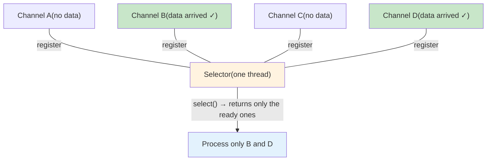

```java
Selector selector = Selector.open();

// Register multiple channels with the Selector
channel1.register(selector, SelectionKey.OP_READ);
channel2.register(selector, SelectionKey.OP_READ);
channel3.register(selector, SelectionKey.OP_READ);

while (true) {
    // Wait until at least one registered channel becomes ready
    // (this call itself blocks, but each individual I/O is non-blocking)
    selector.select();

    Set<SelectionKey> readyKeys = selector.selectedKeys();
    for (SelectionKey key : readyKeys) {
        if (key.isReadable()) {
            SocketChannel ch = (SocketChannel) key.channel();
            ch.read(buffer);  // non-blocking read — this channel has data ready, so it returns immediately
            process(buffer);
        }
    }
    readyKeys.clear();
}
```

`selector.select()` is itself a blocking call, but it waits for "any channel to become ready", not for one specific I/O. The point is that a single thread can now manage thousands of channels — and this structure is the foundation of the event-loop model in Netty and WebFlux. We'll dig deeper into Selector in Part 4 (Spring WebFlux).

> **Where does sync + non-blocking actually get used?**
> 
> The classic example is the **game loop**, a design pattern used everywhere in game programming: the **main loop that repeats every frame** for as long as the game is running. Inside this loop, you check input → update game state → render the screen, over and over.
> 
> ```javascript
> // Game loop (sync + non-blocking pattern)
> while (gameRunning) {
>     input = pollInput();    // non-blocking: returns null if no input, never stops
>     updateGameState(input); // synchronous: the loop handles it directly
>     render();               // render the frame
>     // → all of this must finish within ~16ms (60fps)
> }
> ```
> 
> Games use this combination because of **frame timing** and **order dependency**.
> 
> **Why non-blocking?** A 60fps game has to finish each frame in about 16ms. If `pollInput()` were blocking — if the thread stopped until the player pressed a key — rendering would stop too and the game would freeze. That's why a non-blocking call that returns null when there's no input and moves right along is essential.
> 
> **Why synchronous?** Because the steps have **order dependencies** between them. Input must be read first to determine the character's movement direction; physics must finish before the character's final position is known; and only once the position is decided can the character be rendered there. Get the order wrong and you end up with problems like "render a character that hasn't moved yet, then apply the physics afterwards." Guaranteeing this ordering with callback-based async code is far more complicated, so a synchronous loop that directly drives the flow is the natural fit.
> 
> As an aside, games demand high-end PCs not so much because of this synchronous structure, but because **each step simply involves a huge amount of computation**. Rendering millions of polygons doesn't get any cheaper by going async. In practice, games keep **the flow between steps synchronous** while **aggressively parallelizing within each step** — the GPU rendering across thousands of cores being the prime example.
> 
> The Java NIO `Selector.select()` + non-blocking channel combination we saw above is a variation of this same pattern: polling events from multiple channels on one thread, allowing a handful of threads to handle a massive number of connections.

### Async + Blocking — the Awkward Middle Ground

The work itself is delegated asynchronously to another thread, but **the caller's thread blocks to receive the result**.

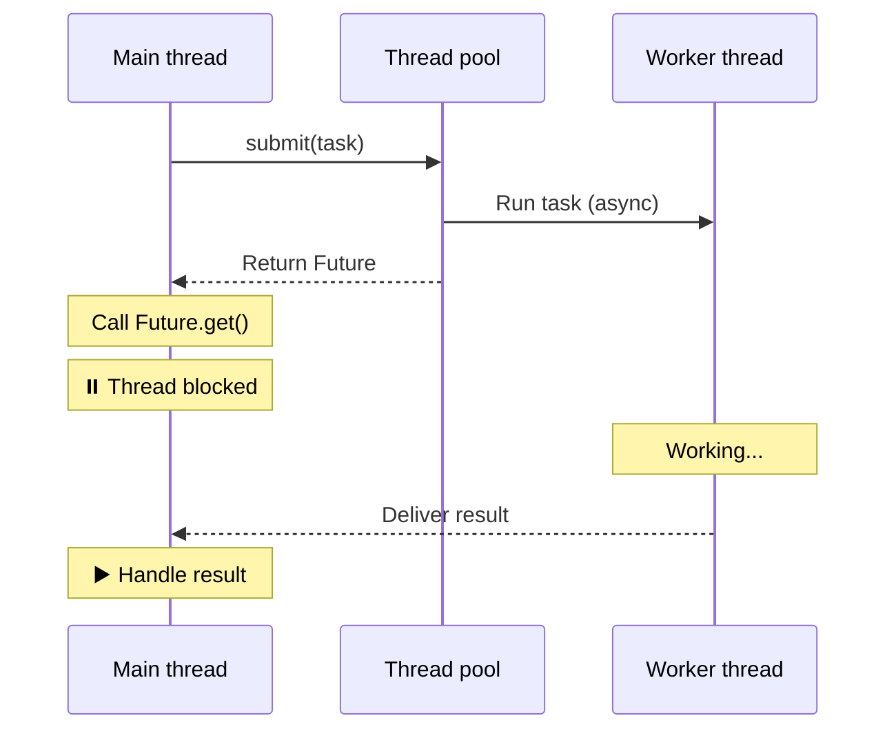

```java
ExecutorService executor = Executors.newFixedThreadPool(4);

// Async: delegate the work to another thread
Future<String> future = executor.submit(() -> {
    return callExternalAPI();
});

// Blocking: the thread stops while waiting for the result
String result = future.get();  // ← blocks here
processResult(result);
```

Delegating the work asynchronously to another thread succeeded — but the moment you call `Future.get()`, **the caller's thread loses control.** You delegated, and yet you can do nothing until the result comes back. In effect you get roughly the same outcome as sync + blocking, with more complicated code. It is **generally considered an anti-pattern**.

> **Then why does this combination exist at all?**
> 
> It's meaningful if you can do other useful work before calling `Future.get()`. For example, submit tasks A and B in parallel, handle other work between submission and `get()`, and then call `get()` at the point each result is actually needed — that can beat sequential execution. But even then, `CompletableFuture.allOf()` is often the better choice.
> 
> ```java
> // The case where async + blocking is at least somewhat useful
> Future<String> futureA = executor.submit(() -> callServiceA());
> Future<String> futureB = executor.submit(() -> callServiceB());
> // ↑ A and B are now running concurrently
> 
> doSomethingElse(); // A and B keep progressing in parallel during this time
> 
> String resultA = futureA.get(); // blocking, but it may have already completed
> String resultB = futureB.get(); // blocking
> ```

### Async + Non-blocking — the Ideal Combination

Delegate the work, get control back immediately, and handle the result via callbacks or events. **WebFlux, Netty, and CompletableFuture chains** all belong to this combination.

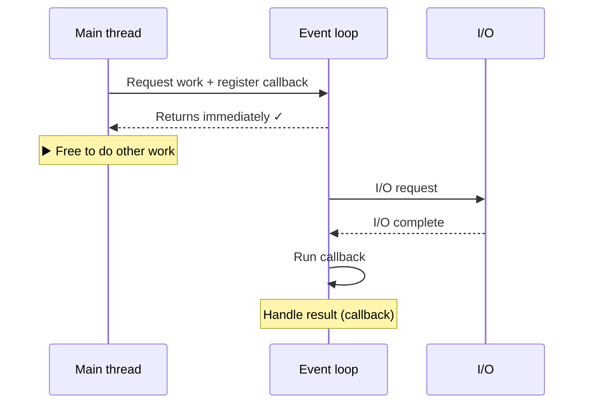

```java
// Async: delegate the work
// Non-blocking: returns immediately
CompletableFuture.supplyAsync(() -> fetchDataFromAPI())
    .thenApply(data -> parseData(data))          // callback chain
    .thenAccept(result -> saveToDatabase(result)) // handle the result
    .exceptionally(ex -> {
        log.error("Error: {}", ex.getMessage());
        return null;
    });

// This line runs immediately, before the work above completes
log.info("Work submitted; doing other things in the meantime.");
```

Spring WebFlux is another example of this combination.

```java
// Reactor's Mono/Flux — async + non-blocking
webClient.get()
    .uri("/api/users")
    .retrieve()
    .bodyToMono(User.class)
    .subscribe(
        user -> log.info("Received result: {}", user),
        error -> log.error("Error occurred", error)
    );
// subscribe() returns immediately; the result arrives later via callback
```

A small number of threads can handle a large volume of concurrent requests, so **throughput is high**. The downsides: callback chains make the code more complex, and stack traces get severed when debugging. Kotlin coroutines emerged to solve exactly these pain points — that's Part 5 of the series.

### The Four Combinations at a Glance

| Combination | In a nutshell | Representative examples | Characteristics |
| --- | --- | --- | --- |
| **Sync + blocking** | Ask and wait | JDBC, Spring MVC | Intuitive, but wastes threads |
| **Sync + non-blocking** | Ask and poll yourself | NIO polling, game loops | Potential CPU waste |
| **Async + blocking** | Delegate, then wait anyway | Future.get() | Mostly an anti-pattern |
| **Async + non-blocking** | Delegate and receive via callback | WebFlux, Netty, CompletableFuture | High throughput, code complexity ↑ |

> **Does asynchronous always mean non-blocking?**
> 
> No. As we saw above, the async + blocking combination exists too. Async is about **"how the result is received"**; non-blocking is about **"whether the thread stops after the call."** The two axes are independent. It's just that in practice, asynchronous technology naturally goes hand in hand with non-blocking, which is why the two get conflated so often.

## How These Concepts Connect Across the Series

Put the concepts we've covered into the context of the whole series and a single storyline emerges.

Java's traditional concurrency model was **sync + blocking** by default. Thread, ExecutorService, and Spring MVC all sit on top of this model. It's simple and intuitive, but the number of threads has to grow along with the number of concurrent requests, which limits scalability.

To overcome that limit, Reactor and WebFlux emerged in the **async + non-blocking** direction, and Kotlin coroutines made it possible to write the complex async + non-blocking code in a synchronous style. Most recently, virtual threads flipped the perspective entirely, choosing to **keep the sync + blocking style of code while solving the thread-cost problem**.

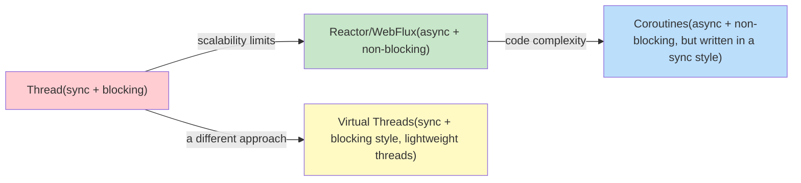

In the next post, we'll walk through Java's traditional concurrency model — from Thread to CompletableFuture — with code.

## References

-   [Linux clone(2) man page](https://www.man7.org/linux/man-pages/man2/clone.2.html)
-   [Eli Bendersky — Launching Linux threads and processes with clone](https://eli.thegreenplace.net/2018/launching-linux-threads-and-processes-with-clone/)
-   [How Java Thread Maps to OS Thread](https://medium.com/@unmeshvjoshi/how-java-thread-maps-to-os-thread-e280a9fb2e06)
-   [Baeldung — Process vs Thread](https://www.baeldung.com/cs/process-vs-thread)
