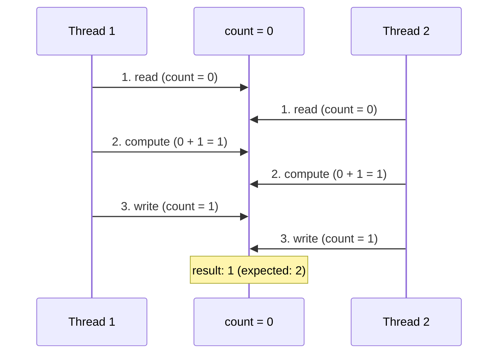
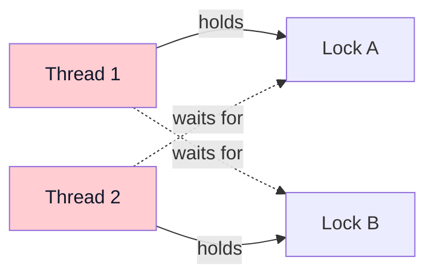
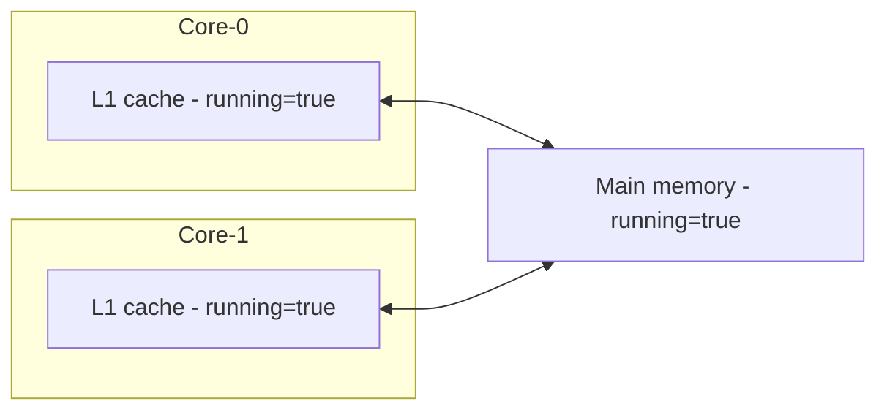
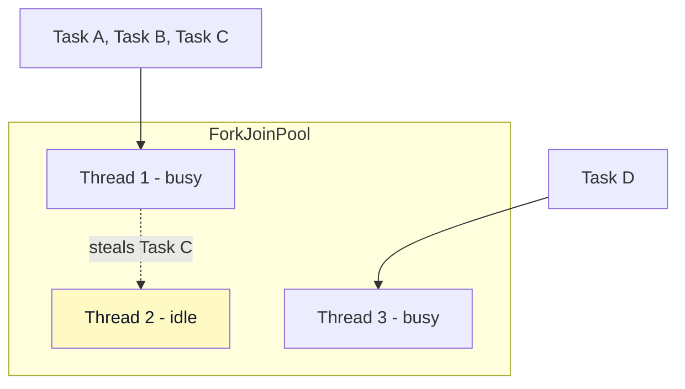
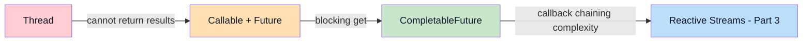

> **Understanding JVM Concurrency Models series**
> 
> 1.  [Concurrency and Parallelism Fundamentals](/en/jvm-concurrency-model-1-fundamentals/)
> 2.  **[Java's Traditional Concurrency Model](/en/jvm-concurrency-model-2-java-traditional-concurrency/) ← you are here**
> 3.  [Reactive Streams and Project Reactor](/en/jvm-concurrency-model-3-reactive-streams-reactor/)
> 4.  [Spring WebFlux](/en/jvm-concurrency-model-4-spring-webflux/)
> 5.  [Kotlin Coroutines](/en/jvm-concurrency-model-5-kotlin-coroutines/)
> 6.  [Spring + Coroutines — WebFlux, MVC, and the Limits of AOP](/en/jvm-concurrency-model-6-spring-coroutines/)
> 7.  [Virtual Threads — The Synchronous World's Answer](/en/jvm-concurrency-model-7-virtual-thread/)
> 8.  [Wrap-up — When to Choose What](/en/jvm-concurrency-model-8-conclusion-decision-framework/)

## From Thread to CompletableFuture — a History of Rising Abstraction

In [Part 1](/en/jvm-concurrency-model-1-fundamentals/) I laid out the concepts: concurrency vs. parallelism, sync/async, blocking/non-blocking. In this post we'll look at **what those concepts actually look like in Java code**.

Java's concurrency API wasn't built in one shot. It started with `Thread`; `ExecutorService` arrived to overcome its limits; `Future` was added so we could get results back; and `CompletableFuture` came along so we could process results without blocking. **Each tool was born from the limitations of the one before it**, and once you understand that progression, "which one should I use, and when" becomes obvious on its own.

> **A note for Kotlin users**
> 
> Kotlin runs on the JVM, so everything covered here — Thread, ExecutorService, CompletableFuture, and so on — is available to you as-is. That said, Kotlin has its own concurrency model, **coroutines**, and in practice you'll usually reach for coroutines rather than the Java concurrency classes directly. Coroutines get their own deep dive in Part 5.

## Thread and Runnable — Concurrency at Its Most Primitive

In Java, concurrency starts with `Thread`. When you want a new flow of execution, you create a Thread object and call `start()`.

```java
// Option 1: extend Thread directly
Thread thread = new Thread() {
    @Override
    public void run() {
        System.out.println("Running on thread: " + Thread.currentThread().getName());
    }
};
thread.start();

// Option 2: pass a Runnable (recommended)
Runnable task = () -> {
    System.out.println("Running on thread: " + Thread.currentThread().getName());
};
new Thread(task).start();
```

Why is option 2 recommended? Two simple reasons. Java only has single inheritance, so extending Thread means you can't extend anything else. And keeping **the work (Runnable) separate from the means of execution (Thread)** minimizes code changes later, when you swap in a different execution mechanism like ExecutorService.

As covered in [Part 1](/en/jvm-concurrency-model-1-fundamentals/), calling `new Thread().start()` goes through `pthread_create()` → the `clone()` system call and creates an OS thread. In other words, **one Java Thread = one OS thread**, which means each thread gets hundreds of KB to 1MB of stack memory allocated by the OS.

### The Limits of Thread

Do concurrent programming with only Thread and Runnable and you run into three problems.

**First, you can't get a result back.** Runnable's `run()` method returns `void`. To retrieve a value computed on another thread, you have to set up a shared variable and handle the synchronization yourself.

**Second, you can't control the number of threads.** Call `new Thread()` per request and 10,000 concurrent connections means 10,000 threads. That's ~10GB in stack memory alone, and the OS's context-switching overhead ends up exceeding the actual work time.

**Third, exception handling is awkward.** Runnable's method signature is `void run()`, so you can't declare `throws IOException` on it. Any method that throws a checked exception must be wrapped in a try-catch inside the thread, and there's no way to propagate the exception to the caller.

```java
Runnable task = () -> {
    try {
        String data = Files.readString(Path.of("data.txt")); // may throw IOException
    } catch (IOException e) {
        // has to be swallowed here — no way to reach the caller
        e.printStackTrace();
    }
};
```

These three limitations are the direct reason Callable, Future, and ExecutorService came into existence.

## Callable and Future — I Want My Result Back

`Callable` was added in Java 5 to patch Runnable's shortcomings. **It can return a value, and it can declare exceptions with throws.**

```java
// Callable: has a return value, can declare exceptions with throws
Callable<String> callable = () -> {
    String data = Files.readString(Path.of("data.txt"));  // IOException can simply propagate
    return data.toUpperCase();
};
```

When an exception occurs inside a Callable, it doesn't vanish — it gets wrapped in an `ExecutionException` and delivered to the caller when they invoke `Future.get()`. **Exception propagation**, which was impossible with Runnable, is now possible.

Executing a Callable gives you a `Future` object. It's exactly the **dry cleaner's receipt** from the analogy in [Part 1](/en/jvm-concurrency-model-1-fundamentals/). You hold on to the receipt, and when you need the result, you call `get()`.

```java
ExecutorService executor = Executors.newSingleThreadExecutor();
Future<String> future = executor.submit(callable);

// free to do other work here
System.out.println("Doing something else...");

// call get() when you need the result — this is where it blocks!
String result = future.get();
System.out.println(result); // "task result"

executor.shutdown();
```

### The Blocking Problem of Future.get()

Future's core limitation: **the only way to retrieve the result is `get()`, and it blocks.** In terms of the four-quadrant matrix from [Part 1](/en/jvm-concurrency-model-1-fundamentals/), Future.get() is **async + blocking** — the task itself runs asynchronously on another thread, but the moment you pull out the result, the calling thread stops.

Consider running several tasks concurrently and collecting the results.

```java
ExecutorService executor = Executors.newFixedThreadPool(3);

Future<String> futureA = executor.submit(() -> {
    Thread.sleep(3000);
    return "result A";
});
Future<String> futureB = executor.submit(() -> {
    Thread.sleep(2000);
    return "result B";
});
Future<String> futureC = executor.submit(() -> {
    Thread.sleep(1000);
    return "result C";
});

// the three tasks run concurrently, but retrieving results blocks sequentially
String a = futureA.get(); // waits 3 seconds
String b = futureB.get(); // already done, returns immediately
String c = futureC.get(); // already done, returns immediately

executor.shutdown();
```

Here the three tasks run in parallel, so the total time is about 3 seconds. But what if A took 1 second and B took 3? `futureA.get()` finishes in 1 second, but then you sit at `futureB.get()` for 3 more. **No matter which task finishes first, you can only wait in the order you call `get()`.**

You can check completion with `isDone()`, but that means polling in a loop, which wastes CPU. There's no way to say "when the result is ready, go run the next step on your own" — that is Future's fundamental limitation, and it's why CompletableFuture exists.

## ExecutorService — Stop Creating Threads Yourself

The code above already used `ExecutorService`. Callable and Future are frankly meaningless without it, so let's cover it properly here.

### Why You Shouldn't Create Threads Directly

```java
// a server that spawns a thread per request (the wrong way)
while (true) {
    Socket client = serverSocket.accept();
    new Thread(() -> handleClient(client)).start(); // dangerous!
}
```

When concurrent connections spike, this code creates threads without bound. At ~1MB of stack per thread, 10,000 threads is ~10GB. Odds are the server dies with an `OutOfMemoryError` well before that. And once the thread count far exceeds the CPU core count, the OS scheduler spends more time context-switching than doing actual work.

`ExecutorService` solves this with a **thread pool**. Create a fixed number of threads up front; when work arrives, borrow a thread from the pool; when the work finishes, return it.

```java
// using a thread pool (the right way)
ExecutorService executor = Executors.newFixedThreadPool(20);
while (true) {
    Socket client = serverSocket.accept();
    executor.submit(() -> handleClient(client)); // thread assigned from the pool
}
```

### ThreadPoolExecutor — Pool Types and How to Choose

These are the main implementations provided by the `Executors` factory methods. In the table, "core threads" is the minimum number of threads kept alive even when the pool is idle, and "max threads" is the upper bound on how many can exist at once.

| Pool type | Core / max threads | Work queue | Best suited for |
| --- | --- | --- | --- |
| **FixedThreadPool** | n / n | `LinkedBlockingQueue` (unbounded) | Server workloads with predictable load |
| **CachedThreadPool** | 0 / Integer.MAX | `SynchronousQueue` (no buffer) | Short, bursty tasks |
| **SingleThreadExecutor** | 1 / 1 | `LinkedBlockingQueue` (unbounded) | Work that must run strictly in order |
| **ScheduledThreadPool** | n / Integer.MAX | `DelayedWorkQueue` (ordered by execution time) | Periodic or delayed execution |

`SynchronousQueue` is a queue with no internal buffer — a handoff only succeeds when the producer and a consuming thread meet at the same moment. This queue is what makes CachedThreadPool's strategy possible: if no thread is waiting, spawn a new one immediately. `DelayedWorkQueue` attaches a "scheduled execution time" to each task, and nothing can be dequeued before its time arrives. Tasks aren't late because of backlog — their execution time is **specified deliberately**.

Why does CachedThreadPool have zero core threads? So that when there's no work, it keeps **no threads at all**. A thread is created when a task arrives and removed after 60 seconds of disuse. It's a strategy for handling momentary bursts while using minimal resources.

> **How should you size a pool?**
> 
> The key question is whether the work is **CPU-bound or I/O-bound**. For CPU-bound work (computation, transformation), set the size near the core count — more threads than cores just means more context switching. For I/O-bound work (DB queries, API calls), set it much higher than the core count, because while one thread waits on I/O, others can use the CPU. This is exactly why Spring MVC's default thread pool is 200 — most web requests are I/O-bound work involving DB queries or external API calls.
> 
> The common formula is `threads = CPU cores × (1 + I/O wait time / CPU time)`. The exact number should come from load testing, but it's a useful starting point.

### Shutting Down Properly: shutdown() vs shutdownNow()

An ExecutorService must be shut down explicitly. If you don't, the JVM won't exit.

```java
executor.shutdown();       // reject new tasks, wait for in-flight tasks to complete
executor.shutdownNow();    // reject new tasks, attempt to interrupt in-flight tasks
```

`shutdown()` is the usual choice. `shutdownNow()` forcibly interrupts running tasks, which can break data consistency, so use it with care. In a Spring environment, you'd typically call `shutdown()` in the bean lifecycle (`@PreDestroy`).

## CompletableFuture — Chaining with Callbacks

`CompletableFuture` arrived in Java 8 and solves Future's blocking problem at the root. Like the **dry cleaner that also delivers** from the analogy in [Part 1](/en/jvm-concurrency-model-1-fundamentals/): you can still pick up the result yourself with `get()`, or you can register a callback and the next step runs automatically when the result is ready.

### Basic Chaining: supplyAsync → thenApply → thenAccept

```java
CompletableFuture.supplyAsync(() -> {
        // step 1: fetch data asynchronously
        return fetchUserFromDB(userId);
    })
    .thenApply(user -> {
        // step 2: transform the result (receives the previous step's output)
        return user.getName().toUpperCase();
    })
    .thenAccept(name -> {
        // step 3: final consumption (use the result without returning anything)
        System.out.println("User: " + name);
    });
```

There is no `get()` call anywhere in this code. Each stage receives the previous stage's result and runs automatically. On the four-quadrant matrix from [Part 1](/en/jvm-concurrency-model-1-fundamentals/), this is exactly **async + non-blocking** — the calling thread registers the chain and returns immediately, and the result is delivered via callbacks.

Here's how the main methods differ.

| Method | Input | Output | Purpose |
| --- | --- | --- | --- |
| **thenApply** | previous result | transformed value | transform the result (map) |
| **thenAccept** | previous result | none (void) | consume the result (logging, saving) |
| **thenRun** | none | none (void) | follow-up work unrelated to the result |

### Composition: Combining Multiple Async Tasks

In real work you often need to call several APIs concurrently and merge the results.

```java
CompletableFuture<String> userFuture = CompletableFuture.supplyAsync(
    () -> fetchUser(userId)
);
CompletableFuture<List<Order>> orderFuture = CompletableFuture.supplyAsync(
    () -> fetchOrders(userId)
);

// combine once both results are ready
CompletableFuture<String> combined = userFuture.thenCombine(orderFuture,
    (user, orders) -> user.getName() + " has " + orders.size() + " orders"
);
```

`thenCombine` merges the results of two independent async tasks once both complete. The two tasks run in parallel, so if they take 2 and 3 seconds respectively, the total is about 3 seconds.

When the result of one async task must feed into another async call, use `thenCompose`.

```java
// thenApply would give you a nested CompletableFuture<CompletableFuture<Order>>
// thenCompose flattens it (same role as flatMap)
CompletableFuture<Order> orderFuture = fetchUser(userId)
    .thenCompose(user -> fetchLatestOrder(user.getId()));
```

### Exception Handling

CompletableFuture's exception-handling methods are the equivalent of try-catch in synchronous code.

```java
CompletableFuture.supplyAsync(() -> {
        if (userId == null) throw new IllegalArgumentException("userId is null");
        return fetchUser(userId);
    })
    .thenApply(user -> user.getName())
    .exceptionally(ex -> {
        // an exception anywhere in the chain lands here
        System.err.println("Error occurred: " + ex.getMessage());
        return "Unknown";
    });
```

`exceptionally` runs only when an exception occurs, and returns a fallback value. `handle` and `whenComplete` both **run on success and failure alike**, but there's a key difference between them.

```java
// handle: sees both success/failure, and can transform the result (try-catch + transform)
cf.handle((result, ex) -> {
    if (ex != null) return "default";  // fallback value on exception
    return result.toUpperCase();       // transformed value on success
}); // the rest of the chain receives whatever handle returned

// whenComplete: sees both success/failure, but cannot change the result (finally)
cf.whenComplete((result, ex) -> {
    if (ex != null) log.error("failed", ex);   // logging
    else log.info("succeeded: " + result);     // logging
}); // the rest of the chain receives the original result (or exception) untouched
```

| Method | When it runs | Transforms result | Analogy |
| --- | --- | --- | --- |
| **exceptionally** | only on exception | O (fallback value) | catch |
| **handle** | always (success + failure) | O (returns a new value) | try-catch + transform |
| **whenComplete** | always (success + failure) | X (original result kept) | finally (logging, cleanup) |

### Who Decides Which Thread Runs the Work

Call `supplyAsync()` without an Executor and it runs on **ForkJoinPool.commonPool()**. That pool has CPU cores – 1 threads, so heavy I/O work can starve it.

```java
// default: uses ForkJoinPool.commonPool()
CompletableFuture.supplyAsync(() -> fetchFromDB());

// specify a custom Executor (recommended for I/O-heavy work)
ExecutorService ioExecutor = Executors.newFixedThreadPool(50);
CompletableFuture.supplyAsync(() -> fetchFromDB(), ioExecutor);
```

The same goes for `thenApply` — use `thenApplyAsync(fn, executor)` to control which thread runs the continuation.

## The Shared-State Problem — Concurrency's Dark Side

Running multiple threads at once improves performance, but the trouble starts **the moment they touch the same data at the same time**.

### Race Condition

```java
public class Counter {
    private int count = 0;

    public void increment() {
        count++; // this single line is the dangerous one
    }

    public int getCount() {
        return count;
    }
}
```

`count++` is one line in code, but at the CPU level it's three steps.



Both threads executed `count++` once each, but since both read 0 and then wrote 1, the result is 1, not 2. This is a **race condition** — the outcome depends on the timing of thread execution.

### The Visibility Problem

```java
public class StopFlag {
    private boolean running = true;

    public void stop() {
        running = false; // called from Thread 1
    }

    public void run() {
        while (running) { // running on Thread 2 — may never stop even after running becomes false
            doWork();
        }
    }
}
```

Even after Thread 1 sets `running = false`, Thread 2 **may never see the change.** Each CPU core has its own cache, and if Thread 2 keeps reading `running` from its own cache, it has no idea the value changed. This is the **visibility problem**.

### Deadlock

```java
Object lockA = new Object();
Object lockB = new Object();

// Thread 1
new Thread(() -> {
    synchronized (lockA) {
        Thread.sleep(100);
        synchronized (lockB) {  // waiting for lockB
            System.out.println("Thread 1 done");
        }
    }
}).start();

// Thread 2
new Thread(() -> {
    synchronized (lockB) {
        Thread.sleep(100);
        synchronized (lockA) {  // waiting for lockA
            System.out.println("Thread 2 done");
        }
    }
}).start();
```

Thread 1 holds lockA and waits for lockB; Thread 2 holds lockB and waits for lockA. Both wait forever — that's a **deadlock**.



The most basic deadlock-prevention strategy is to **standardize the lock acquisition order**. If every thread always acquires locks in A → B order, circular waiting can't occur.

## Synchronization Tools — How to Prevent These Problems

Let's look at Java's synchronization tools for solving the three problems above. Before comparing them, it helps enormously to first define the **three properties** synchronization can guarantee.

| Property | Meaning | Example |
| --- | --- | --- |
| **Visibility** | Is one thread's write visible to another thread's read? | Can Thread B see the value Thread A changed? |
| **Atomicity** | Does **a single operation** execute without being interrupted midway? | Can anything interleave into the read-compute-write 3 steps of `count++`? |
| **Mutual exclusion** | Does only one thread at a time enter **a section spanning multiple operations**? | Can another thread squeeze in between "check balance → withdraw"? |

Atomicity and mutual exclusion share the same goal — "keep other threads from cutting in" — but **they differ in implementation level and scope of protection.**

**Atomicity** is guaranteed by **CPU hardware**. For example, `count++` consists of read-compute-write, so it isn't atomic — but `AtomicInteger.incrementAndGet()` executes those 3 steps without interruption in a single CPU `cmpxchg` instruction. That is precisely the role of the **Atomic classes** we'll cover shortly. Light and fast, but it protects **only that one operation**. `balance.get()` → `balance.addAndGet(-800)` are each atomic, but another thread can slip in between them and change the balance.

**Mutual exclusion** is guaranteed by the **JVM/OS** at the software level. The developer **explicitly marks a range** — from the `{` to the `}` of a synchronized block — and other threads are barred from entering that section at all. Heavier than atomicity, but it can protect multiple operations as a unit.

For every tool that follows, the key selection criterion is how far up this list of three properties it guarantees.

### volatile — Guaranteeing Visibility

```java
public class StopFlag {
    private volatile boolean running = true;

    public void stop() {
        running = false; // the change is visible to other threads immediately
    }

    public void run() {
        while (running) { // always reads the latest value
            doWork();
        }
    }
}
```

To understand volatile, you first need to know that **CPU caching is the default**. Main memory (RAM) access is slow — on the order of hundreds of CPU cycles — so modern CPUs give each core its own L1/L2 cache. The first read of a variable copies it into the cache, and subsequent reads come from the cache. This is a **CPU-hardware-level optimization**, not something the JVM does.



When Core 0 sets `running = false`, Core 0's cache is updated, but **Core 1's cache may still hold `true`.** This is the cause of the visibility problem we saw earlier. Note that because caches are per-core (L1 and L2 are core-private), two threads running on the **same core** share a cache and have no problem — the problem appears when they land on **different cores**. Since the OS scheduler's core assignment varies from run to run, visibility bugs show up as the hard-to-reproduce "works sometimes, fails sometimes" kind.

`volatile` instructs the CPU to use a **memory barrier**. On a write, the cached value is flushed to main memory immediately and the corresponding cache line on other cores is invalidated. On a read, the cache is bypassed and the value is re-read from main memory. It doesn't "reduce the odds" — it **guarantees visibility, 100%**.

Incidentally, this memory barrier also **prevents instruction reordering**. CPUs and compilers may reorder instructions for performance as long as "the result is the same" — fine in a single thread, but in multithreaded code it can produce unexpected results.

```java
// Thread A
data = loadData();       // step 1
volatile ready = true;   // step 2

// Thread B
if (ready) {             // step 3
    use(data);           // step 4 — assumes data is ready
}
```

If `ready` were not volatile, the CPU could swap steps 1 and 2. Thread B would then see `ready = true` and try to use `data` while `loadData()` hasn't actually completed. `volatile` guarantees that **all operations before the write have definitely completed before the write executes**.

In practice, though, reordering rarely bites you directly. `synchronized`, `ReentrantLock`, and the `Atomic` classes already include memory barriers internally, so in properly synchronized code, reordering is prevented automatically. It only becomes a real problem in the special case above — **communicating between threads through plain variables without synchronization** — so it's fine to file it away as a bonus feature of volatile.

Also, volatile **does not guarantee atomicity for read-modify-write operations** like `count++`. Even declared volatile, two threads reading and writing simultaneously will race. So volatile's use case is clear-cut: **a simple flag written by one thread and read by another**. The stop-flag pattern above is the canonical example, and frameworks like Spring and Netty genuinely use it internally for state signals like "initialization complete" or "shutdown requested". In those cases it's a lighter tool with clearer intent than synchronized.

### synchronized — Visibility + Mutual Exclusion

```java
public class Counter {
    private int count = 0;

    public synchronized void increment() {
        count++; // only one thread executes this at a time
    }

    public synchronized int getCount() {
        return count;
    }
}
```

`synchronized` allows **only one thread at a time** to execute the code block. It guarantees both visibility and atomicity, and releases the lock automatically on block exit (even when an exception is thrown). It's the simplest, safest way to synchronize.

### ReentrantLock — Finer-Grained Control

```java
private final ReentrantLock lock = new ReentrantLock();

public void doWork() {
    if (lock.tryLock(3, TimeUnit.SECONDS)) { // wait at most 3 seconds
        try {
            // critical section
        } finally {
            lock.unlock(); // must release manually!
        }
    } else {
        // couldn't acquire the lock within 3 seconds — do something else
        handleTimeout();
    }
}
```

`synchronized` waits indefinitely to acquire the lock, while `ReentrantLock` offers finer control: **timeouts** (`tryLock`), **interrupts** (`lockInterruptibly`), and so on. The catch is that you must call `unlock()` in a `finally` block, which leaves room for mistakes.

### Atomic Classes — Lock-Free Synchronization

```java
private final AtomicInteger count = new AtomicInteger(0);

public void increment() {
    count.incrementAndGet(); // atomic increment via CAS
}
```

The Atomic classes use **CAS (Compare-And-Swap)**: "if the current value equals the value I read, replace it with the new value; otherwise, retry."

> **Why CAS outperforms locks**
> 
> When `synchronized` tries to acquire a lock that another thread holds, it asks the OS kernel to "put this thread to sleep", and when the lock frees up, asks again to "wake it up". That **kernel-mode transition (user mode ↔ kernel mode)** costs thousands of CPU cycles. Waking a sleeping thread involves the OS scheduler too, adding latency.
> 
> CAS works in **a single CPU instruction** (`cmpxchg` on x86). On failure it doesn't call the kernel for help — it **retries immediately**. No kernel round trip means no transition cost.
> 
> That said, under **extreme contention** (dozens of threads CASing the same variable simultaneously), the constant fail-and-retry can itself waste CPU, so CAS fits short, light operations like simple counters best.

### Which Tool for Which Situation

Comparing each tool against the three properties from earlier:

| Tool | Visibility | Atomicity | Mutual exclusion | Notes |
| --- | --- | --- | --- | --- |
| **volatile** | O | X | X | lightest |
| **Atomic** | O | O | X | CAS-based lock-free |
| **synchronized** | O | O | O | simplest, auto-release |
| **ReentrantLock** | O | O | O | timeout/interrupt support |

| Situation | Recommended tool | Why |
| --- | --- | --- |
| Flag changes (on/off) | `volatile` | only visibility needed, no atomicity required |
| Simple counter | `AtomicInteger` | lock-free, holds up well under contention |
| Complex critical section | `synchronized` | simple and safe, automatic release |
| Need timeout/interrupt | `ReentrantLock` | supports tryLock, lockInterruptibly |

## java.util.concurrent Utilities — the Everyday Concurrency Toolkit

What we've covered so far — volatile, synchronized, ReentrantLock, Atomic — are the **primitive synchronization tools**. The `java.util.concurrent` package combines these primitives into **higher-level utilities that pre-implement** the concurrency patterns you hit most often in practice. For example, CyclicBarrier is built on ReentrantLock + Condition internally, and ConcurrentHashMap on CAS + synchronized. Patterns that are complex and error-prone to hand-roll, delivered in battle-tested form.

### CountDownLatch — Wait Until N Tasks Finish

**Scenario**: at server startup, several initialization tasks (DB connection, cache loading, config loading) must all complete before accepting requests.

```java
CountDownLatch latch = new CountDownLatch(3); // wait for 3 tasks to complete

executor.submit(() -> { initDB();    latch.countDown(); });
executor.submit(() -> { loadCache(); latch.countDown(); });
executor.submit(() -> { loadConfig();latch.countDown(); });

latch.await(); // blocks until countDown() has been called 3 times
System.out.println("All initialization done, starting server");
```

When the count reaches 0, `await()` releases. **Once it hits 0, it cannot be reused** — it's a one-shot gate.

### CyclicBarrier — Wait for Each Other, Then Proceed Together

**Scenario**: several threads each process their share of a large dataset, results are merged once every thread finishes, and then the next batch begins — repeatedly.

```java
CyclicBarrier barrier = new CyclicBarrier(3, () -> {
    System.out.println("All threads arrived — merging results");
});

for (int i = 0; i < 3; i++) {
    executor.submit(() -> {
        while (hasNextBatch()) {
            processBatch();
            barrier.await(); // wait until all 3 threads arrive
            // when the barrier releases, proceed to the next batch (reusable!)
        }
    });
}
```

Compared to CountDownLatch, CyclicBarrier has no `countDown()`-style method. Every thread calls `await()` and blocks right there, and **the instant the final Nth thread calls `await()`, all waiting threads are released at once.** Internally it's implemented with `ReentrantLock` + `Condition`, so last-thread-arrives → count-resets → wake-all-waiters happens as one atomic sequence. A situation where "only some threads get released while the count resets early" cannot occur.

> **What is Condition?**
> 
> `Condition` is a **wait/notify tool** used together with `ReentrantLock`. It puts a thread to sleep until a specific condition is met (`await()`) and wakes waiting threads when it is (`signal()`, `signalAll()`). The key point is that **one lock can have multiple Conditions** — for example, "wait because the buffer is empty" and "wait because the buffer is full" can be separate Conditions. CyclicBarrier uses Condition's `signalAll()` to wake all waiting threads at once.
> 
> cf. `synchronized` blocks have the equivalent `wait()`/`notify()`/`notifyAll()`; `Condition` is the improved, higher-level version.

The core difference is **reusability**. After the barrier releases, the count resets automatically, making it a fit for repeated synchronization points.

### Semaphore — Limiting Concurrent Access

**Scenario**: a resource with a limited number of concurrent users, like a DB connection pool.

```java
Semaphore semaphore = new Semaphore(10); // at most 10 concurrent accesses

public void accessResource() throws InterruptedException {
    semaphore.acquire(); // acquire a permit (waits if more than 10)
    try {
        useSharedResource();
    } finally {
        semaphore.release(); // return the permit
    }
}
```

`synchronized` admits only **one** thread at a time; Semaphore admits **N** threads concurrently.

### ConcurrentHashMap — a Map Built for Concurrency

Use a plain `HashMap` from multiple threads simultaneously and your data can get corrupted. `Collections.synchronizedMap()` is safe because it puts one lock around the whole Map, but even reads take the lock, so performance suffers.

`ConcurrentHashMap` **splits locking down to the bucket level**. A bucket here is one slot of the array inside a HashMap: when you put a key-value pair, the key's hashCode determines which array slot it lands in — that slot is the bucket. Different keys can land in the same bucket (hash collision), in which case they're stored as a linked list or tree. So one bucket is not one key-value pair, but **a slot that can hold one or more of them**.

Because ConcurrentHashMap locks per bucket, writes to different buckets can proceed concurrently, and reads mostly happen without any lock at all.

```java
ConcurrentHashMap<String, Integer> map = new ConcurrentHashMap<>();

// atomic update
map.merge("pageViews", 1, Integer::sum);

// atomic conditional insert
map.putIfAbsent("user:123", 0);

// atomic compute
map.compute("user:123", (key, val) -> val == null ? 1 : val + 1);
```

> **HashMap vs synchronizedMap vs ConcurrentHashMap**
> 
> HashMap has no synchronization — fast, but not thread-safe. synchronizedMap is safe but slow, taking a global lock on every operation. ConcurrentHashMap, with its fine-grained locking, **stays close to HashMap performance on read-heavy workloads while remaining thread-safe.** In multithreaded environments, ConcurrentHashMap is the default choice.

### Utility Summary

| Tool | Core role | Reusable | Real-world uses |
| --- | --- | --- | --- |
| **CountDownLatch** | wait for N tasks to complete | X | server initialization, test setup |
| **CyclicBarrier** | N threads wait for each other | O | iterative batch processing, simulations |
| **Semaphore** | limit concurrent access count | O | connection pools, API rate limiting |
| **ConcurrentHashMap** | thread-safe Map | O | caches, counters, shared state |

## ForkJoinPool and Parallel Streams — Squeezing the Most Out of Your Cores

In [Part 1](/en/jvm-concurrency-model-1-fundamentals/) I described parallelism as **the OS scheduler distributing threads across multiple cores**. ForkJoinPool is a specialized thread pool designed to exploit that parallelism **more efficiently**.

### The Inefficiency of Conventional Thread Pools

Say four threads in a FixedThreadPool are each working on their tasks. When thread A's work finishes first, A **sits idle until a new task lands in the queue** — even while the other threads are slammed.

### The Work-Stealing Algorithm

ForkJoinPool solves this with **work-stealing**.



Each thread has **its own work queue (a deque)**. An idle thread that has finished its work **steals a task** from a busy thread's queue and runs it. This way every core stays as busy as possible.

ForkJoinPool's default thread count is `Runtime.getRuntime().availableProcessors()` — that is, **the number of CPU cores**. Which tells you it's optimized for CPU-bound work.

### The Relationship with parallelStream()

Java 8's `parallelStream()` uses `ForkJoinPool.commonPool()` under the hood.

```java
List<Integer> numbers = List.of(1, 2, 3, 4, 5, 6, 7, 8);

// sequential processing
numbers.stream()
    .map(n -> heavyComputation(n))
    .collect(toList());

// parallel processing — uses ForkJoinPool.commonPool()
numbers.parallelStream()
    .map(n -> heavyComputation(n))
    .collect(toList());
```

`parallelStream()` splits the data automatically, processes it in parallel across the ForkJoinPool's threads, and merges the results.

> **Caveats when using parallelStream()**
> 
> `ForkJoinPool.commonPool()` is **shared by the entire application**, and it has very few threads (default: CPU cores – 1). On an 8-core CPU, that's just 7. Run an I/O task there (a DB query with a 3-second wait) and that thread spends 3 seconds **doing nothing while occupying a pool slot**. If 5 of the 7 are blocked on I/O, the remaining 2 have to handle every other parallelStream and CompletableFuture (on the default Executor) as well.
> 
> Moving I/O work onto a separate ExecutorService doesn't change the fact that threads share CPU at the OS level, but it at least **keeps the commonPool's few threads from being tied up in I/O waits**. The safe rule: use parallelStream only for **pure CPU computation**, and give I/O work its own ExecutorService.
> 
> And with small datasets (a few hundred items or fewer), the split/merge overhead can actually make it slower than sequential processing. Assuming "it's parallelStream, so it must be faster" without measuring is dangerous.

> **Is ordering guaranteed in concurrent processing?**
> 
> With work-stealing, a stolen task may execute out of order. This isn't unique to ForkJoinPool — **in concurrent/parallel processing, no execution ordering is the default**. The order you submit tasks to an ExecutorService can differ from the order they complete, and parallelStream is the same. When you need ordering, you must arrange it explicitly — guarantee sequential execution with a `SingleThreadExecutor`, create synchronization points with `CountDownLatch`/`CyclicBarrier`, or use `forEachOrdered()` with parallelStream.

## Wrap-up — Where Java Concurrency Is Headed

Arranging this post's tools by abstraction level gives you this progression.



**Thread** is the most primitive concurrency tool; **ExecutorService + Future** solved its problems of returning results and managing threads. **CompletableFuture** solved Future's blocking problem with callbacks — but when chains grow complex, readability suffers, and there's no stream-level control like backpressure. Those limitations remain.

In the next post we'll cover **Reactive Streams and Project Reactor**, which emerged to overcome exactly those limits. We'll see why a new paradigm — "push the data, but let the consumer control the pace" — was needed, and how it works.

## References

-   [Java Concurrency in Practice — Brian Goetz et al.](https://jcip.net/)
-   [Baeldung — Guide to CompletableFuture](https://www.baeldung.com/java-completablefuture)
-   [Baeldung — Guide to Work Stealing in Java](https://www.baeldung.com/java-work-stealing)
-   [Baeldung — Java CyclicBarrier vs CountDownLatch](https://www.baeldung.com/java-cyclicbarrier-countdownlatch)
-   [Oracle — java.util.concurrent Package Summary](https://docs.oracle.com/javase/8/docs/api/java/util/concurrent/package-summary.html)
-   [Oracle — ForkJoinPool JavaDoc](https://docs.oracle.com/javase/8/docs/api/java/util/concurrent/ForkJoinPool.html)
