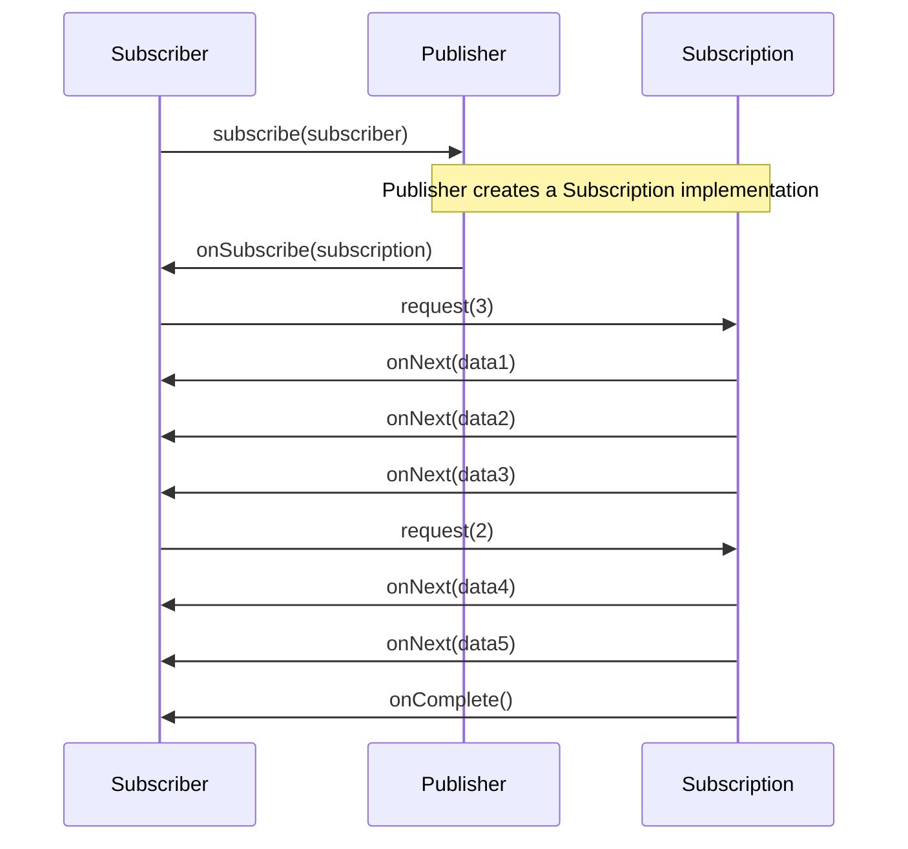
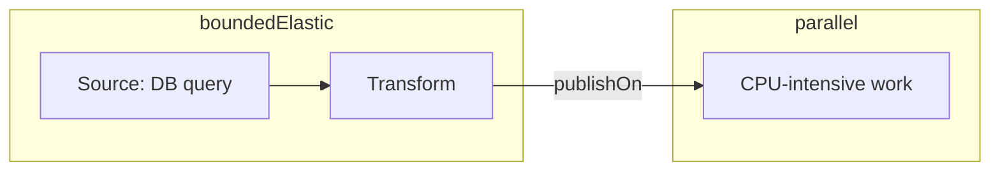
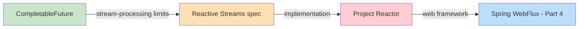

> **Understanding JVM Concurrency Models series**
> 
> 1.  [Concurrency and Parallelism Fundamentals](/en/jvm-concurrency-model-1-fundamentals/)
> 2.  [Java's Traditional Concurrency Model](/en/jvm-concurrency-model-2-java-traditional-concurrency/)
> 3.  **[Reactive Streams and Project Reactor](/en/jvm-concurrency-model-3-reactive-streams-reactor/) ← you are here**
> 4.  [Spring WebFlux](/en/jvm-concurrency-model-4-spring-webflux/)
> 5.  [Kotlin Coroutines](/en/jvm-concurrency-model-5-kotlin-coroutines/)
> 6.  [Spring + Coroutines — WebFlux, MVC, and the Limits of AOP](/en/jvm-concurrency-model-6-spring-coroutines/)
> 7.  [Virtual Threads — The Synchronous World's Answer](/en/jvm-concurrency-model-7-virtual-thread/)
> 8.  [Wrap-up — When to Choose What](/en/jvm-concurrency-model-8-conclusion-decision-framework/)

## Beyond CompletableFuture — a New Way to Control Streams

In [Part 2](/en/jvm-concurrency-model-2-java-traditional-concurrency/) we followed the evolution of Java's concurrency APIs. As the abstraction level rose from Thread → ExecutorService → CompletableFuture, asynchronous programming got progressively more comfortable — but CompletableFuture still has two fundamental limitations.

First, it's **built for single-value results**. CompletableFuture's model is "when one asynchronous task completes, handle its result." But what if you need to process data that keeps arriving in real time — stock price feeds, chat messages, sensor data? You'd have to keep creating CompletableFutures in a loop, and there's no way to treat that "stream" as a single pipeline.

Second, **backpressure control is impossible**. What if the producer sends 10,000 items per second but the consumer can only handle 100? With CompletableFuture, data either piles up in memory indefinitely, gets lost, or you hit an OutOfMemoryError. There's simply no mechanism for the consumer to say "only send me 100 for now."

This post covers the **Reactive Streams** specification that emerged to overcome these limits, and its implementation, **Project Reactor**.

## Pull vs Push — Who Drives the Data?

To understand reactive, you first have to think about the **direction of data flow**.

Java's `Iterator` and `Stream` are **Pull models**. The consumer "pulls" data by calling `next()` or a terminal operation. Since the consumer holds the initiative, rate control comes naturally — but when data isn't ready yet, the thread blocks.

The **Push model** is the opposite: the producer pushes data to the consumer whenever it's ready. Processing can be asynchronous and non-blocking, but if the producer is too fast, the consumer can't keep up.

| Model | Who drives | Examples | Strength | Limitation |
| --- | --- | --- | --- | --- |
| **Pull** | Consumer | Iterator, Stream | Natural rate control | Blocks when no data |
| **Push** | Producer | Event listeners, callbacks | Asynchronous processing | Risk of overwhelming the consumer |

Reactive Streams combines the two into a **Push + Pull (hybrid)** model. The producer pushes data by default, but the consumer calls `request(n)` to say "I can take up to n items." This is the heart of **backpressure**.

## The Reactive Streams Spec — Four Interfaces

Reactive Streams is a specification that defines the **standard interfaces** for asynchronous stream processing on the JVM. The key point is that it's a spec, not an implementation. It entered the JDK in Java 9 as the `java.util.concurrent.Flow` class, and Project Reactor, RxJava, Akka Streams, and others implement it.

The spec consists of exactly four interfaces.

```java
public interface Publisher<T> {
    void subscribe(Subscriber<? super T> s);
}

public interface Subscriber<T> {
    void onSubscribe(Subscription s);
    void onNext(T t);
    void onError(Throwable t);
    void onComplete();
}

public interface Subscription {
    void request(long n);
    void cancel();
}

public interface Processor<T, R> extends Subscriber<T>, Publisher<R> {
}
```

**Publisher** is the data source. It connects to a Subscriber through `subscribe()`.

**Subscriber** is the data consumer. Its four callback methods define the entire lifecycle: the subscription starts with `onSubscribe`, data arrives via `onNext`, and the stream terminates with either `onError` or `onComplete`.

**Subscription** is the link between Publisher and Subscriber. The Subscriber calls `request(n)` on this object to say "send me n more," and `cancel()` to cancel the subscription. This `request(n)` is what backpressure actually is.

**Processor** is an intermediate stage that is both a Publisher and a Subscriber. You'll almost never implement one yourself in practice — Reactor's operators play this role internally.

Here's how the four interact, as a sequence.



The core flow goes like this. First, `publisher.subscribe(subscriber)` — that is, the subscription starts by **passing the Subscriber as an argument to the Publisher's method**. It's easy to read it as "the Subscriber subscribes," but it's actually a method on the Publisher. Once the subscription starts, the Publisher internally **creates a Subscription implementation**. This implementation holds both a reference to the Subscriber and the data source. The Publisher hands this Subscription object to the Subscriber via `onSubscribe()`. The Subscriber calls `request(n)` on the Subscription to ask for only as much data as it wants, and **the Subscription implementation is what actually calls `onNext()` to deliver the data**. When all data has been sent it terminates the stream with `onComplete()`, or with `onError()` if an error occurs.

> The Subscription interface defines only `request(n)` and `cancel()` — there's no Subscriber field. What holds the Subscriber reference is not the interface but the **Subscription implementation** the Publisher creates. This implementation holds both the Subscriber reference and the **data source**. When the Publisher hands this implementation to the Subscriber via `onSubscribe()`, the Subscriber also ends up holding a reference to it. The result is a structure where **both sides share the Subscription implementation**, enabling two-way communication between Publisher and Subscriber.
> 
> What's worth noticing here is that when the Subscriber calls `request(n)`, the request is not forwarded to the Publisher — **the Subscription implementation handles it directly**. Since the implementation already holds the data source, it pulls data out itself and calls `subscriber.onNext()`. Likewise, `cancel()` makes the implementation stop delivering data directly. In other words, the Publisher acts as a **factory that produces the Subscription implementation**, and after creation, the data flow is carried out independently by the Subscription implementation. So Publisher and Subscriber communicate bidirectionally **through the Subscription implementation as an intermediary**, without direct references to each other — and this is also the foundation on which backpressure is built: when the Subscriber requests "just n items" via `request(n)`, the Subscription implementation delivers data according to that request.
> 
> This structure also connects to the **lazy execution** we'll cover shortly. When you chain operators like `Flux.just(1, 2, 3).map(...).filter(...)`, each operator returns a new Publisher. But no Subscription implementation exists yet. The moment `subscribe()` is called, Subscription implementations are created in a cascade across the whole chain, and only then does the pipeline start running. "Nothing happens before subscribe()" means that **only the factories (Publishers) are in place — the execution engines (Subscription implementations) haven't been built yet**.

There's one important rule: **only one of `onError` and `onComplete` is ever called, and only once.** If an error occurs, `onComplete` never arrives; if the stream completes normally, `onError` never arrives. This rule makes stream termination handling unambiguous.

## Project Reactor — Mono and Flux

Since Reactive Streams only defines interfaces, you need an implementation to actually use it. **Project Reactor** is the implementation led by the Spring team, and it's the foundation of Spring WebFlux.

> For the record, Reactor is not the only Reactive Streams implementation. **RxJava** is widely used in the Android ecosystem (the Retrofit + RxJava combo being the classic example), and **Akka Streams** is used in Scala/Akka-based distributed systems. This series covers the Spring ecosystem, so we'll focus on Reactor.

Reactor specializes the Reactive Streams `Publisher` into two types.

### Mono — 0 or 1 value

```java
// An async task with a single result, like an HTTP call
Mono<User> user = Mono.fromCallable(() -> userRepository.findById(id));

// When there may be no value
Mono<User> empty = Mono.empty();

// When emitting an error
Mono<User> error = Mono.error(new UserNotFoundException());
```

`Mono<T>` is a Publisher that asynchronously provides **0 or 1** value. Its role resembles CompletableFuture, but there are key differences.

| Aspect | CompletableFuture | Mono |
| --- | --- | --- |
| **Execution timing** | Runs immediately on creation | Runs when subscribe() is called |
| **Cancellation** | Best-effort via cancel(true) | Reliable via Subscription.cancel() |
| **Error handling** | exceptionally/handle | onErrorReturn/onErrorResume |
| **Backpressure** | Not possible | request(1)-based |
| **Thread switching** | Specify an Executor directly | publishOn/subscribeOn |

Error handling is conceptually the same — only the API names differ. **Thread switching** takes a different approach: CompletableFuture specifies an **Executor per operation**, as in `thenApplyAsync(fn, executor)`. Reactor switches threads **per pipeline segment** with `publishOn`/`subscribeOn`. It's per-operation control vs per-segment control.

The most important difference is **execution timing**. CompletableFuture starts running its internal task the moment it's created. Mono, on the other hand, does **absolutely nothing until you call subscribe()**. This is called "cold" or "lazy" execution.

```java
// CompletableFuture — the API call starts the moment this line runs
CompletableFuture<String> future = CompletableFuture.supplyAsync(() -> callApi());

// Mono — nothing has happened yet
Mono<String> mono = Mono.fromCallable(() -> callApi());

// Only now does it execute
mono.subscribe(result -> System.out.println(result));
```

Why does this matter? Lazy execution lets you **define the pipeline first and execute it later**. You chain operators to build a declaration — "when data arrives, process it like this" — and trigger the actual execution with `subscribe()`. In Spring WebFlux, when a Controller returns a `Mono`, the framework calls subscribe() at the appropriate moment.

### Flux — 0 to N values

```java
// Fixed values
Flux<String> names = Flux.just("Alice", "Bob", "Charlie");

// A range
Flux<Integer> numbers = Flux.range(1, 10);

// From a collection
Flux<User> users = Flux.fromIterable(userList);

// Periodic emission (starting at 0, every second)
Flux<Long> ticks = Flux.interval(Duration.ofSeconds(1));
```

`Flux<T>` is a Publisher that asynchronously emits **0 to N** values. Its name and usage look similar to Java's `Stream`, so let's first pin down what a Stream actually is.

> **What is a Java Stream?**
> 
> Introduced in Java 8, `java.util.stream.Stream` is a **pipeline for processing collection data in a declarative/functional style**. You transform data in the form `list.stream().filter(...).map(...).collect(...)`, and internally it executes synchronously on the calling thread. Stream's value isn't asynchronous performance — it's being able to express **"what" to do declaratively** instead of writing for loops. With `parallelStream()` you can also run in parallel on the ForkJoinPool (see [Part 2](/en/jvm-concurrency-model-2-java-traditional-concurrency/)). Its defining traits: it uses **data that already exists** (collections, arrays, etc.) as its source, and it can be **consumed only once**. As for ordering, a plain `stream()` preserves the source collection's order. Order can get shuffled only with `parallelStream()` — with a regular Stream you don't need to worry about it.

The essential differences from Flux:

| Aspect | Java Stream | Flux |
| --- | --- | --- |
| **Execution** | Synchronous (blocking) | Asynchronous (non-blocking) |
| **Consumption** | Once only | Multiple subscribes possible (when Cold) |
| **Time-based** | Not possible | interval, delay, etc. |
| **Backpressure** | Not possible | request(n)-based |
| **Error handling** | try-catch | onError signal |

Java Stream is a tool for synchronously processing data that already exists; Flux is a tool for **asynchronously processing data that hasn't arrived yet**. Patterns where data is generated over time, like `Flux.interval()`, simply can't be expressed with a Stream.

By the way, "can be subscribed multiple times" isn't unique to Flux. **A Mono that's a Cold Publisher can also be subscribed multiple times, executing fresh each time.** The difference between Mono and Flux is purely the **number of values** (0–1 vs 0–N).

### Cold vs Hot Publishers

Publishers fall into two kinds depending on when they generate data.

A **Cold Publisher** generates data from scratch for every subscription. It's like streaming a movie on Netflix — each viewer presses play and it starts from the beginning.

```java
Flux<Integer> cold = Flux.range(1, 3);

cold.subscribe(i -> System.out.println("Subscriber A: " + i));
// Subscriber A: 1, 2, 3

cold.subscribe(i -> System.out.println("Subscriber B: " + i));
// Subscriber B: 1, 2, 3 (starts over from the beginning)
```

A **Hot Publisher** emits data regardless of whether anyone is subscribed. It's like a radio broadcast — the show goes on whether or not anyone is listening, and if you tune in midway, you hear it from that point on. Use it for "in-progress data streams" like WebSocket messages, event broadcasts, or sensor data.

The main tool for creating Hot Publishers in Reactor is **Sinks**. Introduced in Reactor 3.4, the `Sinks` API creates Publishers into which you can programmatically inject (emit) data from the outside. If a Cold Publisher is "a faucet that flows automatically when you subscribe," a Sink is "a funnel the developer pours water into directly."

| Sinks factory | Values | Subscribers | Use case |
| --- | --- | --- | --- |
| `Sinks.one()` | 1 | Multiple | Hot Publisher for Mono |
| `Sinks.many().multicast()` | N | Multiple | Deliver to multiple subscribers simultaneously |
| `Sinks.many().unicast()` | N | 1 | Dedicated to a single subscriber |
| `Sinks.many().replay()` | N | Multiple | Replay past data (late subscribers receive earlier data) |

The `.onBackpressureBuffer()` in the code below is part of the Sinks builder API — a **creation-time strategy** that says "buffer data the subscriber hasn't consumed yet." It shares its name with the Flux `onBackpressureBuffer()` operator we'll cover later, but the position differs — Sinks uses it at creation time, while the Flux operator sits in the middle of a pipeline.

```java
// multicast — deliver data to multiple subscribers simultaneously
Sinks.Many<String> sink = Sinks.many().multicast().onBackpressureBuffer();
Flux<String> hot = sink.asFlux();

sink.tryEmitNext("message1"); // No subscribers yet → buffered or lost

hot.subscribe(s -> System.out.println("Subscriber A: " + s));
sink.tryEmitNext("message2"); // Only Subscriber A receives it

hot.subscribe(s -> System.out.println("Subscriber B: " + s));
sink.tryEmitNext("message3"); // Both Subscriber A and B receive it
```

`replay()` is special: it re-sends previously emitted data even to subscribers who arrive late. You can also limit the replay window, e.g. `replay().limit(5)`. It's the same pattern as showing the last few messages when you enter a chat room.

In Reactor, most factory methods — `Flux.just()`, `Flux.range()`, `Mono.fromCallable()`, and so on — create Cold Publishers. Use Sinks when you need a Hot Publisher.

## Core Operators — Transforming and Combining Data

Reactor's operators are tools for declaratively transforming stream data. Many share names with the Java Stream API's `map` and `filter`, but operators suited to asynchronous environments have been added. Here are the frequently used ones, by category.

| Category | Operators | Role |
| --- | --- | --- |
| **Creation** | just, range, fromIterable, fromCallable | Create a source |
| **Transformation** | map, flatMap, flatMapSequential | Transform elements |
| **Filtering** | filter, take, skip, distinct | Conditional selection |
| **Combination** | zip, merge, concat | Combine multiple streams |
| **Aggregation** | reduce, collectList, count | Reduce to a result |
| **Utility** | doOnNext, doOnError, log | Side effects, debugging |

### map vs flatMap — the Most Important Distinction

`map` is a **synchronous transformation** — the function returns a value immediately (`T → R`), and the thread waits while it runs.

```java
Flux.just("alice", "bob")
    .map(name -> name.toUpperCase())
    // "ALICE", "BOB"
```

`flatMap` is an **asynchronous transformation** — the function returns a Publisher (`T → Publisher<R>`), and the actual values arrive later, asynchronously. The thread doesn't wait and can move on to the next element.

```java
Flux.just(1, 2, 3)
    .flatMap(id -> fetchUserById(id))  // Async HTTP call for each id
    // User1, User3, User2 (order not guaranteed!)
```

To sum up the key difference: use `map` for **work that completes immediately**, like string transformations or calculations, and `flatMap` for **asynchronous work whose result arrives later**, like HTTP calls or DB queries. If you call async work inside `map`, you end up with nested structures like `Mono<Mono<User>>`.

Also, `flatMap` **does not guarantee order.** It runs multiple async operations concurrently and emits results in completion order. The principle from [Part 2](/en/jvm-concurrency-model-2-java-traditional-concurrency/) — "in concurrency, order is not guaranteed by default" — applies here too. When order matters, use `flatMapSequential`. It still starts the async operations concurrently, but emits the results in the original order.

```java
Flux.just(1, 2, 3)
    .flatMapSequential(id -> fetchUserById(id))
    // User1, User2, User3 (order preserved)
```

### Combining Operators — zip, merge, concat

There are three ways to combine multiple streams.

```java
Flux<String> names = Flux.just("Alice", "Bob");
Flux<Integer> ages = Flux.just(30, 25);

// zip: 1:1 pairing — waits until both sides are ready
Flux.zip(names, ages, (name, age) -> name + "(" + age + ")")
    // "Alice(30)", "Bob(25)"

// merge: in arrival order — order not guaranteed
Flux.merge(stream1, stream2)
    // whichever arrives first

// concat: sequential — the second starts only after the first completes
Flux.concat(stream1, stream2)
    // all of stream1's data → all of stream2's data
```

`zip` fits combining the results of several async operations into one, `merge` fits merging data from multiple sources in real time, and `concat` fits sequential processing where order matters.

## Schedulers — Which Thread Does the Work?

By default in Reactor, every operation runs on **the thread that called subscribe()**. To switch threads, you have to specify a scheduler explicitly.

### publishOn and subscribeOn

The names are similar, but the roles differ.

**subscribeOn** changes **the execution thread of the source (subscription time)**. Wherever it sits in the pipeline, it applies from the source onward.

**publishOn** changes **the execution thread of subsequent operators**. Position matters — only the operators below the publishOn are affected.

```java
Flux.fromCallable(() -> blockingDbQuery())    // ① source
    .subscribeOn(Schedulers.boundedElastic())  // ① → runs on boundedElastic
    .map(data -> transform(data))              // ② runs on boundedElastic
    .publishOn(Schedulers.parallel())          // ③ thread switch happens here
    .map(data -> cpuIntensiveWork(data))       // ④ runs on parallel
    .subscribe();
```



Put simply, `subscribeOn` decides "the thread that **produces** the data," and `publishOn` decides "the thread that **processes** the data."

### The Schedulers Lineup

| Scheduler | Thread count | Use | [Part 2](/en/jvm-concurrency-model-2-java-traditional-concurrency/) equivalent |
| --- | --- | --- | --- |
| `Schedulers.parallel()` | Number of CPU cores | CPU-bound work | FixedThreadPool(core count) |
| `Schedulers.boundedElastic()` | Up to 10 \* cores | I/O, isolating blocking work | CachedThreadPool |
| `Schedulers.single()` | 1 | Sequential processing | SingleThreadExecutor |
| `Schedulers.immediate()` | Current thread | No thread switch | – |

The principle from [Part 2](/en/jvm-concurrency-model-2-java-traditional-concurrency/) — "CPU-bound work gets as many threads as cores, I/O-bound work gets more" — is reflected directly in Reactor's schedulers. `parallel()` handles CPU work with a fixed number of threads equal to the core count, while `boundedElastic()` grows threads elastically to isolate blocking I/O.

There's one more reason `boundedElastic()` matters. When you **have to call blocking code inside a reactive pipeline** (legacy JDBC, file I/O, etc.), failing to isolate it on this scheduler blocks other non-blocking work too. In [Part 2](/en/jvm-concurrency-model-2-java-traditional-concurrency/) we covered how parallelStream's commonPool slows down all parallel processing when threads block on I/O — same principle.

```java
// Integrating legacy blocking code into a reactive pipeline
Mono.fromCallable(() -> legacyJdbcQuery())
    .subscribeOn(Schedulers.boundedElastic())  // isolate the blocking work
    .flatMap(data -> reactiveProcess(data))    // non-blocking from here on
```

How often you explicitly use `publishOn`/`subscribeOn` in practice depends on **your project's reactive maturity**. If you build on a purely reactive stack (R2DBC, WebClient, reactive Redis, etc.), all I/O is non-blocking and thread switching is rarely needed. But real projects often integrate legacy JDBC, file processing, or blocking SDKs — and then `subscribeOn(Schedulers.boundedElastic())` is practically mandatory.

## Error Handling — Strategies Around the onError Signal

When an error occurs in a reactive stream, an `onError` signal propagates and **the stream terminates immediately**. Unlike try-catch, you don't catch the error and keep going — the error itself is a termination signal. So "handling" an error means, before termination, **providing a fallback value, switching to a fallback stream, or retrying**.

### Fallback Values and Fallback Streams

```java
// onErrorReturn — return a default value (catch + return default)
Mono.fromCallable(() -> riskyCall())
    .onErrorReturn("default");

// onErrorResume — switch to a fallback stream (catch + run other logic)
Mono.fromCallable(() -> primaryApi())
    .onErrorResume(e -> fallbackApi());

// onErrorMap — transform the exception type (catch + throw new)
Mono.fromCallable(() -> externalCall())
    .onErrorMap(IOException.class, e -> new ServiceException("External API failed", e));
```

### Retrying

```java
// Retry up to 3 times
Mono.fromCallable(() -> unstableApi())
    .retry(3);

// Retry with exponential backoff
Mono.fromCallable(() -> unstableApi())
    .retryWhen(Retry.backoff(3, Duration.ofSeconds(1))
        .maxBackoff(Duration.ofSeconds(10)));
```

Compared with CompletableFuture's error handling from [Part 2](/en/jvm-concurrency-model-2-java-traditional-concurrency/):

| Strategy | CompletableFuture | Reactor |
| --- | --- | --- |
| Return a default | `exceptionally(e -> defaultValue)` | `onErrorReturn(defaultValue)` |
| Fallback logic | `handle((v, e) -> ...)` | `onErrorResume(e -> ...)` |
| Transform the exception | throw inside handle | `onErrorMap(e -> new ...)` |
| Retry | Implement yourself | `retry()`, `retryWhen()` |
| Finalization | `whenComplete((v, e) -> ...)` | `doFinally(signal -> ...)` |

What stands out is that Reactor provides retry strategies (exponential backoff and the like) as operators. With CompletableFuture, implementing retries meant writing the loop and exception handling yourself.

## Backpressure — the Consumer Controls the Pace

Back to the question from the intro: "what if the producer is too fast?" We said the heart of backpressure in the Reactive Streams spec is the Subscriber requesting only what it wants via `request(n)` — so how does it actually work in Reactor?

### What request(n) Really Is

In most cases, you'll never call `request(n)` yourself. Reactor's operators send appropriate requests internally. For example, `subscribe()` requests `request(Long.MAX_VALUE)` by default — in other words, "send me everything."

```java
// Default subscribe — unbounded request (asks for everything)
flux.subscribe(data -> process(data));
```

That default is enough most of the time, but when you need fine-grained control over consumption rate, you can take over with a `BaseSubscriber`.

```java
// Controlling the request amount manually
flux.subscribe(new BaseSubscriber<String>() {
    @Override
    protected void hookOnSubscribe(Subscription subscription) {
        request(3);  // request only 3 at first
    }

    @Override
    protected void hookOnNext(String value) {
        process(value);
        request(1);  // request 1 more for each item processed
    }
});
```

### Backpressure Strategies

Even with `request(n)` limiting the amount, sometimes the producer is genuinely fast, or a Hot Publisher emits data regardless of requests. Reactor provides strategies for these situations.

| Strategy | Operator | Behavior |
| --- | --- | --- |
| **Buffer** | `onBackpressureBuffer()` | Temporarily store excess data in a buffer |
| **Keep latest** | `onBackpressureLatest()` | Keep only the most recent item, drop the rest |
| **Drop** | `onBackpressureDrop()` | Drop data that can't be processed |
| **Rate limit** | `limitRate(n)` | Split internal requests into chunks of n |

```java
// Even with a fast producer, request in chunks of at most 100
Flux.range(1, 10000)
    .limitRate(100)
    .subscribe(data -> slowProcess(data));
```

What about in the real world? **In Spring WebFlux, the framework handles backpressure for you most of the time.** HTTP runs on top of TCP, and TCP has a built-in flow control mechanism called the **window size**. The receiver (client) tells the sender (server) "I can accept up to X bytes right now," and when the receive buffer fills up, the server automatically slows down. This is essentially the same pattern as Reactive Streams' `request(n)` — "request only as much as the consumer can handle." WebFlux bridges this TCP flow control with Reactor's request(n), so the cases where you need to control backpressure yourself come down to streaming large volumes of data or dealing with a big speed mismatch with an external system.

## Debugging — the Dark Side of Reactive

One of the biggest barriers to entry for reactive programming is **how hard it is to debug**. In ordinary imperative code, when an exception occurs, the stack trace shows the call sequence of your code as-is. But in reactive code, operator chains execute asynchronously, so the stack trace is stuffed with meaningless Reactor internal classes.

```text
// A typical reactive error stack trace (hard to tell where the error occurred)
// reactor.core.publisher.Mono.map(Mono.java:...)
// reactor.core.publisher.FluxMap$MapSubscriber.onNext(...)
// ...dozens of lines of Reactor internal classes...
```

Reactor provides tools to help.

```java
// log() — print the signal flow to the console
Flux.range(1, 3)
    .log()  // prints every signal: onSubscribe, request, onNext, onComplete, ...
    .map(i -> i * 2)
    .subscribe();

// checkpoint() — add a location hint for errors
Flux.range(1, 10)
    .map(i -> riskyTransform(i))
    .checkpoint("after riskyTransform")
    .flatMap(i -> externalCall(i))
    .checkpoint("after externalCall")
    .subscribe();

// Hooks.onOperatorDebug() — global debug mode (high performance cost, dev only)
Hooks.onOperatorDebug();
```

`log()` prints every signal — subscription, requests, data emission, completion — so you can trace the flow of the pipeline. `checkpoint()` adds a developer-supplied description to the error stack trace. `Hooks.onOperatorDebug()` records the creation site of every operator, giving the most detailed information, but its performance overhead is so high that you don't use it in production.

The practical usage pattern goes like this. Putting `log()` everywhere makes the console output itself an I/O burden, so the common approach is to **attach it temporarily to the problematic pipeline, debug, and remove it**. It's not as heavy as `Hooks.onOperatorDebug()`, but you don't leave it running in production either. `checkpoint()` costs almost nothing, so it's sometimes left in place on critical pipelines.

The production-ready alternative to `Hooks.onOperatorDebug()` is the **ReactorDebugAgent**. The two tools have the same goal but work differently. `Hooks.onOperatorDebug()` **captures the entire call stack** with `new Exception().getStackTrace()` every time an operator is created. Walking the whole call stack, repeated for every operator, is expensive. `ReactorDebugAgent`, on the other hand, uses the **Java Agent** mechanism: at the moment the JVM loads Reactor classes into memory, it rewrites the bytecode to insert **code that captures the call site efficiently** into operator methods like `map()` and `flatMap()`. Both discover call sites at runtime, but while `Hooks` walks the entire stack, the Agent inspects only the top few frames — so the cost is far lower. Just add the dependency and call `ReactorDebugAgent.init()` at application startup.

| Tool | Performance cost | Use | Environment |
| --- | --- | --- | --- |
| `log()` | Low (I/O output) | Tracing a specific pipeline | Dev, temporary debugging |
| `checkpoint()` | Near zero | Error location hints | Dev + production |
| `Hooks.onOperatorDebug()` | High | Global debugging | Dev only |
| `ReactorDebugAgent` | Low (efficient capture) | Global debugging | Dev + production |

> **Hooks vs ReactorDebugAgent — why the performance difference?**
> 
> Both record "who called this" at runtime when an operator is created. The difference is **where the recording code runs**. `Hooks` runs in a callback outside Reactor, so it can't know which frame of the call stack holds the user code — it has to **capture the entire stack** with `new Exception().getStackTrace()`. `ReactorDebugAgent` uses the **Java Agent** mechanism (rewriting bytecode as the JVM loads classes into memory) to insert the capture code **inside** operator methods like `Flux.map()`. Since the frame right above the operator method is guaranteed to be user code, it can use `StackWalker` (Java 9+) to **inspect just 1–2 frames** and stop.
> 
> ```java
> // The Hooks approach — build the whole stack as an array, then pick what you need (heavy)
> StackTraceElement[] all = new Exception().getStackTrace();
> 
> // The ReactorDebugAgent approach — inspect only the frames you need, then stop (light)
> StackWalker.getInstance().walk(frames ->
>     frames.skip(1)  // skip the current method
>         .findFirst()  // grab just the frame above and stop walking
>         .map(f -> f.getFileName() + ":" + f.getLineNumber())
>         .orElse("unknown")
> );
> ```
> 
> `StackWalker` is **lazily evaluated**, like a Java Stream. When it hits `findFirst()`, it stops walking the stack immediately — so whether the stack is 50 frames or 500, you only pay for the 1–2 frames you inspect.

## Wrap-up — from Imperative to Declarative

Comparing [Part 2](/en/jvm-concurrency-model-2-java-traditional-concurrency/)'s traditional Java concurrency with Reactor, the most fundamental change is the **shift in programming paradigm**.

```java
// Imperative (Part 2) — you control "how" it runs
ExecutorService executor = Executors.newFixedThreadPool(4);
List<Future<User>> futures = new ArrayList<>();
for (int id : userIds) {
    futures.add(executor.submit(() -> fetchUser(id)));
}
for (Future<User> f : futures) {
    User user = f.get();           // blocking
    if (user.isActive()) {
        sendEmail(user);           // sequential
    }
}
executor.shutdown();

// Declarative (Reactor) — you declare only "what" to do
Flux.fromIterable(userIds)
    .flatMap(id -> fetchUserReactive(id))
    .filter(User::isActive)
    .flatMap(user -> sendEmailReactive(user))
    .subscribe();
```

In the imperative code, the developer spells out "how" everything happens: creating the thread pool, submitting tasks, waiting for results, looping, shutting down. In the declarative code, you describe only **what** to do — "fetch the users → keep only the active ones → send them emails" — and Reactor handles thread management and asynchronous execution.

This shift isn't just about convenience. In the declarative model, **backpressure, error propagation, cancellation, and thread switching** blend naturally into the pipeline, so the complex concurrency control you had to hand-build in the imperative world can be solved by composing operators.

Of course, there are trade-offs: debugging difficulty, the learning curve, and the practical constraint that not every library supports reactive. In particular, integrating blocking APIs (JDBC, file I/O, etc.) into a reactive pipeline requires isolating them with `subscribeOn(Schedulers.boundedElastic())` — and as that kind of code accumulates, the benefits of reactive get diluted.



In the next post we'll cover **WebFlux**, the framework Spring built on top of Reactor. We'll look at how Reactor's Mono/Flux are put to work in the web world — HTTP request-response, WebSocket, SSE — how it connects to Netty's **event loop** architecture, and how it differs from classic Spring MVC.

## References

-   [Reactive Streams Specification](https://www.reactive-streams.org/)
-   [Project Reactor Reference Guide](https://projectreactor.io/docs/core/release/reference/)
-   [Baeldung — Intro to Project Reactor](https://www.baeldung.com/reactor-core)
-   [Reactive Manifesto](https://www.reactivemanifesto.org/)
