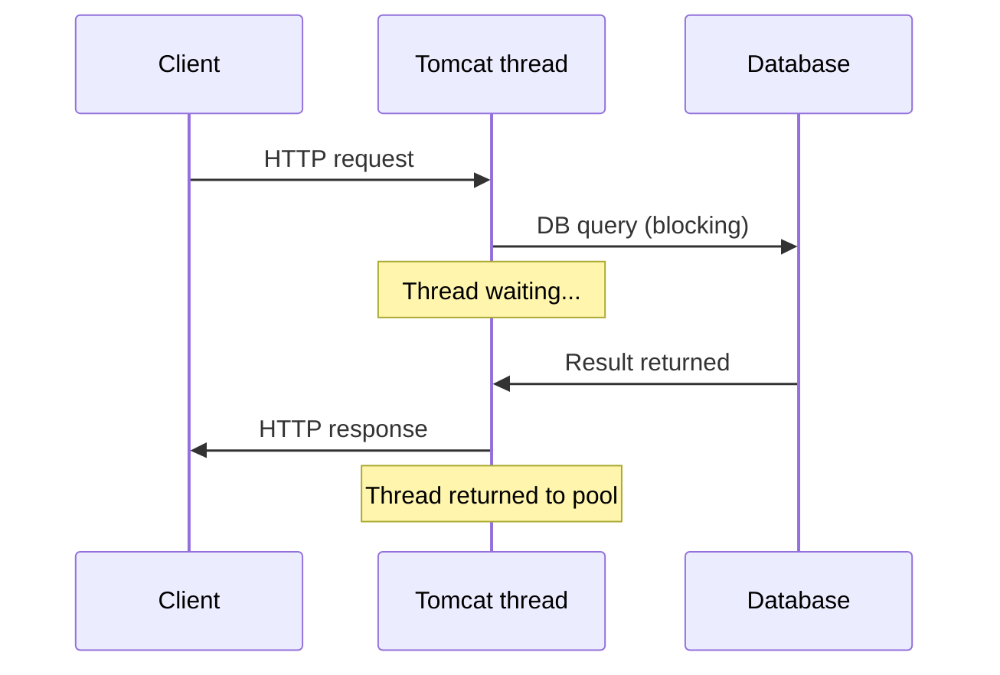
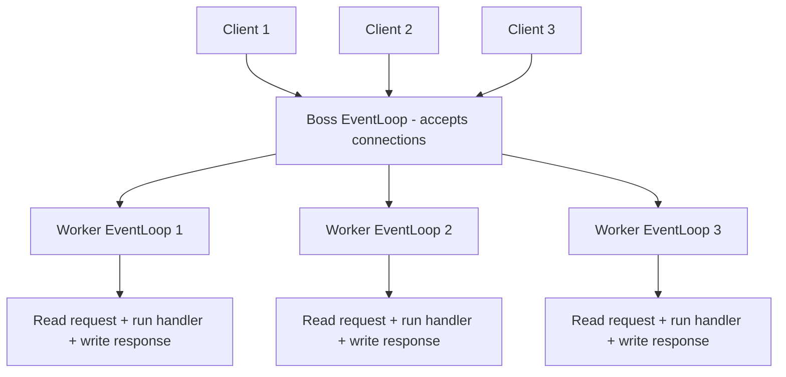
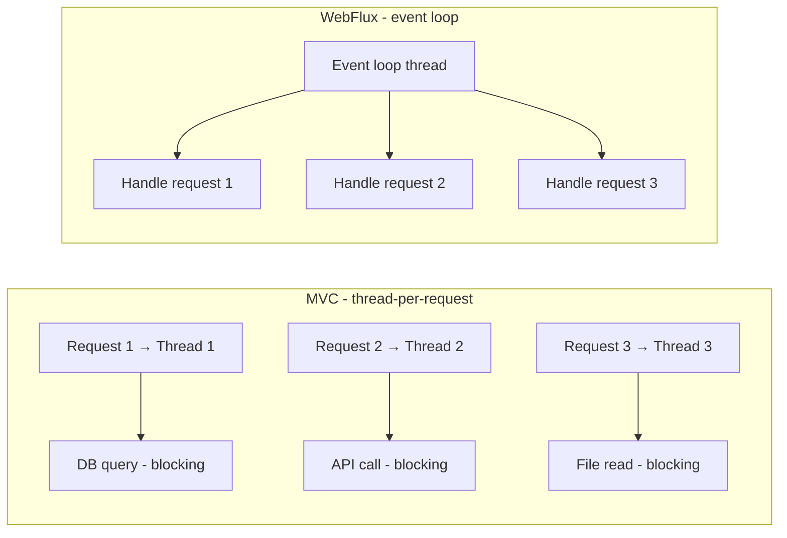
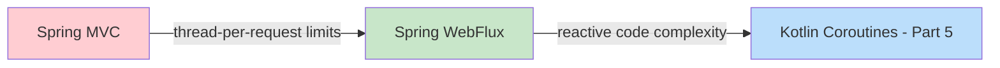

> **Understanding the JVM Concurrency Model series**
> 
> 1.  [Concurrency and Parallelism Fundamentals](/en/jvm-concurrency-model-1-fundamentals/)
> 2.  [Java's Traditional Concurrency Model](/en/jvm-concurrency-model-2-java-traditional-concurrency/)
> 3.  [Reactive Streams and Project Reactor](/en/jvm-concurrency-model-3-reactive-streams-reactor/)
> 4.  **[Spring WebFlux](/en/jvm-concurrency-model-4-spring-webflux/) ← current post**
> 5.  [Kotlin Coroutines](/en/jvm-concurrency-model-5-kotlin-coroutines/)
> 6.  [Spring + Coroutines — WebFlux, MVC, and the Limits of AOP](/en/jvm-concurrency-model-6-spring-coroutines/)
> 7.  [Virtual Threads — The Synchronous World's Answer](/en/jvm-concurrency-model-7-virtual-thread/)
> 8.  [Wrap-up — When to Choose What](/en/jvm-concurrency-model-8-conclusion-decision-framework/)

## When Reactor Meets the Web — Handling Many Connections with Few Threads

In Part 3 we covered the Reactive Streams spec and Project Reactor's Mono/Flux, operators, and schedulers. Reactor is a powerful library for processing asynchronous data streams, but on its own it has no way to accept HTTP requests or send responses.

This post covers **WebFlux**, the framework Spring built on top of Reactor. We'll look at which limitations of Spring MVC it was created to solve, how Netty's event loop works under the hood, and how you actually write code with it.

## The Limits of Spring MVC — 1 Request = 1 Thread

Spring MVC is a **thread-per-request** model. When an HTTP request comes in, Tomcat takes a thread from its thread pool, that thread handles the request, and once the response is complete the thread is returned to the pool.



This model is simple and intuitive, but it has one problem: **while a thread waits on I/O, it can do nothing else**. If a DB query takes 500ms and an external API call takes 1 second, the thread sits there blocked, wasted, for that entire time.

Tomcat's default thread pool has 200 threads. If every request calls an external API and takes 1 second on average, you can handle at most 200 requests concurrently. From the 201st request onward, requests wait in a queue until a thread is freed.

| Scenario | Concurrent requests possible | Bottleneck |
| --- | --- | --- |
| Simple CRUD (10ms) | Theoretically very many | CPU |
| External API call (1s) | ~200 | **Thread waiting** |
| Chained API calls (3s) | ~66 | **Thread waiting** |

Couldn't we just make the thread pool bigger? Threads aren't free. Each thread occupies stack memory (1MB by default) and incurs context-switching costs. Increase the thread count and memory usage and scheduling overhead grow with it. Recalling the thread pool sizing principles from [Part 2](/en/jvm-concurrency-model-2-java-traditional-concurrency/), scaling threads indefinitely is not a solution.

WebFlux offers a different approach to this problem — **instead of creating more threads, let a small number of threads handle more requests without ever blocking.**

## Netty and the Event Loop — the Engine of WebFlux

Spring MVC runs on **Tomcat** (a Servlet container). Tomcat handles accepting HTTP connections, parsing requests, and sending responses, while Spring MVC handles routing and business logic on top of it. You can also choose Jetty or Undertow, but the role is the same.

Spring WebFlux runs on **Netty** by default. Netty is a network framework built on non-blocking I/O that uses the **event loop** model. The symmetry makes the structure clear — **MVC = the Spring MVC framework + Tomcat (blocking network)**, **WebFlux = a Reactor-based framework + Netty (non-blocking network)**.

> **To sort out the relationship between specifications and implementations:**
> 
> | Layer | Specification (interface) | Implementations |
> | --- | --- | --- |
> | **Network** | Servlet spec (Jakarta Servlet) | Tomcat, Jetty, Undertow |
> | **Reactive streams** | Reactive Streams spec | Project Reactor, RxJava |
> | **Web framework** | — | Spring MVC, Spring WebFlux |
> 
> It's worth understanding the Servlet spec a bit more precisely here. The Servlet spec is not implemented in full by a single party — it defines a contract with **two sides**: the **container side** and the **application side**.
> 
> **What Tomcat implements (container/infrastructure)**: interfaces like `HttpServletRequest` and `HttpServletResponse`. It parses HTTP bytes to build these objects, and takes care of session management, thread pool management, and so on.
> 
> **What Spring implements (application)**: it provides `DispatcherServlet`, which extends the abstract class `HttpServlet`. By overriding methods like `doGet()` and `doPost()`, it handles the web framework features — routing, invoking controllers, view resolution, and so on.
> 
> The flow where the two meet goes like this: HTTP bytes arrive → **Tomcat** parses them and creates `HttpServletRequest`/`HttpServletResponse` objects → **Tomcat** calls `DispatcherServlet.service(request, response)` → **Spring**'s DispatcherServlet reads the request, finds and executes a controller, and writes the result to the response → **Tomcat** converts the response back into HTTP bytes and sends them over the network. The Servlet spec defines the **boundary** between container and application as interfaces, and Tomcat and Spring each implement their own side so the two compose and work together.
> 
> By contrast, **Netty is not an implementation of any Java standard specification.** It uses the Java NIO API internally, but it is an **independent asynchronous network framework** unrelated to standards like Servlet. It provides its own abstractions: Channel, EventLoop, Pipeline, and so on.
> 
> Tomcat's original design was "deploy an app into a container (WAR deployment)", while Netty's is "build an app with a framework". In a **Spring Boot environment, however, both are used as embedded servers** — Spring Boot detects an MVC dependency and spins up embedded Tomcat, or detects a WebFlux dependency and spins up embedded Netty, automatically. So from a developer's point of view, whether it's Tomcat or Netty, you never configure it directly — you just run `java -jar`.

### What Is an Event Loop

An event loop is **a structure in which a single thread spins in an infinite loop, watching for events and processing them**. Instead of blocking while waiting on I/O, the thread registers a "let me know when the I/O is ready" request and goes on to process other events.

```java
// A conceptual event loop (not actual Netty code)
while (true) {
    // Step 1: check the Selector for I/O events → process any found
    List<Event> events = selector.select();
    for (Event event : events) {
        if (event.isReadable()) handleRead(event);
        if (event.isWritable()) handleWrite(event);
        if (event.isAcceptable()) handleAccept(event);
    }

    // Step 2: check the task queue for work → process any found
    while (!taskQueue.isEmpty()) {
        Runnable task = taskQueue.poll();
        task.run();  // e.g. channel registration, timer callbacks, etc.
    }
}
```

The code above is exactly one EventLoop. **EventLoop = 1 thread**, and this thread alternately polls two sources. The **Selector** is the source of network I/O events ("data has arrived on this channel to read"), and the **task queue** is the queue of general work handed over by other threads ("please register this channel"). Both are polled — the thread actively goes and checks them. They are sources that tell the loop "what to process", and the EventLoop thread is the executor. There is no separate "thread watching over the event loop" — **the watcher and the worker are the same thread**.

The Java NIO `Selector` we covered in [Part 1](/en/jvm-concurrency-model-1-fundamentals/) plays the key role here. A single Selector watches thousands of connections and picks out only the ones whose I/O is ready to process.

> **Why a Selector stays efficient while watching thousands of channels**
> 
> Inside the Selector, OS-level I/O multiplexing (**epoll** on Linux, **kqueue** on macOS) is at work. The early mechanisms, `select()`/`poll()`, iterated over every registered channel from start to finish, checking one by one — even if only 3 out of 10,000 channels were ready, all 10,000 had to be checked (O(n)).
> 
> epoll/kqueue take a different approach. When you register a channel, you tell the kernel "remember when this channel's state changes", and the kernel adds the channel to a "ready list" at the moment data arrives from the network card. When you call `epoll_wait()`, it **returns only the channels that are ready** — if 3 out of 10,000 are ready, it hands back just those 3 and doesn't even look at the other 9,997 (O(number ready)). This is the core principle that lets a handful of EventLoop threads watch tens of thousands of concurrent connections.

Node.js uses the same principle (an event loop), but Node.js has a **single event loop**. Netty has **multiple event loops** — usually as many event loop threads as CPU cores — so it takes advantage of multiple cores.

### Boss and Worker Event Loops

Netty divides its event loops into two groups.



The **Boss EventLoopGroup** usually consists of **1 EventLoop** (= 1 thread). Its only job is to accept incoming client connections; once a connection is established, it hands it off to a Worker.

The **Worker EventLoopGroup** consists of multiple EventLoops (= multiple threads) and does the actual work — reading request data, running handlers (business logic), and writing responses. The number of Worker EventLoops is usually set to **2x the number of CPU cores**. On an 8-core server, 16 Worker EventLoops (= 16 threads) handle thousands to tens of thousands of concurrent connections.

> **Inside an EventLoop, and how Boss → Worker distribution works**
> 
> Each EventLoop internally holds two things: a **Selector** and a **task queue**. The thread spins in an infinite loop, alternating between the two: check the Selector for I/O events → process the task queue's work → repeat.
> 
> The handoff of work from Boss to Worker goes like this:
> 
> 1.  The Boss EventLoop's Selector detects an **ACCEPT event**
> 2.  The Boss accepts the connection and obtains a SocketChannel
> 3.  The Boss picks one of the Worker EventLoops (round robin) and **puts a "register this channel" task into that Worker's task queue**
> 4.  The Worker pulls this task from its queue → registers the channel with its own Selector
> 5.  From then on, READ/WRITE events on this channel are **detected directly by the Worker's Selector**
> 
> Note that **a connection and a request are different concepts**. Multiple HTTP requests can arrive over a single TCP connection (HTTP Keep-Alive). The Boss is involved **only once, when the TCP connection is established**. Requests arriving on the same connection afterward are detected as READ events by the Worker's Selector and handled directly. Once registered, a channel is permanently bound to that Worker EventLoop.
> 
> To summarize: a second request from the same client → handled directly by the Worker (Boss not involved). A first connection from a new client → Boss ACCEPTs → registers with a Worker.

### MVC vs WebFlux Request Handling Compared



In MVC, each request gets its own thread, and that thread blocks during I/O. In WebFlux, a single event loop thread handles multiple requests in turn. While one request waits on I/O, the thread processes other requests, and when the I/O completes it comes back and picks up where it left off.

### What You Must Never Do on an Event Loop

The event loop model has one rule above all others — **never block an event loop thread.**

In MVC there are 200 threads, so if one blocks, the other 199 keep working. But there are only **8–16** Worker EventLoop threads (plus 1 Boss dedicated to accepting connections). If one of them blocks, **every one of the hundreds to thousands of connections that EventLoop was responsible for grinds to a halt.**

```java
// Code you must never write in WebFlux
@GetMapping("/users/{id}")
public Mono<User> getUser(@PathVariable Long id) {
    // JDBC is blocking — this stalls the event loop thread!
    User user = jdbcTemplate.queryForObject("SELECT ...", User.class, id);
    return Mono.just(user);
}

// The right way: isolate blocking work onto boundedElastic
@GetMapping("/users/{id}")
public Mono<User> getUser(@PathVariable Long id) {
    return Mono.fromCallable(() -> jdbcTemplate.queryForObject("SELECT ...", User.class, id))
        .subscribeOn(Schedulers.boundedElastic());
}
```

The `subscribeOn(Schedulers.boundedElastic())` we covered in [Part 3](/en/jvm-concurrency-model-3-reactive-streams-reactor/) gets its practical use here. You isolate blocking I/O onto a dedicated thread pool to protect the event loop threads.

## Spring MVC vs WebFlux — a Structural Comparison

WebFlux does not **replace** Spring MVC — it is **an alternative suited to different workloads**. Both coexist within the Spring Framework, and you choose based on the characteristics of your project.

### What They Share

They have more in common than you might think. Annotations like `@Controller`, `@RestController`, `@RequestMapping`, and `@GetMapping` work identically in both. Spring Security, Bean Validation, and friends work on both sides too. This is why the learning cost is relatively low for an MVC developer moving to WebFlux.

### What Differs

| Aspect | Spring MVC | Spring WebFlux |
| --- | --- | --- |
| **Default server** | Tomcat (Servlet) | Netty (non-blocking) |
| **Threading model** | thread-per-request (~200) | event loop (~cores \* 2) |
| **Return types** | `T`, `ResponseEntity<T>` | `Mono<T>`, `Flux<T>` |
| **I/O** | Blocking is natural | Non-blocking is mandatory |
| **DB access** | JDBC, JPA | R2DBC, reactive drivers |
| **HTTP client** | RestClient (Spring 6.1+) | WebClient |
| **Streaming** | Limited | SSE, WebSocket come naturally |

### When to Choose Which

**When MVC fits**: most web applications fall here. For JDBC/JPA-based CRUD, projects that depend on blocking libraries, or teams unfamiliar with reactive programming, MVC is the better choice. If blocking I/O isn't your bottleneck, switching to WebFlux won't yield much perceptible performance gain.

**When WebFlux fits**: WebFlux shines when you need to handle massive numbers of concurrent connections (chat, notifications, streaming), when there's a lot of non-blocking communication between microservices, or when you can build the whole stack reactively (R2DBC, WebClient, reactive Redis, and so on).

> One caveat: if you use WebFlux but make lots of blocking calls internally, you can end up with something more complex — and slower — than MVC. WebFlux's advantage is maximized when **the entire pipeline is non-blocking**. Mix in partial blocking and you accumulate `boundedElastic` isolation code, gaining only reactive complexity.

### Performance Benchmarks — the Difference in Numbers

The performance gap between MVC and WebFlux changes dramatically with the **number of concurrent connections**.

| Scenario | Spring MVC | Spring WebFlux (non-blocking) |
| --- | --- | --- |
| **Low concurrency** (50 connections) | Negligible difference | Negligible difference |
| **High concurrency** (1,000+ connections) | Thread exhaustion, queueing | Stable processing |
| **500ms I/O wait** | Caps at ~200 concurrent requests | Thousands of concurrent requests |
| **Threads used** | ~200 | ~16 (cores × 2) |
| **p99 latency (high load)** | Seconds (queueing) | Hundreds of ms |

The pattern that shows up consistently across benchmarks is this: with few concurrent connections, MVC and WebFlux have nearly identical throughput and response times. But once concurrent connections exceed the thread pool size, MVC degrades sharply — requests pile up in the queue and p99 latency climbs to multiple seconds. WebFlux maintains stable response times even in that regime.

> These figures are general tendencies observed across various benchmarks. Actual performance depends on I/O wait times, business logic complexity, hardware, and more. For direct benchmark results, see [Aleksandr Filichkin's MVC vs WebFlux comparison](https://filia-aleks.medium.com/microservice-performance-battle-spring-mvc-vs-webflux-80d39fd81bf0), [The Practical Developer's performance analysis](https://thepracticaldeveloper.com/full-reactive-stack-4-conclusions/), and [Ippon Technologies' WebFlux performance tests](https://blog.ippon.tech/spring-5-webflux-performance-tests).

The takeaway is clear — WebFlux is **not "a faster framework" but "a framework that handles more concurrent connections with fewer resources."**

## WebFlux Handlers — Two Programming Models

WebFlux offers two ways to handle requests.

### The Annotation Model — Same Style as MVC

This is the most familiar style for existing MVC developers. You just change the return types to `Mono`/`Flux`.

```java
@RestController
@RequestMapping("/users")
public class UserController {

    private final UserRepository userRepository;  // reactive repository

    @GetMapping("/{id}")
    public Mono<User> getUser(@PathVariable Long id) {
        return userRepository.findById(id);
    }

    @GetMapping
    public Flux<User> getAllUsers() {
        return userRepository.findAll();
    }

    @PostMapping
    public Mono<User> createUser(@RequestBody User user) {
        return userRepository.save(user);
    }
}
```

This is almost identical to an MVC controller. `@RestController`, `@GetMapping`, `@RequestBody`, and the rest are all the same. The only difference is that methods return `Mono<User>` instead of `User`. The framework subscribe()s to the returned Mono/Flux and converts the result into the HTTP response.

### Functional Endpoints — RouterFunction + HandlerFunction

This model defines routing in code.

```java
@Configuration
public class RouterConfig {

    @Bean
    public RouterFunction<ServerResponse> userRoutes(UserHandler handler) {
        return RouterFunctions.route()
            .GET("/users/{id}", handler::getUser)
            .GET("/users", handler::getAllUsers)
            .POST("/users", handler::createUser)
            .build();
    }
}

@Component
public class UserHandler {

    private final UserRepository userRepository;

    public Mono<ServerResponse> getUser(ServerRequest request) {
        Long id = Long.parseLong(request.pathVariable("id"));
        return userRepository.findById(id)
            .flatMap(user -> ServerResponse.ok().bodyValue(user))
            .switchIfEmpty(ServerResponse.notFound().build());
    }

    public Mono<ServerResponse> getAllUsers(ServerRequest request) {
        return ServerResponse.ok().body(userRepository.findAll(), User.class);
    }

    public Mono<ServerResponse> createUser(ServerRequest request) {
        return request.bodyToMono(User.class)
            .flatMap(userRepository::save)
            .flatMap(user -> ServerResponse.created(URI.create("/users/" + user.getId()))
                .bodyValue(user));
    }
}
```

The **RouterFunction** defines "which path connects to which handler", and the **HandlerFunction** contains the actual request-handling logic.

### Choosing Between the Two

| Aspect | Annotation model | Functional model |
| --- | --- | --- |
| **Learning cost** | Low (same as MVC) | High (a new pattern) |
| **Route definitions** | Scattered across annotations | Concentrated in one place in code |
| **Testing** | MockMvc style | Easy to test as plain functions |
| **Best fit** | Most projects | API gateways, dynamic routing |

In practice, **the annotation model is used overwhelmingly more often**. It's an easy transition from MVC and a pattern the whole team already knows. The functional model is useful in special cases where routing must be controlled programmatically (e.g. configuration-driven dynamic routing).

## WebClient — the Non-Blocking HTTP Client

In WebFlux, you use **WebClient** to call external APIs. Spring MVC's synchronous HTTP clients must not be used on an event loop thread — they block.

> Spring MVC's HTTP client has evolved across generations: `RestTemplate` → `RestClient` (Spring 6.1+). `RestTemplate` is currently in maintenance mode, and `RestClient` is recommended for new MVC projects. `RestClient` offers a fluent API similar to `WebClient` but is **synchronous and blocking**. `WebClient`, on the other hand, is the **non-blocking** client — it ships with the WebFlux dependency but can also be used in MVC projects.

### Basic Usage

```java
WebClient client = WebClient.builder()
    .baseUrl("https://api.example.com")
    .build();

// GET request
Mono<User> user = client.get()
    .uri("/users/{id}", 1)
    .retrieve()
    .bodyToMono(User.class);

// POST request
Mono<User> created = client.post()
    .uri("/users")
    .bodyValue(new User("Alice", "alice@example.com"))
    .retrieve()
    .bodyToMono(User.class);

// Error handling
Mono<User> userWithErrorHandling = client.get()
    .uri("/users/{id}", 1)
    .retrieve()
    .onStatus(HttpStatusCode::is4xxClientError,
        response -> Mono.error(new UserNotFoundException()))
    .onStatus(HttpStatusCode::is5xxServerError,
        response -> Mono.error(new ServiceException("External API error")))
    .bodyToMono(User.class);
```

### Compared to RestClient / RestTemplate

```java
// RestClient (Spring 6.1+) — synchronous blocking, fluent API
User user = restClient.get()
    .uri("/users/1")
    .retrieve()
    .body(User.class);
sendEmail(user);

// WebClient — non-blocking, chained as a pipeline
webClient.get().uri("/users/1")
    .retrieve()
    .bodyToMono(User.class)
    .flatMap(user -> sendEmailReactive(user))
    .subscribe();
```

You can see that `RestClient` and `WebClient` have similar API shapes. The difference is that `RestClient` returns the value immediately from `body()`, while `WebClient` returns a Mono from `bodyToMono()` — **the sync vs async distinction shows up directly in the return type.**

WebClient uses the Reactor operators from Part 3 as-is. `flatMap` for async chaining, `onErrorResume` for error handling, `retry` for retries — everything you learned in Reactor applies to WebClient.

### Timeouts and Retries

```java
Mono<User> resilientCall = webClient.get()
    .uri("/users/{id}", 1)
    .retrieve()
    .bodyToMono(User.class)
    .timeout(Duration.ofSeconds(3))
    .retryWhen(Retry.backoff(3, Duration.ofSeconds(1))
        .maxBackoff(Duration.ofSeconds(10)))
    .onErrorResume(e -> Mono.empty());
```

`timeout`, `retryWhen`, and `onErrorResume` are all Reactor operators covered in Part 3. In WebFlux, these resilience patterns can be expressed declaratively as operator compositions.

## SSE and WebSocket — Streaming Endpoints

**Streaming** is where WebFlux's strengths show most clearly. In MVC, request and response are 1:1; in WebFlux, **a single request can receive multiple responses over time**.

### Server-Sent Events (SSE)

SSE is **one-way streaming from server to client**. It's used for the server to push events to clients in real time. In WebFlux, returning a `Flux` makes SSE work automatically.

```java
@GetMapping(value = "/notifications", produces = MediaType.TEXT_EVENT_STREAM_VALUE)
public Flux<Notification> streamNotifications() {
    return notificationService.getNotificationStream();
}

// Example that pushes the server time periodically
@GetMapping(value = "/time", produces = MediaType.TEXT_EVENT_STREAM_VALUE)
public Flux<String> streamTime() {
    return Flux.interval(Duration.ofSeconds(1))
        .map(tick -> "Current time: " + LocalTime.now());
}
```

Specify `produces = MediaType.TEXT_EVENT_STREAM_VALUE` and the response is sent as `text/event-stream`. Each time the Flux emits data, an event is delivered to the client, and when `onComplete()` is called the stream ends.

> **How does the client receive SSE?** Browsers have a native API called `EventSource`. You can use it as-is in frameworks like React.
> 
> ```javascript
> // The browser's native EventSource API
> const eventSource = new EventSource("/notifications");
> eventSource.onmessage = (event) => {
>     console.log("New notification:", event.data);
> };
> eventSource.onerror = () => eventSource.close();
> ```
> 
> `EventSource` has automatic reconnection and last-event-ID tracking built in, so it's plenty on its own without extra libraries. If you need finer control (custom headers, POST requests, etc.), you can work with the Fetch API's `ReadableStream` directly, or use a library like `@microsoft/fetch-event-source`.

### WebSocket

WebSocket is **bidirectional real-time communication between client and server**. It's used for chat, real-time games, collaboration tools, and the like.

```java
@Component
public class ChatWebSocketHandler implements WebSocketHandler {

    private final Sinks.Many<String> chatSink =
        Sinks.many().multicast().onBackpressureBuffer();

    @Override
    public Mono<Void> handle(WebSocketSession session) {
        // Feed messages received from the client into the Sink
        Mono<Void> input = session.receive()
            .map(WebSocketMessage::getPayloadAsText)
            .doOnNext(chatSink::tryEmitNext)
            .then();

        // Send the Sink's messages to every client
        Mono<Void> output = session.send(
            chatSink.asFlux()
                .map(session::textMessage)
        );

        return Mono.zip(input, output).then();
    }
}

// Registering the WebSocket handler
@Configuration
public class WebSocketConfig {

    @Bean
    public HandlerMapping webSocketMapping(ChatWebSocketHandler handler) {
        Map<String, WebSocketHandler> map = Map.of("/chat", handler);
        SimpleUrlHandlerMapping mapping = new SimpleUrlHandlerMapping();
        mapping.setUrlMap(map);
        mapping.setOrder(-1);
        return mapping;
    }
}
```

The **Sinks** covered in Part 3 get their practical use here. Create a Hot Publisher with `Sinks.many().multicast()`, feed messages received from clients in via `tryEmitNext()`, and the message is delivered to every subscribed session.

### SSE vs WebSocket — How to Choose

| Aspect | SSE | WebSocket |
| --- | --- | --- |
| **Direction** | Server → client (one-way) | Bidirectional |
| **Protocol** | Runs over HTTP | Separate protocol (ws://) |
| **Reconnection** | Browser reconnects automatically | Must implement yourself |
| **Best fit** | Notifications, feeds, dashboard updates | Chat, games, collaboration |

For most real-time updates, SSE is enough. Use WebSocket only when the client also needs to send real-time messages to the server.

## Error Handling — MVC Style and WebFlux Style

Error handling in WebFlux splits into two layers.

### @ExceptionHandler — Same as MVC

The `@ExceptionHandler` you used in MVC works identically in WebFlux.

```java
@RestControllerAdvice
public class GlobalExceptionHandler {

    @ExceptionHandler(UserNotFoundException.class)
    public ResponseEntity<ErrorResponse> handleUserNotFound(UserNotFoundException e) {
        return ResponseEntity.status(HttpStatus.NOT_FOUND)
            .body(new ErrorResponse("USER_NOT_FOUND", e.getMessage()));
    }

    @ExceptionHandler(ServiceException.class)
    public ResponseEntity<ErrorResponse> handleServiceError(ServiceException e) {
        return ResponseEntity.status(HttpStatus.INTERNAL_SERVER_ERROR)
            .body(new ErrorResponse("SERVICE_ERROR", e.getMessage()));
    }
}
```

### Error Handling Inside the Reactor Pipeline

You use `onErrorResume`, `onErrorReturn`, and friends from [Part 3](/en/jvm-concurrency-model-3-reactive-streams-reactor/) inside the pipeline.

```java
@GetMapping("/users/{id}")
public Mono<ResponseEntity<User>> getUser(@PathVariable Long id) {
    return userRepository.findById(id)
        .map(ResponseEntity::ok)
        .onErrorResume(DatabaseException.class,
            e -> Mono.just(ResponseEntity.status(503).build()))
        .defaultIfEmpty(ResponseEntity.notFound().build());
}
```

The two approaches are not mutually exclusive. Errors not handled in the pipeline bubble up to `@ExceptionHandler`, so you can build a layered structure: handle business-logic errors at the pipeline level, and global common errors in `@ExceptionHandler`.

## Testing

WebFlux ships with dedicated testing tools. First, let's compare the testing tools of MVC and WebFlux.

| Aspect | Spring MVC | Spring WebFlux |
| --- | --- | --- |
| **Controller unit tests** | MockMvc / MockMvcTester (6.2+) | WebTestClient |
| **Integration tests (real server)** | TestRestTemplate | WebTestClient |
| **Stream verification** | — | StepVerifier |

> Spring MVC's **MockMvc** processes requests through the DispatcherServlet without real HTTP traffic — a fast, lightweight tool for controller unit tests. Spring 6.2+ added **MockMvcTester**, which provides AssertJ-style assertions. For integration tests, you use **TestRestTemplate**, which spins up a real server and sends HTTP. Meanwhile, since Spring 5.3 `WebTestClient` can also **bind to MockMvc**, so testing MVC controllers with a WebFlux-style API is possible too.

### WebTestClient

`WebTestClient` is a non-blocking HTTP client for testing WebFlux applications.

```java
@WebFluxTest(UserController.class)
class UserControllerTest {

    @Autowired
    private WebTestClient webTestClient;

    @MockBean
    private UserRepository userRepository;

    @Test
    void getUser_shouldReturnUser() {
        User mockUser = new User(1L, "Alice");
        when(userRepository.findById(1L)).thenReturn(Mono.just(mockUser));

        webTestClient.get().uri("/users/1")
            .exchange()
            .expectStatus().isOk()
            .expectBody(User.class)
            .isEqualTo(mockUser);
    }

    @Test
    void getUser_shouldReturn404WhenNotFound() {
        when(userRepository.findById(99L)).thenReturn(Mono.empty());

        webTestClient.get().uri("/users/99")
            .exchange()
            .expectStatus().isNotFound();
    }
}
```

### StepVerifier — Verifying Reactor Streams

We didn't cover it in Part 3, but Reactor's `StepVerifier` is a tool for verifying the behavior of reactive streams step by step.

```java
@Test
void shouldEmitThreeUsersAndComplete() {
    Flux<User> users = userService.findActiveUsers();

    StepVerifier.create(users)
        .expectNextCount(3)
        .verifyComplete();
}

@Test
void shouldHandleErrorGracefully() {
    Mono<User> user = userService.findById(999L);

    StepVerifier.create(user)
        .expectError(UserNotFoundException.class)
        .verify();
}
```

`StepVerifier` precisely verifies "which signals a reactive pipeline emits, in what order". You check values with `expectNext`, errors with `expectError`, and the completion signal with `verifyComplete`.

## Wrap-up — WebFlux Is Not a Silver Bullet

Here's a summary of what this post covered.

| Concept | Key point |
| --- | --- |
| **MVC's limits** | Threads block while waiting on I/O → concurrency = thread count |
| **Event loop** | A few threads handle massive connections via non-blocking I/O |
| **WebFlux** | Non-blocking web framework built on Reactor + Netty |
| **The core rule** | Never block on an event loop thread |

The most common mistake when adopting WebFlux is expecting it to be **"faster than MVC"**. WebFlux has higher **throughput** than MVC — it does not make **individual request latency** faster. If the same DB query takes 100ms, it takes 100ms in MVC and in WebFlux alike. WebFlux's advantage is that during those 100ms, the thread can be handling other requests.



WebFlux's reactive code is powerful, but there's plenty of feedback that `flatMap` chains and Mono/Flux return types hurt code readability. In the next post we cover **Kotlin Coroutines**, which address this problem. We'll look at how to keep the non-blocking benefits of reactive while writing asynchronous logic as naturally as if it were synchronous code.

## References

-   [Spring WebFlux Reference](https://docs.spring.io/spring-framework/reference/web/webflux.html)
-   [Spring RestClient Reference](https://docs.spring.io/spring-framework/reference/integration/rest-clients.html)
-   [Netty — User Guide](https://netty.io/wiki/user-guide-for-4.x.html)
-   [Baeldung — Spring WebFlux Guide](https://www.baeldung.com/spring-webflux)
-   [Spring WebClient Reference](https://docs.spring.io/spring-framework/reference/web/webflux-webclient.html)
-   [MVC vs WebFlux performance comparison — Aleksandr Filichkin](https://filia-aleks.medium.com/microservice-performance-battle-spring-mvc-vs-webflux-80d39fd81bf0)
