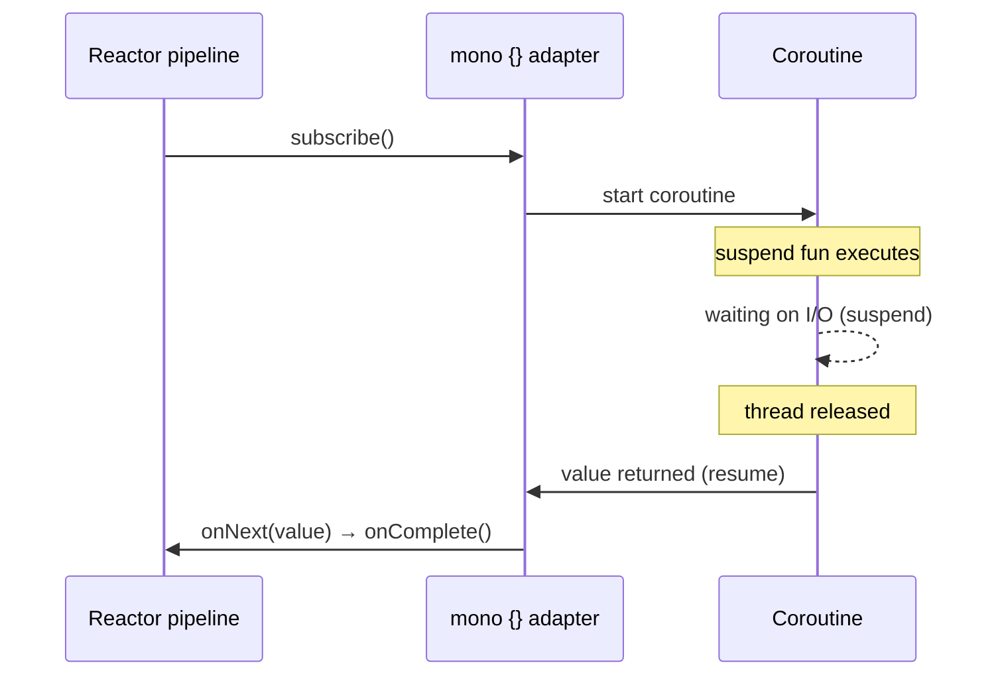
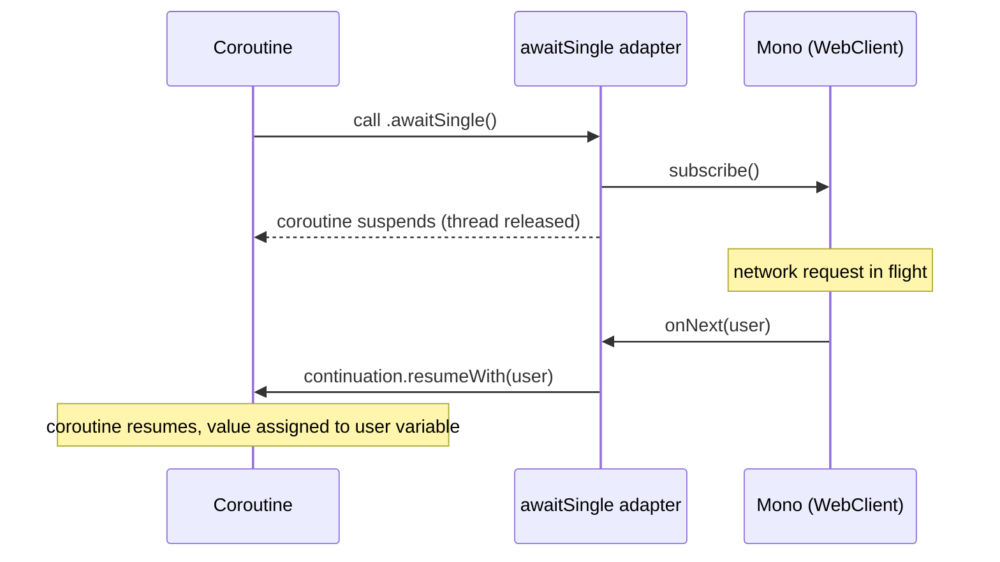
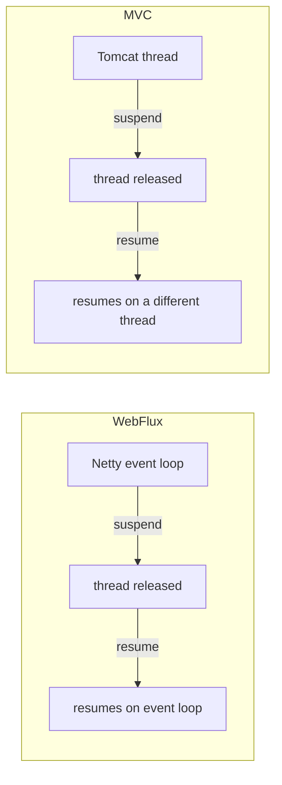
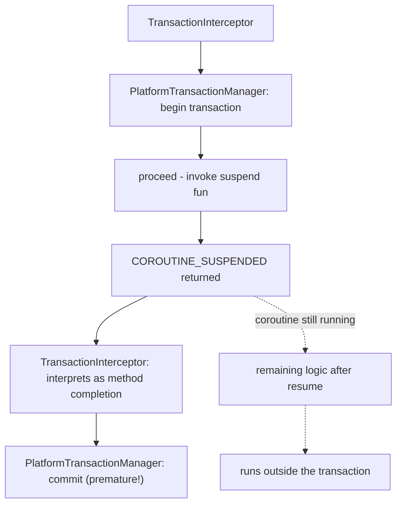
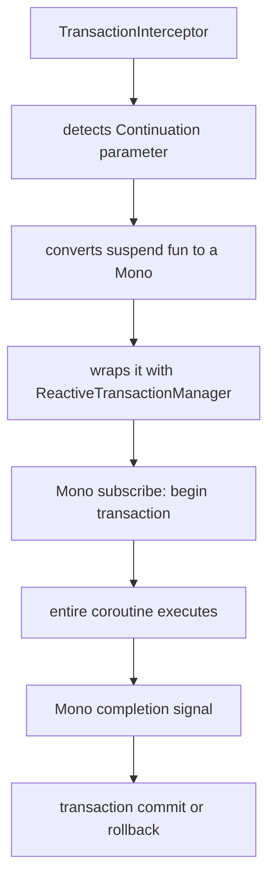
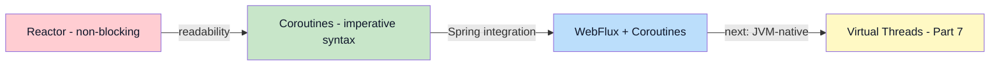

> **Understanding JVM Concurrency Models series**
> 
> 1.  [Concurrency and Parallelism Fundamentals](/en/jvm-concurrency-model-1-fundamentals/)
> 2.  [Java's Traditional Concurrency Model](/en/jvm-concurrency-model-2-java-traditional-concurrency/)
> 3.  [Reactive Streams and Project Reactor](/en/jvm-concurrency-model-3-reactive-streams-reactor/)
> 4.  [Spring WebFlux](/en/jvm-concurrency-model-4-spring-webflux/)
> 5.  [Kotlin Coroutines](/en/jvm-concurrency-model-5-kotlin-coroutines/)
> 6.  **[Spring + Coroutines — WebFlux, MVC, and the Limits of AOP](/en/jvm-concurrency-model-6-spring-coroutines/) ← you are here**
> 7.  [Virtual Threads — The Synchronous World's Answer](/en/jvm-concurrency-model-7-virtual-thread/)
> 8.  [Wrap-up — When to Choose What](/en/jvm-concurrency-model-8-conclusion-decision-framework/)

## Writing Synchronous-Looking Code on Top of Reactor — How Spring Handles suspend fun

In [Part 5](/en/jvm-concurrency-model-5-kotlin-coroutines/) we covered how coroutines work — CPS transformation, state machines, Flow, structured concurrency. We saw that coroutines let you write code that "looks synchronous but is non-blocking". One question remains, though.

**Spring WebFlux is built on Reactor.** As we covered in [Part 4](/en/jvm-concurrency-model-4-spring-webflux/), WebFlux's request-handling pipeline flows through Mono/Flux. A controller has to return `Mono<User>` for Reactor to process it. Yet a coroutine controller declares `suspend fun getUser(): User` — no Mono, no Flux.

```kotlin
// How does this code run on the Reactor pipeline?
@GetMapping("/users/{id}")
suspend fun getUser(@PathVariable id: Long): User {
    return userService.findById(id)
}
```

In this post we'll look at **the bridge between coroutines and Reactor** — the `kotlinx-coroutines-reactor` adapter — and how it connects the two worlds. Then we'll compare how the same coroutine code behaves differently in Spring WebFlux versus Spring MVC.

## kotlinx-coroutines-reactor — the Bridge Between Two Worlds

Coroutines and Reactor are separate technologies, but at their core they do the same thing — **non-blocking asynchronous processing**. As we summarized in [Part 5](/en/jvm-concurrency-model-5-kotlin-coroutines/), Reactor achieves it with `flatMap` chaining and `onNext()` callbacks, while coroutines do it with `suspend`/`resume` and state machines. [`kotlinx-coroutines-reactor`](https://kotlinlang.org/api/kotlinx.coroutines/kotlinx-coroutines-reactor/) is an adapter library that **translates** between these two ways of expressing asynchrony.

The translation goes in two directions.

### Coroutines → Reactor: `mono {}` and `flux {}`

"I want to put my coroutine code onto the Reactor pipeline" — that's when you use the `mono {}` and `flux {}` builders.

```kotlin
// mono {} — wrap the result of a suspend fun in a Mono
val userMono: Mono<User> = mono {
    // this block runs as a coroutine
    userService.findById(1L)  // suspend fun calls allowed
}

// flux {} — emit multiple values as a Flux
val usersFlux: Flux<User> = flux {
    for (id in listOf(1L, 2L, 3L)) {
        send(userService.findById(id))  // each value becomes Flux.onNext()
    }
}
```

Let's walk through what `mono {}` does internally, step by step.

**Step 1**: `mono {}` creates a `Mono` object and returns it immediately. At this point **nothing inside the block has executed** — same as Reactor's cold semantics.

**Step 2**: When the Reactor pipeline calls `subscribe()` on this Mono — only then does the coroutine start.

**Step 3**: When the coroutine returns a value, it is delivered as `Mono.onNext(value)` → `onComplete()`. If an exception is thrown, it is delivered as `Mono.onError(exception)`.



In other words, **the coroutine's start and completion map onto the Mono's subscribe and onNext**. `flux {}` works on the same principle: each value emitted via `send()` becomes a `Flux.onNext()`, and when the coroutine finishes, `onComplete()` is called.

### Reactor → Coroutines: `awaitSingle()` and `asFlow()`

Now the opposite direction. "I want to use existing Reactor code (WebClient, R2DBC, etc.) inside a coroutine" — that's when you use extension functions like `awaitSingle()` and `asFlow()`.

```kotlin
suspend fun getUser(id: Long): User {
    // a WebClient call that returns a Mono → consume it in a coroutine with awaitSingle()
    return webClient.get()
        .uri("/users/$id")
        .retrieve()
        .bodyToMono<User>()
        .awaitSingle()    // Mono → suspend
}

suspend fun getAllUsers(): Flow<User> {
    // a call that returns a Flux → convert with asFlow()
    return webClient.get()
        .uri("/users")
        .retrieve()
        .bodyToFlux<User>()
        .asFlow()         // Flux → Flow
}
```

Here's what `awaitSingle()` does internally.

**Step 1**: It calls `subscribe()` on the Mono.

**Step 2**: It **suspends** the current coroutine — the thread is released.

**Step 3**: When the Mono emits `onNext(value)` → it calls `continuation.resumeWith(Result.success(value))` to **resume** the coroutine.

**Step 4**: When the Mono emits `onError(e)` → it calls `continuation.resumeWith(Result.failure(e))` to throw the exception into the coroutine.

This is exactly where the `Continuation.resumeWith()` we covered in [Part 5](/en/jvm-concurrency-model-5-kotlin-coroutines/) gets used. Inside the Mono's `onNext` callback, the coroutine's continuation is invoked to wake up the suspended coroutine.



`asFlow()` follows the same principle — it calls `subscribe()` on the Flux and turns each `onNext` into the Flow's `emit()`. When the Flux emits `onComplete()`, the Flow terminates.

### Conversion Functions at a Glance

| Direction | Function | Description |
| --- | --- | --- |
| suspend → Mono | `mono { }` | Wrap the result of a coroutine block in a Mono |
| suspend → Flux | `flux { }` | Emit multiple values from a coroutine block via send() |
| Mono → suspend | `awaitSingle()` | Await the Mono's value and return it (throws if empty) |
| Mono → suspend | `awaitSingleOrNull()` | Await the Mono's value and return it (null if empty) |
| Flux → Flow | `.asFlow()` | Convert a Flux to a Flow |
| Flow → Flux | `.asFlux()` | Convert a Flow to a Flux |

> **Key insight**: Coroutines and Reactor don't "cooperate" — the adapter **translates** one side's API into the other's. The translation is possible because the Mono's `subscribe()`/`onNext()` callbacks and the coroutine's `suspend`/`resume` are fundamentally doing the same thing (asynchronous callbacks). This is the concrete evidence for the claim from [Part 5](/en/jvm-concurrency-model-5-kotlin-coroutines/) that "Reactor and coroutines are essentially doing the same job."

## Spring WebFlux + Coroutines — in Practice

Now that we understand the adapter, let's see how it's actually used in Spring WebFlux.

### How Spring Handles suspend fun

When you declare a controller as a `suspend fun` in Spring WebFlux, Spring uses the adapter internally to hook it into the Reactor pipeline.

```kotlin
@RestController
class UserController(private val userService: UserService) {

    // the code we write
    @GetMapping("/users/{id}")
    suspend fun getUser(@PathVariable id: Long): User {
        return userService.findById(id)
    }
}
```

When Spring discovers this `suspend fun`, it internally calls [`CoroutinesUtils.invokeSuspendingFunction()`](https://docs.spring.io/spring-framework/reference/languages/kotlin/coroutines.html), performing conceptually this transformation.

```kotlin
// what Spring does internally (conceptually)
fun getUser(id: Long): Mono<User> = mono(Dispatchers.Unconfined) {
    userService.findById(id)
}
```

Note the use of `Dispatchers.Unconfined`. Comparing it with the other dispatchers makes it clear why it was chosen. Every dispatcher starts the coroutine on the current thread and runs it on that same thread up to the first suspension point — that much is identical. The difference is what happens **after resume**.

With `Dispatchers.Default` or `Dispatchers.IO`, on resume the coroutine is put into that thread pool's queue and a pool thread picks it up — i.e., it goes through a **dispatch (scheduling)** step. `Dispatchers.Unconfined`, on the other hand, **does not dispatch**. The coroutine continues right there, on the thread that called `continuation.resume()`.

The reason Spring chose `Unconfined` for WebFlux is **to avoid unnecessary thread switches**. Reactor/Netty is already managing threads efficiently, so dispatching to the Default or IO pool on every resume would introduce pointless context switching. With `Unconfined`, the coroutine continues directly on the Netty event loop thread that executes the Mono's `onNext` callback — the most efficient option. "Reactor already manages threads well, so just run the coroutine on whatever thread Reactor hands you" — that's the intent behind `Unconfined`.

> You should not use `Unconfined` as a default in ordinary coroutine code. Outside of event-loop environments like Reactor/Netty, the thread that calls resume can be unpredictable, and your code may end up running on a thread you didn't want. `Unconfined` is only safe **when the caller is already managing threads appropriately** — and Spring WebFlux + Netty is exactly that kind of environment.

> **The event loop is a Netty concept, not a Reactor concept.** To sort out the layers: Reactive Streams only defines interfaces and prescribes no threading model. Project Reactor is a library for composing asynchronous operations; via `Schedulers` it can run on ordinary thread pools, and it has no built-in event loop. **The event loop is the pattern defined by Netty's `EventLoopGroup`**, where a small number of threads take turns handling I/O events. Because Spring WebFlux uses Netty as its default server, the Reactor pipeline ends up running on top of Netty's event loop.
> 
> This matters for understanding how the per-library event loops relate to each other. In a **WebFlux environment**, WebClient uses Reactor Netty's global resources (`HttpResources.get()`) by default, so it can **share the same event loop group** as the WebFlux HTTP server. R2DBC drivers (r2dbc-postgresql and friends), however, **create their own separate event loop groups** — HTTP I/O and DB I/O are handled on different event loops. In an **MVC environment**, the HTTP layer is Tomcat (thread-per-request), so there is no event loop there, and WebClient and R2DBC **each create their own Netty event loops**. Reactor merely runs on these event loop threads — Reactor itself does not provide an event loop.

### Return Type Mapping

Spring automatically maps a suspend fun's return type to a Reactor type.

| Coroutine controller | Spring's internal conversion | Reactor equivalent |
| --- | --- | --- |
| `suspend fun getUser(): User` | `mono { getUser() }` | `Mono<User>` |
| `suspend fun getUser(): User?` | `mono { getUser() }` | `Mono<User>` (may be empty) |
| `suspend fun getUsers(): List<User>` | `mono { getUsers() }` | `Mono<List<User>>` |
| `fun getUsers(): Flow<User>` | `.asFlux()` | `Flux<User>` |
| `suspend fun deleteUser()` | `mono { deleteUser() }` | `Mono<Void>` |

Two things here deserve attention.

First, **when returning a `Flow`, you don't add `suspend`.** `Flow` is a cold stream — nothing runs until it is `collect()`ed — so the function itself has no need to suspend; building and returning the Flow object completes immediately. `suspend fun` declares "this function itself may be suspended mid-execution", while returning a Flow declares "I return a stream definition immediately."

Second, note **the difference between `suspend fun getUsers(): List<User>` and `fun getUsers(): Flow<User>`**. Returning `List<User>` fetches all users from the DB into a list and **returns them all at once** — it converts to `Mono<List<User>>`. Returning `Flow<User>` **streams users one by one** — it converts to `Flux<User>`. With large datasets, `Flow` is more memory-efficient, and it's also the right fit for streaming responses like Server-Sent Events.

> **Streaming responses with Flow/Flux — does the connection stay open?** The behavior depends on the HTTP response's Content-Type. With the default `application/json`, Spring collects all elements of the Flux, builds a JSON array (`[{...}, {...}]`), and **responds all at once** — same as an ordinary HTTP request/response, and from the client's perspective it looks just like returning a `List` (only the server's internal memory usage differs). With `text/event-stream` (SSE) or `application/x-ndjson`, however, data is sent to the client **one item at a time as it becomes ready**, and the connection stays open until the Flux completes. That is a real "streaming" response — and unlike WebSocket, it is **one-way, server→client**, running over plain HTTP.
> 
> ```kotlin
> // SSE — items sent one by one as they become ready, connection stays open
> @GetMapping("/users/stream", produces = [MediaType.TEXT_EVENT_STREAM_VALUE])
> fun streamUsers(): Flow<User> = userRepository.findAll()
> 
> // plain JSON — collects all Flux elements and responds at once
> @GetMapping("/users")
> fun getUsers(): Flow<User> = userRepository.findAll()
> ```

### Reactor Code vs Coroutine Code — the Same Controller, Compared

Let's compare the same business logic written as a Reactor controller and a coroutine controller.

```java
// Reactor (Java) — WebFlux controller
@RestController
public class UserController {

    @GetMapping("/users/{id}")
    public Mono<UserDetail> getUserDetail(@PathVariable Long id) {
        return userRepository.findById(id)
            .flatMap(user -> orderRepository.findByUserId(user.getId())
                .collectList()
                .map(orders -> new UserDetail(user, orders)));
    }

    @GetMapping("/users")
    public Flux<User> getAllUsers() {
        return userRepository.findAll();
    }
}
```
```kotlin
// Coroutine (Kotlin) — same logic
@RestController
class UserController(
    private val userRepository: UserRepository,
    private val orderRepository: OrderRepository
) {

    @GetMapping("/users/{id}")
    suspend fun getUserDetail(@PathVariable id: Long): UserDetail {
        val user = userRepository.findById(id)
            ?: throw ResponseStatusException(HttpStatus.NOT_FOUND)
        val orders = orderRepository.findByUserId(user.id).toList()
        return UserDetail(user, orders)
    }

    @GetMapping("/users")
    fun getAllUsers(): Flow<User> {
        return userRepository.findAll()
    }
}
```

Both versions are non-blocking. Neither blocks a thread while waiting on I/O. But the coroutine version uses **variable assignment, null checks, and thrown exceptions** — it has the same shape as ordinary Kotlin code. The "same non-blocking behavior, different readability" point from the introduction of [Part 5](/en/jvm-concurrency-model-5-kotlin-coroutines/) applies at the controller level just the same.

> **The coroutine goes all the way down to the repository**: in the code above, `userRepository.findById(id)` is a suspend fun. With Spring Data R2DBC's [`CoroutineCrudRepository`](https://docs.spring.io/spring-data/r2dbc/reference/kotlin/coroutines.html), the repository interface exposes `suspend fun findById(id: Long): User?` instead of `Mono<User>`. Under the hood it converts R2DBC's Mono with `awaitSingleOrNull()`, but from the caller's perspective you're just calling a suspend fun. The whole stack — controller → service → repository — chains through suspend funs, and at the very end Spring wraps the controller's suspend fun in `mono {}` and puts it on the Reactor pipeline.

### WebClient + Coroutines

When calling external APIs, using WebClient with coroutines lets you write sequential code without `flatMap` chaining.

```kotlin
// Reactor — WebClient chaining
fun getOrderWithProduct(orderId: Long): Mono<OrderWithProduct> {
    return webClient.get()
        .uri("/orders/$orderId")
        .retrieve()
        .bodyToMono<Order>()
        .flatMap { order ->
            webClient.get()
                .uri("/products/${order.productId}")
                .retrieve()
                .bodyToMono<Product>()
                .map { product -> OrderWithProduct(order, product) }
        }
}

// Coroutine — same logic, sequential code
suspend fun getOrderWithProduct(orderId: Long): OrderWithProduct {
    val order = webClient.get()
        .uri("/orders/$orderId")
        .retrieve()
        .bodyToMono<Order>()
        .awaitSingle()
    val product = webClient.get()
        .uri("/products/${order.productId}")
        .retrieve()
        .bodyToMono<Product>()
        .awaitSingle()

    return OrderWithProduct(order, product)
}
```

Spring also provides coroutine extension functions for WebClient, such as `awaitBody<T>()` and `awaitExchange {}`. Using them makes the code even more concise.

```kotlin
suspend fun getOrderWithProduct(orderId: Long): OrderWithProduct {
    val order = webClient.get()
        .uri("/orders/$orderId")
        .retrieve()
        .awaitBody<Order>()
    val product = webClient.get()
        .uri("/products/${order.productId}")
        .retrieve()
        .awaitBody<Product>()

    return OrderWithProduct(order, product)
}
```

## Spring MVC + Coroutines — Possible, but Limited

You can declare `suspend fun` controllers in Spring MVC too. The syntax is identical to WebFlux.

```kotlin
// Spring MVC controller — same syntax as WebFlux
@RestController
class UserController(private val userService: UserService) {

    @GetMapping("/users/{id}")
    suspend fun getUser(@PathVariable id: Long): User {
        return userService.findById(id)
    }
}
```

But **the internal behavior is fundamentally different.** To understand why the same code is effective in WebFlux but limited in MVC, you need to look at the difference in threading models.

### The Threading Model Difference



**WebFlux**: the coroutine starts on an event loop thread. When it suspends, the thread is released to handle other requests. On resume, execution continues on an event loop thread. This matches the event loop model from [Part 4](/en/jvm-concurrency-model-4-spring-webflux/) exactly — **a handful of threads can serve tens of thousands of concurrent requests**.

**MVC**: the coroutine starts on a Tomcat request thread. When it suspends, the thread is released — but it goes **back to Tomcat's thread pool.** On resume, the coroutine may run on a **different thread**, not the original request thread. This difference affects ThreadLocal propagation and AOP (covered in detail in the next section).

### The Benefits and Limits of Coroutines in MVC

A different threading model changes the scope of what coroutines can buy you.

In WebFlux, the coroutine advantage is that "on suspend, the thread is released so that **the same event loop thread can run other coroutines**." Four to eight event loop threads can interleave tens of thousands of coroutines.

In MVC, when a coroutine suspends, the Tomcat request thread **is released** too — Spring MVC internally converts `suspend fun` controllers into Servlet 3.0 asynchronous processing (`DeferredResult`). The released thread returns to the Tomcat pool and can **handle other HTTP requests**, so thread utilization is better than in a purely synchronous MVC model (where a thread blocks during I/O waits). However, this benefit only holds **when the code called inside the coroutine is actually non-blocking**. If you use a blocking library like JDBC, the coroutine doesn't suspend — the thread itself blocks, and the benefit evaporates.

|  | Spring MVC + Coroutines | Spring WebFlux + Coroutines |
| --- | --- | --- |
| **Threading model** | thread-per-request (Tomcat) | event loop (Netty) |
| **Concurrent requests** | Limited by Tomcat pool size (slightly improved by async processing) | Scales independently of thread count |
| **Thread on suspend** | Returned to Tomcat pool → serves other requests | Returned to event loop → runs other coroutines |
| **ThreadLocal** | Can be lost after suspend (propagatable via context-propagation) | Not used (Reactor Context) |
| **Coroutine benefit** | Syntactic convenience + async servlet processing | Syntax + performance + scalability |

The AOP and `@Transactional` caveats apply to MVC and WebFlux alike and are covered in the next section.

> Coroutines in Spring MVC are not pointless. First, coroutine **structured concurrency** (`coroutineScope`, `async`) makes it much cleaner to run several external calls in parallel within a single request. Second, combined with non-blocking libraries (WebClient and the like), **the Tomcat thread is released on suspend** to serve other requests, so concurrent throughput improves over purely synchronous MVC. But most MVC projects are JDBC-based, and JDBC blocks — which neutralizes the coroutine's thread-release advantage. To fully reap the benefits of non-blocking I/O, you need the WebFlux + R2DBC combination.

### MVC + Non-blocking Libraries — the Real-World Hybrid Pattern

A natural question follows: "Then why not just use non-blocking libraries like R2DBC or WebClient from an MVC controller?" And indeed, this pattern is viable in practice.

```kotlin
// MVC controller + non-blocking services — a real-world hybrid pattern
@RestController
class UserController(private val userService: UserService) {

    @GetMapping("/users/{id}")
    suspend fun getUser(@PathVariable id: Long): UserDetail {
        // R2DBC-based repository (non-blocking)
        val user = userService.findById(id)
        // WebClient call (non-blocking)
        val profile = userService.fetchProfile(user.profileId)
        return UserDetail(user, profile)
    }
}
```

The flow of this pattern goes like this. A Tomcat thread enters the `suspend fun` controller; when the R2DBC or WebClient call suspends, the Tomcat thread is returned to the pool. When the non-blocking I/O completes, the coroutine resumes on another thread, and the final result is delivered to the client via `DeferredResult`.

There are sound reasons to stay on MVC instead of WebFlux, even though WebFlux was built for non-blocking. Moving to WebFlux means the Servlet API (`HttpServletRequest`, `HttpServletResponse`, `HttpSession`) **disappears entirely**, replaced by `ServerWebExchange`. Concretely:

-   **Filters**: MVC's `javax.servlet.Filter` → WebFlux's `WebFilter`. Every Servlet-based filter must be rewritten
-   **Interceptors**: MVC's `HandlerInterceptor` (`preHandle`/`postHandle`/`afterCompletion`) → WebFlux has no dedicated interceptor interface. In a `WebFilter`, everything before the `chain.filter(exchange)` call corresponds to "pre" and everything after to "post", so it's **functionally equivalent**, but you lose MVC's clean separation into distinct methods
-   **Error handling**: `@ControllerAdvice` + `@ExceptionHandler` works much like MVC, but low-level error handling uses `WebExceptionHandler` instead of Servlet error pages
-   **Sessions**: `HttpSession` (synchronous) → `WebSession` (accessed as `Mono<WebSession>`)
-   **ThreadLocal-based patterns**: `SecurityContext`, MDC, request-scoped beans, etc. all have to move to Reactor Context

The migration cost is especially steep in projects where Spring Security's `SecurityFilterChain` is deeply rooted in the Servlet stack. If the team knows MVC well and converting the whole system to WebFlux is expensive — keeping controllers on MVC while using non-blocking libraries in the service layer is a pragmatic choice. Unavoidable blocking calls can be isolated with `withContext(Dispatchers.IO)`.

> Be clear-eyed about this hybrid pattern's trade-offs: concurrent connections are capped by the Tomcat thread pool size (200 by default), the `@Transactional` AOP problem remains (see the next section), and you're only using the Reactor pipeline briefly in the service layer rather than end-to-end. Still, 200 concurrent connections is plenty for most services, and it's also meaningful as an incremental migration path. The question "if you're going non-blocking in MVC, why not just use WebFlux?" naturally arises, but in reality this middle ground is often the best fit for a given team and infrastructure.

## AOP and Coroutines — the Limits of the Proxy Model

Spring AOP works on the proxy pattern — inserting logic before and after a method call. That synchronous "call → return" assumption collides with the asynchronous execution model of coroutines (and Reactor). This problem applies to **both MVC and WebFlux**.

### ThreadLocal Propagation — a Solvable Problem

Spring MVC stores the security context, request-scoped beans, transaction state, and so on in **ThreadLocal**. When a coroutine suspends and resumes on a different thread, those ThreadLocal values vanish.

**Ordinary ThreadLocal propagation** is solvable. Using `ThreadLocal.asContextElement()` from [Part 5](/en/jvm-concurrency-model-5-kotlin-coroutines/), or `PropagationContextElement` from the [`context-propagation`](https://docs.micrometer.io/context-propagation/reference/purpose.html) library bundled with Spring Boot 3.x, ThreadLocal values are automatically restored when the coroutine resumes. Simple ThreadLocal values like MDC (log trace IDs) and SecurityContext propagate this way.

> **What improves in Spring Boot 4 / Framework 7 is the tracing context.** With the `spring.reactor.context-propagation=auto` setting and the `io.micrometer:context-propagation` dependency, tracing context (MDC, spans, etc.) is propagated into the coroutine context of `suspend fun` controllers **automatically**, even in MVC. Previously you had to manually inject a `PropagationContextElement` into the coroutine context using AOP; now Spring handles it inside `CoroutinesUtils.invokeSuspendingFunction()`.

But **`@Transactional` is a different kind of problem, one that ThreadLocal propagation cannot fix**.

### @Transactional and the AOP Lifecycle Mismatch

To understand this problem you first need to know Spring's `TransactionManager` structure. Spring provides two kinds of TransactionManager depending on the data access technology.

-   **`PlatformTransactionManager`**: used with JDBC, JPA, and blocking MongoDB drivers. Stores transaction state in **ThreadLocal**; the connection is bound to a thread
-   **`ReactiveTransactionManager`**: used with R2DBC and Reactive MongoDB. Propagates transaction state via the **Reactor Context**; the connection is not bound to a thread

This is not an MVC vs WebFlux distinction — it's a **data access technology distinction**. Even an MVC project uses `ReactiveTransactionManager` if it's on Reactive MongoDB, and even a WebFlux project uses `PlatformTransactionManager` if (unusually) it's on JDBC. Because MVC projects typically use JDBC and WebFlux projects typically use R2DBC, it looks like "MVC = Platform, WebFlux = Reactive", but the deciding factor is the data layer, not the HTTP server.

The `@Transactional` problem is not ThreadLocal loss but an **AOP lifecycle mismatch**. Through CPS transformation, a `suspend fun` returns a special value called `COROUTINE_SUSPENDED` at its first suspension point. The AOP proxy interprets that return as "the method has finished."

```kotlin
// @Transactional + suspend fun — AOP lifecycle mismatch
@Transactional
suspend fun transferMoney(from: Long, to: Long, amount: BigDecimal) {
    val sender = accountRepository.findById(from)       // suspend point!
    // ↑ the coroutine returns COROUTINE_SUSPENDED here
    // → the AOP proxy decides "the method has finished" → attempts to commit the transaction
    // → but the coroutine is still running!

    val receiver = accountRepository.findById(to)       // runs outside the transaction!
}
```

The outcome depends on how the AOP proxy handles `COROUTINE_SUSPENDED`. Let's compare the flow in the two setups.

**`PlatformTransactionManager` — the flow where AOP breaks:**



`TransactionInterceptor` only sees the return value of `proceed()`. `COROUTINE_SUSPENDED` is a special marker internal to coroutines, but from the interceptor's point of view it's just "the method returned a value." It never takes the coroutine-detection branch, and immediately asks the `PlatformTransactionManager` to commit.

**`ReactiveTransactionManager` — the coroutine-aware flow:**



When `TransactionInterceptor` finds a `Continuation` parameter in the method signature, it does not call `proceed()` as-is. Instead it uses `CoroutinesUtils` to **convert the whole suspend fun into a Mono**, wraps that Mono with the `ReactiveTransactionManager`, and manages the transaction **based on the Mono's completion signal**. However many times the coroutine suspends and resumes along the way, the transaction is held open until the Mono completes.

What matters here is **which TransactionManager you're using**.

**`PlatformTransactionManager` + JDBC**: JDBC connections are synchronous and thread-bound, so even if you made AOP wait for coroutine completion, the connection wouldn't follow the coroutine across threads. The Spring team [officially decided **not to support** this combination](https://github.com/spring-projects/spring-framework/issues/26705) (status: declined). The reasoning: "coroutine transactions build on the reactive transaction support, which by design is incompatible with thread-bound transactions (JDBC)." With Java 21's virtual threads on the scene, the suggested direction for high concurrency in MVC is to use virtual threads instead of coroutines (see Part 7).

**`ReactiveTransactionManager` + R2DBC/Reactive MongoDB**: `ReactiveTransactionManager` manages the transaction based on the Mono's completion signal and propagates transaction state via the [`Reactor Context`](https://projectreactor.io/docs/core/release/reference/#context) instead of ThreadLocal. Since the connection itself is non-blocking and not thread-bound, the transaction survives however many times the coroutine suspends, resumes, and hops threads. This can work **in MVC as well as WebFlux** — the key is not the HTTP server but whether the TransactionManager and the data access technology are reactive.

```kotlin
// PlatformTransactionManager + JDBC — incompatible with suspend fun
@Transactional  // JpaTransactionManager (PlatformTransactionManager)
suspend fun transfer(fromId: Long, toId: Long, amount: BigDecimal) {
    val from = jpaRepository.findById(fromId)   // blocking JDBC call
    val to = jpaRepository.findById(toId)       // blocking JDBC call
    jpaRepository.save(from.withdraw(amount))   // may already be outside the transaction!
    jpaRepository.save(to.deposit(amount))
}

// ReactiveTransactionManager + Reactive MongoDB — works even in MVC
@Transactional  // ReactiveMongoTransactionManager
suspend fun transfer() {
    val data = reactiveMongoRepository.findById(id)  // non-blocking
    reactiveMongoRepository.save(data)               // non-blocking
}

// programmatic, without AOP — usable in both MVC and WebFlux
// works anywhere a ReactiveTransactionManager is available
suspend fun transfer() {
    transactionalOperator.executeAndAwait {
        val data = reactiveMongoRepository.findById(id)
        reactiveMongoRepository.save(data)
    }
}
```

### Custom @Around Advice — the Same Problem, Wider Scope

The AOP lifecycle mismatch is not limited to `@Transactional`. **Every `@Around` advice — in MVC or WebFlux —** has the same problem.

```kotlin
// custom @Around advice — measuring execution time
@Around("@annotation(Measured)")
fun measureExecutionTime(pjp: ProceedingJoinPoint): Any? {
    val start = System.nanoTime()
    val result = pjp.proceed()  // ← returns COROUTINE_SUSPENDED
    // ↓ runs immediately, before the coroutine completes
    log.info("Execution time: ${System.nanoTime() - start}ns")  // wrong measurement!
    return result
}
```

When `proceed()` returns `COROUTINE_SUSPENDED`, the "after" logic runs immediately without waiting for the coroutine to complete. Execution-time measurement, result caching, return-value transformation — **every `@Around` advice that acts after method completion** is affected. `@Before` runs before the method call and is fine, but `@AfterReturning` will receive `COROUTINE_SUSPENDED` as the return value.

So why does `@Transactional` work with `ReactiveTransactionManager`? Not because it uses reactive technology per se, but because **Spring explicitly implemented coroutine detection inside `TransactionInterceptor`**. As the Mermaid diagram above showed, when `TransactionInterceptor` finds a `Continuation` parameter, it converts the suspend fun into a Mono and reroutes it through the reactive path. `CacheInterceptor` (Spring 6.1+) was likewise updated to take the Mono conversion path when it detects a suspend fun. These are **built-in interceptors to which the Spring team added coroutine awareness, one by one**.

> You might wonder: "If AOP is a problem in asynchronous environments, why does Spring keep implementing `@Transactional` with AOP? Why not replace it entirely with Reactor operators?" In fact, Spring's reactive transactions use **both AOP and Reactor operators** — with different roles. The **AOP infrastructure** (proxy creation, pointcut matching) plays the detection role: it **finds and intercepts** methods annotated with `@Transactional`. The **Reactor operators** play the execution role, **actually managing the transaction** once intercepted — inside `TransactionInterceptor`, the suspend fun is converted into a Mono, which is then wrapped in an operator chain performing transaction begin/commit/rollback. So it's not an either/or between "AOP or operators" — the structure is **detect with AOP, execute with operators**. Drop the AOP infrastructure, and the `@Transactional` annotation itself becomes unusable; every transaction would have to be written programmatically with something like `transactionalOperator.executeAndAwait {}`. To preserve the convenience of declarative programming, the Spring team kept AOP as the detection mechanism and made only the execution mechanism reactive. The reason custom `@Around` advice written by developers is problematic is that AOP handles detection for them, but **they don't implement the execution logic that converts the `proceed()` return value into a Mono**. You can see the Spring team's design direction in [Issue #26705](https://github.com/spring-projects/spring-framework/issues/26705) — the official position is that "coroutine transactions build on the reactive transaction infrastructure."

### The Alternative — Coroutine-Friendly Cross-Cutting Patterns

Custom `@Around` advice has no coroutine detection. So couldn't we just implement the Mono conversion logic ourselves, like Spring's `TransactionInterceptor` does?

```kotlin
// what if we tried coroutine detection + Mono conversion ourselves, like Spring?
@Around("@annotation(Measured)")
fun measureExecutionTime(pjp: ProceedingJoinPoint): Any? {
    val method = (pjp.signature as MethodSignature).method
    val isSuspend = method.parameterTypes.lastOrNull() == Continuation::class.java

    if (isSuspend) {
        // want to convert to a Mono like Spring's TransactionInterceptor?
        // val mono = CoroutinesUtils.invokeSuspendingFunction(method, target, *args)
        // return mono.doOnTerminate { log.info("done: ${nanoTime() - start}") }
        //
        // Problem 1: CoroutinesUtils is a Spring internal API — may change between versions
        // Problem 2: you'd have to bypass proceed() and invoke the method directly. ProceedingJoinPoint doesn't give you that level of control
        // Problem 3: you'd have to repeat this boilerplate in every custom advice
    }

    // for a suspend fun, proceed() returns COROUTINE_SUSPENDED
    // → the measurement logic below runs without waiting for the coroutine to complete
    val start = System.nanoTime()
    val result = pjp.proceed()
    log.info("Execution time: ${System.nanoTime() - start}ns")  // wrong measurement!
    return result
}
```

The core problem is that once `pjp.proceed()` has already returned `COROUTINE_SUSPENDED`, there is no way to turn that back into a Mono. Spring's `TransactionInterceptor` bypasses the `proceed()` call entirely and invokes the method directly via `CoroutinesUtils.invokeSuspendingFunction()` — possible only because it is a **framework-level interceptor** with access to the `MethodInvocation` internals, and hard to replicate in an ordinary `@Around` advice. Depending on Spring internal APIs risks breakage on version upgrades, and you'd have to write this boilerplate in every custom advice.

So the realistic alternative is a **coroutine higher-order function pattern** that bypasses the AOP proxy entirely.

```kotlin
// instead of AOP @Around — a coroutine-friendly inline function
suspend inline fun <T> measured(label: String, block: suspend () -> T): T {
    val start = System.nanoTime()
    val result = block()  // waits precisely until the suspend fun completes
    log.info("$label: ${System.nanoTime() - start}ns")
    return result
}

// usage — no AOP proxy involved, so it follows suspend/resume exactly
suspend fun getUser(id: Long): User = measured("getUser") {
    userRepository.findById(id)
}
```

Because this runs directly inside the coroutine's suspend/resume flow, the `COROUTINE_SUSPENDED` problem never arises.

In fact, this is not a problem coroutines invented. **Pure Reactor in WebFlux, with no coroutines at all, has the same limitation.** The AOP proxy operates on a method's "call → return", but for a method returning Reactor's `Mono`/`Flux`, what `proceed()` receives is a not-yet-subscribed `Mono` object — a "stream definition", not an execution result. Measure execution time and you're only measuring the time to **create** the Mono. That's why, in Reactor projects, handling cross-cutting concerns with **operator patterns** (`.doOnSubscribe()`, `.metrics()`, `.retryWhen()`, etc.) instead of AOP was already the norm before coroutines arrived. The coroutine higher-order function pattern can be seen as the coroutine version of that operator pattern — **the fundamental mismatch between asynchronous models and AOP proxies**, just surfacing in a different form.

This is a **real trade-off of asynchronous models**. In the synchronous world, the AOP proxy's "call → return" assumption holds, so a single annotation could handle a cross-cutting concern cleanly. In the asynchronous world (Reactor or coroutines alike), that assumption breaks, so you need **explicit code** — operators or higher-order functions. What used to be one annotation becomes code, so there's more of it, but that's the price of tracking the asynchronous execution flow accurately.

> To sum up: **Spring's built-in annotations** (`@Transactional`, `@Cacheable`, etc.) can be used as-is, because the Spring team has implemented coroutine detection for them (with the caveat that `@Transactional` requires a `ReactiveTransactionManager`). For **custom cross-cutting concerns** (MVC + coroutines, WebFlux + coroutines, and WebFlux + pure Reactor alike), the realistic approach is to implement them with coroutine higher-order functions or Reactor operator patterns instead of AOP annotations.

## Caveats — Common Pitfalls

### 1\. Never Use runBlocking in WebFlux

[Part 4](/en/jvm-concurrency-model-4-spring-webflux/) covered the rule "never block an event loop thread." `runBlocking` blocks the current thread, so calling it on a WebFlux event loop thread violates that rule head-on.

```kotlin
// never do this
@GetMapping("/users/{id}")
fun getUser(@PathVariable id: Long): User {
    return runBlocking {  // blocks the event loop thread!
        userService.findById(id)
    }
}

// the right way — declare a suspend fun
@GetMapping("/users/{id}")
suspend fun getUser(@PathVariable id: Long): User {
    return userService.findById(id)
}
```

Declare it as a `suspend fun` and Spring wraps it in `mono {}` internally — no `runBlocking` needed.

### 2\. Don't Make Blocking Calls Inside Coroutines

If you call a blocking library (JDBC, `Thread.sleep()`, a synchronous HTTP client) inside a coroutine, the coroutine doesn't suspend — **the thread blocks**.

```kotlin
// dangerous — JDBC call inside a coroutine
suspend fun getUser(id: Long): User {
    // JDBC is blocking! No matter how much of a suspend fun this is,
    // this call blocks the thread
    return jdbcTemplate.queryForObject("SELECT ...", User::class.java, id)
}

// if you must, isolate it on Dispatchers.IO
suspend fun getUser(id: Long): User = withContext(Dispatchers.IO) {
    jdbcTemplate.queryForObject("SELECT ...", User::class.java, id)
}
```

**The whole stack must be non-blocking** to fully benefit from coroutines. If you only convert the controller to `suspend fun` and then call JDBC in the service, the coroutine doesn't suspend — the event loop thread blocks. Use non-blocking libraries like R2DBC and WebClient, or if blocking code is unavoidable, run it on a dedicated thread pool with `withContext(Dispatchers.IO)`.

### 3\. Don't Mix Reactive and Imperative Styles

```kotlin
// confusing — two styles mixed together
suspend fun getUser(id: Long): User {
    return userRepository.findById(id)   // returns a Mono
        .map { it.copy(name = "...") }   // Reactor operator
        .awaitSingle()                   // back to coroutines
}

// clean — one consistent style
suspend fun getUser(id: Long): User {
    val user = userRepository.findById(id).awaitSingle()
    return user.copy(name = "...")
}
```

Once you've decided on coroutines, it's best for readability to cross into the coroutine world with `await`/`asFlow()` as early as possible and write the rest imperatively.

## Wrap-up — Coroutines Are Readability, Non-blocking Is Infrastructure

Here's a summary of what we covered in this post.

| Concept | Key point |
| --- | --- |
| **kotlinx-coroutines-reactor** | Translation adapter: Mono/Flux ↔ suspend/Flow |
| **mono {}** | Wrap a coroutine's result in a Mono (coroutines → Reactor) |
| **awaitSingle()** | Await a Mono's value and return it (Reactor → coroutines) |
| **Spring's internal conversion** | suspend fun → `mono(Dispatchers.Unconfined) { }` |
| **WebFlux + Coroutines** | Wins on syntax + performance + scalability |
| **MVC + Coroutines** | Syntactic convenience + async servlet processing. But limited compared to WebFlux |

What coroutines change is **the shape of the code**. Sequential code instead of `flatMap` chaining, try-catch instead of `onErrorResume`. But coroutines alone don't make anything non-blocking — actual non-blocking behavior comes from the **infrastructure** (Netty, R2DBC, WebClient); coroutines are the tool that expresses it as readable code.



Throughout this series we've followed the evolution of the asynchronous world — Future → CompletableFuture → Reactor → Coroutines, with readability and structure improving at each step. But all of that was progress within the "non-blocking asynchronous" paradigm; in the synchronous MVC world, there was no fundamental way to make blocking code like JDBC lightweight.

In the next post we'll cover **Java Virtual Threads** (Project Loom). Virtual threads are **the answer for the synchronous world**. Where coroutines take the approach of "compiler transformation that lets you write non-blocking code as if it were synchronous", virtual threads take the approach of "the JVM provides lightweight threads, making blocking code itself lightweight." You keep writing blocking code — `Thread.sleep()`, JDBC calls — as-is, while the JVM releases the carrier thread under the hood to achieve high concurrency. Java 21 also introduces Structured Concurrency (preview), offering a pattern similar to coroutines' structured concurrency. We'll compare these two technologies that solve the same problem at different levels.

## References

**Official documentation**

-   [Spring Framework — Coroutines reference](https://docs.spring.io/spring-framework/reference/languages/kotlin/coroutines.html) — Spring's coroutine support overall
-   [kotlinx-coroutines-reactor API docs](https://kotlinlang.org/api/kotlinx.coroutines/kotlinx-coroutines-reactor/) — adapter functions like mono {}, awaitSingle()
-   [Spring Data — Coroutines support](https://docs.spring.io/spring-data/r2dbc/reference/kotlin/coroutines.html) — CoroutineCrudRepository
-   [coRouter KDoc](https://docs.spring.io/spring-framework/docs/current/kdoc-api/spring-webflux/org.springframework.web.reactive.function.server/co-router.html) — functional routing DSL (an equivalent alternative to annotations)
-   [Micrometer Context Propagation — Purpose](https://docs.micrometer.io/context-propagation/reference/purpose.html) — automatic bridging of ThreadLocal ↔ Reactor Context
-   [PropagationContextElement — Spring Framework 7.0 API](https://docs.spring.io/spring-framework/docs/current/javadoc-api//org/springframework/core/PropagationContextElement.html) — context propagation for coroutines

**Blog posts and talks**

-   [Spring Blog — Going Reactive with Spring, Coroutines and Kotlin Flow](https://spring.io/blog/2019/04/12/going-reactive-with-spring-coroutines-and-kotlin-flow/) — introduction of Spring's coroutine support
-   [Spring Blog — Next level Kotlin support in Spring Boot 4](https://spring.io/blog/2025/12/18/next-level-kotlin-support-in-spring-boot-4/) — Boot 4's automatic coroutine context propagation and more
-   [Kotlin Coroutines Design Document (KEEP)](https://github.com/Kotlin/KEEP/blob/master/proposals/coroutines.md) — the design proposal for CPS transformation and state machines

**Issue tracker**

-   [@Transactional + suspend fun + MVC + JDBC — Issue #26705 (declined)](https://github.com/spring-projects/spring-framework/issues/26705) — the Spring team's official position
