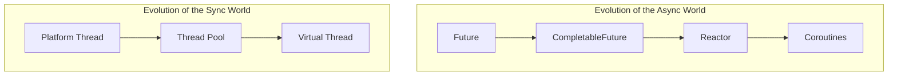
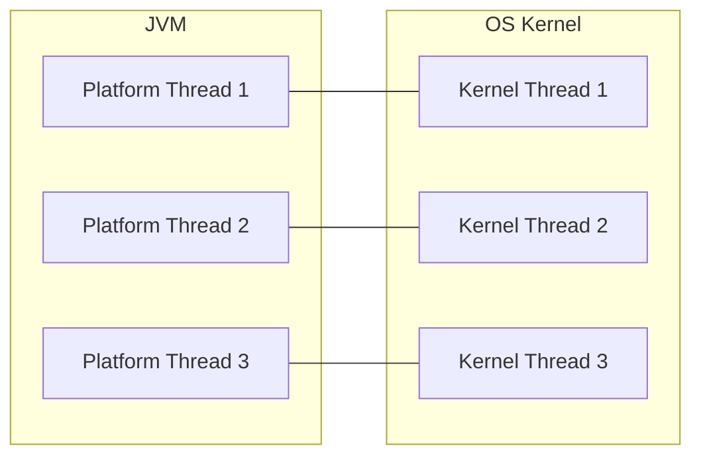
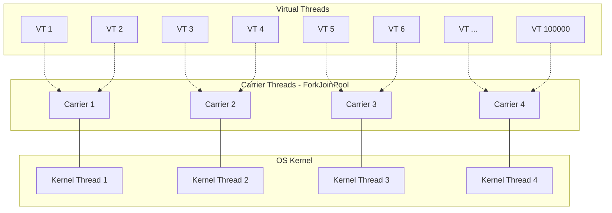
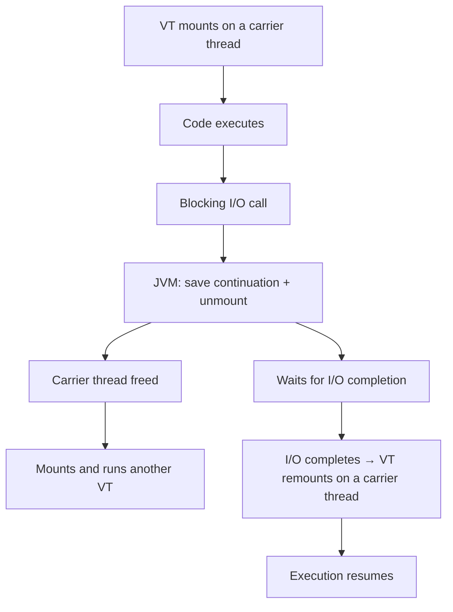
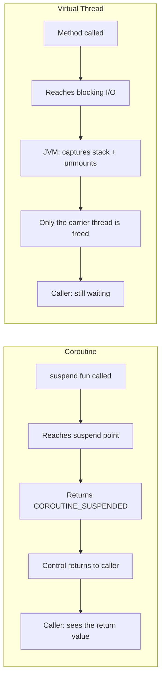
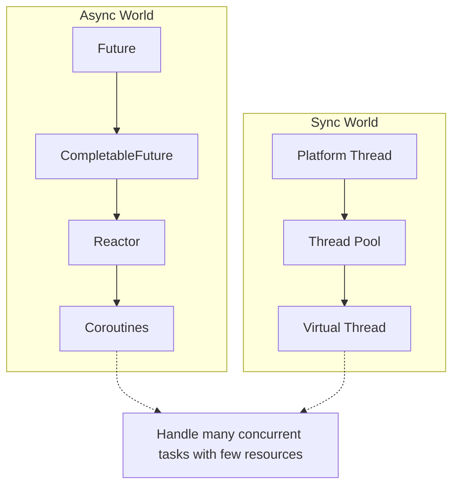

> **Understanding JVM Concurrency Models series**
> 
> 1.  [Concurrency and Parallelism Fundamentals](/en/jvm-concurrency-model-1-fundamentals/)
> 2.  [Java's Traditional Concurrency Model](/en/jvm-concurrency-model-2-java-traditional-concurrency/)
> 3.  [Reactive Streams and Project Reactor](/en/jvm-concurrency-model-3-reactive-streams-reactor/)
> 4.  [Spring WebFlux](/en/jvm-concurrency-model-4-spring-webflux/)
> 5.  [Kotlin Coroutines](/en/jvm-concurrency-model-5-kotlin-coroutines/)
> 6.  [Spring + Coroutines — WebFlux, MVC, and the Limits of AOP](/en/jvm-concurrency-model-6-spring-coroutines/)
> 7.  **[Virtual Threads — The Synchronous World's Answer](/en/jvm-concurrency-model-7-virtual-thread/) ← you are here**
> 8.  [Wrap-up — When to Choose What](/en/jvm-concurrency-model-8-conclusion-decision-framework/)

## Why Yet Another Concurrency Model?

So far in this series we have followed the evolution of the asynchronous world.


From Future to CompletableFuture, then to Reactor, and finally to Coroutines — readability and structure kept improving. But all of this was **evolution within the "non-blocking async" paradigm**. You could only reap the benefits by using non-blocking libraries (R2DBC, WebClient, Reactive MongoDB, and so on), and it was fundamentally incompatible with blocking code like JDBC or JPA.

In [Part 6](/en/jvm-concurrency-model-6-spring-coroutines/) we saw those limits in concrete terms: in the `@Transactional` + JDBC + coroutines combination, the AOP proxy interprets the `COROUTINE_SUSPENDED` return value as "method finished" and commits the transaction prematurely — and [the Spring team officially decided not to support this combination](https://github.com/spring-projects/spring-framework/issues/26705). In the synchronous, blocking world, asynchronous technology was not the answer.

Virtual threads are a **completely different approach**.



While the async world asked "how can we make non-blocking code easier to write," the sync world asked "**can we keep the blocking code as-is and only fix the cost of threads?**" Virtual threads are the answer to the latter.

## How Virtual Threads Work

### The Limits of Platform Threads

Recall Java's traditional threading model from [Part 2](/en/jvm-concurrency-model-2-java-traditional-concurrency/). A Java `Thread` (from now on, a platform thread) is **mapped 1:1** to an OS kernel thread.



Creating one platform thread creates one OS kernel thread and allocates roughly 1MB of stack memory. Create a few thousand threads and you're looking at several GB of memory alone, plus non-trivial OS-level context switching costs. That's why in practice we cap the thread count with thread pools (Tomcat defaults to 200).

The problem is that **most of that time is spent waiting on I/O**. DB queries, HTTP calls, file reads — during this blocking I/O, a platform thread holds an OS kernel thread hostage while doing absolutely nothing. Once concurrent requests exceed 200, request number 201 has to wait until a thread is returned to the pool.

To solve this, the async world chose the approach of "don't block — switch to non-blocking." Virtual threads take the exact opposite stance: **"make blocking okay."**

### Virtual Threads — Lightweight Threads Managed by the JVM

Virtual threads (JEP 444, finalized in Java 21) are **lightweight threads managed by the JVM**. Instead of a 1:1 mapping to OS kernel threads, **hundreds of thousands of virtual threads are scheduled on top of a small number of carrier threads**.



> The dotted arrows do not mean "currently running on this carrier thread" — they represent the relationship "can be scheduled onto this carrier thread." In practice any virtual thread can run on any carrier thread, and after an unmount it may well be mounted on a different carrier thread than before.

A **carrier thread** is a platform thread mapped to an actual OS kernel thread. By default, as many are created in a `ForkJoinPool` as there are CPU cores (e.g. 8 cores → 8 carriers). Virtual threads take turns executing on top of this small set of carrier threads.

A virtual thread's memory cost is on the order of a few KB — hundreds of times lighter than a platform thread (~1MB). Creating hundreds of thousands of them concurrently is not a problem.

### Mount and Unmount — Why Blocking Becomes Cheap

The heart of virtual threads is that **when they hit a blocking call, they automatically detach from the carrier thread**.



Let's look at this process in more detail.

**1\. Mount**: The virtual thread **mounts** onto a carrier thread. From this point, the virtual thread's code runs on the carrier thread.

**2\. Blocking call**: It hits a blocking call like `Thread.sleep()`, a JDBC query, or `InputStream.read()`.

**3\. Unmount**: The JVM detects the blocking call and saves the virtual thread's execution state (its stack frames) into an object called a **continuation**. It then **unmounts** the virtual thread from the carrier thread. The carrier thread is immediately freed to run another virtual thread.

**4\. Mount after I/O completes**: When the blocking I/O finishes, the JVM's scheduler **mounts** this virtual thread back onto a carrier thread (the same one or a different one). It restores the execution state from the saved continuation and resumes right after the blocking call.

**From the caller's point of view, nothing has changed.** Call `Thread.sleep(1000)` and the next line runs one second later. Synchronous blocking code works exactly as before. The only difference is that during that one second, **the carrier thread is not occupied**.

```java
// Runs on a virtual thread — the code is completely synchronous
void handleRequest() {
    User user = userRepository.findById(id);     // JDBC blocking → unmount → mount
    Order order = orderService.getOrder(user);    // HTTP blocking → unmount → mount
    emailService.send(user.email(), order);       // I/O blocking → unmount → mount
    // At each blocking point the carrier thread is freed to run other VTs
    // But the author of this code never needs to know that
}
```

### How Is This Different from Coroutine Continuations?

"Save the execution state and resume it later" sounds a lot like a coroutine continuation. But **where and how** execution stops is fundamentally different.

**Coroutines — the compiler splits the function:**

As covered in [Part 5](/en/jvm-concurrency-model-5-kotlin-coroutines/), the Kotlin compiler applies a **CPS (Continuation Passing Style) transformation** to every `suspend fun`. At each suspend point, the function **executes one step of a state machine and returns**.

```kotlin
// The code the developer wrote
suspend fun fetchUser(id: Long): User {
    val response = httpClient.get("/users/$id")  // suspend point
    return parseUser(response)
}

// What the compiler generates (conceptually)
fun fetchUser(id: Long, continuation: Continuation<User>): Any {
    when (continuation.state) {
        0 -> {
            continuation.state = 1
            val result = httpClient.get("/users/$id", continuation)
            if (result == COROUTINE_SUSPENDED) return COROUTINE_SUSPENDED  // ← returns here!
        }
        1 -> {
            val response = continuation.result
            return parseUser(response)
        }
    }
}
```

The key point is that **the function returns `COROUTINE_SUSPENDED` to its caller**. The function's return value changes. The caller — including any AOP proxy — sees this return value.

What if suspend fun A calls suspend fun B, and B suspends? B returns `COROUTINE_SUSPENDED` to A, and A in turn returns `COROUTINE_SUSPENDED` to its own caller. This return propagates up the call stack until it finally reaches the **coroutine dispatcher** (the scheduler of the Kotlin coroutine runtime). The dispatcher decides: "this coroutine is suspended, so let's run another waiting coroutine on the same thread." When the I/O completes, the dispatcher schedules the suspended coroutine back onto a thread and execution continues.

To summarize: **the individual functions form a call chain that passes `COROUTINE_SUSPENDED` around**, and **the dispatcher sits at the top of that chain as the scheduler deciding which coroutine to run**. The fundamental difference from virtual threads is that this all happens at the **Kotlin library level**, not inside the JVM.

**Virtual threads — the JVM captures the stack wholesale:**

Virtual threads do not transform your source code or bytecode. Method signatures do not change.

It's worth pausing on what "stack" means here. Every JVM thread has a logical structure called the **JVM stack**, where a frame is pushed for each method call. On a platform thread, this JVM stack is implemented directly on top of the **stack memory region provided by the OS** (~1MB). On a virtual thread, this JVM stack lives in **heap memory**.

Unlike coroutines, which cherry-pick "only the local variables needed for the next step" into a continuation object, a virtual thread **copies the actually accumulated stack frames to the heap** on unmount. It doesn't copy the entire reserved 1MB of OS stack — only the frames in use at that moment. Stack depth at a typical I/O wait point is on the order of a few KB, so even maintaining hundreds of thousands of them carries a memory footprint incomparably smaller than platform threads.

So why don't coroutines and Reactor capture the whole stack frame? **It's not that they didn't — it's that they can't.** Coroutines and Reactor are libraries/compilers sitting on top of the JVM, and there is no API for directly accessing JVM stack frames. At the bytecode level, all you can do is store a function's local variables into object fields — so coroutines extract just the needed variables via compiler transformation, and Reactor sidesteps the stack entirely with callback chains. Virtual threads are a **feature of the JVM itself**, so they have the privilege of manipulating stack frames directly.

> As an aside, Reactor has a debug mode called `Hooks.onOperatorDebug()`, which is also sometimes described as "capturing the stack." But its **purpose is completely different** from virtual thread stack capture. Reactor debug calls `new Exception().getStackTrace()` at every operator's creation to leave a **read-only record** of "which code path created this operator." It is **diagnostic information** for tracing the root cause when an error occurs — you cannot resume execution from that record. In contrast, the stack frames a virtual thread captures include local variable values, the operand stack, and even the position in the bytecode being executed (the program counter), so restoring them lets execution **resume from that exact point**. If Reactor debug is "taking a photo here" (a record), a virtual thread is "saving the game here" (restorable state). This is also why Reactor debug is off by default for performance reasons. Calling `new Exception().getStackTrace()` makes the JVM walk the current call stack, **creating string objects** for each frame's class name, method name, and file name (typically 20–50 frames). This operation runs **for every single operator**. With 10 operators per pipeline and 10,000 concurrent requests, that's 100,000 `Exception` objects plus millions of accompanying string objects. **Frequency (every operator) × cost per occurrence (Exception + String allocation)** multiply into a burden on both CPU and memory. A virtual thread's stack copy, on the other hand, is a wholesale move of a memory block made up mostly of primitives — local variable values, the program counter — essentially a memcpy-level operation, and it happens **only** at blocking I/O points, so both the frequency and the cost are far lower.

```java
// The code the developer wrote — and the code that actually runs. No transformation.
User fetchUser(Long id) {
    Response response = httpClient.get("/users/" + id);  // blocking call
    // ↑ At this point the JVM internally:
    //   1. Saves this virtual thread's stack frames to the heap (continuation)
    //   2. Unmounts it from the carrier thread
    //   3. After I/O completes, mounts it again and continues from here
    // → But this function does not return!
    //   The caller perceives this line as "blocking"
    return parseUser(response);
}
```

To summarize the difference:



|  | Coroutines | Virtual Threads |
| --- | --- | --- |
| **Transformation level** | Compiler (bytecode transformation) | JVM (runtime) |
| **Function signature** | Transformed (a `Continuation` parameter is added) | Unchanged |
| **How it stops** | The function **returns** `COROUTINE_SUSPENDED` | The function doesn't return; the JVM **captures the stack** |
| **What the caller sees** | A return value (`COROUTINE_SUSPENDED`) | Nothing (still blocking) |
| **What gets freed** | The dispatcher's thread | The carrier thread |
| **What gets saved** | Only local variables (library level — no JVM stack access) | The full JVM stack frames (JVM level — direct manipulation) |
| **Memory cost** | Very small (only the needed variables) | Small (only frames in use, a few KB) |
| **Required code** | Non-blocking libraries + the `suspend` keyword | Existing blocking code as-is |

> By analogy, **a coroutine says "I'm stepping out for a moment — call me back later"** and walks out the door. The person outside the door — whether an AOP proxy or the higher-level code that called this function — notices "they left" (it sees the `COROUTINE_SUSPENDED` return value). **A virtual thread says "I'll wait right here"** and stays seated. It's just that the chair (the carrier thread) gets swapped out transparently — the person outside the door still believes "they're still inside."

### Why AOP Proxies Just Work — Connecting Back to [Part 6](/en/jvm-concurrency-model-6-spring-coroutines/)

This exact difference is what resolves the AOP problem we covered in Part 6.

The reason `@Transactional` AOP breaks with coroutines was that a `suspend fun` **returns** `COROUTINE_SUSPENDED`. The `TransactionInterceptor` interpreted that return as "method finished" and committed the transaction prematurely.

With virtual threads, this problem **structurally does not exist**:

```java
// Runs on a virtual thread — the AOP proxy works normally
@Transactional
void transferMoney(Long from, Long to, BigDecimal amount) {
    Account sender = accountRepository.findById(from);     // blocking → unmount/mount
    Account receiver = accountRepository.findById(to);     // blocking → unmount/mount
    sender.withdraw(amount);
    receiver.deposit(amount);
    accountRepository.save(sender);                        // blocking → unmount/mount
    accountRepository.save(receiver);                      // blocking → unmount/mount
}
// The AOP proxy waits until this method "actually finishes"
// → Carrier threads get swapped, but from the proxy's perspective the method is still running
// → The transaction commits only after the method returns normally
```

An AOP proxy's `proceed()` **does not return until the method actually completes**. Carrier thread swaps during blocking I/O are internal JVM business; at the virtual thread level where the AOP proxy operates, it simply looks like "the method is running." So the `PlatformTransactionManager` + JDBC combination works correctly, and custom `@Around` advice is fine too.

Every AOP-related problem coroutines suffered in [Part 6](/en/jvm-concurrency-model-6-spring-coroutines/) — premature `@Transactional` commits, wrong measurements in custom `@Around` advice, `@AfterReturning` receiving `COROUTINE_SUSPENDED` — does not occur with virtual threads. **Because the synchronous blocking model is preserved.**

> This is why the Spring team, when deciding in [Issue #26705](https://github.com/spring-projects/spring-framework/issues/26705) not to support "MVC + JDBC + coroutine transactions," pointed to virtual threads as the alternative. The synchronous-world problem that coroutines fundamentally cannot solve, virtual threads solve from within the synchronous model itself.

## Pinning — The Virtual Thread Trap

Virtual threads are not a silver bullet. There are situations where a virtual thread cannot unmount from its carrier thread and becomes **pinned**.

### Blocking Inside a synchronized Block

On Java 21, the main cause of pinning is the `synchronized` block.

```java
// Every Java object has a built-in monitor, so any object can serve as a synchronized lock
// Keeping a dedicated lock object is a long-standing Java idiom
private final Object lock = new Object();

synchronized (lock) {
    // If you make a blocking I/O call in here...
    resultSet = statement.executeQuery(sql);  // ← pinning!
    // The virtual thread cannot unmount from the carrier thread
    // → The carrier thread stays occupied, waiting for the I/O to finish
    // → No other virtual thread can use this carrier thread
}
```

`synchronized` works by having the JVM automatically **acquire the object's monitor** on block entry and **release** it on exit (whether by normal return or exception). It's convenient because the developer never calls lock/unlock explicitly — but this monitor is implemented at the OS level and bound to a specific OS thread (= the carrier thread). If the JVM unmounted the virtual thread, the monitor's ownership would break, so the JVM simply does not unmount inside `synchronized`.

`ReentrantLock`, by contrast, requires the developer to call `lock()`/`unlock()` explicitly, but it's implemented with the **JVM-level `AbstractQueuedSynchronizer`** rather than an OS monitor, so it isn't bound to any particular OS thread. That makes it compatible with virtual thread unmounting.

When pinning occurs, the carrier thread blocks — no better than a platform thread. Since carrier threads default to the CPU core count (e.g. 8), several virtual threads pinning simultaneously can crater overall throughput.

### Dealing with It in Practice

**Replace with `ReentrantLock`**: Using `java.util.concurrent.locks.ReentrantLock` instead of `synchronized` avoids pinning. `ReentrantLock` is implemented at the JVM level and is compatible with virtual thread unmounting.

```java
// Before — synchronized, causes pinning
private final Object lock = new Object();

synchronized (lock) {                    // OS monitor based — bound to the carrier thread
    connection.executeQuery(sql);         // ← pinning! cannot unmount
}

// After — ReentrantLock, no pinning
private final ReentrantLock lock = new ReentrantLock();

lock.lock();                             // JVM-level implementation — unmount compatible
try {
    connection.executeQuery(sql);         // can unmount normally
} finally {
    lock.unlock();
}
```

**State of JDBC drivers**: Since virtual threads landed, major JDBC drivers and connection pool libraries have been replacing `synchronized` with `ReentrantLock`. HikariCP has included virtual-thread-friendly improvements since 5.1.0, and the PostgreSQL JDBC driver (pgjdbc) shipped changes to reduce pinning starting with 42.7.0.

**Detect with a JVM flag**: With the `-Djdk.tracePinnedThreads=short` option, a stack trace is printed whenever pinning occurs, so you can see exactly where it happens.

### JDK 24 — Pinning Solved

Java 24 ([JEP 491](https://openjdk.org/jeps/491)) improved things so that virtual threads can unmount even inside `synchronized`. The monitor implementation was changed internally in the JVM, so you no longer need to swap `synchronized` for `ReentrantLock`.

That said, with JDK 24 not yet widely adopted, it's still worth auditing blocking calls inside `synchronized` blocks in any project using virtual threads.

## Adopting It in Spring Boot

### One Line of Configuration

Spring Boot has shipped virtual thread support since 3.2. All it takes is one line in `application.properties`.

```properties
# application.properties
spring.threads.virtual.enabled=true
```

With this setting enabled:

-   **Tomcat**: handles each request on a virtual thread instead of a platform thread
-   **`@Async`**: `SimpleAsyncTaskExecutor` uses virtual threads
-   **`@Scheduled`**: scheduled tasks run on virtual threads
-   **All of Spring MVC**: controller, service, and repository layers all run on virtual threads

You don't need to change **a single line** of existing code. AOP annotations like `@Transactional`, `@Around`, and `@Cacheable` keep working. ThreadLocal works normally too — a virtual thread is still a subtype of `Thread`, so the ThreadLocal API applies as-is.

**MDC, tracing, and other ThreadLocal-based tools**: Slf4j's MDC (Mapped Diagnostic Context), Spring Security's `SecurityContextHolder`, and Micrometer Tracing all use ThreadLocal internally. On virtual threads, these **work normally** by default. In the Spring MVC model, where one request is handled start-to-finish on one virtual thread, MDC values set at the start of a request persist throughout that same virtual thread.

There is a **caveat**, though. Platform threads were reused from a pool, so there were only a few hundred of them — but virtual threads are created per request, so tens or hundreds of thousands can exist at once. ThreadLocal keeps a separate copy per thread, so **memory grows in proportion to the thread count**. Patterns that use ThreadLocal as a cache (connection caches, formatter reuse, etc.) can become a memory problem in a virtual thread environment. Java provides `ScopedValue` ([JEP 506](https://openjdk.org/jeps/506), finalized in JDK 25) as a replacement — immutable and clearly scoped, it's a better fit for virtual threads.

```java
// Existing Spring MVC code — runs on virtual threads without any changes
@RestController
public class UserController {

    @GetMapping("/users/{id}")
    public UserDetail getUser(@PathVariable Long id) {
        User user = userRepository.findById(id);           // JDBC blocking → VT unmounts
        Profile profile = profileClient.getProfile(user);  // HTTP blocking → VT unmounts
        return new UserDetail(user, profile);
    }
}
```

Even with 10,000 concurrent requests, 10,000 virtual threads are created and each runs independently. While one waits on blocking I/O, its carrier thread is freed to serve other requests.

### Compared to the Coroutines + WebFlux Combination

Compared with the coroutines + WebFlux combination from [Part 6](/en/jvm-concurrency-model-6-spring-coroutines/):

|  | Spring MVC + Virtual Threads | Spring WebFlux + Coroutines |
| --- | --- | --- |
| **Code style** | Synchronous blocking (unchanged) | suspend fun + non-blocking libraries |
| **Migration cost** | One line in `application.properties` | Full rewrite (Servlet → WebFlux) |
| **Data access** | JDBC, JPA as-is | R2DBC, Reactive MongoDB required |
| **AOP compatibility** | Fully compatible | Built-ins only (custom @Around limited) |
| **ThreadLocal** | Works normally | Can be lost after suspend (needs propagation) |
| **Threading model** | One virtual thread per request | Event loop + coroutines |
| **Ecosystem** | The entire Java blocking ecosystem | Non-blocking libraries only |
| **Max concurrency** | Number of virtual threads (practically unlimited) | Scales independently of event loop thread count |

> You might ask, "so are WebFlux and coroutines obsolete now?" No. Virtual threads solve **the thread cost of I/O-bound work**, but they don't replace **the intrinsic efficiency** of non-blocking I/O. For instance, WebFlux's event loop model handles I/O completion events with OS-level `epoll`/`kqueue`, minimizing system call counts. And streaming scenarios like Reactor's backpressure, reactive stream processing, and Server-Sent Events are hard to build with virtual threads alone. Part 8 compares this in detail.

## Structured Concurrency — Java's Take

### A Refresher on Coroutine Structured Concurrency

[Part 5](/en/jvm-concurrency-model-5-kotlin-coroutines/) covered structured concurrency in coroutines. The essence: "the parent guarantees its children complete, a child's failure propagates to the parent, and cancelling the parent cancels the children."

```kotlin
// Structured concurrency with coroutines
suspend fun fetchUserWithOrders(userId: Long): UserWithOrders = coroutineScope {
    val user = async { userService.findById(userId) }
    val orders = async { orderService.findByUserId(userId) }
    // If one fails, the other is cancelled too
    UserWithOrders(user.await(), orders.await())
}
```

### StructuredTaskScope — Java's Counterpart

Java is getting **structured concurrency** too. Starting with JEP 428 (JDK 19 incubator), it has gone through multiple previews — [JEP 499](https://openjdk.org/jeps/499) (Fourth Preview) in JDK 24 and [JEP 505](https://openjdk.org/jeps/505) (Fifth Preview) in JDK 25, with API changes along the way. It uses `StructuredTaskScope`.

```java
// Structured concurrency in Java (preview feature)
UserWithOrders fetchUserWithOrders(Long userId) throws Exception {
    try (var scope = new StructuredTaskScope.ShutdownOnFailure()) {
        Subtask<User> user = scope.fork(() -> userService.findById(userId));
        Subtask<List<Order>> orders = scope.fork(() -> orderService.findByUserId(userId));

        scope.join();            // wait for all subtasks to complete
        scope.throwIfFailed();   // throw if any of them failed

        return new UserWithOrders(user.get(), orders.get());
    }
    // Scope closes via try-with-resources — no task leaks out of the scope
}
```

Mapping it to coroutines' `coroutineScope` / `async`:

|  | Coroutines | Java Structured Concurrency |
| --- | --- | --- |
| **Creating a scope** | `coroutineScope { }` | `new StructuredTaskScope()` |
| **Starting parallel work** | `async { }` | `scope.fork(() -> ...)` |
| **Awaiting results** | `deferred.await()` | `scope.join()` + `subtask.get()` |
| **Cancel on failure** | Automatic (parent scope cancels) | Explicit via the `ShutdownOnFailure` policy |
| **Cancel on success** | Manual implementation needed | `ShutdownOnSuccess` policy |
| **Scope guarantee** | Enforced by the compiler | try-with-resources |

`ShutdownOnFailure` **cancels (interrupts)** all remaining subtasks when one fails — and by the time `join()` returns, that has already happened.

You might think "if it's cancelled, aren't we just done?" — but this method **has to return a result**. We need to pull results out with `user.get()` and `orders.get()`, and calling `get()` on a failed or cancelled subtask has no result to give, so **it throws either way**. What `throwIfFailed()` determines is the **quality** of that exception:

-   With `throwIfFailed()` → `ExecutionException(cause: IOException("DB connection failed"))` — you immediately know what actually went wrong
-   Without it → execution reaches `get()`, which throws `IllegalStateException("Subtask not completed successfully")` — the root cause is lost

In coroutines' `coroutineScope`, a child's exception propagates to the parent automatically; in Java you propagate it explicitly with `throwIfFailed()`.

`ShutdownOnSuccess` cancels the rest once one subtask succeeds — useful for the pattern of firing requests at multiple servers and taking the fastest response.

> Structured Concurrency started in Java 19 (incubator) and is **still in preview** as of JDK 25. Preview features require the `--enable-preview` flag, and the API keeps shifting between versions — in JDK 25, for example, `StructuredTaskScope`'s public constructors were replaced with static factory methods. Realistically, using a preview feature in production is a big ask, so most projects implement parallelism with virtual threads + `ExecutorService` or `CompletableFuture` instead. Once Structured Concurrency is finalized, safer and more structured parallel code will be within reach.

## Coroutines vs Virtual Threads — The Full Comparison

The two technologies **solve the same problem (high concurrency) at different levels**.

|  | Kotlin Coroutines | Virtual Threads |
| --- | --- | --- |
| **Implementation level** | Compiler + library | JVM runtime |
| **Language** | Kotlin | Java (usable from Kotlin too) |
| **Code style** | `suspend fun` + non-blocking libraries | Existing blocking code as-is |
| **Migration cost** | High (non-blocking libraries required) | Low (one config line) |
| **AOP compatibility** | Built-ins only (custom @Around limited) | Fully compatible |
| **ThreadLocal** | Can be lost after suspend (needs propagation) | Works normally |
| **Structured concurrency** | `coroutineScope` / `async` (stable) | `StructuredTaskScope` (preview) |
| **Backpressure** | `Flow` (convertible to Reactor `Flux`) | No dedicated mechanism |
| **Streaming** | `Flow` / `Flux` native support | Must build it yourself |
| **Debugging** | Stack traces can break (improving) | Same stack traces as regular threads |
| **Ecosystem** | Non-blocking libraries (R2DBC, etc.) | The entire Java blocking ecosystem |
| **Spring integration** | WebFlux + suspend fun | MVC + `spring.threads.virtual.enabled` |

### Not Rivals — Tools for Different Problems

The two technologies are not in competition. They solve different problems.

**When virtual threads fit**: You want to improve concurrency in an existing Spring MVC + JDBC/JPA project. Applicable through configuration alone, no code changes. You keep ThreadLocal, AOP, and the entire existing library ecosystem.

**When coroutines fit**: You're on a non-blocking stack like WebFlux + R2DBC/Reactive MongoDB and want imperative-style code instead of Reactor's chaining syntax. You need reactive stream processing via `Flow`, or backpressure. Or you want one concurrency model across Kotlin multiplatform (Android, server, KMP).

### Can They Be Used Together?

An experimental approach of using virtual threads from Kotlin coroutines is also possible.

```kotlin
// A dispatcher backed by virtual threads instead of Dispatchers.IO
val virtualThreadDispatcher = Executors.newVirtualThreadPerTaskExecutor().asCoroutineDispatcher()

suspend fun fetchData() = withContext(virtualThreadDispatcher) {
    // Run the blocking call on a virtual thread
    val result = blockingJdbcCall()
    result
}
```

`Dispatchers.IO` uses a fixed-size pool of platform threads, whereas a virtual thread dispatcher creates a new virtual thread per blocking call, sharing only the carrier threads. That said, this stacks the coroutine suspension mechanism and the virtual thread unmount mechanism **on top of each other**, so the performance benefit may be marginal. If you're using coroutines, lean on non-blocking libraries; if you're using virtual threads, write plain synchronous code without coroutines — that's how each plays to its strengths.

## Closing — Same Problem, Different Perspectives



The async world and the sync world attack the same problem — **handling many concurrent tasks with few resources** — from opposite directions. The async world said "don't block, go non-blocking"; the sync world says "go ahead and block, the JVM will handle it."

This series followed the async world's evolution from Part 2 through Part 6, and Part 7 showed the sync world's answer. So **which technology should you pick in practice?** "Shouldn't we just migrate everything to virtual threads?", "Is WebFlux obsolete now?", "We're on coroutines — should we switch to virtual threads?" — the next post wraps up the series with answers to these questions.

The next post covers **"when to choose what"**: I/O-bound vs CPU-bound, your existing codebase's tech stack, your team's expertise, and the scenarios where each technology's real strengths shine — a decision framework for the real world.

## References

**Official Documentation**

-   [JEP 444: Virtual Threads](https://openjdk.org/jeps/444) — the official virtual threads proposal (finalized in Java 21)
-   [JEP 499: Structured Concurrency (Fourth Preview)](https://openjdk.org/jeps/499) — structured concurrency in JDK 24
-   [JEP 505: Structured Concurrency (Fifth Preview)](https://openjdk.org/jeps/505) — structured concurrency in JDK 25
-   [JEP 491: Synchronize Virtual Threads without Pinning](https://openjdk.org/jeps/491) — the JDK 24 pinning fix
-   [Spring Boot — Virtual Threads support](https://docs.spring.io/spring-boot/reference/features/spring-application.html#features.spring-application.virtual-threads) — official Spring Boot docs

**Blog Posts and Talks**

-   [Spring Blog — Embracing Virtual Threads](https://spring.io/blog/2022/10/11/embracing-virtual-threads/) — Spring's direction on virtual thread support
-   [Inside Java — Virtual Threads: An Adoption Guide](https://inside.java/2024/02/04/sip097/) — Oracle's adoption guide for virtual threads
-   [Project Loom — Ron Pressler (JVM Language Summit)](https://www.youtube.com/watch?v=r6P0_FDr53Q) — the design background of virtual threads
-   [@Transactional + suspend fun + MVC + JDBC — Issue #26705](https://github.com/spring-projects/spring-framework/issues/26705) — the Spring team's stance on coroutine transactions
