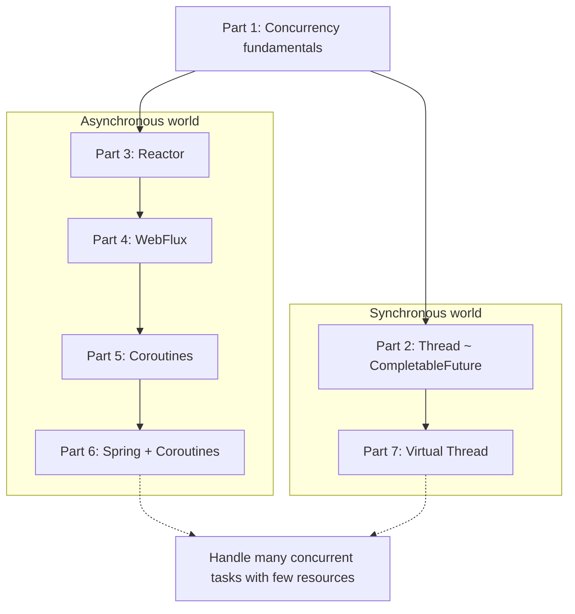
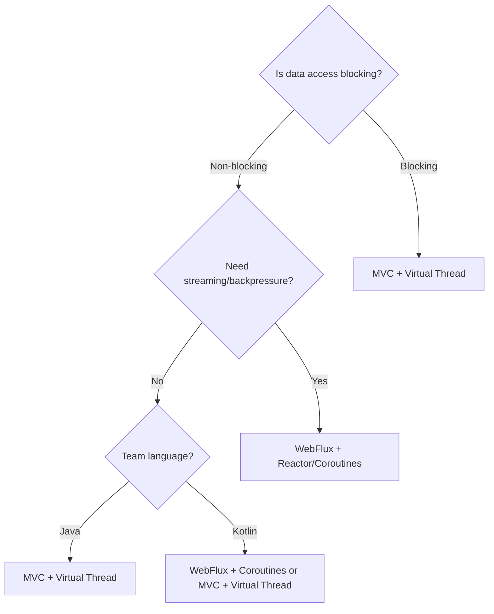
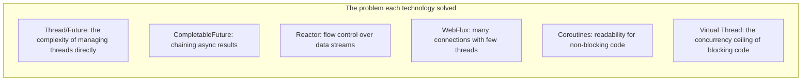

> **Understanding JVM Concurrency Models series**
> 
> 1.  [Concurrency and Parallelism Fundamentals](/en/jvm-concurrency-model-1-fundamentals/)
> 2.  [Java's Traditional Concurrency Model](/en/jvm-concurrency-model-2-java-traditional-concurrency/)
> 3.  [Reactive Streams and Project Reactor](/en/jvm-concurrency-model-3-reactive-streams-reactor/)
> 4.  [Spring WebFlux](/en/jvm-concurrency-model-4-spring-webflux/)
> 5.  [Kotlin Coroutines](/en/jvm-concurrency-model-5-kotlin-coroutines/)
> 6.  [Spring + Coroutines — WebFlux, MVC, and the Limits of AOP](/en/jvm-concurrency-model-6-spring-coroutines/)
> 7.  [Virtual Threads — The Synchronous World's Answer](/en/jvm-concurrency-model-7-virtual-thread/)
> 8.  **[Wrap-up — When to Choose What](/en/jvm-concurrency-model-8-conclusion-decision-framework/) ← you are here**

## Looking Back at the Series

Over the past seven posts, we've traced why each concurrency technology on the JVM came into being and how they evolved. Let's revisit each one through the lens of the **single core problem** it set out to solve.

**[Part 1 — Fundamentals of Concurrency and Parallelism.](/en/jvm-concurrency-model-1-fundamentals/)** Concurrency and parallelism are not the same thing. Sync/async is about "who takes care of the result," while blocking/non-blocking is about "when control returns" — and these two axes are independent. This became the foundational muscle for understanding everything that followed.

**[Part 2 — Java's Traditional Concurrency Model.](/en/jvm-concurrency-model-2-java-traditional-concurrency/)** Starting from `Thread` and `Runnable`, moving through `Callable`/`Future` and `ExecutorService` up to `CompletableFuture` — the level of abstraction rose steadily, always in the direction of "stop managing threads yourself." But even `CompletableFuture` chaining hit its limits: when you need to process not a single value but a **continuous stream of data**, and when the consumer needs to control the producer's pace (backpressure).

**[Part 3 — Reactive Streams and Project Reactor.](/en/jvm-concurrency-model-3-reactive-streams-reactor/)** The `Publisher`–`Subscriber` quartet of interfaces standardized backpressure, and Reactor implemented it with `Mono`/`Flux` and a rich set of operators. A declarative-pipeline model where you "process data as it flows" — powerful, but with a steep learning curve, hard debugging, and code tied up in callback chaining.

**[Part 4 — Spring WebFlux.](/en/jvm-concurrency-model-4-spring-webflux/)** Reactor applied to the web. It handles many concurrent connections with few threads on top of Netty's event loop. It broke Spring MVC's "one request = one thread" model and raised throughput with non-blocking I/O — but since blocking code stalls the event loop, it came with the constraint that you **must use only non-blocking libraries**.

**[Part 5 — Kotlin Coroutines.](/en/jvm-concurrency-model-5-kotlin-coroutines/)** Instead of Reactor's operator chaining, you write `suspend fun` code that reads like synchronous code while keeping the benefits of non-blocking. The compiler implements coroutines via CPS transformation and state machines, and structured concurrency manages coroutine lifecycles safely. It solved Reactor's readability problem, but under the hood it still runs on top of the non-blocking world.

**[Part 6 — Spring + Coroutines Integration, and the Limits of AOP.](/en/jvm-concurrency-model-6-spring-coroutines/)** When you declare a `suspend fun` in WebFlux, Spring internally wraps it in `mono {}` and puts it on the Reactor pipeline. But there was a structural limitation: AOP proxies interpret a `COROUTINE_SUSPENDED` return value as "the method has finished." `@Transactional` + JDBC + coroutines is unsupported, and custom `@Around` advice suffers from the same problem.

**[Part 7 — Virtual Thread.](/en/jvm-concurrency-model-7-virtual-thread/)** The synchronous world's answer. The JVM provides lightweight threads, achieving high concurrency while leaving blocking code untouched. Because the function never returns early, AOP proxies work correctly and ThreadLocal is preserved. It solves Part 6's limitations from within the synchronous model.

To sum up the journey of this series in one sentence: **the asynchronous world solved the problem with "don't block," while the synchronous world solved the same problem with "make blocking okay."** So which technology should you actually choose in practice?

## A Decision Framework — Four Questions

"Which technology is the best?" is a question with no answer. Instead, to figure out **"which technology fits our situation,"** I ask four questions in order.

### Question 1: Is your data access technology blocking or non-blocking?

The first thing to check is your **data access technology**. As we covered in [Part 6](/en/jvm-concurrency-model-6-spring-coroutines/), what determines `PlatformTransactionManager` vs `ReactiveTransactionManager` is not the HTTP layer (MVC vs WebFlux) but the data access technology. This distinction is the starting point for choosing a stack.

**Blocking data access** — JDBC, JPA/Hibernate, MyBatis, blocking Redis (Jedis):

In this case, even if you use a non-blocking framework (WebFlux, Reactor), threads still block at the data access point. To fully reap the benefits of non-blocking, you'd have to replace the entire data access layer with R2DBC or reactive drivers — a significant cost.

→ **Virtual Thread is the natural choice.** Keep your blocking code as-is, and get high concurrency with a single line of configuration.

**Non-blocking data access** — R2DBC, Reactive MongoDB, Reactive Redis (Lettuce):

If you're already on a non-blocking stack, WebFlux + Reactor (or Coroutines) lets you take full advantage of that ecosystem.

→ **Keep WebFlux + Reactor/Coroutines.** There's no reason to go back to a blocking stack.

### Question 2: Do you need streaming or backpressure?

**Yes** — Server-Sent Events, WebSocket streaming, real-time data pipelines, incremental processing of large datasets:

Reactor's `Flux` with its backpressure mechanism, and Coroutines' `Flow`, were designed for exactly this territory. Virtual Thread is optimized for the request-response model and has no dedicated mechanism for controlling the flow of a data stream.

→ **This is where Reactor/Flow shine.**

**No** — a typical REST API, one request and one response:

Most CRUD APIs fall into this category. In a request-response model, Reactor's operator chaining becomes unnecessary complexity.

→ **Virtual Thread or plain MVC is the better fit.**

### Question 3: What are your team's language and skill set?

**A Java-centric team**:

Virtual Thread requires nothing beyond Java 21 — no extra libraries, no language switch. Existing synchronous code patterns, AOP, and ThreadLocal-based tooling all keep working, so the learning cost is the lowest of any option.

**A Kotlin-centric team**:

Coroutines are a core Kotlin feature, and structured concurrency is officially supported. Being able to use the same concurrency model across Android, server, and KMP (Kotlin Multiplatform) is another major advantage.

**A team fluent in Reactor**:

If a team already comfortable with Reactor is running a WebFlux project well, there's no reason to migrate it to Virtual Thread. Weigh the migration cost against the actual benefit with a cool head.

### Question 4: Is this a new project or an improvement to an existing one?

**An existing Spring MVC + JDBC/JPA project**:

This is the clearest case. A single line — `spring.threads.virtual.enabled=true` — improves concurrent throughput. No code changes means minimal risk. One thing to audit: blocking calls inside `synchronized` blocks (pinning).

**An existing WebFlux + R2DBC project**:

If it's working well, keep it — but a gradual approach is possible: introduce Coroutines' `suspend fun` in the spots where Reactor chaining has grown complex, to improve readability.

**A brand-new project**:

As of 2026, the default choice for a new Java project without special requirements is **Spring MVC + Virtual Thread**. You get high concurrency while using the blocking ecosystem as-is, with perfect compatibility with AOP, ThreadLocal, and existing libraries. A **hybrid approach** — selectively adopting WebFlux/Reactor only where streaming or backpressure is needed — is the pragmatic path.

## Each Technology's Real Strength — "For This, Nothing Beats It"

Each technology has a **home turf** that is hard to replace with anything else.

### Virtual Thread

**"Get concurrency without touching your existing blocking code."**

Hundreds of thousands of concurrent connections with a single line of configuration — while JDBC/JPA, AOP, ThreadLocal, MDC, and every existing synchronous library keep working as-is. No new API to learn, no code to fix. **The best effect-to-migration-cost ratio of any option.**

### Reactor (Mono/Flux)

**"Compose data pipelines declaratively."**

Backpressure control, rich operator-based stream processing (`buffer`, `window`, `merge`, `zip`, and more), and retry strategies on error (`retry`, `retryWhen`) — the most sophisticated toolkit for working with continuous data streams. It proves its worth in SSE, WebSocket streaming, and real-time event pipelines.

### Kotlin Coroutines

**"Write non-blocking code like synchronous code, managed safely with structured concurrency."**

`suspend fun` solves Reactor's readability problem while keeping the benefits of non-blocking. Structured concurrency — `coroutineScope`, `async`, `SupervisorJob` — is a first-class, stable feature, and `Flow` covers reactive streams too. Sharing a single concurrency model across Android, server, and iOS via Kotlin Multiplatform is a strength unique to coroutines.

### CompletableFuture

**"The most universal async tool — available anywhere with Java 8 or later."**

Async chaining and parallel composition with nothing but the JDK. Combined with Spring's `@Async`, or for something like calling two or three external APIs in parallel, it's plenty — no Reactor or Coroutines required.

## "Doesn't Virtual Thread Cover Everything?" — Common Misconceptions

Virtual Thread is powerful, but it isn't a silver bullet. Here are the misconceptions I hear most often in practice.

### No concurrency model works magic on CPU-bound work

Every technology covered in this series — Virtual Thread, Reactor, Coroutines — solves the problem of **thread resources being wasted while waiting on I/O**. For computations that use 100% CPU (image processing, encryption, large-scale number crunching), no matter which concurrency model you pick, **parallelism is bounded by the number of CPU cores**. Whether it's Virtual Thread's carrier threads, Reactor's worker threads, or Coroutines' `Dispatchers.Default` threads, the number of CPU computations that can actually run simultaneously equals the core count.

If you need CPU-bound parallelism, use `ForkJoinPool` or parallel streams — and those tools work alongside Virtual Thread, Reactor, or Coroutines in any environment. **Choosing a concurrency model and parallelizing CPU work are separate problems.**

### There is no backpressure

Virtual Thread follows a one-thread-per-request model. If 100,000 concurrent requests come in, 100,000 virtual threads are created, and each sends requests downstream (DB, external APIs). The virtual threads themselves are cheap, but **whether the downstream can withstand that load** is a separate question. Flow-control mechanisms — connection pools, rate limiters, circuit breakers — are still necessary.

Reactor's backpressure solves this at the pipeline level: with `request(n)`, the consumer requests only as much data as it can handle. Virtual Thread has no built-in equivalent.

### Not a great fit for streaming or event-driven scenarios

In the request-response model — "the client asks, the server answers" — Virtual Thread is optimal. But for "the server continuously pushes data" (SSE, WebSocket) or "combine and process events from multiple sources," Reactor's `Flux` or Coroutines' `Flow` is the natural model.

### Watch out for ThreadLocal memory

As covered in [Part 7](/en/jvm-concurrency-model-7-virtual-thread/), ThreadLocal works correctly on virtual threads, but memory grows in proportion to the number of threads. A ThreadLocal cache that was harmless with 200 platform threads can become a memory issue in an environment with 100,000 virtual threads.

### Structured Concurrency is still in preview

Structured concurrency in coroutines is a stable feature, but Java's `StructuredTaskScope` is still in preview as of JDK 25. For safe parallel processing on virtual threads, you'll need the `ExecutorService` + `CompletableFuture` combination for the time being.

## Recommendations by Real-World Scenario

| Scenario | Recommended technology | Why |
|---|---|---|
| Improving concurrency in an existing Spring MVC + JDBC/JPA app | MVC + Virtual Thread | One line of config, zero code changes, minimal risk |
| An existing WebFlux + R2DBC project | Keep it (+ Coroutines for readability) | No reason to revert a working non-blocking stack to blocking |
| A new REST API (CRUD-centric) | MVC + Virtual Thread | Leverages the blocking ecosystem, compatible with AOP/ThreadLocal |
| Real-time streaming, event processing | WebFlux + Reactor (or Coroutines Flow) | Backpressure and stream composition built in |
| A Kotlin Multiplatform project | Coroutines | Same concurrency model across server/Android/iOS |
| Simple parallel calls (2–3 concurrent API calls) | CompletableFuture | The JDK alone is enough — no extra framework |
| Improving readability of existing Reactor code | Coroutines (suspend fun) | Operator chaining → imperative syntax |
| CPU-bound parallel processing | ForkJoinPool / parallel stream | Independent of the concurrency model, works in any environment |

## Closing — Technologies Are Tools; Pick the One That Fits the Problem

Every technology covered in this series attacks **the same fundamental problem — "handle many concurrent tasks with few resources"** — from a different angle.

Thread and Future addressed "the complexity of handling threads directly"; CompletableFuture, "composing asynchronous results"; Reactor, "declarative processing and flow control of data streams"; WebFlux, "many HTTP connections with few threads"; Coroutines, "non-blocking that reads like synchronous code"; and Virtual Thread, "concurrency without touching blocking code."

No technology is the best in every situation. What matters is understanding **your project's data access approach, the communication patterns it requires, your team's capabilities, and the state of your existing codebase** — and picking the tool that fits.

Finally, the most common mistake in technology selection is the thought that **"a new technology is out, so we should replace what we have."** The arrival of Virtual Thread doesn't mean you should rip out WebFlux, and the existence of Coroutines doesn't make CompletableFuture useless. The cost of replacing a working system with a new technology is always higher than you think. The safest time to adopt a new technology is **when you face a new problem, or when you start a new project**.

## References

**The full series**

-   [Part 1 — Fundamentals of Concurrency and Parallelism](/en/jvm-concurrency-model-1-fundamentals/)
-   [Part 2 — Java's Traditional Concurrency Model](/en/jvm-concurrency-model-2-java-traditional-concurrency/)
-   [Part 3 — Reactive Streams and Project Reactor](/en/jvm-concurrency-model-3-reactive-streams-reactor/)
-   [Part 4 — Spring WebFlux](/en/jvm-concurrency-model-4-spring-webflux/)
-   [Part 5 — Kotlin Coroutines](/en/jvm-concurrency-model-5-kotlin-coroutines/)
-   [Part 6 — Spring + Coroutines Integration](/en/jvm-concurrency-model-6-spring-coroutines/)
-   [Part 7 — Virtual Thread](/en/jvm-concurrency-model-7-virtual-thread/)

**External resources**

-   [JEP 444: Virtual Threads](https://openjdk.org/jeps/444) — the official Virtual Thread proposal
-   [Spring Blog — Embracing Virtual Threads](https://spring.io/blog/2022/10/11/embracing-virtual-threads/) — Spring's direction for Virtual Thread support
-   [From Reactive Streams to Virtual Threads — JAVAPRO](https://javapro.io/2025/04/04/from-reactive-streams-to-virtual-threads/) — a migration guide from Reactive to Virtual Thread
-   [Kotlin Coroutines official documentation](https://kotlinlang.org/docs/coroutines-guide.html) — the coroutines guide
-   [Project Reactor official documentation](https://projectreactor.io/docs/core/release/reference/) — the Reactor reference
