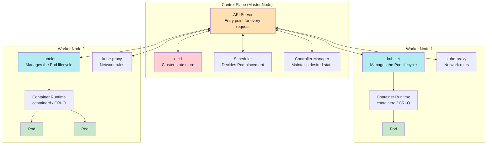
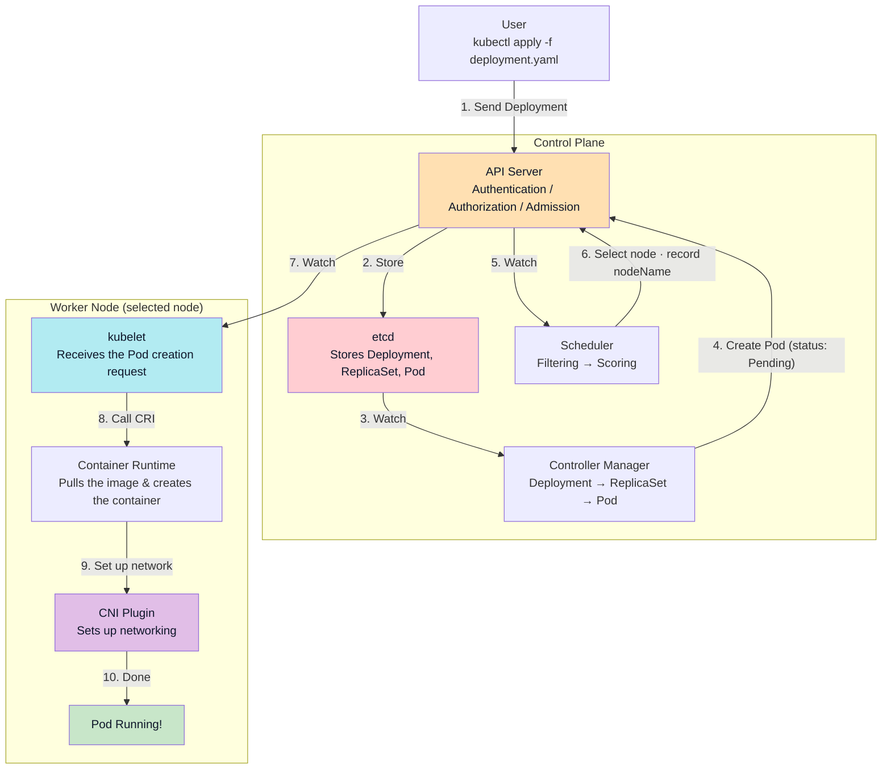
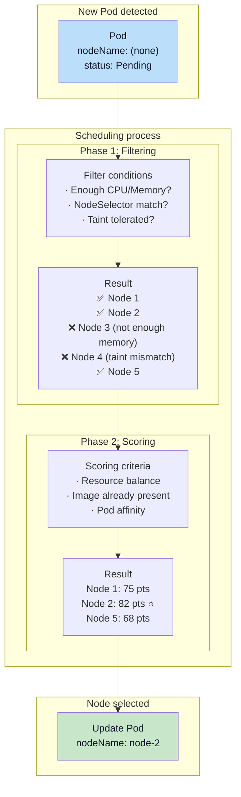
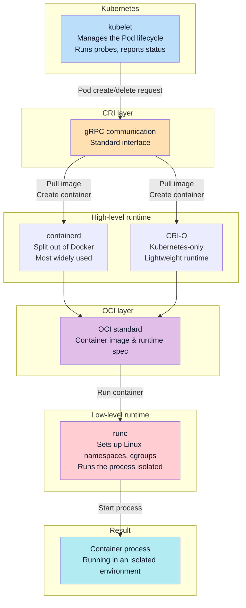

## Introduction

In the [previous post](/en/kubernetes-network-guide-2-pod-to-pod/) we looked at how Pods communicate with each other inside a Kubernetes cluster. We learned that CNI plugins set up the network and CoreDNS handles service discovery.

But **how does that Pod get created and run in the first place?**

Run `kubectl apply -f deployment.yaml` and a Pod appears as if by magic. In between, though, there's a complex process where multiple components cooperate.

This post answers the following questions:

-   What do the control plane (master node) and worker nodes each do?
-   What actually happens inside the cluster when you run `kubectl apply`?
-   On what basis does the scheduler pick a node?
-   How are a Pod's resources (CPU, Memory) managed?
-   How do we know whether a Pod is healthy?

## The Big Picture: Control Plane and Worker Nodes

A Kubernetes cluster is broadly divided into the **control plane** and the **worker nodes**.



### Why Is It Split This Way?

The **control plane** is the cluster's "brain." It decides what gets placed where and keeps the cluster in its desired state.

The **worker nodes** are the "hands and feet." They actually run the containers and handle the traffic.

Thanks to this separation, **even if the control plane goes down temporarily, existing Pods keep running.** You can't create new Pods or scale, but workloads that are already running are unaffected.

### Control Plane Components

| Component | Role | Analogy |
| --- | --- | --- |
| **API Server** | Entry point for every request. Authentication, authorization, request validation | Front desk |
| **etcd** | Distributed store holding the entire cluster state | Database |
| **Scheduler** | Decides which node each Pod lands on | Placement coordinator |
| **Controller Manager** | Maintains the desired state (ReplicaSet, Deployment, etc.) | Supervisor |

### Worker Node Components

| Component | Role | Analogy |
| --- | --- | --- |
| **kubelet** | The node's agent. Manages the Pod lifecycle | Site foreman |
| **Container runtime** | Actually runs containers (containerd, CRI-O) | Worker |
| **kube-proxy** | Manages Service → Pod routing rules | Signpost keeper |

> **Components covered in the networking series**
> 
> kube-proxy was covered in [Understanding Networking (1)](/en/kubernetes-network-guide-1-external-to-pod/). CNI plugins also run on worker nodes, and they were explained in detail in [Understanding Networking (2)](/en/kubernetes-network-guide-2-pod-to-pod/).

## The Pod Creation Flow: From kubectl apply to a Running Container

Now let's trace what happens internally when you run `kubectl apply -f deployment.yaml`.

### The Deployment Manifest

First, the basic structure of a Deployment yaml file.

```yaml
apiVersion: apps/v1
kind: Deployment
metadata:
  name: my-app
spec:
  replicas: 3                    # number of Pods
  selector:
    matchLabels:
      app: my-app
  template:                      # Pod template
    metadata:
      labels:
        app: my-app
    spec:
      containers:
        - name: my-app
          image: my-app:1.0
          ports:
            - containerPort: 8080
          resources:             # resource settings
            requests:
              cpu: "100m"
              memory: "128Mi"
            limits:
              cpu: "500m"
              memory: "512Mi"
```

| Field | Description |
| --- | --- |
| `replicas` | Number of Pods to maintain |
| `selector` | How this Deployment finds the Pods it manages |
| `template` | Template for the Pods to create (labels, container definitions) |
| `resources` | CPU/Memory requests and limits |



### Step 1: kubectl → API Server

```bash
kubectl apply -f deployment.yaml
```

kubectl sends the Deployment definition to the API Server. The API Server then performs:

1.  **Authentication**: Who is making this request?
2.  **Authorization**: Are they allowed to do this?
3.  **Admission Control**: Validate the request and mutate it if needed (e.g., inject defaults)

### Step 2: The Controller Manager Creates the Pods

Once the Deployment is created, the **Controller Manager** steps in:

1.  The **Deployment Controller** creates a ReplicaSet
2.  The **ReplicaSet Controller** creates as many Pods as `replicas` specifies
3.  The created Pods are stored in etcd, with status **Pending**

```yaml
status:
  phase: Pending
  # nodeName is still empty
```

> **The Controller Manager's job**
> 
> The Controller Manager maintains the **desired state** — "replicas: 3 means there must be 3 Pods." If a Pod dies, it creates a new one; if you reduce replicas, it deletes Pods.

> **Workload resources other than Deployment**
> 
> The Deployment → ReplicaSet → Pod structure fits **stateless apps**. But some cases call for different patterns.
> 
> | Resource | Use case | Pod characteristics |
> | --- | --- | --- |
> | **Deployment** | Typical stateless apps (web servers, APIs) | Random names, any node is fine |
> | **DaemonSet** | Run on every node (log collectors, monitoring agents) | One Pod automatically placed per node |
> | **StatefulSet** | Stateful apps (DBs, Kafka, Redis clusters) | Stable names, created/deleted in order |
> 
> **DaemonSet** and **StatefulSet** skip the Deployment layer and **create Pods directly**.
> 
> ```yaml
> # DaemonSet example: deploy a log collector to every node
> 
> apiVersion: apps/v1
> kind: DaemonSet
> metadata:
>   name: fluentd
> spec:
>   selector:
>     matchLabels:
>       app: fluentd
>   template:
>     metadata:
>       labels:
>         app: fluentd
>     spec:
>       containers:
>         - name: fluentd
>           image: fluentd:latest
> ```
> ```yaml
> # StatefulSet example: a Redis cluster
> 
> apiVersion: apps/v1
> kind: StatefulSet
> metadata:
>   name: redis
> spec:
>   serviceName: redis  # requires a Headless Service
>   replicas: 3
>   selector:
>     matchLabels:
>       app: redis
>   template:
>     metadata:
>       labels:
>         app: redis
>     spec:
>       containers:
>         - name: redis
>           image: redis:7
>   volumeClaimTemplates:  # a separate volume per Pod
>     - metadata:
>         name: data
>       spec:
>         accessModes: ["ReadWriteOnce"]
>         resources:
>           requests:
>             storage: 1Gi
> ```
> 
> StatefulSet Pods get **stable, ordinal names** like `redis-0`, `redis-1`, `redis-2` — created in order starting from 0 and deleted in reverse order.

### Step 3: The Scheduler Picks a Node

The Scheduler continuously watches the API Server. When a new Pod appears with an empty `nodeName`:

1.  **Filtering**: Eliminate nodes that don't meet the requirements
2.  **Scoring**: Score the remaining nodes and pick the best one
3.  Record the chosen node in the Pod's `spec.nodeName`

```yaml
spec:
  nodeName: worker-2  # decided by the Scheduler
```

### Step 4: The kubelet Receives the Pod

The kubelet on `worker-2`, watching the API Server, notices a Pod assigned to its node. The kubelet asks the container runtime to create the Pod via **CRI** (Container Runtime Interface).

### Step 5: The Container Runtime Runs the Containers

The container runtime (containerd, CRI-O, etc.):

1.  Pulls the container image
2.  Creates and starts the container
3.  Calls the CNI plugin to set up networking (covered in [Understanding Networking (2)](/en/kubernetes-network-guide-2-pod-to-pod/))

### Step 6: Pod Running!

Once every container has started successfully, the Pod's status changes to **Running**.

```yaml
status:
  phase: Running
  podIP: 10.244.2.15
  conditions:
    - type: Ready
      status: "True"
```

## Scheduler: Where Does a Pod End Up?

The Scheduler places each Pod on the "most suitable" node. The process has two phases: **Filtering** and **Scoring**.



### Filtering: Eliminating Unsuitable Nodes

First, nodes that don't meet the requirements are excluded.

| Filter | What it checks |
| --- | --- |
| PodFitsResources | Does the node have enough of the requested CPU/Memory? |
| NodeSelector | Do the node's labels match the Pod's nodeSelector? |
| PodToleratesNodeTaints | Does the Pod tolerate the node's taints? |
| NoVolumeZoneConflict | Is the requested volume available in this node's zone? |

For example, if a Pod requests `memory: 4Gi` but a node only has 2Gi left, that node is filtered out.

### Scoring: Picking the Best Node

The nodes that survived Filtering are scored (0-100).

| Scoring criterion | Description |
| --- | --- |
| NodeResourcesBalancedAllocation | Prefers nodes with balanced CPU and Memory utilization |
| ImageLocality | Prefers nodes that already have the required image (saves pull time) |
| InterPodAffinity | Prefers nodes that satisfy Pod affinity rules |

All scores are summed, and **the node with the highest total** wins. Ties are broken randomly.

### Ways to Influence Scheduling

#### nodeSelector: The Simplest Option

Place Pods only on nodes with specific labels.

```yaml
spec:
  nodeSelector:
    disktype: ssd
    gpu: "true"
```

#### Node Affinity: Finer-Grained Control

More flexible conditions than nodeSelector.

```yaml
spec:
  affinity:
    nodeAffinity:
      requiredDuringSchedulingIgnoredDuringExecution:  # hard requirement
        nodeSelectorTerms:
          - matchExpressions:
              - key: zone
                operator: In
                values: ["ap-northeast-2a", "ap-northeast-2c"]
      preferredDuringSchedulingIgnoredDuringExecution:  # soft preference
        - weight: 100
          preference:
            matchExpressions:
              - key: disktype
                operator: In
                values: ["ssd"]
```

-   **required**: must be satisfied (no match → no scheduling)
-   **preferred**: satisfied if possible (no match → still schedules)

#### Taints and Tolerations: Restricting a Node

A **Taint** is like putting a "warning sign" on a node. Only Pods that **tolerate** that taint can be placed there.

```bash
# Add a taint to a node (GPU-dedicated node)
kubectl taint nodes gpu-node-1 gpu=true:NoSchedule
```
```yaml
# Add a toleration to the Pod
spec:
  tolerations:
    - key: "gpu"
      operator: "Equal"
      value: "true"
      effect: "NoSchedule"
```

| Effect | Meaning |
| --- | --- |
| NoSchedule | No scheduling without a matching toleration |
| PreferNoSchedule | Avoid scheduling if possible (soft) |
| NoExecute | No scheduling + existing Pods are evicted |

> **nodeSelector vs Affinity vs Taint/Toleration**
> 
> | Mechanism | Use case | Who drives it |
> | --- | --- | --- |
> | nodeSelector | "Run this Pod on an SSD node" | The Pod picks the node |
> | Node Affinity | "Prefer zone-a, but it's not mandatory" | The Pod picks the node (flexibly) |
> | Taint/Toleration | "This node is for GPU Pods only" | The node restricts Pods |
> 
> Generally you start with **nodeSelector**, reach for **Affinity** when you need finer control, and use **Taint/Toleration** for special-purpose nodes (GPU, high-performance, etc.).

## kubelet and the Container Runtime: How a Pod Actually Runs

Once the Scheduler picks a node, that node's **kubelet** actually runs the Pod.

### What the kubelet Does

The kubelet is the worker node's **agent**. It:

1.  Watches the API Server for Pods assigned to its node
2.  Asks the container runtime to create/delete Pods
3.  Reports Pod status back to the API Server
4.  Monitors resource usage
5.  Runs liveness/readiness probes

### CRI: The Container Runtime Interface

The kubelet doesn't run containers itself. Instead it talks to the container runtime through a standard interface called **CRI** (Container Runtime Interface).



```text
kubelet
   ↓ (CRI - gRPC protocol)
container runtime (containerd, CRI-O)
   ↓ (OCI standard)
low-level runtime (runc)
   ↓
actual container process
```

#### Terminology

| Term | Description |
| --- | --- |
| **CRI** | The standard container runtime interface defined by Kubernetes |
| **gRPC** | A remote procedure call framework built by Google. The kubelet and the runtime talk over this protocol |
| **OCI** | Open Container Initiative. The industry standard spec for container images and runtimes |
| **runc** | A low-level runtime implementing the OCI standard. Sets up Linux namespaces and cgroups to isolate processes |

#### High-Level vs Low-Level Runtimes

| Level | Role | Examples |
| --- | --- | --- |
| **High-level runtime** | Image management, container lifecycle management, CRI implementation | containerd, CRI-O |
| **Low-level runtime** | Actual process isolation and execution (namespaces, cgroups) | runc |

**containerd** is the runtime that was split off from Docker and is the most widely used today. **CRI-O** is a lightweight runtime built specifically for Kubernetes. Both call **runc** internally to actually run containers.

> **Why isn't Docker supported directly anymore?**
> 
> **dockershim** was removed in Kubernetes 1.24. Docker never implemented CRI directly, so Kubernetes had to maintain an intermediate layer (dockershim).
> 
> But **containerd**, which Docker uses internally, does support CRI. So now containerd is used directly. Images built with Docker follow the OCI standard, so they still work fine. Only the runtime changed.

## Resource Management: requests and limits

Specifying how much CPU and Memory a Pod may use is essential to running a stable cluster.

### requests vs limits

```yaml
resources:
  requests:
    cpu: "100m"      # 0.1 CPU core
    memory: "128Mi"  # 128 MiB
  limits:
    cpu: "500m"      # 0.5 CPU core
    memory: "512Mi"  # 512 MiB
```

| Aspect | requests | limits |
| --- | --- | --- |
| **Meaning** | Guaranteed minimum | Maximum allowed |
| **Scheduling** | Used to pick a node | No effect on scheduling |
| **CPU exceeded** | – | Throttling |
| **Memory exceeded** | – | **OOMKilled** (force-terminated) |

> **Understanding CPU units**
> 
> -   `1` = 1 CPU core
> -   `100m` = 0.1 core (m stands for millicores)
> -   `500m` = 0.5 core

### QoS Class: Quality of Service Tiers

Based on how requests and limits are set, Kubernetes assigns each Pod a **QoS (Quality of Service) Class**. This class determines **which Pods get killed first when a node runs out of memory**.

| QoS Class | Condition | Under memory pressure |
| --- | --- | --- |
| **Guaranteed** | requests = limits for every container | Killed last |
| **Burstable** | requests < limits (for any container) | Middle priority |
| **BestEffort** | No requests/limits at all | Killed first |

```yaml
# Guaranteed example: requests = limits
resources:
  requests:
    cpu: "500m"
    memory: "256Mi"
  limits:
    cpu: "500m"
    memory: "256Mi"
```
```yaml
# Burstable example: requests < limits
resources:
  requests:
    cpu: "100m"
    memory: "128Mi"
  limits:
    cpu: "500m"
    memory: "512Mi"
```
```yaml
# BestEffort example: nothing specified
resources: {}
```

### OOMKilled: Why Did My Pod Suddenly Die?

**OOMKilled** happens when a Pod exceeds its memory limit. To be precise, it isn't Kubernetes that kills the process — it's the **OOM Killer in the worker node's Linux kernel**.

Containers run on top of the worker node's Linux kernel, so memory management is handled by that node's kernel too.

```bash
kubectl describe pod my-pod
# ...
# Last State:     Terminated
#   Reason:       OOMKilled
#   Exit Code:    137
```

When OOMKilled occurs:

1.  **A container exceeds its memory limit**: the container has a 512Mi limit but tries to use 600Mi
2.  **The node runs out of memory (overcommit)**: the sum of all Pods' requests fits in the node's memory, but actual usage exceeds it

> **What Exit Code 137 means**
> 
> On Linux, a process terminated by a signal exits with **128 + the signal number**.
> 
> -   128: the base value meaning "terminated by a signal"
> -   9: the SIGKILL signal number
> -   **137 = 128 + 9**: the OOM Killer force-terminated the process with SIGKILL
> 
> For reference, Exit Code 143 = 128 + 15 (SIGTERM), which indicates a graceful termination request.

### Resource Configuration Best Practices

1.  **Always set requests**: BestEffort is best avoided
2.  **Monitor actual usage before setting limits**: too low means OOMKilled, too high wastes resources
3.  **Make critical Pods Guaranteed**: set requests = limits
4.  **Leave headroom in memory limits**: CPU gets throttled, but Memory gets OOMKilled

## Probes: How Do We Know a Pod Is Healthy?

A running Pod isn't necessarily a healthy one. The application might be hung, or still initializing. Kubernetes checks Pod health with **probes**.

### The Three Probes

| Probe | Question | On failure |
| --- | --- | --- |
| **startupProbe** | "Are you done starting up?" | Other probes don't run (waits for startup) |
| **livenessProbe** | "Are you alive?" | Container is **restarted** |
| **readinessProbe** | "Ready to take traffic?" | **Removed** from Service endpoints |

### Probe Configuration Example

```yaml
spec:
  containers:
    - name: app
      image: my-app:1.0
      ports:
        - containerPort: 8080
      
      # startup check (for slow-starting apps)
      startupProbe:
        httpGet:
          path: /healthz
          port: 8080
        failureThreshold: 30     # allow up to 30 failures
        periodSeconds: 10        # check every 10s (up to 5 minutes)
      
      # liveness check
      livenessProbe:
        httpGet:
          path: /healthz
          port: 8080
        initialDelaySeconds: 0   # start right after startupProbe succeeds
        periodSeconds: 10        # check every 10s
        failureThreshold: 3      # restart after 3 consecutive failures
      
      # readiness check
      readinessProbe:
        httpGet:
          path: /ready
          port: 8080
        periodSeconds: 5         # check every 5s
        failureThreshold: 3      # remove from Service after 3 failures
```

### Probe Types

```yaml
# HTTP GET
httpGet:
  path: /healthz
  port: 8080

# TCP connection
tcpSocket:
  port: 3306

# command execution
exec:
  command:
    - cat
    - /tmp/healthy
```

> **livenessProbe vs readinessProbe: which one, when?**
> 
> | Situation | Right probe |
> | --- | --- |
> | App is deadlocked and unresponsive | livenessProbe (needs a restart) |
> | Temporary outage due to a lost DB connection | readinessProbe (just cut off traffic) |
> | App with a long initialization | startupProbe (wait for startup) |
> 
> As a rule, **readinessProbe is near-mandatory**, while **livenessProbe should be used carefully**. A misconfigured livenessProbe can keep restarting perfectly healthy Pods.

> **If you use Spring Boot, you don't need to build probe APIs yourself**
> 
> Spring Boot Actuator automatically exposes two endpoints, and **each performs a different check**:
> 
> | Endpoint | What it checks |
> | --- | --- |
> | `/actuator/health/liveness` | Only whether the app is alive (a simple response) |
> | `/actuator/health/readiness` | Connectivity to external dependencies like the DB, Redis, Kafka |
> 
> ```yaml
> # Probe configuration for a Spring Boot app
> livenessProbe:
>   httpGet:
>     path: /actuator/health/liveness
>     port: 8080
> readinessProbe:
>   httpGet:
>     path: /actuator/health/readiness
>     port: 8080
> ```
> 
> In other words, Spring Boot already separates the two for you — liveness stays lightweight while readiness checks dependencies. If you need custom checks, implement a `HealthIndicator`.

### CrashLoopBackOff: Why Does My Pod Keep Restarting?

```bash
kubectl get pods
# NAME       READY   STATUS             RESTARTS   AGE
# my-pod     0/1     CrashLoopBackOff   5          3m
```

**CrashLoopBackOff** means a Pod is repeatedly failing and being restarted. The usual causes:

1.  **livenessProbe failure**: the health check isn't responding
2.  **Application crash**: non-zero exit code
3.  **OOMKilled**: memory exceeded
4.  **Misconfiguration**: missing environment variables, wrong command, etc.

Kubernetes stretches the restart interval each time (10s → 20s → 40s → … up to 5 minutes). This is called **exponential backoff**.

```bash
# find the cause
kubectl describe pod my-pod
kubectl logs my-pod --previous  # logs from the previous container
```

## HPA: Autoscaling with Traffic

So far we've seen how Pods get created and run. But what happens when traffic grows? You could bump replicas by hand, but with **HPA** (Horizontal Pod Autoscaler) scaling happens automatically.

### How HPA Works

HPA collects Pod resource usage from the **Metrics Server**, compares it against the target you set, and adjusts the replica count.

```text
Metrics Server → HPA → Deployment (adjust replicas) → ReplicaSet → Pods created/deleted
```

### What Is the Metrics Server?

The **Metrics Server** is the **official add-on** that collects resource usage across a Kubernetes cluster. It's not part of the default installation and must be installed separately.

| Item | Description |
| --- | --- |
| Role | Collects CPU/Memory usage from each node's kubelet |
| Used by | `kubectl top`, HPA, VPA |
| Installed by default | No — separate installation required |

```bash
# check whether the Metrics Server is installed
kubectl get pods -n kube-system | grep metrics-server

# install it (if missing)
kubectl apply -f https://github.com/kubernetes-sigs/metrics-server/releases/latest/download/components.yaml

# verify it works
kubectl top nodes
kubectl top pods
```

### HPA Configuration Example

```yaml
apiVersion: autoscaling/v2
kind: HorizontalPodAutoscaler
metadata:
  name: my-app-hpa
spec:
  scaleTargetRef:
    apiVersion: apps/v1
    kind: Deployment
    name: my-app
  minReplicas: 2
  maxReplicas: 10
  metrics:
    - type: Resource
      resource:
        name: cpu
        target:
          type: Utilization
          averageUtilization: 70  # keep CPU utilization at 70%
```

This configuration:

-   Adds Pods when CPU utilization exceeds 70%
-   Removes Pods when CPU utilization falls below 70%
-   Keeps between 2 and 10 replicas

```bash
# check HPA status
kubectl get hpa
# NAME         REFERENCE           TARGETS   MINPODS   MAXPODS   REPLICAS
# my-app-hpa   Deployment/my-app   45%/70%   2         10        3
```

### How HPA Relates to Deployment replicas

**HPA modifies the Deployment's replicas directly.** So when using HPA:

```yaml
# Deployment configuration when using HPA
apiVersion: apps/v1
kind: Deployment
metadata:
  name: my-app
spec:
  # replicas: 3  ← managed by HPA, so it can be omitted!
  selector:
    matchLabels:
      app: my-app
  template:
    # ...
```

| Setup | Recommendation |
| --- | --- |
| Deployment only | `replicas` must be specified |
| With HPA | Omit `replicas` or set only an initial value |

HPA's `minReplicas` becomes the effective minimum. If the Deployment has `replicas: 3` and HPA has `minReplicas: 2`, HPA can scale down to 2.

> **What does HPA need to work?**
> 
> 1.  The **Metrics Server** must be installed
> 2.  The Pods must have **resources.requests** set
> 
> Without requests, HPA can't compute utilization. For example, with `requests.cpu: 100m` and 50m currently in use, utilization is 50%.

### How It Differs from VPA

| Acronym | Name | Behavior |
| --- | --- | --- |
| **HPA** | Horizontal Pod Autoscaler | Adjusts the **number** of Pods |
| **VPA** | Vertical Pod Autoscaler | Adjusts each Pod's **resource size** |

HPA is horizontal scaling (scale out/in), VPA is vertical scaling (scale up/down). The usual approach is to **start with HPA**, and consider VPA when single-Pod performance matters.

## Troubleshooting Guide

Things to check when a Pod won't run properly.

### What Each Pod Status Means

| Status | Meaning | How to check |
| --- | --- | --- |
| **Pending** | Waiting to be scheduled | `kubectl describe pod` → check Events |
| **ContainerCreating** | Container being created | Image pull issues, volume mount issues |
| **CrashLoopBackOff** | Repeated failures | `kubectl logs --previous` |
| **OOMKilled** | Memory exceeded | Increase memory limits |
| **Evicted** | Kicked off the node | Node resource shortage |

### Key Commands

```bash
# check Pod status
kubectl get pods -o wide

# Pod details (including Events)
kubectl describe pod <pod-name>

# container logs
kubectl logs <pod-name>
kubectl logs <pod-name> --previous  # previous container

# check resource usage
kubectl top pods
kubectl top nodes

# check HPA status
kubectl get hpa
```

### Common Problems and Fixes

| Problem | Cause | Fix |
| --- | --- | --- |
| Pod stuck in Pending | Insufficient resources or nodeSelector mismatch | Add nodes or adjust requests |
| ImagePullBackOff | Image can't be pulled | Check image name, registry credentials |
| CrashLoopBackOff | App crash or probe failure | Check logs, review probe configuration |
| Repeated OOMKilled | Memory limit too low | Increase limits or look for a memory leak |

## Wrapping Up

In this post we looked at how Pods are created and run in Kubernetes.

**The core flow**:

1.  `kubectl apply` → API Server → stored in etcd
2.  The Scheduler picks a node via Filtering → Scoring
3.  The kubelet calls the container runtime through CRI
4.  The container runtime runs the actual containers
5.  The CNI plugin sets up networking

**Things to remember**:

-   **requests** drive scheduling, **limits** cap usage
-   **QoS Class** determines kill priority under memory pressure
-   **livenessProbe** restarts, **readinessProbe** cuts off traffic
-   **HPA** scales automatically with traffic

## References

-   [Kubernetes Components](https://kubernetes.io/docs/concepts/overview/components/)
-   [Kubernetes Scheduler](https://kubernetes.io/docs/concepts/scheduling-eviction/kube-scheduler/)
-   [Container Runtime Interface (CRI)](https://kubernetes.io/docs/concepts/architecture/cri/)
-   [Resource Management for Pods and Containers](https://kubernetes.io/docs/concepts/configuration/manage-resources-containers/)
-   [Configure Liveness, Readiness and Startup Probes](https://kubernetes.io/docs/tasks/configure-pod-container/configure-liveness-readiness-startup-probes/)
-   [Horizontal Pod Autoscaling](https://kubernetes.io/docs/tasks/run-application/horizontal-pod-autoscale/)
