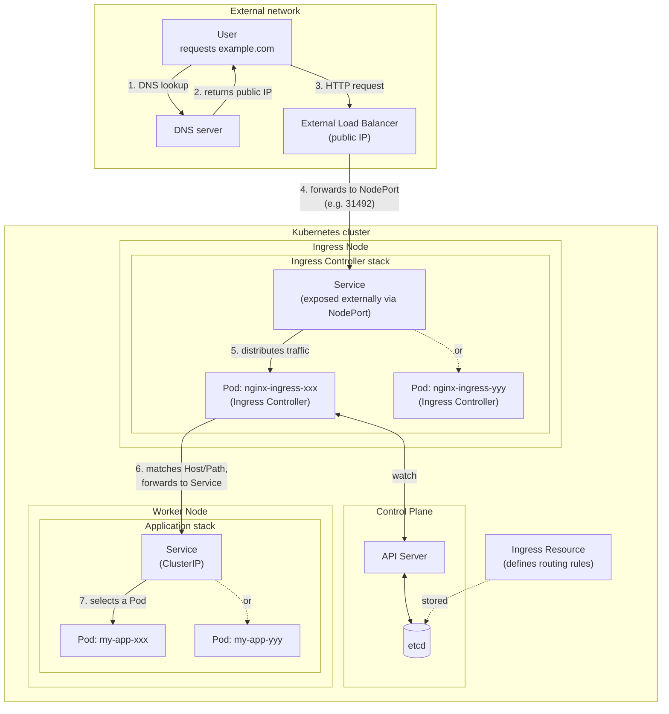
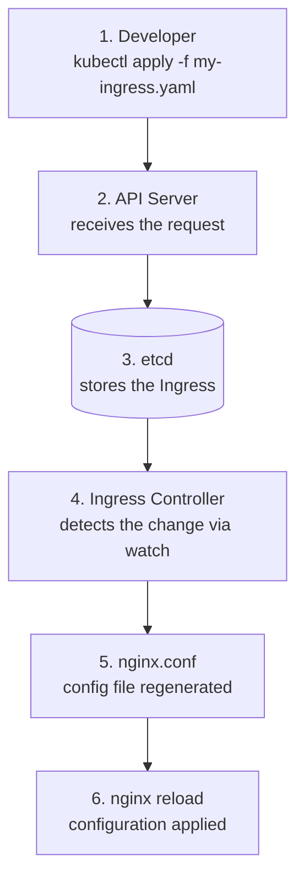
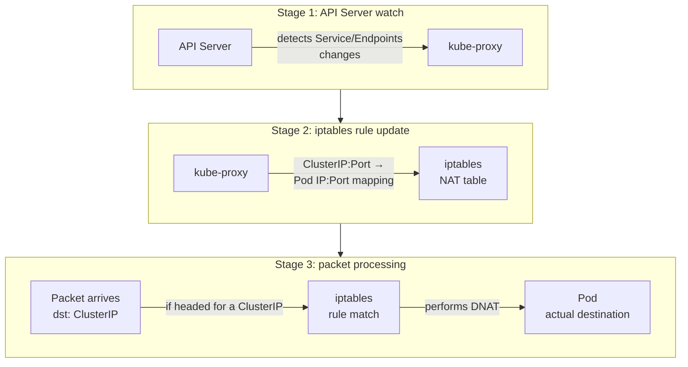
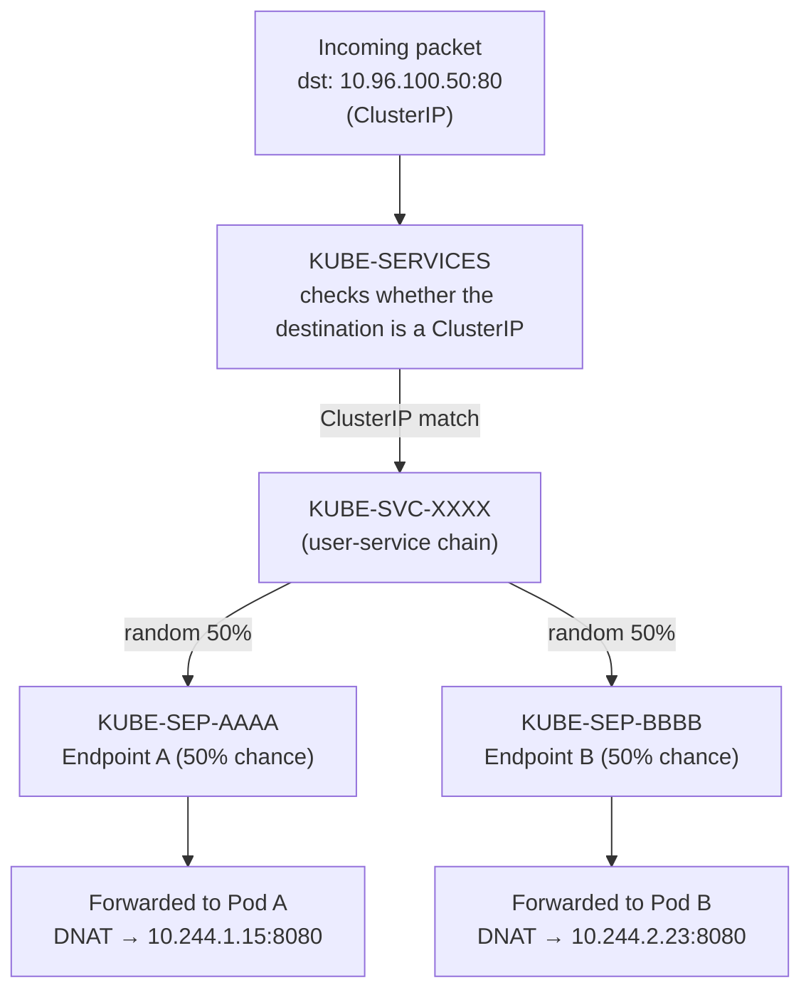

## Introduction

If you work with Kubernetes long enough, you eventually ask yourself: "What path does my request actually take to reach the Pod?" Run `kubectl apply` to deploy an Ingress and a Service and traffic magically flows — but when something breaks, you may have felt completely lost about where to even start looking.

In this post I'll walk through, step by step, the entire journey an external user's HTTP request takes to reach a Pod inside a Kubernetes cluster. We'll see which component does what in each segment, and clear up the concepts that get mixed up most often along the way (Ingress vs. Service, what kube-proxy actually is, and so on).

## The Full Traffic Flow at a Glance

Here is the complete flow an external request takes to reach a Pod.



```text
User → DNS → External LB → Ingress Node Service → Ingress Controller Pod → Worker Node Service → Worker Node Pod
```

A quick look at each step:

| Step | Segment | Key role |
| --- | --- | --- |
| ① | User → DNS | Resolve the domain to a public IP |
| ② | DNS → External LB | Deliver traffic to the public IP |
| ③ | External LB → Ingress Node | Traffic enters the cluster through a NodePort |
| ④ | Ingress Node → Ingress Controller | Forwarded to the Ingress Controller Pod via a Service |
| ⑤ | Ingress Controller → Service | Destination Service chosen by Host/Path rules |
| ⑥ | Service → Pod | Traffic delivered to the final destination Pod |

Now let's dig into each segment in detail.

> **Worth knowing up front**
> 
> Names like "Ingress Node" and "Ingress Controller" can make these feel like special K8s objects, but in reality they're all just **ordinary Service + Pod structures**. An Ingress Node is a regular Worker Node with a label, and the Ingress Controller is a regular Pod deployed as a DaemonSet or Deployment. Keep this in mind as you read and the whole flow becomes much clearer.

## From the External LB to the Ingress Node

### Separating Roles with Node Labels

Kubernetes has no official node type called "Ingress Node". Every node is fundamentally the same Worker Node, and roles are assigned through **labels**.

```bash
# Label specific nodes with the ingress role
kubectl label node node-1 node-role=ingress
kubectl label node node-2 node-role=ingress
```

Then, when deploying the Ingress Controller, you set a `nodeSelector` or `nodeAffinity` so its Pods only land on nodes carrying that label.

```yaml
# Ingress Controller DaemonSet example (excerpt)
spec:
  template:
    spec:
      nodeSelector:
        node-role: ingress
```

> **"Ingress Node" is not an official term**
> 
> The K8s official documentation never uses the term "Ingress Node". It's a colloquial expression for the nodes where the Ingress Controller happens to be deployed, used for operational convenience. In reality it's a regular Worker Node given a logical role through labels and scheduling configuration.

### How the Load Balancer Knows Which Nodes to Target

How does the external Load Balancer know which nodes to send traffic to?

The short answer: **the external LB delivers traffic into the cluster through a NodePort.** What differs by environment is whether that connection is wired up automatically or has to be configured by hand.

**Cloud environments (AWS, GCP, Azure, etc.)**

Create a Service of type `LoadBalancer` and the cloud provider handles everything automatically.

```yaml
apiVersion: v1
kind: Service
metadata:
  name: ingress-nginx-controller
spec:
  type: LoadBalancer  # the cloud provider auto-creates an external LB
  selector:
    app: ingress-nginx
  ports:
    - port: 80
      targetPort: 80
```

When you create this Service:

1.  **A NodePort is auto-assigned** (e.g. 31492)
2.  **A cloud LB is auto-created**
3.  **The LB is auto-configured to send traffic to the NodePort**

```bash
# Verify after creation
kubectl get svc ingress-nginx-controller -n ingress-nginx

# Example output: 80:31492 means "ServicePort:NodePort"
NAME                       TYPE           EXTERNAL-IP    PORT(S)
ingress-nginx-controller   LoadBalancer   52.12.34.56    80:31492/TCP,443:31917/TCP
```

**On-premises environments**

Unlike the cloud, there's nothing that will create an external LB for you automatically. You have two options:

**Option 1: NodePort type + manually configured external LB**

```yaml
spec:
  type: NodePort
  ports:
    - port: 80
      targetPort: 80
      nodePort: 30080
```

Register the node IPs and the NodePort directly in your external LB (F5, HAProxy, etc.). This is the simplest approach.

**Option 2: LoadBalancer type + MetalLB**

MetalLB is a solution that auto-assigns an EXTERNAL-IP on-premises, just like the cloud does. With MetalLB installed, creating a LoadBalancer-type Service automatically gets it an IP.

> **What is EXTERNAL-IP?**
> 
> The EXTERNAL-IP you see in `kubectl get svc` output is not a node IP. It's the **externally reachable IP** assigned to a LoadBalancer Service.
> 
> ```text
> # Cloud: the Cloud Controller creates an LB and assigns an IP
> NAME        TYPE           EXTERNAL-IP    PORT(S)
> my-service  LoadBalancer   52.12.34.56    80:31492/TCP
> 
> # On-prem (no MetalLB): nothing exists to assign one, so it stays waiting
> NAME        TYPE           EXTERNAL-IP    PORT(S)
> my-service  LoadBalancer   <pending>      80:31492/TCP
> ```
> 
> Use a LoadBalancer type on-premises without MetalLB and the EXTERNAL-IP stays stuck at `<pending>` forever. At that point you have to wire up the NodePort directly anyway, which makes it **identical to Option 1**.

> **The Service type hierarchy**
> 
> K8s Service types form a hierarchy where each higher type includes the one below it.
> 
> | Service type | Includes | Adds |
> | --- | --- | --- |
> | ClusterIP | – | An internal cluster IP |
> | NodePort | ClusterIP | + a port opened on every node (30000-32767) |
> | LoadBalancer | NodePort | + a request to provision an external LB |
> 
> In other words, **LoadBalancer type = NodePort + a request to auto-create an external LB**. That's why a LoadBalancer-type Service still gets a NodePort auto-assigned, and traffic ultimately enters through that NodePort.
> 
> **How LoadBalancer type behaves per environment**
> 
> | Environment | When you create a LoadBalancer-type Service |
> | --- | --- |
> | Cloud (AWS, GCP, etc.) | External LB auto-created + NodePort wiring auto-configured |
> | On-premises | EXTERNAL-IP stays `<pending>`; you must manually connect a separate external LB to the NodePort |
> 
> Cloud or on-prem, **the external LB ultimately talks to the cluster through the NodePort.**

> **Question: does NodePort mean traffic goes to every node?**
> 
> NodePort opens the port on every node. But if traffic arrives at a node that doesn't host the target Pod, it gets re-routed internally to a node that does. This can add an extra network hop, which is why `externalTrafficPolicy: Local` is sometimes considered for performance.

## From the Ingress Node to the Ingress Controller Pod

### How the Ingress Controller Is Deployed

The Ingress Controller is typically deployed as a **DaemonSet** or a **Deployment**.

| Deployment method | Characteristics | Use case |
| --- | --- | --- |
| DaemonSet | One Pod on every designated node | High availability, traffic distribution |
| Deployment | As many Pods as the replica count | Flexible scaling |

With a DaemonSet, one nginx Pod runs on every Ingress-role node, so whichever node the Load Balancer sends traffic to can handle it.

> **What exactly is an Ingress Controller?**
> 
> The name "Controller" comes from Kubernetes's **Controller pattern**. A Controller's job is to reconcile the "Desired State" with the "Actual State".
> 
> For the Ingress Controller:
> 
> -   **Desired state**: the routing rules defined by the Ingress resources in the cluster
> -   **Actual state**: the configuration in the nginx.conf file
> -   **The Controller's role**: watch the API Server, detect Ingress changes, and update the nginx configuration
> 
> At the end of the day, an Ingress Controller is "an nginx Pod with special permissions (a ClusterRole) that watches every Ingress resource in the cluster and dynamically updates its own nginx configuration".

> **Key point: the Ingress Controller is still just a Service + Pod structure**
> 
> Many people mistake the Ingress Controller for a special K8s object, but its actual structure is identical to any ordinary application:
> 
> | Component | Ingress Controller | Ordinary application |
> | --- | --- | --- |
> | Pod | nginx-ingress-xxx | my-app-xxx |
> | Service | Exposed externally via NodePort | ClusterIP (internal only) |
> | Deployment method | DaemonSet or Deployment | Deployment |
> 
> The only difference is that the Ingress Controller's Service **receives external traffic through a NodePort**. The traffic flow is identical too: **External LB → NodePort → Service → Pod**

## How the Ingress Controller Makes Routing Decisions

### The API Server Watch Mechanism

How does the Ingress Controller know about every Ingress resource in the cluster? The answer is the **Kubernetes API Server's watch feature**.



The synchronization flow, step by step:

1.  A **developer** creates an Ingress resource with `kubectl apply -f my-ingress.yaml`
2.  The **API Server** receives the request and stores it in etcd
3.  The **Ingress Controller** detects the change through its watch
4.  The Ingress rules are converted into **nginx.conf**
5.  An **nginx reload** applies the configuration

When it starts up, the Ingress Controller sends a watch request to the API Server. From then on, whenever an Ingress resource is created, modified, or deleted anywhere in the cluster, it gets notified in real time.

### How an Ingress Resource Becomes nginx.conf

Suppose we have the following Ingress resource.

```yaml
apiVersion: networking.k8s.io/v1
kind: Ingress
metadata:
  name: my-app-ingress
  namespace: production
spec:
  rules:
    - host: api.example.com
      http:
        paths:
          - path: /users
            pathType: Prefix
            backend:
              service:
                name: user-service
                port:
                  number: 80
          - path: /orders
            pathType: Prefix
            backend:
              service:
                name: order-service
                port:
                  number: 80
```

The Ingress Controller reads this resource and converts it into roughly the following nginx configuration.

```nginx
# auto-generated nginx.conf (simplified)
server {
    listen 80;
    server_name api.example.com;
    
    location /users {
        proxy_pass http://production-user-service-80;
    }
    
    location /orders {
        proxy_pass http://production-order-service-80;
    }
}
```

The converted configuration is reloaded into nginx and takes effect immediately.

> **Ingress vs. Service — what's the difference?**
> 
> | Aspect | Ingress | Service |
> | --- | --- | --- |
> | OSI layer | L7 (HTTP/HTTPS) | L4 (TCP/UDP) |
> | Main function | Host/Path-based routing | Load balancing across a group of Pods |
> | Actual mechanism | Ingress Controller reads and applies the rules | kube-proxy implements it with iptables/IPVS |
> | Analogy | Road signs (tell you where to go) | Roads (the actual path you travel) |
> 
> The key point: **Ingress is the definition of "routing rules"**, while **Service handles the "actual traffic delivery"**. Once the Ingress Controller receives a request and decides which Service it should go to, everything from there is the Service's job.

## From Service to Pod: kube-proxy and iptables

So the Ingress Controller has picked the destination Service. But a Service's ClusterIP is a **virtual IP** — there is no actual network interface that can receive traffic on it. So how does traffic sent to this virtual IP reach a real Pod?

### The Role of kube-proxy

The component behind this magic is **kube-proxy**.



kube-proxy's operation in three stages:

1.  **API Server watch**: detects Service and Endpoints resource changes in real time
2.  **iptables rule updates**: creates ClusterIP:Port → Pod IP:Port mapping rules
3.  **Packet processing**: intercepts packets headed for the ClusterIP and performs DNAT to the actual Pod IP

> **Where does kube-proxy live?**
> 
> kube-proxy is deployed as a **DaemonSet** and runs on every node.
> 
> ```text
> $ kubectl get daemonset -n kube-system
> NAME         DESIRED   CURRENT   READY   NODE SELECTOR
> kube-proxy   5         5         5       <none>
> 
> $ kubectl get pods -n kube-system -l k8s-app=kube-proxy
> NAME               READY   STATUS    RESTARTS   AGE
> kube-proxy-abc12   1/1     Running   0          10d
> kube-proxy-def34   1/1     Running   0          10d
> ...
> ```
> 
> For what it's worth, environments using an eBPF-based CNI like Cilium can run without kube-proxy entirely. Cilium processes packets directly at the kernel level with eBPF programs, delivering better performance.

### A Look at the iptables Rules

Let's inspect the iptables rules kube-proxy creates.

```bash
# Inspect Service-related iptables rules
sudo iptables -t nat -L KUBE-SERVICES -n | head -20
```

For example, if there's a ClusterIP Service called `user-service`, a rule chain like the following gets created.



| Chain name | Role | Description |
| --- | --- | --- |
| KUBE-SERVICES | Entry point | Checks whether the destination is a ClusterIP |
| KUBE-SVC-XXXX | Service chain | Branches to that Service's Endpoints |
| KUBE-SEP-AAAA | Endpoint chain | DNAT to Pod A (10.244.1.15:8080) |
| KUBE-SEP-BBBB | Endpoint chain | DNAT to Pod B (10.244.2.23:8080) |

> **What the chain names mean**
> 
> -   **KUBE-SVC**: short for Service — the chain representing the Service as a whole
> -   **KUBE-SEP**: short for Service EndPoint — a chain for an individual Pod (Endpoint)

**DNAT** (Destination NAT) is the heart of it. It rewrites the packet's destination IP from the ClusterIP to an actual Pod IP. With multiple Pods, the `statistic mode random` module performs probability-based load balancing.

The actual iptables rules look like this.

```text
# actual iptables rules (simplified)
-A KUBE-SVC-XXXX -m statistic --mode random --probability 0.5 -j KUBE-SEP-AAAA
-A KUBE-SVC-XXXX -j KUBE-SEP-BBBB
-A KUBE-SEP-AAAA -p tcp -j DNAT --to-destination 10.244.1.15:8080
-A KUBE-SEP-BBBB -p tcp -j DNAT --to-destination 10.244.2.23:8080
```

> **Question: don't too many iptables rules cause performance problems?**
> 
> They do. iptables evaluates rules sequentially, so as the number of Services and Pods grows, performance can degrade. The alternatives that address this:
> 
> -   **IPVS (IP Virtual Server) mode**: another kube-proxy mode — hash-table based, so it's O(1) regardless of rule count
> -   **eBPF-based (Cilium, etc.)**: processes packets directly at the kernel level, can replace iptables entirely

## The Response Path Back

The request has reached the Pod — now let's look at how the response travels back. Fortunately, the reverse direction is relatively simple.

### conntrack and Connection State

The Linux kernel's **conntrack (Connection Tracking)** module plays the key role here. When the request packet comes in, the DNAT translation is recorded in the conntrack table.

| Direction | Source (src) | Destination (dst) |
| --- | --- | --- |
| Original (request) | 192.168.1.100 | 10.96.100.50:80 (ClusterIP) |
| Reply (response) | 10.244.1.15:8080 (Pod IP) | 192.168.1.100 |
| **DNAT translation** | – | 10.96.100.50:80 → 10.244.1.15:8080 |

When the response packet leaves the Pod, conntrack consults this record and **automatically performs the reverse NAT — SNAT** (Source NAT). Where DNAT changed the destination IP, SNAT changes the source IP. The response packet's source IP is translated from the Pod IP (10.244.1.15) back to the ClusterIP (10.96.100.50) before returning to the original requester.

```text
Response flow: Pod → (conntrack SNAT) → Service → Ingress Controller → LB → User
```

> **Question: does the response go back along the same path?**
> 
> It can depend on the network setup. Normally, when conntrack-based NAT works correctly, the response takes the same path back. But in asymmetric routing situations, the response may leave via a different path, fail to find its conntrack state, and get dropped. This is something to watch out for in multi-network environments or complex LB configurations.

## Going Deeper: Modern Alternatives

The kube-proxy + iptables approach described so far is Kubernetes's traditional networking implementation. Recently, though, more efficient alternatives have emerged.

### Cilium and eBPF

**eBPF** (extended Berkeley Packet Filter) is a technology that lets you run sandboxed programs inside the Linux kernel. Cilium uses it to replace kube-proxy entirely.

| Comparison | kube-proxy (iptables) | Cilium (eBPF) |
| --- | --- | --- |
| Processing location | User space → Kernel | Directly inside the kernel |
| Rule lookup | O(n) sequential scan | O(1) hash lookup |
| Rule updates | Rewrites the entire table | Updates individual entries |
| Extra features | None | NetworkPolicy, observability, etc. |

### NetworkPolicy

Kubernetes's NetworkPolicy is a set of firewall rules controlling traffic between Pods. CNI plugins (Calico, Cilium, etc.) implement it.

```yaml
apiVersion: networking.k8s.io/v1
kind: NetworkPolicy
metadata:
  name: allow-frontend-only
spec:
  podSelector:
    matchLabels:
      app: backend
  ingress:
    - from:
        - podSelector:
            matchLabels:
              app: frontend
```

### etcd: Where Everything Is Stored

Every resource mentioned so far (Ingress, Service, Endpoints, Pod, and the rest) is stored in **etcd**. etcd is Kubernetes's only persistent store, running on the Control Plane nodes (formerly called Master nodes).

```text
# example etcd storage paths
/registry/services/specs/default/user-service
/registry/services/endpoints/default/user-service
/registry/ingress/production/my-app-ingress
/registry/pods/production/user-app-abc123
```

Only the API Server talks to etcd directly; every other component (kube-proxy, the Ingress Controller, etc.) accesses the data through the API Server.

## Practical Troubleshooting Tips

When traffic isn't reaching a Pod, here's how to check each segment to find where it's stuck.

### Commands for Each Hop

**1\. Check DNS**

```bash
nslookup api.example.com
dig api.example.com
```

**2\. Check LB → Ingress Node**

```bash
# Ingress Controller Pod status
kubectl get pods -n ingress-nginx

# Ingress Controller Service
kubectl get svc -n ingress-nginx
```

**3\. Ingress Controller logs**

```bash
kubectl logs -n ingress-nginx -l app.kubernetes.io/name=ingress-nginx
```

**4\. Check the Ingress resource**

```bash
kubectl get ingress -A
kubectl describe ingress my-ingress -n production
```

**5\. Check Service → Pod**

```bash
# Check the Service and its Endpoints
kubectl get svc,endpoints -n production

# Empty Endpoints means a Pod selector problem
kubectl describe svc user-service -n production
```

**6\. Pod status and logs**

```bash
kubectl get pods -n production
kubectl logs user-app-abc123 -n production
```

### Common Problems and Fixes

| Symptom | Likely cause | How to check |
| --- | --- | --- |
| 503 Service Unavailable | No Endpoints | `kubectl get endpoints` |
| 404 Not Found | Ingress path mismatch | Check the Ingress spec |
| Connection refused | Pod not Ready | `kubectl get pods` |
| Timeout | Blocked by NetworkPolicy | Check NetworkPolicy |

## Wrapping Up

To recap the journey an external request takes to reach a Kubernetes Pod:

1.  A **DNS lookup** resolves the domain to a public IP
2.  The **external Load Balancer** delivers traffic into the cluster
3.  The **Ingress Controller** picks the destination Service based on Host/Path
4.  The **iptables rules managed by kube-proxy** translate the ClusterIP into an actual Pod IP
5.  The **Pod** handles the request and responds

Once you understand this flow, "why isn't my traffic getting through?" becomes a problem you can debug systematically. Keep each segment's role and checkpoints in mind and you can cut your troubleshooting time dramatically.

## References

-   [Kubernetes documentation – Ingress](https://kubernetes.io/docs/concepts/services-networking/ingress/)
-   [Kubernetes documentation – Service](https://kubernetes.io/docs/concepts/services-networking/service/)
-   [Kubernetes documentation – kube-proxy](https://kubernetes.io/docs/reference/command-line-tools-reference/kube-proxy/)
-   [NGINX Ingress Controller documentation](https://kubernetes.github.io/ingress-nginx/)
-   [Cilium documentation](https://docs.cilium.io/)
