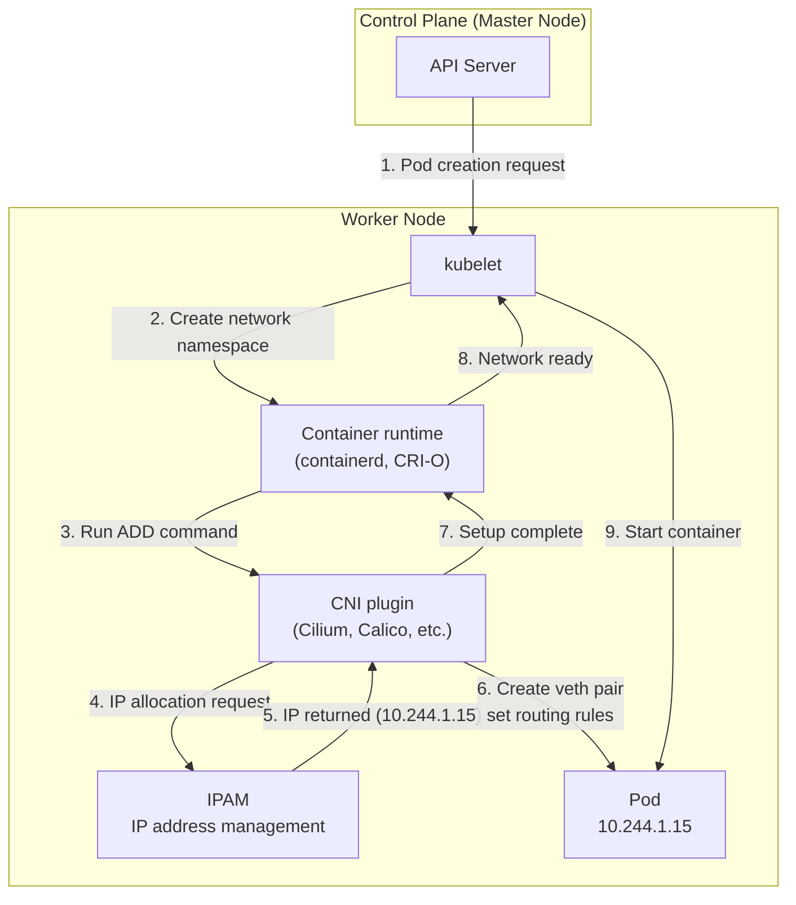
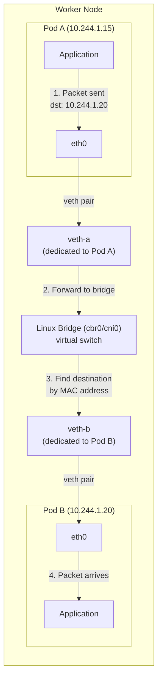
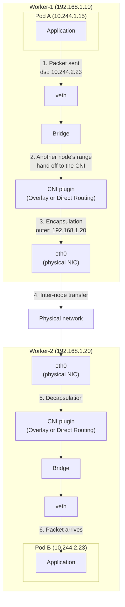
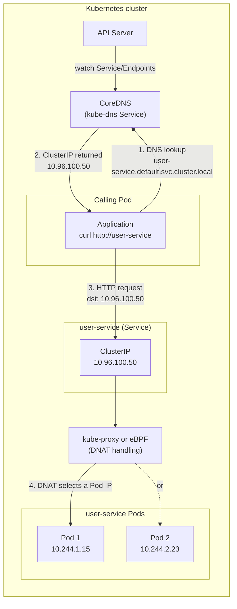

## Introduction

In the [previous post](/en/kubernetes-network-guide-1-external-to-pod/) we followed how an external user's request reaches a Pod inside a Kubernetes cluster — the flow from external LB → NodePort → Ingress Controller → Service → Pod.

But one question remains. **How do Pods talk to each other inside the cluster?** For example, when an order-service Pod calls the user-service Pod's API, what actually happens?

This post answers the following questions.

-   Who assigns Pod IPs (the 10.244.x.x kind)?
-   How do Pods on the same node communicate?
-   What about Pods on different nodes?
-   What exactly do CNI plugins like Cilium and Calico do?
-   When you make a request by Service name, like `curl http://user-service.svc`, how does it find the IP?

## The Big Picture: Components of the Pod Network

Before diving in, let's lay out the main components involved in Pod-to-Pod communication.

| Component | Role | Analogy |
| --- | --- | --- |
| CNI plugin | Sets up the Pod network, assigns IPs | Paving the roads |
| kube-proxy | Service → Pod routing (via iptables/IPVS) | Signposts on the roads |
| CoreDNS | Service name → ClusterIP resolution | Phone book |

> **CNI and kube-proxy have different jobs**
> 
> These two are easy to confuse, but the distinction matters:
> 
> -   **CNI plugin**: "I'll build the network itself so Pod A and Pod B can communicate"
> -   **kube-proxy**: "When you hit a Service IP, I'll translate it to an actual Pod IP"
> 
> Without CNI, Pod-to-Pod communication is impossible at all; without kube-proxy, access through a Service is impossible.
> 
> For reference, **IPVS** (IP Virtual Server) is another mode kube-proxy can use. It performs better than iptables in large clusters.

## Who Assigns Pod IPs?

Run `kubectl get pods -o wide` and you'll see that every Pod has an IP assigned.

```text
NAME                        READY   STATUS    IP            NODE
user-app-7d4b8c6f5-abc12    1/1     Running   10.244.1.15   worker-1
order-app-5f6a9d8e2-xyz34   1/1     Running   10.244.2.23   worker-2
```

Where do these `10.244.x.x` IPs come from? The answer is the **CNI (Container Network Interface) plugin**.

### What Is CNI?

CNI is a **standard interface for configuring container networks**. It's a [CNCF (Cloud Native Computing Foundation) project](https://github.com/containernetworking/cni), used not just by Kubernetes but by a variety of container runtimes.

Here's the key point: **Kubernetes does not ship its own network implementation.** Instead, it defines the CNI standard interface and delegates the actual implementation to plugins (Cilium, Calico, Flannel, and so on).

### The Network Setup Flow When a Pod Is Created

How does the network get configured when a Pod is created? According to the [official Kubernetes documentation](https://kubernetes.io/docs/concepts/extend-kubernetes/compute-storage-net/network-plugins/), it proceeds like this:

```text
1. API Server → kubelet: "Create this Pod on your node"
2. kubelet → container runtime: "Create a new network namespace"
3. Container runtime → CNI plugin: "Run the ADD command" (network setup request)
4. CNI plugin:
   - Creates the network interface (veth pair)
   - Assigns an IP address (IPAM)
   - Sets up routing rules
5. CNI plugin → container runtime: "Setup complete, the IP is 10.244.1.15"
6. Container runtime → kubelet: "Network ready"
7. kubelet: starts the container
```



The CNI plugin lives as an executable in the `/opt/cni/bin/` directory, and its configuration is stored as JSON in `/etc/cni/net.d/`.

### CIDR Ranges and Per-Node IP Allocation

Pod IPs typically use a different range per node. Here, **CIDR** (Classless Inter-Domain Routing) is a way of expressing IP address ranges. Numbers like `/16` and `/24` indicate how many bits belong to the network address.

```text
Cluster Pod CIDR: 10.244.0.0/16 (the entire Pod network)
├── worker-1: 10.244.1.0/24 (Pods on this node get 10.244.1.x)
├── worker-2: 10.244.2.0/24 (Pods on this node get 10.244.2.x)
└── worker-3: 10.244.3.0/24 (Pods on this node get 10.244.3.x)
```

Splitting subnets per node like this means **"a 10.244.2.x IP lives on worker-2"** can be determined from the routing table alone, which makes forwarding packets to other nodes efficient.

> **What is IPAM (IP Address Management)?**
> 
> Inside a CNI plugin there's a component called IPAM. Its job is to assign and manage IPs for Pods. It tracks which IPs are in use and hands out an available IP to each new Pod.

## Pod-to-Pod Communication on the Same Node

Now let's walk through the actual communication process — starting with **Pods on the same node**.



### veth pair: a Virtual Network Cable

A Pod has its own **network namespace**, meaning it gets an isolated network environment. So how does this isolated Pod connect to the host (the node)?

The answer is a **veth (Virtual Ethernet) pair**. A veth pair behaves like a virtual network cable: one end sits inside the Pod, the other end attaches to the host.

**Each Pod gets its own independent veth pair.** Pod A connects to the bridge through its own veth pair (veth-a), and Pod B through its own (veth-b). Even on the same node, every Pod has its own separate "cable."

Here's the structure in brief:

| Layer | Component | Description |
| --- | --- | --- |
| Inside the Pod | eth0 (one end of the veth) | The Pod's network interface |
| Link | veth pair | Virtual cable connecting Pod and host |
| Host | Linux bridge (cbr0) | Virtual switch connecting the Pods |

### Linux Bridge: the Switch for Pods

The **Linux bridge** (usually named `cbr0` or `cni0`) acts as a **virtual switch** connecting the Pods on a node. Like a physical network switch, it forwards packets between the devices attached to it.

### Tracing the Packet Flow

Here's what happens when Pod A (10.244.1.15) sends a packet to Pod B (10.244.1.20) on the same node:

1.  **Inside Pod A**: the application sends a packet to 10.244.1.20
2.  **Pod A → veth**: the packet exits through the Pod's eth0 (one end of the veth)
3.  **veth → bridge**: it's delivered to the Linux bridge (cbr0) that the other end of the veth is attached to
4.  **Inside the bridge**: the bridge consults its MAC address table and forwards to Pod B's veth
5.  **veth → Pod B**: the packet arrives at Pod B's eth0

All of this happens **inside the node**, never touching the physical network, so it's very fast.

> **Try it yourself: inspecting veth pairs directly**
> 
> SSH into a node and check with these commands:
> 
> ```bash
> # list the node's veth interfaces
> ip link show type veth
> 
> # list the interfaces attached to the bridge
> brctl show cbr0
> ```

## Pod-to-Pod Communication Across Nodes

Now for **Pods on different nodes** — this is the core area where implementations differ from one CNI plugin to another.



### The Problem: Pod IPs Only Mean Something Inside the Cluster

Pod A (10.244.1.15, worker-1) wants to send a packet to Pod B (10.244.2.23, worker-2). The problem is that **10.244.2.23 is an address the physical network knows nothing about**.

Ordinary network equipment (routers, switches) has no idea about Pod network ranges like 10.244.x.x. So the CNI plugin has to solve this problem.

### Solution 1: Overlay Networking (VXLAN)

An **overlay network** layers a virtual network on top of the existing physical network. The flagship technology here is **VXLAN** (Virtual Extensible LAN).

When Pod A (10.244.1.15) sends a packet to Pod B (10.244.2.23):

**Original packet**:

| Field | Value |
| --- | --- |
| Source (src) | 10.244.1.15 (Pod A) |
| Destination (dst) | 10.244.2.23 (Pod B) |
| Payload | \[data\] |

**After VXLAN encapsulation**:

| Layer | Source | Destination |
| --- | --- | --- |
| Outer header (node IPs) | 192.168.1.10 (worker-1) | 192.168.1.20 (worker-2) |
| Inner original (Pod IPs) | 10.244.1.15 (Pod A) | 10.244.2.23 (Pod B) |

VXLAN **wraps the Pod-to-Pod packet in UDP** and ships it between nodes. The receiving node strips off the encapsulation and delivers the original packet to the destination Pod.

**Pros**: no changes needed to the existing physical network **Cons**: encapsulation/decapsulation overhead

### Solution 2: Direct Routing (BGP)

**Direct routing** adds the Pod network routes directly to the physical network's routing tables, usually via **BGP** (Border Gateway Protocol). BGP is the standard protocol for exchanging routing information in large networks.

```text
Each node's routing table:

worker-1:
  10.244.1.0/24 → local (this node's Pods)
  10.244.2.0/24 → 192.168.1.20 (send to worker-2)
  10.244.3.0/24 → 192.168.1.30 (send to worker-3)

worker-2:
  10.244.1.0/24 → 192.168.1.10 (send to worker-1)
  10.244.2.0/24 → local
  10.244.3.0/24 → 192.168.1.30 (send to worker-3)
```

With BGP, the nodes share and update this routing information among themselves automatically.

**Pros**: no encapsulation overhead, better performance  
**Cons**: setup can be complex depending on the network environment

> **Overlay vs. Underlay (Direct Routing)**
> 
> | Aspect | Overlay (VXLAN) | Underlay (BGP) |
> | --- | --- | --- |
> | How it works | Packet encapsulation | Direct routing table entries |
> | Physical network requirements | None (just needs to pass UDP) | L3 connectivity, BGP support |
> | Performance | Encapsulation overhead | Faster |
> | Setup difficulty | Easy | Depends on the network environment |
> | Representative CNI | Flannel (VXLAN mode) | Calico (BGP mode) |

## Comparing CNI Plugins: Flannel → Calico → Cilium

Now let's compare the CNI plugins you'll actually encounter in the wild. Understanding how CNI evolved makes each plugin's characteristics much clearer.

### Flannel: Simplicity Personified

[Flannel](https://github.com/flannel-io/flannel) is one of the simplest CNI plugins. Developed by CoreOS (now Red Hat), it was designed with the philosophy of **"all we need is Pod-to-Pod communication."**

**Characteristics**:

-   VXLAN-based overlay networking (default)
-   Very easy to install and configure
-   Lightweight, low resource usage

**Limitations**:

-   **No NetworkPolicy support**: no control over Pod-to-Pod traffic
-   No encryption
-   No advanced features

> **What is NetworkPolicy?**
> 
> NetworkPolicy is a set of **firewall rules controlling traffic between Pods**. For example:
> 
> -   "frontend Pods may only reach backend Pods"
> -   "the database Pod may only be reached from backend Pods"
> -   "inbound external traffic is allowed on port 80 only"
> 
> It's essential in security-conscious production environments. Flannel doesn't support it, so you either pair it with a separate NetworkPolicy solution (such as Calico) or choose a different CNI.

```bash
# Install Flannel
kubectl apply -f https://raw.githubusercontent.com/flannel-io/flannel/master/Documentation/kube-flannel.yml
```

Flannel is a good fit for learning or simple test environments. In production you usually need NetworkPolicy, which pushes you toward a different CNI.

### Calico: the Production Standard

[Calico](https://www.tigera.io/project-calico/), developed by Tigera, is the production-environment standard that **delivers both network performance and security**.

**Characteristics**:

-   BGP-based direct routing (default), with VXLAN as an option
-   **Full NetworkPolicy support**: control over Pod-to-Pod traffic
-   Performance proven in large clusters
-   Supports on-premises, cloud, and hybrid environments alike

**Limitations**:

-   Fewer observability features than Cilium
-   Encryption (WireGuard) requires manual setup

```bash
# Install Calico
kubectl create -f https://raw.githubusercontent.com/projectcalico/calico/v3.26.0/manifests/calico.yaml
```

Calico is the **"safe, solid choice for production."** If you need NetworkPolicy and don't specifically need Cilium's advanced features, Calico is a good pick.

### Cilium: the eBPF-Based Future

[Cilium](https://cilium.io/) is a modern CNI built on **eBPF (extended Berkeley Packet Filter)**. It handles networking at the Linux kernel level, delivering high performance and a rich feature set.

**Characteristics**:

-   eBPF-based: processes packets directly in the kernel instead of via iptables
-   **Can replace kube-proxy**: handles Service routing in eBPF too
-   L7 (application-layer) NetworkPolicy support
-   Hubble: a powerful built-in network observability tool
-   Transparent encryption (WireGuard)

**Limitations**:

-   Higher resource usage than other CNIs
-   Requires a recent Linux kernel (for eBPF support)

```bash
# Install Cilium (using Helm)
helm install cilium cilium/cilium --namespace kube-system
```

> **Why do some clusters have no kube-proxy?**
> 
> Cilium can take over kube-proxy's job (Service → Pod routing) with eBPF. That's why clusters running Cilium often have no kube-proxy DaemonSet at all. Since eBPF is more efficient than iptables, this brings performance benefits in large clusters.

> **eBPF and inter-node transport are separate concerns**
> 
> eBPF, the heart of Cilium, is a **"packet processing engine"** — not an "inter-node transport mechanism."  
> For node-to-node communication, Cilium — just like Flannel and Calico — chooses between **overlay (VXLAN) and native routing**.
> 
> | Layer | Question | Cilium's answer |
> | --- | --- | --- |
> | Packet processing | How do we process packets? | eBPF (instead of iptables) |
> | Inter-node transport | How do we reach other nodes? | VXLAN or native routing |
> 
> In other words, Cilium **processes packets fast with eBPF**, while the inter-node transport can be overlay or direct routing depending on your environment.

### CNI Comparison Summary

| Aspect | Flannel | Calico | Cilium |
| --- | --- | --- | --- |
| Core technology | VXLAN | BGP / VXLAN | eBPF |
| NetworkPolicy | ❌ Not supported | ✅ L3/L4 | ✅ L3/L4/L7 |
| kube-proxy replacement | ❌ | ❌ | ✅ |
| Observability | ❌ | Basic | ✅ Hubble |
| Encryption | ❌ | Manual setup | ✅ Built-in |
| Resource usage | Low | Medium | High |
| Recommended for | Learning, testing | Production (general) | Production (advanced needs) |

> **Which CNI should you choose?**
> 
> -   **Getting started / testing**: Flannel (simplicity)
> -   **Production (general)**: Calico (proven stability)
> -   **Production (advanced security/observability needs)**: Cilium (modern technology)
> 
> In cloud environments, it's also common to use the cloud provider's CNI (AWS VPC CNI, Azure CNI, and so on).

## Service Discovery: Finding Pods by Domain Name

So far we've looked at communication using Pod IPs directly. In practice, though, you almost never use Pod IPs directly — because **Pod IPs can change at any moment**.

Instead, we use **Service names**:

```bash
# From inside a Pod (user-service is a K8s Service name)
curl http://user-service.svc:8080/api/users
```

How does the name `user-service.svc` get resolved to an IP? That's the job of **CoreDNS**.

### The Role of CoreDNS

[CoreDNS](https://coredns.io/) is Kubernetes' default DNS server. It manages DNS records for every Service and Pod.



CoreDNS works like this:

1.  **API Server watch**: CoreDNS watches the Kubernetes API Server to detect changes to Services and Endpoints
2.  **DNS record creation**: on detecting a change, it dynamically creates DNS records for the affected Service
3.  **Query responses**: when a Pod sends a DNS query, it returns that Service's ClusterIP

### The Structure of Service Domains

In Kubernetes, a Service's fully qualified domain name (FQDN) follows this format:

```text
<service-name>.<namespace>.svc.cluster.local
```

For example:

-   `user-service.default.svc.cluster.local`
-   `order-service.production.svc.cluster.local`

### Within the Same Namespace, the Short Name Is Enough

Every Pod's `/etc/resolv.conf` has **search domains** configured:

```text
# cat /etc/resolv.conf from inside a Pod
nameserver 10.96.0.10
search default.svc.cluster.local svc.cluster.local cluster.local
options ndots:5
```

**What the search line means**: it's the list of domains to **automatically append to a short name** when performing DNS lookups.

For example, when you run `curl http://user-service`, the system attempts DNS lookups in this order:

```text
1. user-service.default.svc.cluster.local → if this succeeds, we're done!
2. user-service.svc.cluster.local → (if #1 fails)
3. user-service.cluster.local → (if #2 fails)
4. user-service → (if all fail, off to external DNS)
```

That is, even if you type just `user-service`, the system appends `.default.svc.cluster.local` on its own and tries that. This is why short names are all you need within the same namespace.

**What ndots:5 means**: "if the name has fewer than 5 dots, try the search domains first"

-   `user-service` (0 dots) → try search domains first
-   `api.example.com` (2 dots) → try search domains first
-   `a.b.c.d.e.f` (5 or more dots) → go straight to external DNS

Thanks to these search domains, short names are enough within the same namespace:

```bash
# In the same namespace (default)
curl http://user-service           # → user-service.default.svc.cluster.local

# A Service in another namespace
curl http://user-service.production  # → user-service.production.svc.cluster.local
```

### External Domain vs. Service Domain: Comparing the Traffic Flow

When communicating within the same cluster, an external domain and a Service domain take completely different paths.

**Using an external domain (api.example.com)**:

```text
Pod → CoreDNS → external DNS → obtain public IP
   → external LB → Ingress node → Ingress Controller 
   → Service → target Pod
```

**Using a Service domain (user-service)**:

```text
Pod → CoreDNS → obtain ClusterIP (10.96.100.50)
   → kube-proxy/eBPF translates the ClusterIP to a Pod IP
   → target Pod
```

> **Why is the Service domain more efficient?**
> 
> With an external domain, traffic leaves the cluster and comes back in. That means more network hops, plus unnecessary processing as it passes through the Ingress Controller.
> 
> With a Service domain, traffic stays **entirely inside the cluster**. Fewer network hops and direct Pod-to-Pod communication make it much faster.
> 
> | Comparison | External domain | Service domain |
> | --- | --- | --- |
> | Path | Detours outside the cluster | Completed inside the cluster |
> | Network hops | Many | Few |
> | Latency | High | Low |
> | Ingress load | Incurred | None |

### Headless Service: Getting Pod IPs Directly

A DNS lookup on a regular Service (ClusterIP) returns **the Service's ClusterIP**. But sometimes you need **individual Pod IPs** — for example, to reach each instance of a StatefulSet directly.

That's what a **Headless Service** is for:

```yaml
apiVersion: v1
kind: Service
metadata:
  name: my-headless-service
spec:
  clusterIP: None  # this setting is what makes it a Headless Service
  selector:
    app: my-app
```

A DNS lookup on a Headless Service returns **the list of all Pod IPs** instead of a ClusterIP:

```bash
# Regular Service
nslookup user-service
# → 10.96.100.50 (ClusterIP)

# Headless Service
nslookup my-headless-service
# → 10.244.1.15, 10.244.2.23, 10.244.3.31 (Pod IPs)
```

## Troubleshooting in Practice

When Pod-to-Pod communication breaks, where do you look? Here's a step-by-step checklist.

### 1\. Check for DNS Problems

```bash
# Test DNS resolution from inside a Pod
kubectl exec -it <pod-name> -- nslookup user-service
kubectl exec -it <pod-name> -- nslookup kubernetes.default

# Check CoreDNS Pod status
kubectl get pods -n kube-system -l k8s-app=kube-dns

# Check CoreDNS logs
kubectl logs -n kube-system -l k8s-app=kube-dns
```

### 2\. Check Network Connectivity

```bash
# Test direct Pod-to-Pod communication
kubectl exec -it <pod-name> -- ping <target-pod-ip>
kubectl exec -it <pod-name> -- curl <target-pod-ip>:<port>

# Test communication through a Service
kubectl exec -it <pod-name> -- curl <service-name>:<port>
```

### 3\. Check the CNI Plugin's Status

```bash
# CNI plugin Pod status (e.g., Cilium)
kubectl get pods -n kube-system -l k8s-app=cilium

# Check CNI logs
kubectl logs -n kube-system -l k8s-app=cilium
```

### 4\. Common Problems and Fixes

| Symptom | Likely cause | How to check |
| --- | --- | --- |
| DNS resolution fails | CoreDNS is down | `kubectl get pods -n kube-system -l k8s-app=kube-dns` |
| Same-node Pods can't communicate | CNI plugin problem | Check the CNI Pod logs |
| Cross-node Pods can't communicate | Inter-node network problem, CNI config | Ping between nodes, check CNI config |
| Service unreachable | kube-proxy problem, no Endpoints | `kubectl get endpoints <service-name>` |

## Conclusion

To recap what we covered in this post:

1.  The **CNI plugin** builds the Pod network and assigns IPs.
2.  **Same-node** Pod communication goes through veth pairs and the Linux bridge.
3.  **Cross-node** Pod communication is handled by overlay networking (VXLAN) or direct routing (BGP).
4.  **Flannel → Calico → Cilium** offer progressively richer features; choose based on your environment.
5.  **CoreDNS** handles service discovery, resolving Service names to IPs.
6.  Using **Service domains** keeps communication efficient and inside the cluster.

Once you understand the full flow of Pod-to-Pod communication, it becomes clear where to look when a network problem occurs — you can tell whether the culprit is the CNI, DNS, or the Service configuration.

## References

-   [Kubernetes Documentation – Network Plugins](https://kubernetes.io/docs/concepts/extend-kubernetes/compute-storage-net/network-plugins/)
-   [Kubernetes Documentation – DNS for Services and Pods](https://kubernetes.io/docs/concepts/services-networking/dns-pod-service/)
-   [CNI GitHub Repository](https://github.com/containernetworking/cni)
-   [CoreDNS Kubernetes Plugin](https://coredns.io/plugins/kubernetes/)
-   [Cilium Documentation](https://docs.cilium.io/)
-   [Calico Documentation](https://docs.tigera.io/calico/latest/about/)
-   [Flannel GitHub Repository](https://github.com/flannel-io/flannel)
