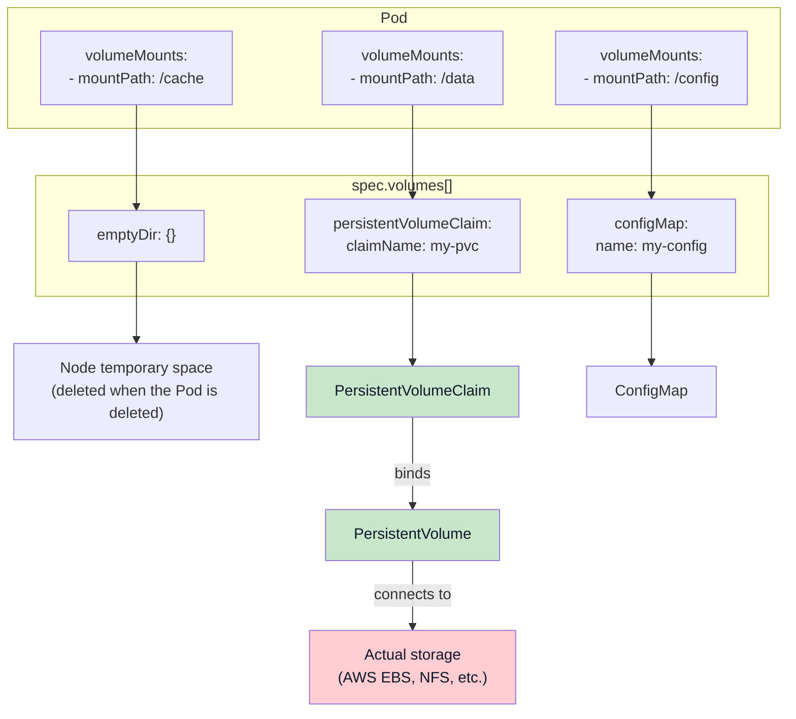
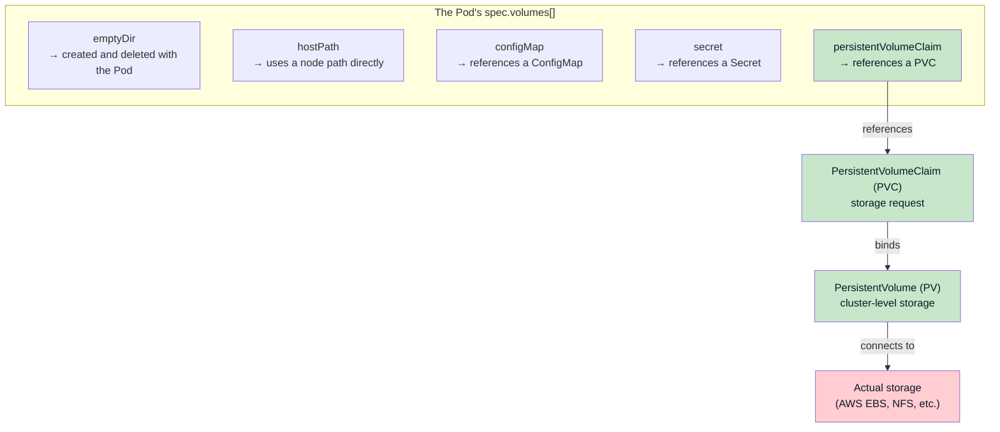
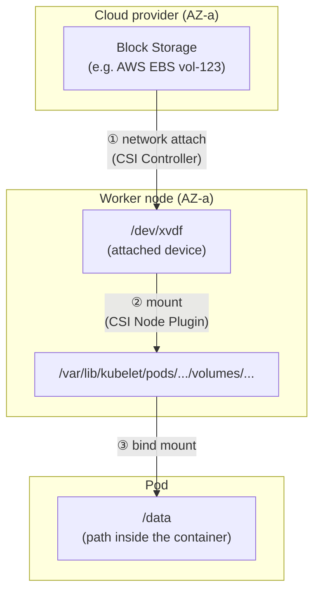
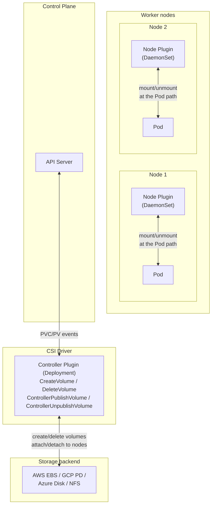
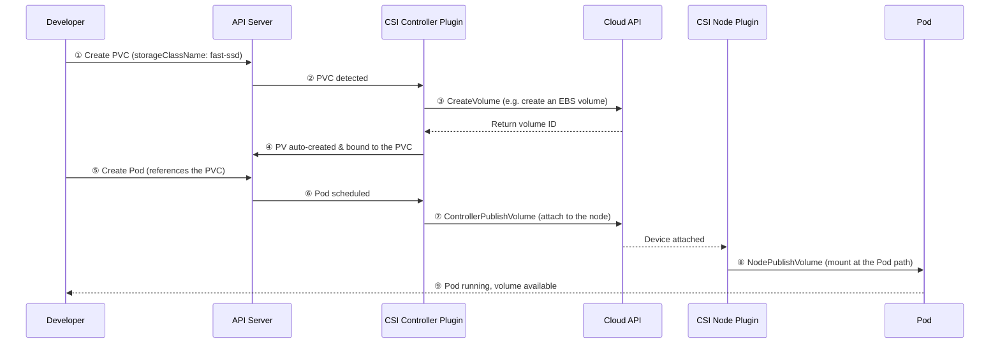

## Introduction

In [the previous post](/en/kubernetes-computing-pod-lifecycle/) we looked at how a Pod gets created and runs in Kubernetes — the Scheduler picks a node, and the kubelet starts the containers.

But there's a problem. **When a Pod dies, the data inside it dies with it.**

Imagine running a database as a Pod. If the data vanished on every Pod restart, you couldn't call it a service. That's why Kubernetes provides **persistent storage** that is independent of the Pod lifecycle.

This post answers the following questions:

-   What does "volume" actually mean in Kubernetes?
-   What's the difference between a PV (PersistentVolume) and a PVC (PersistentVolumeClaim)?
-   Where does a volume physically exist?
-   What happens to the volume when a Pod restarts on a different node?
-   How does a CSI driver work?

## What Is a Volume?

Before diving in, let's pin down the term **volume**. Kubernetes uses "volume" with a **different meaning** from the usual storage terminology.

### "Volume" as a general storage term

The volume we usually know means **the storage itself**. AWS EBS is literally called an "Elastic Block Store **Volume**."

### "Volume" in Kubernetes

A Kubernetes Volume is an abstraction that defines **how storage gets attached to a Pod**.

```text
Storage that already exists (an EBS volume, NFS, a node's disk, a ConfigMap, ...)
    ↓
Kubernetes Volume (an abstraction for attaching it to a Pod)
    ↓
Mounted at a specific path inside the container (/data)
```

The [official Kubernetes docs](https://kubernetes.io/docs/concepts/storage/volumes/) say the same thing:

> "At its core, a volume is a directory, possibly with some data in it, which is accessible to the containers in a pod."

In other words, a Kubernetes volume is not "the storage itself" but **"a directory accessible to the containers in a Pod."** Same word, different layer.

| Term | Common meaning | Meaning in Kubernetes |
| --- | --- | --- |
| **Volume** | The storage itself (EBS, a disk) | Configuration that attaches storage to a Pod |

## The Big Picture: A Pod's volumes and the Volume Types

### Understanding it through the YAML structure

To use storage in a Pod, you define it under `spec.volumes[]`. **`volumes` is the umbrella concept**, and the various **types** all sit at the same level inside it.

```yaml
apiVersion: v1
kind: Pod
metadata:
  name: my-pod
spec:
  containers:
    - name: app
      image: nginx
      volumeMounts:
        - mountPath: /cache
          name: temp-storage
        - mountPath: /data
          name: persistent-storage
        - mountPath: /config
          name: config-storage
  volumes:                           # ← the umbrella concept
    - name: temp-storage
      emptyDir: {}                   # type 1: temporary storage
    
    - name: persistent-storage
      persistentVolumeClaim:         # type 2: PVC reference
        claimName: my-pvc
    
    - name: config-storage
      configMap:                     # type 3: ConfigMap
        name: my-config
```

### The Volume types



| Volume type | Description | Data persistence |
| --- | --- | --- |
| `emptyDir` | Temporary Pod-scoped storage | Deleted when the Pod is deleted |
| `hostPath` | Direct reference to a path on the node | Tied to the node |
| `configMap` | Mounts ConfigMap data | Follows the ConfigMap lifecycle |
| `secret` | Mounts Secret data | Follows the Secret lifecycle |
| **`persistentVolumeClaim`** | References a PVC → persistent storage | **Independent of the Pod** |

**The separate PVC/PV resources come into play only when you use the `persistentVolumeClaim` type.**



### emptyDir: a shared volume that starts as an empty directory

The name **"emptyDir"** comes from the fact that it starts as an **empty directory** when the Pod is created.

```text
Pod scheduled → empty directory created on the node → containers fill it with data → deleted along with the Pod
```

It's handy when containers in a Pod need to share data, but **when the Pod is deleted, the data goes with it**.

```yaml
volumes:
  - name: cache
    emptyDir: {}  # when the Pod dies, the data is deleted too
```

> **emptyDir options**
> 
> In `emptyDir: {}`, the `{}` means "use the defaults."
> 
> ```yaml
> volumes:
>   - name: cache
>     emptyDir: {}  # default: stored on the node's disk
> 
>   - name: fast-cache
>     emptyDir:
>       medium: Memory   # stored in RAM (tmpfs, faster)
>       sizeLimit: 500Mi # cap the maximum size
> ```
> 
> | Option | Description |
> | --- | --- |
> | `medium: ""` (default) | Stored on the node's disk |
> | `medium: Memory` | Stored in RAM (faster, but consumes node memory) |
> | `sizeLimit` | Caps the maximum usage |

### persistentVolumeClaim: attaching persistent storage

To keep data **independently of the Pod**, you use the `persistentVolumeClaim` type. This type references a separate resource called a PVC.

```yaml
volumes:
  - name: db-data
    persistentVolumeClaim:
      claimName: postgres-pvc  # references the PVC by name
```

We'll look at PVCs and PVs in detail in the next section.

## PVC and PV: The Heart of Persistent Storage

### PersistentVolume (PV): a cluster-level storage resource

**A PV is the actual storage provisioned in the cluster.** It connects to AWS EBS, GCP PD, an NFS server, and so on.

```yaml
apiVersion: v1
kind: PersistentVolume
metadata:
  name: my-pv
spec:
  capacity:
    storage: 10Gi
  accessModes:
    - ReadWriteOnce
  persistentVolumeReclaimPolicy: Retain
  storageClassName: gp3
  csi:
    driver: ebs.csi.aws.com
    volumeHandle: vol-0123456789abcdef0
    fsType: ext4
```

**Key fields in the PV spec:**

| Field | Description |
| --- | --- |
| `capacity.storage` | Volume size |
| `accessModes` | Access modes (RWO, ROX, RWX) |
| `persistentVolumeReclaimPolicy` | What happens when the PVC is deleted (Retain, Delete) |
| `storageClassName` | Name of the StorageClass to associate with |
| `csi.driver` | Name of the CSI driver to use |
| `csi.volumeHandle` | ID of the actual storage (e.g., an AWS EBS volume ID) |
| `csi.fsType` | Filesystem type (ext4, xfs, etc.) |

Characteristics of a PV:

-   **Cluster-level resource**: it doesn't belong to any namespace
-   **Lifecycle independent of Pods**: data survives even when Pods die
-   **Connected to actual storage**: cloud disks, NFS, iSCSI, and so on

> **In-tree plugins vs. CSI**
> 
> The `csi:` block in the example above is the **CSI (Container Storage Interface)** approach. In the past, **in-tree plugins** like `awsElasticBlockStore:` were built into the Kubernetes core, but they are now deprecated.
> 
> | Approach | Description | Status |
> | --- | --- | --- |
> | **In-tree** | Built into the K8s core (awsElasticBlockStore, etc.) | Deprecated |
> | **CSI** | Installed as an external driver | Recommended |
> 
> On managed Kubernetes (EKS, GKE, AKS), the CSI drivers come installed by default.

### PersistentVolumeClaim (PVC): a developer's storage request

**A PVC is how a developer says "I need storage like this."** You don't point at a specific PV — you only state the conditions you want (capacity, access mode, and so on).

```yaml
apiVersion: v1
kind: PersistentVolumeClaim
metadata:
  name: my-pvc
  namespace: default
spec:
  accessModes:
    - ReadWriteOnce
  resources:
    requests:
      storage: 10Gi
  storageClassName: gp3  # dynamically provision using this StorageClass
```

Kubernetes finds a PV that matches the conditions and **binds** it to the PVC.

> **Why are PV and PVC separate resources?**
> 
> Because of **separation of roles**:
> 
> -   **Cluster administrators**: manage StorageClasses and the storage infrastructure
> -   **Developers**: request storage via PVCs (how much, with which access mode)
> 
> Developers don't need to know the details of the storage infrastructure. "Give me 10GB of read/write storage" — and that's it.

### PV–PVC binding rules

PVs and PVCs are not matched by name. They're matched **by conditions**:

| Condition | Description |
| --- | --- |
| `storageClassName` | Must be identical |
| `accessModes` | The PV must support the mode the PVC requests |
| `capacity` | PV capacity ≥ PVC requested capacity |
| `volumeMode` | Filesystem/Block must match |

**If you want to bind to a specific PV:**

```yaml
# Option 1: point at it directly with volumeName
apiVersion: v1
kind: PersistentVolumeClaim
metadata:
  name: my-pvc
spec:
  volumeName: my-pv  # directly names a specific PV
  accessModes:
    - ReadWriteOnce
  resources:
    requests:
      storage: 10Gi
---
# Option 2: match labels with a selector
apiVersion: v1
kind: PersistentVolumeClaim
metadata:
  name: my-pvc
spec:
  selector:
    matchLabels:
      type: my-special-volume  # matches the PV's label
  accessModes:
    - ReadWriteOnce
  resources:
    requests:
      storage: 10Gi
```

### Using a PVC from a Pod

```yaml
apiVersion: v1
kind: Pod
metadata:
  name: my-pod
spec:
  containers:
    - name: app
      image: nginx
      volumeMounts:
        - mountPath: /data
          name: my-storage
  volumes:
    - name: my-storage
      persistentVolumeClaim:
        claimName: my-pvc  # references the PVC by name
```

## Where Does a Volume Actually Exist?

Let's answer the question **"where does the volume physically live?"** It depends on the storage type.

### Block Storage – the most common case

Block Storage is a virtual block device attached over the network.

**Examples:** AWS EBS, GCP Persistent Disk (Zonal), Azure Managed Disk



**The flow:**

1.  **The volume physically exists in the cloud provider's storage infrastructure** (within a specific AZ)
2.  **It's attached to a worker node over the network** (like plugging in a USB drive, but over the network)
3.  **It's mounted at a specific path on the node** (/dev/xvdf → /var/lib/kubelet/…)
4.  **It's bind-mounted into the Pod's container** (visible as /data inside the Pod)

### Characteristics by storage type

| Type | Examples | AZ-bound | Multi-node attach |
| --- | --- | --- | --- |
| **Block Storage** | AWS EBS, GCP PD (Zonal), Azure Disk | Bound | No (single node) |
| **Regional Block Storage** | GCP Regional PD, Azure Zone-redundant Disk | Not bound | No |
| **Network File Storage** | AWS EFS, GCP Filestore, Azure Files, NFS | Not bound | **Yes** |
| **hostPath** | Node-local disk | Node-bound | N/A |
| **emptyDir** | Node temporary space | Pod-bound | N/A |

> **What is Regional Block Storage?**
> 
> Some cloud providers offer Block Storage replicated across multiple AZs. The data survives an AZ failure, but it can still only be **attached to a single node**.

### What happens to the volume when a Pod restarts?

**"What happens to the volume when the Pod restarts on a different node?"**

For Block Storage (assuming a single Pod):

```text
[Scenario: Pod restarts → a different node in the same AZ]

1. Pod-A (Node-1, AZ-a) is deleted
2. CSI Controller: detaches the volume from Node-1
3. Scheduler: schedules the new Pod onto Node-2 (AZ-a)
4. CSI Controller: attaches the volume to Node-2
5. CSI Node Plugin: mounts the volume at the Pod's path
6. Pod-A (Node-2) starts → same data preserved!
```

**But it cannot move to a node in a different AZ:**

```text
[Scenario: Pod restarts → a node in a different AZ?]

The volume lives in AZ-a → it cannot attach to a node in AZ-b!
→ The Scheduler automatically schedules only onto nodes in AZ-a
→ If no node in AZ-a is available, the Pod stays Pending
```

> **The Scheduler takes volume location into account**
> 
> When a CSI driver creates a PV, it records topology information (the AZ, etc.) in `spec.nodeAffinity`. The Scheduler reads this and schedules Pods only onto nodes where the volume can be attached.
> 
> See [Node Affinity in PV](https://kubernetes.io/docs/concepts/storage/persistent-volumes/#node-affinity) for the details.

## CSI: The Storage Plugin Interface

We covered CNI (Container Network Interface) in [Understanding Networking (2)](/en/kubernetes-network-guide-2-pod-to-pod/) and CRI (Container Runtime Interface) in [Understanding Computing](/en/kubernetes-computing-pod-lifecycle/). Storage has the same kind of standard interface.

### The three standard interfaces of Kubernetes

| Interface | Full name | Role |
| --- | --- | --- |
| **CNI** | Container Network Interface | Network plugin standard |
| **CRI** | Container Runtime Interface | Container runtime standard |
| **CSI** | Container Storage Interface | Storage plugin standard |

> **Why is it called a "driver"?**
> 
> It's the same concept as a hardware driver:
> 
> -   **Printer driver**: the standard interface between the OS and the printer
> -   **CSI driver**: the standard interface between Kubernetes and the storage system
> 
> Just as the OS says "print this" and the printer driver translates it for the specific printer, Kubernetes says "create a volume" and the CSI driver calls the right API for the specific storage system (EBS, GCP PD, and so on).

### CSI driver architecture



A CSI driver consists of two components:

| Component | Deployed as | Role |
| --- | --- | --- |
| **Controller Plugin** | Deployment | Creates/deletes volumes, attaches/detaches them **to worker nodes** |
| **Node Plugin** | DaemonSet (every node) | Mounts/unmounts **at Pod paths**, formats |

### What the Controller Plugin does

The Controller Plugin handles **cluster-level** storage operations:

| Operation | When it's called | Description |
| --- | --- | --- |
| **CreateVolume** | On PVC creation (dynamic provisioning) | Creates a volume via the storage API (e.g., AWS EC2 CreateVolume) |
| **DeleteVolume** | On PVC deletion | Deletes the volume via the storage API |
| **ControllerPublishVolume** | After Pod scheduling | Attaches the volume to a specific node |
| **ControllerUnpublishVolume** | After Pod deletion | Detaches the volume from the node |

> **Is the Controller Plugin still needed with manual provisioning?**
> 
> Yes! Only CreateVolume goes unused — **attach/detach is still required**. Even a pre-existing volume has to be attached to whichever node the Pod gets scheduled onto.

### What the Node Plugin does

The Node Plugin runs on **each worker node**:

| Operation | Description |
| --- | --- |
| **NodeStageVolume** | Formats the attached device and mounts it at the node's global path |
| **NodePublishVolume** | Bind-mounts the global path to the Pod's path |
| **NodeUnpublishVolume** | Unmounts from the Pod's path |

**Why is a Node Plugin needed at all?**

Even after the Controller says "attach the EBS to the EC2!" and `/dev/xvdf` shows up, making it **visible as `/data` inside the Pod's container** still requires mount work. That's the Node Plugin's job.

```text
Pod scheduled → Controller: attach → Node: mount → Pod can use it!
```

## StorageClass and Dynamic Provisioning

Creating PVs by hand every time is tedious. With a **StorageClass**, a PV is **created automatically** when a PVC is created. In practice, dynamic provisioning is what almost everyone uses.

### The dynamic provisioning flow



1.  A developer creates a PVC (specifying a StorageClass)
2.  The CSI Controller detects the PVC
3.  It asks the storage backend to create a volume (e.g., creating an AWS EBS volume)
4.  A PV is created automatically and bound to the PVC
5.  The Pod uses the PVC

### Defining a StorageClass

```yaml
apiVersion: storage.k8s.io/v1
kind: StorageClass
metadata:
  name: fast-ssd
provisioner: ebs.csi.aws.com        # CSI driver name
parameters:
  type: gp3                          # AWS EBS type
  iops: "3000"
  throughput: "125"
reclaimPolicy: Delete               # delete the PV when the PVC is deleted
allowVolumeExpansion: true          # allow volume expansion
volumeBindingMode: WaitForFirstConsumer  # bind after Pod scheduling
```

| Field | Description |
| --- | --- |
| `provisioner` | Which CSI driver to use |
| `parameters` | Driver-specific settings such as the storage type |
| `reclaimPolicy` | What happens to the PV/data when the PVC is deleted |
| `allowVolumeExpansion` | Whether volume expansion is allowed |
| `volumeBindingMode` | When PV binding happens |

### A dynamic provisioning PVC example

```yaml
apiVersion: v1
kind: PersistentVolumeClaim
metadata:
  name: my-app-data
spec:
  accessModes:
    - ReadWriteOnce
  resources:
    requests:
      storage: 20Gi
  storageClassName: fast-ssd  # this StorageClass auto-creates the PV
```

When you create this PVC:

1.  Kubernetes looks up the `fast-ssd` StorageClass
2.  The CSI driver (ebs.csi.aws.com) creates a 20GB gp3 EBS volume
3.  A PV corresponding to that EBS volume is created automatically
4.  The PVC and PV are bound

> **volumeBindingMode: WaitForFirstConsumer**
> 
> This option controls the binding timing **when the PV is first created**.
> 
> The default, `Immediate`, creates the volume as soon as the PVC is created. With **AZ-bound Block Storage** (EBS, GCP PD Zonal, etc.), that's a problem when the volume gets created in one AZ first and the Pod is then scheduled onto a node in a different AZ.
> 
> ```text
> Immediate mode + AZ-bound storage:
>   PVC created → volume created in AZ-a → Pod scheduled to AZ-b → 💥 failure!
> 
> WaitForFirstConsumer mode:
>   PVC created → (waits) → Pod scheduled to AZ-b → volume created in AZ-b → ✅ success!
> ```
> 
> **AZ-independent storage like NFS or EFS** is fine with `Immediate`. But in cloud environments using Block Storage, `WaitForFirstConsumer` is the recommendation.
> 
> **Note:** on a Pod restart the PV already exists, so this option is irrelevant. On restarts, the Scheduler picks an appropriate node based on the PV's `nodeAffinity`.

### Manual provisioning

Dynamic provisioning is the norm, but when you want to reuse existing storage or need special configuration, you can create the PV manually.

```yaml
# 1. An administrator creates the PV
apiVersion: v1
kind: PersistentVolume
metadata:
  name: existing-volume
spec:
  capacity:
    storage: 100Gi
  accessModes:
    - ReadWriteOnce
  persistentVolumeReclaimPolicy: Retain
  storageClassName: ""  # empty string: no particular StorageClass
  csi:
    driver: ebs.csi.aws.com
    volumeHandle: vol-existing123456  # an EBS volume that already exists
    fsType: ext4
---
# 2. A developer creates the PVC (binds to the PV above)
apiVersion: v1
kind: PersistentVolumeClaim
metadata:
  name: my-pvc
spec:
  accessModes:
    - ReadWriteOnce
  resources:
    requests:
      storage: 100Gi
  storageClassName: ""  # empty string, same as the PV
```

| Approach | Flow | Use cases |
| --- | --- | --- |
| **Dynamic** | PVC created → StorageClass → PV auto-created | The common case (90%+) |
| **Manual** | Admin creates the PV → developer creates the PVC → binding | Reusing existing storage, special configuration |

## Wrap-up

In this post we walked through the core concepts and mechanics of Kubernetes storage.

**Core concepts:**

-   **Kubernetes Volume**: not the storage itself, but "the configuration that attaches storage to a Pod"
-   **spec.volumes\[\]**: the umbrella concept; emptyDir/hostPath/persistentVolumeClaim and friends are types
-   **PV**: the actual cluster-level storage resource
-   **PVC**: a developer's storage request
-   **StorageClass**: the template for dynamic provisioning
-   **CSI**: the storage plugin standard, alongside CNI and CRI

**Things worth remembering:**

-   The volume physically lives in cloud network storage; it's attached to the node → mounted into the Pod
-   PV–PVC binding is condition-based, not name-based
-   `WaitForFirstConsumer` only matters when the PV is first created; restarts are handled via nodeAffinity
-   The CSI Controller Plugin attaches/detaches to worker nodes; the CSI Node Plugin mounts at Pod paths

In the next post we'll cover practical usage and operations: **AccessModes, Reclaim Policy, StatefulSet storage management, and troubleshooting**.

## References

-   [Kubernetes Volumes](https://kubernetes.io/docs/concepts/storage/volumes/)
-   [Kubernetes Persistent Volumes](https://kubernetes.io/docs/concepts/storage/persistent-volumes/)
-   [Storage Classes](https://kubernetes.io/docs/concepts/storage/storage-classes/)
-   [Container Storage Interface (CSI)](https://kubernetes.io/blog/2019/01/15/container-storage-interface-ga/)
-   [Node Affinity in PV](https://kubernetes.io/docs/concepts/storage/persistent-volumes/#node-affinity)
