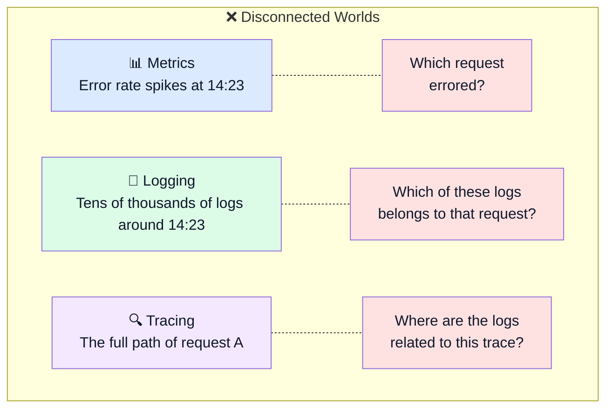
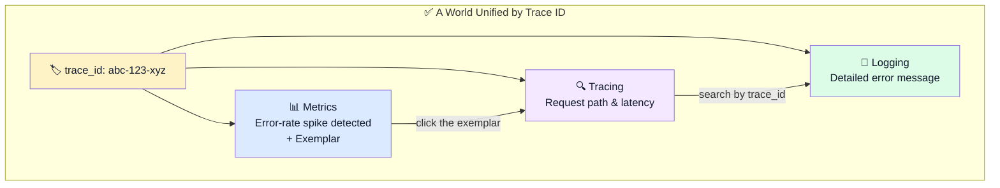
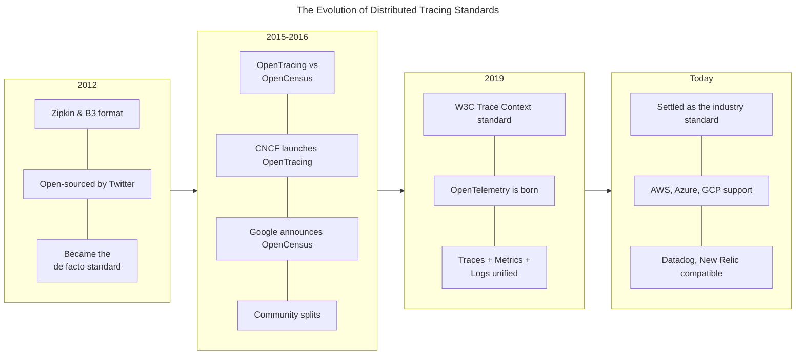
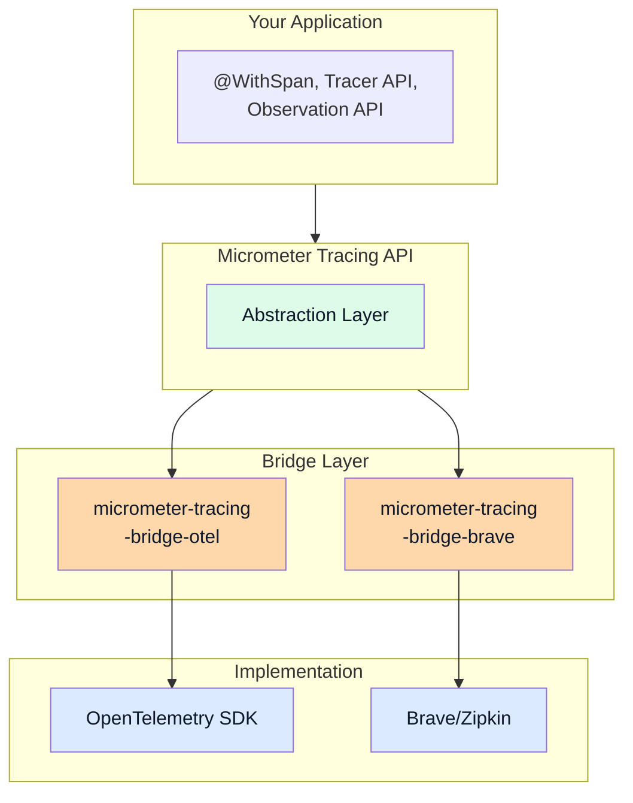

> **Understanding Tracing series**
> 
> 1.  **[From the History of Observability to the Spring Ecosystem (feat. OTel)](/en/tracing-1-observability-spring-otel/) ← you are here**
> 2.  [ThreadLocal and MDC](/en/tracing-2-threadlocal-mdc/)
> 3.  [Reactor Context and Asynchronous Environments](/en/tracing-3-reactor-context-webflux/)
> 4.  [Kotlin Coroutines and Context Propagation](/en/tracing-4-kotlin-coroutine-context-propagation/)
> 5.  [Java Agent vs Library Instrumentation](/en/tracing-5-java-agent-vs-library-instrumentation/)

## Introduction

"Why is this API so slow?" To answer that question in an MSA environment, you need to trace which services a request passed through and where it spent its time. With 3 services you can dig through logs and figure it out; with dozens of services tangled together? Without distributed tracing, it's practically impossible.

In this post I'll cover why distributed tracing is needed, how OpenTelemetry became the industry standard, and what options exist in the Spring Boot ecosystem. In particular, I want to give a clear decision framework to anyone confused about whether to choose Micrometer or OpenTelemetry.

## The Problem Distributed Tracing Solves

In a monolithic architecture, a single request is handled inside a single process. When something goes wrong, you look at that server's logs. In an MSA environment, things are different.

When a user clicks the order button, a flow like this can unfold:


If a delay occurs somewhere in there, how do you find it? Lining up each service's logs by timestamp and tracing through them is unrealistic. What if we assigned every request a unique ID and made that ID follow the request through every service? That's the core idea of distributed tracing.

> **Trace**: the entire journey of a single request through the system
> 
> **Span**: each unit of work within that journey (e.g., handling an HTTP request, executing a DB query)
> 
> **Trace ID**: the unique ID identifying the whole journey
> 
> **Span ID**: the ID identifying each unit of work

## The Three Pillars of Observability, and the Need to Unify Them

The data you use to observe a system falls into three broad categories.

**Metrics** express the state of the system as numbers. CPU utilization, memory usage, request throughput, average response time — that sort of thing. They're stored in a time-series database and visualized on dashboards. The Prometheus + Grafana combo is the classic example.

**Logging** is a record of events. It leaves a text trail of what happened at a specific point in time. The ELK Stack (Elasticsearch, Logstash, Kibana) has long been the de facto standard.

**Tracing** follows the journey of a request. In a distributed system, it shows which path a request took and how much time it spent in each segment. Zipkin and Jaeger are the representative tools.

### The Limits of Disconnected Worlds

The problem is that these three evolved separately for a long time.

Suppose you notice the error rate suddenly spiking on a dashboard. All Metrics tells you is "a lot of errors are happening." It can't tell you which request errored, or what path that request took. You have to dig through logs — and if there are tens of thousands of log lines in the window when the errors occurred? Finding the problematic request among them is like finding a needle in the desert.



Because the three kinds of data aren't connected to each other, just gathering the information you need to solve a problem is a job in itself.

### Connecting Them with a Trace ID

The solution is surprisingly simple: attach the same identifier to all of the data.



**Tracing has a Trace ID by definition.** That was always the case.

```text
[Trace]
trace_id: abc-123-xyz
spans:
  - service: order-service, duration: 45ms
  - service: payment-service, duration: 120ms
```

**Add the Trace ID to Logging.** When writing a log line, record the Trace ID of the request currently being processed alongside it.

```text
2024-01-15 14:23:45 [trace_id=abc-123-xyz span_id=def-456] ERROR PaymentService - Insufficient funds
2024-01-15 14:23:45 [trace_id=abc-123-xyz span_id=ghi-789] INFO  OrderService - Payment failed, rolling back
```

Now searching by Trace ID surfaces every log line related to that request at once.

At the heart of this feature is **MDC** (Mapped Diagnostic Context). MDC is a space for storing context information tied to the current thread. When a tracing library handles a request, it puts the Trace ID into the MDC, and the logging framework (Logback, Log4j) automatically includes that value when it writes log output. How MDC works, and how it relates to ThreadLocal, is covered in detail in the [next part](/en/tracing-2-threadlocal-mdc/).

**Connect the Trace ID to Metrics too.** This works a bit differently — attaching a Trace ID to every metric data point would make the data explode. Instead, we use a concept called an **Exemplar**.

```text
http_request_duration_seconds{service="payment"} 2.1 # {trace_id="abc-123-xyz"} 4.3
```

Unpacking what this metric means:

| Component | Value | Meaning |
| --- | --- | --- |
| Metric name | `http_request_duration_seconds` | HTTP request response time |
| Label | `{service="payment"}` | metric for the payment service |
| **Aggregated value** | `2.1` | the **average response time** across all requests |
| Exemplar trace\_id | `abc-123-xyz` | the Trace ID of the request attached as a sample |
| **Exemplar value** | `4.3` | the sampled request's **actual response time** |

When you're looking at a response-time graph in Grafana and click on an anomaly, the trace\_id carried in the Exemplar takes you straight to the actual request trace from that moment. The idea is: "The average is 2.1 seconds, but I've attached one slow 4.3-second request as a sample. If you're curious, go look at this trace."

Link all three kinds of data with a single Trace ID, and the time from "anomaly spotted on the dashboard" to "root cause identified" drops dramatically.

> 💡 **OpenTelemetry's role**
> 
> OpenTelemetry standardizes this unification "at the protocol level." It defines the Trace, Log, and Metric data models to include Trace ID and Span ID fields, and the SDK is implemented to fill those values in automatically. So with OpenTelemetry, the three kinds of data connect naturally without any extra configuration.

## A History of Tracing Standards: From B3 to W3C Trace Context

Everyone knew distributed tracing was necessary, but everyone implemented it differently.



### Zipkin and the B3 Format

In 2012, Twitter open-sourced Zipkin. Inspired by Google's Dapper paper, the project drove the popularization of distributed tracing.

Zipkin used a propagation format called **B3**. It carries information like the following in HTTP request headers, passing it between services.

```http
X-B3-TraceId: 463ac35c9f6413ad48485a3953bb6124
X-B3-SpanId: 0020000000000001
X-B3-ParentSpanId: 0010000000000001
X-B3-Sampled: 1
```

What each field means:

| Header | Meaning |
| --- | --- |
| `X-B3-TraceId` | unique ID for the entire request journey |
| `X-B3-SpanId` | ID of the unit of work in the current service |
| `X-B3-ParentSpanId` | ID of the parent span that called me (who called me) |
| `X-B3-Sampled` | whether to collect this request (1 = collect, 0 = don't) |

B3 was simple and easy to understand. Many projects adopted it, and it settled in as a de facto standard. But it was never an official standard, so subtly different implementations sprang up. Single-header and multi-header styles coexisted, and 128-bit vs 64-bit Trace ID handling varied from one implementation to the next.

### The Era of the Split: OpenTracing vs OpenCensus

In 2015, attempts to standardize the tracing API began. The **OpenTracing** project launched under the CNCF (Cloud Native Computing Foundation). The goal: provide a vendor-neutral API so you could swap out the backend tracing system without modifying application code.

At almost the same time, Google announced **OpenCensus**. Where OpenTracing defined only a tracing API, OpenCensus covered both Tracing and Metrics. It also shipped an SDK implementation, not just API definitions.

Both projects had good intentions, but the result was a divided community. Some libraries supported OpenTracing, others supported OpenCensus. Some supported both — but from a developer's point of view, it was confusing.

### Enter OpenTelemetry

In 2019, the two projects merged, and **OpenTelemetry** (OTel) was born.

OpenTelemetry covers all three:

-   **Traces**: distributed tracing
-   **Metrics**: metrics collection
-   **Logs**: log collection (added later)

It also adopted the W3C-defined **Trace Context** standard as its default propagation format.

```http
traceparent: 00-0af7651916cd43dd8448eb211c80319c-b7ad6b7169203331-01
tracestate: vendor1=value1,vendor2=value2
```

A single `traceparent` header carries the version, Trace ID, Span ID, and flags. `tracestate` is an extension point for vendor-specific extra information.

Breaking down the structure of `traceparent`:

-   `00`: version (currently version 00)
-   `0af7651916cd43dd8448eb211c80319c`: Trace ID (128-bit, 32 hex chars)
-   `b7ad6b7169203331`: Span ID (64-bit, 16 hex chars)
-   `01`: flags (01 = sampled)

### Converting Between B3 and W3C Trace Context

The two formats carry similar information, so they can be converted back and forth.

| Component | B3 Multi-Header | W3C Trace Context |
| --- | --- | --- |
| Trace ID | `X-B3-TraceId: 0af7651916cd43dd8448eb211c80319c` | 2nd field of `traceparent` |
| Span ID | `X-B3-SpanId: b7ad6b7169203331` | 3rd field of `traceparent` |
| Parent Span ID | `X-B3-ParentSpanId: b7ad6b7169203331` | ❌ not in the header (explained below) |
| Sampled | `X-B3-Sampled: 1` | 4th field of `traceparent` (`01`) |

> 💡 **Where did ParentSpanId go?**
> 
> W3C Trace Context has no `ParentSpanId` field, because it works differently.
> 
> **B3 approach**: carry the ParentSpanId explicitly in a header
> 
> **W3C approach**: the SpanId in `traceparent` automatically becomes the parent on the receiving side
> 
> ```text
> When Service A calls Service B:
> 
> [headers A sends]
> traceparent: 00-{traceId}-{A's spanId}-01
> 
> [after B receives them]
> - B uses A's spanId as its own parentSpanId
> - B generates a new spanId and starts its own span
> ```
> 
> The same information ends up being conveyed — W3C just made it simpler.

### Where Things Stand Today

OpenTelemetry has become the most active CNCF project after Kubernetes. Cloud vendors like AWS, Azure, and GCP support OpenTelemetry, and APM vendors like Datadog, New Relic, and Dynatrace ingest OpenTelemetry data.

W3C Trace Context is the default propagation format, but backward compatibility with B3 is maintained. OpenTelemetry supports a **Composite Propagator**, so it can read and write multiple propagation formats at the same time.

## The Evolution of Tracing in the Spring Ecosystem

Tracing support in the Spring ecosystem has gone through several transitions of its own.

### The Spring Cloud Sleuth Era (Spring Boot 2.x)

For a long time, **Spring Cloud Sleuth** handled distributed tracing for Spring applications. Sleuth used Brave (Zipkin's Java client library) internally, and with virtually no configuration it automatically took care of:

-   Extracting and injecting B3 headers on HTTP requests/responses
-   Automatically adding Trace ID and Span ID to logs (via MDC)
-   Automatic propagation on outbound requests through RestTemplate, WebClient, and so on

```text
# Example log with Sleuth applied
2024-01-15 10:23:45.123 INFO [order-service,abc123,def456] OrderController - Order received
```

Inside the brackets, `abc123` is the Trace ID and `def456` is the Span ID. This log format made searching logs a whole lot easier.

### The Move to Micrometer Tracing (Spring Boot 3.x)

Spring Boot 3.0 brought a big change. Spring Cloud Sleuth was deprecated, and its functionality moved to **Micrometer Tracing**.

Micrometer was originally a facade library for metrics collection. Just as SLF4J abstracts the logging API, Micrometer abstracts the metrics API. Whether your backend is Prometheus, Datadog, or CloudWatch, the application code stays the same.

Micrometer Tracing applies the same philosophy to tracing.



The **Bridge** is the key. Use `micrometer-tracing-bridge-otel` and the OpenTelemetry SDK runs underneath; use `micrometer-tracing-bridge-brave` and Brave runs instead. Application code only ever touches the Micrometer Tracing API.

### Bridge, Propagator, and Exporter — How They Relate

An important conceptual distinction is needed here. **Bridge**, **Propagator**, and **Exporter** each play a different role.

| Concept | Role | Multiple allowed? |
| --- | --- | --- |
| **Bridge** | connects the Micrometer API to an implementation (OTel/Brave) | pick exactly one |
| **Propagator** | reads/writes context in HTTP headers (B3, W3C, etc.) | several can be combined |
| **Exporter** | ships trace data to a backend (Jaeger, OTel Collector, etc.) | several can be configured |

**You choose exactly one Bridge.** You have to decide whether to use the OTel Bridge or the Brave Bridge.

But **Propagators and Exporters can be used several at a time.** This is the key to gradual migration.

There are two ways to configure it.

```yaml
# Option 1: configure via type (applies the same to inbound and outbound)
management:
  tracing:
    propagation:
      type:
        - w3c
        - b3_multi
```
```yaml
# Option 2: separate consume/produce (finer-grained control)
management:
  tracing:
    propagation:
      consume:        # inbound: read both formats
        - w3c
        - b3_multi
      produce:        # outbound: write W3C only
        - w3c
```

`type` applies the same value to both `consume` and `produce`. If a gradual migration calls for a setup like "read incoming B3, but only write W3C on the way out," split `consume` and `produce`.

**Configuring multiple Exporters (application.yaml):**

With the OTel Bridge, adding the relevant exporter dependency lets you **export to several backends simultaneously with nothing but application.yaml**.

```yaml
# application.yml - export to OTLP and Zipkin simultaneously
management:
  otlp:
    tracing:
      endpoint: http://otel-collector:4318/v1/traces
  zipkin:
    tracing:
      endpoint: http://zipkin:9411/api/v2/spans
```

The dependencies you need:

```xml
<dependency>
    <groupId>io.micrometer</groupId>
    <artifactId>micrometer-tracing-bridge-otel</artifactId>
</dependency>
<dependency>
    <groupId>io.opentelemetry</groupId>
    <artifactId>opentelemetry-exporter-otlp</artifactId>
</dependency>
<dependency>
    <groupId>io.opentelemetry</groupId>
    <artifactId>opentelemetry-exporter-zipkin</artifactId>
</dependency>
```

> 💡 **The OTel Collector alternative**
> 
> If you have more complex requirements (3+ backends, dynamic routing, tail sampling, etc.), there's also the option of putting an OTel Collector in the middle:
> 
> -   Application → Collector → multiple backends
> -   Add/remove backends without changing application configuration
> -   Use extra Collector features like sampling, filtering, and batching

With this kind of configuration you can:

-   **Inbound**: handle requests arriving with B3 headers and requests arriving with W3C headers alike
-   **Outbound**: send both B3 and W3C headers when calling other services
-   **Export**: ship trace data to Jaeger and an OTel Collector simultaneously

> 💡 **A gradual migration scenario**
> 
> Migrating from B3 to W3C in an MSA environment currently on B3:
> 
> 1.  Configure every service's Propagator to support both `W3C, B3`
> 2.  Once services are deployed in this state, they can handle either format
> 3.  After every service has been updated, remove B3 support
> 
> No need to deploy every service at once — you can migrate with zero downtime.

> 💡 **Extra configuration for WebFlux**
> 
> If you use Spring WebFlux (Reactor-based), you need context propagation configuration:
> 
> ```yaml
> spring:
>   reactor:
>     context-propagation: auto
> ```
> 
> Without this setting, the trace context can get lost in Reactor's asynchronous chains. Setting it to `auto` enables automatic propagation between the Reactor Context and ThreadLocal. The details of how this works are covered in a [later part](/en/tracing-3-reactor-context-webflux/).

### So What Should You Use?

This is where the confusion starts. To add tracing in Spring Boot 3, you have these options:

1.  **Micrometer Tracing + Bridge** (the Spring-recommended approach)
2.  **OpenTelemetry Java Agent** (the OTel project's recommended approach)
3.  **OpenTelemetry Spring Boot Starter** (provided by the OTel project)

Let's lay out what characterizes each.

**Micrometer Tracing + Bridge**

Auto-configured once you add Spring Boot Actuator. It has the most natural integration with the Spring ecosystem, and through the Observation API you can manage Metrics and Tracing in a unified way.

Example dependencies:

```xml
<dependency>
    <groupId>org.springframework.boot</groupId>
    <artifactId>spring-boot-starter-actuator</artifactId>
</dependency>
<dependency>
    <groupId>io.micrometer</groupId>
    <artifactId>micrometer-tracing-bridge-otel</artifactId>
</dependency>
<dependency>
    <groupId>io.opentelemetry</groupId>
    <artifactId>opentelemetry-exporter-otlp</artifactId>
</dependency>
```

**OpenTelemetry Java Agent**

Attached with the `-javaagent` option at JVM startup. No application code changes required at all.

```bash
java -javaagent:opentelemetry-javaagent.jar -jar myapp.jar
```

It manipulates bytecode at runtime to provide auto-instrumentation for hundreds of libraries. It has the broadest coverage.

**OpenTelemetry Spring Boot Starter**

The Spring Boot integration provided directly by the OpenTelemetry project. It uses the OpenTelemetry API directly, without going through Micrometer.

### Native Image and the Java Agent

One of the selection criteria is **Native Image support**.

**GraalVM Native Image** is a technology that compiles a Java application ahead of time (AOT) into a native binary. Compared with the regular JVM approach:

|  | JVM | Native Image |
| --- | --- | --- |
| Startup time | seconds | tens of milliseconds |
| Memory usage | high | low |
| Runtime optimization | JIT compilation | not possible |
| Bytecode manipulation | possible | **not possible** |

Because a Native Image is already fully compiled, **the Java Agent approach — which manipulates bytecode at runtime — cannot be used.** If you want to build Spring Boot as a Native Image for fast startup and low memory usage, you have to choose a library approach (Micrometer Tracing or the OTel Spring Starter) instead of the agent.

> 💡 **When would you consider Native Image?**
> 
> -   When cold-start time matters in serverless environments (Lambda, Cloud Functions)
> -   When you want to cut memory costs in container environments
> -   When fast startup is essential, as with CLI tools
> 
> For a typical web service, the JVM approach is often plenty.

### Decision Criteria

| Situation | Recommendation |
| --- | --- |
| Spring Boot 3 + JVM only | Micrometer Tracing + OTel Bridge |
| GraalVM Native Image required | Micrometer Tracing (agent not possible) |
| Polyglot MSA (Java + Go + Python) | Use the OpenTelemetry SDK directly, or the Java Agent, for API consistency |
| Keeping existing Zipkin infrastructure | Micrometer Tracing + Brave Bridge |
| Want the broadest auto-instrumentation | OpenTelemetry Java Agent |
| Minimal code changes | OpenTelemetry Java Agent |

**In short:**

-   If you want deep integration with the Spring ecosystem and unified management of Metrics/Tracing: **Micrometer Tracing**
-   If you want the widest auto-instrumentation with zero code changes: **OpenTelemetry Java Agent**
-   If you want a consistent API across a polyglot environment: **use the OpenTelemetry SDK directly**

> 💡 **opentelemetry-spring-boot-starter vs micrometer-tracing-bridge-otel**
> 
> -   Both are library approaches
> -   `opentelemetry-spring-boot-starter`: provided by the OpenTelemetry project; uses the OTel API directly
> -   `micrometer-tracing-bridge-otel`: uses the Micrometer API and translates to the OTel SDK internally
> 
> Both ultimately export data over the OpenTelemetry protocol (OTLP). The difference is which API your application code uses. That said, the default approach mentioned in the [OpenTelemetry docs](https://opentelemetry.io/docs/zero-code/java/spring-boot-starter/) is the Java Agent. And at the moment, the Micrometer implementation supports more instrumentation types (e.g., the reactive Mongo client, Redis clients, etc.). So if you're doing tracing the library way in a Spring application, I think the Micrometer implementation is the better fit.

## What's Next

In this post we looked at the concepts and history of distributed tracing, and the options in the Spring ecosystem. But we haven't yet touched on "how it actually works."

The next post digs deep into how the tracing context is propagated:

-   What **ThreadLocal** is, and why it's central to tracing
-   How exactly **MDC** (Mapped Diagnostic Context) works
-   What roles **SLF4J and Logback** each play

Once you understand how context propagates in the synchronous model (thread per request), the complexity of asynchronous environments (Reactor, coroutines) that comes later will fall into place naturally.

## References

-   [OpenTelemetry Docs – What is OpenTelemetry](https://opentelemetry.io/docs/what-is-opentelemetry/)
-   [W3C Trace Context Specification](https://www.w3.org/TR/trace-context/)
-   [Micrometer Tracing Docs](https://micrometer.io/docs/tracing)
-   [Spring Boot 3 Observability](https://spring.io/blog/2022/10/12/observability-with-spring-boot-3)
-   [OpenTelemetry Java Instrumentation](https://github.com/open-telemetry/opentelemetry-java-instrumentation)
-   [B3 Propagation Specification](https://github.com/openzipkin/b3-propagation)
