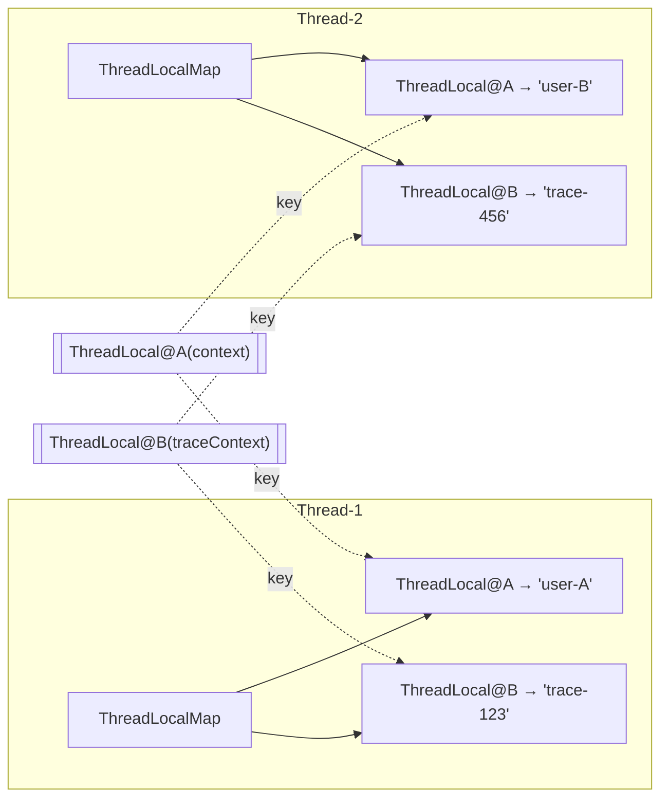
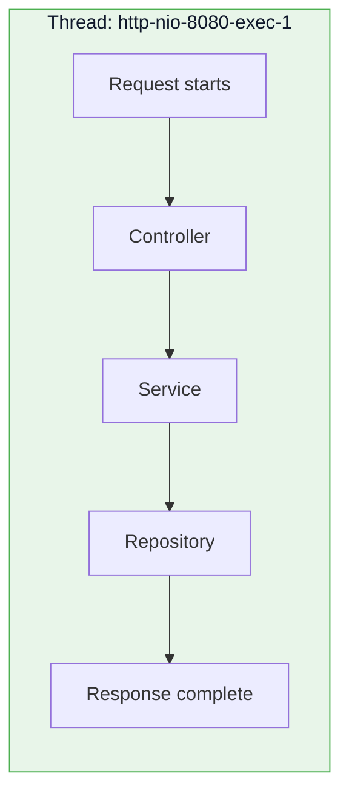
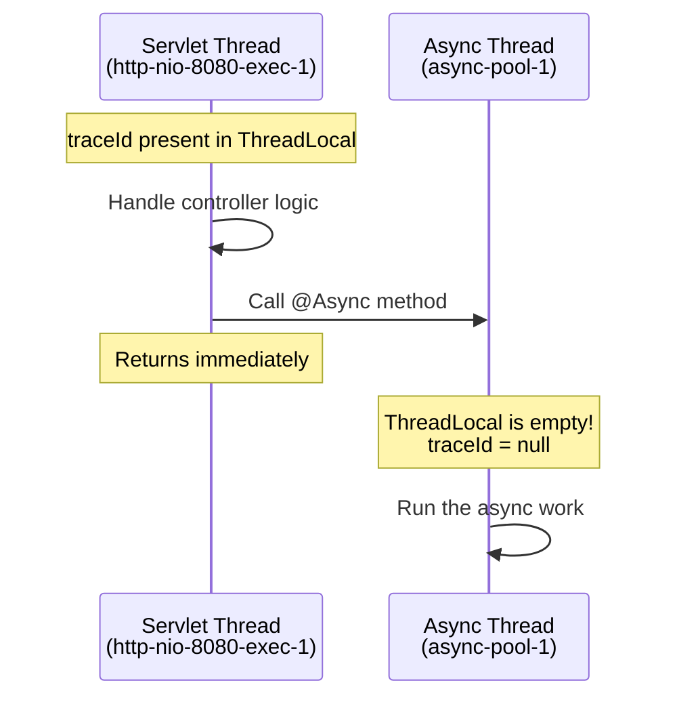
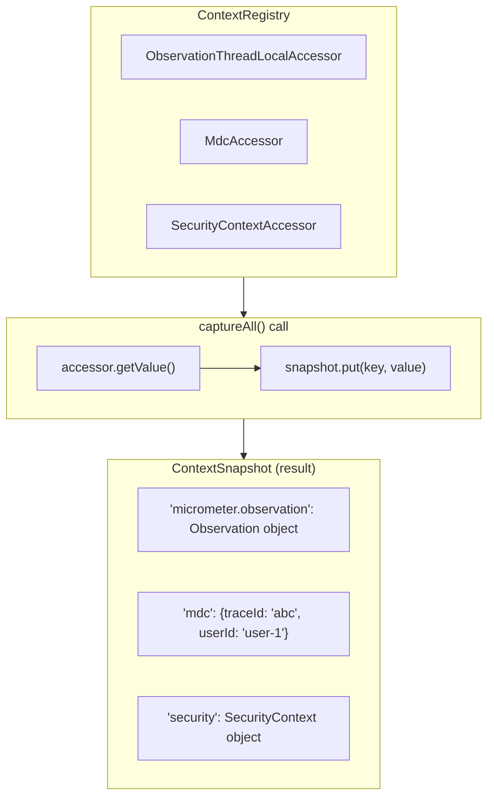
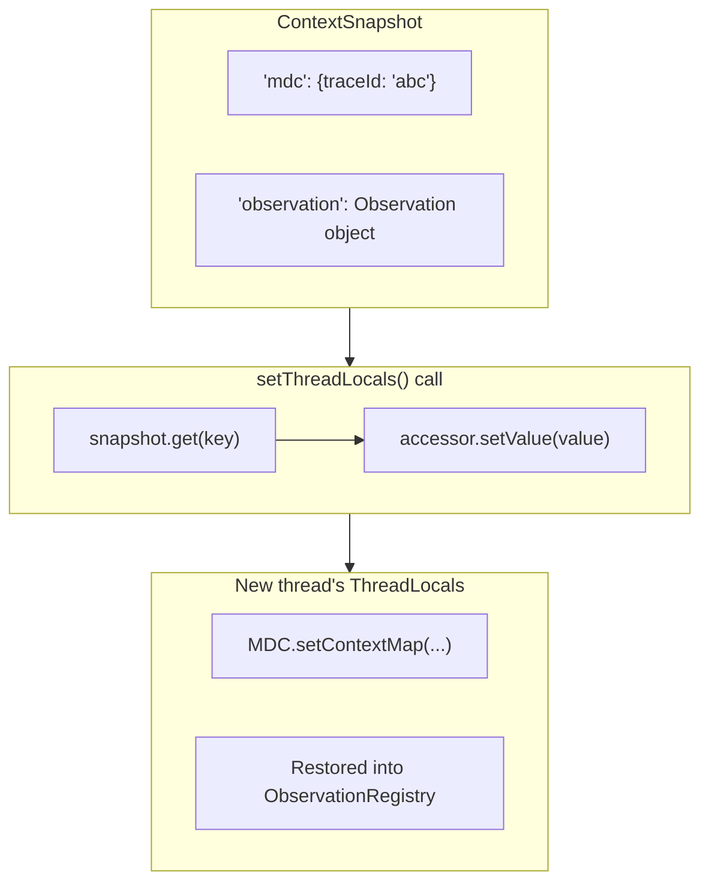
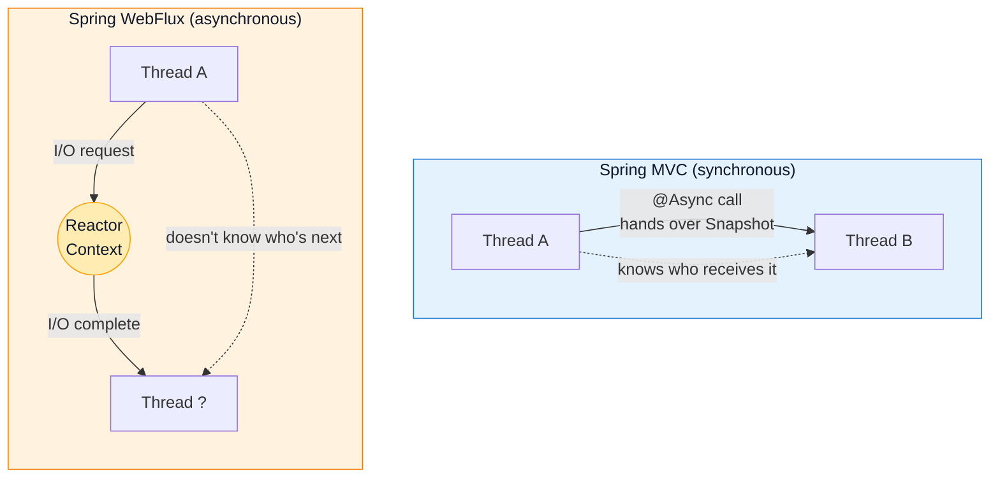

> **Understanding Tracing series**
> 
> 1.  [From the History of Observability to the Spring Ecosystem (feat. OTel)](/en/tracing-1-observability-spring-otel/)
> 2.  **[ThreadLocal and MDC](/en/tracing-2-threadlocal-mdc/) ← you are here**
> 3.  [Reactor Context and Asynchronous Environments](/en/tracing-3-reactor-context-webflux/)
> 4.  [Kotlin Coroutines and Context Propagation](/en/tracing-4-kotlin-coroutine-context-propagation/)
> 5.  [Java Agent vs Library Instrumentation](/en/tracing-5-java-agent-vs-library-instrumentation/)

## Why Do We Need to Know ThreadLocal?

In [Part 1](/en/tracing-1-observability-spring-otel/) we saw that the heart of distributed tracing is **trace context propagation**. Between services, you propagate it via HTTP headers (W3C Trace Context, B3) — but that leaves one question.

**"Inside a service, where is the trace context actually stored?"**

When a request enters a Spring MVC application and travels through Controller → Service → Repository, the `traceId` and `spanId` have to be kept somewhere. Passing them as parameters everywhere would be impractical.

The answer is **ThreadLocal**. And **MDC (Mapped Diagnostic Context)**, the mechanism that automatically stamps `traceId` onto your logs, runs on top of ThreadLocal too. Understand these two, and how tracing works internally becomes crystal clear.

## What Is ThreadLocal?

### The Need for Thread Isolation

In a multithreaded environment, several threads sharing one variable leads to concurrency problems. The usual fix is synchronization with `synchronized` or a `Lock`, but the performance cost is unavoidable.

Think about it, though — some data **never needed to be shared in the first place**:

-   The current user's authentication info
-   The current request's trace context
-   The current transaction info

This kind of data can simply live **independently per thread**. No synchronization needed, and it's still safe. That is ThreadLocal's reason for existing.

### The Concept

ThreadLocal provides **an independent variable store per thread**. Even when threads access the same ThreadLocal object, each thread reads and writes its own value.

```java
// the same ThreadLocal object
private static final ThreadLocal<String> context = new ThreadLocal<>();

// running on Thread-1
context.set("user-A");  // stored in Thread-1's store
context.get();          // returns "user-A"

// running on Thread-2 (at the same time)
context.set("user-B");  // stored in Thread-2's store
context.get();          // returns "user-B" (Thread-1 unaffected)
```

Think of it as each thread carrying its own `Map`, with the ThreadLocal object acting as the key into that Map.

> **🤔 Does `new ThreadLocal<>()` store anything right away?**
> 
> No! `new ThreadLocal<>()` only **creates the ThreadLocal object**. The actual storing happens **when `set()` is called**:
> 
> ```java
> ThreadLocal<String> tl = new ThreadLocal<>();  // nothing has happened yet
> tl.set("value");  // this is when it lands in the Thread's ThreadLocalMap
> ```

### Internal Structure

The real implementation matches that analogy almost exactly.



Key points:

-   Each **Thread object** holds a `ThreadLocalMap` internally
-   The **ThreadLocal object** is used as the key into that Map
-   Values are stored inside the Thread, so other threads cannot reach them

The Java code makes it even clearer:

```java
// inside the Thread class (excerpt from actual JDK code)
public class Thread implements Runnable {
    // each thread carries its own ThreadLocalMap
    ThreadLocal.ThreadLocalMap threadLocals = null;
}

// how ThreadLocal.get() works
public T get() {
    Thread t = Thread.currentThread();       // grab the current thread
    ThreadLocalMap map = t.threadLocals;     // grab that thread's Map
    if (map != null) {
        Entry e = map.getEntry(this);        // look up with this (the ThreadLocal object) as the key
        if (e != null) {
            return (T) e.value;
        }
    }
    return setInitialValue();
}
```

> **🤔 Why is the value stored on the Thread object rather than on the ThreadLocal object?**
> 
> It seems like the ThreadLocal could just hold a `Map<Thread, Value>` — but then even after a thread terminates, the Map would still reference the Thread as a key, preventing GC. With the current structure, when a Thread terminates, its internal ThreadLocalMap becomes eligible for GC along with it.

## Using ThreadLocal

### The Basic API

```java
// create
ThreadLocal<String> threadLocal = new ThreadLocal<>();

// with an initial value (Java 8+)
ThreadLocal<String> withDefault = ThreadLocal.withInitial(() -> "default");

// set a value
threadLocal.set("value");

// read a value (returns the initial value if none set)
String value = threadLocal.get();

// remove the value (important!)
threadLocal.remove();
```

### A Practical Example: Managing User Context

```java
public class UserContextHolder {
    private static final ThreadLocal<UserContext> holder = new ThreadLocal<>();
    
    public static void set(UserContext context) {
        holder.set(context);
    }
    
    public static UserContext get() {
        return holder.get();
    }
    
    public static void clear() {
        holder.remove();
    }
}

// set it in a Filter
@Component
public class UserContextFilter implements Filter {
    @Override
    public void doFilter(ServletRequest request, ServletResponse response, 
                         FilterChain chain) throws IOException, ServletException {
        try {
            UserContext context = extractUserContext((HttpServletRequest) request);
            UserContextHolder.set(context);
            chain.doFilter(request, response);
        } finally {
            UserContextHolder.clear();  // always clean up!
        }
    }
}

// use it in a Service (accessible without any parameters)
@Service
public class OrderService {
    public void createOrder(OrderRequest request) {
        UserContext user = UserContextHolder.get();  // reachable from anywhere
        log.info("Creating order for user: {}", user.getId());
        // ...
    }
}
```

This pattern is used extensively in Spring Security's `SecurityContextHolder`, Hibernate's session management, and beyond.

## The Limits of ThreadLocal

### First Things First: When Does Spring MVC Switch Threads?

To understand ThreadLocal's limits, you first need to know **when the thread actually changes**.

**Spring MVC's default behavior (thread-per-request)**

In a typical Spring MVC application, **one request occupies one thread from start to finish**:



Even when a DB call or an external API call **blocks, the thread just sits and waits**. This is the "thread-per-request" model. In this case, ThreadLocal works with no issues whatsoever.

**When the thread does change**

But the moment the developer **explicitly opts into async processing**, the thread changes:

| Situation | Thread switch |
| --- | --- |
| Ordinary Spring MVC code | ❌ Same thread throughout |
| Calling an `@Async` method | ✅ Switches to another thread pool |
| `CompletableFuture.supplyAsync()` | ✅ ForkJoinPool or the given Executor |
| Returning `DeferredResult` / `Callable` | ✅ Servlet thread released → worker thread |

```java
// the thread changes here!
@Async
public CompletableFuture<Result> asyncMethod() {
    // this is a different thread!
    log.info("traceId: {}", MDC.get("traceId"));  // may be null!
}
```



> **🤔 Is WebFlux different?**
> 
> Completely. In WebFlux (the event-loop model), **a single request hops across multiple threads** as it's processed. The thread is released while waiting on I/O, and when the response arrives, **whatever thread is available** picks it up. So ThreadLocal fundamentally does not work there. That problem is the subject of Part 3.

### The Thread Pool Problem

ThreadLocal works well under the assumption that "a thread is created fresh per request and dies afterward." But real-world server applications use **thread pools**.

```java
// thread pool: threads are created up front and reused
ExecutorService executor = Executors.newFixedThreadPool(3);

ThreadLocal<String> context = new ThreadLocal<>();

for (int i = 1; i <= 5; i++) {
    final int taskId = i;
    executor.submit(() -> {
        System.out.println("Task " + taskId + " started, context = " + context.get());
        context.set("task-" + taskId);
        System.out.println("Task " + taskId + " finished, context = " + context.get());
    });
}
```

Output (example):

```text
Task 1 started, context = null
Task 1 finished, context = task-1
Task 2 started, context = null
Task 2 finished, context = task-2
Task 3 started, context = null
Task 3 finished, context = task-3
Task 4 started, context = task-1    ← Task 1's old value is still there!
Task 4 finished, context = task-4
Task 5 started, context = task-2    ← Task 2's old value is still there!
Task 5 finished, context = task-5
```

Three threads handle five tasks, and Tasks 4 and 5 see the previous tasks' values as-is. **The threads are reused, so the old ThreadLocal values are still sitting there.**

What happens when this hits tracing? **A completely different request's `traceId` shows up in your logs** — a genuinely serious situation.

### The Fix: Always Call remove()

```java
executor.submit(() -> {
    try {
        context.set("task-" + taskId);
        // do the work
    } finally {
        context.remove();  // always!
    }
});
```

But human error is inevitable. We need something more fundamental.

### The Memory Leak Risk

The other problem is memory leaks. A ThreadLocalMap Entry references the ThreadLocal via a **WeakReference**, but the value is held with a **strong reference**.

```text
Entry(WeakReference<ThreadLocal>, value)
```

When the ThreadLocal object gets GC'd, the key becomes `null`, but the value still sits in the Entry. As long as the thread is alive, that value cannot be GC'd. In a thread pool, threads live until the application shuts down, so **accumulated values end up occupying memory**.

> **🔑 Core rule: after using a ThreadLocal, always call `remove()`.**

## Propagating Context Across Threads

Let's look at the ways to safely propagate ThreadLocal values in a thread pool environment.

### InheritableThreadLocal

The first solution, straight from the Java standard library.

```java
// a child thread inherits the parent thread's value
InheritableThreadLocal<String> context = new InheritableThreadLocal<>();

context.set("parent-value");

new Thread(() -> {
    System.out.println(context.get());  // prints "parent-value"
}).start();
```

When a child thread is created, it **copies** the parent's ThreadLocal values.

**The limitation**: it's meaningless with thread pools, where threads are created ahead of time. No new thread gets created at the moment you submit a task.

```java
ExecutorService executor = Executors.newFixedThreadPool(2);
InheritableThreadLocal<String> context = new InheritableThreadLocal<>();

context.set("value-1");
executor.submit(() -> System.out.println(context.get()));  // might work

context.set("value-2");  
executor.submit(() -> System.out.println(context.get()));  // might print value-1!
```

> **🤔 Why is the result unpredictable?**
> 
> It depends on **when the pool's threads were created**:
> 
> -   If the pool creates threads lazily and a thread was created at the first submit → it inherits the value as of that moment
> -   If the thread was already created for some earlier task → it keeps the value from back then (or null)
> 
> In other words, you **don't know which thread you'll get**, and you **don't know when that thread was created** — so the result cannot be predicted.

### TransmittableThreadLocal (TTL)

An open-source library from Alibaba that solves the context propagation problem in thread pool environments.

```java
TransmittableThreadLocal<String> context = new TransmittableThreadLocal<>();
ExecutorService executor = Executors.newFixedThreadPool(2);

// option 1: wrap the Runnable
context.set("value");
executor.submit(TtlRunnable.get(() -> {
    System.out.println(context.get());  // prints "value"
}));

// option 2: wrap the ExecutorService (recommended)
ExecutorService ttlExecutor = TtlExecutors.getTtlExecutorService(executor);
context.set("value");
ttlExecutor.submit(() -> {
    System.out.println(context.get());  // prints "value"
});
```

TTL captures a **snapshot** of the ThreadLocal values at the moment the task is submitted, and restores them onto the executing thread at execution time.

**Where it's used**: mostly in the Alibaba ecosystem and among Chinese companies. In the Spring/Micrometer ecosystem, the Context Propagation library described below is the more common choice.

### Micrometer Context Propagation

**The standard solution in Spring Boot 3.** It comes as a dependency of `micrometer-tracing`.

**Core concept: a ContextSnapshot is just a Map**

The principle behind Context Propagation is surprisingly simple. **Copy the ThreadLocal values into a Map, then on another thread, set those Map values back into the ThreadLocals.**

```java
// 1. capture on the original thread (ThreadLocal → Map copy)
ContextSnapshot snapshot = ContextSnapshotFactory.builder()
    .build()
    .captureAll();

// inside the snapshot: Map { "traceId": "abc-123", "mdc": {...}, ... }

// 2. restore on another thread (Map → ThreadLocal copy)
executor.submit(() -> {
    try (Scope scope = snapshot.setThreadLocals()) {
        // inside this block, the captured ThreadLocal values are restored
        String traceId = MDC.get("traceId");  // "abc-123" ✅
    }
    // ThreadLocals are cleaned up after the scope closes
});
```

> **🤔 So is that the same principle as TTL?**
> 
> Exactly! Both follow the same "capture → hand over → restore" principle. TTL provides convenient wrappers via `TtlRunnable.get()` and `TtlExecutors.wrap()`; Micrometer provides `ContextSnapshot.setThreadLocals()` and `ContextExecutorService.wrap()`. The key difference is that Micrometer supports **integration with the Reactor Context**, covering WebFlux environments as well.

**The role of ThreadLocalAccessor**

One question remains. ThreadLocals are **scattered across many places** — MDC, SecurityContextHolder, ObservationRegistry, and more. How does ContextSnapshot know about all of them to capture them?

The answer is **ThreadLocalAccessor** — an adapter that defines "how to access" each ThreadLocal.

```java
// example Accessor for MDC
public class MdcAccessor implements ThreadLocalAccessor<Map<String, String>> {
    
    @Override
    public Object key() {
        return "mdc";  // unique identifier
    }
    
    @Override
    public Map<String, String> getValue() {
        return MDC.getCopyOfContextMap();  // called on capture
    }
    
    @Override
    public void setValue(Map<String, String> value) {
        MDC.setContextMap(value);  // called on restore
    }
    
    @Override
    public void setValue() {
        MDC.clear();  // called on cleanup
    }
}
```

These Accessors are registered in the **ContextRegistry**, and calling `captureAll()` invokes `getValue()` on every registered Accessor to collect the values. Calling `setThreadLocals()` invokes each Accessor's `setValue()`.



And when `setThreadLocals()` is called on another thread:



In Spring Boot 3, `ObservationThreadLocalAccessor` and friends are **auto-registered via SPI (Service Provider Interface)**, so you'll rarely have to touch Accessors yourself.

**Applying it to @Async in Spring MVC**

> **⚠️ Important: this is not automatic!**
> 
> Spring Boot does **not** apply Context Propagation to `@Async` **by default**. You have to configure it yourself.

**Option 1: register a TaskDecorator bean (recommended, simple)**

```java
@Configuration
public class ContextPropagationConfig {
    
    @Bean
    ContextPropagatingTaskDecorator contextPropagatingTaskDecorator() {
        return new ContextPropagatingTaskDecorator();
    }
}
```

Spring Boot auto-detects the `TaskDecorator` bean and wires it into the `AsyncTaskExecutor`. One line, no separate Executor configuration.

**Option 2: implement AsyncConfigurer (when you need a custom Executor)**

If you need direct control over the thread pool configuration:

```java
@Configuration
public class AsyncConfig implements AsyncConfigurer {
    
    @Override
    public Executor getAsyncExecutor() {
        ThreadPoolTaskExecutor executor = new ThreadPoolTaskExecutor();
        executor.setCorePoolSize(10);
        executor.initialize();
        
        // apply Context Propagation — one wrapping line and you're done!
        return ContextExecutorService.wrap(executor.getThreadPoolExecutor());
    }
}
```

Now `traceId` propagates correctly into `@Async` methods too.

> **📌 Spring MVC vs WebFlux: why do the approaches have to differ?**
> 
> In Spring MVC, at the moment of an `@Async` call, **"who is calling whom" is clear**. So you can just create a ContextSnapshot at that instant and hand it over.
> 
> WebFlux, on the other hand, is event-driven — **thread A has no idea "who will pick up next."** After an I/O wait, any available thread takes over, so you need an intermediate store: the **Reactor Context**, a store "attached to the Subscription."
> 
> Micrometer Context Propagation acts as the **bridge** between the two. It supports conversion between ThreadLocal ↔ Reactor Context, so traces don't break even in environments mixing MVC and WebFlux. Details in Part 3.

## What Is MDC?

### Introducing Mapped Diagnostic Context

MDC (Mapped Diagnostic Context) is the **log context store** provided by logging frameworks (SLF4J, Logback, Log4j). Internally it's implemented as a **ThreadLocal-based Map**.

```java
import org.slf4j.MDC;

// set values
MDC.put("userId", "user-123");
MDC.put("traceId", "abc-456-def");

// automatically included when logging
log.info("Order created");

// remove values
MDC.remove("userId");
MDC.clear();  // remove everything
```

In a Logback pattern, the `%X{key}` syntax prints MDC values:

```xml
<pattern>%d{HH:mm:ss.SSS} [%X{traceId}] [%X{userId}] %msg%n</pattern>
```

Output:

```text
14:23:45.123 [abc-456-def] [user-123] Order created
```

### MDC Internals

Looking at Logback's MDC implementation ([source on GitHub](https://github.com/qos-ch/logback/blob/master/logback-classic/src/main/java/ch/qos/logback/classic/util/LogbackMDCAdapter.java)):

```java
// LogbackMDCAdapter.java (simplified)
public class LogbackMDCAdapter implements MDCAdapter {
    
    // ThreadLocal-based!
    private final ThreadLocal<Map<String, String>> copyOnThreadLocal = 
        new ThreadLocal<>();
    
    public void put(String key, String val) {
        Map<String, String> map = copyOnThreadLocal.get();
        if (map == null) {
            map = new HashMap<>();
            copyOnThreadLocal.set(map);
        }
        map.put(key, val);
    }
    
    public String get(String key) {
        Map<String, String> map = copyOnThreadLocal.get();
        return (map != null) ? map.get(key) : null;
    }
}
```

In the end, MDC is a ThreadLocal too — so all the **thread pool problems** described earlier apply to it just the same.

### MDC vs Raw ThreadLocal

| Aspect | MDC | Raw ThreadLocal |
| --- | --- | --- |
| Purpose | Add context to logs | General-purpose thread-local storage |
| Logging framework integration | Automatic (`%X{key}`) | Pull values out and log them manually |
| Value types | String only | Any type |
| Ease of use | High (standardized API) | Managed by hand |

If the goal is getting trace context into logs, MDC is the right fit.

## Getting Trace Info into Logs with MDC in Spring Boot 3

### Auto-Configuration (Recommended)

With Spring Boot 3 + Micrometer Tracing, **`traceId` and `spanId` are injected into the MDC automatically**. No code required.

All you need is `application.yml` configuration:

```yaml
# include traceId and spanId in the log pattern
logging:
  pattern:
    level: "%5p [${spring.application.name:},%X{traceId:-},%X{spanId:-}]"
```

Or, Spring Cloud Sleuth style:

```yaml
logging:
  pattern:
    correlation: "[${spring.application.name:},%X{traceId:-},%X{spanId:-}] "
  include-application-name: false
```

### Configuring Logback Directly

Using `logback-spring.xml` gives you finer-grained control:

```xml
<?xml version="1.0" encoding="UTF-8"?>
<configuration>
    <property name="LOG_PATTERN" 
              value="%d{yyyy-MM-dd HH:mm:ss.SSS} %5p [%X{traceId:-},%X{spanId:-}] [%t] %logger{36} - %msg%n"/>
    
    <appender name="CONSOLE" class="ch.qos.logback.core.ConsoleAppender">
        <encoder>
            <pattern>${LOG_PATTERN}</pattern>
        </encoder>
    </appender>
    
    <!-- JSON format (for log aggregation systems) -->
    <appender name="JSON" class="ch.qos.logback.core.ConsoleAppender">
        <encoder class="net.logstash.logback.encoder.LoggingEventCompositeJsonEncoder">
            <providers>
                <timestamp/>
                <logLevel/>
                <loggerName/>
                <threadName/>
                <message/>
                <mdc/>  <!-- emit the entire MDC as JSON fields -->
                <stackTrace/>
            </providers>
        </encoder>
    </appender>
    
    <root level="INFO">
        <appender-ref ref="CONSOLE"/>
        <!-- uncomment below to also use the JSON format -->
        <!-- <appender-ref ref="JSON"/> -->
    </root>
</configuration>
```

> **🤔 There are two appenders, CONSOLE and JSON — which one applies?**
> 
> These are **two completely separate appenders**. In Logback, appenders are distinguished by their `name` attribute:
> 
> | Appender | Name | Role | Current state |
> | --- | --- | --- | --- |
> | CONSOLE | `name="CONSOLE"` | Text pattern output | ✅ In use |
> | JSON | `name="JSON"` | JSON output | ❌ Not referenced |
> 
> The `<appender-ref>` under `<root>` **designates the appenders actually used**. In the example above, the JSON appender is there as a "here's what's also possible" reference; to actually use it, you'd add `<appender-ref ref="JSON"/>`.
> 
> Enable both and **each log line prints to the console twice** (text + JSON). Usually you split by environment:
> 
> -   Development: CONSOLE (readability)
> -   Production: JSON (log aggregation integration)

> **🤔 How Appender and Encoder fit together**
> 
> ```mermaid
> flowchart LR
>     L["log.info() call"] --> E["LoggingEvent created"]
>     E --> R["Root Logger"]
>     R -->|appender-ref| A["Appender"]
>     A --> EN["Encoder"]
>     EN --> O["Output"]
>     
>     subgraph "What the LoggingEvent contains"
>         M["timestamp, level, message,<br/>thread, MDC map (snapshot)"]
>     end
> ```
> 
> 1.  **LoggingEvent creation**: when `log.info()` is called, **the current thread's entire MDC is copied as a snapshot**
> 2.  **Logger → Appender**: the event goes only to appenders wired up via `<appender-ref>`
> 3.  **Encoder processing**: `%X{traceId}` reads its value from the MDC snapshot stored in the LoggingEvent
> 
> **The key point**: the MDC is captured at the moment of the log call. If the MDC is empty in an async context, the log line has no values either.

### Example Output

With the configuration in place, logging from the application produces:

```text
2024-01-15 14:23:45.123  INFO [abc123def456,789xyz] [http-nio-8080-exec-1] c.e.OrderService - Starting order creation
2024-01-15 14:23:45.234  INFO [abc123def456,012uvw] [http-nio-8080-exec-1] c.e.PaymentService - Processing payment
2024-01-15 14:23:45.345  INFO [abc123def456,345rst] [http-nio-8080-exec-1] c.e.InventoryService - Inventory deducted
```

The shared `traceId` (abc123def456) lets you follow the request's flow, and each step's `spanId` identifies the individual segments.

## In Practice: Adding Custom Fields to MDC

### Setting Values in a Filter

If you want business fields (userId, orderId, and so on) in your logs alongside `traceId`:

```java
@Component
@Order(Ordered.HIGHEST_PRECEDENCE)
public class MdcLoggingFilter implements Filter {
    
    @Override
    public void doFilter(ServletRequest request, ServletResponse response,
                         FilterChain chain) throws IOException, ServletException {
        HttpServletRequest httpRequest = (HttpServletRequest) request;
        
        try {
            // extract fields from the request and set them in the MDC
            String userId = extractUserId(httpRequest);
            String requestId = httpRequest.getHeader("X-Request-ID");
            
            if (userId != null) {
                MDC.put("userId", userId);
            }
            if (requestId != null) {
                MDC.put("requestId", requestId);
            }
            
            chain.doFilter(request, response);
            
        } finally {
            // always clean up!
            MDC.clear();
        }
    }
    
    private String extractUserId(HttpServletRequest request) {
        // extract from a JWT token, or pull from the SecurityContext
        // ...
    }
}
```

### Propagating Baggage into MDC

You can also have Micrometer Tracing's Baggage propagate into the MDC automatically:

```yaml
management:
  tracing:
    baggage:
      remote-fields:
        - x-user-id
        - x-tenant-id
      correlation:
        fields:
          - x-user-id
          - x-tenant-id
```

With this configuration, a value passed in the `X-User-ID` header is automatically stored under the MDC key `x-user-id`.

> **🤔 Is a custom header like `x-user-id` really recognized as Baggage?**
> 
> The **W3C Baggage standard** uses a single header of the form `baggage: key=value,key2=value2`. Spring Boot's `remote-fields` setting, however, is an **extension** that lets you **treat arbitrary HTTP headers as baggage**.
> 
> | Approach | Header shape | Standard? |
> | --- | --- | --- |
> | W3C Baggage | `baggage: userId=user-1,tenantId=t-1` | ✅ W3C standard |
> | remote-fields | `x-user-id: user-1` (individual header) | ❌ Spring Boot extension |
> 
> It's useful for legacy systems or environments already using `X-` prefixed headers. A header registered in `remote-fields`:
> 
> 1.  Has its value read from incoming requests and stored as baggage
> 2.  Is automatically added to the MDC if also listed in `correlation.fields`
> 3.  Is propagated on outgoing requests (RestTemplate, WebClient) under the same header name

> **🤔 What's the difference between the W3C Baggage header and custom headers?**
> 
> The **baggage** header defined in the W3C Trace Context standard takes the form `baggage: key1=value1,key2=value2`:
> 
> ```http
> baggage: userId=user-123,tenantId=tenant-456
> ```
> 
> But if you configure an **arbitrary header name** like `x-user-id` in `remote-fields`, that header is treated as baggage too:
> 
> ```http
> X-User-ID: user-123  (this header is recognized as baggage as well!)
> ```
> 
> This is not the W3C standard — it's a **Spring Boot/Micrometer extension**. It's handy when integrating with legacy systems or existing infrastructure. The official docs put it as: "setting this property to `baggage1` results in an HTTP header `baggage1: value1`".

## Common Mistakes and Pitfalls

### 1\. Not calling MDC.clear() in finally

```java
// ❌ wrong
public void process() {
    MDC.put("key", "value");
    doSomething();  // what if this throws?
    MDC.clear();    // never runs!
}

// ✅ correct
public void process() {
    try {
        MDC.put("key", "value");
        doSomething();
    } finally {
        MDC.clear();
    }
}
```

### 2\. Losing context on async calls

```java
// ❌ context does not propagate
@Async
public void asyncProcess() {
    log.info("traceId: {}", MDC.get("traceId"));  // null!
}

// ✅ Context Propagation setup required
// apply ContextExecutorService.wrap() in your AsyncConfig
```

### 3\. Context contamination on shared thread pools

```java
// ❌ dangerous: multiple requests share the same threads
executor.submit(() -> {
    String traceId = MDC.get("traceId");  // could be another request's traceId!
});

// ✅ use a ContextSnapshot
ContextSnapshot snapshot = ContextSnapshotFactory.builder().build().captureAll();
executor.submit(() -> {
    try (Scope scope = snapshot.setThreadLocals()) {
        String traceId = MDC.get("traceId");  // the correct value
    }
});
```

> **🤔 But what about WebFlux?**
> 
> WebFlux's threading model is different at its core. A single request is processed **hopping across multiple threads**, so ThreadLocal/MDC fundamentally don't work.
> 
> -   **MVC**: thread A → thread B, a direct handoff (you know who calls whom)
> -   **WebFlux**: thread A → ??? (after an I/O wait, any thread gets assigned)
> 
> So instead of ThreadLocal, WebFlux uses the **Reactor Context** — a "Map attached to the Subscription" — as its store. Micrometer Context Propagation plays the bridge connecting the two. Covered in detail in Part 3.



## Wrap-up

The key takeaways from this post:

| Concept | Key point |
| --- | --- |
| **ThreadLocal** | Independent per-thread storage, kept in the Thread object's ThreadLocalMap |
| **Spring MVC threading model** | Thread-per-request by default; the thread switches when you opt into async (`@Async`, etc.) |
| **Thread pool problem** | Reused threads keep stale values → always call `remove()` |
| **Context Propagation** | ContextSnapshot = a Map of ThreadLocal values, captured/restored via ThreadLocalAccessor |
| **TTL vs Micrometer** | Same principle; Micrometer adds Reactor Context integration |
| **MDC** | Logging-oriented ThreadLocal, included in log patterns via `%X{key}` |
| **Spring Boot 3** | Auto-injects traceId/spanId into the MDC, supports Baggage correlation |

**The bottom line**: in synchronous Spring MVC, ThreadLocal works just fine — but for async calls like `@Async`, you must propagate context with **ContextExecutorService.wrap()**.

The next post covers **context propagation in reactive environments (WebFlux)**. We'll see how Reactor Context and `Hooks.enableAutomaticContextPropagation()` solve the problem in an environment where ThreadLocal fundamentally cannot work.

## References

-   [Java ThreadLocal official docs](https://docs.oracle.com/en/java/javase/21/docs/api/java.base/java/lang/ThreadLocal.html)
-   [Logback MDC official docs](https://logback.qos.ch/manual/mdc.html)
-   [LogbackMDCAdapter.java source (GitHub)](https://github.com/qos-ch/logback/blob/master/logback-classic/src/main/java/ch/qos/logback/classic/util/LogbackMDCAdapter.java)
-   [Micrometer Context Propagation](https://docs.micrometer.io/context-propagation/reference/)
-   [Spring Boot Tracing official docs](https://docs.spring.io/spring-boot/reference/actuator/tracing.html)
-   [OpenTelemetry with Spring Boot (Spring blog)](https://spring.io/blog/2025/11/18/opentelemetry-with-spring-boot/)
-   [Baeldung – Java ThreadLocal](https://www.baeldung.com/java-threadlocal)
-   [alibaba/transmittable-thread-local](https://github.com/alibaba/transmittable-thread-local)
