> **Understanding Tracing series**
> 
> 1.  [From the History of Observability to the Spring Ecosystem (feat. OTel)](/en/tracing-1-observability-spring-otel/)
> 2.  [ThreadLocal and MDC](/en/tracing-2-threadlocal-mdc/)
> 3.  **[Reactor Context and Asynchronous Environments](/en/tracing-3-reactor-context-webflux/) ← you are here**
> 4.  [Kotlin Coroutines and Context Propagation](/en/tracing-4-kotlin-coroutine-context-propagation/)
> 5.  [Java Agent vs Library Instrumentation](/en/tracing-5-java-agent-vs-library-instrumentation/)

## Introduction

In the [previous post](/en/tracing-2-threadlocal-mdc/) we looked at how ThreadLocal and MDC store and propagate tracing context. In a synchronous environment, the simple "one request = one thread" model meant ThreadLocal alone was enough.

But move to **Spring WebFlux** and the situation changes completely. WebFlux uses an **event loop** model where a handful of threads handle thousands of requests concurrently. The thread can change repeatedly while a single request is being processed. In this environment, ThreadLocal can no longer be trusted.

So how do we keep a traceId alive in WebFlux? In this post we'll dig into how **Reactor Context** solves this problem, and how to put it to work in Spring Boot 3.

## MVC vs WebFlux: A Fundamental Difference in Threading Models

### Spring MVC: Thread-per-Request

Spring MVC uses a **thread-per-request** model. When a request arrives, a thread is allocated from the thread pool, and that thread owns the request until the response completes.

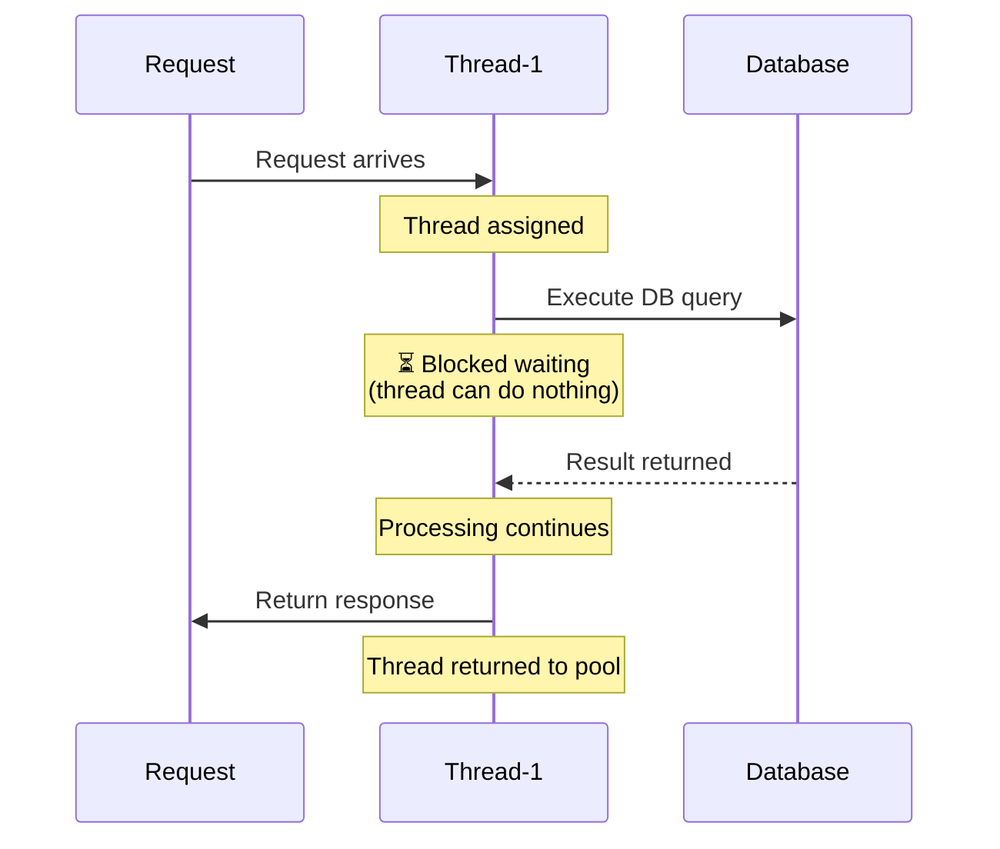

The characteristics of this model are clear:

-   One thread owns each request **from start to finish**
-   On DB or external API calls, the thread **waits in a blocking state**
-   Concurrent request count = limited by thread pool size (usually 200)

This is exactly why ThreadLocal works perfectly here. The thread never changes.

### Spring WebFlux: Event Loop

WebFlux takes a completely different approach. In the **event loop** model, a small number of threads (usually as many as there are CPU cores) handle thousands of requests **asynchronously**.

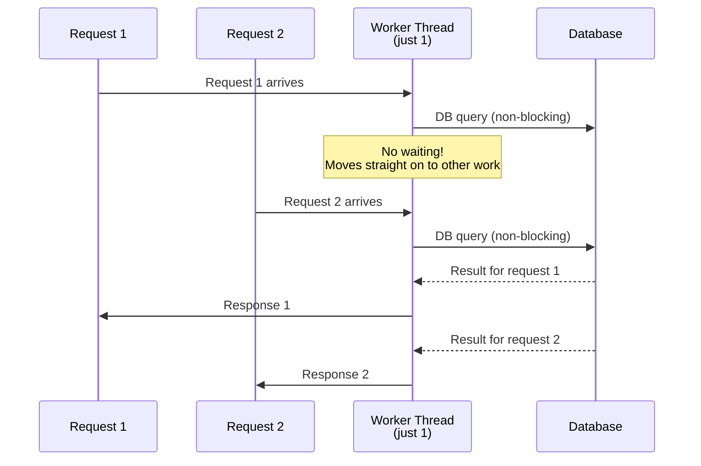

Key differences:

| Aspect | Spring MVC | Spring WebFlux |
| --- | --- | --- |
| Threading model | Thread-per-Request | Event Loop |
| Default thread count | ~200 | CPU core count (4–8) |
| I/O waiting | Blocking (thread occupied) | Non-blocking (callbacks) |
| Concurrent capacity | Limited by pool size | Tens of thousands of connections |
| Thread switches | Almost none | **Happen constantly** |

> **🤔 Why can WebFlux handle more requests with fewer threads?**
> 
> The key is **making use of wait time**. In MVC, while waiting for a DB response, the thread just sits there doing nothing. In WebFlux, after kicking off a DB call, the thread registers a callback — "let me know when the response comes" — and immediately goes off to **handle other requests**. When the response arrives, processing resumes from there.

### Why ThreadLocal Fails in WebFlux

Let's see the problem in code:

```java
@RestController
public class OrderController {
    
    private static final ThreadLocal<String> traceId = new ThreadLocal<>();
    
    @GetMapping("/order/{id}")
    public Mono<Order> getOrder(@PathVariable String id) {
        // 1. Request starts - reactor-http-nio-1 thread
        traceId.set(generateTraceId());
        log.info("[{}] Order lookup started", traceId.get());  // ✅ prints correctly
        
        return orderRepository.findById(id)  // Non-blocking DB call
            .map(order -> {
                // 2. After DB response - reactor-http-nio-3 thread (a different thread!)
                log.info("[{}] Order lookup completed", traceId.get());  // ❌ null!
                return order;
            });
    }
}
```

Output:

```text
[abc123] Order lookup started        // reactor-http-nio-1
[null] Order lookup completed        // reactor-http-nio-3 (no ThreadLocal value!)
```

**When the thread changes, the ThreadLocal value is gone.** This is the fundamental reason you cannot use ThreadLocal directly in WebFlux.

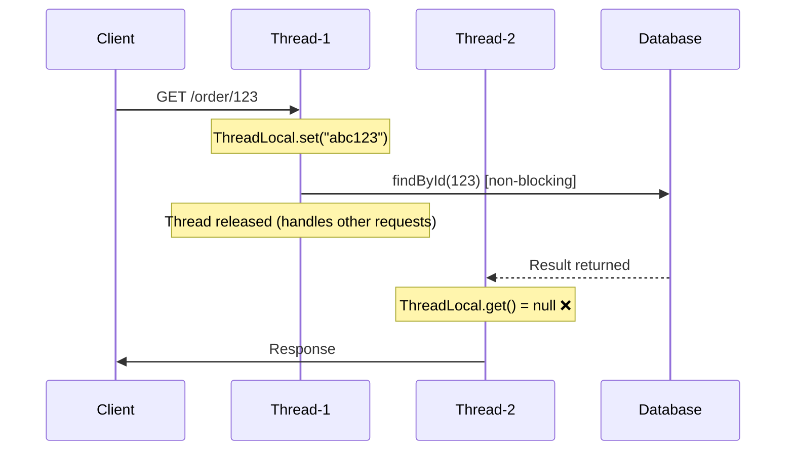

## Reactor Context: The Reactive World's ThreadLocal

### What Is Context?

Project Reactor introduced the concept of a **Context** to solve this problem. Put simply, a Context is an **immutable Map attached to the Subscriber**.

```java
// ThreadLocal approach (❌ fails in WebFlux)
ThreadLocal<String> traceId = new ThreadLocal<>();
traceId.set("abc123");
String value = traceId.get();

// Reactor Context approach (✅ works in WebFlux)
Mono.just("data")
    .contextWrite(ctx -> ctx.put("traceId", "abc123"))  // store in Context
    .flatMap(data -> 
        Mono.deferContextual(ctx -> {                    // read from Context
            String traceId = ctx.get("traceId");
            return Mono.just(data + " with " + traceId);
        })
    );
```

Key differences:

| Aspect | ThreadLocal | Reactor Context |
| --- | --- | --- |
| Bound to | Thread | Subscriber |
| On thread switch | Value lost | **Value kept** ✅ |
| Data structure | Mutable | Immutable |
| Propagation direction | None | Bottom → Top |

### Context Propagation Direction: Bottom-Up

The most important — and most confusing — concept in Reactor Context is its **propagation direction**. Context propagates **from the bottom up**.

```java
Mono.deferContextual(ctx -> {
        // 3. What do we read here? → "World" (the nearest contextWrite)
        log.info("message = {}", ctx.get("message"));
        return Mono.just("result");
    })
    .contextWrite(ctx -> ctx.put("message", "World"))   // 2. second write
    .contextWrite(ctx -> ctx.put("message", "Hello"))   // 1. first write
    .subscribe();
```

Output: `message = World`

Why "World" and not "Hello"?

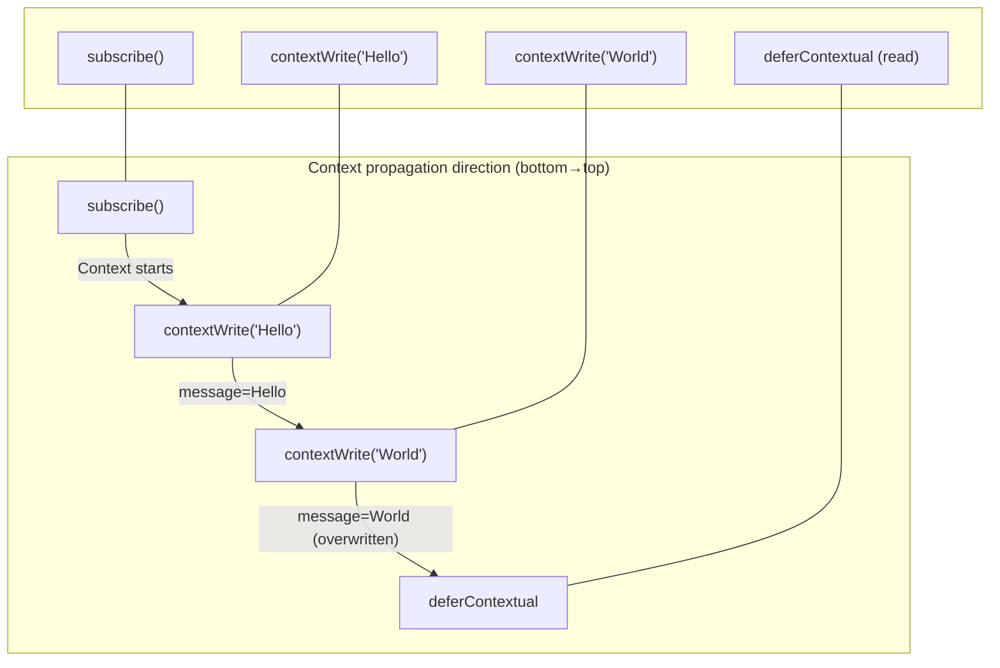

**The rule**: starting from `subscribe()`, the Context travels upward, and each `contextWrite` modifies it along the way. A reading operator (`deferContextual`) sees the value from the `contextWrite` **immediately below it**.

> **🤔 Why was it designed this way?**
> 
> To match the subscription flow of Reactive Streams. When you call `subscribe()`, the subscription signal propagates **from the bottom up**. The Context rides along with this flow, so no matter how often the thread changes, the Context stays with the Subscriber.

### Context Read/Write API

**Writing: `contextWrite()`**

```java
// Option 1: modify with a Function
.contextWrite(ctx -> ctx.put("key", "value"))

// Option 2: merge a ContextView
.contextWrite(Context.of("key1", "value1", "key2", "value2"))
```

**Reading: `deferContextual()` or `transformDeferredContextual()`**

```java
// Option 1: Mono.deferContextual (most common)
Mono.deferContextual(ctx -> {
    String traceId = ctx.get("traceId");
    return someAsyncOperation(traceId);
});

// Option 2: Flux.deferContextual
Flux.deferContextual(ctx -> {
    return Flux.fromIterable(getItems(ctx.get("userId")));
});

// Option 3: transformDeferredContextual (mid-chain)
flux.transformDeferredContextual((original, ctx) -> {
    String prefix = ctx.get("prefix");
    return original.map(item -> prefix + item);
});
```

### Hands-on Example: Propagating traceId in WebFlux

```java
@RestController
@RequiredArgsConstructor
public class OrderController {
    
    private final OrderRepository orderRepository;
    private final PaymentClient paymentClient;
    
    @GetMapping("/order/{id}")
    public Mono<OrderResponse> getOrder(@PathVariable String id) {
        String traceId = generateTraceId();
        
        return orderRepository.findById(id)
            .flatMap(order -> paymentClient.getPaymentStatus(order.getPaymentId())
                .map(payment -> new OrderResponse(order, payment))
            )
            .transformDeferredContextual((mono, ctx) -> 
                mono.doOnNext(response -> 
                    log.info("[{}] Order lookup completed: {}", ctx.get("traceId"), response)
                )
            )
            .contextWrite(ctx -> ctx.put("traceId", traceId));  // set the Context at the very bottom
    }
}
```

Now the traceId survives no matter how often the thread changes!

## How Reactor Context Works Internally

Let's go beyond the beginner level and look inside at **how** the Context survives thread switches.

### The Subscriber Chain and Context

When you chain operators in Reactor, a **Subscriber chain** is built internally. Each operator creates its own Subscriber, and these Subscribers are linked to one another.

```java
Flux.just(1, 2, 3)           // FluxArray
    .map(i -> i * 2)          // FluxMap (with a MapSubscriber inside)
    .filter(i -> i > 2)       // FluxFilter (with a FilterSubscriber inside)
    .subscribe(System.out::println);  // LambdaSubscriber
```

> **🤔 What are FluxMap and FluxFilter?**
> 
> In Reactor, **every operator call creates a new Publisher**. Calling `.map()` creates a `FluxMap` that wraps the original Flux, and calling `.filter()` creates a `FluxFilter` that wraps that in turn.
> 
> ```text
> FluxFilter ─wraps→ FluxMap ─wraps→ FluxArray
> ```
> 
> Then, when you call `subscribe()`, each of these Publishers creates its own Subscriber. The Subscriber chain is built **at subscription time**, linked in the **opposite direction** of the data flow.

The internal structure:

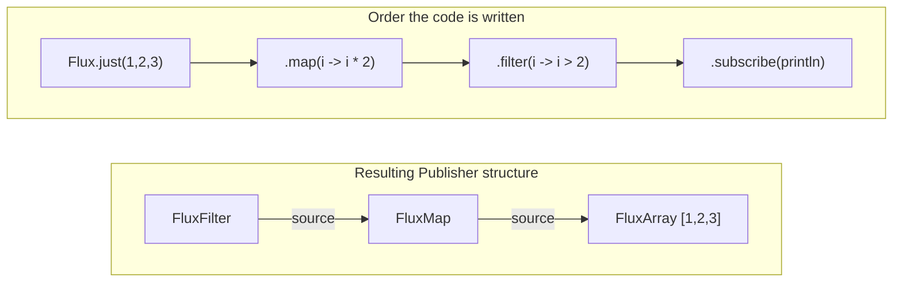

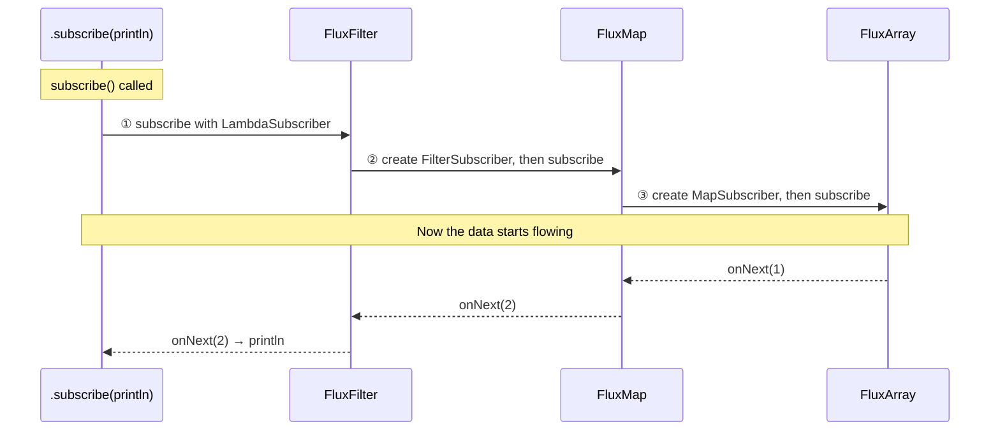

**The key point**: calling `subscribe()` creates the Subscribers **in sequence**, building up the chain. The `LambdaSubscriber` is created first, then the `FilterSubscriber`, then the `MapSubscriber`.

### CoreSubscriber and currentContext()

Every Subscriber in Reactor implements the `CoreSubscriber` interface, which carries the Context-related method:

```java
public interface CoreSubscriber<T> extends Subscriber<T> {
    
    // returns the current Subscriber's Context
    default Context currentContext() {
        return Context.empty();
    }
}
```

Looking at an operator's Subscriber implementation:

```java
// MapSubscriber inside FluxMap (simplified)
class MapSubscriber<T, R> implements CoreSubscriber<T> {
    
    final CoreSubscriber<? super R> actual;  // the next Subscriber (downstream)
    final Function<T, R> mapper;
    
    @Override
    public Context currentContext() {
        // returns the downstream Subscriber's Context as-is
        return actual.currentContext();
    }
    
    @Override
    public void onNext(T t) {
        R result = mapper.apply(t);
        actual.onNext(result);  // pass the result downstream
    }
}
```

**Context propagates along the Subscriber chain.** Each Subscriber references its downstream's Context, and only the `contextWrite` operator modifies it.

Let's see how the Context propagates in real code:

```java
Flux.just(1, 2, 3)
    .map(i -> i * 2)
    .filter(i -> i > 2)
    .contextWrite(ctx -> ctx.put("traceId", "abc"))  // usually placed at the very bottom of the chain
    .subscribe(System.out::println);
```

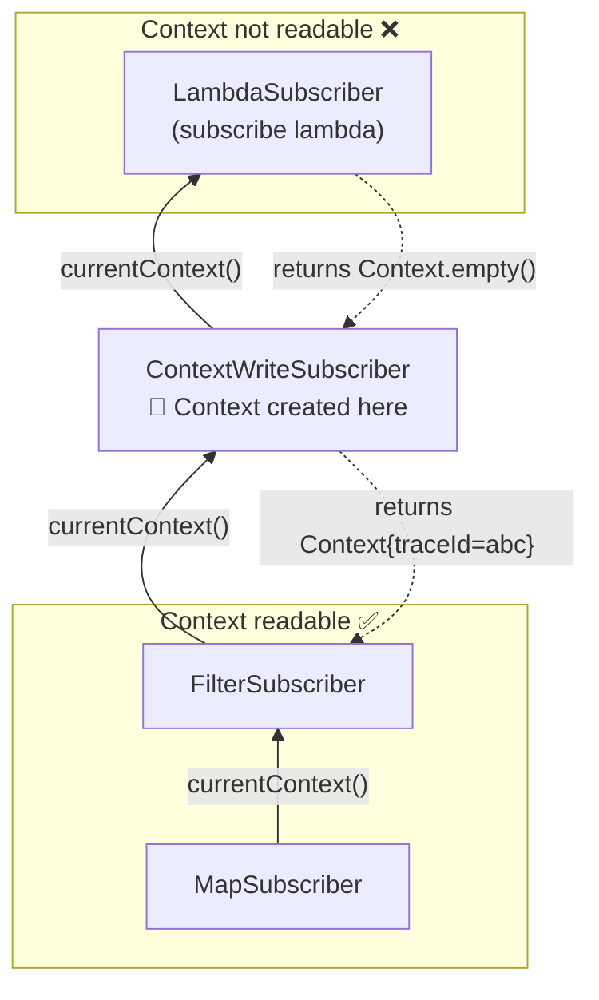

> **⚠️ Important: the subscribe lambda has no Context!**
> 
> ```java
> Flux.just(1, 2, 3)
>     .doOnNext(v -> {
>         // ✅ above contextWrite → Context available
>         log.info("[{}]", MDC.get("traceId"));
>     })
>     .contextWrite(ctx -> ctx.put("traceId", "abc"))
>     .subscribe(v -> {
>         // ❌ below contextWrite → no Context!
>         log.info("[{}]", MDC.get("traceId"));  // null
>     });
> ```
> 
> `contextWrite()` must always be placed **below the operators that need logging or Context access**.

> **🤔 Why does contextWrite have to sit low in the chain?**
> 
> Context propagates **from the bottom up**. Calling `currentContext()` asks the downstream Subscriber (the one below).
> 
> -   `MapSubscriber.currentContext()` → asks `FilterSubscriber`
> -   `FilterSubscriber.currentContext()` → asks `ContextWriteSubscriber`
> -   `ContextWriteSubscriber.currentContext()` → **creates the Context and returns it here!**
> 
> So **only the operators above** `contextWrite()` can read the Context. The operators below it can't access it because the Context hasn't been created yet at that point.

### Context Implementations: The Optimization Secret

For performance, Reactor's Context uses **different implementations depending on size**:

| Size | Implementation | Internal structure |
| --- | --- | --- |
| 0 entries | `Context0` | Singleton (INSTANCE) |
| 1 entry | `Context1` | Single key-value fields |
| 2 entries | `Context2` | 2 pairs of key-value fields |
| 3 entries | `Context3` | 3 pairs of key-value fields |
| 4 entries | `Context4` | 4 pairs of key-value fields |
| 5 entries | `Context5` | 5 pairs of key-value fields |
| 6+ entries | `ContextN` | `Map<Object, Object>` |

```java
// Context1 implementation (simplified)
final class Context1 implements CoreContext {
    final Object key;
    final Object value;
    
    @Override
    public <T> T get(Object key) {
        if (this.key.equals(key)) {
            return (T) this.value;
        }
        throw new NoSuchElementException();
    }
    
    @Override
    public Context put(Object key, Object value) {
        // immutable! returns a new Context
        if (this.key.equals(key)) {
            return new Context1(key, value);
        }
        return new Context2(this.key, this.value, key, value);
    }
}
```

> **🤔 Why go to all this trouble instead of just using a Map?**
> 
> **Performance.** The keys used in tracing are mostly `traceId`, `spanId`, and `baggage` — rarely more than five. In that range, dedicated fields are much faster than a HashMap:
> 
> -   Minimal object allocation
> -   Fewer equals() calls
> -   Cache-friendly memory layout

### Why Context Survives Thread Switches

Now we can answer the core question. **Why does the Context survive even when the thread changes?**

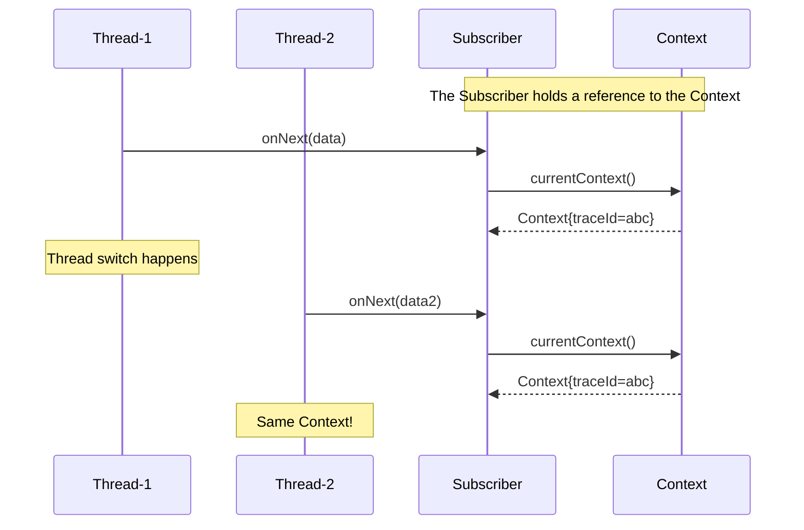

**The answer**: the Context is attached to the **Subscriber object**, not to the Thread.

1.  The Subscriber chain is created at `subscribe()` time
2.  Each Subscriber holds a reference to its downstream Subscriber
3.  The Context is looked up along this reference chain
4.  Even if the thread changes, **the Subscriber objects are the same** → so is the Context

If ThreadLocal "stores data on the thread", Reactor Context "stores data on the subscription chain".

## Micrometer Context Propagation: A Bridge Between Two Worlds

Reactor Context looks perfect, but there's one problem. **Existing libraries still use ThreadLocal.**

-   SLF4J MDC → ThreadLocal
-   Micrometer Tracing → ThreadLocal
-   Spring Security → ThreadLocal

To use these in WebFlux, we need a bridge between **Reactor Context ↔ ThreadLocal**. That bridge is the **Micrometer Context Propagation** library.

### How It Works

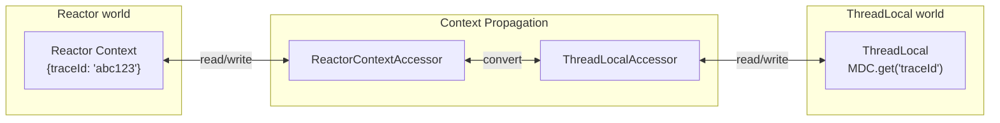

The core interfaces:

```java
// interface for accessing ThreadLocal values
public interface ThreadLocalAccessor<V> {
    Object key();                    // the key to use in the Context
    V getValue();                    // read the value from ThreadLocal
    void setValue(V value);          // write a value to ThreadLocal
    void setValue();                 // clear the ThreadLocal value (to null)
}

// interface for accessing Map-like contexts such as Reactor Context
public interface ContextAccessor<READ, WRITE> {
    Class<? extends READ> readableType();
    Class<? extends WRITE> writeableType();
    V readValue(READ container, Object key);
    WRITE writeValues(Map<Object, Object> values, WRITE container);
}
```

Micrometer provides `ObservationThreadLocalAccessor`, and Reactor provides `ReactorContextAccessor`. Working together, they propagate context in both directions.

### Two Modes: Default vs Automatic

Reactor Core supports Context Propagation since 3.5.0, in two modes:

**1\. Default mode (limited restoration)**

ThreadLocal is restored only in specific operators (`handle`, `tap`):

```java
flux.handle((item, sink) -> {
    // ThreadLocal is restored only inside this block
    log.info("traceId = {}", MDC.get("traceId"));  // ✅ works
    sink.next(transform(item));
});
```

**2\. Automatic mode (full restoration)**

ThreadLocal is automatically restored in every operator:

```java
// enable at application startup
Hooks.enableAutomaticContextPropagation();

flux.map(item -> {
    // ThreadLocal restored in every operator!
    log.info("traceId = {}", MDC.get("traceId"));  // ✅ works
    return transform(item);
});
```

> **🤔 Automatic mode looks great — why is Default the default?**
> 
> **Performance.** Automatic mode saves/restores ThreadLocal **before and after every operator execution**. That overhead can be non-negligible.
> 
> The official docs also recommend that "if maximum scalability and performance is the goal, consider an explicit approach that doesn't rely on ThreadLocal." Automatic mode is for when migrating existing code or convenience takes priority.

### The Role of contextCapture()

`contextCapture()` **captures the current thread's ThreadLocal values into the Reactor Context**:

```java
// with a value already in ThreadLocal
MDC.put("traceId", "abc123");

Mono.just("data")
    .contextCapture()  // capture current ThreadLocal values into the Context
    .flatMap(data -> someAsyncOperation())
    .subscribe();
```

It's mainly used **when starting a reactive chain from imperative code**:

```java
@GetMapping("/order")
public Mono<Order> createOrder(@RequestBody OrderRequest request) {
    // traceId is set in ThreadLocal at the controller level
    
    return orderService.createOrder(request)
        .contextCapture();  // ThreadLocal → Reactor Context
}
```

> **⚠️ subscribe() vs block()**
> 
> ```java
> // block() - waits on the current thread until completion
> Order result = orderService.createOrder(request)
>     .contextCapture()
>     .block();  // runs on the same thread, Context naturally preserved
> 
> // subscribe() - runs asynchronously on another thread
> orderService.createOrder(request)
>     .contextCapture()  // required! without it, the Context is lost
>     .subscribe(result -> log.info("done"));
> ```
> 
> `block()` occupies the current thread, so Context is less of an issue — but `subscribe()` may run on a different thread, making `contextCapture()` essential.
> 
> **🚨 Important**: using `block()` in WebFlux **blocks an event loop thread**. WebFlux's core advantage is handling thousands of requests with a handful of threads (usually 4–8) — block one of those and total throughput plummets. At that point, **using WebFlux is essentially pointless**.
> 
> ```java
> // ❌ Never do this: block() on an event loop thread
> @GetMapping("/order/{id}")
> public Mono<Order> getOrder(@PathVariable String id) {
>     Order order = orderRepository.findById(id).block();  // blocks the event loop thread!
>     return Mono.just(order);
> }
> 
> // ✅ The right way: keep the reactive chain
> @GetMapping("/order/{id}")
> public Mono<Order> getOrder(@PathVariable String id) {
>     return orderRepository.findById(id);  // Non-blocking
> }
> ```
> 
> Reserve `block()` for test code, or for terminating a reactive chain from imperative code.

## Spring Boot 3 + WebFlux Setup in Practice

Enough theory. Let's actually set up WebFlux + tracing in Spring Boot 3.

### Dependencies

```xml
<!-- pom.xml -->
<dependencies>
    <!-- WebFlux -->
    <dependency>
        <groupId>org.springframework.boot</groupId>
        <artifactId>spring-boot-starter-webflux</artifactId>
    </dependency>
    
    <!-- Actuator (auto-configures Observability) -->
    <dependency>
        <groupId>org.springframework.boot</groupId>
        <artifactId>spring-boot-starter-actuator</artifactId>
    </dependency>
    
    <!-- Micrometer Tracing + OpenTelemetry Bridge -->
    <dependency>
        <groupId>io.micrometer</groupId>
        <artifactId>micrometer-tracing-bridge-otel</artifactId>
    </dependency>
    
    <!-- OpenTelemetry OTLP Exporter (standard protocol) -->
    <dependency>
        <groupId>io.opentelemetry</groupId>
        <artifactId>opentelemetry-exporter-otlp</artifactId>
    </dependency>
    
    <!-- Context Propagation (pulled in automatically, but stated explicitly) -->
    <dependency>
        <groupId>io.micrometer</groupId>
        <artifactId>context-propagation</artifactId>
    </dependency>
</dependencies>
```

> **🤔 Why the OTLP exporter?**
> 
> OTLP (OpenTelemetry Protocol) is OpenTelemetry's **standard transport protocol**. We used to need a different exporter per backend — Zipkin, Jaeger, and so on — but the ecosystem is converging on OTLP.
> 
> -   **Jaeger**: native OTLP support (ports 4317/4318)
> -   **Zipkin**: integrates via the OTLP Collector
> -   **Grafana Tempo**: native OTLP support
> -   **AWS X-Ray, Datadog, etc.**: integrate via the OTLP Collector
> 
> With OTLP, switching backends requires no application code changes.

### application.yml

```yaml
# application.yml
spring:
  application:
    name: order-service

  # 🔑 The key setting: enable Automatic Context Propagation
  reactor:
    context-propagation: auto   # Spring Boot 3.2+

management:
  tracing:
    sampling:
      probability: 1.0  # 100% sampling in development
    propagation:
      type: w3c         # use W3C Trace Context
    baggage:
      enabled: true
      correlation:
        enabled: true
        fields:
          - user-id
          - tenant-id

  # OTLP exporter settings (send to Jaeger, Tempo, a Collector, etc.)
  otlp:
    tracing:
      endpoint: http://localhost:4318/v1/traces  # OTLP HTTP endpoint
    metrics:
      export:
        enabled: true
        endpoint: http://localhost:4318/v1/metrics

logging:
  pattern:
    console: "%d{HH:mm:ss.SSS} [%X{traceId:-},%X{spanId:-}] [%thread] %-5level %logger{36} - %msg%n"
```

> **🤔 OTLP port numbers**
> 
> -   **4317**: gRPC protocol
> -   **4318**: HTTP protocol (Spring Boot default)
> 
> Most OTLP receivers (Jaeger, Tempo, OTel Collector) support both ports. Spring Boot uses HTTP by default, so you append the `/v1/traces` path to port 4318.

> **🤔 What `spring.reactor.context-propagation=auto` does**
> 
> This setting, added in Spring Boot 3.2, internally calls `Hooks.enableAutomaticContextPropagation()`. On earlier versions you had to call it yourself:
> 
> ```java
> // Spring Boot 3.1 and below
> @SpringBootApplication
> public class MyApplication {
>     public static void main(String[] args) {
>         Hooks.enableAutomaticContextPropagation();  // call it directly
>         SpringApplication.run(MyApplication.class, args);
>     }
> }
> ```

### logback-spring.xml

```xml
<?xml version="1.0" encoding="UTF-8"?>
<configuration>
    <appender name="CONSOLE" class="ch.qos.logback.core.ConsoleAppender">
        <encoder>
            <pattern>%d{HH:mm:ss.SSS} [%X{traceId:-},%X{spanId:-}] [%thread] %-5level %logger{36} - %msg%n</pattern>
        </encoder>
    </appender>
    
    <root level="INFO">
        <appender-ref ref="CONSOLE"/>
    </root>
</configuration>
```

### Real Code Example

```java
@RestController
@RequiredArgsConstructor
@Slf4j
public class OrderController {
    
    private final OrderRepository orderRepository;
    private final InventoryClient inventoryClient;
    private final PaymentClient paymentClient;
    
    @PostMapping("/orders")
    public Mono<OrderResponse> createOrder(@RequestBody OrderRequest request) {
        log.info("Order creation started: {}", request.getProductId());
        
        return orderRepository.save(new Order(request))
            .flatMap(order -> {
                log.info("Order saved: {}", order.getId());
                
                // decrease inventory + process payment in parallel
                return Mono.zip(
                    inventoryClient.decreaseStock(order.getProductId(), order.getQuantity())
                        .doOnSuccess(v -> log.info("Inventory decreased")),
                    paymentClient.processPayment(order.getId(), order.getTotalAmount())
                        .doOnSuccess(v -> log.info("Payment processed"))
                ).map(tuple -> new OrderResponse(order, tuple.getT1(), tuple.getT2()));
            })
            .doOnSuccess(response -> log.info("Order creation completed: {}", response.getOrderId()))
            .doOnError(e -> log.error("Order creation failed", e));
    }
}
```

Sample output:

```text
14:23:45.123 [abc123def456,111aaa] [reactor-http-nio-1] INFO  c.e.OrderController - Order creation started: PROD-001
14:23:45.234 [abc123def456,222bbb] [reactor-http-nio-2] INFO  c.e.OrderController - Order saved: ORD-123
14:23:45.345 [abc123def456,333ccc] [reactor-http-nio-3] INFO  c.e.OrderController - Inventory decreased
14:23:45.345 [abc123def456,444ddd] [reactor-http-nio-4] INFO  c.e.OrderController - Payment processed
14:23:45.456 [abc123def456,222bbb] [reactor-http-nio-2] INFO  c.e.OrderController - Order creation completed: ORD-123
```

**The thread keeps changing, but the traceId (`abc123def456`) stays consistent** throughout!

## Caveats and Troubleshooting

### 1\. Empty Context

**Symptom**: `MDC.get("traceId")` returns null

**Cause and fix**:

```java
// ❌ Problem: subscribing outside the reactive chain
new Thread(() -> {
    orderService.createOrder(request)
        .subscribe();  // subscribed on a new thread → no Context
}).start();

// ✅ Fix: use contextCapture()
new Thread(() -> {
    orderService.createOrder(request)
        .contextCapture()
        .subscribe();
}).start();
```

### 2\. Context Lost Inside flatMap

**Symptom**: Context lost when creating a new Publisher inside `flatMap`

```java
// ❌ Problem: using an external Publisher directly
.flatMap(data -> externalLibrary.getData())  // external library doesn't support Context

// ✅ Fix: Mono.defer + contextCapture
.flatMap(data -> Mono.defer(() -> externalLibrary.getData()).contextCapture())
```

### 3\. Performance Considerations

Automatic Context Propagation is convenient but has a performance cost:

```java
// this happens in every operator
// 1. before the operator runs: Context → restore ThreadLocal
// 2. run user code
// 3. after the operator runs: ThreadLocal → restore previous state
```

**Default mode + handle()/tap() example**:

Instead of Automatic mode, you can use `handle()` or `tap()` in Default mode to restore ThreadLocal **only where needed**. Each of the two operators restores ThreadLocal **independently**.

| Operator | Role | Data transformation |
| --- | --- | --- |
| `handle()` | transform + filter + logging | ✅ transform/filter via `sink.next()` |
| `tap()` | side effects only (logging, metrics) | ❌ data passes through unchanged |

```java
// Default mode (no spring.reactor.context-propagation setting)

@GetMapping("/orders")
public Flux<Order> getOrders() {
    return orderRepository.findAll()
        // handle(): when you need transformation + filtering + logging together
        .handle((order, sink) -> {
            // ✅ ThreadLocal is restored inside this block
            log.info("[{}] Validating order: {}", MDC.get("traceId"), order.getId());
            
            if (order.isValid()) {
                sink.next(order);  // pass through valid orders only
            }
            // not calling sink.next() filters the item out
        })
        // tap(): when you only log and let data pass through untouched
        .tap(signal -> {
            if (signal.isOnNext()) {
                // ✅ ThreadLocal is restored inside this block
                Order order = (Order) signal.get();
                log.info("[{}] Order passed: {}", MDC.get("traceId"), order.getId());
            }
        })
        .doOnNext(order -> {
            // ❌ ThreadLocal NOT restored here! (in Default mode)
            log.info("Processing done: {}", order.getId());  // no traceId
        });
}
```

> **🤔 What are sink and signal?**
> 
> | Parameter | Type | Role |
> | --- | --- | --- |
> | `sink` | `SynchronousSink<T>` | the outlet that **emits** data to the next operator |
> | `signal` | `Signal<T>` | an info object for **reading** the current event |
> 
> **sink** (used in handle):
> 
> ```java
> sink.next(value);         // pass a value to the next operator
> sink.error(exception);    // raise an error
> // not calling sink.next() → that item is filtered out
> ```
> 
> **signal** (used in tap):
> 
> ```java
> signal.isOnNext()         // did data flow through?
> signal.isOnError()        // did an error occur?
> signal.isOnComplete()     // did the stream complete?
> signal.get()              // get the actual value for onNext
> signal.getThrowable()     // get the exception for onError
> ```

> **🤔 handle() vs tap() — when to use which?**
> 
> -   **handle()**: when you need to transform data or filter it conditionally. `map()` + `filter()` + ThreadLocal restoration in one shot.
> -   **tap()**: when you don't touch the data and only log or record metrics. Data flows straight through to the next operator.
> 
> Both restore ThreadLocal, so pick whichever fits your need.

**Recommendations**:

| Situation | Recommended mode | Why |
| --- | --- | --- |
| Typical service | Automatic | convenience first, performance is fine |
| High-performance service (high TPS) | Default + handle()/tap() | restore only where needed |
| Mid-migration | Automatic | fast transition, optimize later |
| Service with little logging | Default | minimize overhead |

### 4\. traceId Lost in a Library's Internal Logging

**Example symptom**: your application code's logs show the traceId just fine, but **DEBUG logs from libraries** — the Reactive Mongo Client, R2DBC drivers, and so on — have an empty traceId

```text
14:23:45.123 [abc123,111aaa] INFO  c.e.OrderService - Order lookup started      // ✅ fine
14:23:45.124 [abc123,111aaa] DEBUG c.m.r.c.internal - Executing query           // ✅ fine (inside the chain)
14:23:45.125 [,]             DEBUG c.m.r.c.internal - Socket connected          // ❌ lost (outside the chain)
14:23:45.126 [,]             DEBUG c.m.r.c.internal - Sending bytes             // ❌ lost (outside the chain)
14:23:45.234 [abc123,222bbb] INFO  c.e.OrderService - Order lookup completed    // ✅ fine
```

Same library — so why do **some logs have the traceId and others don't**?

**Cause**: depending on the library's internal implementation, **where the log is emitted** can differ.

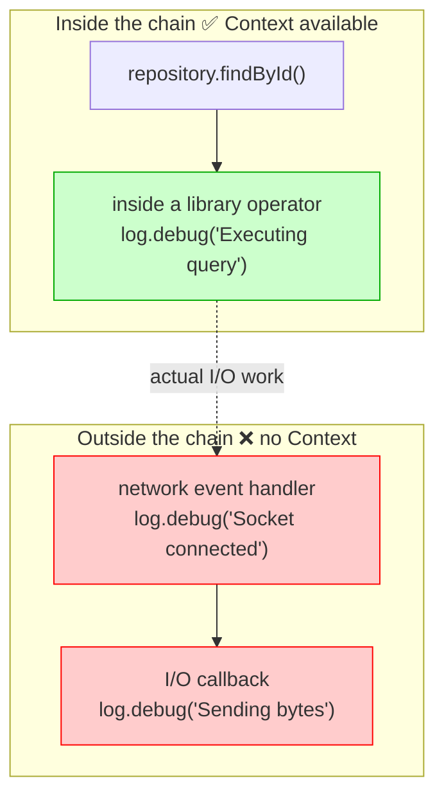

When a library logs internally:

1.  The log runs in **a separate callback or event handler**, not in a reactive-chain operator
2.  At that point it isn't connected to the Reactor Context
3.  Automatic Context Propagation also only works **at reactive operator boundaries**

**Fixes**:

1.  **Adjust the library's log level** (a stopgap) `logging: level: com.mongodb.reactivestreams: WARN io.r2dbc: WARN`
2.  **Use a Java Agent** (the fundamental fix) The OpenTelemetry Java Agent instruments library internals through **bytecode manipulation**. Even if a library isn't aware of Context Propagation, the Agent injects the Context by force. `java -javaagent:opentelemetry-javaagent.jar \ -Dotel.service.name=order-service \ -jar myapp.jar`

> **📌 Java Agent vs Library Instrumentation**
> 
> This problem stems from **a difference in instrumentation approach**. The library approach (Micrometer, Spring Boot auto-configuration) only works at reactive chain boundaries, while the Java Agent approach inserts instrumentation everywhere at the bytecode level.
> 
> This topic gets its own post later in the series — **"Comparing Instrumentation Approaches: How Java Agent vs Library Works"**. We'll look at how the Agent propagates the traceId all the way into library internals, and compare the trade-offs of each approach.

### 5\. Setting the Context in Tests

```java
@Test
void testWithContext() {
    StepVerifier.create(
        orderService.createOrder(request)
            .contextWrite(ctx -> ctx.put("traceId", "test-trace-id"))
    )
    .expectNextMatches(response -> response.getOrderId() != null)
    .verifyComplete();
}
```

## MVC vs WebFlux Context Propagation Compared

Summarizing Part 2 (MVC) and Part 3 (WebFlux):

| Aspect | Spring MVC | Spring WebFlux |
| --- | --- | --- |
| Threading model | Thread-per-Request | Event Loop |
| Context storage | ThreadLocal | Reactor Context |
| On thread switch | Needs extra handling (`@Async`, etc.) | **Kept automatically** |
| MDC integration | Works out of the box | Requires Context Propagation |
| Setup complexity | Low | Medium |
| Performance overhead | Low | Medium (Automatic mode) |

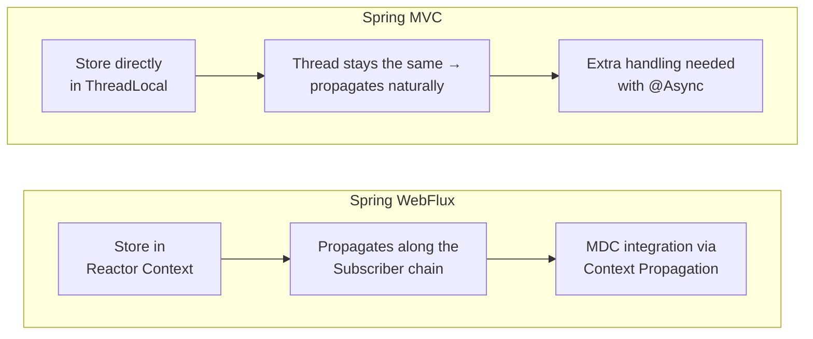

## Conclusion

In WebFlux's event loop model, you can't use ThreadLocal directly. Instead, **Reactor Context** propagates data along the Subscriber chain.

The key points:

1.  **Reactor Context is bound to the Subscriber**: even when threads change, the subscription chain stays intact, so the Context does too.
2.  **Bottom-up propagation**: Context starts at `subscribe()` and propagates upward. Always place `contextWrite()` low in the chain.
3.  **Bridge with Context Propagation**: to integrate with ThreadLocal-based libraries like MDC, use Micrometer Context Propagation.
4.  **Spring Boot 3.2+ makes it simple**: one line — `spring.reactor.context-propagation=auto` — configures it automatically.

In the next post we'll cover Context Propagation in **Kotlin coroutines** — how `CoroutineContext`, Reactor Context, and ThreadLocal work together.

## References

-   [Context Propagation with Project Reactor 1 – The Basics](https://spring.io/blog/2023/03/28/context-propagation-with-project-reactor-1-the-basics/)
-   [Context Propagation with Project Reactor 2 – The bumpy road of Spring Cloud Sleuth](https://spring.io/blog/2023/03/29/context-propagation-with-project-reactor-2-the-bumpy-road-of-spring-cloud/)
-   [Context Propagation with Project Reactor 3 – Unified Bridging](https://spring.io/blog/2023/03/30/context-propagation-with-project-reactor-3-unified-bridging-between-reactive/)
-   [Reactor Core Reference – Adding a Context to a Reactive Sequence](https://projectreactor.io/docs/core/release/reference/advancedFeatures/context.html)
-   [Reactor Core Reference – Context-Propagation Support](https://projectreactor.io/docs/core/release/reference/advanced-contextPropagation.html)
-   [Micrometer Context Propagation Documentation](https://docs.micrometer.io/context-propagation/reference/)
-   [Spring Boot 3.2 Release Notes](https://github.com/spring-projects/spring-boot/wiki/Spring-Boot-3.2-Release-Notes)
