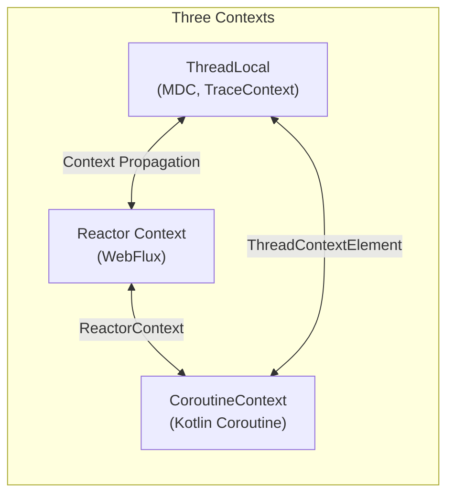
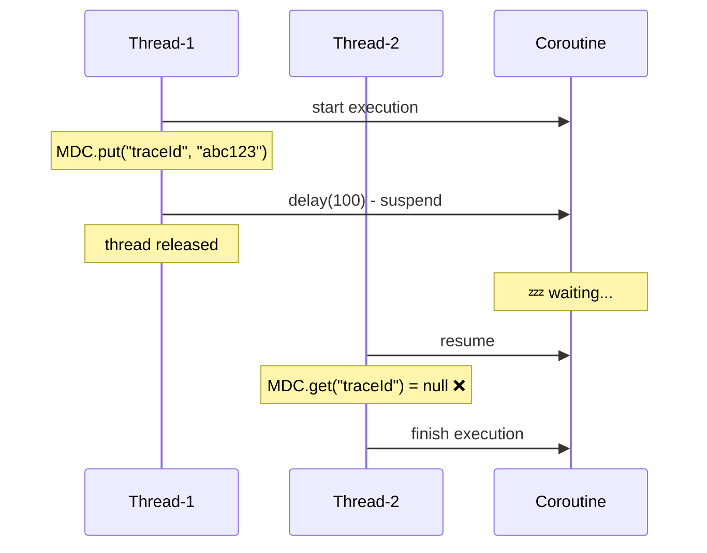
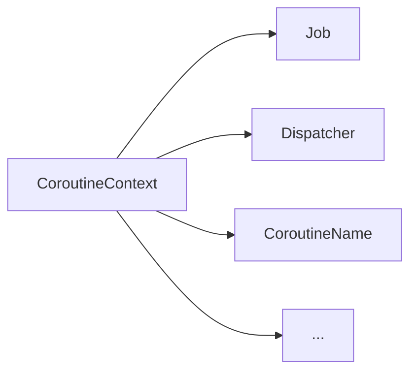
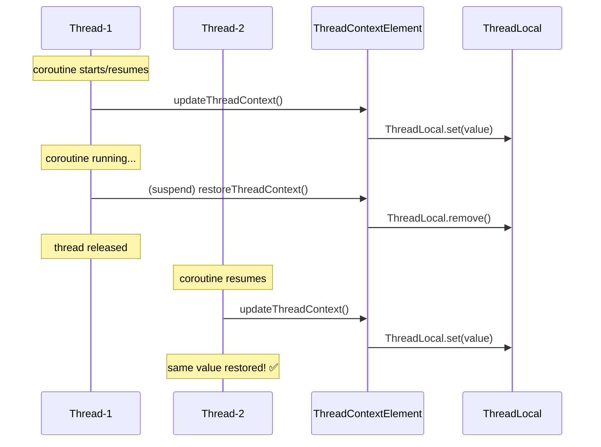
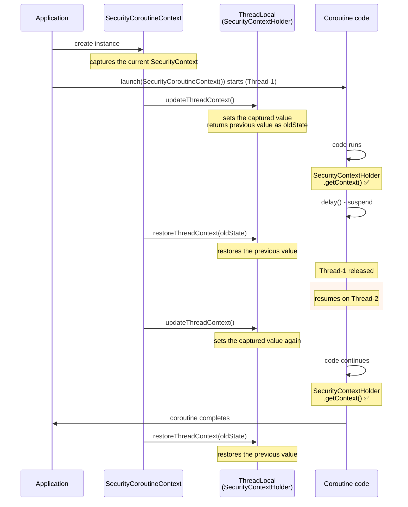
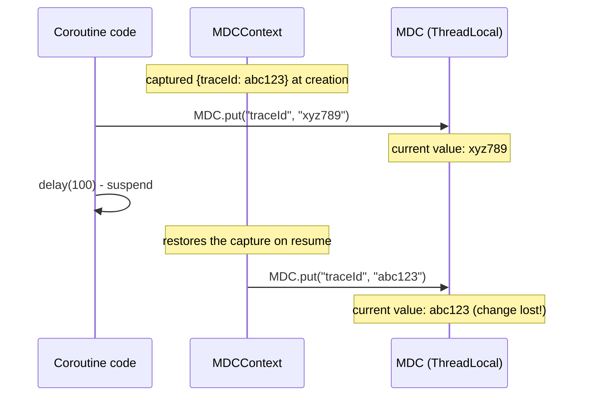
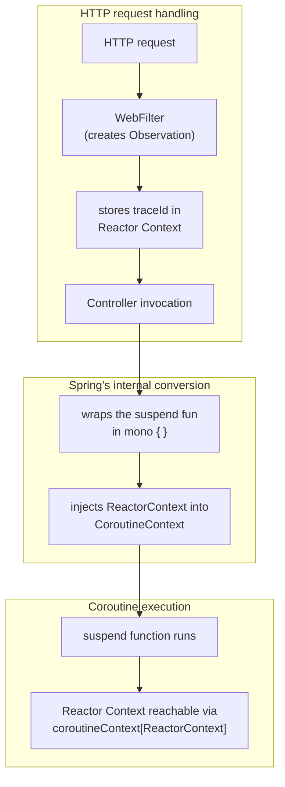
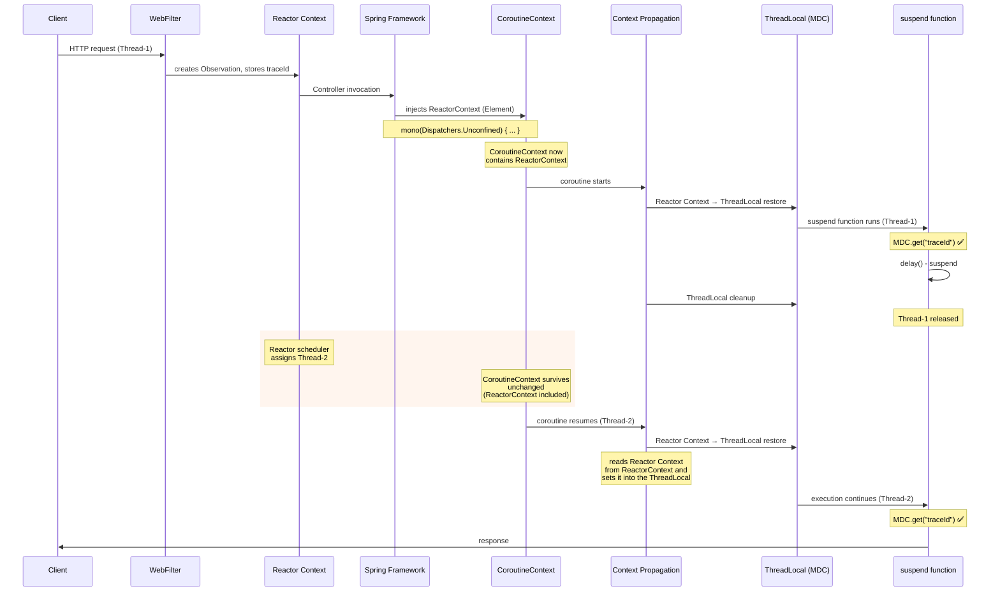
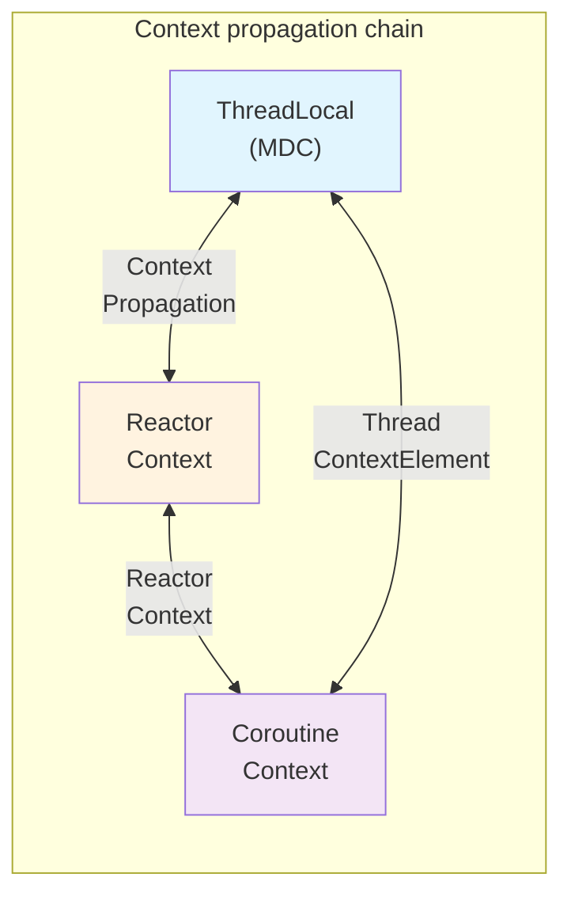

> **Understanding Tracing series**
> 
> 1.  [From the History of Observability to the Spring Ecosystem (feat. OTel)](/en/tracing-1-observability-spring-otel/)
> 2.  [ThreadLocal and MDC](/en/tracing-2-threadlocal-mdc/)
> 3.  [Reactor Context and Asynchronous Environments](/en/tracing-3-reactor-context-webflux/)
> 4.  **[Kotlin Coroutines and Context Propagation](/en/tracing-4-kotlin-coroutine-context-propagation/) ← you are here**
> 5.  [Java Agent vs Library Instrumentation](/en/tracing-5-java-agent-vs-library-instrumentation/)

## Introduction

In the [previous post](/en/tracing-3-reactor-context-webflux/) we looked at how Reactor Context keeps the traceId alive in WebFlux's event loop environment. It solved the thread-switching problem by binding a Context to the Subscriber chain.

But if you're using Kotlin, things get a bit more complicated. Kotlin coroutines come with their own context system: **CoroutineContext**. That brings the number of contexts we have to deal with up to three.



Use Kotlin coroutines in Spring WebFlux and all three of these contexts get tangled together. For the traceId to propagate correctly, the **bridges** between them have to be wired up properly.

In this post we'll dig into how CoroutineContext works, and how Spring Boot 3 connects the three contexts seamlessly.

## Why ThreadLocal Doesn't Work in Coroutines

### suspend and Thread Switching

The essence of coroutines is **suspending and resuming**. When a suspend function needs to wait — on I/O, say — it pauses, and once the result is ready it resumes. The problem: **it may resume on a different thread.**

> **🤔 Are coroutines an event loop, like WebFlux?**
> 
> No. Coroutines use a **Dispatcher** that assigns an available thread from a thread pool. When a coroutine resumes after a suspend, if the original thread isn't free, a different thread may be assigned. It's a different mechanism from an event loop, but in the sense that **"the thread can change"**, the ThreadLocal problem is exactly the same.

```kotlin
suspend fun processOrder(orderId: String) {
    // 1️⃣ running on Thread-1
    MDC.put("traceId", "abc123")
    log.info("[${MDC.get("traceId")}] Order processing started")  // ✅ abc123
    
    delay(100)  // suspend point! 💤
    
    // 2️⃣ may resume on Thread-2
    log.info("[${MDC.get("traceId")}] Order processing finished")  // ❌ null!
}
```

Output:

```text
[abc123] Order processing started    // Thread-1
[null] Order processing finished     // Thread-2 (no ThreadLocal value!)
```



### Same Problem as Reactor Context, Different Solution

This is fundamentally the same problem we saw with Reactor in Part 3: the thread changes, and the ThreadLocal value is gone. But the way it's solved is different.

| Environment | Cause of the problem | Solution |
| --- | --- | --- |
| Reactor | thread switches between operators | **Reactor Context** (bound to the Subscriber) |
| Coroutine | thread switches on suspend/resume | **CoroutineContext** (bound to the coroutine) |

Coroutines have their own context system, and it survives for the coroutine's entire lifecycle.

## Understanding CoroutineContext

### A Context Is a Set of Elements

A CoroutineContext is a set of **Elements**. Each Element has a unique **Key**, and you can look up an Element in the context by its Key.

```kotlin
// the main Elements of a CoroutineContext
val context: CoroutineContext = 
    Job() +                          // manages the coroutine's lifecycle
    Dispatchers.IO +                 // decides which thread runs it
    CoroutineName("order-worker")    // a name for debugging

// look up Elements by Key
val job = context[Job]
val dispatcher = context[CoroutineDispatcher]
val name = context[CoroutineName]
```



Each Element can be looked up by its unique Key: `context[Job]`, `context[CoroutineDispatcher]`, `context[CoroutineName]`

### Combining Contexts: the + Operator

Contexts can be combined with the `+` operator. If both sides contain an Element with the same Key, the one on the right overwrites the one on the left.

```kotlin
val base = Dispatchers.Default + CoroutineName("base")
// base = {Dispatcher: Default, CoroutineName: "base"}

val extended = base + Dispatchers.IO
// extended = {Dispatcher: IO, CoroutineName: "base"}
// the Dispatcher was replaced: Default → IO
// CoroutineName stays the same
```

### Inheritance by Child Coroutines

A parent coroutine's context is **inherited** by its children. A child can add or override only the Elements it needs.

```kotlin
launch(Dispatchers.IO + CoroutineName("parent")) {
    // parent context: Dispatchers.IO + CoroutineName("parent")
    
    launch {
        // child context: inherits the parent's (Dispatchers.IO + CoroutineName("parent"))
    }
    
    launch(CoroutineName("child")) {
        // child context: Dispatchers.IO + CoroutineName("child")
        // only CoroutineName is overridden
    }
}
```

Thanks to this inheritance mechanism, a context Element set in the parent propagates automatically to every child coroutine. The same goes for an Element carrying a traceId.

## Connecting ThreadLocal ↔ Coroutines: ThreadContextElement

### Propagating a ThreadLocal with asContextElement()

The Kotlin coroutines library provides an `asContextElement()` extension function that makes a ThreadLocal usable from coroutines.

```kotlin
val traceId = ThreadLocal<String>()

fun main() = runBlocking {
    traceId.set("abc123")
    
    // convert the ThreadLocal into a CoroutineContext Element
    launch(Dispatchers.Default + traceId.asContextElement()) {
        println(traceId.get())  // ✅ abc123
        
        delay(100)  // thread switch happens!
        
        println(traceId.get())  // ✅ abc123 (still there!)
    }
}
```

What `asContextElement()` does:

1.  When the coroutine **resumes** → sets the value into the ThreadLocal
2.  When the coroutine **suspends** → removes the value from the ThreadLocal

### How ThreadContextElement Works Internally

Under the hood, `asContextElement()` implements the `ThreadContextElement` interface.

```kotlin
interface ThreadContextElement<S> : CoroutineContext.Element {
    // called when the coroutine is resumed on a thread
    fun updateThreadContext(context: CoroutineContext): S
    
    // called when the coroutine is suspended on a thread
    fun restoreThreadContext(context: CoroutineContext, oldState: S)
}
```



**The key idea**: a ThreadContextElement stores the value in the CoroutineContext, and restores it into the ThreadLocal every time the thread changes.

### Implementing One Ourselves

To understand what `asContextElement()` does internally, let's build a custom ThreadContextElement by hand. This example keeps Spring Security's SecurityContext alive across a coroutine.

```kotlin
class SecurityCoroutineContext(
    // 1️⃣ capture the SecurityContext at instance-creation time (as the default value)
    private val securityContext: SecurityContext = SecurityContextHolder.getContext()
) : ThreadContextElement<SecurityContext?> {
    
    // 2️⃣ the Key used to find this Element in a CoroutineContext
    companion object Key : CoroutineContext.Key<SecurityCoroutineContext>
    override val key: CoroutineContext.Key<SecurityCoroutineContext> = Key
    
    // 3️⃣ called right before the coroutine runs on a thread
    override fun updateThreadContext(context: CoroutineContext): SecurityContext? {
        val oldContext = SecurityContextHolder.getContext()  // back up the current thread's value
        SecurityContextHolder.setContext(securityContext)  // set the value captured at instance creation
        return oldContext  // return the backup (to restore later)
    }
    
    // 4️⃣ called when the coroutine suspends or completes
    override fun restoreThreadContext(context: CoroutineContext, oldState: SecurityContext?) {
        if (oldState == null) {
            SecurityContextHolder.clearContext()
        } else {
            SecurityContextHolder.setContext(oldState)  // restore the original value
        }
    }
}
```

> **💡 Key points**
> 
> -   Every call to `SecurityCoroutineContext()` **creates a new instance**, capturing the SecurityContext as of that moment.
> -   When the coroutine **resumes** → the captured value is set into the ThreadLocal
> -   When the coroutine **suspends** → the ThreadLocal is restored to its previous value
> -   Even when the thread changes, **the value stored in the CoroutineContext** is restored into the ThreadLocal every time.
> 
> Note: `SecurityContextHolder` is Spring Security's **ThreadLocal-based singleton**. `getContext()` returns the current thread's SecurityContext, and `setContext()` sets it.

Here's the flow:



Usage:

```kotlin
// the current SecurityContext gets captured
launch(SecurityCoroutineContext()) {
    // running on Thread-1
    val userName = SecurityContextHolder.getContext().authentication.name
    log.info("User: $userName")  // ✅ prints correctly
    
    delay(100)  // thread switch happens!
    
    // running on Thread-2 — the ThreadContextElement restored the SecurityContext
    val sameUser = SecurityContextHolder.getContext().authentication.name
    log.info("Still the same user: $sameUser")  // ✅ same value!
}
```

**Without the ThreadContextElement**, `SecurityContextHolder.getContext()` after the `delay()` would return an empty SecurityContext, or throw.

## MDCContext: a Dedicated Solution for SLF4J MDC

### The kotlinx-coroutines-slf4j Library

Using MDC from coroutines is so common that there's an official library for it.

```kotlin
dependencies {
    implementation("org.jetbrains.kotlinx:kotlinx-coroutines-slf4j:1.8.0")
}
```

Usage:

```kotlin
import kotlinx.coroutines.slf4j.MDCContext

MDC.put("traceId", "abc123")

launch(MDCContext()) {
    log.info("Processing started")  // ✅ [abc123] Processing started
    
    delay(100)
    
    log.info("Processing finished")  // ✅ [abc123] Processing finished
}
```

### Careful: MDC.put() Inside a Coroutine Gets Lost

There's an **important trap** here. Even if you change a value with `MDC.put()` inside the coroutine, after the next suspension it gets **restored to the original value**.

```kotlin
MDC.put("traceId", "abc123")

launch(MDCContext()) {
    log.info("[${MDC.get("traceId")}]")  // abc123
    
    MDC.put("traceId", "xyz789")  // change the value!
    log.info("[${MDC.get("traceId")}]")  // xyz789
    
    delay(100)  // suspension!
    
    // ❌ MDCContext restores the original value (abc123)
    log.info("[${MDC.get("traceId")}]")  // abc123 (not xyz789!)
}
```

**Why does this happen?**

`MDCContext()` **captures the MDC values at creation time**. When the coroutine resumes after a suspension, it restores the captured values into the ThreadLocal. Changes made inside the coroutine are never reflected in that capture.



### The Fix: Create a Fresh Capture with withContext(MDCContext())

To keep a modified MDC value, you have to create a fresh capture with `withContext(MDCContext())`.

```kotlin
MDC.put("traceId", "abc123")

launch(MDCContext()) {
    log.info("[${MDC.get("traceId")}]")  // abc123
    
    MDC.put("traceId", "xyz789")
    
    // new MDCContext → captures the current MDC value (xyz789)
    withContext(MDCContext()) {
        delay(100)
        log.info("[${MDC.get("traceId")}]")  // ✅ xyz789
    }
}
```

> **💡 Practical tip**
> 
> In typical tracing, you use the traceId set at the start of the request as-is. You rarely need to change MDC values inside a coroutine, so you won't hit this problem often. But if you're dealing with dynamic values like baggage, watch out.

## Reactor Context ↔ Coroutine Integration

### The Complexity of Combining WebFlux and Coroutines

When you use Kotlin coroutines in Spring WebFlux, two context systems meet:

-   **Reactor Context**: bound to WebFlux's Subscriber chain
-   **CoroutineContext**: bound to the Kotlin coroutine

```kotlin
@RestController
class OrderController {
    
    @GetMapping("/orders/{id}")
    suspend fun getOrder(@PathVariable id: String): Order {
        // we're in coroutine land here
        // how do we get the traceId that lives in the Reactor Context?
        
        delay(100)
        return orderService.findById(id)
    }
}
```

### ReactorContext: the Bridge Between the Two Worlds

The `kotlinx-coroutines-reactor` library provides a bridge called `ReactorContext`.

```kotlin
dependencies {
    implementation("org.jetbrains.kotlinx:kotlinx-coroutines-reactor:1.8.0")
}
```
```kotlin
import kotlinx.coroutines.reactor.ReactorContext

// Reactor → Coroutine: inject the Reactor Context into the CoroutineContext
mono {
    // access the Reactor Context from inside the coroutine
    val reactorCtx = coroutineContext[ReactorContext]?.context
    val traceId = reactorCtx?.get<String>("traceId")
}

// Coroutine → Reactor: extract the Reactor Context from the CoroutineContext
val mono = mono(ReactorContext(Context.of("traceId", "abc123"))) {
    // ...
}
```

### Spring WebFlux's Automatic Integration

The good news: **Spring WebFlux handles this integration automatically**. A controller method declared as a suspend function is internally wrapped in Reactor's `mono { }` builder, and the Reactor Context is injected into the CoroutineContext for you.

```kotlin
// this is roughly what Spring does internally (simplified)
fun invokeSuspendingFunction(method: Method, ...): Mono<*> {
    return mono(Dispatchers.Unconfined) {
        // the ReactorContext is injected into the CoroutineContext automatically
        method.callSuspend(...)
    }
}
```

> **🤔 Wait — isn't `mono` above the Coroutine → Reactor direction?**
> 
> Correct! Spring **converts the suspend function's result into a Mono** and plugs it into the Reactor pipeline. In the process, the `mono` builder automatically **injects the current Reactor Context into the CoroutineContext**. The net effect is that the suspend function's body can access the Reactor Context.



## Hands-On Setup with Spring Boot 3

### Dependencies

```kotlin
// build.gradle.kts
dependencies {
    // Spring Boot WebFlux
    implementation("org.springframework.boot:spring-boot-starter-webflux")
    
    // Kotlin Coroutines
    implementation("org.jetbrains.kotlinx:kotlinx-coroutines-core")
    implementation("org.jetbrains.kotlinx:kotlinx-coroutines-reactor")
    implementation("org.jetbrains.kotlinx:kotlinx-coroutines-slf4j")
    
    // Micrometer Tracing + Context Propagation
    implementation("io.micrometer:micrometer-tracing-bridge-otel")
    implementation("io.opentelemetry:opentelemetry-exporter-otlp")
    implementation("io.micrometer:context-propagation")
}
```

### application.yml

```yaml
spring:
  application:
    name: order-service
  reactor:
    context-propagation: auto  # the key setting!

management:
  tracing:
    sampling:
      probability: 1.0
  otlp:
    tracing:
      endpoint: http://localhost:4318/v1/traces

logging:
  pattern:
    level: "%5p [${spring.application.name:},%X{traceId:-},%X{spanId:-}]"
```

`spring.reactor.context-propagation=auto` is the crucial line. It enables automatic propagation between the Reactor Context and ThreadLocals.

### Logback Configuration

```xml
<!-- logback-spring.xml -->
<configuration>
    <appender name="CONSOLE" class="ch.qos.logback.core.ConsoleAppender">
        <encoder>
            <pattern>%d{HH:mm:ss.SSS} [%X{traceId:-},%X{spanId:-}] %-5level %logger{36} - %msg%n</pattern>
        </encoder>
    </appender>
    
    <root level="INFO">
        <appender-ref ref="CONSOLE"/>
    </root>
</configuration>
```

### An Example Controller

```kotlin
@RestController
class OrderController(
    private val orderService: OrderService
) {
    private val log = LoggerFactory.getLogger(javaClass)
    
    @GetMapping("/orders/{id}")
    suspend fun getOrder(@PathVariable id: String): Order {
        log.info("Fetching order: $id")  // ✅ traceId included automatically
        
        delay(100)  // thread switch happens!
        
        log.info("Before DB lookup")  // ✅ traceId preserved
        val order = orderService.findById(id)
        
        log.info("Order fetched")  // ✅ traceId preserved
        return order
    }
    
    @GetMapping("/orders")
    fun getAllOrders(): Flow<Order> = flow {  // not suspend!
        log.info("Fetching all orders")  // ✅ traceId included automatically
        
        orderService.findAll().collect { order ->
            log.info("Emitting order: ${order.id}")  // ✅ traceId preserved
            emit(order)
        }
    }
}
```

> **🤔 Why isn't `getAllOrders()` a suspend function?**
> 
> Functions that return a `Flow` are **not suspend**. Think of Flow as the coroutine world's **Flux**:
> 
> | Reactor | Coroutine |
> | --- | --- |
> | Mono (0–1 items) | return value of a suspend fun |
> | Flux (0–N items) | Flow |
> 
> A Flow is a **cold stream** — nothing runs when the function is called. Actual execution starts only when someone calls `collect()`.
> 
> ```kotlin
> fun getAllOrders(): Flow<Order> = flow { ... }  // only "defines" the Flow
> 
> // actual execution happens at collect time
> getAllOrders().collect { order -> ... }
> ```
> 
> Spring WebFlux converts the Flow into a Flux for processing, and the context is propagated automatically along the way.

Output (`getOrder`):

```text
14:23:45.123 [abc123,111aaa] INFO  OrderController - Fetching order: 123
14:23:45.230 [abc123,111aaa] INFO  OrderController - Before DB lookup
14:23:45.456 [abc123,111aaa] INFO  OrderController - Order fetched
```

Output (`getAllOrders` – Flow):

```text
14:24:01.100 [def456,222bbb] INFO  OrderController - Fetching all orders
14:24:01.150 [def456,222bbb] INFO  OrderController - Emitting order: order-1
14:24:01.160 [def456,222bbb] INFO  OrderController - Emitting order: order-2
14:24:01.170 [def456,222bbb] INFO  OrderController - Emitting order: order-3
```

> **🤔 Why don't I have to set MDCContext() myself?**
> 
> In Spring Boot 3.2+ with `spring.reactor.context-propagation=auto`, the following happens automatically:
> 
> 1.  When the request starts, a Micrometer Observation creates the traceId/spanId
> 2.  Those values are stored in the **Reactor Context**
> 3.  When Spring invokes the suspend function, the **ReactorContext (Element) is injected into the CoroutineContext**
> 4.  When the coroutine runs/resumes, the **Context Propagation library** reads the values from the Reactor Context and restores them into the ThreadLocal (MDC)
> 5.  When the coroutine suspends, the ThreadLocal values are cleaned up
> 
> Step 4 is the key. The Context Propagation library handles the **Reactor Context → ThreadLocal** restoration automatically. Because the ReactorContext is injected into the CoroutineContext, this mechanism keeps working inside coroutine land too.
> 
> In short: **MDCContext is a coroutine-native mechanism**, while **Context Propagation is the automatic Reactor Context ↔ ThreadLocal bridge**. Spring Boot 3 enables the latter by default, so no extra setup is needed.
> 
> Since the whole pipeline is automated, you just write suspend functions.

## The Full Context Propagation Flow

Let's put together the entire flow of how context propagates from the HTTP request all the way into the coroutine.



**The key point**: even when the thread changes, **the CoroutineContext survives unchanged**. Inside the CoroutineContext is the **ReactorContext** (Element), and inside that is the **Reactor Context** (the store). When the coroutine resumes on a new thread, the **Context Propagation library** reads the values from the Reactor Context and restores them into the ThreadLocal.

### Who Does What

| Component | Role | Notes |
| --- | --- | --- |
| **Micrometer Observation** | creates and manages traceId/spanId | stores values in the Reactor Context |
| **Reactor Context** | WebFlux's context store | bound to the Subscriber chain |
| **Context Propagation** | automatic Reactor Context ↔ ThreadLocal restore | enabled by `spring.reactor.context-propagation=auto` |
| **ReactorContext** | a **CoroutineContext.Element** wrapping the Reactor Context | makes the Reactor Context reachable from coroutines |
| **CoroutineContext** | the coroutine's context store | survives for the coroutine's lifecycle |
| **ThreadLocal (MDC)** | used by the logging framework | bound to the current thread |

> **💡 Terminology**
> 
> -   **Reactor Context**: the Reactor library's context **store** (`reactor.util.context.Context`)
> -   **ReactorContext**: the **CoroutineContext.Element** provided by `kotlinx-coroutines-reactor` (`kotlinx.coroutines.reactor.ReactorContext`)
> 
> The names are confusingly similar:
> 
> -   **Reactor Context** = the store (holds the traceId and other values)
> -   **ReactorContext** = the **Element (wrapper)** that carries that store inside a CoroutineContext
> 
> When Spring invokes a suspend function, it injects the **ReactorContext** (Element) into the CoroutineContext. The **Reactor Context** (store) rides inside it, which is why coroutine land can reach the Reactor Context at all.

## Caveats and Troubleshooting

### 1\. GlobalScope.launch Does Not Inherit Context

`GlobalScope` has an **empty context**, so the parent's context never propagates into it.

```kotlin
@GetMapping("/orders/{id}")
suspend fun getOrder(@PathVariable id: String): Order {
    log.info("Start")  // ✅ traceId present
    
    // ❌ wrong!
    GlobalScope.launch {
        log.info("Async work")  // ❌ no traceId!
    }
    
    return orderService.findById(id)
}
```

**The fix**: use `coroutineScope` or an injected `CoroutineScope`.

```kotlin
@GetMapping("/orders/{id}")
suspend fun getOrder(@PathVariable id: String): Order {
    coroutineScope {
        launch {
            log.info("Async work")  // ✅ traceId inherited
        }
    }
    return orderService.findById(id)
}
```

### 2\. Passing Context When Using runBlocking

When starting a coroutine with `runBlocking`, you must pass the context **explicitly**.

```kotlin
// ❌ context not passed
runBlocking {
    log.info("Work")  // no traceId
}

// ✅ pass MDCContext
runBlocking(MDCContext()) {
    log.info("Work")  // traceId present
}
```

### 3\. Context Is Preserved with async Parallelism Too

Parallel work via `async` also inherits the parent context automatically.

```kotlin
suspend fun getOrderWithDetails(orderId: String): OrderWithDetails = coroutineScope {
    log.info("Starting parallel lookups")  // ✅ traceId
    
    val orderDeferred = async {
        log.info("Fetching order")  // ✅ traceId inherited
        orderService.findById(orderId)
    }
    
    val itemsDeferred = async {
        log.info("Fetching items")  // ✅ traceId inherited
        itemService.findByOrderId(orderId)
    }
    
    OrderWithDetails(
        order = orderDeferred.await(),
        items = itemsDeferred.await()
    )
}
```

### 4\. Context When Collecting a Flow

Make sure the context propagates correctly when you `collect` a Flow.

```kotlin
@GetMapping("/orders/stream")
fun streamOrders(): Flow<Order> = flow {
    log.info("Stream started")  // ✅ traceId
    
    orderService.findAllAsFlow().collect { order ->
        log.info("Processing order: ${order.id}")  // ✅ traceId
        emit(order)
    }
}.flowOn(Dispatchers.IO)  // context preserved even with a different Dispatcher
```

### 5\. Setting Up Context in Tests

In tests, you have to set up the context yourself.

```kotlin
@Test
fun `traceId should be preserved when fetching an order`() = runTest {
    // set up MDC
    MDC.put("traceId", "test-trace-id")
    
    // run the test with MDCContext
    withContext(MDCContext()) {
        val result = orderController.getOrder("123")
        
        // verify the logs contain the traceId
        // ...
    }
}
```

## Conclusion

When you use Kotlin coroutines with Spring WebFlux, three context systems have to cooperate for the traceId to propagate correctly.

To recap the key points:

1.  **CoroutineContext is bound to the coroutine**: its context Elements survive thread switches.
2.  **ThreadContextElement propagates ThreadLocals**: with `asContextElement()` or `MDCContext`, ThreadLocal values are restored across suspend/resume.
3.  **ReactorContext bridges the two worlds**: Spring WebFlux automatically injects the Reactor Context into the CoroutineContext.
4.  **Spring Boot 3.2+ auto-configuration**: one line — `spring.reactor.context-propagation=auto` — gets you automatic propagation in most situations.
5.  **Never use GlobalScope**: it doesn't inherit context; use `coroutineScope` and structured concurrency instead.



In the next post we'll cover **Java Agent vs Library Instrumentation** — how a Java agent solves the "traceId lost in a library's internal logging" problem mentioned in Part 3, and how the two approaches compare.

## References

-   [Kotlin Coroutines – Coroutine Context and Dispatchers](https://kotlinlang.org/docs/coroutine-context-and-dispatchers.html)
-   [kotlinx.coroutines – MDCContext](https://kotlinlang.org/api/kotlinx.coroutines/kotlinx-coroutines-slf4j/kotlinx.coroutines.slf4j/-m-d-c-context/)
-   [kotlinx.coroutines – ThreadContextElement](https://kotlinlang.org/api/kotlinx.coroutines/kotlinx-coroutines-core/kotlinx.coroutines/-thread-context-element/)
-   [Spring Framework – Coroutines](https://docs.spring.io/spring-framework/reference/languages/kotlin/coroutines.html)
-   [Micrometer Context Propagation](https://docs.micrometer.io/context-propagation/reference/)
-   [About Micrometer Context Propagation – DEV Community](https://dev.to/be-hase/about-micrometer-context-propagation-5gg9)
