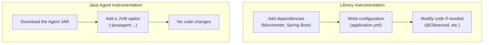
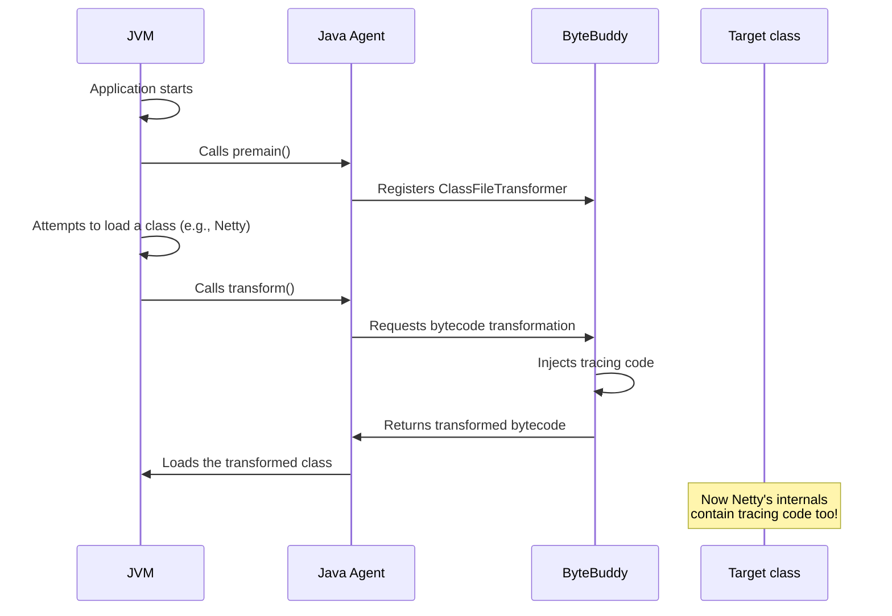
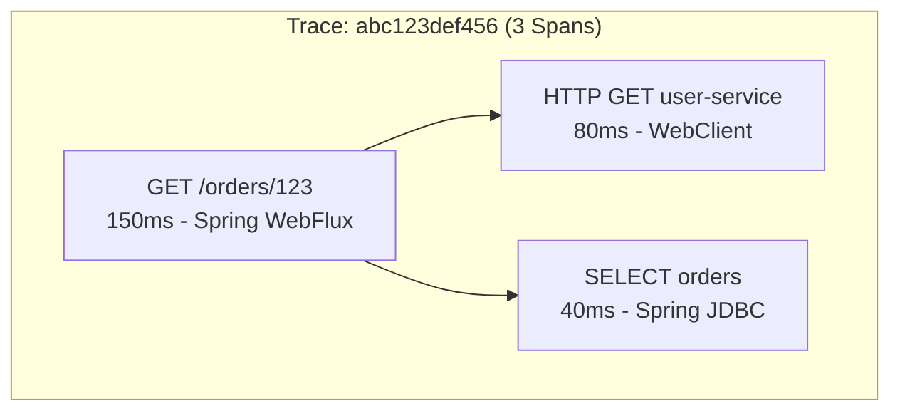
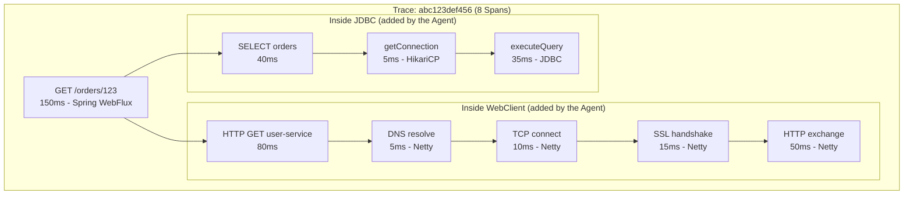
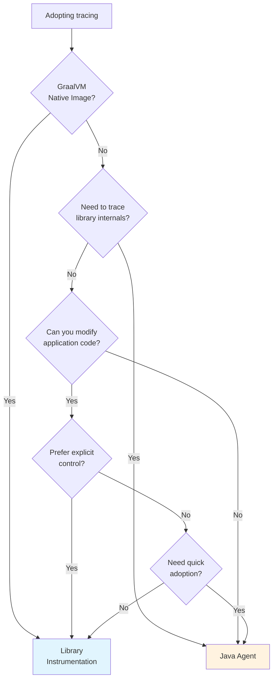
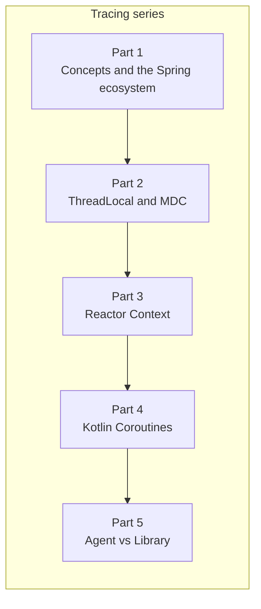

> **Understanding Tracing series**
> 
> 1.  [From the History of Observability to the Spring Ecosystem (feat. OTel)](/en/tracing-1-observability-spring-otel/)
> 2.  [ThreadLocal and MDC](/en/tracing-2-threadlocal-mdc/)
> 3.  [Reactor Context and Asynchronous Environments](/en/tracing-3-reactor-context-webflux/)
> 4.  [Kotlin Coroutines and Context Propagation](/en/tracing-4-kotlin-coroutine-context-propagation/)
> 5.  **[Java Agent vs Library Instrumentation](/en/tracing-5-java-agent-vs-library-instrumentation/) ← you are here**

## Introduction

There's a problem I briefly mentioned in [Part 3](/en/tracing-3-reactor-context-webflux/): **library-internal logs have no traceId**. You see this in the DEBUG logs of libraries like the Reactive Mongo Client, R2DBC drivers, and Netty.

```text
// our application code - has a traceId ✅
14:23:45.123 [abc123] INFO  OrderService - Starting order lookup

// library-internal logs - no traceId ❌ (hypothetical example)
14:23:45.150 DEBUG io.r2dbc.postgresql - Executing query: SELECT * FROM orders
14:23:45.160 DEBUG io.netty.handler.logging - [id: 0x...] WRITE: 256B

// back in our code - has a traceId ✅
14:23:45.200 [abc123] INFO  OrderService - Order lookup finished
```

Why does this happen? The **Library Instrumentation** approach we set up through Part 4 only instruments **our application code** and **the components Spring supports**. If a library doesn't support Micrometer itself, its internal code goes uninstrumented.

The way to solve this is the **Java Agent**. In this post we'll compare the two instrumentation approaches and figure out which one to choose in which situation.

## The Two Instrumentation Approaches

There are broadly two ways to apply tracing to a Java application.



| Aspect | Library Instrumentation | Java Agent Instrumentation |
| --- | --- | --- |
| **How it's applied** | Add dependencies + configuration | A single JVM option |
| **Code changes** | May be needed | Not needed (zero-code) |
| **Instrumentation scope** | Our code + integrated libraries | 150+ libraries auto-instrumented |
| **How it works** | Explicit API calls | Bytecode manipulation |
| **Representative tool** | Micrometer Tracing | OpenTelemetry Java Agent |

## How Library Instrumentation Works

### The Micrometer + Spring Boot Approach

This is what we used in Parts 1 through 4. It leverages Spring Boot's **auto-configuration** and the **Micrometer Observation API**.

```kotlin
// build.gradle.kts
dependencies {
    implementation("org.springframework.boot:spring-boot-starter-actuator")
    implementation("io.micrometer:micrometer-tracing-bridge-otel")
    implementation("io.opentelemetry:opentelemetry-exporter-otlp")
}
```
```yaml
# application.yml
spring:
  application:
    name: order-service
management:
  tracing:
    sampling:
      probability: 1.0
  otlp:
    tracing:
      endpoint: http://localhost:4318/v1/traces
```

With just this configuration, Spring automatically adds Observations to **WebFilter**, **RestClient**, **WebClient**, and more.

### Creating Spans Explicitly

For code outside the auto-instrumentation scope, you have to add Spans yourself.

**Option 1: the @Observed annotation**

```kotlin
@Service
class OrderService {

    @Observed(name = "order.process")  // Span created automatically
    fun processOrder(orderId: String): Order {
        // business logic
        return order
    }
}
```

**Option 2: using the Observation API directly**

```kotlin
@Service
class OrderService(
    private val observationRegistry: ObservationRegistry
) {
    fun processOrder(orderId: String): Order {
        return Observation.createNotStarted("order.process", observationRegistry)
            .lowCardinalityKeyValue("order.type", "standard")
            .observe {
                // business logic
                order
            }
    }
}
```

**Option 3: using the OpenTelemetry API directly**

```kotlin
@Service
class OrderService {
    private val tracer = GlobalOpenTelemetry.getTracer("order-service")
    
    fun processOrder(orderId: String): Order {
        val span = tracer.spanBuilder("order.process").startSpan()
        try {
            span.makeCurrent().use {
                span.setAttribute("order.id", orderId)
                // business logic
                return order
            }
        } finally {
            span.end()
        }
    }
}
```

### The Limits of Library Instrumentation

The **limitations** of this approach are clear:

1.  **Library internals can't be instrumented**: you can't trace what happens inside libraries like Netty or HikariCP.
2.  **Manual work is required**: custom business logic needs Spans added by hand.
3.  **Dependence on library support**: only libraries Spring supports get auto-instrumented.

> **💡 Why can't library internals be instrumented?**
> 
> Library code ships as an already **compiled JAR**. Since we can't modify the source code, instrumentation is impossible unless the library supports Micrometer on its own.

## How Java Agent Instrumentation Works

### The Magic of Bytecode Manipulation

A Java Agent modifies bytecode **at the moment the JVM loads a class**. It alters the compiled `.class` files in memory.



### premain and the Instrumentation API

A Java Agent's entry point is the `premain` method. It runs **before** the JVM calls the `main` method.

```java
// entry point of a Java Agent (simplified example)
public class OpenTelemetryAgent {
    public static void premain(String agentArgs, Instrumentation inst) {
        // register a ClassFileTransformer
        inst.addTransformer(new TracingTransformer());
    }
}
```

`Instrumentation` and `ClassFileTransformer` are **standard JDK APIs** (the `java.lang.instrument` package). ByteBuddy is a library that provides a more convenient abstraction on top of these APIs.

```java
// java.lang.instrument.ClassFileTransformer (standard JDK interface)
public interface ClassFileTransformer {
    // the JVM calls this method every time it loads a class
    byte[] transform(
        ClassLoader loader,
        String className,
        Class<?> classBeingRedefined,
        ProtectionDomain protectionDomain,
        byte[] classfileBuffer  // original bytecode
    ) throws IllegalClassFormatException;
    // return value: transformed bytecode (null means no transformation)
}
```

**The sequence of events**:

1.  The Agent is loaded via the `-javaagent` option at JVM startup
2.  The Agent's `premain()` is called → it registers a `ClassFileTransformer`
3.  From then on, **on every class load**, the JVM calls `transform()`
4.  The Agent modifies the bytecode of the classes it cares about and returns it

The actual OpenTelemetry Java Agent uses the [ByteBuddy](https://bytebuddy.net/) library to manipulate bytecode. ByteBuddy's `AgentBuilder` implements `ClassFileTransformer` internally.

### Injecting Code into Methods with ByteBuddy

ByteBuddy's `@Advice` annotations let you inject code at the start and end of existing methods.

```java
// internal structure of the OpenTelemetry Agent (simplified)
public class HttpClientInstrumentation {

    @Advice.OnMethodEnter
    public static Scope onEnter(@Advice.Argument(0) HttpRequest request) {
        // runs at method entry
        Span span = tracer.spanBuilder("HTTP " + request.method())
            .startSpan();
        span.setAttribute("http.url", request.uri().toString());

        return span.makeCurrent();
    }
    
    @Advice.OnMethodExit(onThrowable = Throwable.class)
    public static void onExit(
        @Advice.Enter Scope scope,
        @Advice.Return HttpResponse response,
        @Advice.Thrown Throwable error
    ) {
        // runs at method exit
        Span span = Span.current();
        if (error != null) {
            span.setStatus(StatusCode.ERROR);
            span.recordException(error);
        } else {
            span.setAttribute("http.status_code", response.statusCode());
        }
        span.end();
        scope.close();
    }
}
```

ByteBuddy **injects this code directly into the target class's bytecode**. Without touching the original source code!

> **🔗 References**
> 
> -   [OpenTelemetry Java Instrumentation GitHub](https://github.com/open-telemetry/opentelemetry-java-instrumentation)
> -   [ByteBuddy – Runtime Code Generation](https://bytebuddy.net/)
> -   [Easily Create Java Agents with Byte Buddy (InfoQ)](https://www.infoq.com/articles/Easily-Create-Java-Agents-with-ByteBuddy/)

## Using the OpenTelemetry Java Agent

### Installation and Running

```bash
# 1. Download the Agent JAR
curl -L -O https://github.com/open-telemetry/opentelemetry-java-instrumentation/releases/latest/download/opentelemetry-javaagent.jar

# 2. Run with the JVM option
java -javaagent:opentelemetry-javaagent.jar \
     -Dotel.service.name=order-service \
     -Dotel.exporter.otlp.endpoint=http://localhost:4318 \
     -jar your-app.jar
```

In a Docker environment:

```dockerfile
FROM eclipse-temurin:17-jre-alpine

WORKDIR /app

# download the agent
ADD https://github.com/open-telemetry/opentelemetry-java-instrumentation/releases/latest/download/opentelemetry-javaagent.jar /app/opentelemetry-javaagent.jar

COPY target/app.jar /app/app.jar

# configure via environment variables
ENV JAVA_TOOL_OPTIONS="-javaagent:/app/opentelemetry-javaagent.jar"
ENV OTEL_SERVICE_NAME="order-service"
ENV OTEL_EXPORTER_OTLP_ENDPOINT="http://otel-collector:4318"

ENTRYPOINT ["java", "-jar", "/app/app.jar"]
```

### Supported Libraries

The OpenTelemetry Java Agent automatically instruments **more than 150 libraries**.

| Category | Libraries |
| --- | --- |
| **HTTP servers** | Spring WebMVC, Spring WebFlux, Servlet, Netty, Undertow, Jetty |
| **HTTP clients** | RestTemplate, WebClient, Apache HttpClient, OkHttp |
| **Databases** | JDBC, HikariCP, Hibernate, R2DBC, MongoDB, Redis |
| **Messaging** | Kafka, RabbitMQ, AWS SQS, JMS |
| **Async** | Reactor, RxJava, Kotlin Coroutines, CompletableFuture |
| **Others** | gRPC, GraphQL, AWS SDK, Elasticsearch |

Full list: [OpenTelemetry Supported Libraries](https://opentelemetry.io/docs/zero-code/java/agent/supported-libraries/)

### Key Configuration Options

```properties
# service name
-Dotel.service.name=order-service

# exporter settings
-Dotel.exporter.otlp.endpoint=http://localhost:4318
-Dotel.traces.exporter=otlp  # or jaeger, zipkin, logging

# sampling ratio (1.0 = 100%)
-Dotel.traces.sampler=parentbased_traceidratio
-Dotel.traces.sampler.arg=0.1

# disable instrumentation for specific libraries
-Dotel.instrumentation.jdbc.enabled=false
-Dotel.instrumentation.kafka.enabled=false

# automatically inject traceId into logs
-Dotel.instrumentation.logback-appender.enabled=true
```

## A Hands-on Comparison: Same Request, Different Results

Let's compare what happens when we apply each approach to the same Spring Boot application.

### Test Scenario

```kotlin
@RestController
class OrderController(
    private val webClient: WebClient,  // external API call
    private val jdbcTemplate: JdbcTemplate  // DB query
) {
    @GetMapping("/orders/{id}")
    suspend fun getOrder(@PathVariable id: String): Order {
        // 1. call an external API
        val userInfo = webClient.get()
            .uri("http://user-service/users/{id}", id)
            .retrieve()
            .awaitBody<UserInfo>()
        
        // 2. query the DB
        val order = jdbcTemplate.queryForObject(
            "SELECT * FROM orders WHERE id = ?", 
            orderRowMapper, id
        )
        
        return order.copy(user = userInfo)
    }
}
```

### Library Instrumentation Results

Only the components Spring supports show up as Spans.



**Log output**:

```text
[abc123] INFO  OrderController - Starting order lookup
[abc123] DEBUG WebClient - HTTP GET http://user-service/users/123
[abc123] DEBUG JdbcTemplate - Executing SQL query
[abc123] INFO  OrderController - Order lookup finished
```

### Java Agent Results

The OpenTelemetry Java Agent traces **all the way into library internals**.



**Log output** (the Agent injects the traceId into library logs too):

```text
[abc123] INFO  OrderController - Starting order lookup
[abc123] DEBUG WebClient - HTTP GET http://user-service/users/123
[abc123] DEBUG io.netty.resolver - Resolving user-service
[abc123] DEBUG io.netty.channel - Connected to /10.0.0.5:8080
[abc123] DEBUG io.netty.handler.ssl - SSL handshake completed
[abc123] DEBUG HikariPool - Acquired connection
[abc123] DEBUG JdbcTemplate - Executing SQL query
[abc123] INFO  OrderController - Order lookup finished
```

### The Key Differences

| Aspect | Library Instrumentation | Java Agent |
| --- | --- | --- |
| **Span count** | 3 | 8 |
| **traceId in library logs** | ❌ None | ✅ Injected automatically |
| **Detailed network analysis** | ❌ Not possible | ✅ DNS, TCP, SSL broken out |
| **Connection pool analysis** | ❌ Not possible | ✅ getConnection time visible |

> **💡 When do you need this level of detail?**
> 
> "The external API call is slow — is it DNS, SSL, or the actual response?" "The DB query is slow — is it waiting for a connection, or the query itself?"
> 
> To answer questions like these, you need the Java Agent's detailed Spans.

### Timeline Comparison

```mermaid
gantt
    title Library Instrumentation (3 Spans)
    dateFormat X
    axisFormat %L ms
    
    section Request
    GET /orders/123           :0, 150
    
    section External API
    HTTP GET user-service     :10, 90
    
    section Database
    SELECT orders             :95, 145
```

```mermaid
gantt
    title Java Agent Instrumentation (8 Spans)
    dateFormat X
    axisFormat %L ms
    
    section Request
    GET /orders/123           :0, 150
    
    section External API
    HTTP GET user-service     :10, 90
    
    section Inside Netty
    DNS resolve               :10, 15
    TCP connect               :15, 25
    SSL handshake             :25, 40
    HTTP exchange             :40, 90
    
    section Database
    SELECT orders             :95, 145
    
    section Inside HikariCP
    getConnection             :95, 100
    executeQuery              :100, 140
```





## Which One Should You Choose?

### When Library Instrumentation Fits

**✅ Recommended when:**

-   Using **GraalVM Native Image** (Java Agents don't work there)
-   You need **light overhead** (only the minimum instrumentation)
-   You prefer **explicit control** (knowing exactly what gets instrumented)
-   You operate **entirely within the Spring ecosystem** (leveraging Spring Boot auto-configuration)
-   You need battle-tested stability in **production**
-   You want simple setup in **local development**

**📦 How to use:**

```kotlin
dependencies {
    implementation("org.springframework.boot:spring-boot-starter-actuator")
    implementation("io.micrometer:micrometer-tracing-bridge-otel")
    implementation("io.opentelemetry:opentelemetry-exporter-otlp")
}
```

### When the Java Agent Fits

**✅ Recommended when:**

-   Adding tracing to a **legacy application** (code can't be modified)
-   You need to trace **library internals** (Netty, HikariCP, etc.)
-   You need **quick adoption** (apply immediately without code changes)
-   You use a **diverse tech stack** (150+ libraries supported automatically)
-   You want detailed analysis in **dev/test environments**

**📦 How to use:**

```bash
java -javaagent:opentelemetry-javaagent.jar \
     -Dotel.service.name=order-service \
     -jar your-app.jar
```

### Convenience in Local Development

**When developing in an IDE, the Library approach is simpler to set up.**

| Aspect | Library Instrumentation | Java Agent |
| --- | --- | --- |
| **Setup** | Add dependencies to `build.gradle` | Add `-javaagent` to the Run Configuration |
| **Running from the IDE** | Runs immediately | Requires editing VM Options |
| **Agent JAR management** | Not needed | Separate download/path management |
| **Hot reload** | Works normally | Possible conflicts |
| **Debugging** | Breakpoints behave naturally | Bytecode manipulation can cause confusion |

**Setting up the Java Agent in IntelliJ:**

```text
Run > Edit Configurations > add to VM Options:
-javaagent:/path/to/opentelemetry-javaagent.jar
-Dotel.service.name=my-service
-Dotel.traces.exporter=logging
```

> **⚠️ Environment consistency matters**
> 
> It's best to use **the same approach** in development and production. Because the Java Agent manipulates bytecode, using different approaches per environment can produce "works locally but breaks in production" problems.
> 
> -   If you chose the Library approach → Library in dev/staging/production alike
> -   If you chose the Agent approach → Agent in dev/staging/production alike

### Using Both Together

In practice, it's also possible to **use both approaches at once**!

```kotlin
// 1. Library Instrumentation: add custom Spans to business logic
@Service
class OrderService {
    @Observed(name = "order.validate")
    fun validateOrder(order: Order): ValidationResult {
        // instrument business logic
    }
}
```
```bash
# 2. Java Agent: automatic instrumentation at the infrastructure level
java -javaagent:opentelemetry-javaagent.jar \
     -Dotel.instrumentation.micrometer.enabled=true \  # enable the Micrometer bridge
     -jar your-app.jar
```

> **⚠️ Caveat**
> 
> Combining the two approaches can produce **duplicate Spans**. The OpenTelemetry Agent provides a Micrometer bridge by default, but some configuration tuning may be required.

### Decision Guide Summary



| Criterion | Library Instrumentation | Java Agent |
| --- | --- | --- |
| **Adoption difficulty** | Medium (dependencies + config) | Easy (one JAR line) |
| **Code changes** | May be needed | Not needed |
| **Instrumentation scope** | Limited | Broad |
| **Overhead** | Low | Medium |
| **Native support** | ✅ | ❌ |
| **Debuggability** | High (explicit) | Low (implicit) |
| **Production stability** | High | Medium |
| **Local dev convenience** | High (runs straight from the IDE) | Low (setup required) |

## Conclusion

In this post we looked at **how the two instrumentation approaches work** and **how they differ**.

Key takeaways:

1.  **Library Instrumentation (Micrometer)**
    -   Explicit and controllable
    -   Requires code changes
    -   Supports GraalVM Native
    -   Can't instrument library internals
2.  **Java Agent (OpenTelemetry)**
    -   Zero-code, bytecode manipulation
    -   150+ libraries auto-instrumented
    -   Traces all the way into library internals
    -   No Native support, comes with overhead
3.  **How to choose**
    -   Production + Native → Library Instrumentation
    -   Legacy + quick adoption + detailed analysis → Java Agent
    -   Both viable → combine as the situation calls for

And that wraps up the **Tracing series**. Starting from the concept of Distributed Tracing in Part 1, we've covered ThreadLocal/MDC, Reactor Context, Kotlin Coroutines, and finally the instrumentation approaches.



Whether you're new to tracing or have been wondering why your existing setup looks the way it does, I hope this series has been helpful. Thank you for reading!

## References

-   [OpenTelemetry Java Instrumentation – GitHub](https://github.com/open-telemetry/opentelemetry-java-instrumentation)
-   [OpenTelemetry Java Agent Documentation](https://opentelemetry.io/docs/zero-code/java/agent/)
-   [OpenTelemetry Supported Libraries](https://opentelemetry.io/docs/zero-code/java/agent/supported-libraries/)
-   [ByteBuddy – Runtime Code Generation](https://github.com/raphw/byte-buddy)
-   [Easily Create Java Agents with Byte Buddy – InfoQ](https://www.infoq.com/articles/Easily-Create-Java-Agents-with-ByteBuddy/)
-   [OpenTelemetry Tracing on Spring Boot: Java Agent vs. Micrometer Tracing](https://blog.frankel.ch/opentelemetry-tracing-spring-boot/)
-   [Micrometer Tracing Documentation](https://micrometer.io/docs/tracing)
-   [Spring Boot Observability Documentation](https://docs.spring.io/spring-boot/reference/actuator/observability.html)
