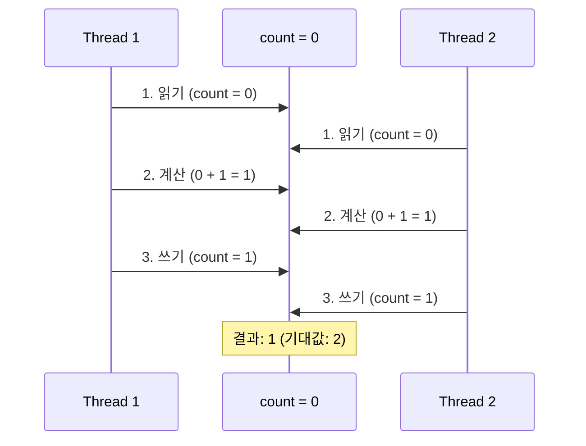
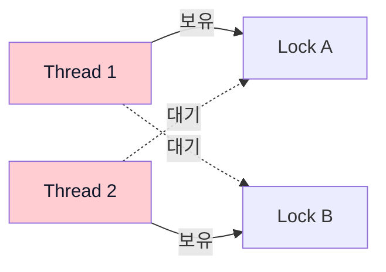
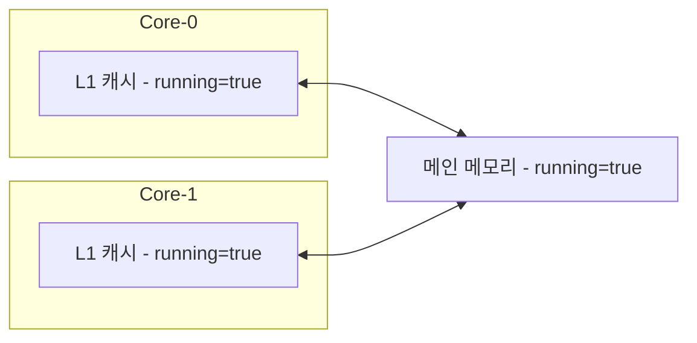
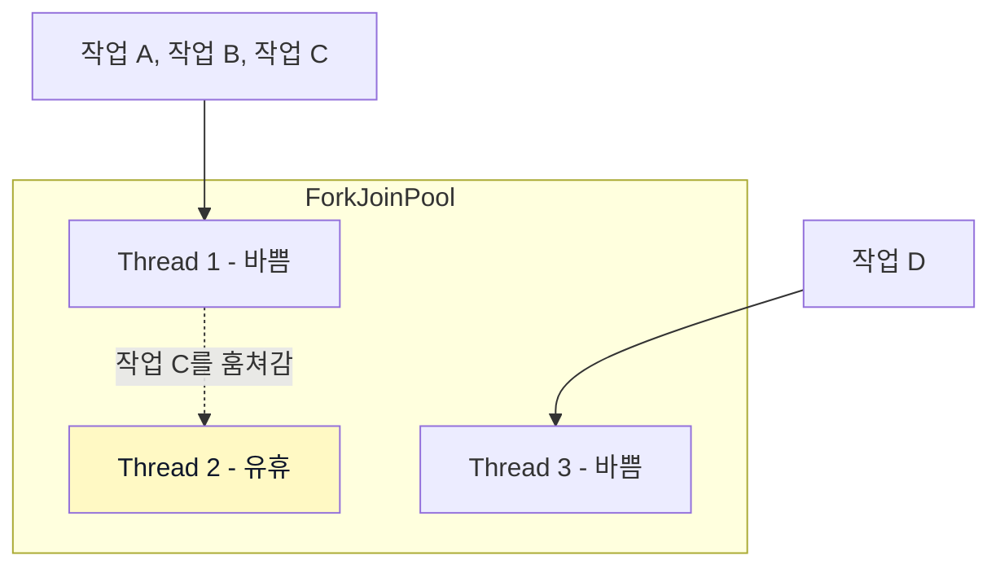
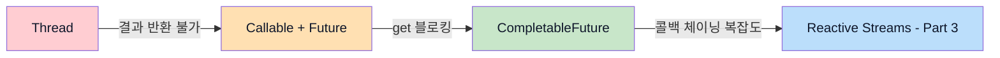

> **JVM 동시성 모델 이해하기 시리즈**
> 
> 1.  [동시성과 병렬성의 기초](/jvm-concurrency-model-1-fundamentals)
> 2.  **[Java의 전통적인 동시성 모델](/jvm-concurrency-model-2-java-traditional-concurrency) ← 현재 글**
> 3.  [Reactive Streams와 Project Reactor](/jvm-concurrency-model-3-reactive-streams-reactor)
> 4.  [Spring WebFlux](/jvm-concurrency-model-4-spring-webflux)
> 5.  [Kotlin Coroutines](/jvm-concurrency-model-5-kotlin-coroutines)
> 6.  [Spring + Coroutines 통합 — WebFlux, MVC, 그리고 AOP의 한계](/jvm-concurrency-model-6-spring-coroutines)
> 7.  [Virtual Thread — 동기 세계의 해법](/jvm-concurrency-model-7-virtual-thread)
> 8.  [총정리 — 언제 무엇을 선택할 것인가](/jvm-concurrency-model-8-conclusion-decision-framework/)

## Thread에서 CompletableFuture까지 — 추상화의 발전사

[Part 1](/jvm-concurrency-model-1-fundamentals/)에서 동시성과 병렬성, 동기/비동기, 블로킹/논블로킹의 개념을 정리했습니다. 이번 글에서는 그 개념들이 **Java 코드에서 어떤 모습으로 나타나는지** 살펴봅니다.

Java의 동시성 API는 한 번에 완성된 것이 아닙니다. `Thread`로 시작해서, 그 한계를 극복하기 위해 `ExecutorService`가 등장하고, 결과를 받기 위해 `Future`가 추가되고, 블로킹 없이 결과를 처리하기 위해 `CompletableFuture`가 나왔습니다. **각 도구는 이전 도구의 한계에서 태어났고**, 그 흐름을 이해하면 “언제 무엇을 써야 하는지”가 자연스럽게 보입니다.

> **Kotlin 사용자를 위한 참고**
> 
> Kotlin은 JVM 위에서 동작하므로, 이 글에서 다루는 Thread, ExecutorService, CompletableFuture 등을 모두 그대로 사용할 수 있습니다. 다만 Kotlin은 자체적인 동시성 모델인 **Coroutine**을 가지고 있어서, 실무에서는 Java 동시성 클래스를 직접 쓰기보다 Coroutine을 사용하는 경우가 많습니다. Coroutine은 Part 5에서 본격적으로 다룹니다.

## Thread와 Runnable — 가장 원시적인 동시성

Java에서 동시성의 출발점은 `Thread`입니다. 새로운 실행 흐름을 만들고 싶으면 Thread 객체를 생성하고 `start()`를 호출합니다.

```java
// 방법 1: Thread를 직접 상속
Thread thread = new Thread() {
    @Override
    public void run() {
        System.out.println("스레드에서 실행: " + Thread.currentThread().getName());
    }
};
thread.start();

// 방법 2: Runnable을 전달 (권장)
Runnable task = () -> {
    System.out.println("스레드에서 실행: " + Thread.currentThread().getName());
};
new Thread(task).start();
```

방법 2가 권장되는 이유는 간단합니다. Java는 단일 상속이라 Thread를 상속하면 다른 클래스를 상속할 수 없고, **실행할 작업(Runnable)과 실행 수단(Thread)이 분리**되어야 나중에 ExecutorService 같은 다른 실행 수단으로 바꿀 때 코드 변경이 적습니다.

[Part 1](/jvm-concurrency-model-1-fundamentals/)에서 다뤘듯이, `new Thread().start()`를 호출하면 내부적으로 `pthread_create()` → `clone()` 시스템 콜을 거쳐 OS 스레드가 생성됩니다. 즉, **Java Thread 하나 = OS Thread 하나**이고, 이 말은 스레드 하나당 수백 KB~1MB의 스택 메모리를 OS에서 할당받는다는 뜻입니다.

### Thread의 한계

Thread와 Runnable만으로 동시성 프로그래밍을 하면 세 가지 문제에 부딪힙니다.

**첫째, 결과를 돌려받을 수 없습니다.** Runnable의 `run()` 메서드는 리턴 타입이 `void`입니다. 스레드에서 계산한 값을 가져오려면 공유 변수를 만들고 동기화 처리를 직접 해야 합니다.

**둘째, 스레드 수를 제어할 수 없습니다.** 요청마다 `new Thread()`를 하면 동시 접속 1만 건에 스레드 1만 개가 생깁니다. 스택 메모리만 해도 10GB에 달하고, OS의 컨텍스트 스위칭 비용이 실제 작업 시간을 초과하게 됩니다.

**셋째, 예외 처리가 불편합니다.** Runnable의 `run()` 메서드 시그니처는 `void run()`이라서 `throws IOException` 같은 선언을 붙일 수 없습니다. 그래서 스레드 안에서 checked exception이 발생하는 메서드를 호출하면 반드시 내부에서 try-catch로 잡아야 하고, 예외를 호출자에게 전달할 방법이 없습니다.

```java
Runnable task = () -> {
    try {
        String data = Files.readString(Path.of("data.txt")); // IOException 발생 가능
    } catch (IOException e) {
        // 여기서 삼켜야 함 — 호출자에게 전달 불가
        e.printStackTrace();
    }
};
```

이 세 가지 한계가 다음에 다룰 Callable, Future, ExecutorService가 등장한 직접적인 이유입니다.

## Callable과 Future — 결과를 돌려받고 싶다

`Callable`은 Runnable의 한계를 보완하기 위해 Java 5에서 추가되었습니다. **값을 리턴할 수 있고, 예외를 throws로 선언할 수 있습니다.**

```java
// Callable: 리턴 있음, 예외를 throws로 선언 가능
Callable<String> callable = () -> {
    String data = Files.readString(Path.of("data.txt"));  // IOException도 그냥 던질 수 있음
    return data.toUpperCase();
};
```

Callable에서 예외가 발생하면 사라지는 것이 아니라, `Future.get()`을 호출할 때 `ExecutionException`으로 감싸져서 호출자에게 전달됩니다. Runnable에서는 불가능했던 **예외의 전파**가 가능해진 것입니다.

Callable을 실행하면 `Future` 객체를 받습니다. [Part 1](/jvm-concurrency-model-1-fundamentals/)에서 **세탁소 영수증**에 비유했던 바로 그것입니다. 영수증을 가지고 있다가 결과가 필요할 때 `get()`을 호출합니다.

```java
ExecutorService executor = Executors.newSingleThreadExecutor();
Future<String> future = executor.submit(callable);

// 다른 작업 수행 가능
System.out.println("다른 일 하는 중...");

// 결과가 필요한 시점에 get() 호출 — 이때 블로킹!
String result = future.get();
System.out.println(result); // "작업 결과"

executor.shutdown();
```

### Future.get()의 블로킹 문제

Future의 핵심 한계는 **결과를 가져오는 방법이 `get()` 하나뿐이고, 이것이 블로킹**이라는 점입니다. [Part 1](/jvm-concurrency-model-1-fundamentals/)의 4가지 조합 매트릭스로 보면, Future.get()은 **비동기 + 블로킹** — 작업 자체는 다른 스레드에서 비동기로 실행되지만, 결과를 꺼내는 순간 호출 스레드가 멈춥니다.

여러 작업을 동시에 실행하고 결과를 모아야 하는 상황을 보겠습니다.

```java
ExecutorService executor = Executors.newFixedThreadPool(3);

Future<String> futureA = executor.submit(() -> {
    Thread.sleep(3000);
    return "A 결과";
});
Future<String> futureB = executor.submit(() -> {
    Thread.sleep(2000);
    return "B 결과";
});
Future<String> futureC = executor.submit(() -> {
    Thread.sleep(1000);
    return "C 결과";
});

// 세 작업은 동시에 실행되지만, 결과를 꺼내는 순간 순차 블로킹
String a = futureA.get(); // 3초 대기
String b = futureB.get(); // 이미 완료되어 즉시 반환
String c = futureC.get(); // 이미 완료되어 즉시 반환

executor.shutdown();
```

이 경우 세 작업이 병렬로 실행되므로 총 소요 시간은 약 3초입니다. 하지만 만약 A가 1초, B가 3초라면 어떨까요? `futureA.get()`은 1초 만에 끝나지만, `futureB.get()`에서 3초를 기다려야 합니다. **어떤 작업이 먼저 끝나든 `get()` 호출 순서대로 기다릴 수밖에 없습니다.**

`isDone()`으로 완료 여부를 확인할 수 있지만, 결국 반복문에서 폴링해야 하므로 CPU를 낭비하게 됩니다. “결과가 준비되면 알아서 다음 작업을 실행해줘”라고 말할 수 없다는 것이 Future의 근본적인 한계이고, 이것이 CompletableFuture가 등장한 이유입니다.

## ExecutorService — 스레드를 직접 만들지 마라

위 코드에서 이미 `ExecutorService`를 사용했습니다. 사실 Callable과 Future는 ExecutorService 없이는 의미가 없으니, 여기서 제대로 정리하겠습니다.

### 왜 Thread를 직접 만들면 안 되는가

```java
// 요청마다 스레드를 생성하는 서버 (잘못된 예)
while (true) {
    Socket client = serverSocket.accept();
    new Thread(() -> handleClient(client)).start(); // 위험!
}
```

이 코드는 동시 접속이 폭증하면 스레드가 무한히 생성됩니다. 스레드 하나에 ~1MB 스택 메모리이므로, 1만 개면 ~10GB입니다. 그 전에 `OutOfMemoryError`로 서버가 죽을 가능성이 높습니다. 그리고 스레드 수가 CPU 코어 수를 훨씬 넘으면, OS 스케줄러가 컨텍스트 스위칭에 쏟는 시간이 실제 작업 시간보다 많아집니다.

`ExecutorService`는 이 문제를 **스레드 풀**로 해결합니다. 스레드를 미리 일정 수만큼 만들어두고, 작업이 들어오면 풀에서 스레드를 꺼내 쓰고, 작업이 끝나면 반환합니다.

```java
// 스레드 풀 사용 (올바른 예)
ExecutorService executor = Executors.newFixedThreadPool(20);
while (true) {
    Socket client = serverSocket.accept();
    executor.submit(() -> handleClient(client)); // 풀에서 스레드 할당
}
```

### ThreadPoolExecutor — 풀의 종류와 선택 기준

`Executors` 팩토리 메서드가 제공하는 주요 구현체들입니다. 표의 “코어 스레드”란 풀이 유휴 상태일 때도 유지하는 최소 스레드 수이고, “최대 스레드”는 동시에 존재할 수 있는 스레드의 상한입니다.

| 풀 종류 | 코어/최대 스레드 | 작업 큐 | 적합한 상황 |
| --- | --- | --- | --- |
| **FixedThreadPool** | n / n | `LinkedBlockingQueue` (무제한) | 부하가 예측 가능한 서버 작업 |
| **CachedThreadPool** | 0 / Integer.MAX | `SynchronousQueue` (버퍼 없음) | 짧고 폭발적인 작업 |
| **SingleThreadExecutor** | 1 / 1 | `LinkedBlockingQueue` (무제한) | 순차 실행이 보장되어야 하는 작업 |
| **ScheduledThreadPool** | n / Integer.MAX | `DelayedWorkQueue` (실행 시각 기반) | 주기적 실행, 지연 실행 |

`SynchronousQueue`는 내부 버퍼가 없는 큐로, 작업을 넣는 쪽과 꺼내는 스레드가 동시에 만나야만 전달이 성립합니다. 대기 중인 스레드가 없으면 즉시 새 스레드를 생성하는 CachedThreadPool의 전략이 이 큐 덕분에 가능합니다. `DelayedWorkQueue`는 각 작업에 “실행 예정 시각”이 붙어 있어서, 그 시각이 될 때까지 꺼낼 수 없는 큐입니다. 작업이 밀려서 지연되는 것이 아니라, **의도적으로 실행 시점을 지정**하는 것입니다.

CachedThreadPool의 코어 스레드가 0인 이유는, 작업이 없으면 **스레드를 하나도 유지하지 않기** 위해서입니다. 작업이 들어오면 그때 스레드를 만들고, 60초간 사용되지 않으면 제거합니다. 자원을 최소한으로 쓰면서 순간적인 부하에 대응하는 전략입니다.

> **풀 사이즈는 어떻게 정해야 할까요?**
> 
> 핵심은 **작업이 CPU-bound인지 I/O-bound인지**입니다. CPU-bound 작업(계산, 변환)은 코어 수와 비슷하게 설정합니다. 스레드가 코어보다 많으면 컨텍스트 스위칭만 늘어납니다. I/O-bound 작업(DB 쿼리, API 호출)은 코어 수보다 훨씬 많이 설정합니다. 스레드가 I/O 대기 중일 때 다른 스레드가 CPU를 쓸 수 있기 때문입니다. Spring MVC의 기본 스레드 풀이 200개인 이유가 바로 이것입니다 — 대부분의 웹 요청은 DB 쿼리나 외부 API 호출을 포함하는 I/O-bound 작업이기 때문입니다.
> 
> 일반적인 공식은 `스레드 수 = CPU 코어 수 × (1 + I/O 대기 시간 / CPU 사용 시간)`입니다. 정확한 값은 부하 테스트로 찾아야 하지만, 출발점으로는 유용합니다.

### 올바른 종료: shutdown() vs shutdownNow()

ExecutorService는 명시적으로 종료해야 합니다. 종료하지 않으면 JVM이 끝나지 않습니다.

```java
executor.shutdown();       // 새 작업 거부, 진행 중인 작업은 완료까지 기다림
executor.shutdownNow();    // 새 작업 거부, 진행 중인 작업에 interrupt 시도
```

`shutdown()`이 일반적인 선택입니다. `shutdownNow()`는 진행 중인 작업을 강제로 중단하므로, 데이터 정합성이 깨질 수 있어 주의가 필요합니다. Spring 환경에서는 보통 빈의 라이프사이클(`@PreDestroy`)에서 `shutdown()`을 호출합니다.

## CompletableFuture — 콜백으로 체이닝하기

`CompletableFuture`는 Java 8에서 추가되었고, Future의 블로킹 문제를 근본적으로 해결합니다. [Part 1](/jvm-concurrency-model-1-fundamentals/)에서 **배달도 되는 세탁소**에 비유했던 것처럼, `get()`으로 직접 꺼낼 수도 있고, 콜백을 등록하면 결과가 준비될 때 자동으로 다음 작업이 실행됩니다.

### 기본 체이닝: supplyAsync → thenApply → thenAccept

```java
CompletableFuture.supplyAsync(() -> {
        // 1단계: 비동기로 데이터 조회
        return fetchUserFromDB(userId);
    })
    .thenApply(user -> {
        // 2단계: 결과를 가공 (이전 단계 결과를 받아서 변환)
        return user.getName().toUpperCase();
    })
    .thenAccept(name -> {
        // 3단계: 최종 소비 (리턴 없이 결과 사용)
        System.out.println("사용자: " + name);
    });
```

이 코드에서 `get()`을 호출하는 곳은 없습니다. 각 단계가 이전 단계의 결과를 받아서 자동으로 실행됩니다. [Part 1](/jvm-concurrency-model-1-fundamentals/)의 4가지 조합 매트릭스로 보면, 이것이 바로 **비동기 + 논블로킹**입니다 — 호출 스레드는 체인을 등록하고 즉시 반환되며, 결과는 콜백으로 통보받습니다.

주요 메서드의 차이를 정리하면 이렇습니다.

| 메서드 | 입력 | 출력 | 용도 |
| --- | --- | --- | --- |
| **thenApply** | 이전 결과 | 변환된 값 | 결과 변환 (map) |
| **thenAccept** | 이전 결과 | 없음 (void) | 결과 소비 (로깅, 저장) |
| **thenRun** | 없음 | 없음 (void) | 결과와 무관한 후속 작업 |

### 조합: 여러 비동기 작업 합치기

실무에서는 여러 API를 동시에 호출하고 결과를 합쳐야 하는 경우가 많습니다.

```java
CompletableFuture<String> userFuture = CompletableFuture.supplyAsync(
    () -> fetchUser(userId)
);
CompletableFuture<List<Order>> orderFuture = CompletableFuture.supplyAsync(
    () -> fetchOrders(userId)
);

// 두 결과가 모두 준비되면 합침
CompletableFuture<String> combined = userFuture.thenCombine(orderFuture,
    (user, orders) -> user.getName() + "의 주문 " + orders.size() + "건"
);
```

`thenCombine`은 두 개의 독립적인 비동기 작업이 모두 완료되면 결과를 합칩니다. 두 작업은 병렬로 실행되므로, 각각 2초/3초가 걸린다면 총 소요 시간은 약 3초입니다.

비동기 작업의 결과로 다시 비동기 작업을 호출해야 할 때는 `thenCompose`를 사용합니다.

```java
// thenApply를 쓰면 CompletableFuture<CompletableFuture<Order>>가 되어 중첩됨
// thenCompose는 이것을 평탄화해줌 (flatMap과 같은 역할)
CompletableFuture<Order> orderFuture = fetchUser(userId)
    .thenCompose(user -> fetchLatestOrder(user.getId()));
```

### 예외 처리

동기 코드의 try-catch에 해당하는 것이 CompletableFuture의 예외 처리 메서드들입니다.

```java
CompletableFuture.supplyAsync(() -> {
        if (userId == null) throw new IllegalArgumentException("userId is null");
        return fetchUser(userId);
    })
    .thenApply(user -> user.getName())
    .exceptionally(ex -> {
        // 체인 어디서든 예외가 발생하면 여기서 처리
        System.err.println("에러 발생: " + ex.getMessage());
        return "Unknown";
    });
```

`exceptionally`는 예외가 발생했을 때만 호출되고, 대체 값을 반환합니다. `handle`과 `whenComplete`은 **성공이든 실패든 항상 호출**되지만, 핵심적인 차이가 있습니다.

```java
// handle: 성공/실패 모두 받고, 결과를 변환할 수 있음 (try-catch + 변환)
cf.handle((result, ex) -> {
    if (ex != null) return "기본값";   // 예외 시 대체 값
    return result.toUpperCase();       // 성공 시 변환된 값
}); // 이후 체인에는 handle이 리턴한 값이 전달됨

// whenComplete: 성공/실패 모두 받지만, 결과를 바꿀 수 없음 (finally)
cf.whenComplete((result, ex) -> {
    if (ex != null) log.error("실패", ex);  // 로깅
    else log.info("성공: " + result);       // 로깅
}); // 이후 체인에는 원래 결과(또는 예외)가 그대로 전달됨
```

| 메서드 | 호출 시점 | 결과 변환 | 비유 |
| --- | --- | --- | --- |
| **exceptionally** | 예외 시만 | O (대체 값) | catch |
| **handle** | 항상 (성공+실패) | O (새 값 리턴) | try-catch + 변환 |
| **whenComplete** | 항상 (성공+실패) | X (원래 결과 유지) | finally (로깅, 정리) |

### 실행 스레드는 누가 결정하는가

`supplyAsync()`를 Executor 없이 호출하면 **ForkJoinPool.commonPool()** 에서 실행됩니다. 이 풀은 CPU 코어 수 – 1개의 스레드를 가지고 있어서, I/O 작업이 많으면 스레드가 부족해질 수 있습니다.

```java
// 기본: ForkJoinPool.commonPool() 사용
CompletableFuture.supplyAsync(() -> fetchFromDB());

// 커스텀 Executor 지정 (I/O 작업이 많을 때 권장)
ExecutorService ioExecutor = Executors.newFixedThreadPool(50);
CompletableFuture.supplyAsync(() -> fetchFromDB(), ioExecutor);
```

`thenApply`도 마찬가지로, `thenApplyAsync(fn, executor)`를 사용하면 후속 작업의 실행 스레드를 제어할 수 있습니다.

## 공유 자원 문제 — 동시성의 어두운 면

여러 스레드가 동시에 실행되면 성능은 좋아지지만, **같은 데이터에 동시에 접근하는 순간** 문제가 시작됩니다.

### Race Condition (경쟁 상태)

```java
public class Counter {
    private int count = 0;

    public void increment() {
        count++; // 이 한 줄이 위험합니다
    }

    public int getCount() {
        return count;
    }
}
```

`count++`는 코드에서는 한 줄이지만, CPU 레벨에서는 세 단계입니다.



두 스레드가 `count++`를 한 번씩 실행했지만, 둘 다 0을 읽은 뒤 1을 쓰므로 결과는 2가 아니라 1입니다. 이것이 **경쟁 상태(Race Condition)** — 결과가 스레드 실행 순서(타이밍)에 따라 달라지는 현상입니다.

### Visibility 문제 (가시성 문제)

```java
public class StopFlag {
    private boolean running = true;

    public void stop() {
        running = false; // Thread 1에서 호출
    }

    public void run() {
        while (running) { // Thread 2에서 실행 — running이 false가 되어도 안 멈출 수 있음
            doWork();
        }
    }
}
```

Thread 1이 `running = false`로 변경해도, Thread 2가 이 변경을 **못 볼 수 있습니다.** 각 CPU 코어는 자체 캐시를 가지고 있고, Thread 2가 `running` 값을 자신의 캐시에서 계속 읽으면 변경 사실을 알 수 없습니다. 이것을 **가시성 문제**라고 합니다.

### Deadlock (교착 상태)

```java
Object lockA = new Object();
Object lockB = new Object();

// Thread 1
new Thread(() -> {
    synchronized (lockA) {
        Thread.sleep(100);
        synchronized (lockB) {  // lockB를 기다림
            System.out.println("Thread 1 완료");
        }
    }
}).start();

// Thread 2
new Thread(() -> {
    synchronized (lockB) {
        Thread.sleep(100);
        synchronized (lockA) {  // lockA를 기다림
            System.out.println("Thread 2 완료");
        }
    }
}).start();
```

Thread 1은 lockA를 잡고 lockB를 기다리고, Thread 2는 lockB를 잡고 lockA를 기다립니다. 둘 다 영원히 기다리게 되는 것이 **교착 상태(Deadlock)** 입니다.



Deadlock을 예방하는 가장 기본적인 전략은 **락 획득 순서를 통일**하는 것입니다. 모든 스레드가 항상 A → B 순서로 락을 잡으면 순환 대기가 발생하지 않습니다.

## 동기화 도구 — 문제를 어떻게 막는가

위에서 본 세 가지 문제를 해결하기 위한 Java의 동기화 도구들을 살펴보겠습니다. 각 도구를 비교하기 전에, 동기화가 보장하는 **세 가지 속성**을 먼저 정리하면 이후 설명이 훨씬 명확해집니다.

| 속성 | 의미 | 예시 |
| --- | --- | --- |
| **가시성(Visibility)** | 한 스레드의 쓰기가 다른 스레드의 읽기에 보이는가 | Thread A가 변경한 값을 Thread B가 볼 수 있는가 |
| **원자성(Atomicity)** | **하나의 연산**이 중간에 끊기지 않고 실행되는가 | `count++`의 읽기-계산-쓰기 3단계가 끼어들 수 없는가 |
| **상호 배제(Mutual Exclusion)** | **여러 연산을 묶은 구간**에 하나의 스레드만 진입하는가 | “잔액 확인 → 출금” 사이에 다른 스레드가 끼어들 수 없는가 |

원자성과 상호 배제는 둘 다 “다른 스레드가 끼어들지 못하게 한다”는 목적은 같지만, **구현 수준과 보호 범위가 다릅니다.**

**원자성**은 **CPU 하드웨어**가 보장합니다. 예를 들어 `count++`는 읽기-계산-쓰기 3단계로 이루어져 있어서 원자적이지 않지만, `AtomicInteger.incrementAndGet()`은 CPU의 `cmpxchg` 명령어 하나로 이 3단계를 끊김 없이 실행합니다. 이것이 곧 뒤에서 다룰 **Atomic 클래스**의 역할입니다. 가볍고 빠르지만, **그 한 연산만** 보호합니다. `balance.get()` → `balance.addAndGet(-800)` 각각은 원자적이지만, 그 사이에 다른 스레드가 끼어들어 잔액을 바꿀 수 있습니다.

**상호 배제**는 **JVM/OS**가 소프트웨어 레벨에서 보장합니다. 개발자가 synchronized 블록의 `{` 부터 `}` 까지 **범위를 직접 지정**하면, 그 구간에 다른 스레드의 진입 자체를 막습니다. 원자성보다 무겁지만, 여러 연산을 묶어서 보호할 수 있습니다.

이후 다룰 각 도구가 이 세 속성 중 어디까지 보장하는지가 선택의 핵심입니다.

### volatile — 가시성 보장

```java
public class StopFlag {
    private volatile boolean running = true;

    public void stop() {
        running = false; // 변경 즉시 다른 스레드에 보임
    }

    public void run() {
        while (running) { // 항상 최신 값을 읽음
            doWork();
        }
    }
}
```

volatile을 이해하려면, 먼저 **CPU 캐시가 기본**이라는 것을 알아야 합니다. 메인 메모리(RAM) 접근은 수백 CPU 사이클이 걸릴 정도로 느리기 때문에, 현대 CPU는 각 코어마다 L1/L2 캐시를 가지고 있습니다. 변수를 처음 읽으면 캐시에 복사해두고, 이후에는 캐시에서 읽습니다. 이것은 JVM이 아닌 **CPU 하드웨어 레벨의 최적화**입니다.



Core 0에서 `running = false`로 변경하면, Core 0의 캐시는 업데이트되지만 **Core 1의 캐시에는 여전히 `true`가 남아 있을 수 있습니다.** 이것이 앞서 다룬 가시성 문제의 원인입니다. 참고로 캐시는 코어별로 따로 존재하기 때문에(L1, L2는 코어 전용), 두 스레드가 **같은 코어**에서 실행되면 같은 캐시를 쓰므로 문제가 안 생기지만, **다른 코어**에 배정되면 문제가 생깁니다. OS 스케줄러가 스레드를 어느 코어에 배정할지는 매번 달라지므로, 가시성 버그는 “되다가 안 되다가” 하는 재현이 어려운 형태로 나타납니다.

`volatile`은 CPU에게 **메모리 배리어(memory barrier)** 를 지시합니다. 쓰기 시 캐시의 값을 메인 메모리로 즉시 플러시하고, 다른 코어의 해당 캐시 라인을 무효화(invalidate)합니다. 읽기 시에는 캐시를 건너뛰고 메인 메모리에서 다시 읽습니다. “확률을 줄이는” 것이 아니라 **가시성을 100% 보장**하는 것입니다.

참고로 이 메모리 배리어는 **명령어 재배치도 방지**합니다. CPU나 컴파일러는 성능 최적화를 위해 “결과가 같다면” 명령어 순서를 바꿀 수 있는데, 단일 스레드에서는 문제가 없지만 멀티스레드에서는 예상치 못한 결과가 발생할 수 있습니다.

```java
// Thread A
data = loadData();       // 1번
volatile ready = true;   // 2번

// Thread B
if (ready) {             // 3번
    use(data);           // 4번 — data가 준비되어 있다고 가정
}
```

`ready`가 volatile이 아니면, CPU가 1번과 2번의 순서를 바꿀 수 있습니다. 그러면 Thread B가 `ready = true`를 보고 `data`를 사용하려 하지만, 실제로는 아직 `loadData()`가 완료되지 않은 상태일 수 있습니다. `volatile`은 **쓰기 이전의 모든 연산이 확실히 완료된 후에 쓰기가 실행**되도록 보장합니다.

다만 실무에서 이 재배치가 직접 문제되는 경우는 드뭅니다. `synchronized`, `ReentrantLock`, `Atomic` 같은 동기화 도구들이 내부적으로 이미 메모리 배리어를 포함하고 있어서, 정상적으로 동기화를 사용하는 코드라면 재배치는 자동으로 방지됩니다. 재배치가 실제로 문제가 되는 건 위 예시처럼 **동기화 없이 일반 변수로 스레드 간 통신을 시도하는** 특수한 경우뿐이므로, volatile의 부가 기능 정도로 알아두면 충분합니다.

그리고 `count++` 같은 **read-modify-write 연산의 원자성은 보장하지 않습니다.** volatile로 선언해도 두 스레드가 동시에 읽고 쓰면 경쟁 상태가 발생합니다. 그래서 volatile의 쓰임새는 명확합니다 — **한 스레드가 쓰고 다른 스레드가 읽는 단순 플래그**. 위의 stop flag 패턴이 대표적이고, Spring이나 Netty 같은 프레임워크 내부에서도 “초기화 완료 여부”, “셧다운 요청 여부” 같은 상태 전달에 실제로 많이 사용됩니다. 이런 경우에는 synchronized보다 가볍고 의도가 명확한 도구입니다.

### synchronized — 가시성 + 상호 배제

```java
public class Counter {
    private int count = 0;

    public synchronized void increment() {
        count++; // 한 번에 하나의 스레드만 실행
    }

    public synchronized int getCount() {
        return count;
    }
}
```

`synchronized`는 **한 시점에 하나의 스레드만** 해당 코드 블록을 실행할 수 있게 합니다. 가시성과 원자성을 모두 보장하고, 블록을 빠져나갈 때 (예외가 발생해도) 자동으로 락을 해제합니다. 가장 간단하고 안전한 동기화 방법입니다.

### ReentrantLock — 더 세밀한 제어

```java
private final ReentrantLock lock = new ReentrantLock();

public void doWork() {
    if (lock.tryLock(3, TimeUnit.SECONDS)) { // 3초만 대기
        try {
            // 임계 영역
        } finally {
            lock.unlock(); // 반드시 수동 해제!
        }
    } else {
        // 3초 내에 락을 못 잡으면 다른 처리
        handleTimeout();
    }
}
```

`synchronized`는 락을 잡을 때까지 무한 대기하는데, `ReentrantLock`은 **타임아웃**(`tryLock`), **인터럽트**(`lockInterruptibly`) 등 더 세밀한 제어를 제공합니다. 다만 `finally`에서 반드시 `unlock()`을 호출해야 하므로 실수할 여지가 있습니다.

### Atomic 클래스 — Lock-Free 동기화

```java
private final AtomicInteger count = new AtomicInteger(0);

public void increment() {
    count.incrementAndGet(); // CAS 연산으로 원자적 증가
}
```

Atomic 클래스는 **CAS(Compare-And-Swap)** 연산을 사용합니다. “현재 값이 내가 읽은 값과 같으면 새 값으로 교체하고, 다르면 다시 시도”하는 방식입니다.

> **CAS가 락보다 성능이 좋은 이유**
> 
> `synchronized`로 락을 잡을 때, 다른 스레드가 이미 잡고 있으면 OS 커널에게 “이 스레드를 재워줘”라고 요청하고, 락이 풀리면 “깨워줘”라고 다시 요청합니다. 이 **커널 모드 전환(user mode ↔ kernel mode)** 이 수천 CPU 사이클을 소모합니다. 잠든 스레드를 깨울 때도 OS 스케줄러가 개입해야 해서 지연이 발생합니다.
> 
> CAS는 **CPU 명령어 하나**(`cmpxchg` on x86)로 동작합니다. 실패하면 커널에 도움을 요청하는 것이 아니라 **즉시 다시 시도**합니다. OS 커널을 거치지 않으므로 전환 비용이 없습니다.
> 
> 다만 **경합이 극심한 경우**(수십 개 스레드가 동시에 같은 변수를 CAS) 계속 실패하고 재시도하는 것이 오히려 CPU를 낭비할 수 있어서, 단순 카운터처럼 경합이 짧고 가벼운 연산에 적합합니다.

### 상황별 선택 기준

앞서 정리한 세 가지 속성으로 각 도구를 비교하면 이렇습니다.

| 도구 | 가시성 | 원자성 | 상호 배제 | 비고 |
| --- | --- | --- | --- | --- |
| **volatile** | O | X | X | 가장 가벼움 |
| **Atomic** | O | O | X | CAS 기반 lock-free |
| **synchronized** | O | O | O | 가장 간단, 자동 해제 |
| **ReentrantLock** | O | O | O | 타임아웃/인터럽트 지원 |

| 상황 | 추천 도구 | 이유 |
| --- | --- | --- |
| 플래그 변경 (on/off) | `volatile` | 가시성만 필요, 원자성 불필요 |
| 단순 카운터 | `AtomicInteger` | Lock-free, 높은 경합에서 유리 |
| 복잡한 임계 영역 | `synchronized` | 간단하고 안전, 자동 해제 |
| 타임아웃/인터럽트 필요 | `ReentrantLock` | tryLock, lockInterruptibly 지원 |

## java.util.concurrent 유틸리티 — 자주 쓰는 동시성 도구들

앞에서 다룬 volatile, synchronized, ReentrantLock, Atomic은 **기본 동기화 도구**입니다. `java.util.concurrent` 패키지는 이 기본 도구들을 조합해서, 실무에서 자주 마주치는 동시성 패턴을 **미리 구현해놓은 상위 레벨 유틸리티**를 제공합니다. 예를 들어 CyclicBarrier는 내부적으로 ReentrantLock + Condition을, ConcurrentHashMap은 CAS + synchronized를 사용합니다. 직접 구현하면 복잡하고 실수하기 쉬운 패턴들을 검증된 형태로 제공하는 것입니다.

### CountDownLatch — N개 작업이 끝날 때까지 대기

**사용 시나리오**: 서버 시작 시 여러 초기화 작업(DB 연결, 캐시 로딩, 설정 로딩)이 모두 완료된 후에 요청을 받기 시작해야 할 때.

```java
CountDownLatch latch = new CountDownLatch(3); // 3개 작업 완료 대기

executor.submit(() -> { initDB();    latch.countDown(); });
executor.submit(() -> { loadCache(); latch.countDown(); });
executor.submit(() -> { loadConfig();latch.countDown(); });

latch.await(); // 3개 모두 countDown()될 때까지 블로킹
System.out.println("모든 초기화 완료, 서버 시작");
```

카운트가 0이 되면 `await()`이 풀립니다. **한 번 0이 되면 재사용할 수 없습니다** — 일회성 게이트입니다.

### CyclicBarrier — 서로를 기다린 뒤 함께 진행

**사용 시나리오**: 대용량 데이터를 여러 스레드가 각자 처리한 뒤, 모든 스레드가 끝나면 결과를 합치고, 다시 다음 배치를 처리하는 반복 작업.

```java
CyclicBarrier barrier = new CyclicBarrier(3, () -> {
    System.out.println("모든 스레드 도착 — 결과 합산");
});

for (int i = 0; i < 3; i++) {
    executor.submit(() -> {
        while (hasNextBatch()) {
            processBatch();
            barrier.await(); // 3개 스레드가 모두 도착할 때까지 대기
            // barrier가 풀리면 다음 배치 진행 (재사용!)
        }
    });
}
```

CountDownLatch와 비교하면, CyclicBarrier에는 `countDown()` 같은 메서드가 없습니다. 모든 스레드가 `await()`를 호출하면 그 자리에서 블로킹되고, **마지막 N번째 스레드가 `await()`를 호출하는 순간 모든 대기 스레드가 동시에 풀립니다.** 내부적으로 `ReentrantLock` + `Condition`으로 구현되어 있어서, 마지막 스레드 도착 → 카운트 리셋 → 모든 대기 스레드 깨우기가 하나의 원자적 흐름으로 처리됩니다. “일부 스레드만 풀리고 카운트가 먼저 리셋되는” 상황은 발생하지 않습니다.

> **Condition이란?**
> 
> `Condition`은 `ReentrantLock`과 함께 사용하는 **대기/통지 도구**입니다. 특정 조건이 충족될 때까지 스레드를 재우고(`await()`), 조건이 충족되면 대기 중인 스레드를 깨우는(`signal()`, `signalAll()`) 역할을 합니다. **하나의 락에 여러 Condition을 만들 수 있다**는 것이 핵심인데, 예를 들어 “버퍼가 비었을 때 대기”와 “버퍼가 꽉 찼을 때 대기”를 별도의 Condition으로 분리할 수 있습니다. CyclicBarrier는 이 Condition의 `signalAll()`을 사용해서 모든 대기 스레드를 한꺼번에 깨웁니다.
> 
> cf) `synchronized` 블록에도 같은 역할을 하는 `wait()`/`notify()`/`notifyAll()`이 있고, `Condition`은 이를 개선한 상위 도구입니다.

핵심 차이는 **재사용 가능** 여부입니다. barrier가 풀린 뒤 카운트가 자동으로 리셋되므로, 반복적인 동기화 지점에 적합합니다.

### Semaphore — 동시 접근 수 제한

**사용 시나리오**: DB 커넥션 풀처럼, 동시에 사용할 수 있는 자원 수가 제한된 경우.

```java
Semaphore semaphore = new Semaphore(10); // 최대 10개 동시 접근

public void accessResource() throws InterruptedException {
    semaphore.acquire(); // 허가 획득 (10개 초과 시 대기)
    try {
        useSharedResource();
    } finally {
        semaphore.release(); // 허가 반환
    }
}
```

`synchronized`는 한 번에 **1개** 스레드만 허용하지만, Semaphore는 **N개** 스레드의 동시 접근을 허용합니다.

### ConcurrentHashMap — 동시성을 고려한 Map

일반 `HashMap`을 여러 스레드에서 동시에 사용하면 데이터가 깨질 수 있습니다. `Collections.synchronizedMap()`은 전체 Map에 하나의 락을 걸어서 안전하지만, 읽기 작업까지 락을 잡으므로 성능이 떨어집니다.

`ConcurrentHashMap`은 **버킷 단위로 락을 분리**합니다. 여기서 버킷이란, HashMap 내부 배열의 각 칸을 말합니다. key-value를 넣으면 key의 hashCode로 배열의 어느 칸에 저장할지 결정되는데, 이 한 칸이 버킷입니다. 서로 다른 키라도 같은 버킷에 들어갈 수 있고(해시 충돌), 그때는 연결 리스트나 트리로 저장됩니다. 즉 하나의 버킷 = 하나의 key-value가 아니라, **하나 이상의 key-value가 들어갈 수 있는 슬롯**입니다.

ConcurrentHashMap은 이 버킷 단위로 락을 걸기 때문에, 서로 다른 버킷에 대한 쓰기는 동시에 가능하고, 읽기는 대부분 락 없이 수행됩니다.

```java
ConcurrentHashMap<String, Integer> map = new ConcurrentHashMap<>();

// 원자적 업데이트
map.merge("pageViews", 1, Integer::sum);

// 원자적 조건부 삽입
map.putIfAbsent("user:123", 0);

// 원자적 계산
map.compute("user:123", (key, val) -> val == null ? 1 : val + 1);
```

> **HashMap vs synchronizedMap vs ConcurrentHashMap**
> 
> HashMap은 동기화가 없어서 빠르지만 스레드 안전하지 않습니다. synchronizedMap은 안전하지만 모든 연산에 전체 락을 걸어 느립니다. ConcurrentHashMap은 세밀한 락으로 **읽기 중심 워크로드에서 HashMap에 가까운 성능을 내면서도 스레드 안전합니다.** 멀티스레드 환경에서는 ConcurrentHashMap이 기본 선택입니다.

### 유틸리티 요약

| 도구 | 핵심 역할 | 재사용 | 실무 사례 |
| --- | --- | --- | --- |
| **CountDownLatch** | N개 작업 완료 대기 | X | 서버 초기화, 테스트 셋업 |
| **CyclicBarrier** | N개 스레드 상호 대기 | O | 반복 배치 처리, 시뮬레이션 |
| **Semaphore** | 동시 접근 수 제한 | O | 커넥션 풀, API rate limiting |
| **ConcurrentHashMap** | 스레드 안전 Map | O | 캐시, 카운터, 공유 상태 |

## ForkJoinPool과 병렬 스트림 — 코어를 최대한 활용하기

[Part 1](/jvm-concurrency-model-1-fundamentals/)에서 병렬성은 **OS 스케줄러가 스레드를 여러 코어에 분배하는 것**이라고 했습니다. ForkJoinPool은 이 병렬성을 **더 효율적으로** 활용하기 위한 특수한 스레드 풀입니다.

### 기존 스레드 풀의 비효율

FixedThreadPool에서 4개 스레드가 각각 작업을 처리한다고 합시다. 스레드 A의 작업이 먼저 끝나면, A는 **큐에 새 작업이 들어올 때까지 놀고 있습니다.** 다른 스레드들이 바쁘게 일하는 동안에도 말이죠.

### Work-Stealing 알고리즘

ForkJoinPool은 이 문제를 **Work-Stealing**으로 해결합니다.



각 스레드는 **자신만의 작업 큐(deque)** 를 가집니다. 일이 끝난 유휴 스레드는 다른 바쁜 스레드의 큐에서 **작업을 훔쳐와서** 실행합니다. 이 방식으로 모든 코어가 최대한 쉬지 않고 일하게 됩니다.

ForkJoinPool의 기본 스레드 수는 `Runtime.getRuntime().availableProcessors()` — 즉 **CPU 코어 수**입니다. CPU-bound 작업에 최적화되어 있다는 뜻입니다.

### parallelStream()과의 관계

Java 8의 `parallelStream()`은 내부적으로 `ForkJoinPool.commonPool()`을 사용합니다.

```java
List<Integer> numbers = List.of(1, 2, 3, 4, 5, 6, 7, 8);

// 순차 처리
numbers.stream()
    .map(n -> heavyComputation(n))
    .collect(toList());

// 병렬 처리 — ForkJoinPool.commonPool() 사용
numbers.parallelStream()
    .map(n -> heavyComputation(n))
    .collect(toList());
```

`parallelStream()`은 데이터를 자동으로 분할하고, ForkJoinPool의 여러 스레드에서 병렬 처리한 뒤, 결과를 합칩니다.

> **parallelStream() 사용 시 주의점**
> 
> `ForkJoinPool.commonPool()`은 **애플리케이션 전체가 공유**하며, 스레드 수가 매우 적습니다 (기본값: CPU 코어 수 – 1). 8코어 CPU라면 7개밖에 없습니다. 여기서 I/O 작업(DB 쿼리 3초 대기)을 실행하면, 그 스레드는 3초 동안 **아무것도 안 하면서 풀의 자리만 차지**합니다. 7개 중 5개가 I/O에 블로킹되면, 남은 2개로 다른 parallelStream이나 CompletableFuture(기본 Executor)까지 처리해야 합니다.
> 
> I/O 작업을 별도의 ExecutorService로 분리하면, OS 레벨에서 CPU를 나눠 쓰는 것은 마찬가지지만, 적어도 **commonPool의 적은 스레드가 I/O 대기로 묶이는 것은 방지**합니다. parallelStream은 **순수 CPU 연산**에만 사용하고, I/O 작업은 별도의 ExecutorService를 만들어 사용하는 것이 안전합니다.
> 
> 데이터가 적은 경우(수백 건 이하)에는 분할/합산 오버헤드 때문에 순차 처리보다 오히려 느릴 수 있습니다. 실측 없이 “parallelStream이니까 빠르겠지”라고 가정하는 것은 위험합니다.

> **동시성 처리에서 순서는 보장되는가?**
> 
> Work-Stealing에서 다른 스레드가 작업을 훔쳐가면 실행 순서가 달라질 수 있습니다. 이것은 ForkJoinPool만의 특성이 아니라, **동시성/병렬 처리에서는 실행 순서 비보장이 기본**입니다. ExecutorService에 작업을 submit하는 순서와 실행 완료 순서는 다를 수 있고, parallelStream도 마찬가지입니다. 순서가 필요한 경우에는 명시적으로 처리해야 합니다 — `SingleThreadExecutor`로 순차 실행을 보장하거나, `CountDownLatch`/`CyclicBarrier`로 동기화 지점을 만들거나, parallelStream에서 `forEachOrdered()`를 사용하는 식입니다.

## 마무리 — Java 동시성의 발전 방향

이 글에서 다룬 도구들을 추상화 수준으로 정리하면 이런 흐름입니다.



**Thread**는 가장 원시적인 동시성 도구이고, 결과 반환과 스레드 관리의 한계를 **ExecutorService + Future**가 해결했습니다. Future의 블로킹 문제를 **CompletableFuture**가 콜백으로 해결했지만, 체인이 복잡해지면 가독성이 떨어지고, 배압(backpressure) 같은 스트림 제어를 할 수 없다는 한계가 남아 있습니다.

다음 글에서는 이 한계를 극복하기 위해 등장한 **Reactive Streams와 Project Reactor**를 다룹니다. “데이터를 push하되, 소비자가 처리 속도를 제어한다”는 새로운 패러다임이 왜 필요했고, 어떻게 동작하는지 살펴보겠습니다.

## 참고 자료

-   [Java Concurrency in Practice — Brian Goetz 외](https://jcip.net/)
-   [Baeldung — Guide to CompletableFuture](https://www.baeldung.com/java-completablefuture)
-   [Baeldung — Guide to Work Stealing in Java](https://www.baeldung.com/java-work-stealing)
-   [Baeldung — Java CyclicBarrier vs CountDownLatch](https://www.baeldung.com/java-cyclicbarrier-countdownlatch)
-   [Oracle — java.util.concurrent Package Summary](https://docs.oracle.com/javase/8/docs/api/java/util/concurrent/package-summary.html)
-   [Oracle — ForkJoinPool JavaDoc](https://docs.oracle.com/javase/8/docs/api/java/util/concurrent/ForkJoinPool.html)
