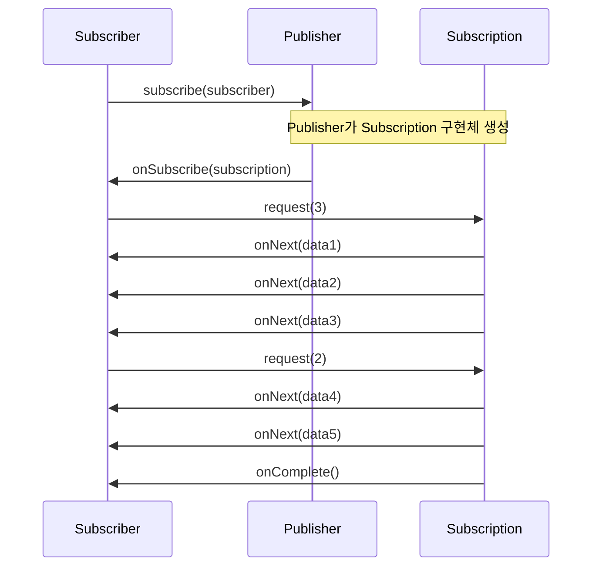
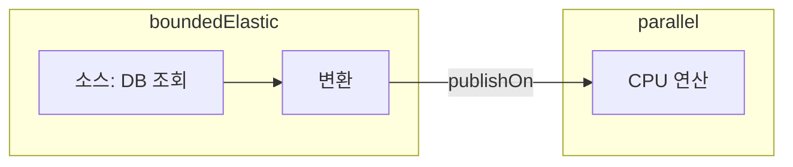
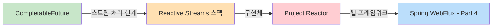

> **JVM 동시성 모델 이해하기 시리즈**
> 
> 1.  [동시성과 병렬성의 기초](/jvm-concurrency-model-1-fundamentals)
> 2.  [Java의 전통적인 동시성 모델](/jvm-concurrency-model-2-java-traditional-concurrency)
> 3.  **[Reactive Streams와 Project Reactor](/jvm-concurrency-model-3-reactive-streams-reactor) ← 현재 글**
> 4.  [Spring WebFlux](/jvm-concurrency-model-4-spring-webflux)
> 5.  [Kotlin Coroutines](/jvm-concurrency-model-5-kotlin-coroutines)
> 6.  [Spring + Coroutines 통합 — WebFlux, MVC, 그리고 AOP의 한계](/jvm-concurrency-model-6-spring-coroutines)
> 7.  [Virtual Thread — 동기 세계의 해법](/jvm-concurrency-model-7-virtual-thread)
> 8.  [총정리 — 언제 무엇을 선택할 것인가](/jvm-concurrency-model-8-conclusion-decision-framework/)

## CompletableFuture 너머의 세계 — 스트림을 제어하는 새로운 방법

[Part 2](/jvm-concurrency-model-2-java-traditional-concurrency/)에서 Java 동시성 API의 발전을 따라갔습니다. Thread → ExecutorService → CompletableFuture로 추상화 수준이 올라가면서 비동기 프로그래밍이 점점 편해졌지만, CompletableFuture에는 두 가지 근본적인 한계가 남아 있었습니다.

첫째, **단건 처리에 특화**되어 있습니다. CompletableFuture는 “하나의 비동기 작업이 완료되면 결과를 처리한다”는 모델입니다. 그런데 실시간으로 계속 들어오는 데이터 — 예를 들어 주식 시세 피드, 채팅 메시지, 센서 데이터 — 를 처리하려면 어떻게 해야 할까요? CompletableFuture를 반복문 안에서 계속 만들어야 하고, 이 “스트림”을 하나의 파이프라인으로 다루는 방법이 없습니다.

둘째, **배압(backpressure) 제어가 불가능**합니다. 생산자가 초당 10,000건의 데이터를 보내는데 소비자는 초당 100건밖에 처리하지 못하면? CompletableFuture 기반에서는 데이터가 메모리에 무한히 쌓이거나, 유실되거나, OutOfMemoryError가 발생합니다. 소비자가 “지금은 100건만 보내줘”라고 요청할 수 있는 메커니즘이 없기 때문입니다.

이 글에서는 이 한계를 극복하기 위해 등장한 **Reactive Streams** 스펙과, 그 구현체인 **Project Reactor**를 다룹니다.

## Pull vs Push — 데이터를 누가 주도하는가

리액티브를 이해하려면 먼저 **데이터 흐름의 방향**을 생각해야 합니다.

Java의 `Iterator`나 `Stream`은 **Pull 모델**입니다. 소비자가 `next()`나 터미널 연산을 호출해서 데이터를 “당겨온다”는 뜻입니다. 소비자가 주도권을 가지므로 속도 제어는 자연스럽지만, 데이터가 아직 준비되지 않았을 때는 스레드가 블로킹됩니다.

반대로 **Push 모델**은 생산자가 데이터가 준비될 때마다 소비자에게 밀어넣습니다. 블로킹 없이 비동기로 처리할 수 있지만, 생산자가 너무 빠르면 소비자가 감당하지 못하는 문제가 생깁니다.

| 모델 | 주도권 | 예시 | 장점 | 한계 |
| --- | --- | --- | --- | --- |
| **Pull** | 소비자 | Iterator, Stream | 속도 제어 자연스러움 | 데이터 없으면 블로킹 |
| **Push** | 생산자 | 이벤트 리스너, 콜백 | 비동기 처리 가능 | 소비자 과부하 위험 |

Reactive Streams는 이 둘을 결합한 **Push + Pull(하이브리드)** 모델입니다. 기본적으로 생산자가 데이터를 push하되, 소비자가 `request(n)`으로 “나는 n개까지 받을 수 있다”고 요청합니다. 이것이 **배압(backpressure)** 의 핵심입니다.

## Reactive Streams 스펙 — 4개의 인터페이스

Reactive Streams는 JVM에서 비동기 스트림 처리의 **표준 인터페이스**를 정의한 스펙입니다. 구현체가 아니라 스펙이라는 점이 중요합니다. Java 9에서 `java.util.concurrent.Flow` 클래스로 JDK에 편입되었고, Project Reactor, RxJava, Akka Streams 등이 이 스펙을 구현합니다.

스펙은 딱 4개의 인터페이스로 구성됩니다.

```java
public interface Publisher<T> {
    void subscribe(Subscriber<? super T> s);
}

public interface Subscriber<T> {
    void onSubscribe(Subscription s);
    void onNext(T t);
    void onError(Throwable t);
    void onComplete();
}

public interface Subscription {
    void request(long n);
    void cancel();
}

public interface Processor<T, R> extends Subscriber<T>, Publisher<R> {
}
```

**Publisher**는 데이터 소스입니다. `subscribe()`를 통해 Subscriber와 연결됩니다.

**Subscriber**는 데이터 소비자입니다. 4개의 콜백 메서드가 전체 생명주기를 정의합니다. `onSubscribe`로 구독이 시작되고, `onNext`로 데이터를 받고, `onError` 또는 `onComplete`로 종료됩니다.

**Subscription**은 Publisher와 Subscriber 사이의 연결입니다. Subscriber는 이 객체의 `request(n)`을 호출해서 “n개 더 보내줘”라고 요청하고, `cancel()`로 구독을 취소합니다. 이 `request(n)`이 backpressure의 실체입니다.

**Processor**는 Publisher이자 Subscriber인 중간 처리 단계입니다. 실무에서 직접 구현할 일은 거의 없고, Reactor의 연산자들이 내부적으로 이 역할을 합니다.

이 4개가 어떻게 상호작용하는지 시퀀스로 보겠습니다.



핵심 흐름은 이렇습니다. 먼저 `publisher.subscribe(subscriber)` — 즉 **Publisher의 메서드에 Subscriber를 인자로 전달**해서 구독을 시작합니다. “Subscriber가 subscribe한다”고 읽히기 쉽지만, 실제로는 Publisher의 메서드입니다. 구독이 시작되면 Publisher가 내부적으로 **Subscription 구현체를 생성**합니다. 이 구현체는 Subscriber 참조와 데이터 소스를 모두 들고 있습니다. Publisher는 `onSubscribe()`를 통해 이 Subscription 객체를 Subscriber에게 전달합니다. Subscriber는 이 Subscription의 `request(n)`을 호출해서 원하는 만큼만 데이터를 요청하고, **Subscription 구현체가 실제로 `onNext()`를 호출해서 데이터를 전달**합니다. 모든 데이터를 보냈으면 `onComplete()`로, 에러가 발생하면 `onError()`로 스트림을 종료합니다.

> Subscription 인터페이스에는 `request(n)`과 `cancel()`만 정의되어 있고, Subscriber 필드는 없습니다. Subscriber 참조를 들고 있는 것은 인터페이스가 아니라 Publisher가 생성한 **Subscription 구현체**입니다. 이 구현체는 Subscriber 참조와 **데이터 소스**를 모두 들고 있습니다. Publisher가 이 구현체를 `onSubscribe()`로 Subscriber에게 전달하면, Subscriber도 이 구현체의 참조를 갖게 됩니다. 결과적으로 **Subscription 구현체를 양쪽이 공유**하는 구조가 되어 Publisher와 Subscriber 간의 양방향 통신이 이루어집니다.
> 
> 여기서 주목할 점은, Subscriber가 `request(n)`을 호출하면 이 요청이 Publisher에게 전달되는 것이 아니라 **Subscription 구현체가 직접 처리**한다는 것입니다. 구현체가 데이터 소스를 이미 들고 있으므로, 스스로 데이터를 꺼내서 `subscriber.onNext()`를 호출합니다. `cancel()`도 마찬가지로 구현체가 직접 데이터 전달을 중단합니다. 즉, Publisher는 **Subscription 구현체를 만들어주는 팩토리** 역할이고, 생성 이후의 데이터 흐름은 Subscription 구현체가 독립적으로 수행합니다. 결과적으로 Publisher와 Subscriber는 직접 참조 없이 **Subscription 구현체를 중개자로 양방향 통신**하는 것이며, 이것이 backpressure의 구현 기반이기도 합니다 — Subscriber가 `request(n)`으로 “n개만 보내줘”라고 요청하면, Subscription 구현체가 그 요청에 맞춰 데이터를 전달합니다.
> 
> 이 구조는 앞으로 다룰 **lazy 실행**과도 연결됩니다. `Flux.just(1, 2, 3).map(...).filter(...)`처럼 연산자를 체이닝하면, 각 연산자가 새로운 Publisher를 반환합니다. 하지만 아직 Subscription 구현체는 생성되지 않습니다. `subscribe()`가 호출되는 순간 체인 전체에 걸쳐 Subscription 구현체들이 연쇄적으로 생성되면서 파이프라인이 비로소 가동됩니다. “subscribe() 전에는 아무 일도 일어나지 않는다”는 것은, **팩토리(Publisher)만 준비되어 있고 실행 엔진(Subscription 구현체)은 아직 만들어지지 않았다**는 뜻입니다.

중요한 규칙이 하나 있습니다. **`onError`와 `onComplete`는 둘 중 하나만, 단 한 번만 호출됩니다.** 에러가 나면 `onComplete`는 오지 않고, 정상 완료되면 `onError`는 오지 않습니다. 이 규칙 덕분에 스트림의 종료 처리가 명확합니다.

## Project Reactor — Mono와 Flux

Reactive Streams는 인터페이스만 정의하고 있으므로, 실제로 사용하려면 구현체가 필요합니다. **Project Reactor**는 Spring 팀이 주도하는 구현체로, Spring WebFlux의 기반입니다.

> 참고로 Reactive Streams의 구현체는 Reactor만 있는 것이 아닙니다. **RxJava**는 Android 생태계에서 널리 사용되고(Retrofit + RxJava 조합이 대표적), **Akka Streams**는 Scala/Akka 기반 분산 시스템에서 사용됩니다. 이 시리즈는 Spring 생태계를 다루므로 Reactor에 집중합니다.

Reactor는 Reactive Streams의 `Publisher`를 두 가지 타입으로 특화합니다.

### Mono — 0 또는 1개의 값

```java
// HTTP 호출처럼 결과가 하나인 비동기 작업
Mono<User> user = Mono.fromCallable(() -> userRepository.findById(id));

// 값이 없을 수도 있는 경우
Mono<User> empty = Mono.empty();

// 에러를 방출하는 경우
Mono<User> error = Mono.error(new UserNotFoundException());
```

`Mono<T>`는 **0 또는 1개**의 값을 비동기로 제공하는 Publisher입니다. CompletableFuture와 역할이 비슷하지만, 핵심 차이가 있습니다.

| 항목 | CompletableFuture | Mono |
| --- | --- | --- |
| **실행 시점** | 생성 즉시 실행 | subscribe() 할 때 실행 |
| **취소** | cancel(true)로 시도 | Subscription.cancel()로 확실히 취소 |
| **에러 처리** | exceptionally/handle | onErrorReturn/onErrorResume |
| **배압** | 불가능 | request(1) 기반 |
| **스레드 전환** | 직접 Executor 지정 | publishOn/subscribeOn |

에러 처리는 개념적으로 같고 API 이름만 다른 수준입니다. **스레드 전환**은 접근 방식이 다릅니다. CompletableFuture는 `thenApplyAsync(fn, executor)`처럼 **각 연산마다 Executor를 개별 지정**합니다. Reactor는 `publishOn`/`subscribeOn`으로 **파이프라인 구간 단위로** 스레드를 전환합니다. 연산별 제어 vs 구간별 제어라는 차이입니다.

가장 중요한 차이는 **실행 시점**입니다. CompletableFuture는 생성하는 순간 내부 작업이 실행됩니다. 반면 Mono는 **subscribe()를 호출하기 전까지 아무 일도 일어나지 않습니다.** 이것을 “cold” 또는 “lazy” 실행이라고 합니다.

```java
// CompletableFuture — 이 줄이 실행되는 순간 API 호출 시작
CompletableFuture<String> future = CompletableFuture.supplyAsync(() -> callApi());

// Mono — 아직 아무 일도 안 일어남
Mono<String> mono = Mono.fromCallable(() -> callApi());

// 이 시점에 비로소 실행
mono.subscribe(result -> System.out.println(result));
```

이 차이가 왜 중요할까요? lazy 실행 덕분에 **파이프라인을 먼저 정의하고, 실행은 나중에** 할 수 있습니다. 여러 연산자를 체이닝해서 “데이터가 오면 이렇게 처리해라”라는 선언을 만들어두고, `subscribe()`로 실제 실행을 트리거하는 것입니다. Spring WebFlux에서 Controller가 `Mono`를 반환하면, 프레임워크가 적절한 시점에 subscribe()를 호출합니다.

### Flux — 0 ~ N개의 값

```java
// 고정 값
Flux<String> names = Flux.just("Alice", "Bob", "Charlie");

// 범위
Flux<Integer> numbers = Flux.range(1, 10);

// 컬렉션에서 변환
Flux<User> users = Flux.fromIterable(userList);

// 주기적 생성 (0부터 1초 간격)
Flux<Long> ticks = Flux.interval(Duration.ofSeconds(1));
```

`Flux<T>`는 **0 ~ N개**의 값을 비동기로 방출하는 Publisher입니다. 이름과 사용법이 Java의 `Stream`과 비슷해 보이므로, 먼저 Stream이 무엇인지 짚고 넘어가겠습니다.

> **Java Stream이란?**
> 
> Java 8에서 도입된 `java.util.stream.Stream`은 컬렉션 데이터를 **선언적/함수형 스타일로 처리하는 파이프라인**입니다. `list.stream().filter(...).map(...).collect(...)` 형태로 데이터를 변환하고, 내부적으로는 호출한 스레드에서 동기적으로 실행됩니다. Stream의 가치는 비동기 성능 향상이 아니라, for문 대신 **“무엇을 할지”를 선언적으로 표현**할 수 있다는 데 있습니다. `parallelStream()`을 쓰면 ForkJoinPool에서 병렬 실행도 가능합니다([Part 2](/jvm-concurrency-model-2-java-traditional-concurrency/) 참고). 핵심 특징은 **이미 존재하는 데이터**(컬렉션, 배열 등)를 소스로 사용하고, **한 번만 소비**할 수 있다는 점입니다. 순서에 대해서는, 일반 `stream()`은 원본 컬렉션의 순서를 유지합니다. 순서가 뒤바뀔 수 있는 건 `parallelStream()`을 쓸 때이고, 일반 Stream만 사용하면 순서 걱정은 하지 않아도 됩니다.

Flux와의 본질적인 차이는 이렇습니다.

| 항목 | Java Stream | Flux |
| --- | --- | --- |
| **실행 방식** | 동기 (블로킹) | 비동기 (논블로킹) |
| **소비 횟수** | 1회만 가능 | 여러 번 subscribe 가능 (Cold일 때) |
| **시간 기반** | 불가능 | interval, delay 등 지원 |
| **배압** | 불가능 | request(n) 기반 |
| **에러 처리** | try-catch | onError 시그널 |

Java Stream은 이미 존재하는 데이터를 동기적으로 처리하는 도구이고, Flux는 **아직 도착하지 않은 데이터를 비동기로 처리하는 도구**입니다. `Flux.interval()`처럼 시간에 따라 데이터가 생성되는 패턴은 Stream으로는 표현할 수 없습니다.

참고로 “여러 번 subscribe 가능”은 Flux만의 특징이 아닙니다. **Mono도 Cold Publisher이면 여러 번 subscribe할 수 있고, 매번 새로 실행됩니다.** Mono와 Flux의 차이는 순수하게 **값의 개수**(0~1개 vs 0~N개)뿐입니다.

### Cold vs Hot Publisher

Publisher는 데이터를 언제 생성하느냐에 따라 두 가지로 나뉩니다.

**Cold Publisher**는 구독할 때마다 데이터를 처음부터 새로 생성합니다. 넷플릭스에서 영화를 재생하는 것과 같습니다 — 각 시청자가 재생 버튼을 누르면 처음부터 시작합니다.

```java
Flux<Integer> cold = Flux.range(1, 3);

cold.subscribe(i -> System.out.println("구독자A: " + i));
// 구독자A: 1, 2, 3

cold.subscribe(i -> System.out.println("구독자B: " + i));
// 구독자B: 1, 2, 3 (처음부터 다시)
```

**Hot Publisher**는 구독 여부와 관계없이 데이터를 방출합니다. 라디오 방송과 같습니다 — 청취자가 들든 말든 방송은 계속되고, 중간에 채널을 맞추면 그 시점부터 들립니다. WebSocket 메시지, 이벤트 브로드캐스트, 센서 데이터 같은 “진행 중인 데이터 스트림”에 사용합니다.

Reactor에서 Hot Publisher를 만드는 주요 도구는 **Sinks**입니다. `Sinks`는 Reactor 3.4에서 도입된 API로, 외부에서 데이터를 프로그래밍 방식으로 주입(emit)할 수 있는 Publisher를 생성합니다. Cold Publisher가 “구독하면 데이터가 자동으로 흘러나오는 수도꼭지”라면, Sinks는 “개발자가 직접 물을 부어넣는 깔때기”입니다.

| Sinks 팩토리 | 값 개수 | 구독자 수 | 용도 |
| --- | --- | --- | --- |
| `Sinks.one()` | 1개 | 여러 명 | Mono용 Hot Publisher |
| `Sinks.many().multicast()` | N개 | 여러 명 | 여러 구독자에게 동시 전달 |
| `Sinks.many().unicast()` | N개 | 1명 | 단일 구독자 전용 |
| `Sinks.many().replay()` | N개 | 여러 명 | 과거 데이터 재생 (늦게 구독해도 이전 데이터 수신) |

코드의 `.onBackpressureBuffer()`는 Sinks 빌더 API의 일부로, “구독자가 아직 소비하지 못한 데이터를 버퍼에 쌓아두겠다”는 **생성 시 전략 설정**입니다. 뒤에서 다룰 Flux의 `onBackpressureBuffer()` 연산자와 이름은 같지만 위치가 다릅니다 — Sinks는 생성 시, Flux 연산자는 파이프라인 중간에 사용합니다.

```java
// multicast — 여러 구독자에게 동시에 데이터 전달
Sinks.Many<String> sink = Sinks.many().multicast().onBackpressureBuffer();
Flux<String> hot = sink.asFlux();

sink.tryEmitNext("메시지1"); // 아직 구독자 없음 → 버퍼에 저장되거나 유실

hot.subscribe(s -> System.out.println("구독자A: " + s));
sink.tryEmitNext("메시지2"); // 구독자A만 수신

hot.subscribe(s -> System.out.println("구독자B: " + s));
sink.tryEmitNext("메시지3"); // 구독자A, B 모두 수신
```

`replay()`는 특별합니다. 늦게 구독한 구독자에게도 이전에 방출된 데이터를 다시 보내줍니다. `replay().limit(5)`처럼 재생 범위를 제한할 수도 있습니다. 채팅방에 입장하면 최근 메시지 몇 개를 보여주는 것과 같은 패턴입니다.

Reactor에서 `Flux.just()`, `Flux.range()`, `Mono.fromCallable()` 등 대부분의 팩토리 메서드는 Cold Publisher를 만듭니다. Hot Publisher가 필요한 경우에 Sinks를 사용합니다.

## 핵심 연산자 — 데이터 변환과 조합

Reactor의 연산자는 스트림 데이터를 선언적으로 변환하는 도구입니다. Java Stream API의 `map`, `filter`와 이름이 같은 것들이 많지만, 비동기 환경에 맞는 연산자들이 추가되어 있습니다. 자주 쓰이는 것들을 카테고리별로 정리합니다.

| 카테고리 | 연산자 | 역할 |
| --- | --- | --- |
| **생성** | just, range, fromIterable, fromCallable | 소스 생성 |
| **변환** | map, flatMap, flatMapSequential | 요소 변환 |
| **필터링** | filter, take, skip, distinct | 조건부 선별 |
| **조합** | zip, merge, concat | 여러 스트림 합치기 |
| **집계** | reduce, collectList, count | 결과 축약 |
| **유틸** | doOnNext, doOnError, log | 부수 효과, 디버깅 |

### map과 flatMap — 가장 중요한 차이

`map`은 **동기 변환** — 함수가 값을 즉시 반환(`T → R`)하고, 그 동안 스레드가 기다립니다.

```java
Flux.just("alice", "bob")
    .map(name -> name.toUpperCase())
    // "ALICE", "BOB"
```

`flatMap`은 **비동기 변환** — 함수가 Publisher를 반환(`T → Publisher<R>`)하고, 실제 값은 나중에 비동기로 도착합니다. 스레드가 기다리지 않고 다음 요소를 처리할 수 있습니다.

```java
Flux.just(1, 2, 3)
    .flatMap(id -> fetchUserById(id))  // 각 id로 비동기 HTTP 호출
    // User1, User3, User2 (순서 보장 안 됨!)
```

핵심 차이를 정리하면, `map`은 문자열 변환이나 계산처럼 **즉시 완료되는 작업**에 사용하고, `flatMap`은 HTTP 호출이나 DB 조회처럼 **결과가 나중에 도착하는 비동기 작업**에 사용합니다. `map` 안에서 비동기 작업을 호출하면 `Mono<Mono<User>>` 같은 중첩 구조가 되기 때문입니다.

그리고 `flatMap`은 **순서를 보장하지 않습니다.** 여러 비동기 작업을 동시에 실행하고, 먼저 완료되는 순서대로 결과를 내보냅니다. [Part 2](/jvm-concurrency-model-2-java-traditional-concurrency/)에서 다룬 “동시성에서 순서는 기본적으로 보장되지 않는다”는 원칙이 여기서도 적용됩니다. 순서가 중요하다면 `flatMapSequential`을 사용합니다. 이 연산자는 비동기 작업은 동시에 시작하되, 결과는 원래 순서대로 내보냅니다.

```java
Flux.just(1, 2, 3)
    .flatMapSequential(id -> fetchUserById(id))
    // User1, User2, User3 (순서 보장)
```

### 조합 연산자 — zip, merge, concat

여러 스트림을 합치는 방법은 세 가지입니다.

```java
Flux<String> names = Flux.just("Alice", "Bob");
Flux<Integer> ages = Flux.just(30, 25);

// zip: 1:1 매칭 — 양쪽 다 준비될 때까지 기다림
Flux.zip(names, ages, (name, age) -> name + "(" + age + ")")
    // "Alice(30)", "Bob(25)"

// merge: 도착 순서대로 — 순서 보장 안 됨
Flux.merge(stream1, stream2)
    // 먼저 도착하는 순서대로

// concat: 순차 연결 — 첫 번째가 끝나야 두 번째 시작
Flux.concat(stream1, stream2)
    // stream1의 모든 데이터 → stream2의 모든 데이터
```

`zip`은 여러 비동기 작업의 결과를 하나로 묶을 때, `merge`는 여러 소스의 데이터를 실시간으로 합칠 때, `concat`은 순서가 중요한 연속 처리에 적합합니다.

## 스케줄러 — 어떤 스레드에서 실행되는가

Reactor에서 기본적으로 모든 연산은 **subscribe()를 호출한 스레드**에서 실행됩니다. 스레드를 전환하려면 명시적으로 스케줄러를 지정해야 합니다.

### publishOn과 subscribeOn

이 둘은 이름이 비슷하지만 역할이 다릅니다.

**subscribeOn**은 **소스(구독 시점)의 실행 스레드**를 변경합니다. 파이프라인 어디에 위치하든 소스부터 적용됩니다.

**publishOn**은 **이후 연산자의 실행 스레드**를 변경합니다. 위치가 중요합니다 — publishOn 아래의 연산자들만 영향받습니다.

```java
Flux.fromCallable(() -> blockingDbQuery())    // ① 소스
    .subscribeOn(Schedulers.boundedElastic())  // ① → boundedElastic에서 실행
    .map(data -> transform(data))              // ② boundedElastic에서 실행
    .publishOn(Schedulers.parallel())          // ③ 여기서 스레드 전환
    .map(data -> cpuIntensiveWork(data))       // ④ parallel에서 실행
    .subscribe();
```



쉽게 정리하면 `subscribeOn`은 “데이터를 **만드는** 스레드”를 정하고, `publishOn`은 “데이터를 **처리하는** 스레드”를 정합니다.

### Schedulers 종류

| 스케줄러 | 스레드 수 | 용도 | [Part 2](/jvm-concurrency-model-2-java-traditional-concurrency/) 대응 |
| --- | --- | --- | --- |
| `Schedulers.parallel()` | CPU 코어 수 | CPU-bound 연산 | FixedThreadPool(코어 수) |
| `Schedulers.boundedElastic()` | 최대 10 \* 코어 수 | I/O, 블로킹 작업 격리 | CachedThreadPool |
| `Schedulers.single()` | 1 | 순차 처리 | SingleThreadExecutor |
| `Schedulers.immediate()` | 현재 스레드 | 스레드 전환 없음 | – |

[Part 2](/jvm-concurrency-model-2-java-traditional-concurrency/)에서 “CPU-bound 작업은 코어 수만큼, I/O-bound 작업은 더 많은 스레드”라고 했던 원칙이 Reactor의 스케줄러에도 그대로 반영되어 있습니다. `parallel()`은 코어 수만큼의 고정 스레드로 CPU 연산을, `boundedElastic()`은 탄력적으로 스레드를 늘려서 블로킹 I/O를 격리합니다.

`boundedElastic()`이 중요한 이유가 하나 더 있습니다. 리액티브 파이프라인 안에서 **블로킹 코드를 호출해야 하는 경우**(레거시 JDBC, 파일 I/O 등), 이 스케줄러로 격리하지 않으면 다른 논블로킹 작업까지 블로킹됩니다. [Part 2](/jvm-concurrency-model-2-java-traditional-concurrency/)에서 parallelStream의 commonPool이 I/O 블로킹 스레드에 의해 전체 병렬 처리가 느려지는 문제를 다뤘는데, 같은 원리입니다.

```java
// 레거시 블로킹 코드를 리액티브 파이프라인에 통합
Mono.fromCallable(() -> legacyJdbcQuery())
    .subscribeOn(Schedulers.boundedElastic())  // 블로킹 작업 격리
    .flatMap(data -> reactiveProcess(data))    // 이후는 논블로킹
```

실무에서 `publishOn`/`subscribeOn`을 명시적으로 쓰는 빈도는 **프로젝트의 리액티브 성숙도**에 따라 다릅니다. 순수 리액티브 스택(R2DBC, WebClient, 리액티브 Redis 등)으로만 구성하면 모든 I/O가 논블로킹이므로 스레드 전환이 거의 필요 없습니다. 하지만 실무에서는 레거시 JDBC, 파일 처리, 블로킹 SDK 같은 코드를 통합하는 경우가 많고, 이때 `subscribeOn(Schedulers.boundedElastic())`은 사실상 필수입니다.

## 에러 처리 — onError 시그널 전략

리액티브 스트림에서 에러가 발생하면 `onError` 시그널이 전파되고, **스트림은 즉시 종료**됩니다. try-catch처럼 에러를 잡고 이어서 실행하는 것이 아니라, 에러 자체가 종료 시그널입니다. 따라서 에러를 “처리한다”는 것은 종료 전에 **대체 값을 제공하거나, 대체 스트림으로 전환하거나, 재시도**하는 것을 의미합니다.

### 대체 값과 대체 스트림

```java
// onErrorReturn — 기본값 반환 (catch + 기본값 return)
Mono.fromCallable(() -> riskyCall())
    .onErrorReturn("기본값");

// onErrorResume — 대체 스트림 전환 (catch + 다른 로직 실행)
Mono.fromCallable(() -> primaryApi())
    .onErrorResume(e -> fallbackApi());

// onErrorMap — 예외 타입 변환 (catch + throw new)
Mono.fromCallable(() -> externalCall())
    .onErrorMap(IOException.class, e -> new ServiceException("외부 API 실패", e));
```

### 재시도

```java
// 최대 3번 재시도
Mono.fromCallable(() -> unstableApi())
    .retry(3);

// 지수 백오프 재시도
Mono.fromCallable(() -> unstableApi())
    .retryWhen(Retry.backoff(3, Duration.ofSeconds(1))
        .maxBackoff(Duration.ofSeconds(10)));
```

[Part 2](/jvm-concurrency-model-2-java-traditional-concurrency/)에서 다룬 CompletableFuture의 에러 처리와 비교하면 이렇습니다.

| 전략 | CompletableFuture | Reactor |
| --- | --- | --- |
| 기본값 반환 | `exceptionally(e -> 기본값)` | `onErrorReturn(기본값)` |
| 대체 로직 | `handle((v, e) -> ...)` | `onErrorResume(e -> ...)` |
| 예외 변환 | handle 안에서 throw | `onErrorMap(e -> new ...)` |
| 재시도 | 직접 구현 | `retry()`, `retryWhen()` |
| 최종 작업 | `whenComplete((v, e) -> ...)` | `doFinally(signal -> ...)` |

Reactor가 재시도 전략(지수 백오프 등)을 연산자로 제공한다는 점이 눈에 띕니다. CompletableFuture에서 재시도를 구현하려면 반복문과 예외 처리를 직접 작성해야 했습니다.

## Backpressure — 소비자가 속도를 제어한다

도입부에서 제기한 “생산자가 너무 빠르면?” 문제로 돌아옵니다. Reactive Streams 스펙에서 Subscriber가 `request(n)`으로 원하는 만큼만 요청하는 것이 backpressure의 핵심이라고 했는데, 실제로 Reactor에서는 어떻게 동작할까요?

### request(n)의 실체

대부분의 경우, 개발자가 `request(n)`을 직접 호출할 일은 없습니다. Reactor의 연산자들이 내부적으로 적절한 request를 보냅니다. 예를 들어 `subscribe()`는 기본적으로 `request(Long.MAX_VALUE)` — 즉 “전부 다 보내줘”를 요청합니다.

```java
// 기본 subscribe — unbounded request (전부 요청)
flux.subscribe(data -> process(data));
```

대부분은 이 기본 동작으로 충분하지만, 소비 속도를 정밀하게 제어해야 하는 경우에는 `BaseSubscriber`를 사용해서 직접 제어할 수도 있습니다.

```java
// request 양을 직접 제어하는 경우
flux.subscribe(new BaseSubscriber<String>() {
    @Override
    protected void hookOnSubscribe(Subscription subscription) {
        request(3);  // 처음에 3개만 요청
    }

    @Override
    protected void hookOnNext(String value) {
        process(value);
        request(1);  // 하나 처리할 때마다 1개씩 추가 요청
    }
});
```

### backpressure 전략

`request(n)`으로 양을 제한해도, 생산자가 정말 빠르거나 Hot Publisher처럼 요청과 무관하게 데이터를 방출하는 경우가 있습니다. Reactor는 이런 상황에 대한 전략을 제공합니다.

| 전략 | 연산자 | 동작 |
| --- | --- | --- |
| **버퍼** | `onBackpressureBuffer()` | 초과 데이터를 버퍼에 임시 저장 |
| **최신만 유지** | `onBackpressureLatest()` | 가장 최근 데이터만 유지, 나머지 버림 |
| **버림** | `onBackpressureDrop()` | 처리 못하는 데이터는 버림 |
| **속도 제한** | `limitRate(n)` | 내부 request를 n개씩 나눠서 요청 |

```java
// 생산자가 빨라도 최대 100개씩 끊어서 요청
Flux.range(1, 10000)
    .limitRate(100)
    .subscribe(data -> slowProcess(data));
```

실전에서는 어떨까요? **Spring WebFlux에서는 대부분 프레임워크가 backpressure를 처리합니다.** HTTP 통신은 TCP 위에서 동작하는데, TCP에는 **윈도우 사이즈(Window Size)** 라는 흐름 제어 메커니즘이 내장되어 있습니다. 수신측(클라이언트)이 “나는 지금 X바이트까지 받을 수 있다”고 송신측(서버)에 알려주고, 수신 버퍼가 가득 차면 서버가 자동으로 전송을 늦춥니다. 이것이 Reactive Streams의 `request(n)`과 본질적으로 같은 패턴 — “소비자가 처리할 수 있는 만큼만 요청”하는 것입니다. WebFlux는 이 TCP 흐름 제어와 Reactor의 request(n)을 연결해서 관리하므로, 개발자가 직접 backpressure를 제어해야 하는 경우는 대량의 데이터를 스트리밍하거나 외부 시스템과의 속도 차이가 큰 경우 정도입니다.

## 디버깅 — 리액티브의 어두운 면

리액티브 프로그래밍의 가장 큰 진입 장벽 중 하나는 **디버깅의 어려움**입니다. 일반적인 명령형 코드에서 예외가 발생하면 스택 트레이스가 코드의 호출 순서를 그대로 보여줍니다. 하지만 리액티브에서는 연산자 체인이 비동기로 실행되기 때문에, 스택 트레이스가 의미 없는 Reactor 내부 클래스로 가득 차 있습니다.

```text
// 일반적인 리액티브 에러 스택 트레이스 (어디서 에러가 났는지 알기 어려움)
// reactor.core.publisher.Mono.map(Mono.java:...)
// reactor.core.publisher.FluxMap$MapSubscriber.onNext(...)
// ...Reactor 내부 클래스 수십 줄...
```

Reactor는 이를 돕기 위한 도구를 제공합니다.

```java
// log() — 시그널 흐름을 콘솔에 출력
Flux.range(1, 3)
    .log()  // onSubscribe, request, onNext, onComplete 등 모든 시그널 출력
    .map(i -> i * 2)
    .subscribe();

// checkpoint() — 에러 발생 시 위치 힌트 추가
Flux.range(1, 10)
    .map(i -> riskyTransform(i))
    .checkpoint("riskyTransform 이후")
    .flatMap(i -> externalCall(i))
    .checkpoint("externalCall 이후")
    .subscribe();

// Hooks.onOperatorDebug() — 전역 디버그 모드 (성능 비용 큼, 개발 환경에서만)
Hooks.onOperatorDebug();
```

`log()`는 구독, 요청, 데이터 방출, 완료 등 모든 시그널을 출력해서 파이프라인의 흐름을 추적할 수 있게 합니다. `checkpoint()`는 에러 스택 트레이스에 개발자가 지정한 설명을 추가합니다. `Hooks.onOperatorDebug()`는 모든 연산자에 생성 위치를 기록하므로 가장 상세한 정보를 제공하지만, 성능 오버헤드가 크기 때문에 운영 환경에서는 쓰지 않습니다.

실무에서의 사용 패턴은 이렇습니다. `log()`는 모든 곳에 달면 콘솔 출력 자체가 I/O 부하가 되므로, **문제가 되는 특정 파이프라인에 임시로 붙여서 디버깅하고 제거**하는 방식이 일반적입니다. `Hooks.onOperatorDebug()` 만큼의 성능 저하는 아니지만, 운영 환경에 상시로 남기지는 않습니다. `checkpoint()`는 성능 비용이 거의 없으므로 핵심 파이프라인에 남겨두기도 합니다.

`Hooks.onOperatorDebug()`의 운영 환경 대안으로는 **ReactorDebugAgent**가 있습니다. 두 도구의 목적은 같지만 동작 방식이 다릅니다. `Hooks.onOperatorDebug()`는 연산자가 생성될 때마다 `new Exception().getStackTrace()`로 **전체 호출 스택을 캡처**합니다. 호출 스택 전체를 순회하는 작업이 연산자 수만큼 반복되므로 비용이 큽니다. 반면 `ReactorDebugAgent`는 **Java Agent** 메커니즘을 사용합니다. JVM이 Reactor 클래스를 메모리에 로딩하는 시점에 바이트코드를 수정해서, `map()`이나 `flatMap()` 같은 연산자 메서드에 **호출 위치를 효율적으로 캡처하는 코드를 삽입**합니다. 둘 다 런타임에 호출 위치를 알아내는 건 같지만, `Hooks`가 전체 호출 스택을 순회하는 반면 Agent는 바로 위 몇 프레임만 확인하므로 비용이 훨씬 적습니다. 의존성을 추가하고 애플리케이션 시작 시 `ReactorDebugAgent.init()`을 호출하면 됩니다.

| 도구 | 성능 비용 | 용도 | 환경 |
| --- | --- | --- | --- |
| `log()` | 낮음 (I/O 출력) | 특정 파이프라인 흐름 추적 | 개발, 임시 디버깅 |
| `checkpoint()` | 거의 없음 | 에러 위치 힌트 | 개발 + 운영 |
| `Hooks.onOperatorDebug()` | 높음 | 전역 디버그 | 개발 환경만 |
| `ReactorDebugAgent` | 낮음 (효율적 캡처) | 전역 디버그 | 개발 + 운영 |

> **Hooks vs ReactorDebugAgent — 왜 성능 차이가 나는가?**
> 
> 둘 다 연산자가 생성될 때 “어디서 호출했는지”를 런타임에 기록하는 건 같습니다. 차이는 기록 코드가 **어디서 실행되느냐**입니다. `Hooks`는 Reactor 외부의 콜백에서 실행되므로, 호출 스택에서 사용자 코드가 몇 번째 프레임에 있는지 알 수 없어 `new Exception().getStackTrace()`로 **전체 스택을 캡처**해야 합니다. `ReactorDebugAgent`는 **Java Agent** 메커니즘(JVM이 클래스를 메모리에 로딩하는 시점에 바이트코드를 수정하는 기능)을 사용해서 `Flux.map()` 같은 연산자 메서드 **내부에** 캡처 코드를 삽입합니다. 연산자 메서드 바로 위 프레임이 사용자 코드라는 것이 보장되므로, `StackWalker`(Java 9+)로 **1~2 프레임만 확인**하고 멈출 수 있습니다.
> 
> ```php
> // Hooks 방식 — 전체 스택을 배열로 만든 뒤 필요한 것을 고름 (무거움)
> StackTraceElement[] all = new Exception().getStackTrace();
> 
> // ReactorDebugAgent 방식 — 필요한 프레임만 확인하고 멈춤 (가벼움)
> StackWalker.getInstance().walk(frames ->
>     frames.skip(1)  // 현재 메서드 건너뛰고
>         .findFirst()  // 바로 위 1개만 가져오고 순회 중단
>         .map(f -> f.getFileName() + ":" + f.getLineNumber())
>         .orElse("unknown")
> );
> ```
> 
> `StackWalker`는 Java Stream처럼 **지연 평가(lazy)** 로 동작합니다. `findFirst()`를 만나면 더 이상 스택을 순회하지 않고 바로 멈추므로, 스택이 50 프레임이든 500 프레임이든 확인하는 1~2 프레임의 비용만 듭니다.

## 마무리 — 명령형에서 선언형으로

[Part 2](/jvm-concurrency-model-2-java-traditional-concurrency/)의 Java 전통 동시성과 Reactor를 비교하면, 가장 근본적인 변화는 **프로그래밍 패러다임의 전환**입니다.

```java
// 명령형 (Part 2) — "어떻게" 처리할지 직접 제어
ExecutorService executor = Executors.newFixedThreadPool(4);
List<Future<User>> futures = new ArrayList<>();
for (int id : userIds) {
    futures.add(executor.submit(() -> fetchUser(id)));
}
for (Future<User> f : futures) {
    User user = f.get();           // 블로킹
    if (user.isActive()) {
        sendEmail(user);           // 순차 실행
    }
}
executor.shutdown();

// 선언형 (Reactor) — "무엇을" 할지만 선언
Flux.fromIterable(userIds)
    .flatMap(id -> fetchUserReactive(id))
    .filter(User::isActive)
    .flatMap(user -> sendEmailReactive(user))
    .subscribe();
```

명령형 코드에서는 스레드풀 생성, 작업 제출, 결과 대기, 반복, 종료까지 개발자가 “어떻게” 처리할지를 전부 기술합니다. 선언형 코드에서는 “사용자를 가져와서 → 활성 사용자만 골라서 → 이메일을 보낸다”는 **무엇을** 할지만 기술하고, 스레드 관리와 비동기 실행은 Reactor가 처리합니다.

이 전환은 편의성만의 문제가 아닙니다. 선언형 모델에서는 **배압, 에러 전파, 취소, 스레드 전환**이 파이프라인의 일부로 자연스럽게 녹아들기 때문에, 명령형에서 직접 구현해야 했던 복잡한 동시성 제어를 연산자 조합만으로 해결할 수 있습니다.

물론 트레이드오프도 있습니다. 디버깅의 어려움, 학습 곡선, 그리고 모든 라이브러리가 리액티브를 지원하지 않는다는 현실적 제약이 있습니다. 특히 블로킹 API(JDBC, 파일 I/O 등)를 리액티브 파이프라인에 통합하려면 `subscribeOn(Schedulers.boundedElastic())`으로 격리해야 하는데, 이런 코드가 많아지면 리액티브의 장점이 희석됩니다.



다음 글에서는 Reactor 위에 Spring이 구축한 **WebFlux** 프레임워크를 다룹니다. Reactor의 Mono/Flux가 HTTP 요청-응답, WebSocket, SSE 같은 웹 환경에서 어떻게 활용되는지, Netty의 **이벤트 루프** 아키텍처와 어떻게 연결되는지, 그리고 기존 Spring MVC와는 어떤 차이가 있는지 살펴보겠습니다.

## 참고 자료

-   [Reactive Streams Specification](https://www.reactive-streams.org/)
-   [Project Reactor Reference Guide](https://projectreactor.io/docs/core/release/reference/)
-   [Baeldung — Intro to Project Reactor](https://www.baeldung.com/reactor-core)
-   [Reactive Manifesto](https://www.reactivemanifesto.org/)
