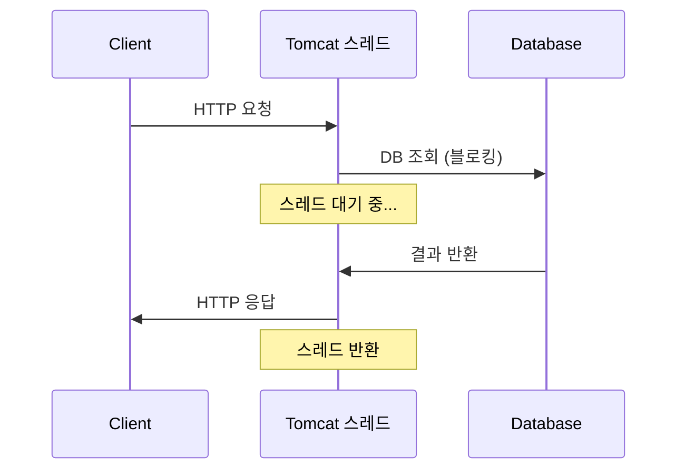
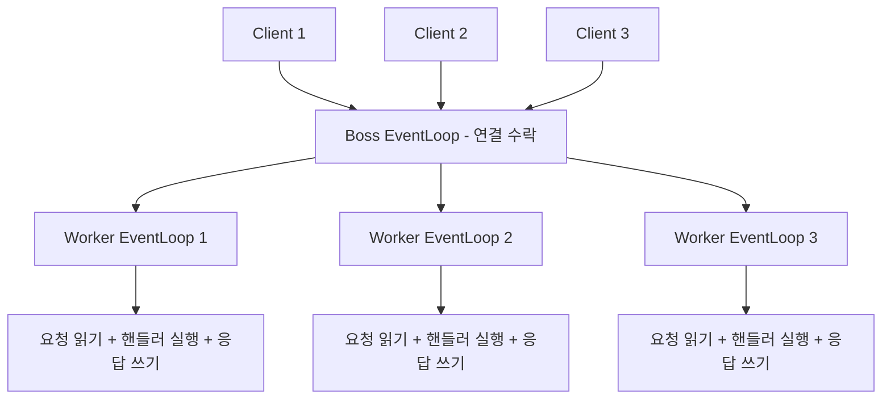
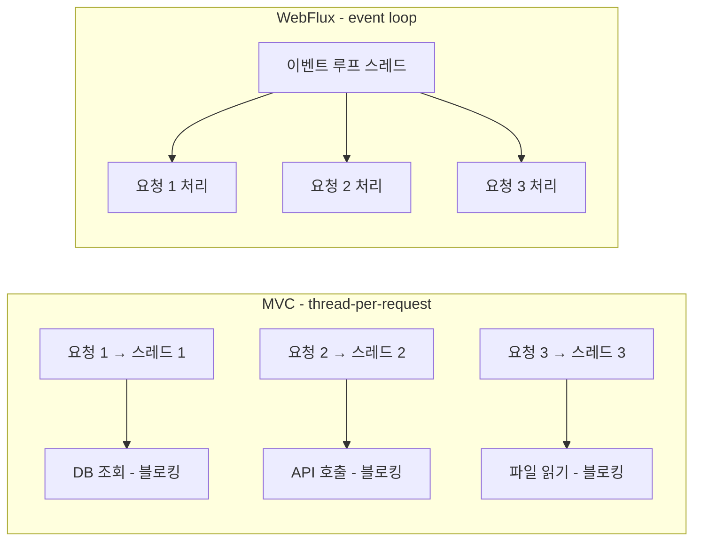
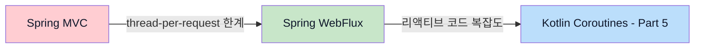

> **JVM 동시성 모델 이해하기 시리즈**
> 
> 1.  [동시성과 병렬성의 기초](/jvm-concurrency-model-1-fundamentals)
> 2.  [Java의 전통적인 동시성 모델](/jvm-concurrency-model-2-java-traditional-concurrency)
> 3.  [Reactive Streams와 Project Reactor](/jvm-concurrency-model-3-reactive-streams-reactor)
> 4.  **[Spring WebFlux](/jvm-concurrency-model-4-spring-webflux) ← 현재 글**
> 5.  [Kotlin Coroutines](/jvm-concurrency-model-5-kotlin-coroutines)
> 6.  [Spring + Coroutines 통합 — WebFlux, MVC, 그리고 AOP의 한계](/jvm-concurrency-model-6-spring-coroutines)
> 7.  [Virtual Thread — 동기 세계의 해법](/jvm-concurrency-model-7-virtual-thread)
> 8.  [총정리 — 언제 무엇을 선택할 것인가](/jvm-concurrency-model-8-conclusion-decision-framework/)

## Reactor가 웹을 만났을 때 — 적은 스레드로 많은 연결을 처리하는 법

Part 3에서 Reactive Streams 스펙과 Project Reactor의 Mono/Flux, 연산자, 스케줄러를 다뤘습니다. Reactor는 비동기 데이터 스트림을 처리하는 강력한 라이브러리이지만, 그 자체로는 HTTP 요청을 받거나 응답을 보내는 기능이 없습니다.

이 글에서는 Reactor 위에 Spring이 구축한 **WebFlux** 프레임워크를 다룹니다. Spring MVC의 어떤 한계를 해결하려고 만들어졌는지, 내부에서 Netty의 이벤트 루프가 어떻게 동작하는지, 그리고 실제로 어떻게 코드를 작성하는지 살펴보겠습니다.

## Spring MVC의 한계 — 1 요청 = 1 스레드

Spring MVC는 **thread-per-request** 모델입니다. HTTP 요청이 들어오면 Tomcat이 스레드 풀에서 스레드 하나를 꺼내서 그 요청을 처리하고, 응답이 완료되면 스레드를 반환합니다.



이 모델은 간단하고 직관적이지만, **스레드가 I/O를 기다리는 동안 아무것도 하지 못한다**는 문제가 있습니다. DB 조회에 500ms, 외부 API 호출에 1초가 걸리면, 그 시간 동안 스레드는 블로킹 상태로 낭비됩니다.

Tomcat의 기본 스레드 풀은 200개입니다. 모든 요청이 외부 API를 호출하고 평균 1초가 걸린다면, 동시에 처리할 수 있는 요청은 최대 200개입니다. 201번째 요청부터는 스레드가 반환될 때까지 큐에서 대기합니다.

| 상황 | 동시 처리 가능 요청 | 병목 |
| --- | --- | --- |
| 단순 CRUD (10ms) | 이론상 매우 많음 | CPU |
| 외부 API 호출 (1초) | ~200 | **스레드 대기** |
| 여러 API 연쇄 호출 (3초) | ~66 | **스레드 대기** |

스레드 풀 크기를 늘리면 되지 않을까요? 스레드는 공짜가 아닙니다. 각 스레드는 스택 메모리(기본 1MB)를 차지하고, 컨텍스트 스위칭 비용이 발생합니다. 스레드 수를 늘리면 메모리 사용량과 스케줄링 오버헤드가 함께 증가합니다. [Part 2](/jvm-concurrency-model-2-java-traditional-concurrency/)에서 다룬 스레드 풀 사이징 원칙을 떠올려보면, 스레드 수를 무한정 늘리는 것은 해결책이 아닙니다.

WebFlux는 이 문제에 대한 다른 접근을 제시합니다 — **스레드를 더 만드는 대신, 적은 스레드가 블로킹 없이 더 많은 요청을 처리하게 하자.**

## Netty와 이벤트 루프 — WebFlux의 엔진

Spring MVC는 **Tomcat**(Servlet 컨테이너) 위에서 동작합니다. Tomcat이 HTTP 연결 수락, 요청 파싱, 응답 전송을 담당하고, Spring MVC는 그 위에서 라우팅과 비즈니스 로직을 처리합니다. Jetty나 Undertow도 선택할 수 있지만 역할은 같습니다.

Spring WebFlux는 기본적으로 **Netty** 위에서 동작합니다. Netty는 논블로킹 I/O 기반의 네트워크 프레임워크로, **이벤트 루프(Event Loop)** 모델을 사용합니다. 둘의 구조를 대칭으로 보면 명확합니다 — **MVC = Spring MVC 프레임워크 + Tomcat(블로킹 네트워크)**, **WebFlux = Reactor 기반 프레임워크 + Netty(논블로킹 네트워크)**.

> **명세와 구현체의 관계를 정리하면:**
> 
> | 계층 | 명세 (인터페이스) | 구현체 |
> | --- | --- | --- |
> | **네트워크** | Servlet 명세 (Jakarta Servlet) | Tomcat, Jetty, Undertow |
> | **리액티브 스트림** | Reactive Streams 명세 | Project Reactor, RxJava |
> | **웹 프레임워크** | — | Spring MVC, Spring WebFlux |
> 
> 여기서 Servlet 명세를 좀 더 정확히 이해할 필요가 있습니다. Servlet 명세는 하나의 구현체가 전부 구현하는 것이 아니라, **컨테이너 쪽**과 **애플리케이션 쪽** 두 쪽의 계약을 정의합니다.
> 
> **Tomcat이 구현하는 쪽 (컨테이너/인프라)**: `HttpServletRequest`, `HttpServletResponse` 같은 인터페이스를 구현합니다. HTTP 바이트를 파싱해서 이 객체들을 만들고, 세션 관리, 스레드 풀 관리 등을 담당합니다.
> 
> **Spring이 구현하는 쪽 (애플리케이션)**: `HttpServlet` 추상 클래스를 확장한 `DispatcherServlet`을 제공합니다. `doGet()`, `doPost()` 같은 메서드를 오버라이드해서 라우팅, 컨트롤러 호출, 뷰 리졸빙 등 웹 프레임워크 기능을 처리합니다.
> 
> 둘이 만나는 흐름은 이렇습니다: HTTP 바이트 도착 → **Tomcat**이 파싱해서 `HttpServletRequest`/`HttpServletResponse` 객체 생성 → **Tomcat**이 `DispatcherServlet.service(request, response)` 호출 → **Spring**의 DispatcherServlet이 request를 읽고, 컨트롤러를 찾아 실행하고, response에 결과를 씀 → **Tomcat**이 response를 HTTP 바이트로 변환해서 네트워크로 전송. Servlet 명세가 컨테이너와 애플리케이션 사이의 **경계**를 인터페이스로 정의해놓은 것이고, Tomcat과 Spring이 각자의 쪽을 구현하면 조합되어 동작하는 구조입니다.
> 
> 반면 **Netty는 어떤 Java 표준 명세의 구현체가 아닙니다.** Java NIO API를 내부적으로 사용하지만, Servlet 같은 표준과는 무관한 **독립적인 비동기 네트워크 프레임워크**입니다. Channel, EventLoop, Pipeline 등 자체 추상화를 제공합니다.
> 
> Tomcat의 원래 설계는 “컨테이너에 앱을 배포(WAR 배포)”하는 방식이고, Netty는 “프레임워크로 앱을 구축”하는 방식입니다. 하지만 **Spring Boot 환경에서는 둘 다 내장(embedded) 서버로 사용**됩니다 — Spring Boot가 MVC 의존성을 감지하면 내장 Tomcat을, WebFlux 의존성을 감지하면 내장 Netty를 자동으로 띄워줍니다. 그래서 개발자 입장에서는 Tomcat이든 Netty든 직접 설정할 일 없이 `java -jar`로 실행하면 됩니다.

### 이벤트 루프란

이벤트 루프는 **하나의 스레드가 무한 루프를 돌며 이벤트를 감시하고 처리하는 구조**입니다. 스레드가 I/O를 기다리며 블로킹되는 대신, “I/O가 준비되면 알려줘”라고 등록해두고 다른 이벤트를 처리합니다.

```java
// 개념적인 이벤트 루프 (실제 Netty 코드와는 다름)
while (true) {
    // 1단계: Selector에서 I/O 이벤트 확인 → 있으면 처리
    List<Event> events = selector.select();
    for (Event event : events) {
        if (event.isReadable()) handleRead(event);
        if (event.isWritable()) handleWrite(event);
        if (event.isAcceptable()) handleAccept(event);
    }

    // 2단계: 태스크 큐에서 작업 확인 → 있으면 처리
    while (!taskQueue.isEmpty()) {
        Runnable task = taskQueue.poll();
        task.run();  // 예: 채널 등록, 타이머 콜백 등
    }
}
```

위 코드가 곧 하나의 EventLoop입니다. **EventLoop = 1개의 스레드**로, 이 스레드가 두 가지 소스를 번갈아 폴링합니다. **Selector**는 네트워크 I/O 이벤트의 소스(“이 채널에 읽을 데이터가 도착했어”)이고, **태스크 큐**는 다른 스레드가 맡긴 일반 작업의 대기열(“이 채널 좀 등록해줘”)입니다. 둘 다 스레드가 능동적으로 확인하러 가는 폴링 방식이며, “무엇을 처리할지”를 알려주는 소스이고, EventLoop 스레드가 실행자입니다. “이벤트 루프를 감시하는 별도의 스레드”가 있는 것이 아니라, **감시자와 처리자가 같은 스레드**입니다.

[Part 1](/jvm-concurrency-model-1-fundamentals/)에서 다룬 Java NIO의 `Selector`가 여기서 핵심 역할을 합니다. 하나의 Selector가 수천 개의 연결을 감시하다가, I/O가 준비된 연결만 골라서 처리합니다.

> **Selector가 수천 개의 채널을 감시하면서도 효율적인 이유**
> 
> Selector 내부에서는 OS 레벨의 I/O 멀티플렉싱(Linux의 **epoll**, macOS의 **kqueue**)이 동작합니다. 초기 방식인 `select()`/`poll()`은 등록된 채널을 처음부터 끝까지 순회하면서 하나씩 확인했습니다 — 10,000개 채널 중 3개만 준비되어도 10,000개를 전부 확인해야 했습니다(O(n)).
> 
> epoll/kqueue는 발상이 다릅니다. 채널을 등록할 때 커널에 “이 채널 상태가 변하면 기억해둬”라고 알려두면, 커널이 네트워크 카드에서 데이터가 도착하는 시점에 해당 채널을 “준비 목록”에 추가합니다. `epoll_wait()`를 호출하면 **준비된 채널만 모아서 반환**합니다 — 10,000개 중 3개가 준비됐으면 그 3개만 돌려주고, 나머지 9,997개는 확인조차 하지 않습니다(O(준비된 수)). 이것이 소수의 EventLoop 스레드로 수만 개의 동시 연결을 감시할 수 있는 핵심 원리입니다.

Node.js도 같은 원리(이벤트 루프)를 사용하지만, Node.js는 **싱글 이벤트 루프**입니다. Netty는 **멀티 이벤트 루프** — 보통 CPU 코어 수만큼의 이벤트 루프 스레드를 가지고 있어서, 멀티코어를 활용합니다.

### Boss와 Worker 이벤트 루프

Netty는 이벤트 루프를 두 그룹으로 나눕니다.



**Boss EventLoopGroup**은 보통 **EventLoop 1개** (= 스레드 1개) 로 구성됩니다. 클라이언트의 연결 요청을 수락(accept)하는 역할만 하고, 연결이 수립되면 Worker에게 넘깁니다.

**Worker EventLoopGroup**은 여러 EventLoop(= 여러 스레드)로 구성되며, 실제 작업을 처리합니다 — 요청 데이터 읽기, 핸들러(비즈니스 로직) 실행, 응답 쓰기를 모두 담당합니다. Worker EventLoop 수는 보통 **CPU 코어 수의 2배**로 설정됩니다. 8코어 서버라면 16개의 Worker EventLoop(= 16개의 스레드)가 수천~수만 개의 동시 연결을 처리합니다.

> **EventLoop의 내부 구조와 Boss → Worker 분배 과정**
> 
> 각 EventLoop는 내부에 **Selector**와 **태스크 큐(task queue)** 두 가지를 가지고 있습니다. 스레드는 무한 루프를 돌면서 두 가지를 번갈아 처리합니다: Selector에서 I/O 이벤트 확인 → 태스크 큐의 작업 처리 → 반복.
> 
> Boss에서 Worker로의 작업 분배 과정은 다음과 같습니다.
> 
> 1.  Boss EventLoop의 Selector가 **ACCEPT 이벤트**를 감지
> 2.  Boss가 연결을 수락하고 SocketChannel을 얻음
> 3.  Boss가 Worker EventLoop 중 하나를 선택(라운드 로빈)하고, **“이 채널을 등록해줘”라는 태스크를 해당 Worker의 태스크 큐에 넣음**
> 4.  Worker가 태스크 큐에서 이 작업을 꺼내서 → 자기 Selector에 채널을 등록
> 5.  이후부터 이 채널의 READ/WRITE 이벤트는 **Worker의 Selector가 직접 감지**
> 
> 여기서 **연결(Connection)과 요청(Request)은 다른 개념**입니다. 하나의 TCP 연결 위에서 여러 HTTP 요청이 올 수 있습니다(HTTP Keep-Alive). Boss가 관여하는 것은 **TCP 연결 수립 시 한 번뿐**입니다. 이후 같은 연결에서 오는 요청들은 Worker의 Selector가 READ 이벤트로 감지하여 직접 처리합니다. 하나의 채널은 등록된 이후 해당 Worker EventLoop에 영구적으로 귀속됩니다.
> 
> 정리하면: 같은 클라이언트의 두 번째 요청 → Worker가 직접 처리 (Boss 안 거침). 새로운 클라이언트의 첫 연결 → Boss가 ACCEPT → Worker에 등록.

### MVC vs WebFlux 요청 처리 비교



MVC에서는 요청마다 스레드가 배정되고, I/O 동안 해당 스레드가 블로킹됩니다. WebFlux에서는 하나의 이벤트 루프 스레드가 여러 요청을 번갈아 처리합니다. I/O 대기 중에는 다른 요청을 처리하고, I/O가 완료되면 돌아와서 이어서 처리합니다.

### 이벤트 루프에서 절대 하면 안 되는 것

이벤트 루프 모델에서 가장 중요한 규칙이 있습니다 — **이벤트 루프 스레드에서 블로킹하지 마라.**

MVC에서는 스레드가 200개이므로 하나가 블로킹되어도 나머지 199개가 일합니다. 하지만 Worker EventLoop 스레드는 **8~16개**뿐입니다(Boss 1개는 연결 수락 전담). 이 중 하나가 블로킹되면 그 EventLoop가 담당하던 **수백~수천 개의 연결이 모두 멈춥니다.**

```java
// WebFlux에서 절대 하면 안 되는 코드
@GetMapping("/users/{id}")
public Mono<User> getUser(@PathVariable Long id) {
    // JDBC는 블로킹 — 이벤트 루프 스레드를 막음!
    User user = jdbcTemplate.queryForObject("SELECT ...", User.class, id);
    return Mono.just(user);
}

// 올바른 방법: 블로킹 작업을 boundedElastic으로 격리
@GetMapping("/users/{id}")
public Mono<User> getUser(@PathVariable Long id) {
    return Mono.fromCallable(() -> jdbcTemplate.queryForObject("SELECT ...", User.class, id))
        .subscribeOn(Schedulers.boundedElastic());
}
```

[Part 3](/jvm-concurrency-model-3-reactive-streams-reactor/)에서 다룬 `subscribeOn(Schedulers.boundedElastic())`이 여기서 실전적으로 쓰입니다. 블로킹 I/O를 전용 스레드 풀로 격리해서 이벤트 루프 스레드를 보호하는 것입니다.

## Spring MVC vs WebFlux — 구조 비교

WebFlux는 Spring MVC를 **대체**하는 것이 아니라, **다른 워크로드에 적합한 대안**입니다. 둘 다 Spring Framework 안에 공존하며, 프로젝트 특성에 따라 선택합니다.

### 공통점

둘은 생각보다 많은 것을 공유합니다. `@Controller`, `@RestController`, `@RequestMapping`, `@GetMapping` 같은 어노테이션을 동일하게 사용할 수 있습니다. Spring Security, Bean Validation 등도 양쪽에서 동작합니다. MVC 경험이 있는 개발자가 WebFlux로 전환할 때 학습 비용이 상대적으로 낮은 이유입니다.

### 차이점

| 항목 | Spring MVC | Spring WebFlux |
| --- | --- | --- |
| **기본 서버** | Tomcat (Servlet) | Netty (논블로킹) |
| **스레드 모델** | thread-per-request (~200) | event loop (~코어 수 \* 2) |
| **반환 타입** | `T`, `ResponseEntity<T>` | `Mono<T>`, `Flux<T>` |
| **I/O** | 블로킹 자연스러움 | 논블로킹 필수 |
| **DB 접근** | JDBC, JPA | R2DBC, 리액티브 드라이버 |
| **HTTP 클라이언트** | RestClient (Spring 6.1+) | WebClient |
| **스트리밍** | 제한적 | SSE, WebSocket 자연스러움 |

### 언제 무엇을 선택하는가

**MVC가 적합한 경우**: 대부분의 웹 애플리케이션이 여기에 해당합니다. JDBC/JPA 기반의 CRUD, 블로킹 라이브러리에 의존하는 프로젝트, 팀이 리액티브에 익숙하지 않은 경우에는 MVC가 더 나은 선택입니다. 블로킹 I/O가 병목이 아니라면 WebFlux로 전환해도 체감 성능 차이가 크지 않습니다.

**WebFlux가 적합한 경우**: 대량의 동시 연결을 처리해야 하는 경우(채팅, 알림, 스트리밍), 마이크로서비스 간 논블로킹 통신이 많은 경우, 또는 전체 스택을 리액티브(R2DBC, WebClient, 리액티브 Redis 등)로 구성할 수 있는 경우에 WebFlux의 장점이 드러납니다.

> 주의할 점은, WebFlux를 사용하면서 내부적으로 블로킹 호출을 많이 하면 오히려 MVC보다 복잡하고 성능도 나빠질 수 있다는 것입니다. WebFlux의 장점은 **전체 파이프라인이 논블로킹**일 때 극대화됩니다. 부분적으로 블로킹이 섞이면 `boundedElastic` 격리 코드가 늘어나고, 리액티브의 복잡도만 추가됩니다.

### 성능 벤치마크 — 숫자로 보는 차이

MVC와 WebFlux의 성능 차이는 **동시 연결 수**에 따라 극적으로 달라집니다.

| 시나리오 | Spring MVC | Spring WebFlux (논블로킹) |
| --- | --- | --- |
| **낮은 동시성** (50 연결) | 차이 미미 | 차이 미미 |
| **높은 동시성** (1,000+ 연결) | 스레드 고갈, 큐 대기 발생 | 안정적 처리 |
| **I/O 대기 500ms** | ~200 동시 요청이 한계 | 수천 동시 요청 가능 |
| **스레드 사용** | ~200개 | ~16개 (코어 수 × 2) |
| **p99 응답 시간 (고부하)** | 수 초 (큐잉) | 수백 ms |

여러 벤치마크에서 공통적으로 나타나는 패턴은 다음과 같습니다. 동시 연결이 적을 때는 MVC와 WebFlux의 처리량(throughput)과 응답 시간이 거의 같습니다. 하지만 동시 연결이 스레드 풀 크기를 넘어서면 MVC는 급격히 성능이 저하됩니다 — 요청이 큐에 쌓이면서 p99 지연 시간이 수 초까지 올라갑니다. WebFlux는 이 구간에서도 안정적인 응답 시간을 유지합니다.

> 이 수치는 다양한 벤치마크에서 관찰되는 일반적 경향입니다. 실제 성능은 I/O 대기 시간, 비즈니스 로직 복잡도, 하드웨어 등에 따라 달라집니다. 직접적인 벤치마크 결과는 [Aleksandr Filichkin의 MVC vs WebFlux 비교](https://filia-aleks.medium.com/microservice-performance-battle-spring-mvc-vs-webflux-80d39fd81bf0), [The Practical Developer의 성능 분석](https://thepracticaldeveloper.com/full-reactive-stack-4-conclusions/), [Ippon Technologies의 WebFlux 성능 테스트](https://blog.ippon.tech/spring-5-webflux-performance-tests) 등에서 확인할 수 있습니다.

핵심은 명확합니다 — WebFlux는 **“더 빠른 프레임워크”가 아니라 “더 많은 동시 연결을 적은 리소스로 처리하는 프레임워크”**입니다.

## WebFlux 핸들러 — 두 가지 프로그래밍 모델

WebFlux는 요청을 처리하는 두 가지 방법을 제공합니다.

### 어노테이션 방식 — MVC와 동일한 스타일

기존 MVC 개발자에게 가장 익숙한 방식입니다. 반환 타입만 `Mono`/`Flux`로 바꾸면 됩니다.

```java
@RestController
@RequestMapping("/users")
public class UserController {

    private final UserRepository userRepository;  // 리액티브 Repository

    @GetMapping("/{id}")
    public Mono<User> getUser(@PathVariable Long id) {
        return userRepository.findById(id);
    }

    @GetMapping
    public Flux<User> getAllUsers() {
        return userRepository.findAll();
    }

    @PostMapping
    public Mono<User> createUser(@RequestBody User user) {
        return userRepository.save(user);
    }
}
```

MVC의 Controller와 거의 동일합니다. `@RestController`, `@GetMapping`, `@RequestBody` 등이 모두 같습니다. 차이는 메서드가 `User` 대신 `Mono<User>`를 반환한다는 것뿐입니다. 프레임워크가 반환된 Mono/Flux를 subscribe()해서 결과를 HTTP 응답으로 변환합니다.

### 함수형 엔드포인트 — RouterFunction + HandlerFunction

라우팅을 코드로 정의하는 방식입니다.

```java
@Configuration
public class RouterConfig {

    @Bean
    public RouterFunction<ServerResponse> userRoutes(UserHandler handler) {
        return RouterFunctions.route()
            .GET("/users/{id}", handler::getUser)
            .GET("/users", handler::getAllUsers)
            .POST("/users", handler::createUser)
            .build();
    }
}

@Component
public class UserHandler {

    private final UserRepository userRepository;

    public Mono<ServerResponse> getUser(ServerRequest request) {
        Long id = Long.parseLong(request.pathVariable("id"));
        return userRepository.findById(id)
            .flatMap(user -> ServerResponse.ok().bodyValue(user))
            .switchIfEmpty(ServerResponse.notFound().build());
    }

    public Mono<ServerResponse> getAllUsers(ServerRequest request) {
        return ServerResponse.ok().body(userRepository.findAll(), User.class);
    }

    public Mono<ServerResponse> createUser(ServerRequest request) {
        return request.bodyToMono(User.class)
            .flatMap(userRepository::save)
            .flatMap(user -> ServerResponse.created(URI.create("/users/" + user.getId()))
                .bodyValue(user));
    }
}
```

**RouterFunction**이 “어떤 경로를 어떤 핸들러에 연결할지” 정의하고, **HandlerFunction**이 실제 요청 처리 로직을 담당합니다.

### 두 방식의 선택 기준

| 항목 | 어노테이션 방식 | 함수형 방식 |
| --- | --- | --- |
| **학습 비용** | 낮음 (MVC와 동일) | 높음 (새로운 패턴) |
| **라우팅 정의** | 어노테이션 분산 | 코드 한 곳에 집중 |
| **테스트** | MockMvc 스타일 | 함수 단위 테스트 용이 |
| **적합한 상황** | 대부분의 프로젝트 | API Gateway, 동적 라우팅 |

실무에서는 **어노테이션 방식이 압도적으로 많이** 사용됩니다. MVC에서 전환이 쉽고, 팀 전체가 익숙한 패턴이기 때문입니다. 함수형 방식은 라우팅을 프로그래밍적으로 제어해야 하는 특수한 경우(예: 설정 기반 동적 라우팅)에 유용합니다.

## WebClient — 논블로킹 HTTP 클라이언트

WebFlux에서 외부 API를 호출할 때는 **WebClient**를 사용합니다. Spring MVC의 동기 HTTP 클라이언트는 이벤트 루프 스레드에서 사용하면 안 됩니다 — 블로킹이기 때문입니다.

> Spring MVC의 HTTP 클라이언트는 세대별로 `RestTemplate` → `RestClient`(Spring 6.1+)로 진화했습니다. `RestTemplate`은 현재 유지 모드(maintenance mode)이고, 새 MVC 프로젝트에서는 `RestClient`가 권장됩니다. `RestClient`는 `WebClient`와 유사한 플루언트 API를 제공하지만 **동기 블로킹** 방식입니다. 반면 `WebClient`는 **논블로킹** 클라이언트로, WebFlux 의존성에 포함되어 있지만 MVC 프로젝트에서도 사용할 수 있습니다.

### 기본 사용법

```java
WebClient client = WebClient.builder()
    .baseUrl("https://api.example.com")
    .build();

// GET 요청
Mono<User> user = client.get()
    .uri("/users/{id}", 1)
    .retrieve()
    .bodyToMono(User.class);

// POST 요청
Mono<User> created = client.post()
    .uri("/users")
    .bodyValue(new User("Alice", "alice@example.com"))
    .retrieve()
    .bodyToMono(User.class);

// 에러 처리
Mono<User> userWithErrorHandling = client.get()
    .uri("/users/{id}", 1)
    .retrieve()
    .onStatus(HttpStatusCode::is4xxClientError,
        response -> Mono.error(new UserNotFoundException()))
    .onStatus(HttpStatusCode::is5xxServerError,
        response -> Mono.error(new ServiceException("외부 API 오류")))
    .bodyToMono(User.class);
```

### RestClient / RestTemplate과 비교

```java
// RestClient (Spring 6.1+) — 동기 블로킹, 플루언트 API
User user = restClient.get()
    .uri("/users/1")
    .retrieve()
    .body(User.class);
sendEmail(user);

// WebClient — 논블로킹, 파이프라인으로 연결
webClient.get().uri("/users/1")
    .retrieve()
    .bodyToMono(User.class)
    .flatMap(user -> sendEmailReactive(user))
    .subscribe();
```

`RestClient`와 `WebClient`의 API 형태가 비슷한 것을 볼 수 있습니다. 차이는 `RestClient`가 `body()`로 즉시 값을 반환하는 반면, `WebClient`는 `bodyToMono()`로 Mono를 반환한다는 것입니다 — **동기 vs 비동기의 차이가 반환 타입에 그대로 드러납니다.**

WebClient는 Part 3에서 다룬 Reactor의 연산자를 그대로 사용합니다. `flatMap`으로 비동기 체이닝, `onErrorResume`으로 에러 처리, `retry`로 재시도 — Reactor에서 배운 모든 것이 WebClient에 적용됩니다.

### 타임아웃과 재시도

```java
Mono<User> resilientCall = webClient.get()
    .uri("/users/{id}", 1)
    .retrieve()
    .bodyToMono(User.class)
    .timeout(Duration.ofSeconds(3))
    .retryWhen(Retry.backoff(3, Duration.ofSeconds(1))
        .maxBackoff(Duration.ofSeconds(10)))
    .onErrorResume(e -> Mono.empty());
```

`timeout`, `retryWhen`, `onErrorResume` 모두 Part 3에서 다룬 Reactor 연산자입니다. WebFlux에서는 이런 탄력성 패턴을 연산자 조합으로 선언적으로 표현할 수 있습니다.

## SSE와 WebSocket — 스트리밍 엔드포인트

WebFlux의 강점이 가장 잘 드러나는 영역이 **스트리밍**입니다. MVC에서는 요청-응답이 1:1이지만, WebFlux에서는 **하나의 요청에 여러 개의 응답을 시간에 걸쳐** 보낼 수 있습니다.

### Server-Sent Events (SSE)

SSE는 **서버 → 클라이언트 단방향 스트리밍**입니다. 서버가 클라이언트에게 실시간으로 이벤트를 보내는 데 사용합니다. WebFlux에서는 `Flux`를 반환하면 SSE가 자동으로 동작합니다.

```java
@GetMapping(value = "/notifications", produces = MediaType.TEXT_EVENT_STREAM_VALUE)
public Flux<Notification> streamNotifications() {
    return notificationService.getNotificationStream();
}

// 주기적으로 서버 시간을 전송하는 예시
@GetMapping(value = "/time", produces = MediaType.TEXT_EVENT_STREAM_VALUE)
public Flux<String> streamTime() {
    return Flux.interval(Duration.ofSeconds(1))
        .map(tick -> "현재 시각: " + LocalTime.now());
}
```

`produces = MediaType.TEXT_EVENT_STREAM_VALUE`를 지정하면 응답이 `text/event-stream` 타입으로 전송됩니다. Flux가 데이터를 방출할 때마다 클라이언트에게 이벤트가 전달되고, `onComplete()`가 호출되면 스트림이 종료됩니다.

> **클라이언트에서 SSE를 어떻게 받는가?** 브라우저에는 `EventSource`라는 네이티브 API가 있습니다. React 등의 프레임워크에서도 이걸 그대로 사용할 수 있습니다.
> 
> ```javascript
> // 브라우저 네이티브 EventSource API
> const eventSource = new EventSource("/notifications");
> eventSource.onmessage = (event) => {
>     console.log("새 알림:", event.data);
> };
> eventSource.onerror = () => eventSource.close();
> ```
> 
> `EventSource`는 자동 재연결, 마지막 이벤트 ID 추적 등을 내장하고 있어서 별도 라이브러리 없이도 충분합니다. 더 세밀한 제어(커스텀 헤더, POST 요청 등)가 필요하면 Fetch API의 `ReadableStream`을 직접 다루거나, `@microsoft/fetch-event-source` 같은 라이브러리를 사용할 수 있습니다.

### WebSocket

WebSocket은 **클라이언트 ↔ 서버 양방향 실시간 통신**입니다. 채팅, 실시간 게임, 협업 도구 같은 곳에 사용합니다.

```java
@Component
public class ChatWebSocketHandler implements WebSocketHandler {

    private final Sinks.Many<String> chatSink =
        Sinks.many().multicast().onBackpressureBuffer();

    @Override
    public Mono<Void> handle(WebSocketSession session) {
        // 클라이언트에서 받은 메시지를 Sink에 주입
        Mono<Void> input = session.receive()
            .map(WebSocketMessage::getPayloadAsText)
            .doOnNext(chatSink::tryEmitNext)
            .then();

        // Sink의 메시지를 모든 클라이언트에게 전송
        Mono<Void> output = session.send(
            chatSink.asFlux()
                .map(session::textMessage)
        );

        return Mono.zip(input, output).then();
    }
}

// WebSocket 핸들러 등록
@Configuration
public class WebSocketConfig {

    @Bean
    public HandlerMapping webSocketMapping(ChatWebSocketHandler handler) {
        Map<String, WebSocketHandler> map = Map.of("/chat", handler);
        SimpleUrlHandlerMapping mapping = new SimpleUrlHandlerMapping();
        mapping.setUrlMap(map);
        mapping.setOrder(-1);
        return mapping;
    }
}
```

Part 3에서 다룬 **Sinks**가 여기서 실전으로 쓰입니다. `Sinks.many().multicast()`로 Hot Publisher를 만들고, 클라이언트에서 받은 메시지를 `tryEmitNext()`로 주입하면, 구독 중인 모든 세션에 메시지가 전달됩니다.

### SSE vs WebSocket 선택 기준

| 항목 | SSE | WebSocket |
| --- | --- | --- |
| **방향** | 서버 → 클라이언트 (단방향) | 양방향 |
| **프로토콜** | HTTP 위에서 동작 | 독립 프로토콜 (ws://) |
| **재연결** | 브라우저가 자동 재연결 | 직접 구현 필요 |
| **적합한 상황** | 알림, 피드, 대시보드 갱신 | 채팅, 게임, 협업 |

대부분의 실시간 갱신은 SSE로 충분합니다. 클라이언트에서 서버로도 실시간 메시지를 보내야 하는 경우에만 WebSocket을 사용합니다.

## 에러 처리 — MVC 스타일과 WebFlux 스타일

WebFlux의 에러 처리는 두 계층으로 나뉩니다.

### @ExceptionHandler — MVC와 동일

MVC에서 사용하던 `@ExceptionHandler`가 WebFlux에서도 동일하게 동작합니다.

```java
@RestControllerAdvice
public class GlobalExceptionHandler {

    @ExceptionHandler(UserNotFoundException.class)
    public ResponseEntity<ErrorResponse> handleUserNotFound(UserNotFoundException e) {
        return ResponseEntity.status(HttpStatus.NOT_FOUND)
            .body(new ErrorResponse("USER_NOT_FOUND", e.getMessage()));
    }

    @ExceptionHandler(ServiceException.class)
    public ResponseEntity<ErrorResponse> handleServiceError(ServiceException e) {
        return ResponseEntity.status(HttpStatus.INTERNAL_SERVER_ERROR)
            .body(new ErrorResponse("SERVICE_ERROR", e.getMessage()));
    }
}
```

### Reactor 파이프라인 내 에러 처리

[Part 3](/jvm-concurrency-model-3-reactive-streams-reactor/)에서 다룬 `onErrorResume`, `onErrorReturn` 등을 파이프라인 안에서 사용합니다.

```java
@GetMapping("/users/{id}")
public Mono<ResponseEntity<User>> getUser(@PathVariable Long id) {
    return userRepository.findById(id)
        .map(ResponseEntity::ok)
        .onErrorResume(DatabaseException.class,
            e -> Mono.just(ResponseEntity.status(503).build()))
        .defaultIfEmpty(ResponseEntity.notFound().build());
}
```

두 방식은 배타적이지 않습니다. 파이프라인에서 처리하지 못한 에러는 `@ExceptionHandler`로 올라가므로, 파이프라인 레벨에서는 비즈니스 로직 관련 에러를 처리하고, `@ExceptionHandler`에서는 글로벌 공통 에러를 처리하는 계층 구조를 만들 수 있습니다.

## 테스트

WebFlux는 전용 테스트 도구를 제공합니다. 먼저 MVC와 WebFlux의 테스트 도구를 비교해보겠습니다.

| 항목 | Spring MVC | Spring WebFlux |
| --- | --- | --- |
| **컨트롤러 단위 테스트** | MockMvc / MockMvcTester (6.2+) | WebTestClient |
| **통합 테스트 (실서버)** | TestRestTemplate | WebTestClient |
| **스트림 검증** | — | StepVerifier |

> Spring MVC의 **MockMvc**는 실제 HTTP 통신 없이 DispatcherServlet을 통해 요청을 처리합니다 — 빠르고 가벼운 컨트롤러 단위 테스트 도구입니다. Spring 6.2+에서는 AssertJ 스타일 단언을 제공하는 **MockMvcTester**가 추가되었습니다. 통합 테스트에는 실제 서버를 띄워서 HTTP를 보내는 **TestRestTemplate**을 사용합니다. 한편 `WebTestClient`도 Spring 5.3부터 **MockMvc에 바인딩**할 수 있어서, MVC 컨트롤러를 WebFlux 스타일 API로 테스트하는 것도 가능합니다.

### WebTestClient

`WebTestClient`는 WebFlux 애플리케이션을 테스트하는 논블로킹 HTTP 클라이언트입니다.

```java
@WebFluxTest(UserController.class)
class UserControllerTest {

    @Autowired
    private WebTestClient webTestClient;

    @MockBean
    private UserRepository userRepository;

    @Test
    void getUser_shouldReturnUser() {
        User mockUser = new User(1L, "Alice");
        when(userRepository.findById(1L)).thenReturn(Mono.just(mockUser));

        webTestClient.get().uri("/users/1")
            .exchange()
            .expectStatus().isOk()
            .expectBody(User.class)
            .isEqualTo(mockUser);
    }

    @Test
    void getUser_shouldReturn404WhenNotFound() {
        when(userRepository.findById(99L)).thenReturn(Mono.empty());

        webTestClient.get().uri("/users/99")
            .exchange()
            .expectStatus().isNotFound();
    }
}
```

### StepVerifier — Reactor 스트림 검증

Part 3에서 다루지 않았지만, Reactor의 `StepVerifier`는 리액티브 스트림의 동작을 단계별로 검증하는 도구입니다.

```java
@Test
void shouldEmitThreeUsersAndComplete() {
    Flux<User> users = userService.findActiveUsers();

    StepVerifier.create(users)
        .expectNextCount(3)
        .verifyComplete();
}

@Test
void shouldHandleErrorGracefully() {
    Mono<User> user = userService.findById(999L);

    StepVerifier.create(user)
        .expectError(UserNotFoundException.class)
        .verify();
}
```

`StepVerifier`는 리액티브 파이프라인이 “어떤 순서로 어떤 시그널을 방출하는지”를 정밀하게 검증합니다. `expectNext`로 값을, `expectError`로 에러를, `verifyComplete`로 완료 시그널을 확인합니다.

## 마무리 — WebFlux는 만능이 아니다

이 글에서 다룬 내용을 정리하면 이렇습니다.

| 개념 | 핵심 |
| --- | --- |
| **MVC의 한계** | 스레드가 I/O 대기 중 블로킹 → 동시 처리 수 = 스레드 수 |
| **이벤트 루프** | 소수 스레드가 논블로킹 I/O로 대량 연결 처리 |
| **WebFlux** | Reactor + Netty 기반의 논블로킹 웹 프레임워크 |
| **핵심 규칙** | 이벤트 루프 스레드에서 블로킹 금지 |

WebFlux를 도입할 때 가장 많이 하는 실수는 **“MVC보다 빠르다”**는 기대입니다. WebFlux는 MVC보다 **처리량(throughput)이 높은 것이지, 개별 요청의 응답 속도(latency)가 빠른 것이 아닙니다.** 같은 DB 조회가 100ms 걸리면, MVC든 WebFlux든 100ms입니다. WebFlux의 장점은 그 100ms 동안 스레드가 다른 요청을 처리할 수 있다는 것입니다.



WebFlux의 리액티브 코드는 강력하지만, `flatMap` 체이닝과 Mono/Flux 반환 타입이 코드의 가독성을 떨어뜨린다는 피드백도 많습니다. 다음 글에서는 이 문제를 해결하는 **Kotlin Coroutines**를 다룹니다. 리액티브의 논블로킹 장점을 유지하면서, 마치 동기 코드처럼 자연스럽게 비동기 로직을 작성하는 방법을 살펴보겠습니다.

## 참고 자료

-   [Spring WebFlux Reference](https://docs.spring.io/spring-framework/reference/web/webflux.html)
-   [Spring RestClient Reference](https://docs.spring.io/spring-framework/reference/integration/rest-clients.html)
-   [Netty — User Guide](https://netty.io/wiki/user-guide-for-4.x.html)
-   [Baeldung — Spring WebFlux Guide](https://www.baeldung.com/spring-webflux)
-   [Spring WebClient Reference](https://docs.spring.io/spring-framework/reference/web/webflux-webclient.html)
-   [MVC vs WebFlux 성능 비교 — Aleksandr Filichkin](https://filia-aleks.medium.com/microservice-performance-battle-spring-mvc-vs-webflux-80d39fd81bf0)
