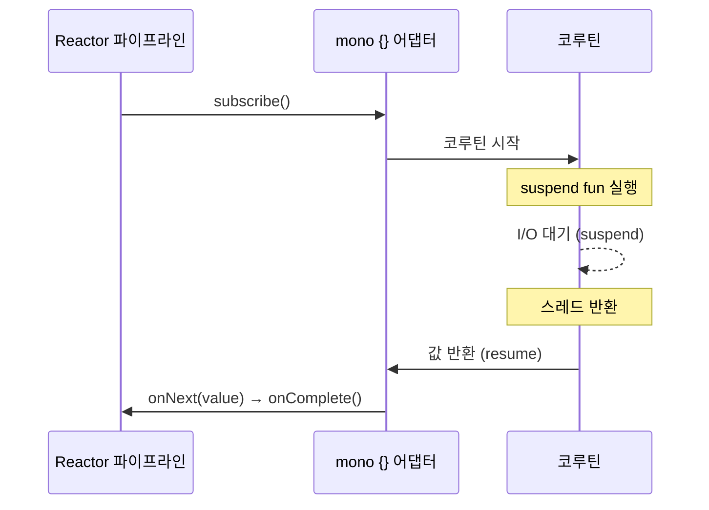
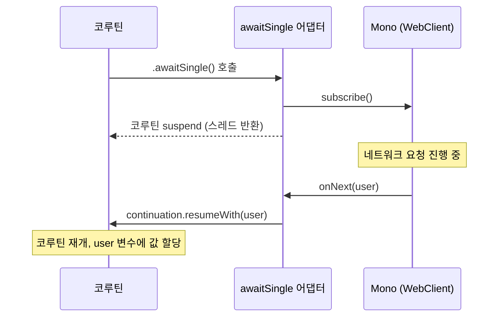
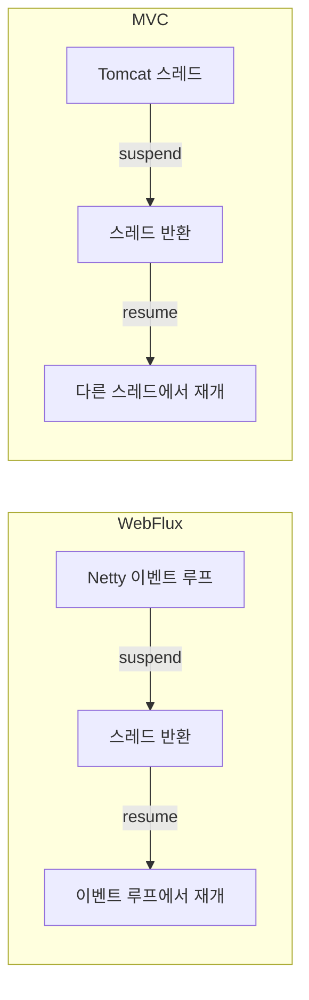
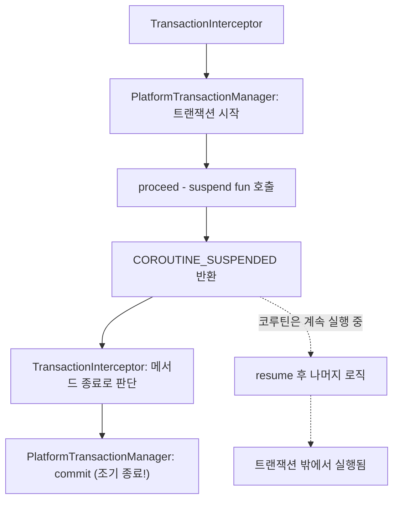
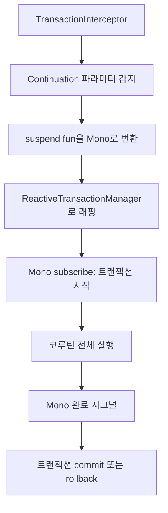
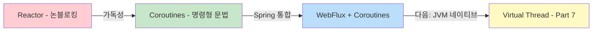

> **JVM 동시성 모델 이해하기 시리즈**
> 
> 1.  [동시성과 병렬성의 기초](/jvm-concurrency-model-1-fundamentals)
> 2.  [Java의 전통적인 동시성 모델](/jvm-concurrency-model-2-java-traditional-concurrency)
> 3.  [Reactive Streams와 Project Reactor](/jvm-concurrency-model-3-reactive-streams-reactor)
> 4.  [Spring WebFlux](/jvm-concurrency-model-4-spring-webflux)
> 5.  [Kotlin Coroutines](/jvm-concurrency-model-5-kotlin-coroutines)
> 6.  **[Spring + Coroutines 통합 — WebFlux, MVC, 그리고 AOP의 한계](/jvm-concurrency-model-6-spring-coroutines) ← 현재 글**
> 7.  [Virtual Thread — 동기 세계의 해법](/jvm-concurrency-model-7-virtual-thread)
> 8.  [총정리 — 언제 무엇을 선택할 것인가](/jvm-concurrency-model-8-conclusion-decision-framework/)

## Reactor 위에서 동기 코드를 쓴다 — Spring이 suspend fun을 처리하는 방식

[Part 5](/jvm-concurrency-model-5-kotlin-coroutines/)에서 코루틴의 원리를 다뤘습니다 — CPS 변환, 상태 머신, Flow, 구조화된 동시성. 코루틴이 “동기 코드처럼 보이지만 논블로킹인” 코드를 가능하게 해준다는 것을 이해했습니다. 하지만 한 가지 의문이 남아 있습니다.

**Spring WebFlux는 Reactor 기반입니다.** [Part 4](/jvm-concurrency-model-4-spring-webflux/)에서 다뤘듯이, WebFlux의 요청 처리 파이프라인은 Mono/Flux를 통해 흐릅니다. 컨트롤러가 `Mono<User>`를 반환해야 Reactor가 처리할 수 있습니다. 그런데 코루틴 컨트롤러는 `suspend fun getUser(): User`를 선언합니다 — Mono도 Flux도 없습니다.

```kotlin
// 이 코드가 어떻게 Reactor 파이프라인에서 실행되는가?
@GetMapping("/users/{id}")
suspend fun getUser(@PathVariable id: Long): User {
    return userService.findById(id)
}
```

이 글에서는 **코루틴과 Reactor 사이의 다리** — `kotlinx-coroutines-reactor` 어댑터 — 가 어떻게 두 세계를 연결하는지 살펴봅니다. 그리고 같은 코루틴 코드가 Spring WebFlux와 Spring MVC에서 어떻게 다르게 동작하는지 비교합니다.

## kotlinx-coroutines-reactor — 두 세계의 다리

코루틴과 Reactor는 별개의 기술이지만, 본질적으로 같은 일을 합니다 — **논블로킹 비동기 처리**. [Part 5](/jvm-concurrency-model-5-kotlin-coroutines/)에서 정리한 것처럼, Reactor는 `flatMap` 체이닝과 `onNext()` 콜백으로, 코루틴은 `suspend`/`resume`과 상태 머신으로 같은 목표를 달성합니다. [`kotlinx-coroutines-reactor`](https://kotlinlang.org/api/kotlinx.coroutines/kotlinx-coroutines-reactor/)는 이 두 가지 비동기 표현 방식을 **서로 번역**해주는 어댑터 라이브러리입니다.

번역에는 두 가지 방향이 있습니다.

### 코루틴 → Reactor: `mono {}`와 `flux {}`

“내가 작성한 코루틴 코드를 Reactor 파이프라인에 태우고 싶다” — 이때 `mono {}`와 `flux {}` 빌더를 사용합니다.

```kotlin
// mono {} — suspend fun의 결과를 Mono로 감싸기
val userMono: Mono<User> = mono {
    // 이 블록은 코루틴으로 실행됨
    userService.findById(1L)  // suspend fun 호출 가능
}

// flux {} — 여러 값을 Flux로 방출
val usersFlux: Flux<User> = flux {
    for (id in listOf(1L, 2L, 3L)) {
        send(userService.findById(id))  // 각 값이 Flux.onNext()가 됨
    }
}
```

`mono {}`의 내부 동작을 단계별로 보겠습니다.

**1단계**: `mono {}`는 `Mono` 객체를 하나 만들어 즉시 반환합니다. 이 시점에서는 블록 안의 코드가 **아무것도 실행되지 않습니다** — Reactor의 Cold 특성과 같습니다.

**2단계**: Reactor 파이프라인이 이 Mono를 `subscribe()`하면 — 그때 비로소 코루틴이 시작됩니다.

**3단계**: 코루틴이 값을 반환하면 `Mono.onNext(value)` → `onComplete()`로 전달됩니다. 예외가 발생하면 `Mono.onError(exception)`으로 전달됩니다.



즉 **코루틴의 시작과 완료가 Mono의 subscribe와 onNext에 매핑**되는 구조입니다. `flux {}`도 같은 원리인데, `send()`로 방출하는 각 값이 `Flux.onNext()`가 되고, 코루틴이 끝나면 `onComplete()`가 호출됩니다.

### Reactor → 코루틴: `awaitSingle()`과 `asFlow()`

반대 방향입니다. “기존의 Reactor 코드(WebClient, R2DBC 등)를 코루틴 안에서 쓰고 싶다” — 이때 `awaitSingle()`, `asFlow()` 등의 확장 함수를 사용합니다.

```kotlin
suspend fun getUser(id: Long): User {
    // Mono를 반환하는 WebClient 호출 → awaitSingle()로 코루틴에서 사용
    return webClient.get()
        .uri("/users/$id")
        .retrieve()
        .bodyToMono<User>()
        .awaitSingle()    // Mono → suspend
}

suspend fun getAllUsers(): Flow<User> {
    // Flux를 반환하는 호출 → asFlow()로 변환
    return webClient.get()
        .uri("/users")
        .retrieve()
        .bodyToFlux<User>()
        .asFlow()         // Flux → Flow
}
```

`awaitSingle()`의 내부 동작은 이렇습니다.

**1단계**: Mono를 `subscribe()`합니다.

**2단계**: 현재 코루틴을 **suspend** — 스레드가 반환됩니다.

**3단계**: Mono가 `onNext(value)`를 emit하면 → `continuation.resumeWith(Result.success(value))`를 호출해서 코루틴을 **resume**합니다.

**4단계**: Mono가 `onError(e)`를 emit하면 → `continuation.resumeWith(Result.failure(e))`를 호출해서 코루틴에 예외를 던집니다.

[Part 5](/jvm-concurrency-model-5-kotlin-coroutines/)에서 다룬 `Continuation.resumeWith()`가 바로 여기서 쓰입니다. Mono의 `onNext` 콜백 안에서 코루틴의 continuation을 호출하여 중단된 코루틴을 깨우는 것입니다.



`asFlow()`도 같은 원리입니다 — Flux를 `subscribe()`하고, 각 `onNext`마다 Flow의 `emit()`으로 변환합니다. Flux가 `onComplete()`를 emit하면 Flow가 종료됩니다.

### 변환 함수 정리

| 변환 방향 | 함수 | 설명 |
| --- | --- | --- |
| suspend → Mono | `mono { }` | 코루틴 블록의 결과를 Mono로 감싸기 |
| suspend → Flux | `flux { }` | 코루틴 블록에서 send()로 여러 값을 Flux로 방출 |
| Mono → suspend | `awaitSingle()` | Mono의 값을 기다려서 반환 (값 없으면 예외) |
| Mono → suspend | `awaitSingleOrNull()` | Mono의 값을 기다려서 반환 (값 없으면 null) |
| Flux → Flow | `.asFlow()` | Flux를 Flow로 변환 |
| Flow → Flux | `.asFlux()` | Flow를 Flux로 변환 |

> **핵심 인사이트**: 코루틴과 Reactor가 “협력”하는 게 아니라, 어댑터가 한쪽의 API를 다른 쪽으로 **번역**해주는 것입니다. Mono의 `subscribe()`/`onNext()` 콜백과 코루틴의 `suspend`/`resume`이 본질적으로 같은 일(비동기 콜백)을 하기 때문에 번역이 가능합니다. [Part 5](/jvm-concurrency-model-5-kotlin-coroutines/)에서 “Reactor와 코루틴은 본질적으로 같은 일을 한다”고 정리한 것의 실제 증거입니다.

## Spring WebFlux + Coroutines — 실전 적용

어댑터를 이해했으니, Spring WebFlux에서 실제로 어떻게 쓰이는지 보겠습니다.

### Spring이 suspend fun을 처리하는 방법

Spring WebFlux에서 컨트롤러를 `suspend fun`으로 선언하면, Spring이 내부적으로 어댑터를 사용해서 Reactor 파이프라인에 연결합니다.

```kotlin
@RestController
class UserController(private val userService: UserService) {

    // 우리가 작성하는 코드
    @GetMapping("/users/{id}")
    suspend fun getUser(@PathVariable id: Long): User {
        return userService.findById(id)
    }
}
```

Spring은 이 `suspend fun`을 발견하면 내부적으로 [`CoroutinesUtils.invokeSuspendingFunction()`](https://docs.spring.io/spring-framework/reference/languages/kotlin/coroutines.html)을 호출하여, 개념적으로 이런 변환을 수행합니다.

```xml
// Spring이 내부적으로 하는 일 (개념적)
fun getUser(id: Long): Mono<User> = mono(Dispatchers.Unconfined) {
    userService.findById(id)
}
```

`Dispatchers.Unconfined`를 사용하는 것에 주목하세요. 다른 디스패처와 비교하면 왜 이것을 선택했는지 이해할 수 있습니다. 모든 디스패처는 코루틴을 현재 스레드에서 시작하고 첫 번째 suspend 지점까지 같은 스레드에서 실행합니다 — 여기까지는 같습니다. 차이는 **resume 후**입니다.

`Dispatchers.Default`나 `Dispatchers.IO`를 사용하면, resume 시 코루틴이 해당 스레드 풀의 큐에 넣어지고 풀의 스레드가 꺼내서 실행합니다 — 즉 **디스패치(스케줄링)** 과정을 거칩니다. 반면 `Dispatchers.Unconfined`는 **디스패치하지 않습니다**. `continuation.resume()`을 호출한 스레드에서 그 자리에서 바로 코루틴이 이어집니다.

Spring이 WebFlux에서 `Unconfined`를 선택한 이유는 **불필요한 스레드 전환을 피하기 위해서**입니다. Reactor/Netty가 이미 스레드를 효율적으로 관리하고 있는데, resume될 때마다 Default 풀이나 IO 풀로 디스패치하면 불필요한 컨텍스트 스위칭이 발생합니다. `Unconfined`를 쓰면, Mono의 `onNext` 콜백을 실행하는 Netty 이벤트 루프 스레드에서 바로 코루틴이 이어지므로 가장 효율적입니다. “Reactor가 이미 스레드를 잘 관리하니까, 코루틴은 그냥 Reactor가 주는 스레드에서 바로 실행해라” — 이것이 `Unconfined`의 의도입니다.

> 일반적인 코루틴 코드에서 `Unconfined`를 기본으로 쓰면 안 됩니다. Reactor/Netty 같은 이벤트 루프 환경이 아닌 곳에서는, resume을 호출하는 스레드가 예측 불가능하거나 원치 않는 스레드에서 실행될 수 있기 때문입니다. `Unconfined`는 **호출자가 스레드를 이미 적절히 관리하고 있을 때**만 안전합니다 — Spring WebFlux + Netty가 바로 그런 환경입니다.

> **이벤트 루프는 Reactor의 개념이 아니라 Netty의 개념입니다.** 계층을 정리하면: Reactive Streams는 인터페이스만 정의하고 스레드 모델을 규정하지 않습니다. Project Reactor는 비동기 연산을 합성하는 라이브러리로, `Schedulers`를 통해 일반 스레드 풀에서도 동작하며 이벤트 루프가 내장되어 있지 않습니다. **이벤트 루프는 Netty의 `EventLoopGroup`** 에 정의된 패턴으로, 소수의 스레드가 I/O 이벤트를 번갈아 처리합니다. Spring WebFlux가 기본 서버로 Netty를 사용하기 때문에, Netty의 이벤트 루프 위에서 Reactor 파이프라인이 실행되는 것입니다.
> 
> 이것은 라이브러리별 이벤트 루프의 관계를 이해하는 데 중요합니다. **WebFlux 환경**에서는, WebClient가 기본적으로 Reactor Netty의 글로벌 리소스(`HttpResources.get()`)를 사용하므로 WebFlux HTTP 서버와 **같은 이벤트 루프 그룹을 공유**할 수 있습니다. 반면 R2DBC 드라이버(r2dbc-postgresql 등)는 **자체 이벤트 루프 그룹을 별도로 생성**합니다 — HTTP I/O와 DB I/O가 서로 다른 이벤트 루프에서 처리됩니다. **MVC 환경**에서는, HTTP 레이어가 Tomcat(thread-per-request)이므로 이벤트 루프가 없고, WebClient와 R2DBC 모두 **자체 Netty 이벤트 루프를 각각 생성**합니다. Reactor는 이 이벤트 루프 스레드 위에서 실행될 뿐, Reactor 자체가 이벤트 루프를 제공하는 것은 아닙니다.

### 반환 타입 매핑

Spring은 suspend fun의 반환 타입을 Reactor 타입으로 자동 매핑합니다.

| 코루틴 컨트롤러 | Spring 내부 변환 | Reactor 대응 |
| --- | --- | --- |
| `suspend fun getUser(): User` | `mono { getUser() }` | `Mono<User>` |
| `suspend fun getUser(): User?` | `mono { getUser() }` | `Mono<User>` (empty 가능) |
| `suspend fun getUsers(): List<User>` | `mono { getUsers() }` | `Mono<List<User>>` |
| `fun getUsers(): Flow<User>` | `.asFlux()` | `Flux<User>` |
| `suspend fun deleteUser()` | `mono { deleteUser() }` | `Mono<Void>` |

여기서 두 가지를 주목할 필요가 있습니다.

첫째, **`Flow`를 반환하는 경우 `suspend`를 붙이지 않습니다.** `Flow`는 Cold stream이라 `collect()`되기 전에는 아무것도 실행되지 않으므로, 함수 자체가 suspend일 필요가 없습니다 — Flow 객체를 만들어 반환하는 것은 즉시 완료됩니다. `suspend fun`은 “이 함수 자체가 실행 중 중단될 수 있다”는 선언이고, Flow 반환은 “스트림 정의를 즉시 반환한다”는 선언입니다.

둘째, **`suspend fun getUsers(): List<User>`와 `fun getUsers(): Flow<User>`의 차이**입니다. `List<User>`를 반환하면, DB에서 모든 유저를 가져와 리스트에 담아 **한 번에 반환**합니다 — `Mono<List<User>>`로 변환됩니다. `Flow<User>`를 반환하면, 유저를 **하나씩 스트리밍**합니다 — `Flux<User>`로 변환됩니다. 데이터가 많을 때 `Flow`가 메모리 효율적이고, Server-Sent Events 같은 스트리밍 응답에도 `Flow`가 적합합니다.

> **Flow/Flux의 스트리밍 응답 — 연결이 유지되는가?** HTTP 응답의 Content-Type에 따라 동작이 다릅니다. 기본값인 `application/json`이면 Spring은 Flux의 모든 원소를 수집해서 JSON 배열(`[{...}, {...}]`)로 만든 뒤 **한 번에 응답**합니다 — 일반 HTTP 요청/응답과 같고, 클라이언트 입장에서는 `List`를 반환하는 것과 비슷합니다(서버 내부의 메모리 사용 방식만 다름). 반면 `text/event-stream`(SSE)이나 `application/x-ndjson`으로 설정하면, 데이터가 **준비되는 대로 하나씩** 클라이언트에 전송되고 연결이 Flux가 완료될 때까지 유지됩니다. 이것이 진짜 “스트리밍” 응답이며, WebSocket과 달리 **서버→클라이언트 단방향**이고 일반 HTTP 위에서 동작합니다.
> 
> ```javascript
> // SSE — 데이터가 준비되는 대로 하나씩 전송, 연결 유지
> @GetMapping("/users/stream", produces = [MediaType.TEXT_EVENT_STREAM_VALUE])
> fun streamUsers(): Flow<User> = userRepository.findAll()
> 
> // 일반 JSON — Flux의 모든 원소를 모아서 한번에 응답
> @GetMapping("/users")
> fun getUsers(): Flow<User> = userRepository.findAll()
> ```

### Reactor 코드 vs 코루틴 코드 — 같은 컨트롤러 비교

같은 비즈니스 로직을 Reactor와 코루틴으로 작성한 컨트롤러를 비교해보겠습니다.

```java
// Reactor (Java) — WebFlux 컨트롤러
@RestController
public class UserController {

    @GetMapping("/users/{id}")
    public Mono<UserDetail> getUserDetail(@PathVariable Long id) {
        return userRepository.findById(id)
            .flatMap(user -> orderRepository.findByUserId(user.getId())
                .collectList()
                .map(orders -> new UserDetail(user, orders)));
    }

    @GetMapping("/users")
    public Flux<User> getAllUsers() {
        return userRepository.findAll();
    }
}
```
```xml
// Coroutine (Kotlin) — 같은 로직
@RestController
class UserController(
    private val userRepository: UserRepository,
    private val orderRepository: OrderRepository
) {

    @GetMapping("/users/{id}")
    suspend fun getUserDetail(@PathVariable id: Long): UserDetail {
        val user = userRepository.findById(id)
            ?: throw ResponseStatusException(HttpStatus.NOT_FOUND)
        val orders = orderRepository.findByUserId(user.id).toList()
        return UserDetail(user, orders)
    }

    @GetMapping("/users")
    fun getAllUsers(): Flow<User> {
        return userRepository.findAll()
    }
}
```

두 코드 모두 논블로킹입니다. I/O 대기 중에 스레드를 블로킹하지 않습니다. 하지만 코루틴 버전은 **변수 할당, null 체크, 예외 던지기** — 일반 Kotlin 코드와 형태가 같습니다. [Part 5](/jvm-concurrency-model-5-kotlin-coroutines/)의 도입부에서 보여준 “같은 논블로킹, 다른 가독성”이 컨트롤러 레벨에서도 그대로 적용됩니다.

> **리포지토리까지 코루틴이 이어진다**: 위 코드에서 `userRepository.findById(id)`는 suspend fun입니다. Spring Data R2DBC의 [`CoroutineCrudRepository`](https://docs.spring.io/spring-data/r2dbc/reference/kotlin/coroutines.html)를 사용하면, 리포지토리 인터페이스가 `Mono<User>`가 아닌 `suspend fun findById(id: Long): User?`를 제공합니다. 내부적으로는 R2DBC의 Mono를 `awaitSingleOrNull()`로 변환하는 것이지만, 사용하는 입장에서는 그냥 suspend fun을 호출할 뿐입니다. 컨트롤러 → 서비스 → 리포지토리 전체 스택이 suspend fun 체이닝으로 이어지고, 최종적으로 Spring이 컨트롤러의 suspend fun을 `mono {}`로 감싸서 Reactor 파이프라인에 태우는 구조입니다.

### WebClient + 코루틴

외부 API를 호출할 때 WebClient를 코루틴과 함께 사용하면, `flatMap` 체이닝 없이 순차적으로 작성할 수 있습니다.

```kotlin
// Reactor — WebClient 체이닝
fun getOrderWithProduct(orderId: Long): Mono<OrderWithProduct> {
    return webClient.get()
        .uri("/orders/$orderId")
        .retrieve()
        .bodyToMono<Order>()
        .flatMap { order ->
            webClient.get()
                .uri("/products/${order.productId}")
                .retrieve()
                .bodyToMono<Product>()
                .map { product -> OrderWithProduct(order, product) }
        }
}

// Coroutine — 같은 로직, 순차 코드
suspend fun getOrderWithProduct(orderId: Long): OrderWithProduct {
    val order = webClient.get()
        .uri("/orders/$orderId")
        .retrieve()
        .bodyToMono<Order>()
        .awaitSingle()
    val product = webClient.get()
        .uri("/products/${order.productId}")
        .retrieve()
        .bodyToMono<Product>()
        .awaitSingle()

    return OrderWithProduct(order, product)
}
```

Spring은 WebClient에 `awaitBody<T>()`, `awaitExchange {}` 같은 코루틴 확장 함수도 제공합니다. 이를 사용하면 더 간결해집니다.

```kotlin
suspend fun getOrderWithProduct(orderId: Long): OrderWithProduct {
    val order = webClient.get()
        .uri("/orders/$orderId")
        .retrieve()
        .awaitBody<Order>()
    val product = webClient.get()
        .uri("/products/${order.productId}")
        .retrieve()
        .awaitBody<Product>()

    return OrderWithProduct(order, product)
}
```

## Spring MVC + Coroutines — 가능하지만 제한적

Spring MVC에서도 컨트롤러에 `suspend fun`을 선언할 수 있습니다. 문법은 WebFlux와 동일합니다.

```kotlin
// Spring MVC 컨트롤러 — 문법은 WebFlux와 같다
@RestController
class UserController(private val userService: UserService) {

    @GetMapping("/users/{id}")
    suspend fun getUser(@PathVariable id: Long): User {
        return userService.findById(id)
    }
}
```

하지만 **내부 동작이 근본적으로 다릅니다.** 같은 코드가 WebFlux에서는 효과적이고, MVC에서는 제한적인 이유를 이해하려면 스레드 모델의 차이를 봐야 합니다.

### 스레드 모델의 차이



**WebFlux**: 이벤트 루프 스레드에서 코루틴이 시작됩니다. suspend되면 스레드가 반환되어 다른 요청을 처리합니다. resume되면 이벤트 루프 스레드에서 이어서 실행됩니다. [Part 4](/jvm-concurrency-model-4-spring-webflux/)에서 다룬 이벤트 루프 모델과 정확히 일치합니다 — **소수의 스레드로 수만 개의 동시 요청**을 처리할 수 있습니다.

**MVC**: Tomcat의 요청 스레드에서 코루틴이 시작됩니다. suspend되면 스레드가 반환되지만, 이 스레드는 **Tomcat의 스레드 풀에 돌아갑니다.** resume될 때는 원래 요청 스레드가 아닌 **다른 스레드**에서 실행될 수 있습니다. 이 차이가 ThreadLocal 전파와 AOP에 영향을 줍니다(다음 섹션에서 자세히 다룹니다).

### MVC에서 코루틴의 이점과 한계

스레드 모델이 다르다는 것은 코루틴이 제공하는 이점의 범위에 영향을 줍니다.

WebFlux에서 코루틴의 장점은 “suspend 시 스레드를 반환하여 **같은 이벤트 루프 스레드가 다른 코루틴을 처리**할 수 있다”는 것입니다. 4~8개의 이벤트 루프 스레드가 수만 개의 코루틴을 번갈아 실행할 수 있습니다.

MVC에서도 코루틴이 suspend되면 Tomcat의 요청 스레드가 **반환됩니다** — Spring MVC는 `suspend fun` 컨트롤러를 내부적으로 Servlet 3.0의 비동기 처리(`DeferredResult`)로 변환합니다. 반환된 스레드는 Tomcat 풀로 돌아가서 **다른 HTTP 요청을 처리**할 수 있으므로, 순수한 동기 MVC(I/O 대기 중 스레드가 블로킹되는 모델)보다는 스레드 활용도가 높습니다. 다만, 이 이점은 **코루틴 안에서 호출하는 코드가 실제로 논블로킹일 때만** 유효합니다. JDBC 같은 블로킹 라이브러리를 사용하면 코루틴이 suspend되는 것이 아니라 스레드 자체가 블로킹되므로 효과가 없습니다.

|  | Spring MVC + Coroutines | Spring WebFlux + Coroutines |
| --- | --- | --- |
| **스레드 모델** | thread-per-request (Tomcat) | 이벤트 루프 (Netty) |
| **동시 요청 수** | Tomcat 스레드 풀 크기에 제한 (비동기 처리로 약간의 개선) | 스레드 수와 무관하게 확장 |
| **suspend 시 스레드** | Tomcat 풀에 반환 → 다른 요청 처리 | 이벤트 루프에 반환 → 다른 코루틴 처리 |
| **ThreadLocal** | suspend 후 손실 가능 (context-propagation으로 전파 가능) | 사용하지 않음 (Reactor Context) |
| **코루틴의 이점** | 문법적 편의 + 비동기 서블릿 처리 | 문법 + 성능 + 확장성 |

AOP와 `@Transactional` 관련 주의사항은 MVC/WebFlux 공통으로 다음 섹션에서 다룹니다.

> Spring MVC에서 코루틴이 무의미하지는 않습니다. 첫째, 코루틴의 **구조화된 동시성**(`coroutineScope`, `async`)을 사용하면 하나의 요청 안에서 여러 외부 호출을 병렬로 실행하는 것이 더 깔끔해집니다. 둘째, 논블로킹 라이브러리(WebClient 등)와 함께 사용하면 **suspend 시 Tomcat 스레드를 반환**하여 다른 요청을 처리할 수 있으므로, 순수 동기 MVC보다 동시 처리량이 개선됩니다. 하지만 대부분의 MVC 프로젝트는 JDBC 기반이고, JDBC는 블로킹이므로 코루틴의 스레드 반환 이점이 무력화됩니다. 논블로킹 I/O의 이점을 온전히 누리려면 WebFlux + R2DBC 조합이 필요합니다.

### MVC + 논블로킹 라이브러리 — 실무의 하이브리드 패턴

“그렇다면 MVC 컨트롤러에서 R2DBC나 WebClient 같은 논블로킹 라이브러리를 쓰면 되지 않느냐?”는 자연스러운 질문입니다. 그리고 실제로 이 패턴은 실무에서 유효합니다.

```kotlin
// MVC 컨트롤러 + 논블로킹 서비스 — 실무 하이브리드 패턴
@RestController
class UserController(private val userService: UserService) {

    @GetMapping("/users/{id}")
    suspend fun getUser(@PathVariable id: Long): UserDetail {
        // R2DBC 기반 리포지토리 (논블로킹)
        val user = userService.findById(id)
        // WebClient 호출 (논블로킹)
        val profile = userService.fetchProfile(user.profileId)
        return UserDetail(user, profile)
    }
}
```

이 패턴의 동작 흐름은 다음과 같습니다. Tomcat 스레드가 `suspend fun` 컨트롤러에 진입하고, R2DBC나 WebClient 호출에서 suspend되면 Tomcat 스레드가 풀에 반환됩니다. 논블로킹 I/O가 완료되면 다른 스레드에서 코루틴이 resume되고, 최종 결과가 `DeferredResult`를 통해 클라이언트에 전달됩니다.

논블로킹을 위해 만들어진 Webflux 대신 MVC를 유지하는 합리적인 이유가 있습니다. WebFlux로 전환하면 Servlet API(`HttpServletRequest`, `HttpServletResponse`, `HttpSession`)가 **완전히 사라지고** `ServerWebExchange` 기반으로 바뀝니다. 구체적으로:

-   **필터**: MVC의 `javax.servlet.Filter` → WebFlux의 `WebFilter`. Servlet 기반 필터는 전부 재작성 필요
-   **인터셉터**: MVC의 `HandlerInterceptor`(`preHandle`/`postHandle`/`afterCompletion`) → WebFlux에는 전용 인터셉터 인터페이스가 없음. `WebFilter`에서 `chain.filter(exchange)` 호출 전이 “pre”, 후가 “post”에 해당하여 **기능적으로는 동등하게 구현 가능**하지만, MVC처럼 별도 메서드로 깔끔하게 나뉘는 구조는 아님
-   **에러 핸들링**: `@ControllerAdvice` + `@ExceptionHandler`는 MVC와 거의 같지만, 저수준 에러 핸들링은 Servlet 에러 페이지 대신 `WebExceptionHandler` 사용
-   **세션**: `HttpSession`(동기) → `WebSession`(`Mono<WebSession>`으로 접근)
-   **ThreadLocal 기반 패턴**: `SecurityContext`, MDC, 요청 스코프 빈 등을 전부 Reactor Context 기반으로 전환

특히 Spring Security의 `SecurityFilterChain`이 Servlet 기반으로 깊이 자리잡은 프로젝트에서는 전환 비용이 상당합니다. 팀이 MVC에 익숙하고 전체 시스템을 WebFlux로 전환하는 비용이 크다면 — 컨트롤러는 MVC로 두고 서비스 레이어에서 논블로킹 라이브러리를 사용하는 것은 실용적인 선택입니다. 불가피한 블로킹 호출은 `withContext(Dispatchers.IO)`로 격리하면 됩니다.

> 이 하이브리드 패턴의 트레이드오프를 명확히 인식해야 합니다. 동시 연결 수가 Tomcat 스레드 풀 크기(기본 200)에 제한된다는 점, `@Transactional` AOP 문제는 여전하다는 점(다음 섹션 참고), 그리고 Reactor 파이프라인을 요청 처음부터 끝까지 쓰는 것이 아니라 서비스 레이어에서만 잠깐 사용하게 된다는 점입니다. 하지만 대부분의 서비스에서 동시 200개 연결은 충분하고, 점진적 마이그레이션 경로로도 의미가 있습니다. “MVC에서 논블로킹을 쓰면 WebFlux를 왜 안 쓰냐”는 질문이 생기지만, 현실적으로 팀과 인프라 상황에 따라 이 중간 지점이 최선인 경우가 많습니다.

## AOP와 코루틴 — 프록시 모델의 한계

Spring AOP는 프록시 패턴을 기반으로 동작합니다 — 메서드 호출 전후에 로직을 끼워넣는 방식입니다. 이 “호출 → 반환”이라는 동기적 가정이 코루틴(그리고 Reactor)의 비동기 실행 모델과 충돌합니다. 이 문제는 **MVC와 WebFlux 모두에 해당**합니다.

### ThreadLocal 전파 — 해결 가능한 문제

Spring MVC는 보안 컨텍스트, 요청 스코프 빈, 트랜잭션 상태 등을 **ThreadLocal**에 저장합니다. 코루틴이 suspend된 후 다른 스레드에서 resume되면, 이 ThreadLocal 값들이 사라집니다.

**일반적인 ThreadLocal 전파**는 해결 가능합니다. [Part 5](/jvm-concurrency-model-5-kotlin-coroutines/)에서 다룬 `ThreadLocal.asContextElement()`나 Spring Boot 3.x에 기본 포함된 [`context-propagation`](https://docs.micrometer.io/context-propagation/reference/purpose.html) 라이브러리의 `PropagationContextElement`를 사용하면, 코루틴이 resume될 때 ThreadLocal 값을 자동 복원합니다. MDC(로그 추적 ID), SecurityContext 같은 단순한 ThreadLocal 값은 이 방법으로 전파됩니다.

> **Spring Boot 4 / Framework 7에서 개선되는 부분은 tracing context입니다.** `spring.reactor.context-propagation=auto` 설정과 `io.micrometer:context-propagation` 의존성을 추가하면, MVC에서도 `suspend fun` 컨트롤러에 tracing context(MDC, Span 등)가 **자동으로** 코루틴 컨텍스트에 전파됩니다. 이전에는 수동으로 AOP를 써서 `PropagationContextElement`를 코루틴 컨텍스트에 넣어줘야 했는데, Spring이 `CoroutinesUtils.invokeSuspendingFunction()` 안에서 자동 처리해줍니다.

하지만 **`@Transactional`은 ThreadLocal 전파로 해결되지 않는 다른 종류의 문제**입니다.

### @Transactional과 AOP 라이프사이클 불일치

이 문제를 이해하려면 먼저 Spring의 `TransactionManager` 구조를 알아야 합니다. Spring은 데이터 접근 기술에 따라 두 가지 TransactionManager를 제공합니다.

-   **`PlatformTransactionManager`**: JDBC, JPA, MongoDB 블로킹 드라이버에서 사용. 트랜잭션 상태를 **ThreadLocal**에 저장하고, 커넥션이 스레드에 바인딩됨
-   **`ReactiveTransactionManager`**: R2DBC, Reactive MongoDB에서 사용. 트랜잭션 상태를 **Reactor Context**로 전파하고, 커넥션이 스레드에 바인딩되지 않음

이것은 MVC vs WebFlux의 구분이 아니라 **데이터 접근 기술의 구분**입니다. MVC 프로젝트라도 Reactive MongoDB를 쓰면 `ReactiveTransactionManager`가 되고, WebFlux 프로젝트라도 (일반적이진 않지만) JDBC를 쓰면 `PlatformTransactionManager`가 됩니다. MVC 프로젝트가 보통 JDBC를, WebFlux 프로젝트가 보통 R2DBC를 사용하기 때문에 “MVC = Platform, WebFlux = Reactive”처럼 보이지만, 핵심은 HTTP 서버가 아니라 데이터 레이어입니다.

`@Transactional`의 문제는 ThreadLocal 손실이 아니라 **AOP 라이프사이클 불일치**입니다. `suspend fun`은 CPS 변환을 거치면서, 첫 번째 suspend 지점에서 `COROUTINE_SUSPENDED`라는 특수한 값을 반환합니다. AOP 프록시는 이 반환을 “메서드가 끝났다”고 해석합니다.

```kotlin
// @Transactional + suspend fun — AOP 라이프사이클 불일치
@Transactional
suspend fun transferMoney(from: Long, to: Long, amount: BigDecimal) {
    val sender = accountRepository.findById(from)       // suspend point!
    // ↑ 여기서 코루틴이 COROUTINE_SUSPENDED를 반환
    // → AOP 프록시는 "메서드가 끝났다"고 판단 → 트랜잭션 commit 시도
    // → 하지만 코루틴은 아직 실행 중!

    val receiver = accountRepository.findById(to)       // 트랜잭션 밖에서 실행됨!
}
```

AOP 프록시가 `COROUTINE_SUSPENDED`를 어떻게 처리하느냐에 따라 결과가 달라집니다. 두 환경의 흐름을 비교해 보겠습니다.

**`PlatformTransactionManager` — AOP가 깨지는 흐름:**



`TransactionInterceptor`는 `proceed()`의 반환값만 봅니다. `COROUTINE_SUSPENDED`는 코루틴 내부의 특수한 마커이지만, 인터셉터 입장에서는 그냥 “메서드가 값을 반환했다”일 뿐입니다. 코루틴 감지 분기를 타지 않고 `PlatformTransactionManager`에게 즉시 commit을 요청합니다.

**`ReactiveTransactionManager` — 코루틴을 인식하는 흐름:**



`TransactionInterceptor`는 메서드 시그니처에서 `Continuation` 파라미터를 발견하면, `proceed()`를 그대로 호출하지 않습니다. 대신 `CoroutinesUtils`를 사용해 suspend fun 전체를 **Mono로 변환**한 뒤, 이 Mono를 `ReactiveTransactionManager`로 감싸서 **Mono의 완료 시그널을 기준으로** 트랜잭션을 관리합니다. 코루틴이 중간에 몇 번을 suspend/resume하든, Mono가 완료될 때까지 트랜잭션이 유지됩니다.

여기서 중요한 것은 **어떤 TransactionManager를 사용하느냐**입니다.

**`PlatformTransactionManager` + JDBC**: JDBC 커넥션이 동기/스레드 바운드이므로, AOP가 코루틴 완료를 기다리도록 만들어도 스레드가 바뀌면 커넥션이 따라가지 않습니다. Spring 팀은 [이 조합을 공식적으로 **지원하지 않겠다**고 결정](https://github.com/spring-projects/spring-framework/issues/26705)했습니다(status: declined). “코루틴 트랜잭션은 Reactive 트랜잭션 지원을 활용하므로, thread-bound 트랜잭션(JDBC)과는 설계상 호환되지 않는다”는 것이 이유입니다. Java 21의 Virtual Thread가 등장하면서, MVC에서 높은 동시성이 필요하면 코루틴 대신 Virtual Thread를 사용하는 방향이 제시되고 있습니다(Part 7 참고).

**`ReactiveTransactionManager` + R2DBC/Reactive MongoDB**: `ReactiveTransactionManager`는 Mono의 완료 시그널을 기준으로 트랜잭션을 관리하고, 트랜잭션 상태를 ThreadLocal이 아닌 [`Reactor Context`](https://projectreactor.io/docs/core/release/reference/#context)로 전파합니다. 커넥션 자체가 논블로킹이고 스레드에 바인딩되지 않으므로, 코루틴이 suspend/resume을 반복하며 스레드가 바뀌어도 트랜잭션이 유지됩니다. 이것은 **WebFlux뿐 아니라 MVC에서도 동작할 수 있습니다** — 핵심은 HTTP 서버가 아니라 TransactionManager와 데이터 접근 기술이 리액티브인지 여부입니다.

```kotlin
// PlatformTransactionManager + JDBC — suspend fun과 호환 불가
@Transactional  // JpaTransactionManager (PlatformTransactionManager)
suspend fun transfer(fromId: Long, toId: Long, amount: BigDecimal) {
    val from = jpaRepository.findById(fromId)   // 블로킹 JDBC 호출
    val to = jpaRepository.findById(toId)       // 블로킹 JDBC 호출
    jpaRepository.save(from.withdraw(amount))   // 이미 트랜잭션 밖일 수 있음!
    jpaRepository.save(to.deposit(amount))
}

// ReactiveTransactionManager + Reactive MongoDB — MVC에서도 동작 가능
@Transactional  // ReactiveMongoTransactionManager
suspend fun transfer() {
    val data = reactiveMongoRepository.findById(id)  // 논블로킹
    reactiveMongoRepository.save(data)               // 논블로킹
}

// AOP 없이 프로그래밍 방식 — MVC, WebFlux 모두 사용 가능
// ReactiveTransactionManager가 있는 환경이면 어디서든 동작
suspend fun transfer() {
    transactionalOperator.executeAndAwait {
        val data = reactiveMongoRepository.findById(id)
        reactiveMongoRepository.save(data)
    }
}
```

### 커스텀 @Around 어드바이스 — 같은 문제, 더 넓은 범위

AOP 라이프사이클 불일치는 `@Transactional`에만 해당하지 않습니다. **MVC든 WebFlux든, 모든 `@Around` 어드바이스**가 동일한 문제를 가집니다.

```kotlin
// 커스텀 @Around 어드바이스 — 실행 시간 측정
@Around("@annotation(Measured)")
fun measureExecutionTime(pjp: ProceedingJoinPoint): Any? {
    val start = System.nanoTime()
    val result = pjp.proceed()  // ← COROUTINE_SUSPENDED 반환
    // ↓ 코루틴 완료 전에 즉시 실행됨
    log.info("실행 시간: ${System.nanoTime() - start}ns")  // 잘못된 측정값!
    return result
}
```

`proceed()`가 `COROUTINE_SUSPENDED`를 반환하면, “after” 로직은 코루틴 완료를 기다리지 않고 즉시 실행됩니다. 실행 시간 측정, 결과 캐싱, 반환값 변환 등 **메서드 완료 후에 동작하는 모든 `@Around` 어드바이스**가 영향을 받습니다. `@Before`는 메서드 호출 전에 실행되므로 문제없지만, `@AfterReturning`은 `COROUTINE_SUSPENDED`를 반환값으로 받게 됩니다.

그렇다면 `@Transactional`은 왜 `ReactiveTransactionManager`와 함께 동작할 수 있을까요? 이것은 리액티브 기술을 사용해서가 아니라, **Spring이 `TransactionInterceptor`에 코루틴 감지 로직을 명시적으로 구현**했기 때문입니다. 위의 Mermaid 다이어그램에서 본 것처럼, `TransactionInterceptor`는 `Continuation` 파라미터를 발견하면 suspend fun을 Mono로 변환하고 리액티브 경로로 우회합니다. `CacheInterceptor`(Spring 6.1+)도 마찬가지로 suspend fun을 감지하면 Mono 변환 경로를 타도록 업데이트되었습니다. 이들은 Spring 팀이 **하나씩 코루틴 인식을 추가한 빌트인 인터셉터**입니다.

> “비동기 환경에서 AOP가 문제라면, 왜 Spring은 `@Transactional`을 AOP로 계속 구현하는가? Reactor operator로 완전히 대체하면 되지 않는가?”라는 의문이 들 수 있습니다. 사실 Spring의 리액티브 트랜잭션은 **AOP와 Reactor operator를 둘 다 사용**합니다 — 역할이 다릅니다. **AOP 인프라**(프록시 생성, 포인트컷 매칭)는 `@Transactional` 어노테이션이 붙은 메서드를 **찾아서 가로채는** 감지 역할을 합니다. **Reactor operator**는 가로챈 뒤 **실제 트랜잭션을 관리하는** 실행 역할을 합니다 — `TransactionInterceptor` 내부에서 suspend fun을 Mono로 변환한 뒤, 그 Mono에 트랜잭션 begin/commit/rollback을 operator 체인으로 감쌉니다. 즉 “AOP냐 operator냐”의 양자택일이 아니라, **AOP로 감지하고 operator로 실행**하는 구조입니다. AOP 인프라를 버리면 `@Transactional`이라는 어노테이션 자체를 사용할 수 없게 되고, 모든 트랜잭션을 `transactionalOperator.executeAndAwait {}` 같은 프로그래밍 방식으로 작성해야 합니다. Spring 팀은 선언적 프로그래밍의 편의성을 유지하기 위해 감지 메커니즘으로서의 AOP는 유지하고, 실행 메커니즘만 리액티브로 바꾼 것입니다. 개발자가 만드는 커스텀 `@Around`가 문제인 이유는, AOP가 감지까지는 해주지만 **`proceed()` 반환값을 Mono로 변환하는 실행 로직을 개발자가 직접 구현하지 않기 때문**입니다. Spring 팀은 [Issue #26705](https://github.com/spring-projects/spring-framework/issues/26705)에서 이 설계 방향을 확인할 수 있습니다 — “코루틴 트랜잭션은 리액티브 트랜잭션 인프라를 활용한다”는 것이 공식 입장입니다.

### 대안 — 코루틴 친화적인 횡단 관심사 패턴

커스텀 `@Around` 어드바이스에는 코루틴 감지 처리가 없습니다. 그렇다면 Spring의 `TransactionInterceptor`처럼 직접 Mono 변환 로직을 구현하면 되지 않을까요?

```kotlin
// Spring처럼 직접 코루틴 감지 + Mono 변환을 시도한다면?
@Around("@annotation(Measured)")
fun measureExecutionTime(pjp: ProceedingJoinPoint): Any? {
    val method = (pjp.signature as MethodSignature).method
    val isSuspend = method.parameterTypes.lastOrNull() == Continuation::class.java

    if (isSuspend) {
        // Spring의 TransactionInterceptor처럼 Mono로 변환하고 싶다면?
        // val mono = CoroutinesUtils.invokeSuspendingFunction(method, target, *args)
        // return mono.doOnTerminate { log.info("완료: ${nanoTime() - start}") }
        //
        // 문제 1: CoroutinesUtils는 Spring 내부 API — 버전마다 변경 가능
        // 문제 2: proceed()를 우회하고 메서드를 직접 호출해야 함. ProceedingJoinPoint에서는 이 수준의 제어가 불가능
        // 문제 3: 모든 커스텀 어드바이스에 이 보일러플레이트를 반복해야 함
    }

    // suspend fun이면 proceed()가 COROUTINE_SUSPENDED를 반환
    // → 코루틴 완료를 기다리지 않고 바로 아래 측정 로직이 실행됨
    val start = System.nanoTime()
    val result = pjp.proceed()
    log.info("실행 시간: ${System.nanoTime() - start}ns")  // 잘못된 측정!
    return result
}
```

핵심 문제는 `pjp.proceed()`가 이미 `COROUTINE_SUSPENDED`를 반환한 시점에서는 이것을 Mono로 되돌릴 방법이 없다는 것입니다. Spring의 `TransactionInterceptor`는 `proceed()` 호출 자체를 우회하여 `CoroutinesUtils.invokeSuspendingFunction()`으로 메서드를 직접 호출합니다 — 이것은 `MethodInvocation` 내부에 접근할 수 있는 **프레임워크 레벨 인터셉터**이기 때문에 가능한 것이지, 일반 `@Around` 어드바이스에서 재현하기는 어렵습니다. Spring 내부 API에 의존하면 버전 업데이트 시 깨질 수 있고, 모든 커스텀 어드바이스마다 이 보일러플레이트를 작성해야 합니다.

결국 현실적인 대안은 AOP 프록시를 거치지 않는 **코루틴 고차 함수 패턴**입니다.

```kotlin
// AOP @Around 대신 — 코루틴 친화적인 inline 함수
suspend inline fun <T> measured(label: String, block: suspend () -> T): T {
    val start = System.nanoTime()
    val result = block()  // suspend fun 완료까지 정확히 기다림
    log.info("$label: ${System.nanoTime() - start}ns")
    return result
}

// 사용 — AOP 프록시를 거치지 않으므로 suspend/resume을 정확히 따름
suspend fun getUser(id: Long): User = measured("getUser") {
    userRepository.findById(id)
}
```

이 방식은 코루틴의 suspend/resume 흐름 안에서 직접 실행되므로, `COROUTINE_SUSPENDED` 문제가 발생하지 않습니다.

사실 이것은 코루틴이 새로 만든 문제가 아닙니다. **WebFlux에서 코루틴 없이 순수 Reactor만 사용해도 동일한 한계**가 있습니다. AOP 프록시는 메서드의 “호출 → 반환”을 기준으로 동작하는데, Reactor의 `Mono`/`Flux`를 반환하는 메서드에서 `proceed()`가 받는 것은 아직 subscribe되지 않은 `Mono` 객체입니다 — 실행 결과가 아니라 “스트림 정의”입니다. 실행 시간을 측정하면 Mono **생성** 시간만 재게 됩니다. 그래서 Reactor 프로젝트에서는 코루틴 등장 이전부터 이미 AOP 대신 **operator 패턴**(`.doOnSubscribe()`, `.metrics()`, `.retryWhen()` 등)으로 횡단 관심사를 처리하는 것이 일반적이었습니다. 코루틴의 고차 함수 패턴은 이 operator 패턴의 코루틴 버전이라고 볼 수 있습니다 — **비동기 모델과 AOP 프록시 사이의 근본적인 미스매치**가 형태만 다르게 나타나는 것입니다.

이것은 비동기 모델의 **실질적인 트레이드오프**입니다. 동기 세계에서는 AOP 프록시의 “호출 → 반환” 가정이 성립하므로 어노테이션 하나로 횡단 관심사를 깔끔하게 처리할 수 있었습니다. 비동기 세계(Reactor든 코루틴이든)에서는 그 가정이 깨지므로, operator나 고차 함수 같은 **명시적인 코드**가 필요합니다. 어노테이션 하나로 끝나던 것이 코드가 되므로 양은 늘어나지만, 비동기 실행 흐름을 정확하게 따르기 위한 비용입니다.

> 정리하면, **Spring 빌트인 어노테이션**(`@Transactional`, `@Cacheable` 등)은 Spring 팀이 코루틴 감지 로직을 구현해두었으므로 그대로 사용할 수 있습니다(단, `@Transactional`은 `ReactiveTransactionManager`일 때). **커스텀 횡단 관심사**(MVC + 코루틴, WebFlux + 코루틴, WebFlux + 순수 Reactor 모두 해당)는 AOP 어노테이션 대신 코루틴 고차 함수나 Reactor operator 패턴으로 구현하는 것이 현실적인 접근입니다.

## 주의사항 — 흔한 함정들

### 1\. WebFlux에서 runBlocking 사용 금지

[Part 4](/jvm-concurrency-model-4-spring-webflux/)에서 “이벤트 루프 스레드를 블로킹하면 안 된다”는 규칙을 다뤘습니다. `runBlocking`은 현재 스레드를 블로킹하므로, WebFlux의 이벤트 루프 스레드에서 호출하면 그 규칙을 정면으로 위반합니다.

```kotlin
// 절대 하면 안 되는 코드
@GetMapping("/users/{id}")
fun getUser(@PathVariable id: Long): User {
    return runBlocking {  // 이벤트 루프 스레드를 블로킹!
        userService.findById(id)
    }
}

// 올바른 코드 — suspend fun으로 선언
@GetMapping("/users/{id}")
suspend fun getUser(@PathVariable id: Long): User {
    return userService.findById(id)
}
```

`suspend fun`으로 선언하면 Spring이 내부적으로 `mono {}`로 감싸주므로, `runBlocking`이 필요 없습니다.

### 2\. 블로킹 호출을 코루틴 안에서 하지 않기

코루틴 안에서 블로킹 라이브러리(JDBC, `Thread.sleep()`, 동기 HTTP 클라이언트)를 호출하면, 코루틴이 suspend되는 것이 아니라 **스레드가 블로킹**됩니다.

```kotlin
// 위험한 코드 — 코루틴 안에서 JDBC 호출
suspend fun getUser(id: Long): User {
    // JDBC는 블로킹! 코루틴이 아무리 suspend fun이어도
    // 이 호출은 스레드를 블로킹한다
    return jdbcTemplate.queryForObject("SELECT ...", User::class.java, id)
}

// 필요하다면 Dispatchers.IO로 격리
suspend fun getUser(id: Long): User = withContext(Dispatchers.IO) {
    jdbcTemplate.queryForObject("SELECT ...", User::class.java, id)
}
```

**전체 스택이 논블로킹이어야** 코루틴의 이점을 온전히 누릴 수 있습니다. 컨트롤러만 `suspend fun`으로 바꾸고 서비스에서 JDBC를 호출하면, 코루틴이 suspend되는 게 아니라 이벤트 루프 스레드가 블로킹됩니다. R2DBC, WebClient 같은 논블로킹 라이브러리를 사용하거나, 불가피하게 블로킹 코드를 써야 한다면 `withContext(Dispatchers.IO)`로 전용 스레드 풀에서 실행해야 합니다.

### 3\. Reactive 스타일과 명령형 스타일 혼용

```kotlin
// 혼란스러운 코드 — 두 스타일이 섞임
suspend fun getUser(id: Long): User {
    return userRepository.findById(id)   // Mono를 반환
        .map { it.copy(name = "...") }   // Reactor 연산자
        .awaitSingle()                   // 다시 코루틴
}

// 깔끔한 코드 — 하나의 스타일로 통일
suspend fun getUser(id: Long): User {
    val user = userRepository.findById(id).awaitSingle()
    return user.copy(name = "...")
}
```

코루틴을 쓰기로 했다면, 가능한 한 빨리 `await`/`asFlow()`로 코루틴 세계로 들어와서 나머지를 명령형으로 작성하는 것이 가독성에 좋습니다.

## 마무리 — 코루틴은 가독성, 논블로킹은 인프라

이 글에서 다룬 내용을 정리하면 이렇습니다.

| 개념 | 핵심 |
| --- | --- |
| **kotlinx-coroutines-reactor** | Mono/Flux ↔ suspend/Flow 번역 어댑터 |
| **mono {}** | 코루틴의 결과를 Mono로 감싸기 (코루틴 → Reactor) |
| **awaitSingle()** | Mono의 값을 기다려서 반환 (Reactor → 코루틴) |
| **Spring의 내부 변환** | suspend fun → `mono(Dispatchers.Unconfined) { }` |
| **WebFlux + Coroutines** | 문법 + 성능 + 확장성 모두 이점 |
| **MVC + Coroutines** | 문법적 편의 + 비동기 서블릿 처리 이점. But WebFlux 대비 제한적 |

코루틴이 바꾸는 것은 **코드의 형태**입니다. `flatMap` 체이닝 대신 순차 코드를, `onErrorResume` 대신 try-catch를 사용합니다. 하지만 코루틴만으로 논블로킹이 되는 것은 아닙니다 — 실제 논블로킹은 **인프라**(Netty, R2DBC, WebClient)가 제공하고, 코루틴은 그것을 읽기 좋은 코드로 표현하는 도구입니다.



지금까지 시리즈에서 비동기 세계의 발전을 따라왔습니다 — Future → CompletableFuture → Reactor → Coroutines로, 점점 가독성과 구조가 개선되었습니다. 하지만 이 모든 것은 “논블로킹 비동기”라는 패러다임 안의 발전이었고, 동기 MVC 세계에서는 JDBC 같은 블로킹 코드를 경량화하는 근본적인 해법이 없었습니다.

다음 글에서는 **Java Virtual Thread** (Project Loom) 를 다룹니다. Virtual Thread는 **동기 세계의 해법**입니다. 코루틴이 “컴파일러 변환으로 논블로킹을 동기 코드처럼 쓰게 해주는” 접근이었다면, Virtual Thread는 “JVM이 경량 스레드를 제공하여 블로킹 코드 자체를 경량화하는” 접근입니다. `Thread.sleep()`이나 JDBC 호출 같은 블로킹 코드를 그대로 쓰면서도, JVM이 내부적으로 carrier thread를 반환하여 높은 동시성을 달성합니다. Java 21에서는 Structured Concurrency(프리뷰)도 도입되어, 코루틴의 구조화된 동시성과 비슷한 패턴을 제공합니다. 같은 문제를 다른 레벨에서 해결하는 두 기술을 비교해보겠습니다.

## 참고 자료

**공식 문서**

-   [Spring Framework — Coroutines 공식 문서](https://docs.spring.io/spring-framework/reference/languages/kotlin/coroutines.html) — Spring의 코루틴 지원 전반
-   [kotlinx-coroutines-reactor API 문서](https://kotlinlang.org/api/kotlinx.coroutines/kotlinx-coroutines-reactor/) — mono {}, awaitSingle() 등 어댑터 함수
-   [Spring Data — Coroutines 지원](https://docs.spring.io/spring-data/r2dbc/reference/kotlin/coroutines.html) — CoroutineCrudRepository
-   [coRouter KDoc](https://docs.spring.io/spring-framework/docs/current/kdoc-api/spring-webflux/org.springframework.web.reactive.function.server/co-router.html) — 함수형 라우팅 DSL (어노테이션 기반의 동등한 대안)
-   [Micrometer Context Propagation — Purpose](https://docs.micrometer.io/context-propagation/reference/purpose.html) — ThreadLocal ↔ Reactor Context 자동 연결
-   [PropagationContextElement — Spring Framework 7.0 API](https://docs.spring.io/spring-framework/docs/current/javadoc-api//org/springframework/core/PropagationContextElement.html) — 코루틴용 컨텍스트 전파

**블로그 및 발표**

-   [Spring Blog — Going Reactive with Spring, Coroutines and Kotlin Flow](https://spring.io/blog/2019/04/12/going-reactive-with-spring-coroutines-and-kotlin-flow/) — Spring 코루틴 지원 소개
-   [Spring Blog — Next level Kotlin support in Spring Boot 4](https://spring.io/blog/2025/12/18/next-level-kotlin-support-in-spring-boot-4/) — Boot 4의 코루틴 컨텍스트 자동 전파 등
-   [Kotlin Coroutines Design Document (KEEP)](https://github.com/Kotlin/KEEP/blob/master/proposals/coroutines.md) — CPS 변환, 상태 머신 설계 제안서

**이슈 트래커**

-   [@Transactional + suspend fun + MVC + JDBC — Issue #26705 (declined)](https://github.com/spring-projects/spring-framework/issues/26705) — Spring 팀의 공식 입장
