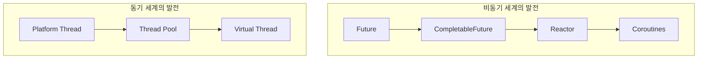
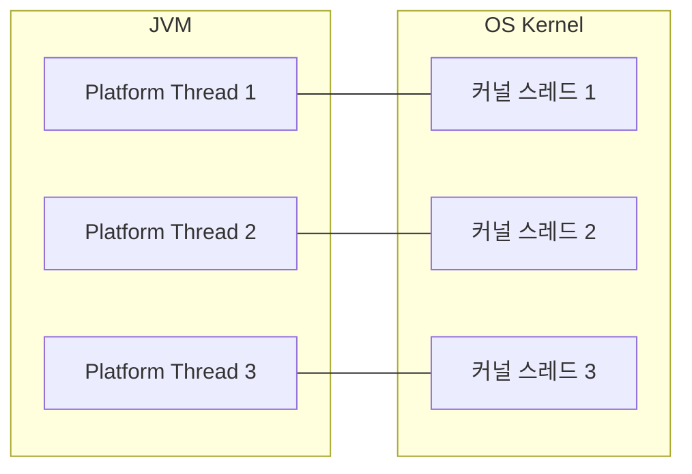
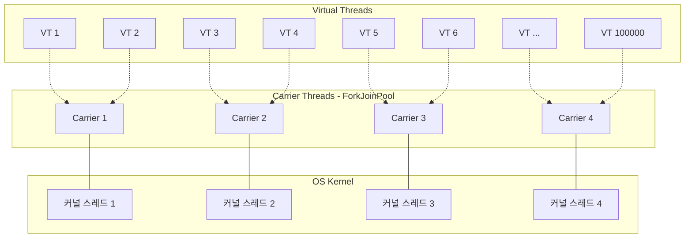
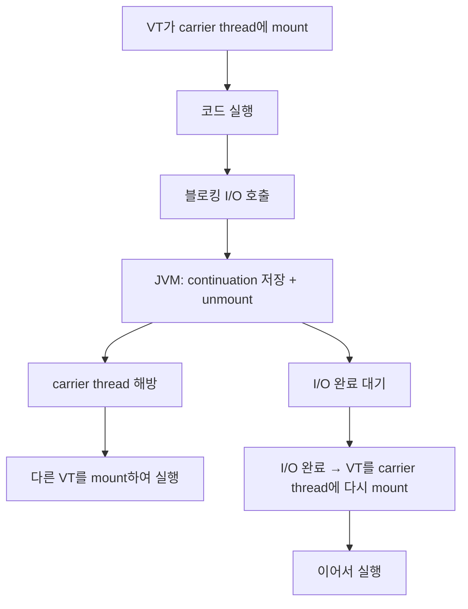
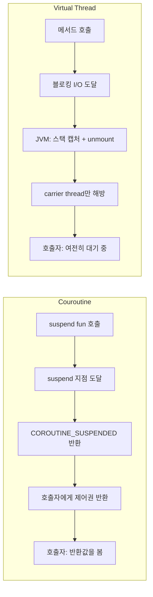
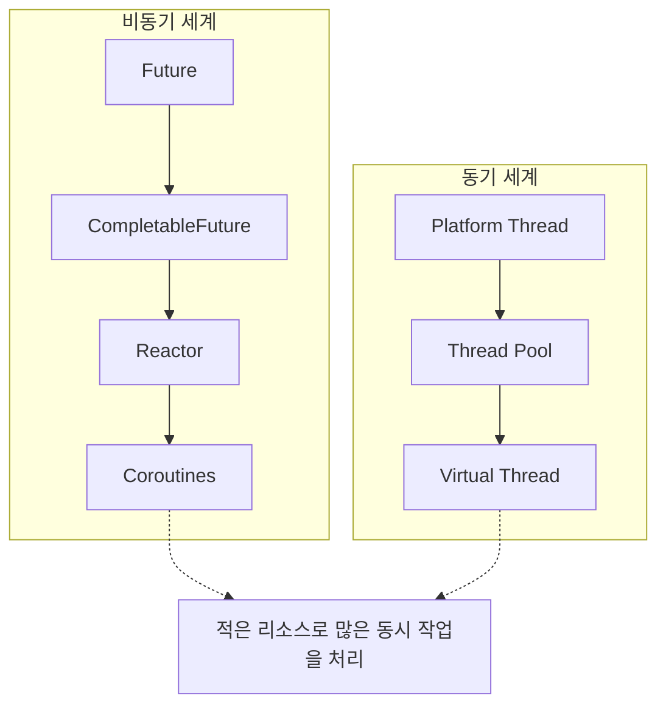

> **JVM 동시성 모델 이해하기 시리즈**
> 
> 1.  [동시성과 병렬성의 기초](/jvm-concurrency-model-1-fundamentals)
> 2.  [Java의 전통적인 동시성 모델](/jvm-concurrency-model-2-java-traditional-concurrency)
> 3.  [Reactive Streams와 Project Reactor](/jvm-concurrency-model-3-reactive-streams-reactor)
> 4.  [Spring WebFlux](/jvm-concurrency-model-4-spring-webflux)
> 5.  [Kotlin Coroutines](/jvm-concurrency-model-5-kotlin-coroutines)
> 6.  [Spring + Coroutines 통합 — WebFlux, MVC, 그리고 AOP의 한계](/jvm-concurrency-model-6-spring-coroutines)
> 7.  **[Virtual Thread — 동기 세계의 해법](/jvm-concurrency-model-7-virtual-thread) ← 현재 글**
> 8.  [총정리 — 언제 무엇을 선택할 것인가](/jvm-concurrency-model-8-conclusion-decision-framework/)

## 왜 또 다른 동시성 모델인가

지금까지 시리즈에서 비동기 세계의 발전을 따라왔습니다.


Future에서 CompletableFuture로, 다시 Reactor로, 마지막으로 Coroutines로 — 점점 가독성과 구조가 개선되었습니다. 하지만 이 모든 것은 **“논블로킹 비동기”라는 패러다임 안의 발전**이었습니다. 논블로킹 라이브러리(R2DBC, WebClient, Reactive MongoDB 등)를 사용해야만 그 이점을 누릴 수 있었고, JDBC나 JPA 같은 블로킹 코드와는 근본적으로 호환되지 않았습니다.

[Part 6](/jvm-concurrency-model-6-spring-coroutines/)에서 그 한계를 구체적으로 봤습니다. `@Transactional` + JDBC + 코루틴 조합에서 AOP 프록시가 `COROUTINE_SUSPENDED` 반환을 “메서드 종료”로 판단하여 트랜잭션이 조기 종료되는 문제, 그리고 [Spring 팀이 이 조합을 공식적으로 지원하지 않겠다고 결정한 것](https://github.com/spring-projects/spring-framework/issues/26705)까지. 동기 블로킹 세계에서는 비동기 기술이 해법이 아니었습니다.

Virtual Thread는 **완전히 다른 접근**입니다.



비동기 세계가 “논블로킹 코드를 어떻게 더 쉽게 작성할까”를 고민했다면, 동기 세계는 “**블로킹 코드를 그대로 두고 스레드 비용만 해결할 수 없을까**“를 고민했습니다. Virtual Thread는 후자의 답입니다.

## Virtual Thread의 동작 원리

### Platform Thread의 한계

[Part 2](/jvm-concurrency-model-2-java-traditional-concurrency/)에서 다뤘던 Java의 전통적인 스레드 모델을 떠올려 봅시다. Java의 `Thread`(이제부터 Platform Thread라 부릅니다)는 OS 커널 스레드와 **1:1로 매핑**됩니다.



Platform Thread 하나를 생성하면 OS 커널 스레드 하나가 생기고, 스택 메모리가 약 1MB 할당됩니다. 스레드 수천 개를 만들면 메모리만 수 GB이고, OS 레벨의 컨텍스트 스위칭 비용도 무시할 수 없습니다. 그래서 실무에서는 스레드 풀(Tomcat 기본 200개)로 스레드 수를 제한합니다.

문제는 **대부분의 시간을 I/O 대기에 쓴다**는 것입니다. DB 쿼리, HTTP 호출, 파일 읽기 — 이런 블로킹 I/O 동안 Platform Thread는 OS 커널 스레드를 점유한 채 아무것도 하지 않습니다. 동시 요청이 200개를 넘으면 201번째 요청은 스레드가 반환될 때까지 대기해야 합니다.

이 문제를 해결하기 위해 비동기 세계에서는 “블로킹하지 말고 논블로킹으로 바꿔라”는 접근을 택했습니다. Virtual Thread는 정반대입니다 — **“블로킹해도 괜찮게 만들어라.”**

### Virtual Thread — JVM이 관리하는 경량 스레드

Virtual Thread(JEP 444, Java 21 정식)는 **JVM이 관리하는 경량 스레드**입니다. OS 커널 스레드와 1:1이 아니라, **소수의 carrier thread 위에 수십만 개의 Virtual Thread가 스케줄링**됩니다.



> 점선 화살표는 “현재 이 carrier thread에서 실행 중”이라는 뜻이 아니라, “이 carrier thread에 스케줄링될 수 있다”는 관계를 나타냅니다. 실제로는 어떤 Virtual Thread든 어떤 carrier thread에서든 실행될 수 있으며, unmount 후 다시 mount될 때 다른 carrier thread에 배정될 수도 있습니다.

**Carrier thread**는 실제 OS 커널 스레드와 매핑되는 Platform Thread입니다. 기본적으로 CPU 코어 수만큼 `ForkJoinPool`에 생성됩니다(예: 8코어 → 8개). Virtual Thread는 이 소수의 carrier thread 위에서 번갈아 실행됩니다.

Virtual Thread의 메모리 비용은 약 수 KB로, Platform Thread(~1MB)와 비교하면 수백 배 가볍습니다. 수십만 개를 동시에 생성해도 문제없습니다.

### Mount와 Unmount — 블로킹이 경량화되는 원리

Virtual Thread의 핵심은 **블로킹 호출을 만나면 자동으로 carrier thread에서 분리되는 것**입니다.



이 과정을 더 구체적으로 봅시다.

**1\. Mount**: Virtual Thread가 carrier thread 위에 **올라탑니다(mount)**. 이 시점에서 Virtual Thread의 코드가 carrier thread에서 실행됩니다.

**2\. 블로킹 호출**: `Thread.sleep()`, JDBC 쿼리, `InputStream.read()` 같은 블로킹 호출을 만납니다.

**3\. Unmount**: JVM은 이 블로킹 호출을 감지하고, Virtual Thread의 실행 상태(스택 프레임)를 **continuation**이라는 객체에 저장합니다. 그리고 Virtual Thread를 carrier thread에서 **내립니다(unmount)**. carrier thread는 즉시 해방되어 다른 Virtual Thread를 실행할 수 있습니다.

**4\. I/O 완료 후 Mount**: 블로킹 I/O가 완료되면, JVM의 스케줄러가 이 Virtual Thread를 (같거나 다른) carrier thread에 다시 **올립니다(mount)**. 저장해둔 continuation에서 실행 상태를 복원하고, 블로킹 호출 직후부터 이어서 실행합니다.

**호출자 입장에서는 변한 것이 없습니다.** `Thread.sleep(1000)`을 호출하면 1초 후에 다음 줄이 실행됩니다. 동기 블로킹 코드가 그대로 동작합니다. 달라진 것은 그 1초 동안 **carrier thread가 점유되지 않는다**는 것뿐입니다.

```java
// Virtual Thread에서 실행 — 코드는 완전히 동기적
void handleRequest() {
    User user = userRepository.findById(id);     // JDBC 블로킹 → unmount → mount
    Order order = orderService.getOrder(user);    // HTTP 블로킹 → unmount → mount
    emailService.send(user.email(), order);       // I/O 블로킹 → unmount → mount
    // 각 블로킹 지점에서 carrier thread가 해방되어 다른 VT를 실행
    // 하지만 이 코드의 작성자는 그 사실을 알 필요가 없다
}
```

### 코루틴의 Continuation과 무엇이 다른가

“실행 상태를 저장하고 나중에 재개한다”는 점에서 코루틴의 continuation과 비슷하게 들립니다. 하지만 **어디서, 어떻게** 멈추느냐가 근본적으로 다릅니다.

**코루틴 — 컴파일러가 함수를 쪼갠다:**

[Part 5](/jvm-concurrency-model-5-kotlin-coroutines/)에서 다뤘듯이, Kotlin 컴파일러는 `suspend fun`을 **CPS(Continuation Passing Style) 변환**합니다. 함수가 suspend 지점에서 **상태 머신의 한 단계를 실행하고 반환**합니다.

```kotlin
// 개발자가 작성한 코드
suspend fun fetchUser(id: Long): User {
    val response = httpClient.get("/users/$id")  // suspend point
    return parseUser(response)
}

// 컴파일러가 변환한 결과 (개념적)
fun fetchUser(id: Long, continuation: Continuation<User>): Any {
    when (continuation.state) {
        0 -> {
            continuation.state = 1
            val result = httpClient.get("/users/$id", continuation)
            if (result == COROUTINE_SUSPENDED) return COROUTINE_SUSPENDED  // ← 여기서 반환!
        }
        1 -> {
            val response = continuation.result
            return parseUser(response)
        }
    }
}
```

핵심은 **함수가 `COROUTINE_SUSPENDED`를 호출자에게 반환한다**는 것입니다. 함수의 반환값이 바뀝니다. 호출자(AOP 프록시 포함)는 이 반환값을 봅니다.

suspend fun A가 suspend fun B를 호출하고, B가 suspend되면? B가 `COROUTINE_SUSPENDED`를 A에게 반환하고, A도 자신의 호출자에게 `COROUTINE_SUSPENDED`를 반환합니다. 이 반환이 호출 스택을 타고 올라가 최종적으로 **코루틴 디스패처**(Kotlin 코루틴 런타임의 스케줄러)에 도달합니다. 디스패처는 “이 코루틴은 일시 중단되었으니, 같은 스레드에서 다른 대기 중인 코루틴을 실행하자”를 결정합니다. I/O가 완료되면 디스패처가 중단된 코루틴을 다시 스레드에 스케줄링하여 이어서 실행합니다.

정리하면, **개별 함수들은 `COROUTINE_SUSPENDED`를 주고받는 호출 체인**이고, **디스패처는 이 체인의 최상위에서 “어떤 코루틴을 실행할지” 관리하는 스케줄러**입니다. 이 모든 과정이 JVM이 아닌 **Kotlin 라이브러리 레벨**에서 일어난다는 것이 Virtual Thread와의 근본적인 차이입니다.

**Virtual Thread — JVM이 스택을 통째로 캡처한다:**

Virtual Thread는 소스 코드나 바이트코드를 변환하지 않습니다. 메서드 시그니처도 바뀌지 않습니다.

여기서 “스택”이 무엇인지 짚고 넘어갈 필요가 있습니다. JVM의 각 스레드는 메서드 호출마다 프레임이 쌓이는 **JVM 스택**이라는 논리적 구조를 가집니다. Platform Thread에서는 이 JVM 스택이 **OS가 제공하는 스택 메모리 영역**(~1MB) 위에 직접 구현됩니다. Virtual Thread에서는 이 JVM 스택이 **힙 메모리**에 저장됩니다.

코루틴이 “다음 단계에서 필요한 로컬 변수만” 골라서 continuation 객체에 저장하는 것과 달리, Virtual Thread는 unmount 시 **실제로 쌓여있는 스택 프레임을 힙으로 복사**합니다. OS 스택의 예약된 1MB 전체를 복사하는 것이 아니라, 그 시점에 사용 중인 프레임만 복사하는 것입니다. 일반적인 I/O 대기 시점의 스택 깊이는 수 KB 수준이라, 수십만 개를 유지해도 실질적인 메모리 부담은 Platform Thread와 비교할 수 없을 만큼 작습니다.

그렇다면 코루틴과 Reactor는 왜 스택 프레임 전체를 캡처하지 않을까? **“안 한 것이 아니라 할 수 없는 것”** 입니다. 코루틴과 Reactor는 JVM 위의 라이브러리/컴파일러이고, JVM 스택 프레임에 직접 접근하는 API는 존재하지 않습니다. 바이트코드 레벨에서 할 수 있는 건 함수의 로컬 변수를 객체 필드에 저장하는 것이 전부이므로, 코루틴은 컴파일러 변환으로 필요한 변수만 추출하고, Reactor는 아예 스택을 사용하지 않는 콜백 체인으로 우회한 것입니다. Virtual Thread는 **JVM 자체의 기능**이기 때문에 스택 프레임을 직접 조작할 수 있는 특권이 있습니다.

> 참고로 Reactor에는 `Hooks.onOperatorDebug()`라는 디버그 모드가 있어서, 이것도 “스택을 캡처”한다고 표현하기도 합니다. 하지만 이것은 Virtual Thread의 스택 캡처와는 **목적이 완전히 다릅니다**. Reactor debug는 모든 operator 생성 시점에 `new Exception().getStackTrace()`를 호출하여 “어떤 코드 경로에서 이 operator가 만들어졌는가”를 **읽기 전용 기록**으로 남깁니다. 에러 발생 시 원인을 추적하기 위한 **진단 정보**이지, 이 기록으로 실행을 이어갈 수는 없습니다. 반면 Virtual Thread가 캡처하는 스택 프레임에는 로컬 변수 값, 피연산자 스택, 실행 중이던 바이트코드 위치(program counter)까지 포함되어 있어, 복원하면 **그 지점부터 실행을 재개**할 수 있습니다. Reactor debug가 “여기서 사진을 찍었다”(기록)라면, Virtual Thread는 “여기서 게임을 세이브했다”(복원 가능한 상태)에 해당합니다. Reactor debug가 성능 이슈로 기본 off인 이유도 여기에 있습니다. `new Exception().getStackTrace()`를 호출하면 JVM이 현재 호출 스택을 순회하면서 각 프레임의 클래스명, 메서드명, 파일명을 **문자열 객체로 생성**합니다(일반적으로 20~50개 프레임). 이 연산이 **모든 operator마다** 실행됩니다. 파이프라인 하나에 operator가 10개이고 동시 요청이 1만 개면 `Exception` 객체 10만 개 + 그에 딸린 문자열 객체 수백만 개가 만들어지는 셈입니다. **횟수(모든 operator) × 횟수당 비용(Exception + String 객체 생성)** 이 곱해져서 CPU와 메모리 양쪽에 부담이 됩니다. 반면 Virtual Thread의 스택 복사는 로컬 변수 값이나 program counter 같은 primitive 위주의 메모리 블록을 통째로 옮기는(memcpy 수준) 연산이고, 블로킹 I/O 지점에서**만** 일어나므로 빈도도 비용도 훨씬 낮습니다.

```java
// 개발자가 작성한 코드 — 그리고 실제로 실행되는 코드. 변환 없음.
User fetchUser(Long id) {
    Response response = httpClient.get("/users/" + id);  // 블로킹 호출
    // ↑ 이 지점에서 JVM이 내부적으로:
    //   1. 이 Virtual Thread의 스택 프레임 전체를 힙에 저장 (continuation)
    //   2. carrier thread에서 unmount
    //   3. I/O 완료 후 다시 mount하여 여기서부터 계속
    // → 하지만 이 함수는 반환하지 않는다!
    //   호출자는 이 줄에서 "블로킹 중"인 것으로 인식
    return parseUser(response);
}
```

차이를 정리하면:



|  | 코루틴 | Virtual Thread |
| --- | --- | --- |
| **변환 레벨** | 컴파일러 (바이트코드 변환) | JVM (런타임) |
| **함수 시그니처** | 변환됨 (`Continuation` 파라미터 추가) | 변환 없음 |
| **멈추는 방식** | 함수가 `COROUTINE_SUSPENDED`를 **반환** | 함수가 반환하지 않음. JVM이 **스택을 캡처** |
| **호출자가 보는 것** | 반환값 (`COROUTINE_SUSPENDED`) | 아무것도 안 보임 (블로킹 중) |
| **해방되는 것** | 디스패처의 스레드 | carrier thread |
| **저장하는 것** | 로컬 변수만 (라이브러리 레벨 — JVM 스택 접근 불가) | JVM 스택 프레임 전체 (JVM 레벨 — 직접 조작 가능) |
| **메모리 비용** | 매우 작음 (필요한 변수만) | 작음 (사용 중인 프레임만, 수 KB 수준) |
| **필요한 코드** | 논블로킹 라이브러리 + `suspend` 키워드 | 기존 블로킹 코드 그대로 |

> 비유하자면, **코루틴은 “내가 잠깐 나갈 테니 나중에 다시 불러줘”** 하고 문을 나서는 것입니다. 문 밖의 사람 — AOP 프록시든, 이 함수를 호출한 상위 코드든 — 은 “나갔구나”를 인식합니다(`COROUTINE_SUSPENDED`라는 반환값을 봅니다). **Virtual Thread는 “내가 여기서 기다리고 있을게”** 하고 자리에 앉아있는 것입니다. 단, 그 의자(carrier thread)가 투명하게 교체될 뿐이지, 문 밖의 사람은 “아직 안에 있다”고 인식합니다.

### AOP 프록시가 문제없는 이유 — [Part 6](/jvm-concurrency-model-6-spring-coroutines/) 연결

이 차이가 바로 Part 6에서 다뤘던 AOP 문제를 해결합니다.

코루틴에서 `@Transactional` AOP가 깨지는 이유는 `suspend fun`이 `COROUTINE_SUSPENDED`를 **반환**하기 때문이었습니다. `TransactionInterceptor`가 이 반환을 “메서드 종료”로 판단하고 트랜잭션을 조기 commit했습니다.

Virtual Thread에서는 이 문제가 **구조적으로 존재하지 않습니다**:

```java
// Virtual Thread에서 실행 — AOP 프록시가 정상 동작
@Transactional
void transferMoney(Long from, Long to, BigDecimal amount) {
    Account sender = accountRepository.findById(from);     // 블로킹 → unmount/mount
    Account receiver = accountRepository.findById(to);     // 블로킹 → unmount/mount
    sender.withdraw(amount);
    receiver.deposit(amount);
    accountRepository.save(sender);                        // 블로킹 → unmount/mount
    accountRepository.save(receiver);                      // 블로킹 → unmount/mount
}
// AOP 프록시는 이 메서드가 "끝날 때까지" 기다린다
// → carrier thread는 교체되지만 AOP 프록시의 시점에서는 메서드가 아직 실행 중
// → 메서드가 정상 반환된 후에야 트랜잭션 commit
```

AOP 프록시의 `proceed()`는 메서드가 **실제로 끝날 때까지 반환하지 않습니다**. 블로킹 I/O 중에 carrier thread가 교체되는 것은 JVM 내부의 일이고, AOP 프록시가 동작하는 Virtual Thread 레벨에서는 그냥 “메서드가 실행 중”인 것처럼 보입니다. 따라서 `PlatformTransactionManager` + JDBC 조합도 정상 동작하고, 커스텀 `@Around` 어드바이스도 문제없습니다.

[Part 6](/jvm-concurrency-model-6-spring-coroutines/)에서 코루틴이 겪었던 모든 AOP 관련 문제 — `@Transactional`의 조기 commit, 커스텀 `@Around`의 잘못된 측정, `@AfterReturning`의 `COROUTINE_SUSPENDED` 수신 — 가 Virtual Thread에서는 발생하지 않습니다. **동기 블로킹 모델을 유지하기 때문입니다.**

> 이것이 Spring 팀이 [Issue #26705](https://github.com/spring-projects/spring-framework/issues/26705)에서 “MVC + JDBC + 코루틴 트랜잭션은 지원하지 않겠다”고 결정하면서 Virtual Thread를 대안으로 제시한 이유입니다. 코루틴이 근본적으로 해결할 수 없는 동기 세계의 문제를, Virtual Thread는 동기 모델 안에서 해결합니다.

## Pinning — Virtual Thread의 함정

Virtual Thread가 만능은 아닙니다. carrier thread에서 unmount되지 못하고 **고정(pinned)** 되는 상황이 있습니다.

### synchronized 블록 안의 블로킹

Java 21에서 가장 주요한 pinning 원인은 `synchronized` 블록입니다.

```java
// Java의 모든 객체는 내부에 모니터를 가지고 있어 synchronized의 락으로 사용 가능
// 락 전용 객체를 따로 두는 것은 Java의 오래된 관용 패턴
private final Object lock = new Object();

synchronized (lock) {
    // 이 안에서 블로킹 I/O를 호출하면
    resultSet = statement.executeQuery(sql);  // ← pinning 발생!
    // Virtual Thread가 carrier thread에서 unmount되지 못함
    // → carrier thread가 점유된 채 I/O 완료를 기다림
    // → 다른 Virtual Thread가 이 carrier thread를 사용할 수 없음
}
```

`synchronized`는 JVM이 블록 진입 시 해당 객체의 **모니터(monitor)를 자동으로 acquire**하고, 블록을 빠져나가면(정상 반환이든 예외든) **자동으로 release**하는 구조입니다. 개발자가 lock/unlock을 명시적으로 호출할 필요가 없어서 편리하지만, 이 모니터는 OS 레벨에서 구현되어 특정 OS 스레드(= carrier thread)에 바인딩됩니다. JVM이 Virtual Thread를 unmount하면 모니터의 소유권이 깨지므로, JVM은 `synchronized` 안에서는 unmount를 하지 않습니다.

반면 `ReentrantLock`은 개발자가 `lock()`/`unlock()`을 직접 호출해야 하지만, OS 모니터가 아닌 **JVM 레벨의 `AbstractQueuedSynchronizer`** 로 구현되어 특정 OS 스레드에 바인딩되지 않습니다. 그래서 Virtual Thread의 unmount와 호환됩니다.

Pinning이 발생하면 carrier thread가 블로킹되므로, Platform Thread와 다를 바 없는 상황이 됩니다. Carrier thread는 기본적으로 CPU 코어 수만큼만 존재하므로(예: 8개), 여러 Virtual Thread가 동시에 pinning되면 전체 처리량이 급격히 떨어질 수 있습니다.

### 실무에서의 대응

**`ReentrantLock`으로 교체**: `synchronized` 대신 `java.util.concurrent.locks.ReentrantLock`을 사용하면 pinning이 발생하지 않습니다. `ReentrantLock`은 JVM 레벨에서 구현되어 Virtual Thread의 unmount와 호환됩니다.

```java
// Before — synchronized 사용, pinning 발생
private final Object lock = new Object();

synchronized (lock) {                    // OS 모니터 기반 — carrier thread에 바인딩
    connection.executeQuery(sql);         // ← pinning! unmount 불가
}

// After — ReentrantLock 사용, pinning 없음
private final ReentrantLock lock = new ReentrantLock();

lock.lock();                             // JVM 레벨 구현 — unmount와 호환
try {
    connection.executeQuery(sql);         // 정상적으로 unmount 가능
} finally {
    lock.unlock();
}
```

**JDBC 드라이버 대응 현황**: Virtual Thread 도입 이후, 주요 JDBC 드라이버와 커넥션 풀 라이브러리들이 `synchronized`를 `ReentrantLock`으로 교체하는 작업을 진행하고 있습니다. HikariCP 5.1.0부터 Virtual Thread 호환 개선이 포함되었고, PostgreSQL JDBC 드라이버(pgjdbc)도 42.7.0부터 pinning을 줄이기 위한 변경이 적용되었습니다.

**JVM 플래그로 감지**: `-Djdk.tracePinnedThreads=short` 옵션을 사용하면 pinning이 발생할 때 스택 트레이스가 출력되어, 어디서 pinning이 발생하는지 확인할 수 있습니다.

### JDK 24 — Pinning 문제의 해결

Java 24([JEP 491](https://openjdk.org/jeps/491))에서 `synchronized` 안에서도 Virtual Thread가 unmount될 수 있도록 개선되었습니다. 모니터 구현이 JVM 내부적으로 변경되어, `synchronized`를 `ReentrantLock`으로 교체하지 않아도 됩니다.

다만 JDK 24가 아직 널리 채택되지 않은 현 시점에서는, Virtual Thread를 사용하는 프로젝트에서 `synchronized` 안의 블로킹 호출을 점검하는 것이 좋습니다.

## Spring Boot에서의 적용

### 설정 한 줄로 전환

Spring Boot 3.2부터 Virtual Thread 지원이 포함되었습니다. `application.properties`에 한 줄만 추가하면 됩니다.

```properties
# application.properties
spring.threads.virtual.enabled=true
```

이 설정이 활성화되면:

-   **Tomcat**: 요청마다 Platform Thread 대신 Virtual Thread를 생성하여 처리
-   **`@Async`**: `SimpleAsyncTaskExecutor`가 Virtual Thread를 사용
-   **`@Scheduled`**: 스케줄링 작업이 Virtual Thread에서 실행
-   **Spring MVC 전체**: 컨트롤러, 서비스, 리포지토리 레이어가 모두 Virtual Thread 위에서 동작

기존 코드를 **한 줄도 수정할 필요가 없습니다**. `@Transactional`, `@Around`, `@Cacheable` 같은 AOP 어노테이션도 그대로 동작합니다. ThreadLocal도 정상적으로 작동합니다 — Virtual Thread도 `Thread`의 하위 타입이므로 ThreadLocal API가 그대로 적용됩니다.

**MDC, Tracing 등 ThreadLocal 기반 도구**: Slf4j의 MDC(Mapped Diagnostic Context), Spring Security의 `SecurityContextHolder`, Micrometer Tracing 같은 도구들은 내부적으로 ThreadLocal을 사용합니다. Virtual Thread에서도 이들은 기본적으로 **정상 동작**합니다. 하나의 요청이 하나의 Virtual Thread에서 시작부터 끝까지 처리되는 Spring MVC 모델에서는, 요청 시작 시 설정한 MDC 값이 동일 Virtual Thread 안에서 계속 유지됩니다.

다만 **주의할 점**이 있습니다. Platform Thread는 풀에서 재사용되므로 수백 개 수준이었지만, Virtual Thread는 요청마다 생성되어 수만~수십만 개가 동시에 존재할 수 있습니다. ThreadLocal은 스레드별로 별도 복사본을 유지하므로, **스레드 수에 비례하여 메모리가 증가**합니다. 특히 ThreadLocal을 캐시 용도로 사용하는 패턴(커넥션 캐시, 포맷터 재사용 등)은 Virtual Thread 환경에서 메모리 문제가 될 수 있습니다. Java에서는 이를 대체할 `ScopedValue`(JEP 487, JDK 25 프리뷰)를 도입하고 있으며, 불변이고 스코프가 명확하여 Virtual Thread 환경에 더 적합합니다.

```java
// 기존 Spring MVC 코드 — 변경 없이 Virtual Thread 위에서 실행
@RestController
public class UserController {

    @GetMapping("/users/{id}")
    public UserDetail getUser(@PathVariable Long id) {
        User user = userRepository.findById(id);           // JDBC 블로킹 → VT unmount
        Profile profile = profileClient.getProfile(user);  // HTTP 블로킹 → VT unmount
        return new UserDetail(user, profile);
    }
}
```

동시 요청이 10,000개가 들어와도, 10,000개의 Virtual Thread가 생성되어 각각 독립적으로 실행됩니다. 블로킹 I/O 대기 중에는 carrier thread가 해방되어 다른 요청을 처리합니다.

### 코루틴 + WebFlux 조합과의 비교

[Part 6](/jvm-concurrency-model-6-spring-coroutines/)에서 다뤘던 코루틴 + WebFlux 조합과 비교하면:

|  | Spring MVC + Virtual Thread | Spring WebFlux + Coroutines |
| --- | --- | --- |
| **코드 스타일** | 동기 블로킹 (기존 그대로) | suspend fun + 논블로킹 라이브러리 |
| **전환 비용** | `application.properties` 한 줄 | 코드 전면 재작성 (Servlet → WebFlux) |
| **데이터 접근** | JDBC, JPA 그대로 사용 | R2DBC, Reactive MongoDB 필요 |
| **AOP 호환성** | 완전 호환 | 빌트인만 호환 (커스텀 @Around 제한) |
| **ThreadLocal** | 정상 동작 | suspend 후 손실 가능 (전파 필요) |
| **스레드 모델** | 요청당 Virtual Thread | 이벤트 루프 + 코루틴 |
| **생태계** | Java 블로킹 생태계 전체 활용 | 논블로킹 라이브러리만 사용 가능 |
| **최대 동시성** | Virtual Thread 수 (사실상 무제한) | 이벤트 루프 스레드 수와 무관하게 확장 |

> “그렇다면 WebFlux와 코루틴은 필요 없는 것인가?”라는 질문이 생길 수 있습니다. 아닙니다. Virtual Thread는 **I/O 바운드 작업에서의 스레드 비용**을 해결하지만, 논블로킹 I/O의 **효율성 자체**를 대체하지는 않습니다. 예를 들어, WebFlux의 이벤트 루프 모델은 I/O 완료 이벤트를 OS 레벨의 `epoll`/`kqueue`로 처리하여 시스템 콜 횟수를 최소화합니다. 또한 Reactor의 backpressure, 리액티브 스트림 처리, Server-Sent Events 같은 스트리밍 시나리오는 Virtual Thread만으로는 구현하기 어렵습니다. 이 부분은 Part 8에서 구체적으로 비교합니다.

## Structured Concurrency — Java의 구조화된 동시성

### 코루틴의 구조화된 동시성 복습

[Part 5](/jvm-concurrency-model-5-kotlin-coroutines/)에서 코루틴의 구조화된 동시성을 다뤘습니다. 핵심은 “부모가 자식의 완료를 보장하고, 자식의 실패가 부모에게 전파되며, 부모가 취소되면 자식도 취소된다”는 것이었습니다.

```kotlin
// 코루틴의 구조화된 동시성
suspend fun fetchUserWithOrders(userId: Long): UserWithOrders = coroutineScope {
    val user = async { userService.findById(userId) }
    val orders = async { orderService.findByUserId(userId) }
    // 하나가 실패하면 다른 하나도 취소됨
    UserWithOrders(user.await(), orders.await())
}
```

### StructuredTaskScope — Java의 대응

Java에서도 **Structured Concurrency**가 도입되었습니다. JEP 428(JDK 19 인큐베이터)을 시작으로 여러 차례 프리뷰를 거치고 있으며, JDK 24에서는 [JEP 499](https://openjdk.org/jeps/499)(Fourth Preview), JDK 25에서는 [JEP 505](https://openjdk.org/jeps/505)(Fifth Preview)로 API 변경과 함께 계속 프리뷰 중입니다. `StructuredTaskScope`를 사용합니다.

```java
// Java의 구조화된 동시성 (프리뷰 기능)
UserWithOrders fetchUserWithOrders(Long userId) throws Exception {
    try (var scope = new StructuredTaskScope.ShutdownOnFailure()) {
        Subtask<User> user = scope.fork(() -> userService.findById(userId));
        Subtask<List<Order>> orders = scope.fork(() -> orderService.findByUserId(userId));

        scope.join();            // 모든 subtask 완료 대기
        scope.throwIfFailed();   // 하나라도 실패했으면 예외 던지기

        return new UserWithOrders(user.get(), orders.get());
    }
    // try-with-resources로 scope 종료 — 스코프 밖으로 task가 누출되지 않음
}
```

코루틴의 `coroutineScope` / `async`와 대응시키면:

|  | 코루틴 | Java Structured Concurrency |
| --- | --- | --- |
| **스코프 생성** | `coroutineScope { }` | `new StructuredTaskScope()` |
| **병렬 작업 시작** | `async { }` | `scope.fork(() -> ...)` |
| **결과 대기** | `deferred.await()` | `scope.join()` + `subtask.get()` |
| **실패 시 취소** | 자동 (부모 스코프 취소) | `ShutdownOnFailure` 정책으로 명시 |
| **성공 시 취소** | 수동 구현 필요 | `ShutdownOnSuccess` 정책 |
| **스코프 보장** | 컴파일러 강제 | try-with-resources |

`ShutdownOnFailure`는 하나의 subtask가 실패하면 나머지 subtask를 모두 **취소(interrupt)** 합니다 — 이건 `join()`이 반환되는 시점에 이미 완료된 동작입니다.

그런데 “취소되면 그냥 끝나는 거 아닌가?”라고 생각할 수 있지만, 이 메서드는 **결과를 반환해야 합니다**. `user.get()`과 `orders.get()`으로 결과를 꺼내야 하는데, 실패하거나 취소된 subtask의 `get()`은 결과가 없으므로 **어차피 예외가 발생합니다**. `throwIfFailed()`는 그 예외의 **품질**을 결정합니다:

-   `throwIfFailed()` 사용 → `ExecutionException(cause: IOException("DB 연결 실패"))` — 원래 뭐가 잘못됐는지 바로 알 수 있음
-   `throwIfFailed()` 생략 → `get()`까지 도달하고, `IllegalStateException("Subtask not completed successfully")` — 원인을 알 수 없음

코루틴의 `coroutineScope`에서는 자식의 예외가 자동으로 부모에게 전파되지만, Java에서는 `throwIfFailed()`로 명시적으로 전파해야 합니다.

`ShutdownOnSuccess`는 하나의 subtask가 성공하면 나머지를 취소합니다 — 여러 서버에 동시 요청을 보내고 가장 빠른 응답을 사용하는 패턴에 유용합니다.

> Structured Concurrency는 Java 19(인큐베이터)부터 시작하여 JDK 25 현재까지도 **프리뷰 단계**입니다. 프리뷰 기능을 사용하려면 `--enable-preview` 플래그가 필요하고, JDK 25에서는 `StructuredTaskScope`의 public 생성자가 static factory 메서드로 변경되는 등 API가 버전마다 달라지고 있습니다. 현실적으로 프로덕션에서 프리뷰 기능을 사용하는 것은 부담이 크므로, 대부분의 프로젝트에서는 Virtual Thread + `ExecutorService` 또는 `CompletableFuture` 조합으로 병렬 처리를 구현하고 있습니다. Structured Concurrency가 정식으로 확정되면 더 안전하고 구조적인 병렬 코드가 가능해질 것입니다.

## 코루틴 vs Virtual Thread — 종합 비교

두 기술은 **같은 문제(높은 동시성)를 다른 레벨에서 해결**합니다.

|  | Kotlin Coroutines | Virtual Thread |
| --- | --- | --- |
| **구현 레벨** | 컴파일러 + 라이브러리 | JVM 런타임 |
| **언어** | Kotlin | Java (Kotlin에서도 사용 가능) |
| **코드 스타일** | `suspend fun` + 논블로킹 라이브러리 | 기존 블로킹 코드 그대로 |
| **전환 비용** | 높음 (논블로킹 라이브러리 필요) | 낮음 (설정 한 줄) |
| **AOP 호환성** | 빌트인만 호환 (커스텀 @Around 제한) | 완전 호환 |
| **ThreadLocal** | suspend 후 손실 가능 (전파 필요) | 정상 동작 |
| **구조화된 동시성** | `coroutineScope` / `async` (정식) | `StructuredTaskScope` (프리뷰) |
| **Backpressure** | `Flow` (Reactor `Flux` 변환 가능) | 별도 메커니즘 없음 |
| **스트리밍** | `Flow` / `Flux` 네이티브 지원 | 직접 구현 필요 |
| **디버깅** | 스택 트레이스 깨질 수 있음 (개선 중) | 일반 스레드와 동일한 스택 트레이스 |
| **생태계** | 논블로킹 라이브러리 (R2DBC 등) | Java 블로킹 생태계 전체 |
| **Spring 통합** | WebFlux + suspend fun | MVC + `spring.threads.virtual.enabled` |

### 경쟁이 아니라 다른 문제를 푸는 도구

두 기술은 경쟁 관계가 아닙니다. 해결하는 문제가 다릅니다.

**Virtual Thread가 적합한 경우**: 기존 Spring MVC + JDBC/JPA 프로젝트에서 동시성을 개선하고 싶을 때. 코드 변경 없이 설정만으로 적용 가능. ThreadLocal, AOP, 기존 라이브러리 생태계를 그대로 활용할 수 있습니다.

**코루틴이 적합한 경우**: WebFlux + R2DBC/Reactive MongoDB 같은 논블로킹 스택을 사용하는 프로젝트에서, Reactor의 체이닝 문법 대신 명령형 스타일로 작성하고 싶을 때. `Flow`를 통한 리액티브 스트림 처리, backpressure가 필요한 경우. Kotlin 멀티플랫폼(Android, 서버, KMP)에서 동일한 동시성 모델을 사용하고 싶을 때.

### 함께 사용할 수 있는가?

Kotlin 코루틴에서 Virtual Thread를 활용하는 실험적 접근도 가능합니다.

```kotlin
// Dispatchers.IO 대신 Virtual Thread를 사용하는 디스패처
val virtualThreadDispatcher = Executors.newVirtualThreadPerTaskExecutor().asCoroutineDispatcher()

suspend fun fetchData() = withContext(virtualThreadDispatcher) {
    // 블로킹 호출을 Virtual Thread에서 실행
    val result = blockingJdbcCall()
    result
}
```

`Dispatchers.IO`는 고정 크기의 Platform Thread 풀을 사용하지만, Virtual Thread 디스패처를 사용하면 블로킹 호출마다 새 Virtual Thread가 생성되어 carrier thread만 공유합니다. 다만 이 방식은 코루틴의 suspension 메커니즘과 Virtual Thread의 unmount 메커니즘이 **이중으로 동작**하게 되므로, 성능상 이점이 크지 않을 수 있습니다. 코루틴을 사용한다면 논블로킹 라이브러리를 쓰는 것이, Virtual Thread를 사용한다면 코루틴 없이 동기 코드를 쓰는 것이 각각의 강점을 살리는 방향입니다.

## 마무리 — 같은 문제, 다른 관점



비동기 세계와 동기 세계는 같은 문제 — **적은 리소스로 많은 동시 작업을 처리** — 를 다른 방향에서 해결합니다. 비동기 세계는 “블로킹하지 마라, 논블로킹으로 바꿔라”였고, 동기 세계는 “블로킹해도 괜찮다, JVM이 알아서 처리한다”입니다.

이 시리즈에서 Part 2부터 Part 6까지 비동기 세계의 발전을 따라왔고, Part 7에서 동기 세계의 해법을 봤습니다. 그러면 **실무에서 어떤 기술을 선택해야 할까요?** “모든 프로젝트를 Virtual Thread로 전환하면 되는 거 아닌가?”, “WebFlux는 이제 필요 없는 건가?”, “코루틴을 쓰고 있는데 Virtual Thread로 바꿔야 하나?” — 이런 질문에 대한 답을 다음 글에서 총정리합니다.

다음 글에서는 **“언제 무엇을 선택할 것인가”**를 다룹니다. I/O 바운드 vs CPU 바운드, 기존 코드베이스의 기술 스택, 팀의 역량, 그리고 각 기술의 진짜 강점이 발휘되는 시나리오를 비교하여, 실무에서의 의사결정 프레임워크를 제시합니다.

## 참고 자료

**공식 문서**

-   [JEP 444: Virtual Threads](https://openjdk.org/jeps/444) — Virtual Thread 공식 제안 (Java 21 정식)
-   [JEP 499: Structured Concurrency (Fourth Preview)](https://openjdk.org/jeps/499) — JDK 24 구조화된 동시성
-   [JEP 505: Structured Concurrency (Fifth Preview)](https://openjdk.org/jeps/505) — JDK 25 구조화된 동시성
-   [JEP 491: Synchronize Virtual Threads without Pinning](https://openjdk.org/jeps/491) — JDK 24 pinning 해결
-   [Spring Boot — Virtual Threads 지원](https://docs.spring.io/spring-boot/reference/features/spring-application.html#features.spring-application.virtual-threads) — Spring Boot 공식 문서

**블로그 및 발표**

-   [Spring Blog — Embracing Virtual Threads](https://spring.io/blog/2022/10/11/embracing-virtual-threads/) — Spring의 Virtual Thread 지원 방향
-   [Inside Java — Virtual Threads: An Adoption Guide](https://inside.java/2024/02/04/sip097/) — Oracle의 Virtual Thread 적용 가이드
-   [Project Loom — Ron Pressler (JVM Language Summit)](https://www.youtube.com/watch?v=r6P0_FDr53Q) — Virtual Thread 설계 배경
-   [@Transactional + suspend fun + MVC + JDBC — Issue #26705](https://github.com/spring-projects/spring-framework/issues/26705) — Spring 팀의 코루틴 트랜잭션 입장
