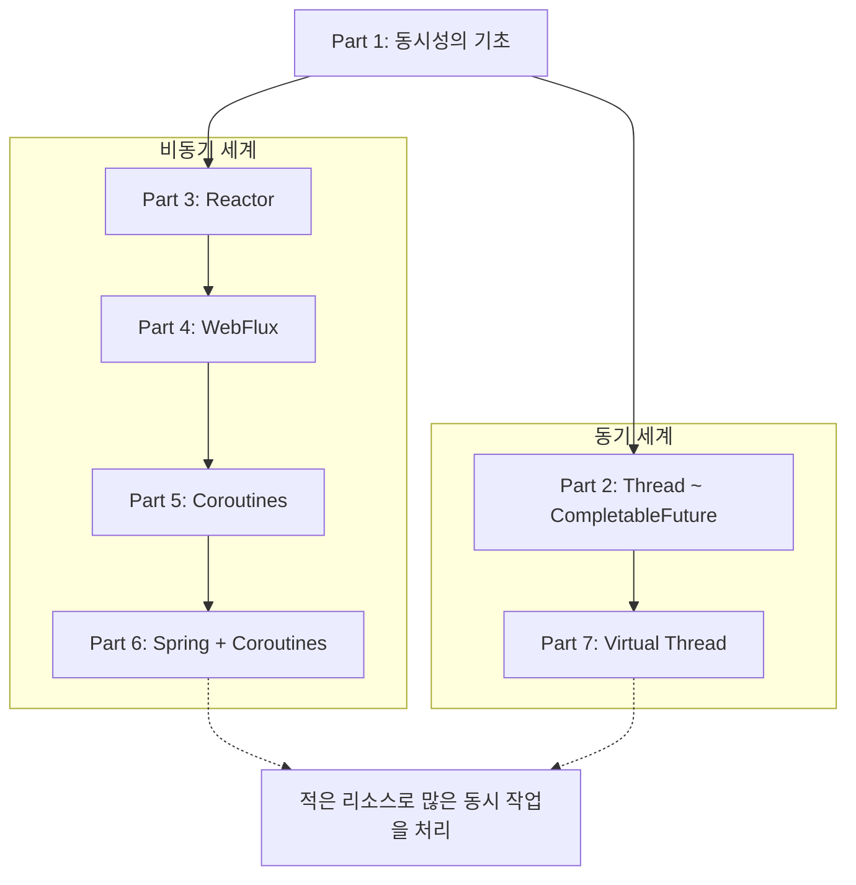
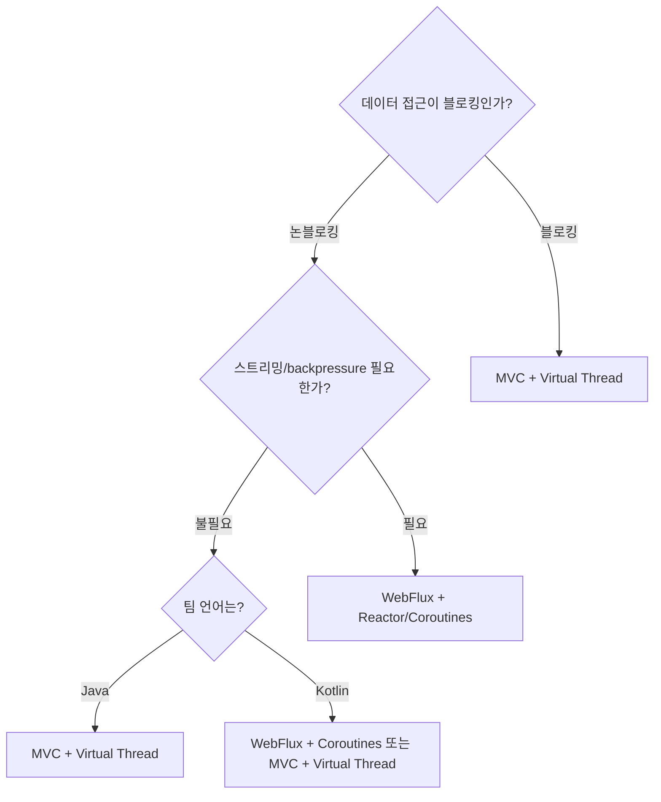
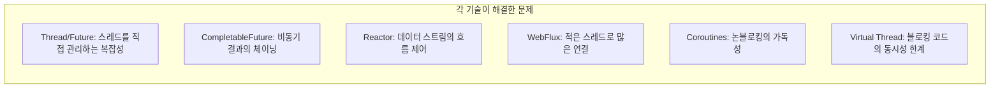

> **JVM 동시성 모델 이해하기 시리즈**
> 
> 1.  [동시성과 병렬성의 기초](/jvm-concurrency-model-1-fundamentals)
> 2.  [Java의 전통적인 동시성 모델](/jvm-concurrency-model-2-java-traditional-concurrency)
> 3.  [Reactive Streams와 Project Reactor](/jvm-concurrency-model-3-reactive-streams-reactor)
> 4.  [Spring WebFlux](/jvm-concurrency-model-4-spring-webflux)
> 5.  [Kotlin Coroutines](/jvm-concurrency-model-5-kotlin-coroutines)
> 6.  [Spring + Coroutines 통합 — WebFlux, MVC, 그리고 AOP의 한계](/jvm-concurrency-model-6-spring-coroutines)
> 7.  [Virtual Thread — 동기 세계의 해법](/jvm-concurrency-model-7-virtual-thread)
> 8.  **[총정리 — 언제 무엇을 선택할 것인가](https://hello-world-log.com/jvm-concurrency-model-8-conclusion-decision-framework/) ← 현재 글**

## 시리즈 되돌아보기

7편의 글에 걸쳐 JVM 위의 동시성 기술이 어떤 문제를 풀기 위해 등장했고, 어떻게 발전해왔는지를 살펴봤습니다. 각 기술이 해결하려 한 **핵심 문제 한 가지**를 중심으로 되돌아봅니다.

**[Part 1 — 동시성과 병렬성의 기초.](https://hello-world-log.com/jvm-concurrency-model-1-fundamentals/)** 동시성(concurrency)과 병렬성(parallelism)은 다르다. 동기/비동기는 “결과를 누가 챙기는가”, 블로킹/논블로킹은 “제어권이 언제 돌아오는가” — 이 두 축이 독립적이라는 것을 정리했습니다. 이후 모든 기술을 이해하는 기초 체력이 됩니다.

**[Part 2 — Java의 전통적인 동시성 모델.](https://hello-world-log.com/jvm-concurrency-model-2-java-traditional-concurrency/)** `Thread`, `Runnable`에서 시작해 `Callable`/`Future`, `ExecutorService`, `CompletableFuture`까지 — 추상화 수준이 올라가며 “스레드를 직접 관리하지 마라”는 방향으로 발전했습니다. 하지만 `CompletableFuture`의 체이닝에도 한계가 있었습니다: 값 하나가 아니라 **연속된 데이터 스트림**을 처리해야 할 때, 그리고 소비자가 생산 속도를 제어해야 할 때(backpressure).

**[Part 3 — Reactive Streams와 Project Reactor.](https://hello-world-log.com/jvm-concurrency-model-3-reactive-streams-reactor/)** `Publisher`–`Subscriber` 4개의 인터페이스로 backpressure를 표준화하고, Reactor가 `Mono`/`Flux`와 풍부한 operator로 이를 구현했습니다. 선언적 파이프라인으로 “데이터가 흘러가는 대로 처리”하는 모델 — 강력하지만 학습 곡선이 가파르고, 디버깅이 어렵고, 코드가 콜백 체이닝에 묶인다는 단점이 있었습니다.

**[Part 4 — Spring WebFlux.](https://hello-world-log.com/jvm-concurrency-model-4-spring-webflux/)** Reactor를 웹에 적용한 결과. Netty의 이벤트 루프 위에서 적은 스레드로 많은 동시 연결을 처리합니다. Spring MVC의 “1 요청 = 1 스레드” 모델을 깨고 논블로킹 I/O로 처리량을 높였지만, 블로킹 코드를 쓰면 이벤트 루프가 멈추므로 **논블로킹 라이브러리만 사용해야** 한다는 제약이 생겼습니다.

**[Part 5 — Kotlin Coroutines.](https://hello-world-log.com/jvm-concurrency-model-5-kotlin-coroutines/)** Reactor의 operator 체이닝 대신 `suspend fun`으로 동기 코드처럼 작성하면서 논블로킹의 이점을 누리는 모델. 컴파일러가 CPS 변환과 상태 머신으로 코루틴을 구현하고, 구조화된 동시성으로 코루틴의 생명주기를 안전하게 관리합니다. Reactor의 가독성 문제를 해결했지만, 내부적으로는 여전히 논블로킹 세계 위에서 동작합니다.

**[Part 6 — Spring + Coroutines 통합, 그리고 AOP의 한계.](https://hello-world-log.com/jvm-concurrency-model-6-spring-coroutines/)** WebFlux에서 `suspend fun`을 선언하면 Spring이 내부적으로 `mono {}`로 감싸서 Reactor 파이프라인에 태웁니다. 하지만 AOP 프록시가 `COROUTINE_SUSPENDED` 반환을 “메서드 종료”로 판단하는 구조적 한계가 있었습니다. `@Transactional` + JDBC + 코루틴은 지원되지 않고, 커스텀 `@Around` 어드바이스도 동일한 문제를 겪습니다.

**[Part 7 — Virtual Thread.](https://hello-world-log.com/jvm-concurrency-model-7-virtual-thread/)** 동기 세계의 해법. JVM이 경량 스레드를 제공하여 블로킹 코드를 그대로 두고도 높은 동시성을 달성합니다. 함수가 반환하지 않으므로 AOP 프록시가 정상 동작하고, ThreadLocal도 유지됩니다. Part 6의 한계를 동기 모델 안에서 해결합니다.

이 시리즈의 여정을 한 문장으로 요약하면: **비동기 세계는 “블로킹하지 마라”로, 동기 세계는 “블로킹해도 괜찮게 만들어라”로 같은 문제를 풀어왔다.** 그렇다면 실무에서는 어떤 기술을 선택해야 할까요?

## 의사결정 프레임워크 — 네 가지 질문

“어떤 기술이 최고인가?”는 답이 없는 질문입니다. 대신 **“우리 상황에서 어떤 기술이 맞는가?”** 를 판단하기 위해 네 가지 질문을 순서대로 던져봅니다.

### 질문 1: 데이터 접근 기술이 블로킹인가, 논블로킹인가?

가장 먼저 확인할 것은 **데이터 접근 기술**입니다. [Part 6](https://hello-world-log.com/jvm-concurrency-model-6-spring-coroutines/)에서 다뤘듯이, `PlatformTransactionManager`와 `ReactiveTransactionManager`를 결정하는 것은 HTTP 레이어(MVC vs WebFlux)가 아니라 데이터 접근 기술이었습니다. 이 구분이 기술 선택의 출발점입니다.

**블로킹 데이터 접근** — JDBC, JPA/Hibernate, MyBatis, 블로킹 Redis(Jedis):

이 경우 논블로킹 프레임워크(WebFlux, Reactor)를 쓰더라도 데이터 접근 시점에서 스레드가 블로킹됩니다. 논블로킹의 이점을 제대로 누리려면 데이터 접근 레이어 전체를 R2DBC나 Reactive 드라이버로 교체해야 하는데, 이는 큰 비용입니다.

→ **Virtual Thread가 자연스러운 선택**. 블로킹 코드 그대로, 설정 한 줄로 높은 동시성.

**논블로킹 데이터 접근** — R2DBC, Reactive MongoDB, Reactive Redis(Lettuce):

이미 논블로킹 스택을 쓰고 있다면 WebFlux + Reactor(또는 Coroutines)가 해당 생태계의 이점을 온전히 활용할 수 있습니다.

→ **WebFlux + Reactor/Coroutines 유지**. 굳이 블로킹 스택으로 되돌릴 이유가 없습니다.

### 질문 2: 스트리밍이나 backpressure가 필요한가?

**필요하다** — Server-Sent Events, WebSocket 스트리밍, 실시간 데이터 파이프라인, 대량 데이터의 점진적 처리:

Reactor의 `Flux`와 backpressure 메커니즘, Coroutines의 `Flow`가 이 영역을 위해 설계되었습니다. Virtual Thread는 요청-응답 모델에 최적화되어 있고, 데이터 스트림의 흐름 제어를 위한 별도 메커니즘이 없습니다.

→ **Reactor/Flow가 강점인 영역.**

**필요 없다** — 일반적인 REST API, 요청 하나에 응답 하나:

대부분의 CRUD API가 여기에 해당합니다. 요청-응답 모델에서는 Reactor의 operator 체이닝이 오히려 불필요한 복잡성이 됩니다.

→ **Virtual Thread 또는 단순한 MVC가 적합.**

### 질문 3: 팀의 언어와 기술 역량은?

**Java 중심 팀**:

Virtual Thread는 Java 21 이상이면 별도의 라이브러리나 언어 전환 없이 사용할 수 있습니다. 기존 동기 코드 패턴, AOP, ThreadLocal 기반 도구가 그대로 동작하므로 학습 비용이 가장 낮습니다.

**Kotlin 중심 팀**:

Coroutines는 Kotlin의 핵심 기능이고, 구조화된 동시성이 정식으로 지원됩니다. Android, 서버, KMP(Kotlin Multiplatform)에서 동일한 동시성 모델을 사용할 수 있는 것도 큰 장점입니다.

**Reactor에 능숙한 팀**:

이미 Reactor에 익숙한 팀이 잘 운영 중인 WebFlux 프로젝트를 Virtual Thread로 마이그레이션할 이유는 없습니다. 마이그레이션 비용 대비 얻는 이점을 냉정하게 따져야 합니다.

### 질문 4: 새 프로젝트인가, 기존 프로젝트 개선인가?

**기존 Spring MVC + JDBC/JPA 프로젝트**:

가장 분명한 케이스입니다. `spring.threads.virtual.enabled=true` 한 줄로 동시 처리량을 개선할 수 있습니다. 코드 변경이 없으므로 리스크가 최소입니다. 다만 `synchronized` 블록 안의 블로킹 호출(pinning)은 점검이 필요합니다.

**기존 WebFlux + R2DBC 프로젝트**:

잘 동작하고 있다면 유지하되, Reactor 체이닝이 복잡한 부분에 Coroutines의 `suspend fun`을 도입하여 가독성을 개선하는 점진적 접근이 가능합니다.

**신규 프로젝트**:

2026년 현재, 특별한 요구사항이 없는 신규 Java 프로젝트의 기본 선택지는 **Spring MVC + Virtual Thread**입니다. 블로킹 생태계를 그대로 활용하면서 높은 동시성을 달성할 수 있고, AOP, ThreadLocal, 기존 라이브러리와의 호환성이 완벽합니다. 스트리밍이나 backpressure가 필요한 부분에서만 WebFlux/Reactor를 선택적으로 도입하는 **하이브리드 접근**이 현실적입니다.

## 기술별 진짜 강점 — “이것만큼은 이 기술이 최선”

각 기술에는 다른 기술로 대체하기 어려운 **고유한 강점 영역**이 있습니다.

### Virtual Thread

**“기존 블로킹 코드를 건드리지 않고 동시성을 확보한다.”**

수십만 개의 동시 연결을 설정 한 줄로 달성하면서, JDBC/JPA, AOP, ThreadLocal, MDC, 기존의 모든 동기 라이브러리가 그대로 동작합니다. 새로운 API를 배울 필요도, 코드를 고칠 필요도 없습니다. **전환 비용 대비 효과가 가장 큰 선택지**입니다.

### Reactor (Mono/Flux)

**“데이터가 흘러가는 파이프라인을 선언적으로 구성한다.”**

backpressure 제어, operator 기반의 풍부한 스트림 처리(`buffer`, `window`, `merge`, `zip` 등), 에러 시 재시도 전략(`retry`, `retryWhen`)까지 — 연속된 데이터 스트림을 다루는 데 가장 정교한 도구입니다. SSE, WebSocket 스트리밍, 실시간 이벤트 파이프라인에서 진가를 발휘합니다.

### Kotlin Coroutines

**“논블로킹을 동기 코드처럼 작성하고, 구조화된 동시성으로 안전하게 관리한다.”**

`suspend fun`으로 Reactor의 가독성 문제를 해결하면서 논블로킹의 이점을 유지합니다. `coroutineScope`, `async`, `SupervisorJob` 같은 구조화된 동시성이 정식 기능으로 자리잡았고, `Flow`로 리액티브 스트림도 처리할 수 있습니다. Kotlin 멀티플랫폼에서 Android, 서버, iOS까지 동일한 동시성 모델을 공유할 수 있는 것은 코루틴만의 강점입니다.

### CompletableFuture

**“Java 8 이상이면 어디서든 사용할 수 있는, 가장 범용적인 비동기 도구.”**

별도의 프레임워크 없이 JDK만으로 비동기 체이닝과 병렬 조합이 가능합니다. Spring의 `@Async`와 결합하거나, 외부 API 호출 2~3개를 병렬로 처리하는 수준이라면 Reactor나 Coroutines 없이도 충분합니다.

## “Virtual Thread면 다 되는 거 아닌가?” — 흔한 오해 정리

Virtual Thread는 강력하지만 만능이 아닙니다. 실무에서 자주 듣는 오해를 정리합니다.

### CPU 바운드 작업에서는 어떤 동시성 모델도 마법이 없다

이 시리즈에서 다룬 모든 기술 — Virtual Thread, Reactor, Coroutines — 이 해결하는 것은 **I/O 대기 중 스레드 자원이 낭비되는 문제**입니다. CPU를 100% 사용하는 연산(이미지 처리, 암호화, 대규모 계산)에서는 어떤 동시성 모델을 쓰든 **병렬성은 CPU 코어 수에 의해 결정**됩니다. Virtual Thread의 carrier thread든, Reactor의 worker thread든, Coroutines의 `Dispatchers.Default` 스레드든, 실제로 동시에 CPU 연산을 실행할 수 있는 수는 코어 수와 같습니다.

CPU 바운드 병렬 처리가 필요하다면 `ForkJoinPool`이나 parallel stream을 사용하면 되고, 이 도구들은 Virtual Thread, Reactor, Coroutines 어느 환경에서든 함께 사용할 수 있습니다. **동시성 모델 선택과 CPU 병렬화는 별개의 문제**입니다.

### Backpressure가 없다

Virtual Thread는 요청당 하나씩 생성되는 모델입니다. 동시 요청이 10만 개 들어오면 10만 개의 Virtual Thread가 만들어지고, 각각이 downstream(DB, 외부 API)에 요청을 보냅니다. Virtual Thread 자체는 가볍지만, **downstream이 그 부하를 견딜 수 있는지**는 별개의 문제입니다. 커넥션 풀, rate limiter, 서킷 브레이커 같은 흐름 제어 장치는 여전히 필요합니다.

Reactor의 backpressure는 이 문제를 파이프라인 수준에서 해결합니다 — `request(n)`으로 소비자가 처리 가능한 만큼만 데이터를 요청합니다. Virtual Thread에는 이에 대응하는 메커니즘이 내장되어 있지 않습니다.

### 스트리밍/이벤트 드리븐에는 부적합

“클라이언트가 요청하고, 서버가 응답을 반환한다”는 요청-응답 모델에서 Virtual Thread는 최적입니다. 하지만 “서버가 데이터를 지속적으로 밀어낸다”(SSE, WebSocket)거나 “여러 소스의 이벤트를 합성하여 처리한다”는 시나리오에서는 Reactor의 `Flux`나 Coroutines의 `Flow`가 자연스러운 모델입니다.

### ThreadLocal 메모리 주의

[Part 7](https://hello-world-log.com/jvm-concurrency-model-7-virtual-thread/)에서 다뤘듯이, ThreadLocal은 Virtual Thread에서 정상 동작하지만 스레드 수에 비례하여 메모리가 증가합니다. Platform Thread 200개일 때는 문제 없던 ThreadLocal 캐시가, Virtual Thread 10만 개 환경에서는 메모리 이슈가 될 수 있습니다.

### Structured Concurrency는 아직 프리뷰

코루틴의 구조화된 동시성은 정식 기능이지만, Java의 `StructuredTaskScope`는 JDK 25 현재까지도 프리뷰입니다. Virtual Thread에서 안전한 병렬 처리를 하려면 당분간 `ExecutorService` + `CompletableFuture` 조합을 사용해야 합니다.

## 실무 시나리오별 추천

| 시나리오 | 추천 기술 | 이유 |
|---|---|---|
| 기존 Spring MVC + JDBC/JPA 동시성 개선 | MVC + Virtual Thread | 설정 한 줄, 코드 변경 없음, 리스크 최소 |
| 기존 WebFlux + R2DBC 프로젝트 | 유지 (+ Coroutines로 가독성 개선) | 동작 중인 논블로킹 스택을 블로킹으로 되돌릴 이유 없음 |
| 신규 REST API (CRUD 중심) | MVC + Virtual Thread | 블로킹 생태계 활용, AOP/ThreadLocal 호환 |
| 실시간 스트리밍, 이벤트 처리 | WebFlux + Reactor (또는 Coroutines Flow) | backpressure, 스트림 합성이 내장된 모델 |
| Kotlin 멀티플랫폼 프로젝트 | Coroutines | 서버/Android/iOS 동일 동시성 모델 |
| 간단한 병렬 호출 (2~3개 API 동시 호출) | CompletableFuture | 별도 프레임워크 없이 JDK만으로 충분 |
| 기존 Reactor 코드의 가독성 개선 | Coroutines (suspend fun) | operator 체이닝 → 명령형 문법으로 전환 |
| CPU 바운드 병렬 처리 | ForkJoinPool / parallel stream | 동시성 모델과 무관, 어떤 환경에서든 사용 가능 |

## 마무리 — 기술은 도구, 문제에 맞는 도구를 선택하라

이 시리즈에서 다룬 모든 기술은 **같은 근본 문제 — “적은 리소스로 많은 동시 작업을 처리”** — 를 서로 다른 각도에서 해결합니다.

Thread와 Future는 “스레드를 직접 다루는 복잡성”을, CompletableFuture는 “비동기 결과의 조합”을, Reactor는 “데이터 스트림의 선언적 처리와 흐름 제어”를, WebFlux는 “적은 스레드로 많은 HTTP 연결”을, Coroutines는 “논블로킹을 동기 코드처럼”을, Virtual Thread는 “블로킹 코드를 그대로 두고 동시성 확보”를 해결했습니다.

어떤 기술도 모든 상황에서 최선이 아닙니다. 중요한 것은 **우리 프로젝트의 데이터 접근 방식, 요구되는 통신 패턴, 팀의 역량, 그리고 기존 코드베이스의 상태**를 파악하고, 그에 맞는 도구를 고르는 것입니다.

마지막으로, 기술 선택에서 가장 흔한 실수는 **“새 기술이 나왔으니 기존 것을 바꿔야 한다”** 는 생각입니다. Virtual Thread가 나왔다고 WebFlux를 걷어내야 하는 것도 아니고, Coroutines가 있다고 CompletableFuture가 쓸모없어지는 것도 아닙니다. 잘 동작하는 시스템을 새 기술로 교체하는 비용은 항상 생각보다 큽니다. 새 기술은 **새로운 문제를 만났을 때, 또는 새 프로젝트를 시작할 때** 도입하는 것이 가장 안전합니다.

## 참고 자료

**시리즈 전체**

-   [Part 1 — 동시성과 병렬성의 기초](https://hello-world-log.com/jvm-concurrency-model-1-fundamentals)
-   [Part 2 — Java의 전통적인 동시성 모델](https://hello-world-log.com/jvm-concurrency-model-2-java-traditional-concurrency)
-   [Part 3 — Reactive Streams와 Project Reactor](https://hello-world-log.com/jvm-concurrency-model-3-reactive-streams-reactor)
-   [Part 4 — Spring WebFlux](https://hello-world-log.com/jvm-concurrency-model-4-spring-webflux)
-   [Part 5 — Kotlin Coroutines](https://hello-world-log.com/jvm-concurrency-model-5-kotlin-coroutines)
-   [Part 6 — Spring + Coroutines 통합](https://hello-world-log.com/jvm-concurrency-model-6-spring-coroutines)
-   [Part 7 — Virtual Thread](https://hello-world-log.com/jvm-concurrency-model-7-virtual-thread)

**외부 참고**

-   [JEP 444: Virtual Threads](https://openjdk.org/jeps/444) — Virtual Thread 공식 제안
-   [Spring Blog — Embracing Virtual Threads](https://spring.io/blog/2022/10/11/embracing-virtual-threads/) — Spring의 Virtual Thread 지원 방향
-   [From Reactive Streams to Virtual Threads — JAVAPRO](https://javapro.io/2025/04/04/from-reactive-streams-to-virtual-threads/) — Reactive에서 Virtual Thread로의 전환 가이드
-   [Kotlin Coroutines 공식 문서](https://kotlinlang.org/docs/coroutines-guide.html) — 코루틴 가이드
-   [Project Reactor 공식 문서](https://projectreactor.io/docs/core/release/reference/) — Reactor 레퍼런스
