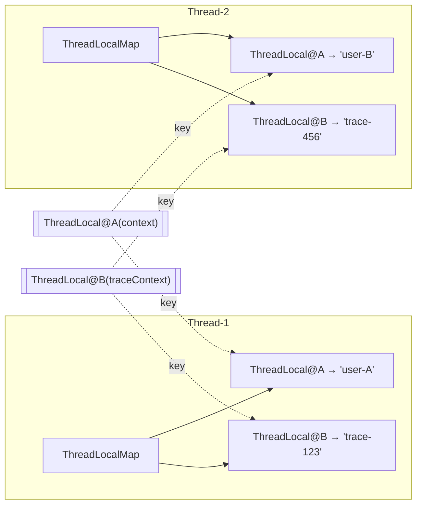
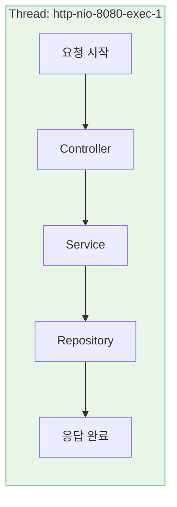
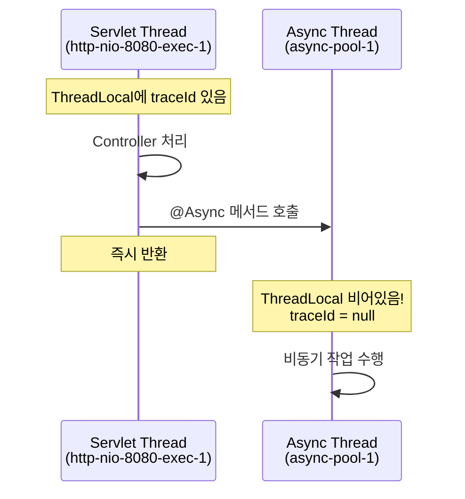
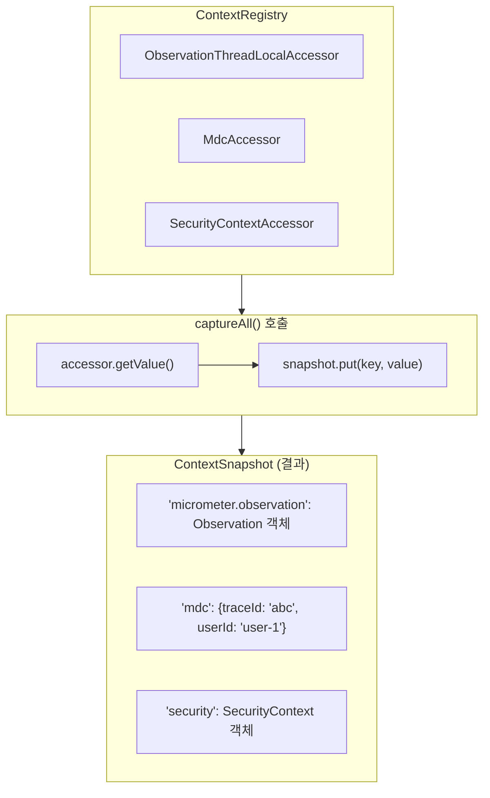
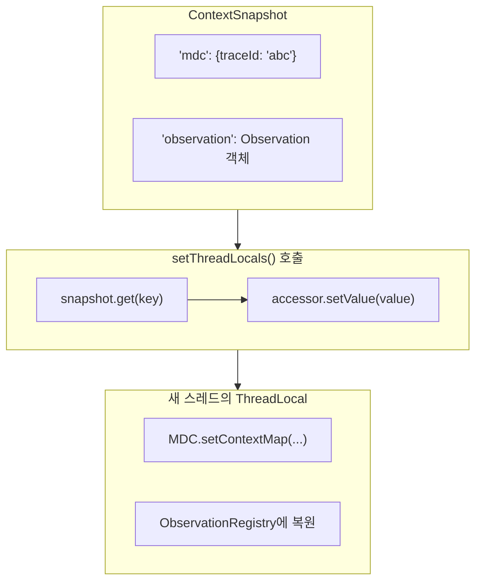
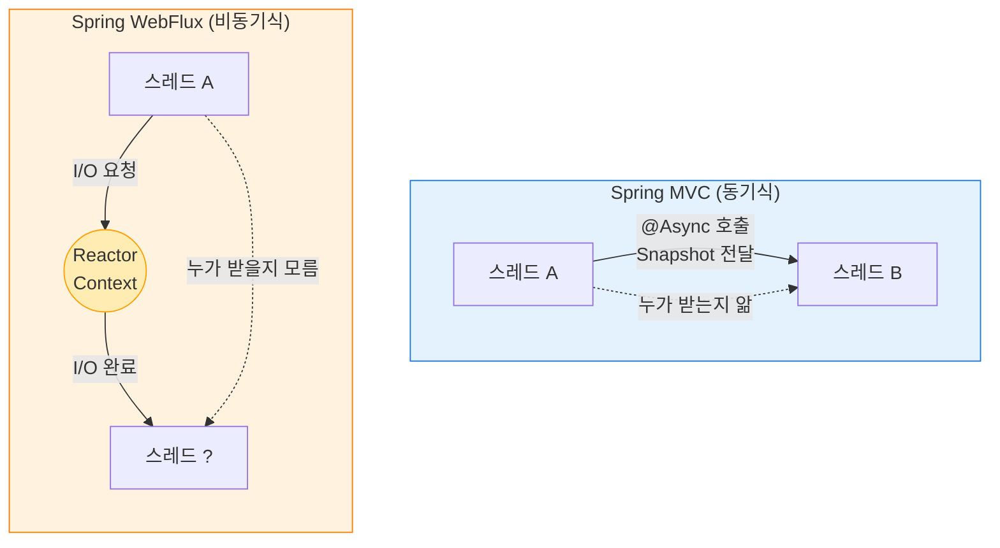

> **Tracing 시리즈**
> 
> 1.  [Observability의 역사부터 Spring 생태계까지 (feat. OTel)](/tracing-1-observability-spring-otel/)
> 2.  **[ThreadLocal과 MDC의 이해](/tracing-2-threadlocal-mdc/) ← 현재 글**
> 3.  [Reactor Context와 비동기 환경](/tracing-3-reactor-context-webflux/)
> 4.  [Kotlin Coroutine과 Context Propagation](/tracing-4-kotlin-coroutine-context-propagation/)
> 5.  [Java Agent vs Library Instrumentation](/tracing-5-java-agent-vs-library-instrumentation/)

## 왜 ThreadLocal을 알아야 할까?

[1편](/tracing-1-observability-spring-otel/)에서 Distributed Tracing의 핵심이 **Trace Context 전파**라는 것을 살펴봤습니다. 서비스 간에는 HTTP 헤더(W3C Trace Context, B3)로 전파하면 되지만, 한 가지 의문이 남습니다.

**“서비스 내부에서는 Trace Context가 어디에 저장되어 있을까?”**

Spring MVC 애플리케이션에서 요청이 들어오면 Controller → Service → Repository를 거치는 동안 `traceId`와 `spanId`는 어딘가에 보관되어야 합니다. 매번 파라미터로 넘기는 건 비현실적이니까요.

정답은 **ThreadLocal**입니다. 그리고 로그에 `traceId`를 자동으로 남기는 **MDC(Mapped Diagnostic Context)** 역시 ThreadLocal 위에서 동작합니다. 이 두 가지를 이해하면 Tracing이 내부적으로 어떻게 작동하는지 명확해집니다.

## ThreadLocal이란?

### 스레드 격리의 필요성

멀티스레드 환경에서 여러 스레드가 하나의 변수를 공유하면 동시성 문제가 발생합니다. 일반적인 해결책은 `synchronized`나 `Lock`을 사용한 동기화지만, 성능 저하가 불가피합니다.

그런데 생각해보면, **애초에 공유할 필요가 없는 데이터**도 있습니다.

-   현재 사용자의 인증 정보
-   현재 요청의 Trace Context
-   현재 트랜잭션 정보

이런 데이터는 **스레드마다 독립적으로** 가지고 있으면 됩니다. 동기화 없이도 안전하게 사용할 수 있고요. 이것이 ThreadLocal의 존재 이유입니다.

### ThreadLocal의 개념

ThreadLocal은 **스레드별로 독립된 변수 저장소**를 제공합니다. 같은 ThreadLocal 객체에 접근해도 각 스레드는 자신만의 값을 읽고 씁니다.

```java
// 같은 ThreadLocal 객체
private static final ThreadLocal<String> context = new ThreadLocal<>();

// Thread-1에서 실행
context.set("user-A");  // Thread-1의 저장소에 저장
context.get();          // "user-A" 반환

// Thread-2에서 실행 (동시에)
context.set("user-B");  // Thread-2의 저장소에 저장
context.get();          // "user-B" 반환 (Thread-1에 영향 없음)
```

마치 각 스레드가 자신만의 `Map`을 가지고 있고, ThreadLocal 객체가 그 Map의 key 역할을 한다고 생각하면 됩니다.

> **🤔 `new ThreadLocal<>()`을 실행하면 바로 저장되나요?**
> 
> 아니요! `new ThreadLocal<>()`은 **ThreadLocal 객체만 생성**합니다. 실제 저장은 **`set()` 호출 시점**에 일어납니다:
> 
> ```java
> ThreadLocal<String> tl = new ThreadLocal<>();  // 아직 아무 일도 안 일어남
> tl.set("value");  // 이 시점에 Thread의 ThreadLocalMap에 저장
> ```

### 내부 구조

실제 구현도 이 비유와 거의 일치합니다.



핵심 포인트:

-   각 **Thread 객체**가 내부에 `ThreadLocalMap`을 가지고 있습니다
-   **ThreadLocal 객체**는 이 Map의 key로 사용됩니다
-   값은 Thread 내부에 저장되므로 다른 스레드에서 접근 불가능합니다

Java 코드로 보면 더 명확합니다:

```java
// Thread 클래스 내부 (실제 JDK 코드 일부)
public class Thread implements Runnable {
    // 각 스레드가 자신만의 ThreadLocalMap을 가짐
    ThreadLocal.ThreadLocalMap threadLocals = null;
}

// ThreadLocal.get() 동작
public T get() {
    Thread t = Thread.currentThread();       // 현재 스레드 가져오기
    ThreadLocalMap map = t.threadLocals;     // 해당 스레드의 Map 가져오기
    if (map != null) {
        Entry e = map.getEntry(this);        // this(ThreadLocal 객체)를 key로 조회
        if (e != null) {
            return (T) e.value;
        }
    }
    return setInitialValue();
}
```

> **🤔 왜 ThreadLocal 객체에 값을 저장하지 않고, Thread 객체에 저장할까?**
> 
> ThreadLocal에 직접 `Map<Thread, Value>`를 두면 될 것 같지만, 이 경우 스레드가 종료되어도 Map에서 Thread를 key로 참조하고 있어 GC가 안 됩니다. 현재 구조에서는 Thread가 종료되면 Thread 내부의 ThreadLocalMap도 함께 GC 대상이 됩니다.

## ThreadLocal 사용법

### 기본 API

```java
// 생성
ThreadLocal<String> threadLocal = new ThreadLocal<>();

// 초기값 지정 (Java 8+)
ThreadLocal<String> withDefault = ThreadLocal.withInitial(() -> "default");

// 값 설정
threadLocal.set("value");

// 값 조회 (없으면 초기값 반환)
String value = threadLocal.get();

// 값 제거 (중요!)
threadLocal.remove();
```

### 실전 예시: 사용자 컨텍스트 관리

```java
public class UserContextHolder {
    private static final ThreadLocal<UserContext> holder = new ThreadLocal<>();
    
    public static void set(UserContext context) {
        holder.set(context);
    }
    
    public static UserContext get() {
        return holder.get();
    }
    
    public static void clear() {
        holder.remove();
    }
}

// Filter에서 설정
@Component
public class UserContextFilter implements Filter {
    @Override
    public void doFilter(ServletRequest request, ServletResponse response, 
                         FilterChain chain) throws IOException, ServletException {
        try {
            UserContext context = extractUserContext((HttpServletRequest) request);
            UserContextHolder.set(context);
            chain.doFilter(request, response);
        } finally {
            UserContextHolder.clear();  // 반드시 정리!
        }
    }
}

// Service에서 사용 (파라미터 없이 접근 가능)
@Service
public class OrderService {
    public void createOrder(OrderRequest request) {
        UserContext user = UserContextHolder.get();  // 어디서든 접근
        log.info("Creating order for user: {}", user.getId());
        // ...
    }
}
```

이 패턴은 Spring Security의 `SecurityContextHolder`, Hibernate의 Session 관리 등에서 광범위하게 사용됩니다.

## ThreadLocal의 한계

### 먼저 알아야 할 것: Spring MVC에서 스레드는 언제 바뀌나?

ThreadLocal의 한계를 이해하려면 먼저 **스레드가 언제 바뀌는지**를 알아야 합니다.

**Spring MVC의 기본 동작 (Thread-per-Request)**

일반적인 Spring MVC 애플리케이션에서는 **한 요청이 하나의 스레드를 끝까지 점유**합니다:



DB 호출이나 외부 API 호출에서 **blocking이 발생해도 스레드는 그대로 기다립니다**. 이것이 “Thread-per-Request” 모델입니다. 이 경우 ThreadLocal은 아무 문제 없이 동작합니다.

**스레드가 바뀌는 경우**

하지만 개발자가 **명시적으로 비동기 처리를 사용하면** 스레드가 바뀝니다:

| 상황 | 스레드 전환 |
| --- | --- |
| 일반적인 Spring MVC 코드 | ❌ 스레드 유지 |
| `@Async` 메서드 호출 | ✅ 다른 스레드풀로 전환 |
| `CompletableFuture.supplyAsync()` | ✅ ForkJoinPool 또는 지정 Executor |
| `DeferredResult`, `Callable` 리턴 | ✅ Servlet 스레드 반납 → 작업 스레드 |

```java
// 이 경우 스레드가 바뀜!
@Async
public CompletableFuture<Result> asyncMethod() {
    // 여기는 다른 스레드!
    log.info("traceId: {}", MDC.get("traceId"));  // null일 수 있음!
}
```



> **🤔 WebFlux는 다른가요?**
> 
> 완전히 다릅니다. WebFlux(Event Loop 모델)에서는 **한 요청이 여러 스레드를 오가며** 처리됩니다. I/O 대기 시 스레드를 반납하고, 응답이 오면 **아무 스레드나** 가져다 씁니다. 그래서 ThreadLocal이 근본적으로 작동하지 않습니다. 이 문제는 3편에서 다룹니다.

### 스레드 풀 환경의 문제

ThreadLocal은 “스레드가 요청마다 새로 생성되고 종료된다”는 가정 하에 잘 동작합니다. 하지만 현실의 서버 애플리케이션은 **스레드 풀**을 사용합니다.

```java
// 스레드 풀: 스레드를 미리 만들어두고 재사용
ExecutorService executor = Executors.newFixedThreadPool(3);

ThreadLocal<String> context = new ThreadLocal<>();

for (int i = 1; i <= 5; i++) {
    final int taskId = i;
    executor.submit(() -> {
        System.out.println("Task " + taskId + " 시작, context = " + context.get());
        context.set("task-" + taskId);
        System.out.println("Task " + taskId + " 종료, context = " + context.get());
    });
}
```

출력 결과 (예시):

```text
Task 1 시작, context = null
Task 1 종료, context = task-1
Task 2 시작, context = null
Task 2 종료, context = task-2
Task 3 시작, context = null
Task 3 종료, context = task-3
Task 4 시작, context = task-1    ← 이전 Task 1의 값이 남아있음!
Task 4 종료, context = task-4
Task 5 시작, context = task-2    ← 이전 Task 2의 값이 남아있음!
Task 5 종료, context = task-5
```

3개의 스레드가 5개의 작업을 처리하면서, Task 4와 5는 이전 작업의 값을 그대로 보게 됩니다. **스레드가 재사용되면서 이전 ThreadLocal 값이 남아있기 때문**입니다.

이 문제가 Tracing에서 발생하면? **전혀 다른 요청의 `traceId`가 로그에 찍히는** 심각한 상황이 됩니다.

### 해결책: 반드시 remove() 호출

```java
executor.submit(() -> {
    try {
        context.set("task-" + taskId);
        // 작업 수행
    } finally {
        context.remove();  // 반드시!
    }
});
```

하지만 사람의 실수는 피할 수 없습니다. 좀 더 근본적인 해결책이 필요합니다.

### 메모리 누수 가능성

또 다른 문제는 메모리 누수입니다. ThreadLocalMap의 Entry는 ThreadLocal을 **WeakReference**로 참조하지만, 값(value)은 **강한 참조**입니다.

```text
Entry(WeakReference<ThreadLocal>, value)
```

ThreadLocal 객체가 GC되면 key는 `null`이 되지만, value는 여전히 Entry에 남아있습니다. 스레드가 살아있는 한 이 value는 GC되지 않습니다. 스레드 풀 환경에서 스레드는 애플리케이션이 종료될 때까지 살아있으므로, **누적된 value들이 메모리를 점유**하게 됩니다.

> **🔑 핵심 원칙: ThreadLocal 사용 후에는 반드시 `remove()`를 호출하세요.**

## 스레드 간 Context 전파 방법들

스레드 풀 환경에서 ThreadLocal 값을 안전하게 전파하는 방법들을 살펴보겠습니다.

### InheritableThreadLocal

Java 표준 라이브러리가 제공하는 첫 번째 해결책입니다.

```java
// 부모 스레드의 값을 자식 스레드가 상속
InheritableThreadLocal<String> context = new InheritableThreadLocal<>();

context.set("parent-value");

new Thread(() -> {
    System.out.println(context.get());  // "parent-value" 출력
}).start();
```

자식 스레드가 생성될 때 부모의 ThreadLocal 값을 **복사**합니다.

**한계점**: 스레드 풀에서는 스레드가 미리 생성되어 있으므로 의미가 없습니다. Task를 submit하는 시점에 스레드가 새로 만들어지는 게 아니니까요.

```java
ExecutorService executor = Executors.newFixedThreadPool(2);
InheritableThreadLocal<String> context = new InheritableThreadLocal<>();

context.set("value-1");
executor.submit(() -> System.out.println(context.get()));  // 동작할 수도 있고

context.set("value-2");  
executor.submit(() -> System.out.println(context.get()));  // value-1이 출력될 수도 있음!
```

> **🤔 왜 결과가 불확실한가요?**
> 
> 스레드 풀의 스레드가 **언제 생성되었는지**에 따라 결과가 달라집니다:
> 
> -   스레드 풀이 lazy하게 스레드를 생성하고, 첫 submit 때 스레드가 만들어졌다면 → 그 시점의 값 상속
> -   스레드가 이미 다른 작업에서 생성되어 있었다면 → 그 때의 값(또는 null) 유지
> 
> 즉, **어떤 스레드가 배정될지 모르고**, **그 스레드가 언제 생성됐는지도 모르기** 때문에 결과를 예측할 수 없습니다.

### TransmittableThreadLocal (TTL)

Alibaba가 만든 오픈소스 라이브러리로, 스레드 풀 환경의 Context 전파 문제를 해결합니다.

```java
TransmittableThreadLocal<String> context = new TransmittableThreadLocal<>();
ExecutorService executor = Executors.newFixedThreadPool(2);

// 방법 1: Runnable 래핑
context.set("value");
executor.submit(TtlRunnable.get(() -> {
    System.out.println(context.get());  // "value" 출력
}));

// 방법 2: ExecutorService 래핑 (권장)
ExecutorService ttlExecutor = TtlExecutors.getTtlExecutorService(executor);
context.set("value");
ttlExecutor.submit(() -> {
    System.out.println(context.get());  // "value" 출력
});
```

TTL은 작업이 submit되는 시점에 ThreadLocal 값을 **스냅샷**으로 캡처하고, 실행 시점에 해당 스레드에 복원합니다.

**사용 환경**: 주로 Alibaba 생태계와 중국 기업들에서 많이 사용됩니다. Spring/Micrometer 생태계에서는 아래에서 설명할 Context Propagation을 더 많이 사용합니다.

### Micrometer Context Propagation

**Spring Boot 3의 표준 솔루션**입니다. `micrometer-tracing`에 의존성으로 포함되어 있습니다.

**핵심 개념: ContextSnapshot은 그냥 Map이다**

Context Propagation의 원리는 의외로 단순합니다. **ThreadLocal 값들을 Map에 복사해두었다가, 다른 스레드에서 그 Map의 값들을 ThreadLocal에 다시 세팅**하는 것입니다.

```java
// 1. 원본 스레드에서 캡처 (ThreadLocal → Map 복사)
ContextSnapshot snapshot = ContextSnapshotFactory.builder()
    .build()
    .captureAll();

// snapshot 내부: Map { "traceId": "abc-123", "mdc": {...}, ... }

// 2. 다른 스레드에서 복원 (Map → ThreadLocal 복사)
executor.submit(() -> {
    try (Scope scope = snapshot.setThreadLocals()) {
        // 이 블록 안에서는 캡처된 ThreadLocal 값들이 복원됨
        String traceId = MDC.get("traceId");  // "abc-123" ✅
    }
    // scope 종료 후 ThreadLocal 정리
});
```

> **🤔 그러면 TTL이랑 원리가 같은 건가요?**
> 
> 맞습니다! 둘 다 “캡처 → 전달 → 복원”의 동일한 원리입니다. TTL은 `TtlRunnable.get()`과 `TtlExecutors.wrap()`으로 편리한 래퍼를 제공하고, Micrometer는 `ContextSnapshot.setThreadLocals()`와 `ContextExecutorService.wrap()`을 제공합니다. 핵심 차이는 Micrometer가 **Reactor Context와의 연동**을 지원해서 WebFlux 환경까지 커버한다는 점입니다.

**ThreadLocalAccessor의 역할**

한 가지 의문이 생깁니다. ThreadLocal은 MDC, SecurityContextHolder, ObservationRegistry 등 **여러 곳에 분산**되어 있는데, ContextSnapshot이 이걸 어떻게 다 알고 캡처할까요?

정답은 **ThreadLocalAccessor**입니다. 각 ThreadLocal에 “어떻게 접근하는지”를 정의한 어댑터입니다.

```java
// MDC용 Accessor 예시
public class MdcAccessor implements ThreadLocalAccessor<Map<String, String>> {
    
    @Override
    public Object key() {
        return "mdc";  // 고유 식별자
    }
    
    @Override
    public Map<String, String> getValue() {
        return MDC.getCopyOfContextMap();  // 캡처 시 호출
    }
    
    @Override
    public void setValue(Map<String, String> value) {
        MDC.setContextMap(value);  // 복원 시 호출
    }
    
    @Override
    public void setValue() {
        MDC.clear();  // 정리 시 호출
    }
}
```

이 Accessor들이 **ContextRegistry**에 등록되고, `captureAll()` 호출 시 등록된 모든 Accessor의 `getValue()`를 호출해서 값을 수집합니다. `setThreadLocals()` 호출 시에는 각 Accessor의 `setValue()`를 호출합니다.



다른 스레드에서 `setThreadLocals()` 호출 시:



Spring Boot 3에서는 `ObservationThreadLocalAccessor` 등이 **SPI(Service Provider Interface)로 자동 등록**되므로, 개발자가 직접 Accessor를 다룰 일은 거의 없습니다.

**Spring MVC에서 @Async에 적용하기**

> **⚠️ 중요: 자동 적용이 아닙니다!**
> 
> Spring Boot는 `@Async`에 대한 Context Propagation을 **기본으로 적용하지 않습니다**. 직접 설정해야 합니다.

**방법 1: TaskDecorator Bean 등록 (권장, 간단)**

```java
@Configuration
public class ContextPropagationConfig {
    
    @Bean
    ContextPropagatingTaskDecorator contextPropagatingTaskDecorator() {
        return new ContextPropagatingTaskDecorator();
    }
}
```

Spring Boot가 `TaskDecorator` Bean을 자동으로 감지해서 `AsyncTaskExecutor`에 연결해줍니다. 별도의 Executor 설정 없이 한 줄로 끝납니다.

**방법 2: AsyncConfigurer 구현 (커스텀 Executor 필요 시)**

스레드 풀 설정을 직접 제어해야 하는 경우:

```java
@Configuration
public class AsyncConfig implements AsyncConfigurer {
    
    @Override
    public Executor getAsyncExecutor() {
        ThreadPoolTaskExecutor executor = new ThreadPoolTaskExecutor();
        executor.setCorePoolSize(10);
        executor.initialize();
        
        // Context Propagation 적용 - 래핑 한 줄로 끝!
        return ContextExecutorService.wrap(executor.getThreadPoolExecutor());
    }
}
```

이제 `@Async` 메서드에서도 `traceId`가 정상적으로 전파됩니다.

> **📌 Spring MVC vs WebFlux: 왜 방식이 달라야 할까?**
> 
> Spring MVC에서는 `@Async` 호출 시점에 **“누가 누구를 호출하는지”** 명확합니다. 그래서 그 순간 ContextSnapshot을 만들어 전달하면 됩니다.
> 
> 반면 WebFlux는 이벤트 기반이라 **스레드 A가 “누가 이어받을지” 모릅니다**. I/O 대기 후 아무 스레드나 가져다 쓰기 때문에, 중간에 **Reactor Context**라는 “구독(Subscription)에 붙어있는 저장소”가 필요합니다.
> 
> Micrometer Context Propagation은 이 둘을 연결하는 **브릿지** 역할을 합니다. ThreadLocal ↔ Reactor Context 간 변환을 지원해서 MVC와 WebFlux가 섞인 환경에서도 Trace가 끊기지 않습니다. 자세한 내용은 3편에서 다룹니다.

## MDC란?

### Mapped Diagnostic Context 소개

MDC(Mapped Diagnostic Context)는 로깅 프레임워크(SLF4J, Logback, Log4j)가 제공하는 **로그 컨텍스트 저장소**입니다. 내부적으로 **ThreadLocal 기반의 Map**으로 구현되어 있습니다.

```java
import org.slf4j.MDC;

// 값 설정
MDC.put("userId", "user-123");
MDC.put("traceId", "abc-456-def");

// 로그 출력 시 자동으로 포함됨
log.info("주문 생성 완료");

// 값 제거
MDC.remove("userId");
MDC.clear();  // 전체 제거
```

Logback 패턴에서 `%X{key}` 구문으로 MDC 값을 출력합니다:

```xml
<pattern>%d{HH:mm:ss.SSS} [%X{traceId}] [%X{userId}] %msg%n</pattern>
```

출력 결과:

```text
14:23:45.123 [abc-456-def] [user-123] 주문 생성 완료
```

### MDC의 내부 구현

Logback의 MDC 구현을 살펴보면 ([GitHub 소스코드](https://github.com/qos-ch/logback/blob/master/logback-classic/src/main/java/ch/qos/logback/classic/util/LogbackMDCAdapter.java)):

```java
// LogbackMDCAdapter.java (간략화)
public class LogbackMDCAdapter implements MDCAdapter {
    
    // ThreadLocal 기반!
    private final ThreadLocal<Map<String, String>> copyOnThreadLocal = 
        new ThreadLocal<>();
    
    public void put(String key, String val) {
        Map<String, String> map = copyOnThreadLocal.get();
        if (map == null) {
            map = new HashMap<>();
            copyOnThreadLocal.set(map);
        }
        map.put(key, val);
    }
    
    public String get(String key) {
        Map<String, String> map = copyOnThreadLocal.get();
        return (map != null) ? map.get(key) : null;
    }
}
```

결국 MDC도 ThreadLocal이기 때문에, 앞서 설명한 **스레드 풀 환경의 문제**가 동일하게 적용됩니다.

### MDC vs 직접 ThreadLocal 사용

| 구분 | MDC | 직접 ThreadLocal |
| --- | --- | --- |
| 목적 | 로그에 컨텍스트 정보 추가 | 범용 스레드 로컬 저장소 |
| 로깅 프레임워크 연동 | 자동 (`%X{key}`) | 수동으로 값 꺼내서 로그 |
| 값 타입 | String만 가능 | 모든 타입 가능 |
| 사용 편의성 | 높음 (표준화된 API) | 직접 관리 필요 |

Trace Context를 로그에 남기는 목적이라면 MDC가 적합합니다.

## Spring Boot 3에서 MDC로 Trace 정보 남기기

### 자동 설정 (권장)

Spring Boot 3 + Micrometer Tracing 조합에서는 **`traceId`와 `spanId`가 자동으로 MDC에 주입**됩니다. 별도의 코드 작성이 필요 없습니다.

`application.yml` 설정만 하면 됩니다:

```yaml
# 로그 패턴에 traceId, spanId 포함
logging:
  pattern:
    level: "%5p [${spring.application.name:},%X{traceId:-},%X{spanId:-}]"
```

또는 Spring Cloud Sleuth 스타일로:

```yaml
logging:
  pattern:
    correlation: "[${spring.application.name:},%X{traceId:-},%X{spanId:-}] "
  include-application-name: false
```

### Logback 직접 설정

`logback-spring.xml`을 사용하면 더 세밀한 제어가 가능합니다:

```xml
<?xml version="1.0" encoding="UTF-8"?>
<configuration>
    <property name="LOG_PATTERN" 
              value="%d{yyyy-MM-dd HH:mm:ss.SSS} %5p [%X{traceId:-},%X{spanId:-}] [%t] %logger{36} - %msg%n"/>
    
    <appender name="CONSOLE" class="ch.qos.logback.core.ConsoleAppender">
        <encoder>
            <pattern>${LOG_PATTERN}</pattern>
        </encoder>
    </appender>
    
    <!-- JSON 포맷 (로그 수집 시스템 연동용) -->
    <appender name="JSON" class="ch.qos.logback.core.ConsoleAppender">
        <encoder class="net.logstash.logback.encoder.LoggingEventCompositeJsonEncoder">
            <providers>
                <timestamp/>
                <logLevel/>
                <loggerName/>
                <threadName/>
                <message/>
                <mdc/>  <!-- MDC 전체를 JSON 필드로 출력 -->
                <stackTrace/>
            </providers>
        </encoder>
    </appender>
    
    <root level="INFO">
        <appender-ref ref="CONSOLE"/>
        <!-- JSON 포맷도 함께 사용하려면 아래 주석 해제 -->
        <!-- <appender-ref ref="JSON"/> -->
    </root>
</configuration>
```

> **🤔 CONSOLE과 JSON, 두 appender가 있는데 뭐가 적용되나요?**
> 
> 이건 **완전히 별개의 두 appender**입니다. Logback에서 appender는 `name` 속성으로 구분됩니다:
> 
> | Appender | 이름 | 역할 | 현재 상태 |
> | --- | --- | --- | --- |
> | CONSOLE | `name="CONSOLE"` | 텍스트 패턴 출력 | ✅ 사용 중 |
> | JSON | `name="JSON"` | JSON 포맷 출력 | ❌ 참조 안 됨 |
> 
> `<root>`의 `<appender-ref>`에서 **실제로 사용할 appender를 지정**합니다. 위 예시에서 JSON appender는 “이런 것도 가능하다”는 참고용이고, 실제로 사용하려면 `<appender-ref ref="JSON"/>`을 추가해야 합니다.
> 
> 둘 다 활성화하면 **하나의 로그가 콘솔에 두 번** 출력됩니다 (텍스트 + JSON). 보통은 환경별로 분리합니다:
> 
> -   개발: CONSOLE (가독성)
> -   운영: JSON (로그 수집 시스템 연동)

> **🤔 Appender와 Encoder의 동작 흐름**
> 
> ```mermaid
> flowchart LR
>     L["log.info() 호출"] --> E["LoggingEvent 생성"]
>     E --> R["Root Logger"]
>     R -->|appender-ref| A["Appender"]
>     A --> EN["Encoder"]
>     EN --> O["출력"]
>     
>     subgraph "LoggingEvent에 포함되는 것"
>         M["timestamp, level, message,<br/>thread, MDC Map(스냅샷)"]
>     end
> ```
> 
> 1.  **LoggingEvent 생성**: `log.info()` 호출 시 **현재 스레드의 MDC 전체를 스냅샷**으로 복사
> 2.  **Logger → Appender 전달**: `<appender-ref>`로 연결된 appender에만 전달
> 3.  **Encoder 처리**: `%X{traceId}`는 LoggingEvent에 저장된 MDC 스냅샷에서 값을 읽음
> 
> **핵심**: 로그 호출 시점에 MDC를 캡처합니다. 비동기 환경에서 MDC가 비어있으면 로그에도 값이 없습니다.

### 출력 예시

설정 후 애플리케이션에서 로그를 출력하면:

```text
2024-01-15 14:23:45.123  INFO [abc123def456,789xyz] [http-nio-8080-exec-1] c.e.OrderService - 주문 생성 시작
2024-01-15 14:23:45.234  INFO [abc123def456,012uvw] [http-nio-8080-exec-1] c.e.PaymentService - 결제 처리 중
2024-01-15 14:23:45.345  INFO [abc123def456,345rst] [http-nio-8080-exec-1] c.e.InventoryService - 재고 차감 완료
```

동일한 `traceId`(abc123def456)로 요청의 흐름을 추적할 수 있고, 각 단계별 `spanId`로 세부 구간을 식별할 수 있습니다.

## 실전 적용: 커스텀 정보 MDC에 추가하기

### Filter를 통한 설정

`traceId` 외에 비즈니스 정보(userId, orderId 등)도 로그에 남기고 싶다면:

```java
@Component
@Order(Ordered.HIGHEST_PRECEDENCE)
public class MdcLoggingFilter implements Filter {
    
    @Override
    public void doFilter(ServletRequest request, ServletResponse response,
                         FilterChain chain) throws IOException, ServletException {
        HttpServletRequest httpRequest = (HttpServletRequest) request;
        
        try {
            // 요청에서 정보 추출하여 MDC에 설정
            String userId = extractUserId(httpRequest);
            String requestId = httpRequest.getHeader("X-Request-ID");
            
            if (userId != null) {
                MDC.put("userId", userId);
            }
            if (requestId != null) {
                MDC.put("requestId", requestId);
            }
            
            chain.doFilter(request, response);
            
        } finally {
            // 반드시 정리!
            MDC.clear();
        }
    }
    
    private String extractUserId(HttpServletRequest request) {
        // JWT 토큰에서 추출하거나, SecurityContext에서 가져오기
        // ...
    }
}
```

### Baggage를 MDC로 전파

Micrometer Tracing의 Baggage를 MDC에 자동으로 전파할 수도 있습니다:

```yaml
management:
  tracing:
    baggage:
      remote-fields:
        - x-user-id
        - x-tenant-id
      correlation:
        fields:
          - x-user-id
          - x-tenant-id
```

이렇게 설정하면 `X-User-ID` 헤더로 전달된 값이 자동으로 MDC의 `x-user-id` 키에 저장됩니다.

> **🤔 `x-user-id` 같은 커스텀 헤더도 Baggage로 인식되나요?**
> 
> **W3C Baggage 표준**은 `baggage: key=value,key2=value2` 형태의 단일 헤더를 사용합니다. 하지만 Spring Boot의 `remote-fields` 설정은 **임의의 HTTP 헤더를 baggage처럼 취급**하게 해주는 **확장 기능**입니다.
> 
> | 방식 | 헤더 형태 | 표준 여부 |
> | --- | --- | --- |
> | W3C Baggage | `baggage: userId=user-1,tenantId=t-1` | ✅ W3C 표준 |
> | remote-fields | `x-user-id: user-1` (개별 헤더) | ❌ Spring Boot 확장 |
> 
> 레거시 시스템이나 기존에 `X-` 접두사 헤더를 사용하던 환경에서 유용합니다. `remote-fields`에 등록한 헤더는:
> 
> 1.  들어오는 요청에서 값을 읽어 baggage로 저장
> 2.  `correlation.fields`에도 설정하면 MDC에 자동 추가
> 3.  나가는 요청(RestTemplate, WebClient)에 같은 이름의 헤더로 전파

> **🤔 W3C Baggage 헤더와 커스텀 헤더는 뭐가 다른가요?**
> 
> W3C Trace Context 표준에서 정의한 **baggage** 헤더는 `baggage: key1=value1,key2=value2` 형태입니다:
> 
> ```http
> baggage: userId=user-123,tenantId=tenant-456
> ```
> 
> 하지만 `remote-fields`에 `x-user-id`처럼 **임의의 헤더 이름**을 설정하면, 그 헤더도 baggage처럼 취급됩니다:
> 
> ```http
> X-User-ID: user-123  (이 헤더도 baggage로 인식!)
> ```
> 
> 이건 W3C 표준이 아니라 **Spring Boot/Micrometer의 확장 기능**입니다. 레거시 시스템이나 기존 인프라와 통합할 때 유용합니다. 공식 문서에서도 “setting this property to `baggage1` results in an HTTP header `baggage1: value1`“라고 설명하고 있습니다.

## 흔한 실수와 주의사항

### 1\. MDC.clear()를 finally에서 호출하지 않음

```java
// ❌ 잘못된 예
public void process() {
    MDC.put("key", "value");
    doSomething();  // 여기서 예외 발생하면?
    MDC.clear();    // 실행 안 됨!
}

// ✅ 올바른 예
public void process() {
    try {
        MDC.put("key", "value");
        doSomething();
    } finally {
        MDC.clear();
    }
}
```

### 2\. 비동기 호출 시 Context 유실

```java
// ❌ Context가 전파되지 않음
@Async
public void asyncProcess() {
    log.info("traceId: {}", MDC.get("traceId"));  // null!
}

// ✅ Context Propagation 설정 필요
// AsyncConfig에서 ContextExecutorService.wrap() 적용
```

### 3\. 스레드 풀 공유 시 Context 오염

```java
// ❌ 위험: 여러 요청이 같은 스레드를 공유
executor.submit(() -> {
    String traceId = MDC.get("traceId");  // 다른 요청의 traceId일 수 있음!
});

// ✅ ContextSnapshot 사용
ContextSnapshot snapshot = ContextSnapshotFactory.builder().build().captureAll();
executor.submit(() -> {
    try (Scope scope = snapshot.setThreadLocals()) {
        String traceId = MDC.get("traceId");  // 정확한 값
    }
});
```

> **🤔 그런데 WebFlux에서는 어떻게 하나요?**
> 
> WebFlux는 스레드 모델 자체가 다릅니다. 하나의 요청이 **여러 스레드를 오가며** 처리되기 때문에 ThreadLocal/MDC가 근본적으로 작동하지 않습니다.
> 
> -   **MVC**: 스레드 A → 스레드 B 직접 전환 (누가 누구를 호출하는지 앎)
> -   **WebFlux**: 스레드 A → ??? (I/O 대기 후 아무 스레드나 배정)
> 
> 그래서 WebFlux에서는 ThreadLocal 대신 **Reactor Context**라는 “구독(Subscription)에 붙어있는 Map”을 저장소로 사용합니다. Micrometer Context Propagation이 이 둘을 연결하는 브릿지 역할을 하고요. 3편에서 자세히 다룹니다.



## 정리

이번 글에서 살펴본 핵심 내용입니다:

| 개념 | 핵심 포인트 |
| --- | --- |
| **ThreadLocal** | 스레드별 독립된 저장소, Thread 객체 내부의 ThreadLocalMap에 저장 |
| **Spring MVC 스레드 모델** | 기본은 Thread-per-Request, `@Async` 등 비동기 사용 시 스레드 전환 |
| **스레드 풀 문제** | 스레드 재사용 시 이전 값 잔존 → 반드시 `remove()` 호출 |
| **Context Propagation** | ContextSnapshot = ThreadLocal 값들의 Map, ThreadLocalAccessor로 캡처/복원 |
| **TTL vs Micrometer** | 원리는 동일, Micrometer는 Reactor Context 연동 지원 |
| **MDC** | 로깅 전용 ThreadLocal, `%X{key}`로 로그 패턴에 포함 |
| **Spring Boot 3** | traceId/spanId 자동 MDC 주입, Baggage correlation 지원 |

**핵심 요약**: 동기식 Spring MVC에서는 ThreadLocal이 잘 동작하지만, `@Async` 같은 비동기 호출 시에는 **ContextExecutorService.wrap()** 으로 Context를 전파해야 합니다.

다음 편에서는 **리액티브 환경(WebFlux)에서의 Context 전파**를 다룹니다. ThreadLocal이 근본적으로 작동하지 않는 환경에서 Reactor Context와 `Hooks.enableAutomaticContextPropagation()`이 어떻게 문제를 해결하는지 알아보겠습니다.

## 참고 자료

-   [Java ThreadLocal 공식 문서](https://docs.oracle.com/en/java/javase/21/docs/api/java.base/java/lang/ThreadLocal.html)
-   [Logback MDC 공식 문서](https://logback.qos.ch/manual/mdc.html)
-   [LogbackMDCAdapter.java 소스코드 (GitHub)](https://github.com/qos-ch/logback/blob/master/logback-classic/src/main/java/ch/qos/logback/classic/util/LogbackMDCAdapter.java)
-   [Micrometer Context Propagation](https://docs.micrometer.io/context-propagation/reference/)
-   [Spring Boot Tracing 공식 문서](https://docs.spring.io/spring-boot/reference/actuator/tracing.html)
-   [OpenTelemetry with Spring Boot (Spring 블로그)](https://spring.io/blog/2025/11/18/opentelemetry-with-spring-boot/)
-   [Baeldung – Java ThreadLocal](https://www.baeldung.com/java-threadlocal)
-   [alibaba/transmittable-thread-local](https://github.com/alibaba/transmittable-thread-local)
