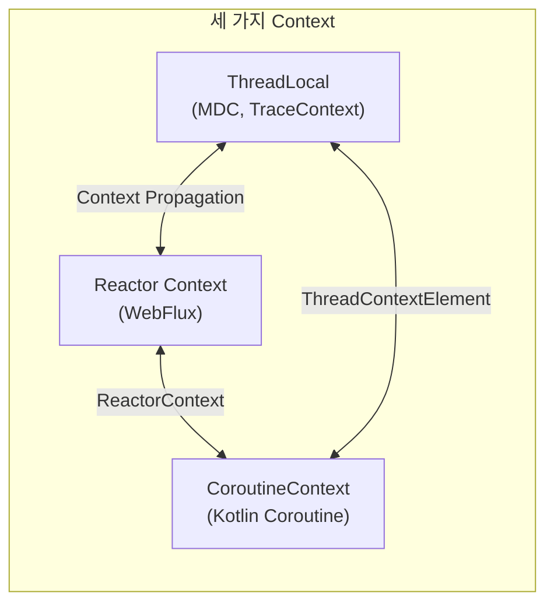
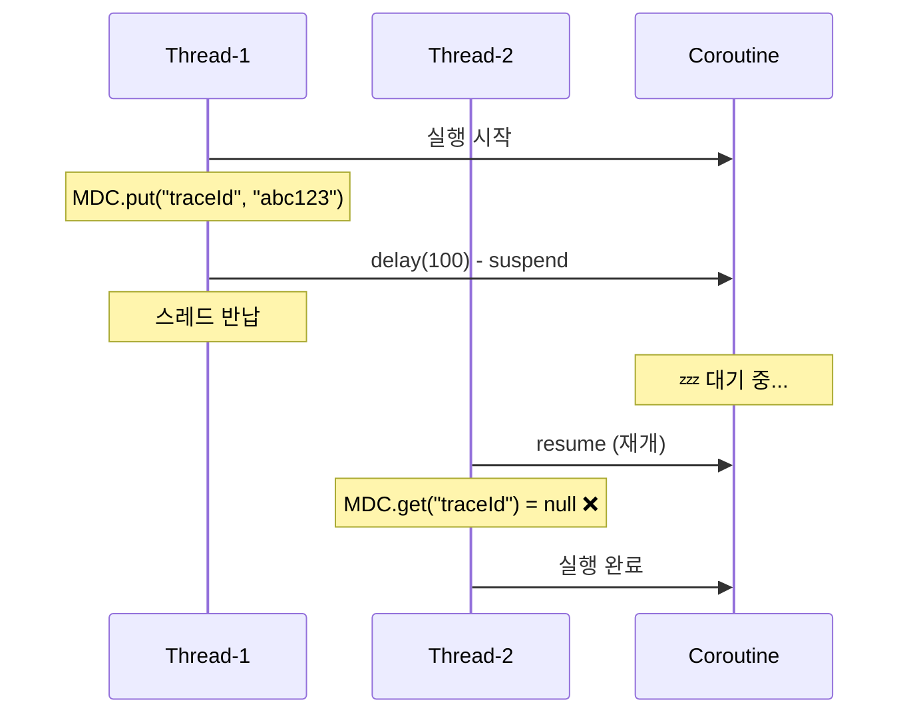
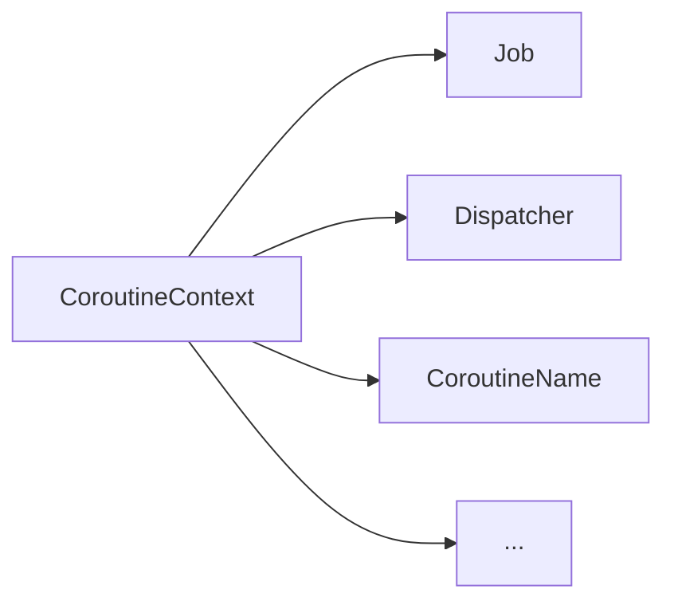
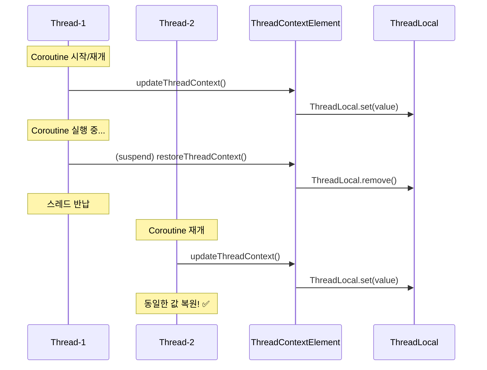
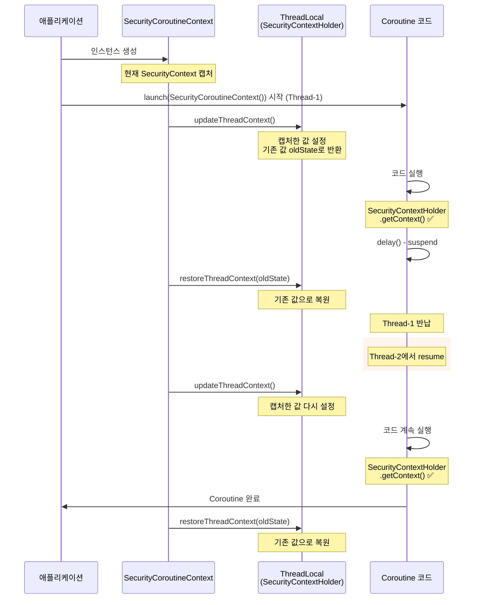
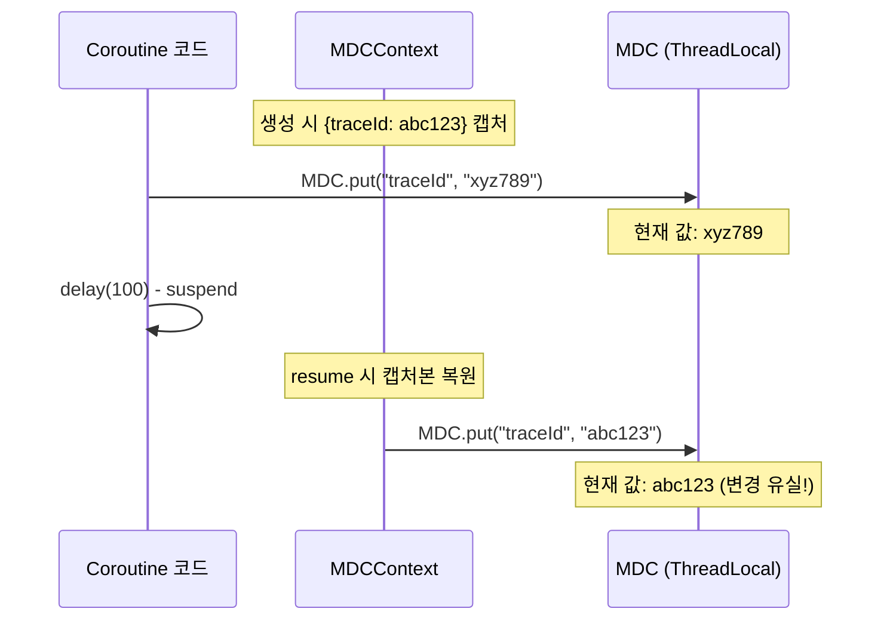
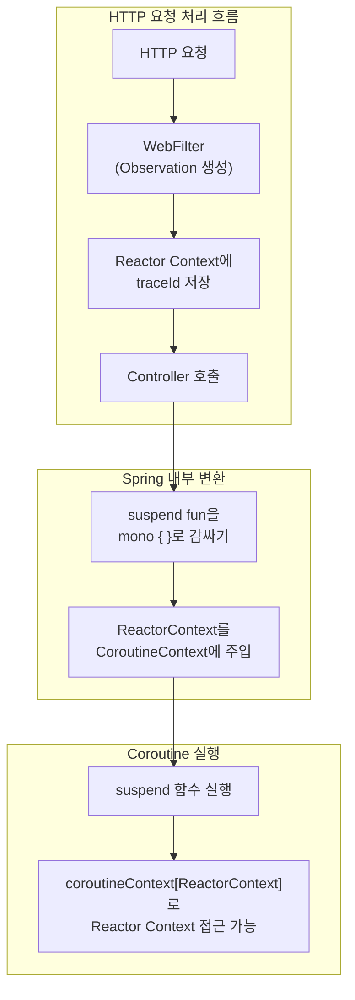
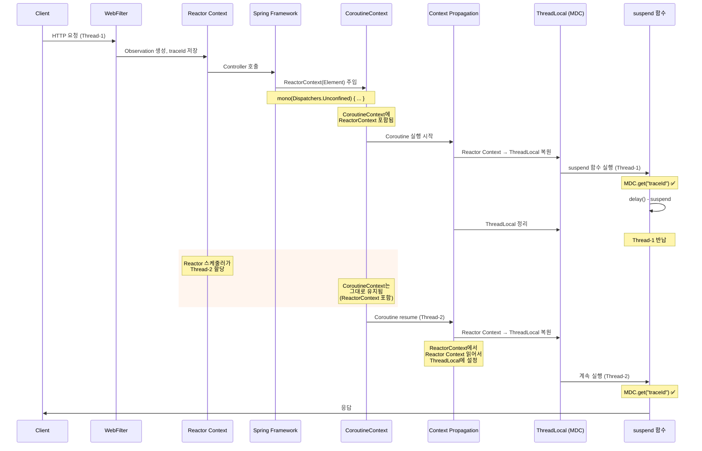
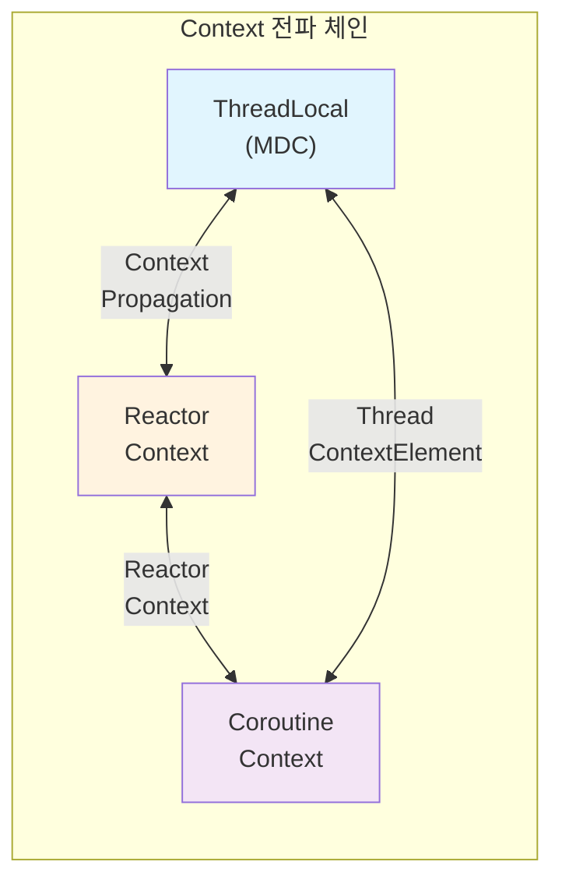

> **Tracing 시리즈**
> 
> 1.  [Observability의 역사부터 Spring 생태계까지 (feat. OTel)](/tracing-1-observability-spring-otel/)
> 2.  [ThreadLocal과 MDC의 이해](/tracing-2-threadlocal-mdc/)
> 3.  [Reactor Context와 비동기 환경](/tracing-3-reactor-context-webflux/)
> 4.  **[Kotlin Coroutine과 Context Propagation](/tracing-4-kotlin-coroutine-context-propagation/) ← 현재 글**
> 5.  [Java Agent vs Library Instrumentation](/tracing-5-java-agent-vs-library-instrumentation/)

## 들어가며

[이전 글](/tracing-3-reactor-context-webflux/)에서 Reactor Context가 WebFlux의 Event Loop 환경에서 어떻게 traceId를 유지하는지 살펴봤습니다. Subscriber 체인에 Context를 바인딩하는 방식으로 스레드 전환 문제를 해결했죠.

그런데 Kotlin을 사용한다면 상황이 조금 더 복잡해집니다. Kotlin Coroutine은 **CoroutineContext**라는 자체 Context 시스템을 가지고 있기 때문입니다. 이제 우리가 다뤄야 할 Context가 세 가지가 되었습니다.



Spring WebFlux에서 Kotlin Coroutine을 사용하면, 이 세 가지 Context가 모두 얽히게 됩니다. traceId가 제대로 전파되려면 이들 사이의 **브릿지**가 잘 설정되어야 합니다.

이번 글에서는 CoroutineContext의 동작 원리를 이해하고, Spring Boot 3에서 세 Context를 자연스럽게 연결하는 방법을 알아보겠습니다.

## Coroutine에서 ThreadLocal이 안 되는 이유

### suspend와 스레드 전환

Coroutine의 핵심은 **중단(suspend)과 재개(resume)** 입니다. suspend 함수가 실행되다가 I/O 등으로 대기가 필요하면 잠시 중단되고, 결과가 준비되면 다시 재개됩니다. 문제는 **재개될 때 다른 스레드에서 실행될 수 있다**는 것입니다.

> **🤔 Coroutine도 WebFlux처럼 Event Loop인가요?**
> 
> 아닙니다. Coroutine은 **Dispatcher**가 스레드 풀에서 가용한 스레드를 할당하는 방식입니다. suspend 후 resume될 때 같은 스레드가 비어있지 않으면 다른 스레드가 할당될 수 있습니다. Event Loop와는 다른 메커니즘이지만, **“스레드가 바뀔 수 있다”**는 점에서 ThreadLocal 문제가 동일하게 발생합니다.

```kotlin
suspend fun processOrder(orderId: String) {
    // 1️⃣ Thread-1에서 실행
    MDC.put("traceId", "abc123")
    log.info("[${MDC.get("traceId")}] 주문 처리 시작")  // ✅ abc123
    
    delay(100)  // suspend point! 💤
    
    // 2️⃣ Thread-2에서 재개될 수 있음
    log.info("[${MDC.get("traceId")}] 주문 처리 완료")  // ❌ null!
}
```

실행 결과:

```text
[abc123] 주문 처리 시작    // Thread-1
[null] 주문 처리 완료      // Thread-2 (ThreadLocal 값 없음!)
```



### Reactor Context와 같은 문제, 다른 해결책

3편에서 본 Reactor의 문제와 본질적으로 같습니다. 스레드가 바뀌면 ThreadLocal 값이 사라지죠. 하지만 해결 방식은 다릅니다.

| 환경 | 문제 원인 | 해결 방식 |
| --- | --- | --- |
| Reactor | 연산자마다 스레드 전환 | **Reactor Context** (Subscriber에 바인딩) |
| Coroutine | suspend/resume 시 스레드 전환 | **CoroutineContext** (Coroutine에 바인딩) |

Coroutine은 자체적인 Context 시스템이 있고, 이것이 Coroutine의 전체 생명주기 동안 유지됩니다.

## CoroutineContext 이해하기

### Context는 Element들의 집합

CoroutineContext는 여러 **Element**들의 집합입니다. 각 Element는 고유한 **Key**를 가지며, Context에서 Key로 Element를 조회할 수 있습니다.

```kotlin
// CoroutineContext의 주요 Element들
val context: CoroutineContext = 
    Job() +                          // 코루틴 생명주기 관리
    Dispatchers.IO +                 // 실행 스레드 결정
    CoroutineName("order-worker")    // 디버깅용 이름

// Key로 Element 조회
val job = context[Job]
val dispatcher = context[CoroutineDispatcher]
val name = context[CoroutineName]
```



각 Element는 고유한 Key로 조회할 수 있습니다: `context[Job]`, `context[CoroutineDispatcher]`, `context[CoroutineName]`

### Context 결합: + 연산자

Context는 `+` 연산자로 결합할 수 있습니다. 같은 Key의 Element가 있으면 오른쪽 것이 왼쪽을 덮어씁니다.

```kotlin
val base = Dispatchers.Default + CoroutineName("base")
// base = {Dispatcher: Default, CoroutineName: "base"}

val extended = base + Dispatchers.IO
// extended = {Dispatcher: IO, CoroutineName: "base"}
// Dispatcher가 Default → IO로 교체됨
// CoroutineName은 그대로 유지
```

### 자식 Coroutine으로의 상속

부모 Coroutine의 Context는 자식에게 **상속**됩니다. 자식은 필요한 Element만 추가하거나 덮어쓸 수 있습니다.

```text
launch(Dispatchers.IO + CoroutineName("parent")) {
    // 부모 Context: Dispatchers.IO + CoroutineName("parent")
    
    launch {
        // 자식 Context: 부모 Context 상속 (Dispatchers.IO + CoroutineName("parent"))
    }
    
    launch(CoroutineName("child")) {
        // 자식 Context: Dispatchers.IO + CoroutineName("child")
        // CoroutineName만 덮어씀
    }
}
```

이 상속 메커니즘 덕분에, 부모에서 설정한 Context Element가 모든 자식 Coroutine에 자동으로 전파됩니다. traceId를 담은 Element도 마찬가지입니다.

## ThreadLocal ↔ Coroutine 연결: ThreadContextElement

### asContextElement()로 ThreadLocal 전파하기

Kotlin Coroutines 라이브러리는 ThreadLocal을 Coroutine에서 사용할 수 있게 해주는 `asContextElement()` 확장 함수를 제공합니다.

```kotlin
val traceId = ThreadLocal<String>()

fun main() = runBlocking {
    traceId.set("abc123")
    
    // ThreadLocal을 CoroutineContext Element로 변환
    launch(Dispatchers.Default + traceId.asContextElement()) {
        println(traceId.get())  // ✅ abc123
        
        delay(100)  // 스레드 전환 발생!
        
        println(traceId.get())  // ✅ abc123 (여전히 유지!)
    }
}
```

`asContextElement()`가 하는 일:

1.  Coroutine이 **재개** (resume) 될 때 → ThreadLocal에 값 설정
2.  Coroutine이 **중단** (suspend) 될 때 → ThreadLocal에서 값 제거

### ThreadContextElement 내부 동작

`asContextElement()`는 내부적으로 `ThreadContextElement` 인터페이스를 구현합니다.

```kotlin
interface ThreadContextElement<S> : CoroutineContext.Element {
    // Coroutine이 스레드에서 재개될 때 호출
    fun updateThreadContext(context: CoroutineContext): S
    
    // Coroutine이 스레드에서 중단될 때 호출
    fun restoreThreadContext(context: CoroutineContext, oldState: S)
}
```



**핵심**: ThreadContextElement는 값을 CoroutineContext에 저장하고, 매번 스레드가 바뀔 때마다 ThreadLocal에 복원합니다.

### 직접 구현해보기

`asContextElement()`가 내부적으로 어떻게 동작하는지 이해하기 위해, 커스텀 ThreadContextElement를 직접 만들어봅시다. Spring Security의 SecurityContext를 Coroutine에서 유지하는 예제입니다.

```xml
class SecurityCoroutineContext(
    // 1️⃣ 인스턴스 생성 시점의 SecurityContext를 캡처 (기본값)
    private val securityContext: SecurityContext = SecurityContextHolder.getContext()
) : ThreadContextElement<SecurityContext?> {
    
    // 2️⃣ CoroutineContext에서 이 Element를 찾을 때 사용할 Key
    companion object Key : CoroutineContext.Key<SecurityCoroutineContext>
    override val key: CoroutineContext.Key<SecurityCoroutineContext> = Key
    
    // 3️⃣ Coroutine이 스레드에서 실행되기 직전에 호출
    override fun updateThreadContext(context: CoroutineContext): SecurityContext? {
        val oldContext = SecurityContextHolder.getContext()  // 현재 스레드 값 백업
        SecurityContextHolder.setContext(securityContext)  // 인스턴트 생성할 때 캡처해둔 값으로 설정
        return oldContext  // 백업본 반환 (나중에 복원용)
    }
    
    // 4️⃣ Coroutine이 suspend되거나 완료될 때 호출
    override fun restoreThreadContext(context: CoroutineContext, oldState: SecurityContext?) {
        if (oldState == null) {
            SecurityContextHolder.clearContext()
        } else {
            SecurityContextHolder.setContext(oldState)  // 원래 값 복원
        }
    }
}
```

> **💡 핵심 포인트**
> 
> -   `SecurityCoroutineContext()`를 호출할 때마다 **새 인스턴스가 생성**되고, 그 시점의 SecurityContext가 캡처됩니다.
> -   Coroutine이 **resume**될 때 → 캡처해둔 값을 ThreadLocal에 설정
> -   Coroutine이 **suspend**될 때 → ThreadLocal을 원래 값으로 복원
> -   스레드가 바뀌어도 **CoroutineContext에 저장된 값**이 매번 ThreadLocal에 복원됩니다.
> 
> 참고: `SecurityContextHolder`는 Spring Security의 **ThreadLocal 기반 싱글톤**입니다. `getContext()`로 현재 스레드의 SecurityContext를 가져오고, `setContext()`로 설정합니다.

동작 흐름:



사용 예시:

```kotlin
// 현재 SecurityContext가 캡처됨
launch(SecurityCoroutineContext()) {
    // Thread-1에서 실행
    val userName = SecurityContextHolder.getContext().authentication.name
    log.info("사용자: $userName")  // ✅ 정상 출력
    
    delay(100)  // 스레드 전환 발생!
    
    // Thread-2에서 실행 - ThreadContextElement가 SecurityContext를 복원해줌
    val sameUser = SecurityContextHolder.getContext().authentication.name
    log.info("여전히 같은 사용자: $sameUser")  // ✅ 동일한 값!
}
```

**ThreadContextElement가 없었다면** delay() 이후 `SecurityContextHolder.getContext()`는 빈 SecurityContext를 반환하거나 예외가 발생했을 것입니다.

## MDCContext: SLF4J MDC 전용 솔루션

### kotlinx-coroutines-slf4j 라이브러리

MDC를 Coroutine에서 사용하는 경우가 많아서, 공식 라이브러리가 제공됩니다.

```kotlin
dependencies {
    implementation("org.jetbrains.kotlinx:kotlinx-coroutines-slf4j:1.8.0")
}
```

사용법:

```text
import kotlinx.coroutines.slf4j.MDCContext

MDC.put("traceId", "abc123")

launch(MDCContext()) {
    log.info("처리 시작")  // ✅ [abc123] 처리 시작
    
    delay(100)
    
    log.info("처리 완료")  // ✅ [abc123] 처리 완료
}
```

### 주의: Coroutine 내부에서 MDC.put()은 유실됩니다

**중요한 함정**이 있습니다. Coroutine 내부에서 `MDC.put()`으로 값을 변경해도, 다음 suspension 이후에는 **원래 값으로 복원**됩니다.

```text
MDC.put("traceId", "abc123")

launch(MDCContext()) {
    log.info("[${MDC.get("traceId")}]")  // abc123
    
    MDC.put("traceId", "xyz789")  // 값 변경!
    log.info("[${MDC.get("traceId")}]")  // xyz789
    
    delay(100)  // suspension!
    
    // ❌ MDCContext가 원래 값(abc123)을 복원함
    log.info("[${MDC.get("traceId")}]")  // abc123 (xyz789가 아님!)
}
```

**왜 이런 일이 발생할까요?**

`MDCContext()`는 **생성 시점의 MDC 값을 캡처**합니다. suspension 후 재개될 때, 캡처해둔 값을 ThreadLocal에 복원합니다. Coroutine 내부에서 변경한 값은 캡처본에 반영되지 않습니다.



### 해결: withContext(MDCContext())로 새 캡처본 생성

변경된 MDC 값을 유지하려면 `withContext(MDCContext())`로 새로운 캡처본을 만들어야 합니다.

```text
MDC.put("traceId", "abc123")

launch(MDCContext()) {
    log.info("[${MDC.get("traceId")}]")  // abc123
    
    MDC.put("traceId", "xyz789")
    
    // 새 MDCContext 생성 → 현재 MDC 값(xyz789) 캡처
    withContext(MDCContext()) {
        delay(100)
        log.info("[${MDC.get("traceId")}]")  // ✅ xyz789
    }
}
```

> **💡 실무 팁**
> 
> 일반적인 tracing에서는 요청 시작 시 설정된 traceId를 그대로 사용합니다. Coroutine 내부에서 MDC를 변경할 일은 거의 없으므로, 이 문제를 겪을 일은 많지 않습니다. 하지만 baggage 같은 동적 값을 다룬다면 주의가 필요합니다.

## Reactor Context ↔ Coroutine 통합

### WebFlux + Coroutine 조합의 복잡성

Spring WebFlux에서 Kotlin Coroutine을 사용하면, 두 가지 Context 시스템이 만납니다:

-   **Reactor Context**: WebFlux의 Subscriber 체인에 바인딩
-   **CoroutineContext**: Kotlin Coroutine에 바인딩

```kotlin
@RestController
class OrderController {
    
    @GetMapping("/orders/{id}")
    suspend fun getOrder(@PathVariable id: String): Order {
        // 여기는 Coroutine 세계
        // Reactor Context에 있는 traceId를 어떻게 가져올까?
        
        delay(100)
        return orderService.findById(id)
    }
}
```

### ReactorContext: 두 세계의 브릿지

`kotlinx-coroutines-reactor` 라이브러리가 `ReactorContext`라는 브릿지를 제공합니다.

```kotlin
dependencies {
    implementation("org.jetbrains.kotlinx:kotlinx-coroutines-reactor:1.8.0")
}
```
```kotlin
import kotlinx.coroutines.reactor.ReactorContext

// Reactor → Coroutine: Reactor Context를 CoroutineContext에 주입
mono {
    // Coroutine 안에서 Reactor Context 접근
    val reactorCtx = coroutineContext[ReactorContext]?.context
    val traceId = reactorCtx?.get<String>("traceId")
}

// Coroutine → Reactor: CoroutineContext에서 Reactor Context 추출
val mono = mono(ReactorContext(Context.of("traceId", "abc123"))) {
    // ...
}
```

### Spring WebFlux의 자동 통합

좋은 소식은, **Spring WebFlux가 이 통합을 자동으로 처리**한다는 것입니다. suspend 함수로 선언된 Controller 메서드는 내부적으로 Reactor의 `mono { }` 빌더로 감싸지고, Reactor Context가 자동으로 CoroutineContext에 주입됩니다.

```kotlin
// Spring이 내부적으로 이렇게 처리함 (간략화)
fun invokeSuspendingFunction(method: Method, ...): Mono<*> {
    return mono(Dispatchers.Unconfined) {
        // ReactorContext가 CoroutineContext에 자동 주입됨
        method.callSuspend(...)
    }
}
```

> **🤔 위에서 `mono`는 Coroutine → Reactor 방향 아닌가요?**
> 
> 맞습니다! Spring은 suspend 함수의 **결과를 Mono로 변환**해서 Reactor 파이프라인에 연결합니다. 이 과정에서 `mono` 빌더가 자동으로 **현재 Reactor Context를 CoroutineContext에 주입**합니다. 결과적으로 suspend 함수 내부에서 Reactor Context에 접근할 수 있게 됩니다.



## Spring Boot 3 실전 설정

### 의존성 구성

```kotlin
// build.gradle.kts
dependencies {
    // Spring Boot WebFlux
    implementation("org.springframework.boot:spring-boot-starter-webflux")
    
    // Kotlin Coroutines
    implementation("org.jetbrains.kotlinx:kotlinx-coroutines-core")
    implementation("org.jetbrains.kotlinx:kotlinx-coroutines-reactor")
    implementation("org.jetbrains.kotlinx:kotlinx-coroutines-slf4j")
    
    // Micrometer Tracing + Context Propagation
    implementation("io.micrometer:micrometer-tracing-bridge-otel")
    implementation("io.opentelemetry:opentelemetry-exporter-otlp")
    implementation("io.micrometer:context-propagation")
}
```

### application.yml 설정

```yaml
spring:
  application:
    name: order-service
  reactor:
    context-propagation: auto  # 핵심 설정!

management:
  tracing:
    sampling:
      probability: 1.0
  otlp:
    tracing:
      endpoint: http://localhost:4318/v1/traces

logging:
  pattern:
    level: "%5p [${spring.application.name:},%X{traceId:-},%X{spanId:-}]"
```

`spring.reactor.context-propagation=auto`가 핵심입니다. 이 설정이 Reactor Context와 ThreadLocal 사이의 자동 전파를 활성화합니다.

### Logback 설정

```xml
<!-- logback-spring.xml -->
<configuration>
    <appender name="CONSOLE" class="ch.qos.logback.core.ConsoleAppender">
        <encoder>
            <pattern>%d{HH:mm:ss.SSS} [%X{traceId:-},%X{spanId:-}] %-5level %logger{36} - %msg%n</pattern>
        </encoder>
    </appender>
    
    <root level="INFO">
        <appender-ref ref="CONSOLE"/>
    </root>
</configuration>
```

### Controller 예시

```xml
@RestController
class OrderController(
    private val orderService: OrderService
) {
    private val log = LoggerFactory.getLogger(javaClass)
    
    @GetMapping("/orders/{id}")
    suspend fun getOrder(@PathVariable id: String): Order {
        log.info("주문 조회 시작: $id")  // ✅ traceId 자동 포함
        
        delay(100)  // 스레드 전환 발생!
        
        log.info("DB 조회 전")  // ✅ traceId 유지
        val order = orderService.findById(id)
        
        log.info("주문 조회 완료")  // ✅ traceId 유지
        return order
    }
    
    @GetMapping("/orders")
    fun getAllOrders(): Flow<Order> = flow {  // suspend 아님!
        log.info("전체 주문 조회 시작")  // ✅ traceId 자동 포함
        
        orderService.findAll().collect { order ->
            log.info("주문 emit: ${order.id}")  // ✅ traceId 유지
            emit(order)
        }
    }
}
```

> **🤔 왜 `getAllOrders()`는 suspend가 아닌가요?**
> 
> `Flow`를 반환하는 함수는 **suspend가 아닙니다**. Flow는 Coroutine 세계의 **Flux**라고 생각하면 됩니다:
> 
> | Reactor | Coroutine |
> | --- | --- |
> | Mono (0~1개) | suspend fun 반환값 |
> | Flux (0~N개) | Flow |
> 
> Flow는 **cold stream**이라서, 함수 호출 시점에는 아무것도 실행되지 않습니다. 실제 실행은 누군가 `collect()`를 호출할 때 시작됩니다.
> 
> ```javascript
> fun getAllOrders(): Flow<Order> = flow { ... }  // Flow "정의"만 함
> 
> // 실제 실행은 collect 시점
> getAllOrders().collect { order -> ... }
> ```
> 
> Spring WebFlux는 Flow를 Flux로 변환해서 처리하며, 이 과정에서 Context가 자동으로 전파됩니다.

실행 결과 (`getOrder`):

```yaml
14:23:45.123 [abc123,111aaa] INFO  OrderController - 주문 조회 시작: 123
14:23:45.230 [abc123,111aaa] INFO  OrderController - DB 조회 전
14:23:45.456 [abc123,111aaa] INFO  OrderController - 주문 조회 완료
```

실행 결과 (`getAllOrders` – Flow):

```yaml
14:24:01.100 [def456,222bbb] INFO  OrderController - 전체 주문 조회 시작
14:24:01.150 [def456,222bbb] INFO  OrderController - 주문 emit: order-1
14:24:01.160 [def456,222bbb] INFO  OrderController - 주문 emit: order-2
14:24:01.170 [def456,222bbb] INFO  OrderController - 주문 emit: order-3
```

> **🤔 왜 MDCContext()를 직접 설정하지 않아도 되나요?**
> 
> Spring Boot 3.2+에서 `spring.reactor.context-propagation=auto`를 설정하면 다음 과정이 자동으로 이루어집니다:
> 
> 1.  요청 시작 시 Micrometer Observation이 traceId/spanId 생성
> 2.  이 값들이 **Reactor Context**에 저장됨
> 3.  Spring이 suspend 함수를 호출할 때 **ReactorContext(Element)가 CoroutineContext에 주입**됨
> 4.  Coroutine이 실행/재개될 때, **Context Propagation 라이브러리**가 Reactor Context의 값을 읽어서 ThreadLocal(MDC)에 복원
> 5.  Coroutine이 suspend될 때, ThreadLocal 값 정리
> 
> 핵심은 4번입니다. Context Propagation 라이브러리가 **Reactor Context → ThreadLocal** 방향의 복원을 자동으로 처리합니다. CoroutineContext에 ReactorContext가 주입되어 있기 때문에, Coroutine 세계에서도 이 메커니즘이 동작하는 것입니다.
> 
> 즉, **MDCContext는 Coroutine 자체 메커니즘**이고, **Context Propagation은 Reactor Context ↔ ThreadLocal 자동 연결**입니다. Spring Boot 3에서는 후자가 기본으로 활성화되어 있어서 별도 설정이 필요 없습니다.
> 
> 이 과정이 모두 자동화되어 있어서, 개발자는 그냥 suspend 함수를 작성하면 됩니다.

## 전체 Context 전파 흐름 정리

HTTP 요청부터 Coroutine 내부까지 Context가 어떻게 전파되는지 전체 흐름을 정리해보겠습니다.



**핵심 포인트**: 스레드가 바뀌어도 **CoroutineContext는 그대로 유지**됩니다. CoroutineContext 안에 **ReactorContext** (Element) 가 있고, 그 안에 **Reactor Context** (저장소) 가 있습니다. Coroutine이 새 스레드에서 resume될 때, **Context Propagation 라이브러리**가 Reactor Context의 값을 읽어서 ThreadLocal에 복원합니다.

### 컴포넌트별 역할

| 컴포넌트 | 역할 | 설명 |
| --- | --- | --- |
| **Micrometer Observation** | traceId/spanId 생성 및 관리 | 값을 Reactor Context에 저장 |
| **Reactor Context** | WebFlux의 Context 저장소 | Subscriber 체인에 바인딩 |
| **Context Propagation** | Reactor Context ↔ ThreadLocal 자동 복원 | `spring.reactor.context-propagation=auto`로 활성화 |
| **ReactorContext** | Reactor Context를 감싸는 **CoroutineContext.Element** | Coroutine에서 Reactor Context 접근 가능하게 함 |
| **CoroutineContext** | Coroutine의 Context 저장소 | Coroutine 생명주기 동안 유지 |
| **ThreadLocal (MDC)** | 로깅 프레임워크에서 사용 | 현재 스레드에 바인딩 |

> **💡 용어 정리**
> 
> -   **Reactor Context**: Reactor 라이브러리의 Context **저장소** (`reactor.util.context.Context`)
> -   **ReactorContext**: `kotlinx-coroutines-reactor`가 제공하는 **CoroutineContext.Element** (`kotlinx.coroutines.reactor.ReactorContext`)
> 
> 이름이 비슷해서 헷갈릴 수 있습니다:
> 
> -   **Reactor Context** = 저장소 (traceId 등의 값이 들어있음)
> -   **ReactorContext** = 그 저장소를 CoroutineContext에 담아서 전달하는 **Element(래퍼)**
> 
> Spring이 suspend 함수를 호출할 때, **ReactorContext** (Element) 를 CoroutineContext에 주입합니다. 그 안에 **Reactor Context** (저장소) 가 들어있어서, Coroutine 세계에서도 Reactor Context에 접근할 수 있습니다.

## 주의사항과 트러블슈팅

### 1\. GlobalScope.launch는 Context를 상속하지 않습니다

`GlobalScope`는 **빈 Context**를 가지므로, 부모의 Context가 전파되지 않습니다.

```kotlin
@GetMapping("/orders/{id}")
suspend fun getOrder(@PathVariable id: String): Order {
    log.info("시작")  // ✅ traceId 있음
    
    // ❌ 잘못된 사용!
    GlobalScope.launch {
        log.info("비동기 작업")  // ❌ traceId 없음!
    }
    
    return orderService.findById(id)
}
```

**해결**: `coroutineScope` 또는 주입받은 `CoroutineScope`를 사용하세요.

```kotlin
@GetMapping("/orders/{id}")
suspend fun getOrder(@PathVariable id: String): Order {
    coroutineScope {
        launch {
            log.info("비동기 작업")  // ✅ traceId 상속됨
        }
    }
    return orderService.findById(id)
}
```

### 2\. runBlocking 사용 시 Context 전달

`runBlocking`으로 Coroutine을 시작할 때는 Context를 **명시적으로 전달**해야 합니다.

```text
// ❌ Context 전달 안 됨
runBlocking {
    log.info("작업")  // traceId 없음
}

// ✅ MDCContext 전달
runBlocking(MDCContext()) {
    log.info("작업")  // traceId 있음
}
```

### 3\. async로 병렬 처리 시에도 Context 유지

`async`로 병렬 작업을 할 때도 부모 Context가 자동 상속됩니다.

```kotlin
suspend fun getOrderWithDetails(orderId: String): OrderWithDetails = coroutineScope {
    log.info("병렬 조회 시작")  // ✅ traceId
    
    val orderDeferred = async {
        log.info("주문 조회")  // ✅ traceId 상속
        orderService.findById(orderId)
    }
    
    val itemsDeferred = async {
        log.info("상품 조회")  // ✅ traceId 상속
        itemService.findByOrderId(orderId)
    }
    
    OrderWithDetails(
        order = orderDeferred.await(),
        items = itemsDeferred.await()
    )
}
```

### 4\. Flow 수집 시 Context

Flow를 `collect`할 때 Context가 제대로 전파되는지 확인하세요.

```kotlin
@GetMapping("/orders/stream")
fun streamOrders(): Flow<Order> = flow {
    log.info("스트림 시작")  // ✅ traceId
    
    orderService.findAllAsFlow().collect { order ->
        log.info("주문 처리: ${order.id}")  // ✅ traceId
        emit(order)
    }
}.flowOn(Dispatchers.IO)  // Dispatcher 변경해도 Context 유지
```

### 5\. 테스트 작성 시 Context 설정

테스트에서는 Context를 직접 설정해야 합니다.

```kotlin
@Test
fun `주문 조회 시 traceId가 유지되어야 한다`() = runTest {
    // MDC 설정
    MDC.put("traceId", "test-trace-id")
    
    // MDCContext와 함께 테스트 실행
    withContext(MDCContext()) {
        val result = orderController.getOrder("123")
        
        // 로그에 traceId가 포함되었는지 검증
        // ...
    }
}
```

## 결론

Kotlin Coroutine을 Spring WebFlux와 함께 사용할 때, 세 가지 Context 시스템이 협력해야 traceId가 제대로 전파됩니다.

핵심 포인트를 정리하면:

1.  **CoroutineContext는 Coroutine에 바인딩**: 스레드가 바뀌어도 Context Element들이 유지됩니다.
2.  **ThreadContextElement로 ThreadLocal 전파**: `asContextElement()`나 `MDCContext`를 사용하면 suspend/resume 시에도 ThreadLocal 값이 복원됩니다.
3.  **ReactorContext로 두 세계 연결**: Spring WebFlux가 자동으로 Reactor Context를 CoroutineContext에 주입합니다.
4.  **Spring Boot 3.2+ 자동 설정**: `spring.reactor.context-propagation=auto` 한 줄로 대부분의 상황에서 자동 전파가 됩니다.
5.  **GlobalScope 사용 금지**: Context가 상속되지 않으므로, `coroutineScope`나 structured concurrency를 사용하세요.



다음 글에서는 **Java Agent vs Library Instrumentation**을 다룹니다. 3편에서 언급한 “라이브러리 내부 로깅에서 traceId 유실” 문제를 Java Agent가 어떻게 해결하는지, 그리고 두 접근 방식의 장단점을 비교해보겠습니다.

## 참고 자료

-   [Kotlin Coroutines – Coroutine Context and Dispatchers](https://kotlinlang.org/docs/coroutine-context-and-dispatchers.html)
-   [kotlinx.coroutines – MDCContext](https://kotlinlang.org/api/kotlinx.coroutines/kotlinx-coroutines-slf4j/kotlinx.coroutines.slf4j/-m-d-c-context/)
-   [kotlinx.coroutines – ThreadContextElement](https://kotlinlang.org/api/kotlinx.coroutines/kotlinx-coroutines-core/kotlinx.coroutines/-thread-context-element/)
-   [Spring Framework – Coroutines](https://docs.spring.io/spring-framework/reference/languages/kotlin/coroutines.html)
-   [Micrometer Context Propagation](https://docs.micrometer.io/context-propagation/reference/)
-   [About Micrometer Context Propagation – DEV Community](https://dev.to/be-hase/about-micrometer-context-propagation-5gg9)
